<html xmlns:v="urn:schemas-microsoft-com:vml"
xmlns:o="urn:schemas-microsoft-com:office:office"
xmlns:w="urn:schemas-microsoft-com:office:word"
xmlns:m="http://schemas.microsoft.com/office/2004/12/omml"
xmlns="http://www.w3.org/TR/REC-html40">

<head>
<meta http-equiv=Content-Type content="text/html; charset=unicode">
<meta name=ProgId content=Word.Document>
<meta name=Generator content="Microsoft Word 15">
<meta name=Originator content="Microsoft Word 15">
<link rel=File-List href="README.fld/filelist.xml">
<link rel=Edit-Time-Data href="README.fld/editdata.mso">
<!--[if !mso]>

<![endif]-->
<link rel=themeData href="README.fld/themedata.thmx">
<link rel=colorSchemeMapping href="README.fld/colorschememapping.xml">
<!--[if gte mso 9]><xml>
 <w:WordDocument>
  <w:TrackMoves>false</w:TrackMoves>
  <w:TrackFormatting/>
  <w:PunctuationKerning/>
  <w:DrawingGridHorizontalSpacing>5,5 pt</w:DrawingGridHorizontalSpacing>
  <w:DisplayHorizontalDrawingGridEvery>2</w:DisplayHorizontalDrawingGridEvery>
  <w:ValidateAgainstSchemas/>
  <w:SaveIfXMLInvalid>false</w:SaveIfXMLInvalid>
  <w:IgnoreMixedContent>false</w:IgnoreMixedContent>
  <w:AlwaysShowPlaceholderText>false</w:AlwaysShowPlaceholderText>
  <w:DoNotPromoteQF/>
  <w:LidThemeOther>en-IT</w:LidThemeOther>
  <w:LidThemeAsian>X-NONE</w:LidThemeAsian>
  <w:LidThemeComplexScript>X-NONE</w:LidThemeComplexScript>
  <w:Compatibility>
   <w:ULTrailSpace/>
   <w:ShapeLayoutLikeWW8/>
   <w:BreakWrappedTables/>
   <w:SnapToGridInCell/>
   <w:WrapTextWithPunct/>
   <w:UseAsianBreakRules/>
   <w:UseWord2010TableStyleRules/>
   <w:DontGrowAutofit/>
   <w:SplitPgBreakAndParaMark/>
  </w:Compatibility>
  <w:DoNotOptimizeForBrowser/>
  <m:mathPr>
   <m:mathFont m:val="Cambria Math"/>
   <m:brkBin m:val="before"/>
   <m:brkBinSub m:val="&#45;-"/>
   <m:smallFrac m:val="off"/>
   <m:dispDef/>
   <m:lMargin m:val="0"/>
   <m:rMargin m:val="0"/>
   <m:defJc m:val="centerGroup"/>
   <m:wrapIndent m:val="1440"/>
   <m:intLim m:val="subSup"/>
   <m:naryLim m:val="undOvr"/>
  </m:mathPr></w:WordDocument>
</xml><![endif]--><!--[if gte mso 9]><xml>
 <w:LatentStyles DefLockedState="false" DefUnhideWhenUsed="false"
  DefSemiHidden="false" DefQFormat="false" DefPriority="99"
  LatentStyleCount="376">
  <w:LsdException Locked="false" Priority="0" QFormat="true" Name="Normal"/>
  <w:LsdException Locked="false" Priority="9" QFormat="true" Name="heading 1"/>
  <w:LsdException Locked="false" Priority="9" SemiHidden="true"
   UnhideWhenUsed="true" QFormat="true" Name="heading 2"/>
  <w:LsdException Locked="false" Priority="9" SemiHidden="true"
   UnhideWhenUsed="true" QFormat="true" Name="heading 3"/>
  <w:LsdException Locked="false" Priority="9" SemiHidden="true"
   UnhideWhenUsed="true" QFormat="true" Name="heading 4"/>
  <w:LsdException Locked="false" Priority="9" SemiHidden="true"
   UnhideWhenUsed="true" QFormat="true" Name="heading 5"/>
  <w:LsdException Locked="false" Priority="9" SemiHidden="true"
   UnhideWhenUsed="true" QFormat="true" Name="heading 6"/>
  <w:LsdException Locked="false" Priority="9" SemiHidden="true"
   UnhideWhenUsed="true" QFormat="true" Name="heading 7"/>
  <w:LsdException Locked="false" Priority="9" SemiHidden="true"
   UnhideWhenUsed="true" QFormat="true" Name="heading 8"/>
  <w:LsdException Locked="false" Priority="9" SemiHidden="true"
   UnhideWhenUsed="true" QFormat="true" Name="heading 9"/>
  <w:LsdException Locked="false" SemiHidden="true" UnhideWhenUsed="true"
   Name="index 1"/>
  <w:LsdException Locked="false" SemiHidden="true" UnhideWhenUsed="true"
   Name="index 2"/>
  <w:LsdException Locked="false" SemiHidden="true" UnhideWhenUsed="true"
   Name="index 3"/>
  <w:LsdException Locked="false" SemiHidden="true" UnhideWhenUsed="true"
   Name="index 4"/>
  <w:LsdException Locked="false" SemiHidden="true" UnhideWhenUsed="true"
   Name="index 5"/>
  <w:LsdException Locked="false" SemiHidden="true" UnhideWhenUsed="true"
   Name="index 6"/>
  <w:LsdException Locked="false" SemiHidden="true" UnhideWhenUsed="true"
   Name="index 7"/>
  <w:LsdException Locked="false" SemiHidden="true" UnhideWhenUsed="true"
   Name="index 8"/>
  <w:LsdException Locked="false" SemiHidden="true" UnhideWhenUsed="true"
   Name="index 9"/>
  <w:LsdException Locked="false" Priority="39" SemiHidden="true"
   UnhideWhenUsed="true" Name="toc 1"/>
  <w:LsdException Locked="false" Priority="39" SemiHidden="true"
   UnhideWhenUsed="true" Name="toc 2"/>
  <w:LsdException Locked="false" Priority="39" SemiHidden="true"
   UnhideWhenUsed="true" Name="toc 3"/>
  <w:LsdException Locked="false" Priority="39" SemiHidden="true"
   UnhideWhenUsed="true" Name="toc 4"/>
  <w:LsdException Locked="false" Priority="39" SemiHidden="true"
   UnhideWhenUsed="true" Name="toc 5"/>
  <w:LsdException Locked="false" Priority="39" SemiHidden="true"
   UnhideWhenUsed="true" Name="toc 6"/>
  <w:LsdException Locked="false" Priority="39" SemiHidden="true"
   UnhideWhenUsed="true" Name="toc 7"/>
  <w:LsdException Locked="false" Priority="39" SemiHidden="true"
   UnhideWhenUsed="true" Name="toc 8"/>
  <w:LsdException Locked="false" Priority="39" SemiHidden="true"
   UnhideWhenUsed="true" Name="toc 9"/>
  <w:LsdException Locked="false" SemiHidden="true" UnhideWhenUsed="true"
   Name="Normal Indent"/>
  <w:LsdException Locked="false" SemiHidden="true" UnhideWhenUsed="true"
   Name="footnote text"/>
  <w:LsdException Locked="false" SemiHidden="true" UnhideWhenUsed="true"
   Name="annotation text"/>
  <w:LsdException Locked="false" SemiHidden="true" UnhideWhenUsed="true"
   Name="header"/>
  <w:LsdException Locked="false" SemiHidden="true" UnhideWhenUsed="true"
   Name="footer"/>
  <w:LsdException Locked="false" SemiHidden="true" UnhideWhenUsed="true"
   Name="index heading"/>
  <w:LsdException Locked="false" Priority="35" SemiHidden="true"
   UnhideWhenUsed="true" QFormat="true" Name="caption"/>
  <w:LsdException Locked="false" SemiHidden="true" UnhideWhenUsed="true"
   Name="table of figures"/>
  <w:LsdException Locked="false" SemiHidden="true" UnhideWhenUsed="true"
   Name="envelope address"/>
  <w:LsdException Locked="false" SemiHidden="true" UnhideWhenUsed="true"
   Name="envelope return"/>
  <w:LsdException Locked="false" SemiHidden="true" UnhideWhenUsed="true"
   Name="footnote reference"/>
  <w:LsdException Locked="false" SemiHidden="true" UnhideWhenUsed="true"
   Name="annotation reference"/>
  <w:LsdException Locked="false" SemiHidden="true" UnhideWhenUsed="true"
   Name="line number"/>
  <w:LsdException Locked="false" SemiHidden="true" UnhideWhenUsed="true"
   Name="page number"/>
  <w:LsdException Locked="false" SemiHidden="true" UnhideWhenUsed="true"
   Name="endnote reference"/>
  <w:LsdException Locked="false" SemiHidden="true" UnhideWhenUsed="true"
   Name="endnote text"/>
  <w:LsdException Locked="false" SemiHidden="true" UnhideWhenUsed="true"
   Name="table of authorities"/>
  <w:LsdException Locked="false" SemiHidden="true" UnhideWhenUsed="true"
   Name="macro"/>
  <w:LsdException Locked="false" SemiHidden="true" UnhideWhenUsed="true"
   Name="toa heading"/>
  <w:LsdException Locked="false" SemiHidden="true" UnhideWhenUsed="true"
   Name="List"/>
  <w:LsdException Locked="false" SemiHidden="true" UnhideWhenUsed="true"
   Name="List Bullet"/>
  <w:LsdException Locked="false" SemiHidden="true" UnhideWhenUsed="true"
   Name="List Number"/>
  <w:LsdException Locked="false" SemiHidden="true" UnhideWhenUsed="true"
   Name="List 2"/>
  <w:LsdException Locked="false" SemiHidden="true" UnhideWhenUsed="true"
   Name="List 3"/>
  <w:LsdException Locked="false" SemiHidden="true" UnhideWhenUsed="true"
   Name="List 4"/>
  <w:LsdException Locked="false" SemiHidden="true" UnhideWhenUsed="true"
   Name="List 5"/>
  <w:LsdException Locked="false" SemiHidden="true" UnhideWhenUsed="true"
   Name="List Bullet 2"/>
  <w:LsdException Locked="false" SemiHidden="true" UnhideWhenUsed="true"
   Name="List Bullet 3"/>
  <w:LsdException Locked="false" SemiHidden="true" UnhideWhenUsed="true"
   Name="List Bullet 4"/>
  <w:LsdException Locked="false" SemiHidden="true" UnhideWhenUsed="true"
   Name="List Bullet 5"/>
  <w:LsdException Locked="false" SemiHidden="true" UnhideWhenUsed="true"
   Name="List Number 2"/>
  <w:LsdException Locked="false" SemiHidden="true" UnhideWhenUsed="true"
   Name="List Number 3"/>
  <w:LsdException Locked="false" SemiHidden="true" UnhideWhenUsed="true"
   Name="List Number 4"/>
  <w:LsdException Locked="false" SemiHidden="true" UnhideWhenUsed="true"
   Name="List Number 5"/>
  <w:LsdException Locked="false" Priority="10" QFormat="true" Name="Title"/>
  <w:LsdException Locked="false" SemiHidden="true" UnhideWhenUsed="true"
   Name="Closing"/>
  <w:LsdException Locked="false" SemiHidden="true" UnhideWhenUsed="true"
   Name="Signature"/>
  <w:LsdException Locked="false" Priority="1" SemiHidden="true"
   UnhideWhenUsed="true" Name="Default Paragraph Font"/>
  <w:LsdException Locked="false" Priority="1" SemiHidden="true"
   UnhideWhenUsed="true" Name="Body Text"/>
  <w:LsdException Locked="false" SemiHidden="true" UnhideWhenUsed="true"
   Name="Body Text Indent"/>
  <w:LsdException Locked="false" SemiHidden="true" UnhideWhenUsed="true"
   Name="List Continue"/>
  <w:LsdException Locked="false" SemiHidden="true" UnhideWhenUsed="true"
   Name="List Continue 2"/>
  <w:LsdException Locked="false" SemiHidden="true" UnhideWhenUsed="true"
   Name="List Continue 3"/>
  <w:LsdException Locked="false" SemiHidden="true" UnhideWhenUsed="true"
   Name="List Continue 4"/>
  <w:LsdException Locked="false" SemiHidden="true" UnhideWhenUsed="true"
   Name="List Continue 5"/>
  <w:LsdException Locked="false" SemiHidden="true" UnhideWhenUsed="true"
   Name="Message Header"/>
  <w:LsdException Locked="false" Priority="11" QFormat="true" Name="Subtitle"/>
  <w:LsdException Locked="false" SemiHidden="true" UnhideWhenUsed="true"
   Name="Salutation"/>
  <w:LsdException Locked="false" SemiHidden="true" UnhideWhenUsed="true"
   Name="Date"/>
  <w:LsdException Locked="false" SemiHidden="true" UnhideWhenUsed="true"
   Name="Body Text First Indent"/>
  <w:LsdException Locked="false" SemiHidden="true" UnhideWhenUsed="true"
   Name="Body Text First Indent 2"/>
  <w:LsdException Locked="false" SemiHidden="true" UnhideWhenUsed="true"
   Name="Note Heading"/>
  <w:LsdException Locked="false" SemiHidden="true" UnhideWhenUsed="true"
   Name="Body Text 2"/>
  <w:LsdException Locked="false" SemiHidden="true" UnhideWhenUsed="true"
   Name="Body Text 3"/>
  <w:LsdException Locked="false" SemiHidden="true" UnhideWhenUsed="true"
   Name="Body Text Indent 2"/>
  <w:LsdException Locked="false" SemiHidden="true" UnhideWhenUsed="true"
   Name="Body Text Indent 3"/>
  <w:LsdException Locked="false" SemiHidden="true" UnhideWhenUsed="true"
   Name="Block Text"/>
  <w:LsdException Locked="false" SemiHidden="true" UnhideWhenUsed="true"
   Name="Hyperlink"/>
  <w:LsdException Locked="false" SemiHidden="true" UnhideWhenUsed="true"
   Name="FollowedHyperlink"/>
  <w:LsdException Locked="false" Priority="22" QFormat="true" Name="Strong"/>
  <w:LsdException Locked="false" Priority="20" QFormat="true" Name="Emphasis"/>
  <w:LsdException Locked="false" SemiHidden="true" UnhideWhenUsed="true"
   Name="Document Map"/>
  <w:LsdException Locked="false" SemiHidden="true" UnhideWhenUsed="true"
   Name="Plain Text"/>
  <w:LsdException Locked="false" SemiHidden="true" UnhideWhenUsed="true"
   Name="E-mail Signature"/>
  <w:LsdException Locked="false" SemiHidden="true" UnhideWhenUsed="true"
   Name="HTML Top of Form"/>
  <w:LsdException Locked="false" SemiHidden="true" UnhideWhenUsed="true"
   Name="HTML Bottom of Form"/>
  <w:LsdException Locked="false" SemiHidden="true" UnhideWhenUsed="true"
   Name="Normal (Web)"/>
  <w:LsdException Locked="false" SemiHidden="true" UnhideWhenUsed="true"
   Name="HTML Acronym"/>
  <w:LsdException Locked="false" SemiHidden="true" UnhideWhenUsed="true"
   Name="HTML Address"/>
  <w:LsdException Locked="false" SemiHidden="true" UnhideWhenUsed="true"
   Name="HTML Cite"/>
  <w:LsdException Locked="false" SemiHidden="true" UnhideWhenUsed="true"
   Name="HTML Code"/>
  <w:LsdException Locked="false" SemiHidden="true" UnhideWhenUsed="true"
   Name="HTML Definition"/>
  <w:LsdException Locked="false" SemiHidden="true" UnhideWhenUsed="true"
   Name="HTML Keyboard"/>
  <w:LsdException Locked="false" SemiHidden="true" UnhideWhenUsed="true"
   Name="HTML Preformatted"/>
  <w:LsdException Locked="false" SemiHidden="true" UnhideWhenUsed="true"
   Name="HTML Sample"/>
  <w:LsdException Locked="false" SemiHidden="true" UnhideWhenUsed="true"
   Name="HTML Typewriter"/>
  <w:LsdException Locked="false" SemiHidden="true" UnhideWhenUsed="true"
   Name="HTML Variable"/>
  <w:LsdException Locked="false" SemiHidden="true" UnhideWhenUsed="true"
   Name="Normal Table"/>
  <w:LsdException Locked="false" SemiHidden="true" UnhideWhenUsed="true"
   Name="annotation subject"/>
  <w:LsdException Locked="false" SemiHidden="true" UnhideWhenUsed="true"
   Name="No List"/>
  <w:LsdException Locked="false" SemiHidden="true" UnhideWhenUsed="true"
   Name="Outline List 1"/>
  <w:LsdException Locked="false" SemiHidden="true" UnhideWhenUsed="true"
   Name="Outline List 2"/>
  <w:LsdException Locked="false" SemiHidden="true" UnhideWhenUsed="true"
   Name="Outline List 3"/>
  <w:LsdException Locked="false" SemiHidden="true" UnhideWhenUsed="true"
   Name="Table Simple 1"/>
  <w:LsdException Locked="false" SemiHidden="true" UnhideWhenUsed="true"
   Name="Table Simple 2"/>
  <w:LsdException Locked="false" SemiHidden="true" UnhideWhenUsed="true"
   Name="Table Simple 3"/>
  <w:LsdException Locked="false" SemiHidden="true" UnhideWhenUsed="true"
   Name="Table Classic 1"/>
  <w:LsdException Locked="false" SemiHidden="true" UnhideWhenUsed="true"
   Name="Table Classic 2"/>
  <w:LsdException Locked="false" SemiHidden="true" UnhideWhenUsed="true"
   Name="Table Classic 3"/>
  <w:LsdException Locked="false" SemiHidden="true" UnhideWhenUsed="true"
   Name="Table Classic 4"/>
  <w:LsdException Locked="false" SemiHidden="true" UnhideWhenUsed="true"
   Name="Table Colorful 1"/>
  <w:LsdException Locked="false" SemiHidden="true" UnhideWhenUsed="true"
   Name="Table Colorful 2"/>
  <w:LsdException Locked="false" SemiHidden="true" UnhideWhenUsed="true"
   Name="Table Colorful 3"/>
  <w:LsdException Locked="false" SemiHidden="true" UnhideWhenUsed="true"
   Name="Table Columns 1"/>
  <w:LsdException Locked="false" SemiHidden="true" UnhideWhenUsed="true"
   Name="Table Columns 2"/>
  <w:LsdException Locked="false" SemiHidden="true" UnhideWhenUsed="true"
   Name="Table Columns 3"/>
  <w:LsdException Locked="false" SemiHidden="true" UnhideWhenUsed="true"
   Name="Table Columns 4"/>
  <w:LsdException Locked="false" SemiHidden="true" UnhideWhenUsed="true"
   Name="Table Columns 5"/>
  <w:LsdException Locked="false" SemiHidden="true" UnhideWhenUsed="true"
   Name="Table Grid 1"/>
  <w:LsdException Locked="false" SemiHidden="true" UnhideWhenUsed="true"
   Name="Table Grid 2"/>
  <w:LsdException Locked="false" SemiHidden="true" UnhideWhenUsed="true"
   Name="Table Grid 3"/>
  <w:LsdException Locked="false" SemiHidden="true" UnhideWhenUsed="true"
   Name="Table Grid 4"/>
  <w:LsdException Locked="false" SemiHidden="true" UnhideWhenUsed="true"
   Name="Table Grid 5"/>
  <w:LsdException Locked="false" SemiHidden="true" UnhideWhenUsed="true"
   Name="Table Grid 6"/>
  <w:LsdException Locked="false" SemiHidden="true" UnhideWhenUsed="true"
   Name="Table Grid 7"/>
  <w:LsdException Locked="false" SemiHidden="true" UnhideWhenUsed="true"
   Name="Table Grid 8"/>
  <w:LsdException Locked="false" SemiHidden="true" UnhideWhenUsed="true"
   Name="Table List 1"/>
  <w:LsdException Locked="false" SemiHidden="true" UnhideWhenUsed="true"
   Name="Table List 2"/>
  <w:LsdException Locked="false" SemiHidden="true" UnhideWhenUsed="true"
   Name="Table List 3"/>
  <w:LsdException Locked="false" SemiHidden="true" UnhideWhenUsed="true"
   Name="Table List 4"/>
  <w:LsdException Locked="false" SemiHidden="true" UnhideWhenUsed="true"
   Name="Table List 5"/>
  <w:LsdException Locked="false" SemiHidden="true" UnhideWhenUsed="true"
   Name="Table List 6"/>
  <w:LsdException Locked="false" SemiHidden="true" UnhideWhenUsed="true"
   Name="Table List 7"/>
  <w:LsdException Locked="false" SemiHidden="true" UnhideWhenUsed="true"
   Name="Table List 8"/>
  <w:LsdException Locked="false" SemiHidden="true" UnhideWhenUsed="true"
   Name="Table 3D effects 1"/>
  <w:LsdException Locked="false" SemiHidden="true" UnhideWhenUsed="true"
   Name="Table 3D effects 2"/>
  <w:LsdException Locked="false" SemiHidden="true" UnhideWhenUsed="true"
   Name="Table 3D effects 3"/>
  <w:LsdException Locked="false" SemiHidden="true" UnhideWhenUsed="true"
   Name="Table Contemporary"/>
  <w:LsdException Locked="false" SemiHidden="true" UnhideWhenUsed="true"
   Name="Table Elegant"/>
  <w:LsdException Locked="false" SemiHidden="true" UnhideWhenUsed="true"
   Name="Table Professional"/>
  <w:LsdException Locked="false" SemiHidden="true" UnhideWhenUsed="true"
   Name="Table Subtle 1"/>
  <w:LsdException Locked="false" SemiHidden="true" UnhideWhenUsed="true"
   Name="Table Subtle 2"/>
  <w:LsdException Locked="false" SemiHidden="true" UnhideWhenUsed="true"
   Name="Table Web 1"/>
  <w:LsdException Locked="false" SemiHidden="true" UnhideWhenUsed="true"
   Name="Table Web 2"/>
  <w:LsdException Locked="false" SemiHidden="true" UnhideWhenUsed="true"
   Name="Table Web 3"/>
  <w:LsdException Locked="false" SemiHidden="true" UnhideWhenUsed="true"
   Name="Balloon Text"/>
  <w:LsdException Locked="false" Priority="39" Name="Table Grid"/>
  <w:LsdException Locked="false" SemiHidden="true" UnhideWhenUsed="true"
   Name="Table Theme"/>
  <w:LsdException Locked="false" SemiHidden="true" Name="Placeholder Text"/>
  <w:LsdException Locked="false" Priority="1" QFormat="true" Name="No Spacing"/>
  <w:LsdException Locked="false" Priority="60" Name="Light Shading"/>
  <w:LsdException Locked="false" Priority="61" Name="Light List"/>
  <w:LsdException Locked="false" Priority="62" Name="Light Grid"/>
  <w:LsdException Locked="false" Priority="63" Name="Medium Shading 1"/>
  <w:LsdException Locked="false" Priority="64" Name="Medium Shading 2"/>
  <w:LsdException Locked="false" Priority="65" Name="Medium List 1"/>
  <w:LsdException Locked="false" Priority="66" Name="Medium List 2"/>
  <w:LsdException Locked="false" Priority="67" Name="Medium Grid 1"/>
  <w:LsdException Locked="false" Priority="68" Name="Medium Grid 2"/>
  <w:LsdException Locked="false" Priority="69" Name="Medium Grid 3"/>
  <w:LsdException Locked="false" Priority="70" Name="Dark List"/>
  <w:LsdException Locked="false" Priority="71" Name="Colorful Shading"/>
  <w:LsdException Locked="false" Priority="72" Name="Colorful List"/>
  <w:LsdException Locked="false" Priority="73" Name="Colorful Grid"/>
  <w:LsdException Locked="false" Priority="60" Name="Light Shading Accent 1"/>
  <w:LsdException Locked="false" Priority="61" Name="Light List Accent 1"/>
  <w:LsdException Locked="false" Priority="62" Name="Light Grid Accent 1"/>
  <w:LsdException Locked="false" Priority="63" Name="Medium Shading 1 Accent 1"/>
  <w:LsdException Locked="false" Priority="64" Name="Medium Shading 2 Accent 1"/>
  <w:LsdException Locked="false" Priority="65" Name="Medium List 1 Accent 1"/>
  <w:LsdException Locked="false" SemiHidden="true" Name="Revision"/>
  <w:LsdException Locked="false" Priority="1" QFormat="true"
   Name="List Paragraph"/>
  <w:LsdException Locked="false" Priority="29" QFormat="true" Name="Quote"/>
  <w:LsdException Locked="false" Priority="30" QFormat="true"
   Name="Intense Quote"/>
  <w:LsdException Locked="false" Priority="66" Name="Medium List 2 Accent 1"/>
  <w:LsdException Locked="false" Priority="67" Name="Medium Grid 1 Accent 1"/>
  <w:LsdException Locked="false" Priority="68" Name="Medium Grid 2 Accent 1"/>
  <w:LsdException Locked="false" Priority="69" Name="Medium Grid 3 Accent 1"/>
  <w:LsdException Locked="false" Priority="70" Name="Dark List Accent 1"/>
  <w:LsdException Locked="false" Priority="71" Name="Colorful Shading Accent 1"/>
  <w:LsdException Locked="false" Priority="72" Name="Colorful List Accent 1"/>
  <w:LsdException Locked="false" Priority="73" Name="Colorful Grid Accent 1"/>
  <w:LsdException Locked="false" Priority="60" Name="Light Shading Accent 2"/>
  <w:LsdException Locked="false" Priority="61" Name="Light List Accent 2"/>
  <w:LsdException Locked="false" Priority="62" Name="Light Grid Accent 2"/>
  <w:LsdException Locked="false" Priority="63" Name="Medium Shading 1 Accent 2"/>
  <w:LsdException Locked="false" Priority="64" Name="Medium Shading 2 Accent 2"/>
  <w:LsdException Locked="false" Priority="65" Name="Medium List 1 Accent 2"/>
  <w:LsdException Locked="false" Priority="66" Name="Medium List 2 Accent 2"/>
  <w:LsdException Locked="false" Priority="67" Name="Medium Grid 1 Accent 2"/>
  <w:LsdException Locked="false" Priority="68" Name="Medium Grid 2 Accent 2"/>
  <w:LsdException Locked="false" Priority="69" Name="Medium Grid 3 Accent 2"/>
  <w:LsdException Locked="false" Priority="70" Name="Dark List Accent 2"/>
  <w:LsdException Locked="false" Priority="71" Name="Colorful Shading Accent 2"/>
  <w:LsdException Locked="false" Priority="72" Name="Colorful List Accent 2"/>
  <w:LsdException Locked="false" Priority="73" Name="Colorful Grid Accent 2"/>
  <w:LsdException Locked="false" Priority="60" Name="Light Shading Accent 3"/>
  <w:LsdException Locked="false" Priority="61" Name="Light List Accent 3"/>
  <w:LsdException Locked="false" Priority="62" Name="Light Grid Accent 3"/>
  <w:LsdException Locked="false" Priority="63" Name="Medium Shading 1 Accent 3"/>
  <w:LsdException Locked="false" Priority="64" Name="Medium Shading 2 Accent 3"/>
  <w:LsdException Locked="false" Priority="65" Name="Medium List 1 Accent 3"/>
  <w:LsdException Locked="false" Priority="66" Name="Medium List 2 Accent 3"/>
  <w:LsdException Locked="false" Priority="67" Name="Medium Grid 1 Accent 3"/>
  <w:LsdException Locked="false" Priority="68" Name="Medium Grid 2 Accent 3"/>
  <w:LsdException Locked="false" Priority="69" Name="Medium Grid 3 Accent 3"/>
  <w:LsdException Locked="false" Priority="70" Name="Dark List Accent 3"/>
  <w:LsdException Locked="false" Priority="71" Name="Colorful Shading Accent 3"/>
  <w:LsdException Locked="false" Priority="72" Name="Colorful List Accent 3"/>
  <w:LsdException Locked="false" Priority="73" Name="Colorful Grid Accent 3"/>
  <w:LsdException Locked="false" Priority="60" Name="Light Shading Accent 4"/>
  <w:LsdException Locked="false" Priority="61" Name="Light List Accent 4"/>
  <w:LsdException Locked="false" Priority="62" Name="Light Grid Accent 4"/>
  <w:LsdException Locked="false" Priority="63" Name="Medium Shading 1 Accent 4"/>
  <w:LsdException Locked="false" Priority="64" Name="Medium Shading 2 Accent 4"/>
  <w:LsdException Locked="false" Priority="65" Name="Medium List 1 Accent 4"/>
  <w:LsdException Locked="false" Priority="66" Name="Medium List 2 Accent 4"/>
  <w:LsdException Locked="false" Priority="67" Name="Medium Grid 1 Accent 4"/>
  <w:LsdException Locked="false" Priority="68" Name="Medium Grid 2 Accent 4"/>
  <w:LsdException Locked="false" Priority="69" Name="Medium Grid 3 Accent 4"/>
  <w:LsdException Locked="false" Priority="70" Name="Dark List Accent 4"/>
  <w:LsdException Locked="false" Priority="71" Name="Colorful Shading Accent 4"/>
  <w:LsdException Locked="false" Priority="72" Name="Colorful List Accent 4"/>
  <w:LsdException Locked="false" Priority="73" Name="Colorful Grid Accent 4"/>
  <w:LsdException Locked="false" Priority="60" Name="Light Shading Accent 5"/>
  <w:LsdException Locked="false" Priority="61" Name="Light List Accent 5"/>
  <w:LsdException Locked="false" Priority="62" Name="Light Grid Accent 5"/>
  <w:LsdException Locked="false" Priority="63" Name="Medium Shading 1 Accent 5"/>
  <w:LsdException Locked="false" Priority="64" Name="Medium Shading 2 Accent 5"/>
  <w:LsdException Locked="false" Priority="65" Name="Medium List 1 Accent 5"/>
  <w:LsdException Locked="false" Priority="66" Name="Medium List 2 Accent 5"/>
  <w:LsdException Locked="false" Priority="67" Name="Medium Grid 1 Accent 5"/>
  <w:LsdException Locked="false" Priority="68" Name="Medium Grid 2 Accent 5"/>
  <w:LsdException Locked="false" Priority="69" Name="Medium Grid 3 Accent 5"/>
  <w:LsdException Locked="false" Priority="70" Name="Dark List Accent 5"/>
  <w:LsdException Locked="false" Priority="71" Name="Colorful Shading Accent 5"/>
  <w:LsdException Locked="false" Priority="72" Name="Colorful List Accent 5"/>
  <w:LsdException Locked="false" Priority="73" Name="Colorful Grid Accent 5"/>
  <w:LsdException Locked="false" Priority="60" Name="Light Shading Accent 6"/>
  <w:LsdException Locked="false" Priority="61" Name="Light List Accent 6"/>
  <w:LsdException Locked="false" Priority="62" Name="Light Grid Accent 6"/>
  <w:LsdException Locked="false" Priority="63" Name="Medium Shading 1 Accent 6"/>
  <w:LsdException Locked="false" Priority="64" Name="Medium Shading 2 Accent 6"/>
  <w:LsdException Locked="false" Priority="65" Name="Medium List 1 Accent 6"/>
  <w:LsdException Locked="false" Priority="66" Name="Medium List 2 Accent 6"/>
  <w:LsdException Locked="false" Priority="67" Name="Medium Grid 1 Accent 6"/>
  <w:LsdException Locked="false" Priority="68" Name="Medium Grid 2 Accent 6"/>
  <w:LsdException Locked="false" Priority="69" Name="Medium Grid 3 Accent 6"/>
  <w:LsdException Locked="false" Priority="70" Name="Dark List Accent 6"/>
  <w:LsdException Locked="false" Priority="71" Name="Colorful Shading Accent 6"/>
  <w:LsdException Locked="false" Priority="72" Name="Colorful List Accent 6"/>
  <w:LsdException Locked="false" Priority="73" Name="Colorful Grid Accent 6"/>
  <w:LsdException Locked="false" Priority="19" QFormat="true"
   Name="Subtle Emphasis"/>
  <w:LsdException Locked="false" Priority="21" QFormat="true"
   Name="Intense Emphasis"/>
  <w:LsdException Locked="false" Priority="31" QFormat="true"
   Name="Subtle Reference"/>
  <w:LsdException Locked="false" Priority="32" QFormat="true"
   Name="Intense Reference"/>
  <w:LsdException Locked="false" Priority="33" QFormat="true" Name="Book Title"/>
  <w:LsdException Locked="false" Priority="37" SemiHidden="true"
   UnhideWhenUsed="true" Name="Bibliography"/>
  <w:LsdException Locked="false" Priority="39" SemiHidden="true"
   UnhideWhenUsed="true" QFormat="true" Name="TOC Heading"/>
  <w:LsdException Locked="false" Priority="41" Name="Plain Table 1"/>
  <w:LsdException Locked="false" Priority="42" Name="Plain Table 2"/>
  <w:LsdException Locked="false" Priority="43" Name="Plain Table 3"/>
  <w:LsdException Locked="false" Priority="44" Name="Plain Table 4"/>
  <w:LsdException Locked="false" Priority="45" Name="Plain Table 5"/>
  <w:LsdException Locked="false" Priority="40" Name="Grid Table Light"/>
  <w:LsdException Locked="false" Priority="46" Name="Grid Table 1 Light"/>
  <w:LsdException Locked="false" Priority="47" Name="Grid Table 2"/>
  <w:LsdException Locked="false" Priority="48" Name="Grid Table 3"/>
  <w:LsdException Locked="false" Priority="49" Name="Grid Table 4"/>
  <w:LsdException Locked="false" Priority="50" Name="Grid Table 5 Dark"/>
  <w:LsdException Locked="false" Priority="51" Name="Grid Table 6 Colorful"/>
  <w:LsdException Locked="false" Priority="52" Name="Grid Table 7 Colorful"/>
  <w:LsdException Locked="false" Priority="46"
   Name="Grid Table 1 Light Accent 1"/>
  <w:LsdException Locked="false" Priority="47" Name="Grid Table 2 Accent 1"/>
  <w:LsdException Locked="false" Priority="48" Name="Grid Table 3 Accent 1"/>
  <w:LsdException Locked="false" Priority="49" Name="Grid Table 4 Accent 1"/>
  <w:LsdException Locked="false" Priority="50" Name="Grid Table 5 Dark Accent 1"/>
  <w:LsdException Locked="false" Priority="51"
   Name="Grid Table 6 Colorful Accent 1"/>
  <w:LsdException Locked="false" Priority="52"
   Name="Grid Table 7 Colorful Accent 1"/>
  <w:LsdException Locked="false" Priority="46"
   Name="Grid Table 1 Light Accent 2"/>
  <w:LsdException Locked="false" Priority="47" Name="Grid Table 2 Accent 2"/>
  <w:LsdException Locked="false" Priority="48" Name="Grid Table 3 Accent 2"/>
  <w:LsdException Locked="false" Priority="49" Name="Grid Table 4 Accent 2"/>
  <w:LsdException Locked="false" Priority="50" Name="Grid Table 5 Dark Accent 2"/>
  <w:LsdException Locked="false" Priority="51"
   Name="Grid Table 6 Colorful Accent 2"/>
  <w:LsdException Locked="false" Priority="52"
   Name="Grid Table 7 Colorful Accent 2"/>
  <w:LsdException Locked="false" Priority="46"
   Name="Grid Table 1 Light Accent 3"/>
  <w:LsdException Locked="false" Priority="47" Name="Grid Table 2 Accent 3"/>
  <w:LsdException Locked="false" Priority="48" Name="Grid Table 3 Accent 3"/>
  <w:LsdException Locked="false" Priority="49" Name="Grid Table 4 Accent 3"/>
  <w:LsdException Locked="false" Priority="50" Name="Grid Table 5 Dark Accent 3"/>
  <w:LsdException Locked="false" Priority="51"
   Name="Grid Table 6 Colorful Accent 3"/>
  <w:LsdException Locked="false" Priority="52"
   Name="Grid Table 7 Colorful Accent 3"/>
  <w:LsdException Locked="false" Priority="46"
   Name="Grid Table 1 Light Accent 4"/>
  <w:LsdException Locked="false" Priority="47" Name="Grid Table 2 Accent 4"/>
  <w:LsdException Locked="false" Priority="48" Name="Grid Table 3 Accent 4"/>
  <w:LsdException Locked="false" Priority="49" Name="Grid Table 4 Accent 4"/>
  <w:LsdException Locked="false" Priority="50" Name="Grid Table 5 Dark Accent 4"/>
  <w:LsdException Locked="false" Priority="51"
   Name="Grid Table 6 Colorful Accent 4"/>
  <w:LsdException Locked="false" Priority="52"
   Name="Grid Table 7 Colorful Accent 4"/>
  <w:LsdException Locked="false" Priority="46"
   Name="Grid Table 1 Light Accent 5"/>
  <w:LsdException Locked="false" Priority="47" Name="Grid Table 2 Accent 5"/>
  <w:LsdException Locked="false" Priority="48" Name="Grid Table 3 Accent 5"/>
  <w:LsdException Locked="false" Priority="49" Name="Grid Table 4 Accent 5"/>
  <w:LsdException Locked="false" Priority="50" Name="Grid Table 5 Dark Accent 5"/>
  <w:LsdException Locked="false" Priority="51"
   Name="Grid Table 6 Colorful Accent 5"/>
  <w:LsdException Locked="false" Priority="52"
   Name="Grid Table 7 Colorful Accent 5"/>
  <w:LsdException Locked="false" Priority="46"
   Name="Grid Table 1 Light Accent 6"/>
  <w:LsdException Locked="false" Priority="47" Name="Grid Table 2 Accent 6"/>
  <w:LsdException Locked="false" Priority="48" Name="Grid Table 3 Accent 6"/>
  <w:LsdException Locked="false" Priority="49" Name="Grid Table 4 Accent 6"/>
  <w:LsdException Locked="false" Priority="50" Name="Grid Table 5 Dark Accent 6"/>
  <w:LsdException Locked="false" Priority="51"
   Name="Grid Table 6 Colorful Accent 6"/>
  <w:LsdException Locked="false" Priority="52"
   Name="Grid Table 7 Colorful Accent 6"/>
  <w:LsdException Locked="false" Priority="46" Name="List Table 1 Light"/>
  <w:LsdException Locked="false" Priority="47" Name="List Table 2"/>
  <w:LsdException Locked="false" Priority="48" Name="List Table 3"/>
  <w:LsdException Locked="false" Priority="49" Name="List Table 4"/>
  <w:LsdException Locked="false" Priority="50" Name="List Table 5 Dark"/>
  <w:LsdException Locked="false" Priority="51" Name="List Table 6 Colorful"/>
  <w:LsdException Locked="false" Priority="52" Name="List Table 7 Colorful"/>
  <w:LsdException Locked="false" Priority="46"
   Name="List Table 1 Light Accent 1"/>
  <w:LsdException Locked="false" Priority="47" Name="List Table 2 Accent 1"/>
  <w:LsdException Locked="false" Priority="48" Name="List Table 3 Accent 1"/>
  <w:LsdException Locked="false" Priority="49" Name="List Table 4 Accent 1"/>
  <w:LsdException Locked="false" Priority="50" Name="List Table 5 Dark Accent 1"/>
  <w:LsdException Locked="false" Priority="51"
   Name="List Table 6 Colorful Accent 1"/>
  <w:LsdException Locked="false" Priority="52"
   Name="List Table 7 Colorful Accent 1"/>
  <w:LsdException Locked="false" Priority="46"
   Name="List Table 1 Light Accent 2"/>
  <w:LsdException Locked="false" Priority="47" Name="List Table 2 Accent 2"/>
  <w:LsdException Locked="false" Priority="48" Name="List Table 3 Accent 2"/>
  <w:LsdException Locked="false" Priority="49" Name="List Table 4 Accent 2"/>
  <w:LsdException Locked="false" Priority="50" Name="List Table 5 Dark Accent 2"/>
  <w:LsdException Locked="false" Priority="51"
   Name="List Table 6 Colorful Accent 2"/>
  <w:LsdException Locked="false" Priority="52"
   Name="List Table 7 Colorful Accent 2"/>
  <w:LsdException Locked="false" Priority="46"
   Name="List Table 1 Light Accent 3"/>
  <w:LsdException Locked="false" Priority="47" Name="List Table 2 Accent 3"/>
  <w:LsdException Locked="false" Priority="48" Name="List Table 3 Accent 3"/>
  <w:LsdException Locked="false" Priority="49" Name="List Table 4 Accent 3"/>
  <w:LsdException Locked="false" Priority="50" Name="List Table 5 Dark Accent 3"/>
  <w:LsdException Locked="false" Priority="51"
   Name="List Table 6 Colorful Accent 3"/>
  <w:LsdException Locked="false" Priority="52"
   Name="List Table 7 Colorful Accent 3"/>
  <w:LsdException Locked="false" Priority="46"
   Name="List Table 1 Light Accent 4"/>
  <w:LsdException Locked="false" Priority="47" Name="List Table 2 Accent 4"/>
  <w:LsdException Locked="false" Priority="48" Name="List Table 3 Accent 4"/>
  <w:LsdException Locked="false" Priority="49" Name="List Table 4 Accent 4"/>
  <w:LsdException Locked="false" Priority="50" Name="List Table 5 Dark Accent 4"/>
  <w:LsdException Locked="false" Priority="51"
   Name="List Table 6 Colorful Accent 4"/>
  <w:LsdException Locked="false" Priority="52"
   Name="List Table 7 Colorful Accent 4"/>
  <w:LsdException Locked="false" Priority="46"
   Name="List Table 1 Light Accent 5"/>
  <w:LsdException Locked="false" Priority="47" Name="List Table 2 Accent 5"/>
  <w:LsdException Locked="false" Priority="48" Name="List Table 3 Accent 5"/>
  <w:LsdException Locked="false" Priority="49" Name="List Table 4 Accent 5"/>
  <w:LsdException Locked="false" Priority="50" Name="List Table 5 Dark Accent 5"/>
  <w:LsdException Locked="false" Priority="51"
   Name="List Table 6 Colorful Accent 5"/>
  <w:LsdException Locked="false" Priority="52"
   Name="List Table 7 Colorful Accent 5"/>
  <w:LsdException Locked="false" Priority="46"
   Name="List Table 1 Light Accent 6"/>
  <w:LsdException Locked="false" Priority="47" Name="List Table 2 Accent 6"/>
  <w:LsdException Locked="false" Priority="48" Name="List Table 3 Accent 6"/>
  <w:LsdException Locked="false" Priority="49" Name="List Table 4 Accent 6"/>
  <w:LsdException Locked="false" Priority="50" Name="List Table 5 Dark Accent 6"/>
  <w:LsdException Locked="false" Priority="51"
   Name="List Table 6 Colorful Accent 6"/>
  <w:LsdException Locked="false" Priority="52"
   Name="List Table 7 Colorful Accent 6"/>
  <w:LsdException Locked="false" SemiHidden="true" UnhideWhenUsed="true"
   Name="Mention"/>
  <w:LsdException Locked="false" SemiHidden="true" UnhideWhenUsed="true"
   Name="Smart Hyperlink"/>
  <w:LsdException Locked="false" SemiHidden="true" UnhideWhenUsed="true"
   Name="Hashtag"/>
  <w:LsdException Locked="false" SemiHidden="true" UnhideWhenUsed="true"
   Name="Unresolved Mention"/>
  <w:LsdException Locked="false" SemiHidden="true" UnhideWhenUsed="true"
   Name="Smart Link"/>
 </w:LatentStyles>
</xml><![endif]-->
<style>
<!--
 /* Font Definitions */
 @font-face
	{font-family:Helvetica;
	panose-1:0 0 0 0 0 0 0 0 0 0;
	mso-font-charset:0;
	mso-generic-font-family:auto;
	mso-font-pitch:variable;
	mso-font-signature:-536870145 1342208091 0 0 415 0;}
@font-face
	{font-family:Courier;
	panose-1:0 0 0 0 0 0 0 0 0 0;
	mso-font-charset:0;
	mso-generic-font-family:auto;
	mso-font-pitch:variable;
	mso-font-signature:3 0 0 0 3 0;}
@font-face
	{font-family:"Tms Rmn";
	panose-1:2 11 6 4 2 2 2 2 2 4;
	mso-font-charset:0;
	mso-generic-font-family:roman;
	mso-font-pitch:variable;
	mso-font-signature:3 0 0 0 1 0;}
@font-face
	{font-family:Helv;
	panose-1:0 0 0 0 0 0 0 0 0 0;
	mso-font-charset:0;
	mso-generic-font-family:swiss;
	mso-font-pitch:variable;
	mso-font-signature:3 0 0 0 1 0;}
@font-face
	{font-family:"New York";
	panose-1:2 11 6 4 2 2 2 2 2 4;
	mso-font-charset:0;
	mso-generic-font-family:roman;
	mso-font-pitch:variable;
	mso-font-signature:3 0 0 0 1 0;}
@font-face
	{font-family:System;
	panose-1:2 11 6 4 2 2 2 2 2 4;
	mso-font-charset:0;
	mso-generic-font-family:swiss;
	mso-font-pitch:variable;
	mso-font-signature:3 0 0 0 1 0;}
@font-face
	{font-family:Wingdings;
	panose-1:5 0 0 0 0 0 0 0 0 0;
	mso-font-charset:77;
	mso-generic-font-family:decorative;
	mso-font-pitch:variable;
	mso-font-signature:3 0 0 0 -2147483647 0;}
@font-face
	{font-family:"MS Mincho";
	panose-1:2 2 6 9 4 2 5 8 3 4;
	mso-font-alt:"ＭＳ 明朝";
	mso-font-charset:128;
	mso-generic-font-family:modern;
	mso-font-pitch:fixed;
	mso-font-signature:-536870145 1791491579 134217746 0 131231 0;}
@font-face
	{font-family:Batang;
	panose-1:2 3 6 0 0 1 1 1 1 1;
	mso-font-alt:바탕;
	mso-font-charset:129;
	mso-generic-font-family:roman;
	mso-font-pitch:variable;
	mso-font-signature:-1342176593 1775729915 48 0 524447 0;}
@font-face
	{font-family:SimSun;
	panose-1:2 1 6 0 3 1 1 1 1 1;
	mso-font-alt:宋体;
	mso-font-charset:134;
	mso-generic-font-family:auto;
	mso-font-pitch:variable;
	mso-font-signature:515 680460288 22 0 262145 0;}
@font-face
	{font-family:PMingLiU;
	panose-1:2 2 5 0 0 0 0 0 0 0;
	mso-font-alt:新細明體;
	mso-font-charset:136;
	mso-generic-font-family:roman;
	mso-font-pitch:variable;
	mso-font-signature:-1610611969 684719354 22 0 1048577 0;}
@font-face
	{font-family:"MS Gothic";
	panose-1:2 11 6 9 7 2 5 8 2 4;
	mso-font-alt:"ＭＳ ゴシック";
	mso-font-charset:128;
	mso-generic-font-family:modern;
	mso-font-pitch:fixed;
	mso-font-signature:-536870145 1791491579 134217746 0 131231 0;}
@font-face
	{font-family:Dotum;
	panose-1:2 11 6 0 0 1 1 1 1 1;
	mso-font-alt:돋움;
	mso-font-charset:129;
	mso-generic-font-family:swiss;
	mso-font-pitch:variable;
	mso-font-signature:-1342176593 1775729915 48 0 524447 0;}
@font-face
	{font-family:SimHei;
	panose-1:2 1 6 9 6 1 1 1 1 1;
	mso-font-alt:黑体;
	mso-font-charset:134;
	mso-generic-font-family:modern;
	mso-font-pitch:fixed;
	mso-font-signature:-2147482945 953122042 22 0 262145 0;}
@font-face
	{font-family:MingLiU;
	panose-1:2 2 5 9 0 0 0 0 0 0;
	mso-font-alt:細明體;
	mso-font-charset:136;
	mso-generic-font-family:modern;
	mso-font-pitch:fixed;
	mso-font-signature:-1610611969 684719354 22 0 1048577 0;}
@font-face
	{font-family:Mincho;
	panose-1:2 11 6 4 2 2 2 2 2 4;
	mso-font-alt:明朝;
	mso-font-charset:128;
	mso-generic-font-family:roman;
	mso-font-pitch:fixed;
	mso-font-signature:1 134676480 16 0 131072 0;}
@font-face
	{font-family:Gulim;
	panose-1:2 11 6 0 0 1 1 1 1 1;
	mso-font-alt:굴림;
	mso-font-charset:129;
	mso-generic-font-family:swiss;
	mso-font-pitch:variable;
	mso-font-signature:-1342176593 1775729915 48 0 524447 0;}
@font-face
	{font-family:Century;
	panose-1:2 4 6 4 5 5 5 2 3 4;
	mso-font-charset:0;
	mso-generic-font-family:roman;
	mso-font-pitch:variable;
	mso-font-signature:647 0 0 0 159 0;}
@font-face
	{font-family:"Angsana New";
	panose-1:2 2 6 3 5 4 5 2 3 4;
	mso-font-charset:222;
	mso-generic-font-family:roman;
	mso-font-pitch:variable;
	mso-font-signature:-2130706429 0 0 0 65537 0;}
@font-face
	{font-family:"Cordia New";
	panose-1:2 11 3 4 2 2 2 2 2 4;
	mso-font-charset:222;
	mso-generic-font-family:swiss;
	mso-font-pitch:variable;
	mso-font-signature:-2130706429 0 0 0 65537 0;}
@font-face
	{font-family:Mangal;
	panose-1:2 4 5 3 5 2 3 3 2 2;
	mso-font-charset:1;
	mso-generic-font-family:roman;
	mso-font-pitch:variable;
	mso-font-signature:40963 0 0 0 1 0;}
@font-face
	{font-family:Latha;
	panose-1:2 11 6 4 2 2 2 2 2 4;
	mso-font-charset:0;
	mso-generic-font-family:swiss;
	mso-font-pitch:variable;
	mso-font-signature:1048579 0 0 0 1 0;}
@font-face
	{font-family:Sylfaen;
	panose-1:1 10 5 2 5 3 6 3 3 3;
	mso-font-charset:0;
	mso-generic-font-family:roman;
	mso-font-pitch:variable;
	mso-font-signature:67110535 0 0 0 159 0;}
@font-face
	{font-family:Vrinda;
	panose-1:2 11 5 2 4 2 4 2 2 3;
	mso-font-charset:0;
	mso-generic-font-family:swiss;
	mso-font-pitch:variable;
	mso-font-signature:65539 0 0 0 1 0;}
@font-face
	{font-family:Raavi;
	panose-1:2 11 5 2 4 2 4 2 2 3;
	mso-font-charset:0;
	mso-generic-font-family:swiss;
	mso-font-pitch:variable;
	mso-font-signature:131075 0 0 0 1 0;}
@font-face
	{font-family:Shruti;
	panose-1:2 11 5 2 4 2 4 2 2 3;
	mso-font-charset:0;
	mso-generic-font-family:swiss;
	mso-font-pitch:variable;
	mso-font-signature:262147 0 0 0 1 0;}
@font-face
	{font-family:Sendnya;
	panose-1:2 11 6 4 2 2 2 2 2 4;
	mso-font-charset:1;
	mso-generic-font-family:roman;
	mso-font-pitch:variable;
	mso-font-signature:0 0 0 0 0 0;}
@font-face
	{font-family:Gautami;
	panose-1:2 11 5 2 4 2 4 2 2 3;
	mso-font-charset:0;
	mso-generic-font-family:swiss;
	mso-font-pitch:variable;
	mso-font-signature:2097155 0 0 0 1 0;}
@font-face
	{font-family:Tunga;
	panose-1:2 11 5 2 4 2 4 2 2 3;
	mso-font-charset:0;
	mso-generic-font-family:swiss;
	mso-font-pitch:variable;
	mso-font-signature:4194307 0 0 0 1 0;}
@font-face
	{font-family:"Estrangelo Edessa";
	panose-1:2 11 6 4 2 2 2 2 2 4;
	mso-font-charset:1;
	mso-generic-font-family:roman;
	mso-font-pitch:variable;
	mso-font-signature:0 0 0 0 0 0;}
@font-face
	{font-family:"Cambria Math";
	panose-1:2 4 5 3 5 4 6 3 2 4;
	mso-font-charset:0;
	mso-generic-font-family:roman;
	mso-font-pitch:variable;
	mso-font-signature:-536870145 1107305727 0 0 415 0;}
@font-face
	{font-family:"Yu Gothic";
	panose-1:2 11 4 0 0 0 0 0 0 0;
	mso-font-alt:游ゴシック;
	mso-font-charset:128;
	mso-generic-font-family:swiss;
	mso-font-pitch:variable;
	mso-font-signature:-536870145 717749759 22 0 131231 0;}
@font-face
	{font-family:DengXian;
	panose-1:2 1 6 0 3 1 1 1 1 1;
	mso-font-alt:等线;
	mso-font-charset:134;
	mso-generic-font-family:auto;
	mso-font-pitch:variable;
	mso-font-signature:-1610612033 953122042 22 0 262159 0;}
@font-face
	{font-family:Calibri;
	panose-1:2 15 5 2 2 2 4 3 2 4;
	mso-font-charset:0;
	mso-generic-font-family:swiss;
	mso-font-pitch:variable;
	mso-font-signature:-536859905 -1073697537 9 0 511 0;}
@font-face
	{font-family:"Calibri Light";
	panose-1:2 15 3 2 2 2 4 3 2 4;
	mso-font-charset:0;
	mso-generic-font-family:swiss;
	mso-font-pitch:variable;
	mso-font-signature:-536859905 -1073732485 9 0 511 0;}
@font-face
	{font-family:"Palatino Linotype";
	panose-1:2 4 5 2 5 5 5 3 3 4;
	mso-font-charset:0;
	mso-generic-font-family:roman;
	mso-font-pitch:variable;
	mso-font-signature:-536870265 1073741843 0 0 415 0;}
@font-face
	{font-family:Verdana;
	panose-1:2 11 6 4 3 5 4 4 2 4;
	mso-font-charset:0;
	mso-generic-font-family:swiss;
	mso-font-pitch:variable;
	mso-font-signature:-1593833729 1073750107 16 0 415 0;}
@font-face
	{font-family:"Arial Unicode MS";
	panose-1:2 11 6 4 2 2 2 2 2 4;
	mso-font-charset:128;
	mso-generic-font-family:swiss;
	mso-font-pitch:variable;
	mso-font-signature:-134238209 -371195905 63 0 4129279 0;}
@font-face
	{font-family:"Arial MT";
	panose-1:2 11 6 4 2 2 2 2 2 4;
	mso-font-alt:Arial;
	mso-font-charset:1;
	mso-generic-font-family:swiss;
	mso-font-pitch:variable;
	mso-font-signature:0 0 0 0 0 0;}
@font-face
	{font-family:Cambria;
	panose-1:2 4 5 3 5 4 6 3 2 4;
	mso-font-charset:0;
	mso-generic-font-family:roman;
	mso-font-pitch:variable;
	mso-font-signature:-536870145 1073743103 0 0 415 0;}
@font-face
	{font-family:"ACADEMY ENGRAVED LET PLAIN\:1\.0";
	panose-1:2 0 0 0 0 0 0 0 0 0;
	mso-font-charset:0;
	mso-generic-font-family:auto;
	mso-font-pitch:variable;
	mso-font-signature:-2147483521 1073741834 0 0 1 0;}
@font-face
	{font-family:"Al Bayan Plain";
	panose-1:0 0 0 0 0 0 0 0 0 0;
	mso-font-alt:"AL BAYAN PLAIN";
	mso-font-charset:178;
	mso-generic-font-family:auto;
	mso-font-pitch:variable;
	mso-font-signature:8193 0 8 0 64 0;}
@font-face
	{font-family:"Al Bayan";
	panose-1:0 0 0 0 0 0 0 0 0 0;
	mso-font-charset:178;
	mso-generic-font-family:auto;
	mso-font-pitch:variable;
	mso-font-signature:8193 0 8 0 64 0;}
@font-face
	{font-family:"Al Tarikh";
	panose-1:0 0 4 0 0 0 0 0 0 0;
	mso-font-charset:178;
	mso-generic-font-family:auto;
	mso-font-pitch:variable;
	mso-font-signature:8195 0 0 0 65 0;}
@font-face
	{font-family:"American Typewriter Light";
	panose-1:2 9 3 4 2 0 4 2 3 4;
	mso-font-alt:"AMERICAN TYPEWRITER LIGHT";
	mso-font-charset:77;
	mso-generic-font-family:roman;
	mso-font-pitch:variable;
	mso-font-signature:-1610612625 25 0 0 273 0;}
@font-face
	{font-family:"American Typewriter Condensed L";
	panose-1:2 9 3 6 2 0 4 2 3 4;
	mso-font-alt:"AMERICAN TYPEWRITER CONDENSED L";
	mso-font-charset:77;
	mso-generic-font-family:roman;
	mso-font-pitch:variable;
	mso-font-signature:-1610612625 25 0 0 273 0;}
@font-face
	{font-family:"American Typewriter";
	panose-1:2 9 6 4 2 0 4 2 3 4;
	mso-font-charset:77;
	mso-generic-font-family:roman;
	mso-font-pitch:variable;
	mso-font-signature:-1610612625 25 0 0 273 0;}
@font-face
	{font-family:"American Typewriter Condensed";
	panose-1:2 9 6 6 2 0 4 2 3 4;
	mso-font-alt:"AMERICAN TYPEWRITER CONDENSED";
	mso-font-charset:77;
	mso-generic-font-family:roman;
	mso-font-pitch:variable;
	mso-font-signature:-1610612625 25 0 0 273 0;}
@font-face
	{font-family:"AMERICAN TYPEWRITER SEMIBOLD";
	panose-1:2 9 6 4 2 0 4 2 3 4;
	mso-font-charset:77;
	mso-generic-font-family:roman;
	mso-font-pitch:variable;
	mso-font-signature:-1610612625 25 0 0 273 0;}
@font-face
	{font-family:"Andale Mono";
	panose-1:2 11 5 9 0 0 0 0 0 4;
	mso-font-charset:0;
	mso-generic-font-family:modern;
	mso-font-pitch:fixed;
	mso-font-signature:647 0 0 0 159 0;}
@font-face
	{font-family:"Apple Chancery";
	panose-1:3 2 7 2 4 5 6 6 5 4;
	mso-font-alt:"APPLE CHANCERY";
	mso-font-charset:177;
	mso-generic-font-family:script;
	mso-font-pitch:variable;
	mso-font-signature:-2147481497 3 0 0 499 0;}
@font-face
	{font-family:"Apple Braille";
	panose-1:5 0 0 0 0 0 0 0 0 0;
	mso-font-charset:0;
	mso-generic-font-family:decorative;
	mso-font-pitch:variable;
	mso-font-signature:-2147483581 0 262144 0 1 0;}
@font-face
	{font-family:"Apple Braille Outline 6 Dot";
	panose-1:5 0 0 0 0 0 0 0 0 0;
	mso-font-alt:"APPLE BRAILLE OUTLINE 6 DOT";
	mso-font-charset:0;
	mso-generic-font-family:decorative;
	mso-font-pitch:variable;
	mso-font-signature:-2147483581 0 262144 0 1 0;}
@font-face
	{font-family:"Apple Braille Outline 8 Dot";
	panose-1:5 0 0 0 0 0 0 0 0 0;
	mso-font-alt:"APPLE BRAILLE OUTLINE 8 DOT";
	mso-font-charset:0;
	mso-generic-font-family:decorative;
	mso-font-pitch:variable;
	mso-font-signature:-2147483581 0 262144 0 1 0;}
@font-face
	{font-family:"Apple Braille Pinpoint 6 Dot";
	panose-1:5 0 0 0 0 0 0 0 0 0;
	mso-font-alt:"APPLE BRAILLE PINPOINT 6 DOT";
	mso-font-charset:0;
	mso-generic-font-family:decorative;
	mso-font-pitch:variable;
	mso-font-signature:-2147483581 0 262144 0 1 0;}
@font-face
	{font-family:"Apple Braille Pinpoint 8 Dot";
	panose-1:5 0 0 0 0 0 0 0 0 0;
	mso-font-alt:"APPLE BRAILLE PINPOINT 8 DOT";
	mso-font-charset:0;
	mso-generic-font-family:decorative;
	mso-font-pitch:variable;
	mso-font-signature:-2147483581 0 262144 0 1 0;}
@font-face
	{font-family:"Apple Color Emoji";
	panose-1:0 0 0 0 0 0 0 0 0 0;
	mso-font-charset:0;
	mso-generic-font-family:auto;
	mso-font-pitch:variable;
	mso-font-signature:3 402653184 335544320 0 1 0;}
@font-face
	{font-family:AppleGothic;
	panose-1:0 0 0 0 0 0 0 0 0 0;
	mso-font-charset:129;
	mso-generic-font-family:auto;
	mso-font-pitch:variable;
	mso-font-signature:1 151388160 16 0 2621441 0;}
@font-face
	{font-family:AppleMyungjo;
	panose-1:0 0 0 0 0 0 0 0 0 0;
	mso-font-charset:129;
	mso-generic-font-family:auto;
	mso-font-pitch:variable;
	mso-font-signature:1 151388160 16 0 2621441 0;}
@font-face
	{font-family:"Apple SD Gothic Neo Thin";
	panose-1:2 0 3 0 0 0 0 0 0 0;
	mso-font-alt:"APPLE SD GOTHIC NEO THIN";
	mso-font-charset:129;
	mso-generic-font-family:auto;
	mso-font-pitch:variable;
	mso-font-signature:515 701967376 16 0 2621445 0;}
@font-face
	{font-family:"Apple SD Gothic Neo UltraLight";
	panose-1:2 0 3 0 0 0 0 0 0 0;
	mso-font-alt:"APPLE SD GOTHIC NEO ULTRALIGHT";
	mso-font-charset:129;
	mso-generic-font-family:auto;
	mso-font-pitch:variable;
	mso-font-signature:515 701967376 16 0 2621445 0;}
@font-face
	{font-family:"Apple SD Gothic Neo Light";
	panose-1:2 0 3 0 0 0 0 0 0 0;
	mso-font-alt:"APPLE SD GOTHIC NEO LIGHT";
	mso-font-charset:129;
	mso-generic-font-family:auto;
	mso-font-pitch:variable;
	mso-font-signature:515 701967376 16 0 2621445 0;}
@font-face
	{font-family:"Apple SD Gothic Neo";
	panose-1:2 0 3 0 0 0 0 0 0 0;
	mso-font-charset:129;
	mso-generic-font-family:auto;
	mso-font-pitch:variable;
	mso-font-signature:515 701967376 16 0 2621445 0;}
@font-face
	{font-family:"Apple SD Gothic Neo Medium";
	panose-1:2 0 3 0 0 0 0 0 0 0;
	mso-font-alt:"APPLE SD GOTHIC NEO MEDIUM";
	mso-font-charset:129;
	mso-generic-font-family:auto;
	mso-font-pitch:variable;
	mso-font-signature:515 701967376 16 0 2621445 0;}
@font-face
	{font-family:"APPLE SD GOTHIC NEO SEMIBOLD";
	panose-1:2 0 3 0 0 0 0 0 0 0;
	mso-font-charset:129;
	mso-generic-font-family:auto;
	mso-font-pitch:variable;
	mso-font-signature:515 701967376 16 0 2621445 0;}
@font-face
	{font-family:"APPLE SD GOTHICNEO EXTRABOLD";
	panose-1:2 0 3 0 0 0 0 0 0 0;
	mso-font-charset:129;
	mso-generic-font-family:auto;
	mso-font-pitch:variable;
	mso-font-signature:515 701967376 16 0 2621445 0;}
@font-face
	{font-family:"APPLE SD GOTHIC NEO HEAVY";
	panose-1:2 0 3 0 0 0 0 0 0 0;
	mso-font-charset:129;
	mso-generic-font-family:auto;
	mso-font-pitch:variable;
	mso-font-signature:515 701967376 16 0 2621445 0;}
@font-face
	{font-family:"Apple Symbols";
	panose-1:2 0 0 0 0 0 0 0 0 0;
	mso-font-charset:177;
	mso-generic-font-family:auto;
	mso-font-pitch:variable;
	mso-font-signature:-2147481437 134249451 25428020 0 507 0;}
@font-face
	{font-family:"Arial Hebrew Light";
	panose-1:0 0 0 0 0 0 0 0 0 0;
	mso-font-alt:"ARIAL HEBREW LIGHT";
	mso-font-charset:177;
	mso-generic-font-family:auto;
	mso-font-pitch:variable;
	mso-font-signature:-2147481533 1073741826 0 0 33 0;}
@font-face
	{font-family:"Arial Hebrew";
	panose-1:0 0 0 0 0 0 0 0 0 0;
	mso-font-charset:177;
	mso-generic-font-family:auto;
	mso-font-pitch:variable;
	mso-font-signature:-2147481533 1073741826 0 0 33 0;}
@font-face
	{font-family:"Arial Hebrew Scholar Light";
	panose-1:0 0 0 0 0 0 0 0 0 0;
	mso-font-alt:"ARIAL HEBREW SCHOLAR LIGHT";
	mso-font-charset:177;
	mso-generic-font-family:auto;
	mso-font-pitch:variable;
	mso-font-signature:-2147481533 1073741826 0 0 33 0;}
@font-face
	{font-family:"Arial Hebrew Scholar";
	panose-1:0 0 0 0 0 0 0 0 0 0;
	mso-font-charset:177;
	mso-generic-font-family:auto;
	mso-font-pitch:variable;
	mso-font-signature:-2147481533 1073741826 0 0 33 0;}
@font-face
	{font-family:"Arial Narrow";
	panose-1:2 11 6 6 2 2 2 3 2 4;
	mso-font-charset:0;
	mso-generic-font-family:swiss;
	mso-font-pitch:variable;
	mso-font-signature:647 2048 0 0 159 0;}
@font-face
	{font-family:Athelas;
	panose-1:2 0 5 3 0 0 0 2 0 3;
	mso-font-charset:77;
	mso-generic-font-family:auto;
	mso-font-pitch:variable;
	mso-font-signature:-1610612561 1342185563 0 0 155 0;}
@font-face
	{font-family:"Avenir Light";
	panose-1:2 11 4 2 2 2 3 2 2 4;
	mso-font-charset:77;
	mso-generic-font-family:swiss;
	mso-font-pitch:variable;
	mso-font-signature:-2147483473 1342185546 0 0 155 0;}
@font-face
	{font-family:"AVENIR LIGHT OBLIQUE";
	panose-1:2 11 4 2 2 2 3 9 2 4;
	mso-font-charset:77;
	mso-generic-font-family:swiss;
	mso-font-pitch:variable;
	mso-font-signature:-2147483473 1342185546 0 0 155 0;}
@font-face
	{font-family:"Avenir Book";
	panose-1:2 0 5 3 2 0 0 2 0 3;
	mso-font-charset:0;
	mso-generic-font-family:auto;
	mso-font-pitch:variable;
	mso-font-signature:-2147483473 1342185546 0 0 155 0;}
@font-face
	{font-family:Avenir;
	panose-1:2 0 5 3 2 0 0 2 0 3;
	mso-font-charset:77;
	mso-generic-font-family:swiss;
	mso-font-pitch:variable;
	mso-font-signature:-2147483473 1342185546 0 0 155 0;}
@font-face
	{font-family:"AVENIR BOOK OBLIQUE";
	panose-1:2 0 5 3 2 0 0 2 0 3;
	mso-font-charset:0;
	mso-generic-font-family:auto;
	mso-font-pitch:variable;
	mso-font-signature:-2147483473 1342185546 0 0 155 0;}
@font-face
	{font-family:"AVENIR OBLIQUE";
	panose-1:2 11 5 3 2 2 3 9 2 4;
	mso-font-charset:77;
	mso-generic-font-family:swiss;
	mso-font-pitch:variable;
	mso-font-signature:-2147483473 1342185546 0 0 155 0;}
@font-face
	{font-family:"Avenir Medium";
	panose-1:2 0 6 3 2 0 0 2 0 3;
	mso-font-charset:0;
	mso-generic-font-family:auto;
	mso-font-pitch:variable;
	mso-font-signature:-2147483473 1342185546 0 0 155 0;}
@font-face
	{font-family:"AVENIR MEDIUM OBLIQUE";
	panose-1:2 0 6 3 2 0 0 2 0 3;
	mso-font-charset:0;
	mso-generic-font-family:auto;
	mso-font-pitch:variable;
	mso-font-signature:-2147483473 1342185546 0 0 155 0;}
@font-face
	{font-family:"Avenir Black";
	panose-1:2 11 8 3 2 2 3 2 2 4;
	mso-font-charset:77;
	mso-generic-font-family:swiss;
	mso-font-pitch:variable;
	mso-font-signature:-2147483473 1342185546 0 0 155 0;}
@font-face
	{font-family:"Avenir Black Oblique";
	panose-1:2 11 8 3 2 2 3 9 2 4;
	mso-font-charset:77;
	mso-generic-font-family:swiss;
	mso-font-pitch:variable;
	mso-font-signature:-2147483473 1342185546 0 0 155 0;}
@font-face
	{font-family:"Avenir Heavy";
	panose-1:2 11 7 3 2 2 3 2 2 4;
	mso-font-charset:77;
	mso-generic-font-family:swiss;
	mso-font-pitch:variable;
	mso-font-signature:-2147483473 1342185546 0 0 155 0;}
@font-face
	{font-family:"AVENIR HEAVY OBLIQUE";
	panose-1:2 11 7 3 2 2 3 9 2 4;
	mso-font-charset:77;
	mso-generic-font-family:swiss;
	mso-font-pitch:variable;
	mso-font-signature:-2147483473 1342185546 0 0 155 0;}
@font-face
	{font-family:"Avenir Next Ultra Light";
	panose-1:2 11 2 3 2 2 2 2 2 4;
	mso-font-charset:77;
	mso-generic-font-family:swiss;
	mso-font-pitch:variable;
	mso-font-signature:-2147483473 1342185546 0 0 155 0;}
@font-face
	{font-family:"Avenir Next";
	panose-1:2 11 5 3 2 2 2 2 2 4;
	mso-font-charset:0;
	mso-generic-font-family:swiss;
	mso-font-pitch:variable;
	mso-font-signature:-2147483601 1342185546 0 0 155 0;}
@font-face
	{font-family:"Avenir Next Medium";
	panose-1:2 11 6 3 2 2 2 2 2 4;
	mso-font-charset:0;
	mso-generic-font-family:swiss;
	mso-font-pitch:variable;
	mso-font-signature:-2147483601 1342185546 0 0 155 0;}
@font-face
	{font-family:"Avenir Next Demi Bold";
	panose-1:2 11 7 3 2 2 2 2 2 4;
	mso-font-charset:0;
	mso-generic-font-family:swiss;
	mso-font-pitch:variable;
	mso-font-signature:-2147483601 1342185546 0 0 155 0;}
@font-face
	{font-family:"Avenir Next Heavy";
	panose-1:2 11 9 3 2 2 2 2 2 4;
	mso-font-charset:77;
	mso-generic-font-family:swiss;
	mso-font-pitch:variable;
	mso-font-signature:-2147483473 1342185546 0 0 155 0;}
@font-face
	{font-family:"Avenir Next Condensed Ultra Lig";
	panose-1:2 11 2 6 2 2 2 2 2 4;
	mso-font-charset:77;
	mso-generic-font-family:swiss;
	mso-font-pitch:variable;
	mso-font-signature:-2147483473 1342185546 0 0 155 0;}
@font-face
	{font-family:"Avenir Next Condensed";
	panose-1:2 11 5 6 2 2 2 2 2 4;
	mso-font-charset:0;
	mso-generic-font-family:swiss;
	mso-font-pitch:variable;
	mso-font-signature:-2147483601 1342185546 0 0 155 0;}
@font-face
	{font-family:"Avenir Next Condensed Medium";
	panose-1:2 11 6 6 2 2 2 2 2 4;
	mso-font-charset:0;
	mso-generic-font-family:swiss;
	mso-font-pitch:variable;
	mso-font-signature:-2147483601 1342185546 0 0 155 0;}
@font-face
	{font-family:"Avenir Next Condensed Demi Bold";
	panose-1:2 11 7 6 2 2 2 2 2 4;
	mso-font-charset:0;
	mso-generic-font-family:swiss;
	mso-font-pitch:variable;
	mso-font-signature:-2147483601 1342185546 0 0 155 0;}
@font-face
	{font-family:"Avenir Next Condensed Heavy";
	panose-1:2 11 9 6 2 2 2 2 2 4;
	mso-font-charset:77;
	mso-generic-font-family:swiss;
	mso-font-pitch:variable;
	mso-font-signature:-2147483473 1342185546 0 0 155 0;}
@font-face
	{font-family:Ayuthaya;
	panose-1:0 0 4 0 0 0 0 0 0 0;
	mso-font-charset:222;
	mso-generic-font-family:auto;
	mso-font-pitch:variable;
	mso-font-signature:-1593834753 1342185546 32 0 65943 0;}
@font-face
	{font-family:Baghdad;
	panose-1:1 0 5 0 0 0 0 2 0 4;
	mso-font-charset:178;
	mso-generic-font-family:auto;
	mso-font-pitch:variable;
	mso-font-signature:-2147475453 -2147483648 8 0 64 0;}
@font-face
	{font-family:"Bangla MN";
	panose-1:0 0 5 0 0 0 0 0 0 0;
	mso-font-charset:0;
	mso-generic-font-family:auto;
	mso-font-pitch:variable;
	mso-font-signature:65539 0 0 0 1 0;}
@font-face
	{font-family:"Bangla Sangam MN";
	panose-1:2 0 0 0 0 0 0 0 0 0;
	mso-font-charset:0;
	mso-generic-font-family:auto;
	mso-font-pitch:variable;
	mso-font-signature:-2139095037 0 0 0 1 0;}
@font-face
	{font-family:Baskerville;
	panose-1:2 2 5 2 7 4 1 2 3 3;
	mso-font-charset:0;
	mso-generic-font-family:roman;
	mso-font-pitch:variable;
	mso-font-signature:-2147483545 33554432 0 0 415 0;}
@font-face
	{font-family:"BASKERVILLE SEMIBOLD";
	panose-1:2 2 7 2 7 4 0 2 2 3;
	mso-font-charset:0;
	mso-generic-font-family:roman;
	mso-font-pitch:variable;
	mso-font-signature:-2147483545 33554496 0 0 415 0;}
@font-face
	{font-family:Beirut;
	panose-1:0 0 6 0 0 0 0 0 0 0;
	mso-font-charset:178;
	mso-generic-font-family:auto;
	mso-font-pitch:variable;
	mso-font-signature:8195 0 0 0 65 0;}
@font-face
	{font-family:"Big Caslon Medium";
	panose-1:2 0 6 3 9 0 0 2 0 3;
	mso-font-alt:"BIG CASLON MEDIUM";
	mso-font-charset:177;
	mso-generic-font-family:auto;
	mso-font-pitch:variable;
	mso-font-signature:-2147481501 0 0 0 507 0;}
@font-face
	{font-family:"Bodoni Ornaments";
	panose-1:0 0 4 0 0 0 0 0 0 0;
	mso-font-charset:0;
	mso-generic-font-family:auto;
	mso-font-pitch:variable;
	mso-font-signature:-2147483517 134217800 335544320 0 1 0;}
@font-face
	{font-family:"Bodoni 72 Book";
	panose-1:0 0 4 0 0 0 0 0 0 0;
	mso-font-alt:"BODONI 72 BOOK";
	mso-font-charset:0;
	mso-generic-font-family:auto;
	mso-font-pitch:variable;
	mso-font-signature:3 0 0 0 1 0;}
@font-face
	{font-family:"Bodoni 72";
	panose-1:0 0 4 0 0 0 0 0 0 0;
	mso-font-charset:0;
	mso-generic-font-family:auto;
	mso-font-pitch:variable;
	mso-font-signature:3 0 0 0 1 0;}
@font-face
	{font-family:"Bodoni 72 Oldstyle Book";
	panose-1:0 0 4 0 0 0 0 0 0 0;
	mso-font-alt:"BODONI 72 OLDSTYLE BOOK";
	mso-font-charset:0;
	mso-generic-font-family:auto;
	mso-font-pitch:variable;
	mso-font-signature:3 0 0 0 1 0;}
@font-face
	{font-family:"Bodoni 72 Oldstyle";
	panose-1:0 0 4 0 0 0 0 0 0 0;
	mso-font-charset:0;
	mso-generic-font-family:auto;
	mso-font-pitch:variable;
	mso-font-signature:3 0 0 0 1 0;}
@font-face
	{font-family:"Bodoni 72 Smallcaps Book";
	panose-1:0 0 4 0 0 0 0 0 0 0;
	mso-font-alt:"BODONI 72 SMALLCAPS BOOK";
	mso-font-charset:0;
	mso-generic-font-family:auto;
	mso-font-pitch:variable;
	mso-font-signature:3 0 0 0 1 0;}
@font-face
	{font-family:"Bradley Hand";
	panose-1:0 0 7 0 0 0 0 0 0 0;
	mso-font-charset:77;
	mso-generic-font-family:auto;
	mso-font-pitch:variable;
	mso-font-signature:-2147483393 1342185546 0 0 273 0;}
@font-face
	{font-family:"Brush Script MT";
	panose-1:3 6 8 2 4 4 6 7 3 4;
	mso-font-charset:134;
	mso-generic-font-family:script;
	mso-font-pitch:variable;
	mso-font-signature:1 135135232 16 0 2424891 0;}
@font-face
	{font-family:Chalkboard;
	panose-1:3 5 6 2 4 2 2 2 2 5;
	mso-font-charset:77;
	mso-generic-font-family:script;
	mso-font-pitch:variable;
	mso-font-signature:-2147483613 0 0 0 1 0;}
@font-face
	{font-family:"Chalkboard SE Light";
	panose-1:3 5 6 2 4 2 2 2 2 5;
	mso-font-alt:"CHALKBOARD SE LIGHT";
	mso-font-charset:77;
	mso-generic-font-family:script;
	mso-font-pitch:variable;
	mso-font-signature:-2147483613 0 0 0 1 0;}
@font-face
	{font-family:"Chalkboard SE";
	panose-1:3 5 6 2 4 2 2 2 2 5;
	mso-font-charset:77;
	mso-generic-font-family:script;
	mso-font-pitch:variable;
	mso-font-signature:-2147483613 0 0 0 1 0;}
@font-face
	{font-family:Chalkduster;
	panose-1:3 5 6 2 4 2 2 2 2 5;
	mso-font-charset:77;
	mso-generic-font-family:script;
	mso-font-pitch:variable;
	mso-font-signature:-2147483613 0 0 0 1 0;}
@font-face
	{font-family:"Charter Roman";
	panose-1:2 4 5 3 5 5 6 2 2 3;
	mso-font-alt:"CHARTER ROMAN";
	mso-font-charset:0;
	mso-generic-font-family:roman;
	mso-font-pitch:variable;
	mso-font-signature:-2147483473 268443722 0 0 17 0;}
@font-face
	{font-family:Charter;
	panose-1:2 4 5 3 5 5 6 2 2 3;
	mso-font-charset:0;
	mso-generic-font-family:roman;
	mso-font-pitch:variable;
	mso-font-signature:-2147483473 268443722 0 0 17 0;}
@font-face
	{font-family:"Charter Black";
	panose-1:2 4 8 3 5 5 6 2 2 3;
	mso-font-charset:0;
	mso-generic-font-family:roman;
	mso-font-pitch:variable;
	mso-font-signature:-2147483473 268443722 0 0 17 0;}
@font-face
	{font-family:Cochin;
	panose-1:2 0 6 3 2 0 0 2 0 3;
	mso-font-charset:0;
	mso-generic-font-family:auto;
	mso-font-pitch:variable;
	mso-font-signature:-2147482881 1073741898 0 0 7 0;}
@font-face
	{font-family:"Comic Sans MS";
	panose-1:3 15 7 2 3 3 2 2 2 4;
	mso-font-charset:0;
	mso-generic-font-family:script;
	mso-font-pitch:variable;
	mso-font-signature:647 0 0 0 159 0;}
@font-face
	{font-family:"Copperplate Light";
	panose-1:2 0 6 4 3 0 0 2 0 4;
	mso-font-alt:"COPPERPLATE LIGHT";
	mso-font-charset:77;
	mso-generic-font-family:auto;
	mso-font-pitch:variable;
	mso-font-signature:-2147483545 0 0 0 273 0;}
@font-face
	{font-family:Copperplate;
	panose-1:2 0 5 4 0 0 0 2 0 4;
	mso-font-charset:77;
	mso-generic-font-family:auto;
	mso-font-pitch:variable;
	mso-font-signature:-2147483545 0 0 0 273 0;}
@font-face
	{font-family:"Corsiva Hebrew";
	panose-1:0 0 0 0 0 0 0 0 0 0;
	mso-font-charset:177;
	mso-generic-font-family:auto;
	mso-font-pitch:variable;
	mso-font-signature:-2147481533 1073741826 0 0 33 0;}
@font-face
	{font-family:"COURIER OBLIQUE";
	panose-1:0 0 0 0 0 0 0 0 0 0;
	mso-font-charset:0;
	mso-generic-font-family:auto;
	mso-font-pitch:variable;
	mso-font-signature:3 0 0 0 3 0;}
@font-face
	{font-family:"COURIER BOLD OBLIQUE";
	panose-1:0 0 0 0 0 0 0 0 0 0;
	mso-font-charset:0;
	mso-generic-font-family:auto;
	mso-font-pitch:variable;
	mso-font-signature:3 0 0 0 3 0;}
@font-face
	{font-family:"DIN Alternate";
	panose-1:2 11 5 0 0 0 0 0 0 0;
	mso-font-charset:77;
	mso-generic-font-family:swiss;
	mso-font-pitch:variable;
	mso-font-signature:-2147483601 268435528 0 0 273 0;}
@font-face
	{font-family:"DIN Condensed";
	panose-1:0 0 5 0 0 0 0 0 0 0;
	mso-font-charset:0;
	mso-generic-font-family:auto;
	mso-font-pitch:variable;
	mso-font-signature:-2147483473 1342185546 0 0 1 0;}
@font-face
	{font-family:"DecoType Naskh";
	panose-1:0 0 4 0 0 0 0 0 0 0;
	mso-font-charset:178;
	mso-generic-font-family:auto;
	mso-font-pitch:variable;
	mso-font-signature:-2147475455 -2147483648 8 0 64 0;}
@font-face
	{font-family:"Devanagari MT";
	panose-1:2 0 5 0 2 0 0 0 0 0;
	mso-font-charset:0;
	mso-generic-font-family:auto;
	mso-font-pitch:variable;
	mso-font-signature:-2147450877 268484800 0 0 1 0;}
@font-face
	{font-family:"Devanagari Sangam MN";
	panose-1:2 0 0 0 0 0 0 0 0 0;
	mso-font-charset:0;
	mso-generic-font-family:auto;
	mso-font-pitch:variable;
	mso-font-signature:-2147450877 8256 0 0 1 0;}
@font-face
	{font-family:Didot;
	panose-1:2 0 5 3 0 0 0 2 0 3;
	mso-font-charset:177;
	mso-generic-font-family:auto;
	mso-font-pitch:variable;
	mso-font-signature:-2147481497 0 0 0 507 0;}
@font-face
	{font-family:"Diwan Kufi";
	panose-1:0 0 4 0 0 0 0 0 0 0;
	mso-font-charset:178;
	mso-generic-font-family:auto;
	mso-font-pitch:variable;
	mso-font-signature:8195 0 0 0 65 0;}
@font-face
	{font-family:"Mishafi Gold";
	panose-1:0 0 4 0 0 0 0 0 0 0;
	mso-font-charset:178;
	mso-generic-font-family:auto;
	mso-font-pitch:variable;
	mso-font-signature:8195 -2147483648 8 0 65 0;}
@font-face
	{font-family:"Diwan Thuluth";
	panose-1:0 0 4 0 0 0 0 0 0 0;
	mso-font-charset:178;
	mso-generic-font-family:auto;
	mso-font-pitch:variable;
	mso-font-signature:8195 0 0 0 65 0;}
@font-face
	{font-family:"Euphemia UCAS";
	panose-1:2 11 5 3 4 1 2 2 1 4;
	mso-font-charset:177;
	mso-generic-font-family:swiss;
	mso-font-pitch:variable;
	mso-font-signature:-2147481501 0 8192 0 499 0;}
@font-face
	{font-family:Farisi;
	panose-1:0 0 4 0 0 0 0 0 0 0;
	mso-font-charset:178;
	mso-generic-font-family:auto;
	mso-font-pitch:variable;
	mso-font-signature:8193 0 0 0 65 0;}
@font-face
	{font-family:"Futura Medium";
	panose-1:2 11 6 2 2 2 4 2 3 3;
	mso-font-alt:"FUTURA MEDIUM";
	mso-font-charset:177;
	mso-generic-font-family:swiss;
	mso-font-pitch:variable;
	mso-font-signature:-2147481497 0 0 0 507 0;}
@font-face
	{font-family:"Futura Condensed Medium";
	panose-1:2 11 5 6 2 2 4 3 2 4;
	mso-font-alt:"FUTURA CONDENSED MEDIUM";
	mso-font-charset:177;
	mso-generic-font-family:swiss;
	mso-font-pitch:variable;
	mso-font-signature:-2147481497 0 0 0 507 0;}
@font-face
	{font-family:Futura;
	panose-1:2 11 6 2 2 2 4 2 3 3;
	mso-font-charset:0;
	mso-generic-font-family:swiss;
	mso-font-pitch:variable;
	mso-font-signature:-1610612049 1342185802 0 0 159 0;}
@font-face
	{font-family:"FUTURA CONDENSED EXTRABOLD";
	panose-1:2 11 8 6 2 2 4 3 2 4;
	mso-font-charset:177;
	mso-generic-font-family:swiss;
	mso-font-pitch:variable;
	mso-font-signature:-2147481497 0 0 0 507 0;}
@font-face
	{font-family:Galvji;
	panose-1:2 11 5 4 2 2 2 2 2 4;
	mso-font-charset:77;
	mso-generic-font-family:swiss;
	mso-font-pitch:variable;
	mso-font-signature:-1610612497 1342185546 4096 0 1 0;}
@font-face
	{font-family:"GALVJI OBLIQUE";
	panose-1:2 11 5 4 2 2 2 2 2 4;
	mso-font-charset:77;
	mso-generic-font-family:swiss;
	mso-font-pitch:variable;
	mso-font-signature:-1610612497 1342185546 4096 0 1 0;}
@font-face
	{font-family:GALVJI-BOLDOBLIQUE;
	panose-1:2 11 5 4 2 2 2 2 2 4;
	mso-font-charset:77;
	mso-generic-font-family:swiss;
	mso-font-pitch:variable;
	mso-font-signature:-1610612497 1073750090 4096 0 1 0;}
@font-face
	{font-family:"Geeza Pro";
	panose-1:2 0 4 0 0 0 0 0 0 0;
	mso-font-charset:178;
	mso-generic-font-family:auto;
	mso-font-pitch:variable;
	mso-font-signature:-2147475455 -2147483648 8 0 65 0;}
@font-face
	{font-family:Geneva;
	panose-1:2 11 5 3 3 4 4 4 2 4;
	mso-font-charset:0;
	mso-generic-font-family:swiss;
	mso-font-pitch:variable;
	mso-font-signature:-536870145 1375739999 10534912 0 415 0;}
@font-face
	{font-family:Georgia;
	panose-1:2 4 5 2 5 4 5 2 3 3;
	mso-font-charset:0;
	mso-generic-font-family:roman;
	mso-font-pitch:variable;
	mso-font-signature:647 0 0 0 159 0;}
@font-face
	{font-family:"Gill Sans Light";
	panose-1:2 11 3 2 2 1 4 2 2 3;
	mso-font-alt:"GILL SANS LIGHT";
	mso-font-charset:177;
	mso-generic-font-family:swiss;
	mso-font-pitch:variable;
	mso-font-signature:-2147480985 0 0 0 503 0;}
@font-face
	{font-family:"Gill Sans";
	panose-1:2 11 5 2 2 1 4 2 2 3;
	mso-font-charset:177;
	mso-generic-font-family:swiss;
	mso-font-pitch:variable;
	mso-font-signature:-2147480985 0 0 0 503 0;}
@font-face
	{font-family:"GILL SANS SEMIBOLD";
	panose-1:2 11 7 2 2 1 4 2 2 3;
	mso-font-charset:0;
	mso-generic-font-family:swiss;
	mso-font-pitch:variable;
	mso-font-signature:-2147483025 1342177354 0 0 5 0;}
@font-face
	{font-family:"Tamil Sangam MN";
	panose-1:0 0 5 0 0 0 0 0 0 0;
	mso-font-charset:0;
	mso-generic-font-family:auto;
	mso-font-pitch:variable;
	mso-font-signature:1081347 33554436 0 0 1 0;}
@font-face
	{font-family:"Grantha Sangam MN";
	panose-1:0 0 5 0 0 0 0 0 0 0;
	mso-font-charset:0;
	mso-generic-font-family:auto;
	mso-font-pitch:variable;
	mso-font-signature:1081347 33554436 0 0 1 0;}
@font-face
	{font-family:"Grantha Sangam MN Bold";
	panose-1:0 0 5 0 0 0 0 0 0 0;
	mso-font-charset:0;
	mso-generic-font-family:auto;
	mso-font-pitch:variable;
	mso-font-signature:1081347 33554436 0 0 1 0;}
@font-face
	{font-family:"Gujarati MT";
	panose-1:0 0 5 0 7 0 0 0 0 0;
	mso-font-charset:0;
	mso-generic-font-family:auto;
	mso-font-pitch:variable;
	mso-font-signature:-2147188733 268484801 0 0 1 0;}
@font-face
	{font-family:"Gujarati Sangam MN";
	panose-1:0 0 5 0 0 0 0 0 0 0;
	mso-font-charset:0;
	mso-generic-font-family:auto;
	mso-font-pitch:variable;
	mso-font-signature:262147 0 0 0 1 0;}
@font-face
	{font-family:"Gurmukhi MN";
	panose-1:2 2 6 0 5 4 5 2 3 4;
	mso-font-charset:0;
	mso-generic-font-family:roman;
	mso-font-pitch:variable;
	mso-font-signature:-2146435069 8192 0 0 1 0;}
@font-face
	{font-family:"Gurmukhi Sangam MN";
	panose-1:0 0 5 0 0 0 0 0 0 0;
	mso-font-charset:0;
	mso-generic-font-family:auto;
	mso-font-pitch:variable;
	mso-font-signature:131075 0 0 0 1 0;}
@font-face
	{font-family:"Helvetica Light";
	panose-1:2 11 4 3 2 2 2 2 2 4;
	mso-font-alt:"HELVETICA LIGHT";
	mso-font-charset:0;
	mso-generic-font-family:swiss;
	mso-font-pitch:variable;
	mso-font-signature:-2147483473 1073750090 0 0 1 0;}
@font-face
	{font-family:"HELVETICA LIGHT OBLIQUE";
	panose-1:2 11 4 3 2 2 2 2 2 4;
	mso-font-charset:0;
	mso-generic-font-family:swiss;
	mso-font-pitch:variable;
	mso-font-signature:-2147483473 1073750090 0 0 1 0;}
@font-face
	{font-family:"HELVETICA OBLIQUE";
	panose-1:0 0 0 0 0 0 0 0 0 0;
	mso-font-charset:0;
	mso-generic-font-family:auto;
	mso-font-pitch:variable;
	mso-font-signature:-536870145 1342208091 0 0 415 0;}
@font-face
	{font-family:"HELVETICA BOLD OBLIQUE";
	panose-1:0 0 0 0 0 0 0 0 0 0;
	mso-font-charset:0;
	mso-generic-font-family:auto;
	mso-font-pitch:variable;
	mso-font-signature:-536870145 1342208091 0 0 415 0;}
@font-face
	{font-family:"Helvetica Neue UltraLight";
	panose-1:2 0 2 6 0 0 0 2 0 4;
	mso-font-alt:"HELVETICA NEUE ULTRALIGHT";
	mso-font-charset:0;
	mso-generic-font-family:auto;
	mso-font-pitch:variable;
	mso-font-signature:-1610611969 1342185563 2 0 1 0;}
@font-face
	{font-family:"Helvetica Neue Thin";
	panose-1:2 11 4 3 2 2 2 2 2 4;
	mso-font-alt:"HELVETICA NEUE THIN";
	mso-font-charset:0;
	mso-generic-font-family:swiss;
	mso-font-pitch:variable;
	mso-font-signature:-536870161 1342185563 2 0 159 0;}
@font-face
	{font-family:"Helvetica Neue Light";
	panose-1:2 0 4 3 0 0 0 2 0 4;
	mso-font-alt:"HELVETICA NEUE LIGHT";
	mso-font-charset:0;
	mso-generic-font-family:auto;
	mso-font-pitch:variable;
	mso-font-signature:-1610611969 1342185563 2 0 7 0;}
@font-face
	{font-family:"Helvetica Neue";
	panose-1:2 0 5 3 0 0 0 2 0 4;
	mso-font-charset:0;
	mso-generic-font-family:auto;
	mso-font-pitch:variable;
	mso-font-signature:-452984065 1342208475 16 0 1 0;}
@font-face
	{font-family:"Helvetica Neue Medium";
	panose-1:2 11 6 4 2 2 2 2 2 4;
	mso-font-alt:"HELVETICA NEUE MEDIUM";
	mso-font-charset:77;
	mso-generic-font-family:swiss;
	mso-font-pitch:variable;
	mso-font-signature:-1610611969 1342185563 2 0 155 0;}
@font-face
	{font-family:"HELVETICA NEUE CONDENSED";
	panose-1:2 0 8 6 0 0 0 2 0 4;
	mso-font-charset:0;
	mso-generic-font-family:auto;
	mso-font-pitch:variable;
	mso-font-signature:-1610611969 1342185562 0 0 1 0;}
@font-face
	{font-family:"HELVETICA NEUE CONDENSED BLACK";
	panose-1:2 0 10 6 0 0 0 2 0 4;
	mso-font-charset:0;
	mso-generic-font-family:auto;
	mso-font-pitch:variable;
	mso-font-signature:-1610611969 1342185562 0 0 1 0;}
@font-face
	{font-family:Herculanum;
	panose-1:2 0 5 5 0 0 0 2 0 4;
	mso-font-charset:77;
	mso-generic-font-family:auto;
	mso-font-pitch:variable;
	mso-font-signature:-2147483545 0 0 0 403 0;}
@font-face
	{font-family:"Hiragino Sans W0";
	panose-1:2 11 2 0 0 0 0 0 0 0;
	mso-font-charset:128;
	mso-generic-font-family:swiss;
	mso-font-pitch:variable;
	mso-font-signature:-2147482929 1791491324 18 0 131085 0;}
@font-face
	{font-family:"Hiragino Sans W1";
	panose-1:2 11 3 0 0 0 0 0 0 0;
	mso-font-charset:128;
	mso-generic-font-family:swiss;
	mso-font-pitch:variable;
	mso-font-signature:-536870145 2059927551 18 0 131085 0;}
@font-face
	{font-family:"Hiragino Sans W2";
	panose-1:2 11 3 0 0 0 0 0 0 0;
	mso-font-charset:128;
	mso-generic-font-family:swiss;
	mso-font-pitch:variable;
	mso-font-signature:-536870145 2059927551 18 0 131085 0;}
@font-face
	{font-family:"Hiragino Sans W3";
	panose-1:2 11 3 0 0 0 0 0 0 0;
	mso-font-charset:128;
	mso-generic-font-family:swiss;
	mso-font-pitch:variable;
	mso-font-signature:-536870145 2059927551 18 0 131085 0;}
@font-face
	{font-family:"Hiragino Sans W4";
	panose-1:2 11 4 0 0 0 0 0 0 0;
	mso-font-charset:128;
	mso-generic-font-family:swiss;
	mso-font-pitch:variable;
	mso-font-signature:-536870145 2059927551 18 0 131085 0;}
@font-face
	{font-family:"Hiragino Sans W5";
	panose-1:2 11 5 0 0 0 0 0 0 0;
	mso-font-charset:128;
	mso-generic-font-family:swiss;
	mso-font-pitch:variable;
	mso-font-signature:-536870145 2059927551 18 0 131085 0;}
@font-face
	{font-family:"Hiragino Sans W6";
	panose-1:2 11 6 0 0 0 0 0 0 0;
	mso-font-charset:128;
	mso-generic-font-family:swiss;
	mso-font-pitch:variable;
	mso-font-signature:-536870145 2059927551 18 0 131085 0;}
@font-face
	{font-family:"Hiragino Sans W7";
	panose-1:2 11 7 0 0 0 0 0 0 0;
	mso-font-charset:128;
	mso-generic-font-family:swiss;
	mso-font-pitch:variable;
	mso-font-signature:-2147482929 1791491324 18 0 131085 0;}
@font-face
	{font-family:"Hiragino Sans W8";
	panose-1:2 11 8 0 0 0 0 0 0 0;
	mso-font-charset:128;
	mso-generic-font-family:swiss;
	mso-font-pitch:variable;
	mso-font-signature:-2147482929 1791491324 18 0 131085 0;}
@font-face
	{font-family:"Hiragino Sans W9";
	panose-1:2 11 9 0 0 0 0 0 0 0;
	mso-font-charset:128;
	mso-generic-font-family:swiss;
	mso-font-pitch:variable;
	mso-font-signature:-2147482929 1791491324 18 0 131085 0;}
@font-face
	{font-family:"Hiragino Kaku Gothic ProN W3";
	panose-1:2 11 3 0 0 0 0 0 0 0;
	mso-font-charset:128;
	mso-generic-font-family:swiss;
	mso-font-pitch:variable;
	mso-font-signature:-536870145 2059927551 18 0 131085 0;}
@font-face
	{font-family:"Hiragino Kaku Gothic ProN W6";
	panose-1:2 11 6 0 0 0 0 0 0 0;
	mso-font-charset:128;
	mso-generic-font-family:swiss;
	mso-font-pitch:variable;
	mso-font-signature:-536870145 2059927551 18 0 131085 0;}
@font-face
	{font-family:"Hiragino Kaku Gothic Pro W3";
	panose-1:2 11 3 0 0 0 0 0 0 0;
	mso-font-charset:128;
	mso-generic-font-family:swiss;
	mso-font-pitch:variable;
	mso-font-signature:-536870145 2059927551 18 0 131085 0;}
@font-face
	{font-family:"Hiragino Kaku Gothic Pro W6";
	panose-1:2 11 6 0 0 0 0 0 0 0;
	mso-font-charset:128;
	mso-generic-font-family:swiss;
	mso-font-pitch:variable;
	mso-font-signature:-536870145 2059927551 18 0 131085 0;}
@font-face
	{font-family:"Hiragino Kaku Gothic Std W8";
	panose-1:2 11 8 0 0 0 0 0 0 0;
	mso-font-charset:128;
	mso-generic-font-family:swiss;
	mso-font-pitch:variable;
	mso-font-signature:-2147482929 1757936892 18 0 131085 0;}
@font-face
	{font-family:"Hiragino Kaku Gothic StdN W8";
	panose-1:2 11 8 0 0 0 0 0 0 0;
	mso-font-charset:128;
	mso-generic-font-family:swiss;
	mso-font-pitch:variable;
	mso-font-signature:-2147482929 1791491324 18 0 131085 0;}
@font-face
	{font-family:"Hiragino Maru Gothic Pro W4";
	panose-1:2 15 4 0 0 0 0 0 0 0;
	mso-font-charset:128;
	mso-generic-font-family:swiss;
	mso-font-pitch:variable;
	mso-font-signature:-536870145 2059927551 18 0 131085 0;}
@font-face
	{font-family:"Hiragino Maru Gothic ProN W4";
	panose-1:2 15 4 0 0 0 0 0 0 0;
	mso-font-charset:128;
	mso-generic-font-family:swiss;
	mso-font-pitch:variable;
	mso-font-signature:-536870145 2059927551 18 0 131085 0;}
@font-face
	{font-family:"Hiragino Mincho ProN W3";
	panose-1:2 2 3 0 0 0 0 0 0 0;
	mso-font-charset:128;
	mso-generic-font-family:roman;
	mso-font-pitch:variable;
	mso-font-signature:-536870145 2059927551 18 0 131085 0;}
@font-face
	{font-family:"Hiragino Mincho ProN W6";
	panose-1:2 2 6 0 0 0 0 0 0 0;
	mso-font-charset:128;
	mso-generic-font-family:roman;
	mso-font-pitch:variable;
	mso-font-signature:-536870145 2059927551 18 0 131085 0;}
@font-face
	{font-family:"Hiragino Mincho Pro W3";
	panose-1:2 2 3 0 0 0 0 0 0 0;
	mso-font-charset:128;
	mso-generic-font-family:roman;
	mso-font-pitch:variable;
	mso-font-signature:-536870145 2059927551 18 0 131085 0;}
@font-face
	{font-family:"Hiragino Mincho Pro W6";
	panose-1:2 2 6 0 0 0 0 0 0 0;
	mso-font-charset:128;
	mso-generic-font-family:roman;
	mso-font-pitch:variable;
	mso-font-signature:-536870145 2059927551 18 0 131085 0;}
@font-face
	{font-family:"Hiragino Sans GB W3";
	panose-1:2 11 3 0 0 0 0 0 0 0;
	mso-font-charset:128;
	mso-generic-font-family:swiss;
	mso-font-pitch:variable;
	mso-font-signature:-1610612033 449805562 22 0 393223 0;}
@font-face
	{font-family:"Hiragino Sans GB W6";
	panose-1:2 11 6 0 0 0 0 0 0 0;
	mso-font-charset:128;
	mso-generic-font-family:swiss;
	mso-font-pitch:variable;
	mso-font-signature:-1610612033 449805562 22 0 393223 0;}
@font-face
	{font-family:"Hoefler Text";
	panose-1:2 3 6 2 5 5 6 2 2 3;
	mso-font-charset:77;
	mso-generic-font-family:roman;
	mso-font-pitch:variable;
	mso-font-signature:-2147482881 1342185547 4 0 407 0;}
@font-face
	{font-family:"Hoefler Text Ornaments";
	panose-1:0 0 0 0 0 0 0 0 0 0;
	mso-font-alt:"HOEFLER TEXT ORNAMENTS";
	mso-font-charset:0;
	mso-generic-font-family:auto;
	mso-font-pitch:variable;
	mso-font-signature:3 0 0 0 1 0;}
@font-face
	{font-family:"HOEFLER TEXT BLACK";
	panose-1:2 3 8 2 6 7 6 2 2 3;
	mso-font-charset:77;
	mso-generic-font-family:roman;
	mso-font-pitch:variable;
	mso-font-signature:-2147483409 1342185547 4 0 403 0;}
@font-face
	{font-family:ITFDEVANAGARI-LIGHT;
	panose-1:0 0 4 0 0 0 0 0 0 0;
	mso-font-charset:0;
	mso-generic-font-family:auto;
	mso-font-pitch:variable;
	mso-font-signature:32771 0 0 0 1 0;}
@font-face
	{font-family:ITFDEVANAGARI-BOOK;
	panose-1:2 0 0 0 0 0 0 0 0 0;
	mso-font-charset:0;
	mso-generic-font-family:auto;
	mso-font-pitch:variable;
	mso-font-signature:32771 0 0 0 1 0;}
@font-face
	{font-family:ITFDEVANAGARI-MEDIUM;
	panose-1:0 0 6 0 0 0 0 0 0 0;
	mso-font-charset:0;
	mso-generic-font-family:auto;
	mso-font-pitch:variable;
	mso-font-signature:32771 0 0 0 1 0;}
@font-face
	{font-family:ITFDEVANAGARI-DEMI;
	panose-1:2 0 0 0 0 0 0 0 0 0;
	mso-font-charset:0;
	mso-generic-font-family:auto;
	mso-font-pitch:variable;
	mso-font-signature:32771 0 0 0 1 0;}
@font-face
	{font-family:"ITF Devanagari";
	panose-1:2 0 0 0 0 0 0 0 0 0;
	mso-font-charset:0;
	mso-generic-font-family:auto;
	mso-font-pitch:variable;
	mso-font-signature:32771 0 0 0 1 0;}
@font-face
	{font-family:"ITFDEVANAGARI MARATHI LIGHT";
	panose-1:0 0 4 0 0 0 0 0 0 0;
	mso-font-charset:0;
	mso-generic-font-family:auto;
	mso-font-pitch:variable;
	mso-font-signature:32771 0 0 0 1 0;}
@font-face
	{font-family:"ITFDEVANAGARI MARATHI-BOOK";
	panose-1:2 0 0 0 0 0 0 0 0 0;
	mso-font-charset:0;
	mso-generic-font-family:auto;
	mso-font-pitch:variable;
	mso-font-signature:32771 0 0 0 1 0;}
@font-face
	{font-family:"ITF Devanagari Marathi Medium";
	panose-1:0 0 6 0 0 0 0 0 0 0;
	mso-font-alt:"ITF DEVANAGARI MARATHI MEDIUM";
	mso-font-charset:0;
	mso-generic-font-family:auto;
	mso-font-pitch:variable;
	mso-font-signature:32771 0 0 0 1 0;}
@font-face
	{font-family:"ITFDEVANAGARI MARATHI-DEMI";
	panose-1:2 0 0 0 0 0 0 0 0 0;
	mso-font-charset:0;
	mso-generic-font-family:auto;
	mso-font-pitch:variable;
	mso-font-signature:32771 0 0 0 1 0;}
@font-face
	{font-family:"ITF Devanagari Marathi";
	panose-1:2 0 0 0 0 0 0 0 0 0;
	mso-font-charset:0;
	mso-generic-font-family:auto;
	mso-font-pitch:variable;
	mso-font-signature:32771 0 0 0 1 0;}
@font-face
	{font-family:Impact;
	panose-1:2 11 8 6 3 9 2 5 2 4;
	mso-font-charset:0;
	mso-generic-font-family:swiss;
	mso-font-pitch:variable;
	mso-font-signature:647 0 0 0 159 0;}
@font-face
	{font-family:InaiMathi;
	panose-1:0 0 5 0 0 0 0 0 0 0;
	mso-font-charset:0;
	mso-generic-font-family:auto;
	mso-font-pitch:variable;
	mso-font-signature:1048579 0 0 0 1 0;}
@font-face
	{font-family:"Iowan Old Style Roman";
	panose-1:2 4 6 2 4 5 6 2 2 4;
	mso-font-alt:"IOWAN OLD STYLE ROMAN";
	mso-font-charset:77;
	mso-generic-font-family:roman;
	mso-font-pitch:variable;
	mso-font-signature:-1610612497 1073750219 0 0 147 0;}
@font-face
	{font-family:"Iowan Old Style Titling";
	panose-1:2 4 6 2 4 5 6 2 2 4;
	mso-font-alt:"IOWAN OLD STYLE TITLING";
	mso-font-charset:77;
	mso-generic-font-family:roman;
	mso-font-pitch:variable;
	mso-font-signature:-1610612497 1073750219 0 0 147 0;}
@font-face
	{font-family:"Iowan Old Style";
	panose-1:2 4 6 2 4 5 6 2 2 4;
	mso-font-charset:77;
	mso-generic-font-family:roman;
	mso-font-pitch:variable;
	mso-font-signature:-1610612497 1073750219 0 0 147 0;}
@font-face
	{font-family:"Iowan Old Style Black";
	panose-1:2 4 8 5 5 5 6 2 2 4;
	mso-font-charset:77;
	mso-generic-font-family:roman;
	mso-font-pitch:variable;
	mso-font-signature:-1610612497 1073750219 0 0 147 0;}
@font-face
	{font-family:Kailasa;
	panose-1:2 0 5 0 0 0 0 2 0 4;
	mso-font-charset:0;
	mso-generic-font-family:auto;
	mso-font-pitch:variable;
	mso-font-signature:3 0 64 0 1 0;}
@font-face
	{font-family:"Kannada MN";
	panose-1:0 0 5 0 0 0 0 0 0 0;
	mso-font-charset:0;
	mso-generic-font-family:auto;
	mso-font-pitch:variable;
	mso-font-signature:4194307 0 0 0 1 0;}
@font-face
	{font-family:"Kannada Sangam MN";
	panose-1:0 0 5 0 0 0 0 0 0 0;
	mso-font-charset:0;
	mso-generic-font-family:auto;
	mso-font-pitch:variable;
	mso-font-signature:4194307 0 0 0 1 0;}
@font-face
	{font-family:Kefa;
	panose-1:2 0 5 6 0 0 0 2 0 4;
	mso-font-charset:77;
	mso-generic-font-family:auto;
	mso-font-pitch:variable;
	mso-font-signature:-2147483473 1073750091 2048 0 1 0;}
@font-face
	{font-family:"Khmer MN";
	panose-1:0 0 5 0 0 0 0 0 0 0;
	mso-font-charset:0;
	mso-generic-font-family:auto;
	mso-font-pitch:variable;
	mso-font-signature:3 0 0 0 1 0;}
@font-face
	{font-family:"Khmer Sangam MN";
	panose-1:2 0 4 0 0 0 0 0 0 0;
	mso-font-charset:0;
	mso-generic-font-family:auto;
	mso-font-pitch:variable;
	mso-font-signature:-2147483645 8256 65536 0 1 0;}
@font-face
	{font-family:"Kohinoor Bangla Light";
	panose-1:2 0 0 0 0 0 0 0 0 0;
	mso-font-alt:"KOHINOOR BANGLA LIGHT";
	mso-font-charset:77;
	mso-generic-font-family:auto;
	mso-font-pitch:variable;
	mso-font-signature:65543 0 0 0 147 0;}
@font-face
	{font-family:"Kohinoor Bangla";
	panose-1:2 0 0 0 0 0 0 0 0 0;
	mso-font-charset:77;
	mso-generic-font-family:auto;
	mso-font-pitch:variable;
	mso-font-signature:65543 0 0 0 147 0;}
@font-face
	{font-family:"Kohinoor Bangla Medium";
	panose-1:2 0 0 0 0 0 0 0 0 0;
	mso-font-alt:"KOHINOOR BANGLA MEDIUM";
	mso-font-charset:77;
	mso-generic-font-family:auto;
	mso-font-pitch:variable;
	mso-font-signature:65543 0 0 0 147 0;}
@font-face
	{font-family:"KOHINOOR BANGLA SEMIBOLD";
	panose-1:2 0 0 0 0 0 0 0 0 0;
	mso-font-charset:77;
	mso-generic-font-family:auto;
	mso-font-pitch:variable;
	mso-font-signature:65543 0 0 0 147 0;}
@font-face
	{font-family:"Kohinoor Devanagari Light";
	panose-1:2 0 0 0 0 0 0 0 0 0;
	mso-font-alt:"KOHINOOR DEVANAGARI LIGHT";
	mso-font-charset:77;
	mso-generic-font-family:auto;
	mso-font-pitch:variable;
	mso-font-signature:32775 0 0 0 147 0;}
@font-face
	{font-family:"Kohinoor Devanagari";
	panose-1:2 0 0 0 0 0 0 0 0 0;
	mso-font-charset:77;
	mso-generic-font-family:auto;
	mso-font-pitch:variable;
	mso-font-signature:32775 0 0 0 147 0;}
@font-face
	{font-family:"Kohinoor Devanagari Medium";
	panose-1:2 0 0 0 0 0 0 0 0 0;
	mso-font-alt:"KOHINOOR DEVANAGARI MEDIUM";
	mso-font-charset:77;
	mso-generic-font-family:auto;
	mso-font-pitch:variable;
	mso-font-signature:32775 0 0 0 147 0;}
@font-face
	{font-family:"KOHINOOR DEVANAGARI SEMIBOLD";
	panose-1:2 0 0 0 0 0 0 0 0 0;
	mso-font-charset:77;
	mso-generic-font-family:auto;
	mso-font-pitch:variable;
	mso-font-signature:32775 0 0 0 147 0;}
@font-face
	{font-family:"Kohinoor Gujarati Light";
	panose-1:0 0 4 0 0 0 0 0 0 0;
	mso-font-alt:"KOHINOOR GUJARATI LIGHT";
	mso-font-charset:0;
	mso-generic-font-family:auto;
	mso-font-pitch:variable;
	mso-font-signature:262147 0 0 0 1 0;}
@font-face
	{font-family:"Kohinoor Gujarati";
	panose-1:0 0 5 0 0 0 0 0 0 0;
	mso-font-charset:0;
	mso-generic-font-family:auto;
	mso-font-pitch:variable;
	mso-font-signature:262147 0 0 0 1 0;}
@font-face
	{font-family:"Kohinoor Gujarati Medium";
	panose-1:0 0 6 0 0 0 0 0 0 0;
	mso-font-alt:"KOHINOOR GUJARATI MEDIUM";
	mso-font-charset:0;
	mso-generic-font-family:auto;
	mso-font-pitch:variable;
	mso-font-signature:262147 0 0 0 1 0;}
@font-face
	{font-family:"KOHINOOR GUJARATI SEMIBOLD";
	panose-1:0 0 7 0 0 0 0 0 0 0;
	mso-font-charset:0;
	mso-generic-font-family:auto;
	mso-font-pitch:variable;
	mso-font-signature:262147 0 0 0 1 0;}
@font-face
	{font-family:"Kohinoor Telugu Light";
	panose-1:2 0 0 0 0 0 0 0 0 0;
	mso-font-alt:"KOHINOOR TELUGU LIGHT";
	mso-font-charset:77;
	mso-generic-font-family:auto;
	mso-font-pitch:variable;
	mso-font-signature:2097159 0 0 0 147 0;}
@font-face
	{font-family:"Kohinoor Telugu";
	panose-1:2 0 0 0 0 0 0 0 0 0;
	mso-font-charset:77;
	mso-generic-font-family:auto;
	mso-font-pitch:variable;
	mso-font-signature:2097159 0 0 0 147 0;}
@font-face
	{font-family:"Kohinoor Telugu Medium";
	panose-1:2 0 0 0 0 0 0 0 0 0;
	mso-font-alt:"KOHINOOR TELUGU MEDIUM";
	mso-font-charset:77;
	mso-generic-font-family:auto;
	mso-font-pitch:variable;
	mso-font-signature:2097159 0 0 0 147 0;}
@font-face
	{font-family:"KOHINOOR TELUGU SEMIBOLD";
	panose-1:2 0 0 0 0 0 0 0 0 0;
	mso-font-charset:77;
	mso-generic-font-family:auto;
	mso-font-pitch:variable;
	mso-font-signature:2097159 0 0 0 147 0;}
@font-face
	{font-family:Kokonor;
	panose-1:1 0 5 0 0 0 0 2 0 3;
	mso-font-charset:0;
	mso-generic-font-family:auto;
	mso-font-pitch:variable;
	mso-font-signature:3 0 64 0 1 0;}
@font-face
	{font-family:Krungthep;
	panose-1:2 0 4 0 0 0 0 0 0 0;
	mso-font-charset:222;
	mso-generic-font-family:auto;
	mso-font-pitch:variable;
	mso-font-signature:-2130706177 1342185546 32 0 65939 0;}
@font-face
	{font-family:KufiStandardGK;
	panose-1:0 0 4 0 0 0 0 0 0 0;
	mso-font-charset:178;
	mso-generic-font-family:auto;
	mso-font-pitch:variable;
	mso-font-signature:8193 0 0 0 64 0;}
@font-face
	{font-family:"Lao MN";
	panose-1:0 0 5 0 0 0 0 0 0 0;
	mso-font-charset:0;
	mso-generic-font-family:auto;
	mso-font-pitch:variable;
	mso-font-signature:33554435 0 0 0 1 0;}
@font-face
	{font-family:"Lao Sangam MN";
	panose-1:0 0 5 0 0 0 0 0 0 0;
	mso-font-charset:0;
	mso-generic-font-family:auto;
	mso-font-pitch:variable;
	mso-font-signature:33554435 0 0 0 1 0;}
@font-face
	{font-family:"Lucida Grande";
	panose-1:2 11 6 0 4 5 2 2 2 4;
	mso-font-charset:0;
	mso-generic-font-family:swiss;
	mso-font-pitch:variable;
	mso-font-signature:-520090897 1342218751 0 0 447 0;}
@font-face
	{font-family:Luminari;
	panose-1:2 0 5 5 0 0 0 2 0 4;
	mso-font-charset:0;
	mso-generic-font-family:auto;
	mso-font-pitch:variable;
	mso-font-signature:-1610611985 1342185546 0 0 415 0;}
@font-face
	{font-family:"Malayalam MN";
	panose-1:0 0 5 0 0 0 0 0 0 0;
	mso-font-charset:0;
	mso-generic-font-family:auto;
	mso-font-pitch:variable;
	mso-font-signature:8388611 0 0 0 1 0;}
@font-face
	{font-family:"Malayalam Sangam MN";
	panose-1:0 0 5 0 0 0 0 0 0 0;
	mso-font-charset:0;
	mso-generic-font-family:auto;
	mso-font-pitch:variable;
	mso-font-signature:8388611 0 0 0 1 0;}
@font-face
	{font-family:Marion;
	panose-1:2 2 5 2 6 4 0 2 0 3;
	mso-font-charset:77;
	mso-generic-font-family:roman;
	mso-font-pitch:variable;
	mso-font-signature:-1610612497 1342185563 0 0 387 0;}
@font-face
	{font-family:"Marker Felt Thin";
	panose-1:2 0 4 0 0 0 0 0 0 0;
	mso-font-alt:"MARKER FELT THIN";
	mso-font-charset:77;
	mso-generic-font-family:auto;
	mso-font-pitch:variable;
	mso-font-signature:-2147483549 64 0 0 273 0;}
@font-face
	{font-family:"MARKER FELT WIDE";
	panose-1:2 0 4 0 0 0 0 0 0 0;
	mso-font-charset:77;
	mso-generic-font-family:auto;
	mso-font-pitch:variable;
	mso-font-signature:-2147483549 64 0 0 273 0;}
@font-face
	{font-family:Menlo;
	panose-1:2 11 6 9 3 8 4 2 2 4;
	mso-font-charset:0;
	mso-generic-font-family:modern;
	mso-font-pitch:fixed;
	mso-font-signature:-436198657 -771687941 33554472 0 479 0;}
@font-face
	{font-family:"Microsoft Sans Serif";
	panose-1:2 11 6 4 2 2 2 2 2 4;
	mso-font-charset:0;
	mso-generic-font-family:swiss;
	mso-font-pitch:variable;
	mso-font-signature:-520082689 -1073741822 8 0 66047 0;}
@font-face
	{font-family:Monaco;
	panose-1:0 0 0 0 0 0 0 0 0 0;
	mso-font-charset:77;
	mso-generic-font-family:auto;
	mso-font-pitch:variable;
	mso-font-signature:-1610611969 1342192123 0 0 407 0;}
@font-face
	{font-family:"Gurmukhi MT";
	panose-1:0 0 0 0 0 0 0 0 0 0;
	mso-font-charset:0;
	mso-generic-font-family:auto;
	mso-font-pitch:variable;
	mso-font-signature:-2147319805 268484800 0 0 1 0;}
@font-face
	{font-family:Mshtakan;
	panose-1:2 0 4 0 0 0 0 0 0 0;
	mso-font-charset:0;
	mso-generic-font-family:auto;
	mso-font-pitch:variable;
	mso-font-signature:-2147482613 1073758282 0 0 1 0;}
@font-face
	{font-family:"MSHTAKAN OBLIQUE";
	panose-1:2 0 4 0 0 0 0 0 0 0;
	mso-font-charset:0;
	mso-generic-font-family:auto;
	mso-font-pitch:variable;
	mso-font-signature:-2147482613 1073758282 0 0 1 0;}
@font-face
	{font-family:"MSHTAKAN BOLDOBLIQUE";
	panose-1:2 0 7 0 0 0 0 0 0 0;
	mso-font-charset:0;
	mso-generic-font-family:auto;
	mso-font-pitch:variable;
	mso-font-signature:-2147482613 1073758282 0 0 1 0;}
@font-face
	{font-family:"MuktaMahee ExtraLight";
	panose-1:2 11 0 0 0 0 0 0 0 0;
	mso-font-charset:77;
	mso-generic-font-family:swiss;
	mso-font-pitch:variable;
	mso-font-signature:-1610481617 1073750091 0 0 147 0;}
@font-face
	{font-family:"MuktaMahee Light";
	panose-1:2 11 0 0 0 0 0 0 0 0;
	mso-font-charset:77;
	mso-generic-font-family:swiss;
	mso-font-pitch:variable;
	mso-font-signature:-1610481617 1073750091 0 0 147 0;}
@font-face
	{font-family:"MuktaMahee Regular";
	panose-1:2 11 0 0 0 0 0 0 0 0;
	mso-font-charset:77;
	mso-generic-font-family:swiss;
	mso-font-pitch:variable;
	mso-font-signature:-1610481617 1073750091 0 0 147 0;}
@font-face
	{font-family:"MuktaMahee Medium";
	panose-1:2 11 0 0 0 0 0 0 0 0;
	mso-font-charset:77;
	mso-generic-font-family:swiss;
	mso-font-pitch:variable;
	mso-font-signature:-1610481617 1073750091 0 0 147 0;}
@font-face
	{font-family:"MuktaMahee SemiBold";
	panose-1:2 11 0 0 0 0 0 0 0 0;
	mso-font-charset:77;
	mso-generic-font-family:swiss;
	mso-font-pitch:variable;
	mso-font-signature:-1610481617 1073750091 0 0 147 0;}
@font-face
	{font-family:"MuktaMahee Bold";
	panose-1:2 11 0 0 0 0 0 0 0 0;
	mso-font-charset:77;
	mso-generic-font-family:swiss;
	mso-font-pitch:variable;
	mso-font-signature:-1610481617 1073750091 0 0 147 0;}
@font-face
	{font-family:"MuktaMahee ExtraBold";
	panose-1:2 11 0 0 0 0 0 0 0 0;
	mso-font-charset:77;
	mso-generic-font-family:swiss;
	mso-font-pitch:variable;
	mso-font-signature:-1610481617 1073750091 0 0 147 0;}
@font-face
	{font-family:Muna;
	panose-1:0 0 4 0 0 0 0 0 0 0;
	mso-font-charset:178;
	mso-generic-font-family:auto;
	mso-font-pitch:variable;
	mso-font-signature:8195 0 0 0 65 0;}
@font-face
	{font-family:"MUNA BLACK";
	panose-1:0 0 9 0 0 0 0 0 0 0;
	mso-font-charset:178;
	mso-generic-font-family:auto;
	mso-font-pitch:variable;
	mso-font-signature:8195 0 0 0 65 0;}
@font-face
	{font-family:Nadeem;
	panose-1:0 0 4 0 0 0 0 0 0 0;
	mso-font-charset:178;
	mso-generic-font-family:auto;
	mso-font-pitch:variable;
	mso-font-signature:-2147475453 -2147483648 8 0 64 0;}
@font-face
	{font-family:"New Peninim MT";
	panose-1:0 0 0 0 0 0 0 0 0 0;
	mso-font-charset:177;
	mso-generic-font-family:auto;
	mso-font-pitch:variable;
	mso-font-signature:-2147481533 1073741826 0 0 33 0;}
@font-face
	{font-family:"NEW PENINIM MT INCLINED";
	panose-1:0 0 0 0 0 0 0 0 0 0;
	mso-font-charset:177;
	mso-generic-font-family:auto;
	mso-font-pitch:variable;
	mso-font-signature:-2147481533 1073741826 0 0 33 0;}
@font-face
	{font-family:"NEW PENINIM MT BOLD INCLINED";
	panose-1:0 0 0 0 0 0 0 0 0 0;
	mso-font-charset:177;
	mso-generic-font-family:auto;
	mso-font-pitch:variable;
	mso-font-signature:-2147481533 1073741826 0 0 33 0;}
@font-face
	{font-family:"Noteworthy Light";
	panose-1:2 0 4 0 0 0 0 0 0 0;
	mso-font-alt:"NOTEWORTHY LIGHT";
	mso-font-charset:77;
	mso-generic-font-family:auto;
	mso-font-pitch:variable;
	mso-font-signature:-2147483537 134217800 341835776 0 273 0;}
@font-face
	{font-family:Noteworthy;
	panose-1:2 0 4 0 0 0 0 0 0 0;
	mso-font-charset:77;
	mso-generic-font-family:auto;
	mso-font-pitch:variable;
	mso-font-signature:-2147483537 134217800 341835776 0 273 0;}
@font-face
	{font-family:"Noto Nastaliq Urdu";
	panose-1:2 11 5 2 4 5 4 2 2 4;
	mso-font-charset:178;
	mso-generic-font-family:swiss;
	mso-font-pitch:variable;
	mso-font-signature:-2147475453 -2147475392 0 0 65 0;}
@font-face
	{font-family:"Noto Sans Adlam";
	panose-1:2 11 5 2 4 5 4 2 2 4;
	mso-font-charset:0;
	mso-generic-font-family:swiss;
	mso-font-pitch:variable;
	mso-font-signature:-2147475453 33554432 0 0 1 0;}
@font-face
	{font-family:"Noto Sans Armenian Thin";
	panose-1:2 11 2 2 4 5 4 2 2 4;
	mso-font-charset:0;
	mso-generic-font-family:swiss;
	mso-font-pitch:variable;
	mso-font-signature:-2147482621 1073741824 0 0 1 0;}
@font-face
	{font-family:"Noto Sans Armenian ExtLt";
	panose-1:2 11 3 2 4 5 4 2 2 4;
	mso-font-charset:0;
	mso-generic-font-family:swiss;
	mso-font-pitch:variable;
	mso-font-signature:-2147482621 1073741824 0 0 1 0;}
@font-face
	{font-family:"Noto Sans Armenian Light";
	panose-1:2 11 4 2 4 5 4 2 2 4;
	mso-font-charset:0;
	mso-generic-font-family:swiss;
	mso-font-pitch:variable;
	mso-font-signature:-2147482621 1073741824 0 0 1 0;}
@font-face
	{font-family:"Noto Sans Armenian";
	panose-1:2 11 5 2 4 5 4 2 2 4;
	mso-font-charset:0;
	mso-generic-font-family:swiss;
	mso-font-pitch:variable;
	mso-font-signature:-2147482621 1073741824 0 0 1 0;}
@font-face
	{font-family:"Noto Sans Armenian Med";
	panose-1:2 11 6 2 4 5 4 2 2 4;
	mso-font-charset:0;
	mso-generic-font-family:swiss;
	mso-font-pitch:variable;
	mso-font-signature:-2147482621 1073741824 0 0 1 0;}
@font-face
	{font-family:"Noto Sans Armenian SemBd";
	panose-1:2 11 7 2 4 5 4 2 2 4;
	mso-font-charset:0;
	mso-generic-font-family:swiss;
	mso-font-pitch:variable;
	mso-font-signature:-2147482621 1073741824 0 0 1 0;}
@font-face
	{font-family:"Noto Sans Armenian ExtBd";
	panose-1:2 11 9 2 4 5 4 2 2 4;
	mso-font-charset:0;
	mso-generic-font-family:swiss;
	mso-font-pitch:variable;
	mso-font-signature:-2147482621 1073741824 0 0 1 0;}
@font-face
	{font-family:"Noto Sans Armenian Blk";
	panose-1:2 11 10 2 4 5 4 2 2 4;
	mso-font-charset:0;
	mso-generic-font-family:swiss;
	mso-font-pitch:variable;
	mso-font-signature:-2147482621 1073741824 0 0 1 0;}
@font-face
	{font-family:"Noto Sans Avestan";
	panose-1:2 11 5 2 4 5 4 2 2 4;
	mso-font-charset:0;
	mso-generic-font-family:swiss;
	mso-font-pitch:variable;
	mso-font-signature:-2147483645 33554432 0 0 1 0;}
@font-face
	{font-family:"Noto Sans Bamum";
	panose-1:2 11 5 2 4 5 4 2 2 4;
	mso-font-charset:0;
	mso-generic-font-family:swiss;
	mso-font-pitch:variable;
	mso-font-signature:3 33554432 0 0 1 0;}
@font-face
	{font-family:"Noto Sans Bassa Vah";
	panose-1:2 11 5 2 4 5 4 2 2 4;
	mso-font-charset:0;
	mso-generic-font-family:swiss;
	mso-font-pitch:variable;
	mso-font-signature:3 33562624 0 0 1 0;}
@font-face
	{font-family:"Noto Sans Batak";
	panose-1:2 11 5 2 4 5 4 2 2 4;
	mso-font-charset:0;
	mso-generic-font-family:swiss;
	mso-font-pitch:variable;
	mso-font-signature:-2147483645 8192 0 0 1 0;}
@font-face
	{font-family:"Noto Sans Bhaiksuki";
	panose-1:2 11 5 2 4 5 4 2 2 4;
	mso-font-charset:0;
	mso-generic-font-family:swiss;
	mso-font-pitch:variable;
	mso-font-signature:-2147483645 33562624 0 0 1 0;}
@font-face
	{font-family:"Noto Sans Brahmi";
	panose-1:2 11 5 2 4 5 4 2 2 4;
	mso-font-charset:0;
	mso-generic-font-family:swiss;
	mso-font-pitch:variable;
	mso-font-signature:-2147483645 33562624 0 0 1 0;}
@font-face
	{font-family:"Noto Sans Buginese";
	panose-1:2 11 5 2 4 5 4 2 2 4;
	mso-font-charset:0;
	mso-generic-font-family:swiss;
	mso-font-pitch:variable;
	mso-font-signature:-2147483645 8192 0 0 1 0;}
@font-face
	{font-family:"Noto Sans Buhid";
	panose-1:2 11 5 2 4 5 4 2 2 4;
	mso-font-charset:0;
	mso-generic-font-family:swiss;
	mso-font-pitch:variable;
	mso-font-signature:-2147483645 8192 1048576 0 1 0;}
@font-face
	{font-family:"Noto Sans Carian";
	panose-1:2 11 5 2 4 5 4 2 2 4;
	mso-font-charset:0;
	mso-generic-font-family:swiss;
	mso-font-pitch:variable;
	mso-font-signature:3 33554432 0 0 1 0;}
@font-face
	{font-family:"Noto Sans CaucAlban";
	panose-1:2 11 5 2 4 5 4 2 2 4;
	mso-font-charset:0;
	mso-generic-font-family:swiss;
	mso-font-pitch:variable;
	mso-font-signature:67 33562624 1 0 1 0;}
@font-face
	{font-family:"Noto Sans Chakma";
	panose-1:2 11 5 2 4 5 4 2 2 4;
	mso-font-charset:0;
	mso-generic-font-family:swiss;
	mso-font-pitch:variable;
	mso-font-signature:-2147418109 33562624 1024 0 1 0;}
@font-face
	{font-family:"Noto Sans Cham";
	panose-1:2 11 5 2 4 5 4 2 2 4;
	mso-font-charset:0;
	mso-generic-font-family:swiss;
	mso-font-pitch:variable;
	mso-font-signature:-2147483645 8192 0 0 1 0;}
@font-face
	{font-family:"Noto Sans Coptic";
	panose-1:2 11 5 2 4 5 4 2 2 4;
	mso-font-charset:0;
	mso-generic-font-family:swiss;
	mso-font-pitch:variable;
	mso-font-signature:-2147483197 33562624 1 0 1 0;}
@font-face
	{font-family:"Noto Sans Cuneiform";
	panose-1:2 11 5 2 4 5 4 2 2 4;
	mso-font-charset:0;
	mso-generic-font-family:swiss;
	mso-font-pitch:variable;
	mso-font-signature:3 33554432 0 0 1 0;}
@font-face
	{font-family:"Noto Sans Cypriot";
	panose-1:2 11 5 2 4 5 4 2 2 4;
	mso-font-charset:0;
	mso-generic-font-family:swiss;
	mso-font-pitch:variable;
	mso-font-signature:3 33554432 0 0 1 0;}
@font-face
	{font-family:"Noto Sans Duployan";
	panose-1:2 11 5 2 4 5 4 2 2 4;
	mso-font-charset:0;
	mso-generic-font-family:swiss;
	mso-font-pitch:variable;
	mso-font-signature:-2147483645 33562624 0 0 1 0;}
@font-face
	{font-family:"Noto Sans EgyptHiero";
	panose-1:2 11 5 2 4 5 4 2 2 4;
	mso-font-charset:0;
	mso-generic-font-family:swiss;
	mso-font-pitch:variable;
	mso-font-signature:-2147483645 33562624 0 0 1 0;}
@font-face
	{font-family:"Noto Sans Elbasan";
	panose-1:2 11 5 2 4 5 4 2 2 4;
	mso-font-charset:0;
	mso-generic-font-family:swiss;
	mso-font-pitch:variable;
	mso-font-signature:195 33562624 0 0 9 0;}
@font-face
	{font-family:"Noto Sans Glagolitic";
	panose-1:2 11 5 2 4 5 4 2 2 4;
	mso-font-charset:0;
	mso-generic-font-family:swiss;
	mso-font-pitch:variable;
	mso-font-signature:579 33554432 0 0 1 0;}
@font-face
	{font-family:"Noto Sans Gothic";
	panose-1:2 11 5 2 4 5 4 2 2 4;
	mso-font-charset:0;
	mso-generic-font-family:swiss;
	mso-font-pitch:variable;
	mso-font-signature:67 33554432 4194304 0 1 0;}
@font-face
	{font-family:"Noto Sans HanifiRohg";
	panose-1:2 11 5 2 4 5 4 2 2 4;
	mso-font-charset:0;
	mso-generic-font-family:swiss;
	mso-font-pitch:variable;
	mso-font-signature:-2147475453 33562624 0 0 1 0;}
@font-face
	{font-family:"Noto Sans Hanunoo";
	panose-1:2 11 5 2 4 5 4 2 2 4;
	mso-font-charset:0;
	mso-generic-font-family:swiss;
	mso-font-pitch:variable;
	mso-font-signature:-2147483645 8192 1048576 0 1 0;}
@font-face
	{font-family:"Noto Sans Hatran";
	panose-1:2 11 5 2 4 5 4 2 2 4;
	mso-font-charset:0;
	mso-generic-font-family:swiss;
	mso-font-pitch:variable;
	mso-font-signature:-2147483645 33554432 0 0 1 0;}
@font-face
	{font-family:"Noto Sans ImpAramaic";
	panose-1:2 11 5 2 4 5 4 2 2 4;
	mso-font-charset:0;
	mso-generic-font-family:swiss;
	mso-font-pitch:variable;
	mso-font-signature:3 33554432 0 0 1 0;}
@font-face
	{font-family:"Noto Sans InsPahlavi";
	panose-1:2 11 5 2 4 5 4 2 2 4;
	mso-font-charset:0;
	mso-generic-font-family:swiss;
	mso-font-pitch:variable;
	mso-font-signature:3 33554432 0 0 1 0;}
@font-face
	{font-family:"Noto Sans InsParthi";
	panose-1:2 11 5 2 4 5 4 2 2 4;
	mso-font-charset:0;
	mso-generic-font-family:swiss;
	mso-font-pitch:variable;
	mso-font-signature:3 33554432 0 0 1 0;}
@font-face
	{font-family:"Noto Sans Javanese";
	panose-1:2 11 5 2 4 5 4 2 2 4;
	mso-font-charset:0;
	mso-generic-font-family:swiss;
	mso-font-format:other;
	mso-font-pitch:variable;
	mso-font-signature:-2147483645 8192 0 0 1 0;}
@font-face
	{font-family:"Noto Sans Kaithi";
	panose-1:2 11 5 2 4 5 4 2 2 4;
	mso-font-charset:0;
	mso-generic-font-family:swiss;
	mso-font-pitch:variable;
	mso-font-signature:-2147450877 33562624 0 0 1 0;}
@font-face
	{font-family:"Noto Sans Kannada Thin";
	panose-1:2 11 2 2 4 5 4 2 2 4;
	mso-font-charset:0;
	mso-generic-font-family:swiss;
	mso-font-pitch:variable;
	mso-font-signature:-2143256573 8258 0 0 1 0;}
@font-face
	{font-family:"Noto Sans Kannada ExtraLight";
	panose-1:2 11 3 2 4 5 4 2 2 4;
	mso-font-charset:0;
	mso-generic-font-family:swiss;
	mso-font-pitch:variable;
	mso-font-signature:-2143256573 8258 0 0 1 0;}
@font-face
	{font-family:"Noto Sans Kannada Light";
	panose-1:2 11 4 2 4 5 4 2 2 4;
	mso-font-charset:0;
	mso-generic-font-family:swiss;
	mso-font-pitch:variable;
	mso-font-signature:-2143256573 8258 0 0 1 0;}
@font-face
	{font-family:"Noto Sans Kannada";
	panose-1:2 11 5 2 4 5 4 2 2 4;
	mso-font-charset:0;
	mso-generic-font-family:swiss;
	mso-font-pitch:variable;
	mso-font-signature:-2143256573 8258 0 0 1 0;}
@font-face
	{font-family:"Noto Sans Kannada Medium";
	panose-1:2 11 6 2 4 5 4 2 2 4;
	mso-font-charset:0;
	mso-generic-font-family:swiss;
	mso-font-pitch:variable;
	mso-font-signature:-2143256573 8258 0 0 1 0;}
@font-face
	{font-family:"Noto Sans Kannada SemiBold";
	panose-1:2 11 7 2 4 5 4 2 2 4;
	mso-font-charset:0;
	mso-generic-font-family:swiss;
	mso-font-pitch:variable;
	mso-font-signature:-2143256573 8258 0 0 1 0;}
@font-face
	{font-family:"Noto Sans Kannada ExtraBold";
	panose-1:2 11 9 2 4 5 4 2 2 4;
	mso-font-charset:0;
	mso-generic-font-family:swiss;
	mso-font-pitch:variable;
	mso-font-signature:-2143256573 8258 0 0 1 0;}
@font-face
	{font-family:"Noto Sans Kannada Black";
	panose-1:2 11 10 2 4 5 4 2 2 4;
	mso-font-charset:0;
	mso-generic-font-family:swiss;
	mso-font-pitch:variable;
	mso-font-signature:-2143256573 8258 0 0 1 0;}
@font-face
	{font-family:"Noto Sans Kayah Li";
	panose-1:2 11 5 2 4 5 4 2 2 4;
	mso-font-charset:0;
	mso-generic-font-family:swiss;
	mso-font-pitch:variable;
	mso-font-signature:-2147483645 8192 0 0 1 0;}
@font-face
	{font-family:"Noto Sans Kharoshthi";
	panose-1:2 11 5 2 4 5 4 2 2 4;
	mso-font-charset:0;
	mso-generic-font-family:swiss;
	mso-font-pitch:variable;
	mso-font-signature:-2147483645 33562624 0 0 1 0;}
@font-face
	{font-family:"Noto Sans Khojki";
	panose-1:2 11 5 2 4 5 4 2 2 4;
	mso-font-charset:0;
	mso-generic-font-family:swiss;
	mso-font-pitch:variable;
	mso-font-signature:-2147221501 33562624 0 0 1 0;}
@font-face
	{font-family:"Noto Sans Khudawadi";
	panose-1:2 11 5 2 4 5 4 2 2 4;
	mso-font-charset:0;
	mso-generic-font-family:swiss;
	mso-font-pitch:variable;
	mso-font-signature:-2147450877 33562624 0 0 1 0;}
@font-face
	{font-family:"Noto Sans Lepcha";
	panose-1:2 11 5 2 4 5 4 2 2 4;
	mso-font-charset:0;
	mso-generic-font-family:swiss;
	mso-font-pitch:variable;
	mso-font-signature:-2147483645 8192 0 0 1 0;}
@font-face
	{font-family:"Noto Sans Limbu";
	panose-1:2 11 5 2 4 5 4 2 2 4;
	mso-font-charset:0;
	mso-generic-font-family:swiss;
	mso-font-pitch:variable;
	mso-font-signature:-2147450877 8192 536870912 0 1 0;}
@font-face
	{font-family:"Noto Sans Linear A";
	panose-1:2 11 5 2 4 5 4 2 2 4;
	mso-font-charset:0;
	mso-generic-font-family:swiss;
	mso-font-pitch:variable;
	mso-font-signature:3 33554432 0 0 1 0;}
@font-face
	{font-family:"Noto Sans Linear B";
	panose-1:2 11 5 2 4 5 4 2 2 4;
	mso-font-charset:0;
	mso-generic-font-family:swiss;
	mso-font-pitch:variable;
	mso-font-signature:3 33554432 0 0 1 0;}
@font-face
	{font-family:"Noto Sans Lisu";
	panose-1:2 11 5 2 4 5 4 2 2 4;
	mso-font-charset:0;
	mso-generic-font-family:swiss;
	mso-font-pitch:variable;
	mso-font-signature:-2147483613 65536 0 0 1 0;}
@font-face
	{font-family:"Noto Sans Lycian";
	panose-1:2 11 5 2 4 5 4 2 2 4;
	mso-font-charset:0;
	mso-generic-font-family:swiss;
	mso-font-pitch:variable;
	mso-font-signature:3 33554432 0 0 1 0;}
@font-face
	{font-family:"Noto Sans Lydian";
	panose-1:2 11 5 2 4 5 4 2 2 4;
	mso-font-charset:0;
	mso-generic-font-family:swiss;
	mso-font-pitch:variable;
	mso-font-signature:3 33554432 0 0 1 0;}
@font-face
	{font-family:"Noto Sans Mahajani";
	panose-1:2 11 5 2 4 5 4 2 2 4;
	mso-font-charset:0;
	mso-generic-font-family:swiss;
	mso-font-pitch:variable;
	mso-font-signature:-2147450877 33562624 0 0 1 0;}
@font-face
	{font-family:"Noto Sans Mandaic";
	panose-1:2 11 5 2 4 5 4 2 2 4;
	mso-font-charset:0;
	mso-generic-font-family:swiss;
	mso-font-pitch:variable;
	mso-font-signature:-2147475453 8192 0 0 1 0;}
@font-face
	{font-family:"Noto Sans Manichaean";
	panose-1:2 11 5 2 4 5 4 2 2 4;
	mso-font-charset:0;
	mso-generic-font-family:swiss;
	mso-font-pitch:variable;
	mso-font-signature:-2147475453 33562624 134217728 0 1 0;}
@font-face
	{font-family:"Noto Sans Marchen";
	panose-1:2 11 5 2 4 5 4 2 2 4;
	mso-font-charset:0;
	mso-generic-font-family:swiss;
	mso-font-pitch:variable;
	mso-font-signature:3 33562624 0 0 1 0;}
@font-face
	{font-family:"Noto Sans MeeteiMayek";
	panose-1:2 11 5 2 4 5 4 2 2 4;
	mso-font-charset:0;
	mso-generic-font-family:swiss;
	mso-font-pitch:variable;
	mso-font-signature:-2147483645 8192 0 0 1 0;}
@font-face
	{font-family:"Noto Sans Mende Kikakui";
	panose-1:2 11 5 2 4 5 4 2 2 4;
	mso-font-charset:0;
	mso-generic-font-family:swiss;
	mso-font-pitch:variable;
	mso-font-signature:3 33562624 0 0 1 0;}
@font-face
	{font-family:"Noto Sans Meroitic";
	panose-1:2 11 5 2 4 5 4 2 2 4;
	mso-font-charset:0;
	mso-generic-font-family:swiss;
	mso-font-pitch:variable;
	mso-font-signature:-2147483645 33554432 0 0 1 0;}
@font-face
	{font-family:"Noto Sans Miao";
	panose-1:2 11 5 2 4 5 4 2 2 4;
	mso-font-charset:0;
	mso-generic-font-family:swiss;
	mso-font-pitch:variable;
	mso-font-signature:3 33562624 0 0 1 0;}
@font-face
	{font-family:"Noto Sans Modi";
	panose-1:2 11 5 2 4 5 4 2 2 4;
	mso-font-charset:0;
	mso-generic-font-family:swiss;
	mso-font-pitch:variable;
	mso-font-signature:-2147483645 33562624 0 0 1 0;}
@font-face
	{font-family:"Noto Sans Mongolian";
	panose-1:2 11 5 2 4 5 4 2 2 4;
	mso-font-charset:0;
	mso-generic-font-family:swiss;
	mso-font-pitch:variable;
	mso-font-signature:3 0 131072 0 1 0;}
@font-face
	{font-family:"Noto Sans Mro";
	panose-1:2 11 5 2 4 5 4 2 2 4;
	mso-font-charset:0;
	mso-generic-font-family:swiss;
	mso-font-pitch:variable;
	mso-font-signature:3 33554432 0 0 1 0;}
@font-face
	{font-family:"Noto Sans Multani";
	panose-1:2 11 5 2 4 5 4 2 2 4;
	mso-font-charset:0;
	mso-generic-font-family:swiss;
	mso-font-pitch:variable;
	mso-font-signature:131075 33554432 0 0 1 0;}
@font-face
	{font-family:"Noto Sans Myanmar Thin";
	panose-1:2 11 2 2 4 5 4 2 2 4;
	mso-font-charset:0;
	mso-generic-font-family:swiss;
	mso-font-pitch:variable;
	mso-font-signature:-2147483645 8192 134218752 0 1 0;}
@font-face
	{font-family:"Noto Sans Myanmar ExtLt";
	panose-1:2 11 3 2 4 5 4 2 2 4;
	mso-font-charset:0;
	mso-generic-font-family:swiss;
	mso-font-pitch:variable;
	mso-font-signature:-2147483645 8192 134218752 0 1 0;}
@font-face
	{font-family:"Noto Sans Myanmar Light";
	panose-1:2 11 4 2 4 5 4 2 2 4;
	mso-font-charset:0;
	mso-generic-font-family:swiss;
	mso-font-pitch:variable;
	mso-font-signature:-2147483645 8192 134218752 0 1 0;}
@font-face
	{font-family:"Noto Sans Myanmar";
	panose-1:2 11 5 2 4 5 4 2 2 4;
	mso-font-charset:0;
	mso-generic-font-family:swiss;
	mso-font-pitch:variable;
	mso-font-signature:-2147483645 8192 134218752 0 1 0;}
@font-face
	{font-family:"Noto Sans Myanmar Med";
	panose-1:2 11 6 2 4 5 4 2 2 4;
	mso-font-charset:0;
	mso-generic-font-family:swiss;
	mso-font-pitch:variable;
	mso-font-signature:-2147483645 8192 134218752 0 1 0;}
@font-face
	{font-family:"Noto Sans Myanmar SemBd";
	panose-1:2 11 7 2 4 5 4 2 2 4;
	mso-font-charset:0;
	mso-generic-font-family:swiss;
	mso-font-pitch:variable;
	mso-font-signature:-2147483645 8192 134218752 0 1 0;}
@font-face
	{font-family:"Noto Sans Myanmar ExtBd";
	panose-1:2 11 9 2 4 5 4 2 2 4;
	mso-font-charset:0;
	mso-generic-font-family:swiss;
	mso-font-pitch:variable;
	mso-font-signature:-2147483645 8192 134218752 0 1 0;}
@font-face
	{font-family:"Noto Sans Myanmar Blk";
	panose-1:2 11 10 2 4 5 4 2 2 4;
	mso-font-charset:0;
	mso-generic-font-family:swiss;
	mso-font-pitch:variable;
	mso-font-signature:-2147483645 8192 134218752 0 1 0;}
@font-face
	{font-family:"Noto Sans Zawgyi Thin";
	panose-1:2 11 2 2 4 5 4 2 2 4;
	mso-font-charset:0;
	mso-generic-font-family:swiss;
	mso-font-pitch:variable;
	mso-font-signature:-2147483645 8192 134218752 0 1 0;}
@font-face
	{font-family:"Noto Sans Zawgyi ExtLt";
	panose-1:2 11 3 2 4 5 4 2 2 4;
	mso-font-charset:0;
	mso-generic-font-family:swiss;
	mso-font-pitch:variable;
	mso-font-signature:-2147483645 8192 134218752 0 1 0;}
@font-face
	{font-family:"Noto Sans Zawgyi Light";
	panose-1:2 11 4 2 4 5 4 2 2 4;
	mso-font-charset:0;
	mso-generic-font-family:swiss;
	mso-font-pitch:variable;
	mso-font-signature:-2147483645 8192 134218752 0 1 0;}
@font-face
	{font-family:"Noto Sans Zawgyi";
	panose-1:2 11 5 2 4 5 4 2 2 4;
	mso-font-charset:0;
	mso-generic-font-family:swiss;
	mso-font-pitch:variable;
	mso-font-signature:-2147483645 8192 134218752 0 1 0;}
@font-face
	{font-family:"Noto Sans Zawgyi Med";
	panose-1:2 11 6 2 4 5 4 2 2 4;
	mso-font-charset:0;
	mso-generic-font-family:swiss;
	mso-font-pitch:variable;
	mso-font-signature:-2147483645 8192 134218752 0 1 0;}
@font-face
	{font-family:"Noto Sans Zawgyi SemBd";
	panose-1:2 11 7 2 4 5 4 2 2 4;
	mso-font-charset:0;
	mso-generic-font-family:swiss;
	mso-font-pitch:variable;
	mso-font-signature:-2147483645 8192 134218752 0 1 0;}
@font-face
	{font-family:"Noto Sans Zawgyi ExtBd";
	panose-1:2 11 9 2 4 5 4 2 2 4;
	mso-font-charset:0;
	mso-generic-font-family:swiss;
	mso-font-pitch:variable;
	mso-font-signature:-2147483645 8192 134218752 0 1 0;}
@font-face
	{font-family:"Noto Sans Zawgyi Blk";
	panose-1:2 11 10 2 4 5 4 2 2 4;
	mso-font-charset:0;
	mso-generic-font-family:swiss;
	mso-font-pitch:variable;
	mso-font-signature:-2147483645 8192 134218752 0 1 0;}
@font-face
	{font-family:"Noto Sans N\0027Ko";
	panose-1:2 11 5 2 4 5 4 2 2 4;
	mso-font-charset:0;
	mso-generic-font-family:swiss;
	mso-font-pitch:variable;
	mso-font-signature:-2147475453 -2147475456 0 0 1 0;}
@font-face
	{font-family:"Noto Sans Nabataean";
	panose-1:2 11 5 2 4 5 4 2 2 4;
	mso-font-charset:0;
	mso-generic-font-family:swiss;
	mso-font-pitch:variable;
	mso-font-signature:3 33554432 0 0 1 0;}
@font-face
	{font-family:"Noto Sans NewTaiLue";
	panose-1:2 11 5 2 4 5 4 2 2 4;
	mso-font-charset:0;
	mso-generic-font-family:swiss;
	mso-font-pitch:variable;
	mso-font-signature:-2147483645 8192 -2147483648 0 1 0;}
@font-face
	{font-family:"Noto Sans Newa";
	panose-1:2 11 5 2 4 5 4 2 2 4;
	mso-font-charset:0;
	mso-generic-font-family:swiss;
	mso-font-pitch:variable;
	mso-font-signature:-2147483581 33562624 0 0 1 0;}
@font-face
	{font-family:"Noto Sans Ogham";
	panose-1:2 11 5 2 4 5 4 2 2 4;
	mso-font-charset:0;
	mso-generic-font-family:swiss;
	mso-font-pitch:variable;
	mso-font-signature:3 0 16384 0 1 0;}
@font-face
	{font-family:"Noto Sans Ol Chiki";
	panose-1:2 11 5 2 4 5 4 2 2 4;
	mso-font-charset:0;
	mso-generic-font-family:swiss;
	mso-font-pitch:variable;
	mso-font-signature:3 0 0 0 1 0;}
@font-face
	{font-family:"Noto Sans OldHung";
	panose-1:2 11 5 2 4 5 4 2 2 4;
	mso-font-charset:0;
	mso-generic-font-family:swiss;
	mso-font-pitch:variable;
	mso-font-signature:-2147483645 33554432 0 0 1 0;}
@font-face
	{font-family:"Noto Sans Old Italic";
	panose-1:2 11 5 2 4 5 4 2 2 4;
	mso-font-charset:0;
	mso-generic-font-family:swiss;
	mso-font-pitch:variable;
	mso-font-signature:3 33554432 2097152 0 1 0;}
@font-face
	{font-family:"Noto Sans OldNorArab";
	panose-1:2 11 5 2 4 5 4 2 2 4;
	mso-font-charset:0;
	mso-generic-font-family:swiss;
	mso-font-pitch:variable;
	mso-font-signature:3 33554432 0 0 1 0;}
@font-face
	{font-family:"Noto Sans Old Permic";
	panose-1:2 11 5 2 4 5 4 2 2 4;
	mso-font-charset:0;
	mso-generic-font-family:swiss;
	mso-font-pitch:variable;
	mso-font-signature:579 33562628 0 0 1 0;}
@font-face
	{font-family:"Noto Sans OldPersian";
	panose-1:2 11 5 2 4 5 4 2 2 4;
	mso-font-charset:0;
	mso-generic-font-family:swiss;
	mso-font-pitch:variable;
	mso-font-signature:3 33554432 0 0 1 0;}
@font-face
	{font-family:"Noto Sans OldSouArab";
	panose-1:2 11 5 2 4 5 4 2 2 4;
	mso-font-charset:0;
	mso-generic-font-family:swiss;
	mso-font-pitch:variable;
	mso-font-signature:3 33554432 0 0 1 0;}
@font-face
	{font-family:"Noto Sans Old Turkic";
	panose-1:2 11 5 2 4 5 4 2 2 4;
	mso-font-charset:0;
	mso-generic-font-family:swiss;
	mso-font-pitch:variable;
	mso-font-signature:3 33554432 0 0 1 0;}
@font-face
	{font-family:"Noto Sans Oriya";
	panose-1:2 11 5 2 4 5 4 2 2 4;
	mso-font-charset:0;
	mso-generic-font-family:swiss;
	mso-font-pitch:variable;
	mso-font-signature:524291 0 0 0 1 0;}
@font-face
	{font-family:"Noto Sans Osage";
	panose-1:2 11 5 2 4 5 4 2 2 4;
	mso-font-charset:0;
	mso-generic-font-family:swiss;
	mso-font-pitch:variable;
	mso-font-signature:67 33562624 0 0 1 0;}
@font-face
	{font-family:"Noto Sans Osmanya";
	panose-1:2 11 5 2 4 5 4 2 2 4;
	mso-font-charset:0;
	mso-generic-font-family:swiss;
	mso-font-pitch:variable;
	mso-font-signature:3 33554432 0 0 1 0;}
@font-face
	{font-family:"Noto Sans Pahawh Hmong";
	panose-1:2 11 5 2 4 5 4 2 2 4;
	mso-font-charset:0;
	mso-generic-font-family:swiss;
	mso-font-pitch:variable;
	mso-font-signature:-2147483645 33562624 0 0 1 0;}
@font-face
	{font-family:"Noto Sans Palmyrene";
	panose-1:2 11 5 2 4 5 4 2 2 4;
	mso-font-charset:0;
	mso-generic-font-family:swiss;
	mso-font-pitch:variable;
	mso-font-signature:3 33554432 0 0 1 0;}
@font-face
	{font-family:"Noto Sans PauCinHau";
	panose-1:2 11 5 2 4 5 4 2 2 4;
	mso-font-charset:0;
	mso-generic-font-family:swiss;
	mso-font-pitch:variable;
	mso-font-signature:3 33554432 0 0 1 0;}
@font-face
	{font-family:"Noto Sans PhagsPa";
	panose-1:2 11 5 2 4 5 4 2 2 4;
	mso-font-charset:0;
	mso-generic-font-family:swiss;
	mso-font-pitch:variable;
	mso-font-signature:-2147483645 73728 134348800 0 1 0;}
@font-face
	{font-family:"Noto Sans Phoenician";
	panose-1:2 11 5 2 4 5 4 2 2 4;
	mso-font-charset:0;
	mso-generic-font-family:swiss;
	mso-font-pitch:variable;
	mso-font-signature:3 33554432 0 0 1 0;}
@font-face
	{font-family:"Noto Sans PsaPahlavi";
	panose-1:2 11 5 2 4 5 4 2 2 4;
	mso-font-charset:0;
	mso-generic-font-family:swiss;
	mso-font-pitch:variable;
	mso-font-signature:-2147475453 33562624 0 0 1 0;}
@font-face
	{font-family:"Noto Sans Rejang";
	panose-1:2 11 5 2 4 5 4 2 2 4;
	mso-font-charset:0;
	mso-generic-font-family:swiss;
	mso-font-pitch:variable;
	mso-font-signature:-2147483645 8192 0 0 1 0;}
@font-face
	{font-family:"Noto Sans Runic";
	panose-1:2 11 5 2 4 5 4 2 2 4;
	mso-font-charset:0;
	mso-generic-font-family:swiss;
	mso-font-pitch:variable;
	mso-font-signature:3 0 32768 0 1 0;}
@font-face
	{font-family:"Noto Sans Samaritan";
	panose-1:2 11 5 2 4 5 4 2 2 4;
	mso-font-charset:0;
	mso-generic-font-family:swiss;
	mso-font-pitch:variable;
	mso-font-signature:-2147483645 0 0 0 1 0;}
@font-face
	{font-family:"Noto Sans Saurashtra";
	panose-1:2 11 5 2 4 5 4 2 2 4;
	mso-font-charset:0;
	mso-generic-font-family:swiss;
	mso-font-pitch:variable;
	mso-font-signature:-2147483645 8192 0 0 1 0;}
@font-face
	{font-family:"Noto Sans Sharada";
	panose-1:2 11 5 2 4 5 4 2 2 4;
	mso-font-charset:0;
	mso-generic-font-family:swiss;
	mso-font-pitch:variable;
	mso-font-signature:-2147450877 33562624 0 0 1 0;}
@font-face
	{font-family:"Noto Sans Shavian";
	panose-1:2 11 5 2 4 5 4 2 2 4;
	mso-font-charset:0;
	mso-generic-font-family:swiss;
	mso-font-pitch:variable;
	mso-font-signature:3 33554432 0 0 1 0;}
@font-face
	{font-family:"Noto Sans Siddham";
	panose-1:2 11 5 2 4 5 4 2 2 4;
	mso-font-charset:0;
	mso-generic-font-family:swiss;
	mso-font-pitch:variable;
	mso-font-signature:-2147483645 33562624 0 0 1 0;}
@font-face
	{font-family:"Noto Sans SoraSomp";
	panose-1:2 11 5 2 4 5 4 2 2 4;
	mso-font-charset:0;
	mso-generic-font-family:swiss;
	mso-font-pitch:variable;
	mso-font-signature:-2147483645 33554432 0 0 1 0;}
@font-face
	{font-family:"Noto Sans Sundanese";
	panose-1:2 11 5 2 4 5 4 2 2 4;
	mso-font-charset:0;
	mso-generic-font-family:swiss;
	mso-font-pitch:variable;
	mso-font-signature:-2147483645 8192 0 0 1 0;}
@font-face
	{font-family:"Noto Sans Syloti Nagri";
	panose-1:2 11 5 2 4 5 4 2 2 4;
	mso-font-charset:0;
	mso-generic-font-family:swiss;
	mso-font-pitch:variable;
	mso-font-signature:-2147385341 8192 0 0 1 0;}
@font-face
	{font-family:"Noto Sans Syriac";
	panose-1:2 11 5 2 4 5 4 2 2 4;
	mso-font-charset:0;
	mso-generic-font-family:swiss;
	mso-font-pitch:variable;
	mso-font-signature:-2147475389 24640 128 0 1 0;}
@font-face
	{font-family:"Noto Sans Tagalog";
	panose-1:2 11 5 2 4 5 4 2 2 4;
	mso-font-charset:0;
	mso-generic-font-family:swiss;
	mso-font-pitch:variable;
	mso-font-signature:-2147483645 8192 1048576 0 1 0;}
@font-face
	{font-family:"Noto Sans Tagbanwa";
	panose-1:2 11 5 2 4 5 4 2 2 4;
	mso-font-charset:0;
	mso-generic-font-family:swiss;
	mso-font-pitch:variable;
	mso-font-signature:-2147483645 8192 1048576 0 1 0;}
@font-face
	{font-family:"Noto Sans Tai Le";
	panose-1:2 11 5 2 4 5 4 2 2 4;
	mso-font-charset:0;
	mso-generic-font-family:swiss;
	mso-font-pitch:variable;
	mso-font-signature:-2147483581 73728 1073742848 0 1 0;}
@font-face
	{font-family:"Noto Sans Tai Tham";
	panose-1:2 11 5 2 4 5 4 2 2 4;
	mso-font-charset:0;
	mso-generic-font-family:swiss;
	mso-font-pitch:variable;
	mso-font-signature:3 0 0 0 1 0;}
@font-face
	{font-family:"Noto Sans Tai Viet";
	panose-1:2 11 5 2 4 5 4 2 2 4;
	mso-font-charset:0;
	mso-generic-font-family:swiss;
	mso-font-pitch:variable;
	mso-font-signature:-1610612733 8192 0 0 1 0;}
@font-face
	{font-family:"Noto Sans Takri";
	panose-1:2 11 5 2 4 5 4 2 2 4;
	mso-font-charset:0;
	mso-generic-font-family:swiss;
	mso-font-pitch:variable;
	mso-font-signature:-2147450877 33562624 0 0 1 0;}
@font-face
	{font-family:"Noto Sans Thaana";
	panose-1:2 11 5 2 4 5 4 2 2 4;
	mso-font-charset:0;
	mso-generic-font-family:swiss;
	mso-font-pitch:variable;
	mso-font-signature:-2147475453 -2147475456 256 0 1 0;}
@font-face
	{font-family:"Noto Sans Tifinagh";
	panose-1:2 11 5 2 4 5 4 2 2 4;
	mso-font-charset:0;
	mso-generic-font-family:swiss;
	mso-font-pitch:variable;
	mso-font-signature:-2147483581 8192 0 0 1 0;}
@font-face
	{font-family:"Noto Sans Tirhuta";
	panose-1:2 11 5 2 4 5 4 2 2 4;
	mso-font-charset:0;
	mso-generic-font-family:swiss;
	mso-font-pitch:variable;
	mso-font-signature:-2147385341 33562624 0 0 1 0;}
@font-face
	{font-family:"Noto Sans Ugaritic";
	panose-1:2 11 5 2 4 5 4 2 2 4;
	mso-font-charset:0;
	mso-generic-font-family:swiss;
	mso-font-pitch:variable;
	mso-font-signature:3 33554432 0 0 1 0;}
@font-face
	{font-family:"Noto Sans Vai";
	panose-1:2 11 5 2 4 5 4 2 2 4;
	mso-font-charset:0;
	mso-generic-font-family:swiss;
	mso-font-pitch:variable;
	mso-font-signature:3 0 0 0 1 0;}
@font-face
	{font-family:"Noto Sans Wancho";
	panose-1:2 11 5 2 4 5 4 2 2 4;
	mso-font-charset:0;
	mso-generic-font-family:swiss;
	mso-font-pitch:variable;
	mso-font-signature:-2147483645 33562624 0 0 1 0;}
@font-face
	{font-family:"Noto Sans WarangCiti";
	panose-1:2 11 5 2 4 5 4 2 2 4;
	mso-font-charset:0;
	mso-generic-font-family:swiss;
	mso-font-pitch:variable;
	mso-font-signature:-2147483645 33554432 0 0 1 0;}
@font-face
	{font-family:"Noto Sans Yi";
	panose-1:2 11 5 2 4 5 4 2 2 4;
	mso-font-charset:0;
	mso-generic-font-family:swiss;
	mso-font-pitch:variable;
	mso-font-signature:3 327680 524304 0 1 0;}
@font-face
	{font-family:"Noto Serif Ahom";
	panose-1:2 2 5 2 6 5 5 2 2 4;
	mso-font-charset:0;
	mso-generic-font-family:roman;
	mso-font-pitch:variable;
	mso-font-signature:3 33562624 0 0 1 0;}
@font-face
	{font-family:"Noto Serif Balinese";
	panose-1:2 2 5 2 6 5 5 2 2 4;
	mso-font-charset:0;
	mso-generic-font-family:roman;
	mso-font-pitch:variable;
	mso-font-signature:-2147483645 8192 0 0 1 0;}
@font-face
	{font-family:"Noto Serif Myanmar Thin";
	panose-1:2 2 2 2 6 5 5 2 2 4;
	mso-font-charset:0;
	mso-generic-font-family:roman;
	mso-font-pitch:variable;
	mso-font-signature:-2147483645 8192 134218752 0 1 0;}
@font-face
	{font-family:"Noto Serif Myanmar ExtLt";
	panose-1:2 2 3 2 6 5 5 2 2 4;
	mso-font-charset:0;
	mso-generic-font-family:roman;
	mso-font-pitch:variable;
	mso-font-signature:-2147483645 8192 134218752 0 1 0;}
@font-face
	{font-family:"Noto Serif Myanmar Light";
	panose-1:2 2 4 2 6 5 5 2 2 4;
	mso-font-charset:0;
	mso-generic-font-family:roman;
	mso-font-pitch:variable;
	mso-font-signature:-2147483645 8192 134218752 0 1 0;}
@font-face
	{font-family:"Noto Serif Myanmar";
	panose-1:2 2 5 2 6 5 5 2 2 4;
	mso-font-charset:0;
	mso-generic-font-family:roman;
	mso-font-pitch:variable;
	mso-font-signature:-2147483645 8192 134218752 0 1 0;}
@font-face
	{font-family:"Noto Serif Myanmar Med";
	panose-1:2 2 6 2 6 5 5 2 2 4;
	mso-font-charset:0;
	mso-generic-font-family:roman;
	mso-font-pitch:variable;
	mso-font-signature:-2147483645 8192 134218752 0 1 0;}
@font-face
	{font-family:"Noto Serif Myanmar SemBd";
	panose-1:2 2 7 2 6 5 5 2 2 4;
	mso-font-charset:0;
	mso-generic-font-family:roman;
	mso-font-pitch:variable;
	mso-font-signature:-2147483645 8192 134218752 0 1 0;}
@font-face
	{font-family:"Noto Serif Myanmar ExtBd";
	panose-1:2 2 9 2 6 5 5 2 2 4;
	mso-font-charset:0;
	mso-generic-font-family:roman;
	mso-font-pitch:variable;
	mso-font-signature:-2147483645 8192 134218752 0 1 0;}
@font-face
	{font-family:"Noto Serif Myanmar Blk";
	panose-1:2 2 10 2 6 5 5 2 2 4;
	mso-font-charset:0;
	mso-generic-font-family:roman;
	mso-font-pitch:variable;
	mso-font-signature:-2147483645 8192 134218752 0 1 0;}
@font-face
	{font-family:Optima;
	panose-1:2 0 5 3 6 0 0 2 0 4;
	mso-font-charset:0;
	mso-generic-font-family:auto;
	mso-font-pitch:variable;
	mso-font-signature:-2147483545 0 0 0 1 0;}
@font-face
	{font-family:"OPTIMA EXTRABLACK";
	panose-1:2 0 11 3 0 0 0 2 0 4;
	mso-font-charset:0;
	mso-generic-font-family:auto;
	mso-font-pitch:variable;
	mso-font-signature:-2147483545 0 0 0 1 0;}
@font-face
	{font-family:"Oriya MN";
	panose-1:0 0 5 0 0 0 0 0 0 0;
	mso-font-charset:0;
	mso-generic-font-family:auto;
	mso-font-pitch:variable;
	mso-font-signature:524291 0 0 0 1 0;}
@font-face
	{font-family:"Oriya Sangam MN";
	panose-1:0 0 5 0 0 0 0 0 0 0;
	mso-font-charset:0;
	mso-generic-font-family:auto;
	mso-font-pitch:variable;
	mso-font-signature:524291 0 0 0 1 0;}
@font-face
	{font-family:"PT Mono";
	panose-1:2 6 5 9 2 2 5 2 2 4;
	mso-font-charset:77;
	mso-generic-font-family:modern;
	mso-font-pitch:fixed;
	mso-font-signature:-1610611985 1342208235 0 0 151 0;}
@font-face
	{font-family:"PT Sans";
	panose-1:2 11 5 3 2 2 3 2 2 4;
	mso-font-charset:77;
	mso-generic-font-family:swiss;
	mso-font-pitch:variable;
	mso-font-signature:-1610611985 1342185547 0 0 151 0;}
@font-face
	{font-family:"PT Sans Narrow";
	panose-1:2 11 5 6 2 2 3 2 2 4;
	mso-font-charset:77;
	mso-generic-font-family:swiss;
	mso-font-pitch:variable;
	mso-font-signature:-1610611985 1342185547 0 0 151 0;}
@font-face
	{font-family:"PT Sans Caption";
	panose-1:2 11 6 3 2 2 3 2 2 4;
	mso-font-charset:77;
	mso-generic-font-family:swiss;
	mso-font-pitch:variable;
	mso-font-signature:-1610611985 1342185547 0 0 151 0;}
@font-face
	{font-family:"PT Serif";
	panose-1:2 10 6 3 4 5 5 2 2 4;
	mso-font-charset:77;
	mso-generic-font-family:roman;
	mso-font-pitch:variable;
	mso-font-signature:-1610611985 1342185547 0 0 151 0;}
@font-face
	{font-family:"PT Serif Caption";
	panose-1:2 6 6 3 5 5 5 2 2 4;
	mso-font-charset:77;
	mso-generic-font-family:roman;
	mso-font-pitch:variable;
	mso-font-signature:-1610611985 1342185547 0 0 151 0;}
@font-face
	{font-family:Palatino;
	panose-1:0 0 0 0 0 0 0 0 0 0;
	mso-font-charset:77;
	mso-generic-font-family:auto;
	mso-font-pitch:variable;
	mso-font-signature:-1610611969 2013274202 341835776 0 403 0;}
@font-face
	{font-family:Papyrus;
	panose-1:2 11 6 2 4 2 0 2 3 3;
	mso-font-charset:77;
	mso-generic-font-family:swiss;
	mso-font-pitch:variable;
	mso-font-signature:-1610612609 1073750107 0 0 403 0;}
@font-face
	{font-family:"Papyrus Condensed";
	panose-1:2 11 6 2 4 2 0 2 3 3;
	mso-font-alt:"PAPYRUS CONDENSED";
	mso-font-charset:77;
	mso-generic-font-family:swiss;
	mso-font-pitch:variable;
	mso-font-signature:-1610612609 1073750107 0 0 403 0;}
@font-face
	{font-family:"Party LET Plain";
	panose-1:0 0 0 0 0 0 0 0 0 0;
	mso-font-alt:"PARTY LET PLAIN";
	mso-font-charset:0;
	mso-generic-font-family:auto;
	mso-font-pitch:variable;
	mso-font-signature:-1610611985 1342177307 0 0 147 0;}
@font-face
	{font-family:"Phosphate Inline";
	panose-1:2 0 5 6 5 0 0 2 0 4;
	mso-font-alt:"PHOSPHATE INLINE";
	mso-font-charset:77;
	mso-generic-font-family:auto;
	mso-font-pitch:variable;
	mso-font-signature:-1610612497 1342185547 64 0 403 0;}
@font-face
	{font-family:"Phosphate Solid";
	panose-1:2 0 5 6 5 0 0 2 0 4;
	mso-font-alt:"PHOSPHATE SOLID";
	mso-font-charset:77;
	mso-generic-font-family:auto;
	mso-font-pitch:variable;
	mso-font-signature:-1610612497 1342185547 64 0 403 0;}
@font-face
	{font-family:"PingFang HK Ultralight";
	panose-1:2 11 1 0 0 0 0 0 0 0;
	mso-font-alt:"PINGFANG HK ULTRALIGHT";
	mso-font-charset:136;
	mso-generic-font-family:swiss;
	mso-font-pitch:variable;
	mso-font-signature:-1610611969 2060451323 23 0 1048577 0;}
@font-face
	{font-family:"PingFang HK Thin";
	panose-1:2 11 2 0 0 0 0 0 0 0;
	mso-font-alt:"PINGFANG HK THIN";
	mso-font-charset:136;
	mso-generic-font-family:swiss;
	mso-font-pitch:variable;
	mso-font-signature:-1610611969 2060451323 23 0 1048577 0;}
@font-face
	{font-family:"PingFang HK Light";
	panose-1:2 11 3 0 0 0 0 0 0 0;
	mso-font-alt:"PINGFANG HK LIGHT";
	mso-font-charset:136;
	mso-generic-font-family:swiss;
	mso-font-pitch:variable;
	mso-font-signature:-1610611969 2060451323 23 0 1048577 0;}
@font-face
	{font-family:"PingFang HK";
	panose-1:2 11 4 0 0 0 0 0 0 0;
	mso-font-charset:136;
	mso-generic-font-family:swiss;
	mso-font-pitch:variable;
	mso-font-signature:-1610611969 2060451323 23 0 1048577 0;}
@font-face
	{font-family:"PingFang HK Medium";
	panose-1:2 11 6 0 0 0 0 0 0 0;
	mso-font-alt:"PINGFANG HK MEDIUM";
	mso-font-charset:136;
	mso-generic-font-family:swiss;
	mso-font-pitch:variable;
	mso-font-signature:-1610611969 2060451323 23 0 1048577 0;}
@font-face
	{font-family:"PINGFANG HK SEMIBOLD";
	panose-1:2 11 8 0 0 0 0 0 0 0;
	mso-font-charset:136;
	mso-generic-font-family:swiss;
	mso-font-pitch:variable;
	mso-font-signature:-1610611969 2060451323 23 0 1048577 0;}
@font-face
	{font-family:"PingFang TC Ultralight";
	panose-1:2 11 1 0 0 0 0 0 0 0;
	mso-font-alt:"PINGFANG TC ULTRALIGHT";
	mso-font-charset:136;
	mso-generic-font-family:swiss;
	mso-font-pitch:variable;
	mso-font-signature:-1610611969 2060451323 23 0 1048577 0;}
@font-face
	{font-family:"PingFang TC Thin";
	panose-1:2 11 2 0 0 0 0 0 0 0;
	mso-font-alt:"PINGFANG TC THIN";
	mso-font-charset:136;
	mso-generic-font-family:swiss;
	mso-font-pitch:variable;
	mso-font-signature:-1610611969 2060451323 23 0 1048577 0;}
@font-face
	{font-family:"PingFang TC Light";
	panose-1:2 11 3 0 0 0 0 0 0 0;
	mso-font-alt:"PINGFANG TC LIGHT";
	mso-font-charset:136;
	mso-generic-font-family:swiss;
	mso-font-pitch:variable;
	mso-font-signature:-1610611969 2060451323 23 0 1048577 0;}
@font-face
	{font-family:"PingFang TC";
	panose-1:2 11 4 0 0 0 0 0 0 0;
	mso-font-charset:136;
	mso-generic-font-family:swiss;
	mso-font-pitch:variable;
	mso-font-signature:-1610611969 2060451323 23 0 1048577 0;}
@font-face
	{font-family:"PingFang TC Medium";
	panose-1:2 11 6 0 0 0 0 0 0 0;
	mso-font-alt:"PINGFANG TC MEDIUM";
	mso-font-charset:136;
	mso-generic-font-family:swiss;
	mso-font-pitch:variable;
	mso-font-signature:-1610611969 2060451323 23 0 1048577 0;}
@font-face
	{font-family:"PINGFANG TC SEMIBOLD";
	panose-1:2 11 8 0 0 0 0 0 0 0;
	mso-font-charset:136;
	mso-generic-font-family:swiss;
	mso-font-pitch:variable;
	mso-font-signature:-1610611969 2060451323 23 0 1048577 0;}
@font-face
	{font-family:"PingFang SC Ultralight";
	panose-1:2 11 1 0 0 0 0 0 0 0;
	mso-font-alt:"PINGFANG SC ULTRALIGHT";
	mso-font-charset:134;
	mso-generic-font-family:swiss;
	mso-font-pitch:variable;
	mso-font-signature:-1610611969 2060451323 23 0 262145 0;}
@font-face
	{font-family:"PingFang SC Thin";
	panose-1:2 11 2 0 0 0 0 0 0 0;
	mso-font-alt:"PINGFANG SC THIN";
	mso-font-charset:134;
	mso-generic-font-family:swiss;
	mso-font-pitch:variable;
	mso-font-signature:-1610611969 2060451323 23 0 262145 0;}
@font-face
	{font-family:"PingFang SC Light";
	panose-1:2 11 3 0 0 0 0 0 0 0;
	mso-font-alt:"PINGFANG SC LIGHT";
	mso-font-charset:134;
	mso-generic-font-family:swiss;
	mso-font-pitch:variable;
	mso-font-signature:-1610611969 2060451323 23 0 262145 0;}
@font-face
	{font-family:"PingFang SC";
	panose-1:2 11 4 0 0 0 0 0 0 0;
	mso-font-charset:134;
	mso-generic-font-family:swiss;
	mso-font-pitch:variable;
	mso-font-signature:-1610611969 2060451323 23 0 262145 0;}
@font-face
	{font-family:"PingFang SC Medium";
	panose-1:2 11 6 0 0 0 0 0 0 0;
	mso-font-alt:"PINGFANG SC MEDIUM";
	mso-font-charset:134;
	mso-generic-font-family:swiss;
	mso-font-pitch:variable;
	mso-font-signature:-1610611969 2060451323 23 0 262145 0;}
@font-face
	{font-family:"PINGFANG SC SEMIBOLD";
	panose-1:2 11 8 0 0 0 0 0 0 0;
	mso-font-charset:134;
	mso-generic-font-family:swiss;
	mso-font-pitch:variable;
	mso-font-signature:-1610611969 2060451323 23 0 262145 0;}
@font-face
	{font-family:"Plantagenet Cherokee";
	panose-1:2 2 0 0 0 0 0 0 0 0;
	mso-font-charset:177;
	mso-generic-font-family:roman;
	mso-font-pitch:variable;
	mso-font-signature:-2147481597 0 4096 0 499 0;}
@font-face
	{font-family:Raanana;
	panose-1:0 0 0 0 0 0 0 0 0 0;
	mso-font-charset:177;
	mso-generic-font-family:auto;
	mso-font-pitch:variable;
	mso-font-signature:-2147481533 1073741826 0 0 33 0;}
@font-face
	{font-family:"Heiti TC Light";
	panose-1:2 0 0 0 0 0 0 0 0 0;
	mso-font-alt:"HEITI TC LIGHT";
	mso-font-charset:128;
	mso-generic-font-family:auto;
	mso-font-pitch:variable;
	mso-font-signature:-2147483601 134676554 16 0 4063233 0;}
@font-face
	{font-family:"Heiti TC Medium";
	panose-1:0 0 0 0 0 0 0 0 0 0;
	mso-font-alt:"HEITI TC MEDIUM";
	mso-font-charset:128;
	mso-generic-font-family:auto;
	mso-font-pitch:variable;
	mso-font-signature:-2147483601 134676554 16 0 4063233 0;}
@font-face
	{font-family:"Heiti SC Light";
	panose-1:2 0 0 0 0 0 0 0 0 0;
	mso-font-alt:"HEITI SC LIGHT";
	mso-font-charset:128;
	mso-generic-font-family:auto;
	mso-font-pitch:variable;
	mso-font-signature:-2147483601 134676554 16 0 4063233 0;}
@font-face
	{font-family:"Heiti SC Medium";
	panose-1:0 0 0 0 0 0 0 0 0 0;
	mso-font-alt:"HEITI SC MEDIUM";
	mso-font-charset:128;
	mso-generic-font-family:auto;
	mso-font-pitch:variable;
	mso-font-signature:-2147483601 134676554 16 0 4063233 0;}
@font-face
	{font-family:STIXGeneral;
	panose-1:0 0 0 0 0 0 0 0 0 0;
	mso-font-charset:0;
	mso-generic-font-family:auto;
	mso-font-format:other;
	mso-font-pitch:variable;
	mso-font-signature:-1610611969 1107557887 33554464 0 -2147483137 0;}
@font-face
	{font-family:STIXIntegralsD;
	panose-1:0 0 0 0 0 0 0 0 0 0;
	mso-font-charset:77;
	mso-generic-font-family:auto;
	mso-font-format:other;
	mso-font-pitch:variable;
	mso-font-signature:3 64 0 0 -2147483647 0;}
@font-face
	{font-family:STIXIntegralsSm;
	panose-1:0 0 0 0 0 0 0 0 0 0;
	mso-font-charset:77;
	mso-generic-font-family:auto;
	mso-font-format:other;
	mso-font-pitch:variable;
	mso-font-signature:3 64 0 0 -2147483647 0;}
@font-face
	{font-family:STIXIntegralsUp;
	panose-1:0 0 0 0 0 0 0 0 0 0;
	mso-font-charset:77;
	mso-generic-font-family:auto;
	mso-font-format:other;
	mso-font-pitch:variable;
	mso-font-signature:3 64 0 0 -2147483647 0;}
@font-face
	{font-family:STIXIntegralsUpD;
	panose-1:0 0 0 0 0 0 0 0 0 0;
	mso-font-charset:77;
	mso-generic-font-family:auto;
	mso-font-format:other;
	mso-font-pitch:variable;
	mso-font-signature:3 64 0 0 -2147483647 0;}
@font-face
	{font-family:STIXIntegralsUpSm;
	panose-1:0 0 0 0 0 0 0 0 0 0;
	mso-font-charset:77;
	mso-generic-font-family:auto;
	mso-font-format:other;
	mso-font-pitch:variable;
	mso-font-signature:3 64 0 0 -2147483647 0;}
@font-face
	{font-family:STIXNonUnicode;
	panose-1:0 0 0 0 0 0 0 0 0 0;
	mso-font-charset:77;
	mso-generic-font-family:auto;
	mso-font-format:other;
	mso-font-pitch:variable;
	mso-font-signature:3 268435456 0 0 -2147483647 0;}
@font-face
	{font-family:STIXSizeFiveSym;
	panose-1:0 0 0 0 0 0 0 0 0 0;
	mso-font-charset:77;
	mso-generic-font-family:auto;
	mso-font-format:other;
	mso-font-pitch:variable;
	mso-font-signature:99 132 0 0 -2147483391 0;}
@font-face
	{font-family:STIXSizeFourSym;
	panose-1:0 0 0 0 0 0 0 0 0 0;
	mso-font-charset:77;
	mso-generic-font-family:auto;
	mso-font-format:other;
	mso-font-pitch:variable;
	mso-font-signature:99 32964 0 0 -2147483391 0;}
@font-face
	{font-family:STIXSizeOneSym;
	panose-1:0 0 0 0 0 0 0 0 0 0;
	mso-font-charset:77;
	mso-generic-font-family:auto;
	mso-font-format:other;
	mso-font-pitch:variable;
	mso-font-signature:99 32972 0 0 -2147483391 0;}
@font-face
	{font-family:STIXSizeThreeSym;
	panose-1:0 0 0 0 0 0 0 0 0 0;
	mso-font-charset:77;
	mso-generic-font-family:auto;
	mso-font-format:other;
	mso-font-pitch:variable;
	mso-font-signature:99 32964 0 0 -2147483391 0;}
@font-face
	{font-family:STIXSizeTwoSym;
	panose-1:0 0 0 0 0 0 0 0 0 0;
	mso-font-charset:77;
	mso-generic-font-family:auto;
	mso-font-format:other;
	mso-font-pitch:variable;
	mso-font-signature:99 32964 0 0 -2147483391 0;}
@font-face
	{font-family:STIXVariants;
	panose-1:0 0 0 0 0 0 0 0 0 0;
	mso-font-charset:77;
	mso-generic-font-family:auto;
	mso-font-format:other;
	mso-font-pitch:variable;
	mso-font-signature:-2147483621 8680 0 0 -2147483647 0;}
@font-face
	{font-family:"Songti SC Light";
	panose-1:2 1 6 0 4 1 1 1 1 1;
	mso-font-alt:"SONGTI SC LIGHT";
	mso-font-charset:134;
	mso-generic-font-family:auto;
	mso-font-pitch:variable;
	mso-font-signature:-2147483001 672087122 22 0 262175 0;}
@font-face
	{font-family:"Songti SC";
	panose-1:2 1 6 0 4 1 1 1 1 1;
	mso-font-charset:134;
	mso-generic-font-family:auto;
	mso-font-pitch:variable;
	mso-font-signature:647 135200768 16 0 262303 0;}
@font-face
	{font-family:"SONGTI SC BLACK";
	panose-1:2 1 8 0 4 1 1 1 1 1;
	mso-font-charset:134;
	mso-generic-font-family:auto;
	mso-font-pitch:variable;
	mso-font-signature:1 135200768 16 0 262144 0;}
@font-face
	{font-family:"Songti TC Light";
	panose-1:2 1 6 0 4 1 1 1 1 1;
	mso-font-alt:"SONGTI TC LIGHT";
	mso-font-charset:136;
	mso-generic-font-family:auto;
	mso-font-pitch:variable;
	mso-font-signature:-2147483001 672087122 22 0 1310751 0;}
@font-face
	{font-family:"Songti TC";
	panose-1:2 1 6 0 4 1 1 1 1 1;
	mso-font-charset:136;
	mso-generic-font-family:auto;
	mso-font-pitch:variable;
	mso-font-signature:647 135200768 16 0 1310879 0;}
@font-face
	{font-family:STSong;
	panose-1:2 1 6 0 4 1 1 1 1 1;
	mso-font-charset:134;
	mso-generic-font-family:auto;
	mso-font-pitch:variable;
	mso-font-signature:-2147483001 672087122 22 0 262175 0;}
@font-face
	{font-family:Sana;
	panose-1:0 0 4 0 0 0 0 0 0 0;
	mso-font-charset:178;
	mso-generic-font-family:auto;
	mso-font-pitch:variable;
	mso-font-signature:8195 0 0 0 65 0;}
@font-face
	{font-family:Sathu;
	panose-1:0 0 4 0 0 0 0 0 0 0;
	mso-font-charset:222;
	mso-generic-font-family:auto;
	mso-font-pitch:variable;
	mso-font-signature:16777217 0 0 0 65943 0;}
@font-face
	{font-family:"SAVOYE LET PLAIN\:1\.0";
	panose-1:0 0 0 0 0 0 0 0 0 0;
	mso-font-charset:0;
	mso-generic-font-family:auto;
	mso-font-pitch:variable;
	mso-font-signature:-1610611969 1342177371 0 0 415 0;}
@font-face
	{font-family:"Seravek ExtraLight";
	panose-1:2 11 5 3 4 0 0 2 0 4;
	mso-font-charset:0;
	mso-generic-font-family:swiss;
	mso-font-pitch:variable;
	mso-font-signature:-1610612497 1342185595 0 0 159 0;}
@font-face
	{font-family:"Seravek Light";
	panose-1:2 11 5 3 4 0 0 2 0 4;
	mso-font-charset:0;
	mso-generic-font-family:swiss;
	mso-font-pitch:variable;
	mso-font-signature:-1610612497 1342185595 0 0 159 0;}
@font-face
	{font-family:Seravek;
	panose-1:2 11 5 3 4 0 0 2 0 4;
	mso-font-charset:0;
	mso-generic-font-family:swiss;
	mso-font-pitch:variable;
	mso-font-signature:-1610612497 1342185595 0 0 159 0;}
@font-face
	{font-family:"Seravek Medium";
	panose-1:2 11 7 3 5 0 0 2 0 4;
	mso-font-charset:0;
	mso-generic-font-family:swiss;
	mso-font-pitch:variable;
	mso-font-signature:-1610612497 1342185595 0 0 159 0;}
@font-face
	{font-family:"Shree Devanagari 714";
	panose-1:2 0 6 0 0 0 0 0 0 0;
	mso-font-charset:0;
	mso-generic-font-family:auto;
	mso-font-pitch:variable;
	mso-font-signature:-2147450877 0 0 0 3 0;}
@font-face
	{font-family:SignPainter-HouseScript;
	panose-1:2 0 0 6 7 0 0 2 0 4;
	mso-font-charset:0;
	mso-generic-font-family:auto;
	mso-font-pitch:variable;
	mso-font-signature:-2147483473 74 0 0 415 0;}
@font-face
	{font-family:"SIGNPAINTER-HOUSESCRIPT SEMIBOL";
	panose-1:2 0 0 6 7 0 0 2 0 4;
	mso-font-charset:77;
	mso-generic-font-family:auto;
	mso-font-pitch:variable;
	mso-font-signature:-2147483473 74 0 0 273 0;}
@font-face
	{font-family:Silom;
	panose-1:0 0 4 0 0 0 0 0 0 0;
	mso-font-charset:222;
	mso-generic-font-family:auto;
	mso-font-pitch:variable;
	mso-font-signature:-1593835265 1342185562 32 0 65939 0;}
@font-face
	{font-family:"Sinhala MN";
	panose-1:0 0 5 0 0 0 0 0 0 0;
	mso-font-charset:0;
	mso-generic-font-family:auto;
	mso-font-pitch:variable;
	mso-font-signature:3 0 0 0 1 0;}
@font-face
	{font-family:"Sinhala Sangam MN";
	panose-1:0 0 5 0 0 0 0 0 0 0;
	mso-font-charset:0;
	mso-generic-font-family:auto;
	mso-font-pitch:variable;
	mso-font-signature:3 0 0 0 1 0;}
@font-face
	{font-family:Skia;
	panose-1:2 13 5 2 2 2 4 2 2 4;
	mso-font-charset:0;
	mso-generic-font-family:swiss;
	mso-font-pitch:variable;
	mso-font-signature:3 0 0 0 1 0;}
@font-face
	{font-family:"Snell Roundhand";
	panose-1:2 0 6 3 8 0 0 9 0 4;
	mso-font-charset:77;
	mso-generic-font-family:auto;
	mso-font-pitch:variable;
	mso-font-signature:-2147483609 0 0 0 273 0;}
@font-face
	{font-family:"SNELL ROUNDHAND BLACK";
	panose-1:2 0 10 4 9 0 0 9 0 4;
	mso-font-charset:77;
	mso-generic-font-family:auto;
	mso-font-pitch:variable;
	mso-font-signature:-2147483609 0 0 0 273 0;}
@font-face
	{font-family:SUKHUMVITSET-THIN;
	panose-1:2 0 5 6 0 0 0 2 0 4;
	mso-font-charset:222;
	mso-generic-font-family:auto;
	mso-font-pitch:variable;
	mso-font-signature:-2130706385 1342177354 0 0 65539 0;}
@font-face
	{font-family:SUKHUMVITSET-LIGHT;
	panose-1:2 0 5 6 0 0 0 2 0 4;
	mso-font-charset:222;
	mso-generic-font-family:auto;
	mso-font-pitch:variable;
	mso-font-signature:-2130706385 1342177354 0 0 65539 0;}
@font-face
	{font-family:SUKHUMVITSET-TEXT;
	panose-1:2 0 5 6 0 0 0 2 0 4;
	mso-font-charset:222;
	mso-generic-font-family:auto;
	mso-font-pitch:variable;
	mso-font-signature:-2130706385 1342177354 0 0 65539 0;}
@font-face
	{font-family:SUKHUMVITSET-MEDIUM;
	panose-1:2 0 5 6 0 0 0 2 0 4;
	mso-font-charset:222;
	mso-generic-font-family:auto;
	mso-font-pitch:variable;
	mso-font-signature:-2130706385 1342177354 0 0 65539 0;}
@font-face
	{font-family:SUKHUMVITSET-SEMIBOLD;
	panose-1:2 0 5 6 0 0 0 2 0 4;
	mso-font-charset:222;
	mso-generic-font-family:auto;
	mso-font-pitch:variable;
	mso-font-signature:-2130706385 1342177354 0 0 65539 0;}
@font-face
	{font-family:"Sukhumvit Set";
	panose-1:2 0 5 6 0 0 0 2 0 4;
	mso-font-charset:222;
	mso-generic-font-family:auto;
	mso-font-pitch:variable;
	mso-font-signature:-2130706385 1342177354 0 0 65539 0;}
@font-face
	{font-family:"Superclarendon Light";
	panose-1:2 6 3 5 6 0 0 2 0 3;
	mso-font-alt:"SUPERCLARENDON LIGHT";
	mso-font-charset:77;
	mso-generic-font-family:roman;
	mso-font-pitch:variable;
	mso-font-signature:-1610612497 1342185562 0 0 387 0;}
@font-face
	{font-family:Superclarendon;
	panose-1:2 6 6 5 6 0 0 2 0 3;
	mso-font-charset:77;
	mso-generic-font-family:roman;
	mso-font-pitch:variable;
	mso-font-signature:-1610612497 1342185562 0 0 387 0;}
@font-face
	{font-family:"SUPERCLARENDON BLACK";
	panose-1:2 6 10 5 6 0 0 2 0 3;
	mso-font-charset:77;
	mso-generic-font-family:roman;
	mso-font-pitch:variable;
	mso-font-signature:-1610612497 1342185562 0 0 387 0;}
@font-face
	{font-family:"Tamil MN";
	panose-1:0 0 5 0 0 0 0 0 0 0;
	mso-font-charset:0;
	mso-generic-font-family:auto;
	mso-font-pitch:variable;
	mso-font-signature:1048579 0 0 0 1 0;}
@font-face
	{font-family:"Telugu MN";
	panose-1:0 0 5 0 0 0 0 0 0 0;
	mso-font-charset:0;
	mso-generic-font-family:auto;
	mso-font-pitch:variable;
	mso-font-signature:2097155 0 0 0 1 0;}
@font-face
	{font-family:"Telugu Sangam MN";
	panose-1:0 0 5 0 0 0 0 0 0 0;
	mso-font-charset:0;
	mso-generic-font-family:auto;
	mso-font-pitch:variable;
	mso-font-signature:2097155 0 0 0 1 0;}
@font-face
	{font-family:Times;
	panose-1:0 0 5 0 0 0 0 2 0 0;
	mso-font-charset:0;
	mso-generic-font-family:auto;
	mso-font-pitch:variable;
	mso-font-signature:-536870145 1342185562 0 0 415 0;}
@font-face
	{font-family:Trattatello;
	panose-1:2 15 4 3 2 2 0 2 3 3;
	mso-font-charset:0;
	mso-generic-font-family:swiss;
	mso-font-pitch:variable;
	mso-font-signature:3 8192 0 0 415 0;}
@font-face
	{font-family:"Trebuchet MS";
	panose-1:2 11 6 3 2 2 2 2 2 4;
	mso-font-charset:0;
	mso-generic-font-family:swiss;
	mso-font-pitch:variable;
	mso-font-signature:647 0 0 0 159 0;}
@font-face
	{font-family:"Waseem Light";
	panose-1:0 0 3 0 0 0 0 0 0 0;
	mso-font-alt:"WASEEM LIGHT";
	mso-font-charset:178;
	mso-generic-font-family:auto;
	mso-font-pitch:variable;
	mso-font-signature:8193 0 0 0 64 0;}
@font-face
	{font-family:Waseem;
	panose-1:0 0 4 0 0 0 0 0 0 0;
	mso-font-charset:178;
	mso-generic-font-family:auto;
	mso-font-pitch:variable;
	mso-font-signature:8193 0 0 0 64 0;}
@font-face
	{font-family:Zapfino;
	panose-1:3 3 3 0 4 7 7 7 12 3;
	mso-font-charset:77;
	mso-generic-font-family:script;
	mso-font-pitch:variable;
	mso-font-signature:-2147483545 1073741889 0 0 147 0;}
@font-face
	{font-family:"Abadi MT Condensed Light";
	panose-1:2 11 3 6 3 1 1 1 1 3;
	mso-font-charset:77;
	mso-generic-font-family:swiss;
	mso-font-pitch:variable;
	mso-font-signature:3 0 0 0 1 0;}
@font-face
	{font-family:"Abadi MT Condensed Extra Bold";
	panose-1:2 11 10 6 3 1 1 1 1 3;
	mso-font-charset:77;
	mso-generic-font-family:swiss;
	mso-font-pitch:variable;
	mso-font-signature:3 0 0 0 1 0;}
@font-face
	{font-family:"Aptos Light";
	panose-1:2 11 0 4 2 2 2 2 2 4;
	mso-font-charset:0;
	mso-generic-font-family:swiss;
	mso-font-pitch:variable;
	mso-font-signature:536871559 3 0 0 415 0;}
@font-face
	{font-family:"Aptos Display";
	panose-1:2 11 0 4 2 2 2 2 2 4;
	mso-font-charset:0;
	mso-generic-font-family:swiss;
	mso-font-pitch:variable;
	mso-font-signature:536871559 3 0 0 415 0;}
@font-face
	{font-family:Aptos;
	panose-1:2 11 0 4 2 2 2 2 2 4;
	mso-font-charset:0;
	mso-generic-font-family:swiss;
	mso-font-pitch:variable;
	mso-font-signature:536871559 3 0 0 415 0;}
@font-face
	{font-family:"Aptos SemiBold";
	panose-1:2 11 0 4 2 2 2 2 2 4;
	mso-font-charset:0;
	mso-generic-font-family:swiss;
	mso-font-pitch:variable;
	mso-font-signature:536871559 3 0 0 415 0;}
@font-face
	{font-family:"Aptos ExtraBold";
	panose-1:2 11 0 4 2 2 2 2 2 4;
	mso-font-charset:0;
	mso-generic-font-family:swiss;
	mso-font-pitch:variable;
	mso-font-signature:536871559 3 0 0 415 0;}
@font-face
	{font-family:"Aptos Black";
	panose-1:2 11 0 4 2 2 2 2 2 4;
	mso-font-charset:0;
	mso-generic-font-family:swiss;
	mso-font-pitch:variable;
	mso-font-signature:536871559 3 0 0 415 0;}
@font-face
	{font-family:"Aptos Narrow";
	panose-1:2 11 0 4 2 2 2 2 2 4;
	mso-font-charset:0;
	mso-generic-font-family:swiss;
	mso-font-pitch:variable;
	mso-font-signature:536871559 3 0 0 415 0;}
@font-face
	{font-family:"Arial Black";
	panose-1:2 11 10 4 2 1 2 2 2 4;
	mso-font-charset:0;
	mso-generic-font-family:swiss;
	mso-font-pitch:variable;
	mso-font-signature:-1610612049 1073772795 0 0 159 0;}
@font-face
	{font-family:"Arial Rounded MT Bold";
	panose-1:2 15 7 4 3 5 4 3 2 4;
	mso-font-charset:77;
	mso-generic-font-family:swiss;
	mso-font-pitch:variable;
	mso-font-signature:3 0 0 0 1 0;}
@font-face
	{font-family:"Baskerville Old Face";
	panose-1:2 2 6 2 8 5 5 2 3 3;
	mso-font-charset:77;
	mso-generic-font-family:roman;
	mso-font-pitch:variable;
	mso-font-signature:3 0 0 0 1 0;}
@font-face
	{font-family:BatangChe;
	panose-1:2 3 6 9 0 1 1 1 1 1;
	mso-font-charset:129;
	mso-generic-font-family:modern;
	mso-font-pitch:fixed;
	mso-font-signature:-1342176593 1775729915 48 0 524447 0;}
@font-face
	{font-family:Gungsuh;
	panose-1:2 3 6 0 0 1 1 1 1 1;
	mso-font-charset:129;
	mso-generic-font-family:roman;
	mso-font-pitch:variable;
	mso-font-signature:-1342176593 1775729915 48 0 524447 0;}
@font-face
	{font-family:GungsuhChe;
	panose-1:2 3 6 9 0 1 1 1 1 1;
	mso-font-charset:129;
	mso-generic-font-family:modern;
	mso-font-pitch:fixed;
	mso-font-signature:-1342176593 1775729915 48 0 524447 0;}
@font-face
	{font-family:"Bauhaus 93";
	panose-1:2 11 6 4 2 2 2 2 2 4;
	mso-font-charset:77;
	mso-generic-font-family:decorative;
	mso-font-pitch:variable;
	mso-font-signature:3 0 0 0 1 0;}
@font-face
	{font-family:"Bell MT";
	panose-1:2 2 5 3 6 3 5 2 3 3;
	mso-font-charset:77;
	mso-generic-font-family:roman;
	mso-font-pitch:variable;
	mso-font-signature:3 0 0 0 1 0;}
@font-face
	{font-family:"Bernard MT Condensed";
	panose-1:2 5 8 6 6 9 5 2 4 4;
	mso-font-charset:77;
	mso-generic-font-family:roman;
	mso-font-pitch:variable;
	mso-font-signature:3 0 0 0 1 0;}
@font-face
	{font-family:"Book Antiqua";
	panose-1:2 4 6 2 5 3 5 3 3 4;
	mso-font-charset:0;
	mso-generic-font-family:roman;
	mso-font-pitch:variable;
	mso-font-signature:647 0 0 0 159 0;}
@font-face
	{font-family:"Bookman Old Style";
	panose-1:2 5 6 4 5 5 5 2 2 4;
	mso-font-charset:0;
	mso-generic-font-family:roman;
	mso-font-pitch:variable;
	mso-font-signature:647 0 0 0 159 0;}
@font-face
	{font-family:"Bookshelf Symbol 7";
	panose-1:5 1 1 1 1 1 1 1 1 1;
	mso-font-charset:2;
	mso-generic-font-family:decorative;
	mso-font-pitch:variable;
	mso-font-signature:0 268435456 0 0 -2147483648 0;}
@font-face
	{font-family:Braggadocio;
	panose-1:4 3 11 7 13 11 2 2 4 3;
	mso-font-charset:77;
	mso-generic-font-family:decorative;
	mso-font-pitch:variable;
	mso-font-signature:3 0 0 0 1 0;}
@font-face
	{font-family:"Britannic Bold";
	panose-1:2 11 9 3 6 7 3 2 2 4;
	mso-font-charset:77;
	mso-generic-font-family:swiss;
	mso-font-pitch:variable;
	mso-font-signature:3 0 0 0 1 0;}
@font-face
	{font-family:"Calisto MT";
	panose-1:2 4 6 3 5 5 5 3 3 4;
	mso-font-charset:77;
	mso-generic-font-family:roman;
	mso-font-pitch:variable;
	mso-font-signature:3 0 0 0 1 0;}
@font-face
	{font-family:Candara;
	panose-1:2 14 5 2 3 3 3 2 2 4;
	mso-font-charset:0;
	mso-generic-font-family:swiss;
	mso-font-pitch:variable;
	mso-font-signature:-1610611985 1073783883 0 0 415 0;}
@font-face
	{font-family:"Century Gothic";
	panose-1:2 11 5 2 2 2 2 2 2 4;
	mso-font-charset:0;
	mso-generic-font-family:swiss;
	mso-font-pitch:variable;
	mso-font-signature:647 0 0 0 159 0;}
@font-face
	{font-family:"Century Schoolbook";
	panose-1:2 4 6 4 5 5 5 2 3 4;
	mso-font-charset:0;
	mso-generic-font-family:roman;
	mso-font-pitch:variable;
	mso-font-signature:647 0 0 0 159 0;}
@font-face
	{font-family:"Colonna MT";
	panose-1:4 2 8 5 6 2 2 3 2 3;
	mso-font-charset:77;
	mso-generic-font-family:decorative;
	mso-font-pitch:variable;
	mso-font-signature:3 0 0 0 1 0;}
@font-face
	{font-family:Consolas;
	panose-1:2 11 6 9 2 2 4 3 2 4;
	mso-font-charset:0;
	mso-generic-font-family:modern;
	mso-font-pitch:fixed;
	mso-font-signature:-520092929 1073806591 9 0 415 0;}
@font-face
	{font-family:Constantia;
	panose-1:2 3 6 2 5 3 6 3 3 3;
	mso-font-charset:0;
	mso-generic-font-family:roman;
	mso-font-pitch:variable;
	mso-font-signature:-1610611985 1073750091 0 0 415 0;}
@font-face
	{font-family:"Cooper Black";
	panose-1:2 8 9 4 4 3 11 2 4 4;
	mso-font-charset:77;
	mso-generic-font-family:roman;
	mso-font-pitch:variable;
	mso-font-signature:3 0 0 0 1 0;}
@font-face
	{font-family:"Copperplate Gothic Bold";
	panose-1:2 14 7 5 2 2 6 2 4 4;
	mso-font-charset:77;
	mso-generic-font-family:swiss;
	mso-font-pitch:variable;
	mso-font-signature:3 0 0 0 1 0;}
@font-face
	{font-family:Corbel;
	panose-1:2 11 5 3 2 2 4 2 2 4;
	mso-font-charset:0;
	mso-generic-font-family:swiss;
	mso-font-pitch:variable;
	mso-font-signature:-1610611985 1073783883 0 0 415 0;}
@font-face
	{font-family:CordiaUPC;
	panose-1:2 11 3 4 2 2 2 2 2 4;
	mso-font-charset:222;
	mso-generic-font-family:swiss;
	mso-font-pitch:variable;
	mso-font-signature:-2130706429 0 0 0 65537 0;}
@font-face
	{font-family:"Curlz MT";
	panose-1:4 4 4 4 5 7 2 2 2 2;
	mso-font-charset:77;
	mso-generic-font-family:decorative;
	mso-font-pitch:variable;
	mso-font-signature:3 0 0 0 1 0;}
@font-face
	{font-family:David;
	panose-1:2 14 5 2 6 4 1 1 1 1;
	mso-font-charset:177;
	mso-generic-font-family:swiss;
	mso-font-pitch:variable;
	mso-font-signature:2051 0 0 0 33 0;}
@font-face
	{font-family:"DengXian Light";
	panose-1:2 1 6 0 3 1 1 1 1 1;
	mso-font-charset:134;
	mso-generic-font-family:auto;
	mso-font-pitch:variable;
	mso-font-signature:-1610612033 953122042 22 0 262159 0;}
@font-face
	{font-family:Desdemona;
	panose-1:4 2 5 5 2 14 3 4 5 4;
	mso-font-charset:77;
	mso-generic-font-family:decorative;
	mso-font-pitch:variable;
	mso-font-signature:3 0 0 0 1 0;}
@font-face
	{font-family:"Dubai Light";
	panose-1:2 11 3 3 3 4 3 3 2 4;
	mso-font-charset:178;
	mso-generic-font-family:swiss;
	mso-font-pitch:variable;
	mso-font-signature:-2147475353 -2147483648 8 0 65 0;}
@font-face
	{font-family:Dubai;
	panose-1:2 11 5 3 3 4 3 3 2 4;
	mso-font-charset:178;
	mso-generic-font-family:swiss;
	mso-font-pitch:variable;
	mso-font-signature:-2147475353 -2147483648 8 0 65 0;}
@font-face
	{font-family:"Dubai Medium";
	panose-1:2 11 6 3 3 4 3 3 2 4;
	mso-font-charset:178;
	mso-generic-font-family:swiss;
	mso-font-pitch:variable;
	mso-font-signature:-2147475353 -2147483648 8 0 65 0;}
@font-face
	{font-family:"Edwardian Script ITC";
	panose-1:3 3 3 2 4 7 7 13 8 4;
	mso-font-charset:77;
	mso-generic-font-family:script;
	mso-font-pitch:variable;
	mso-font-signature:3 0 0 0 1 0;}
@font-face
	{font-family:"Engravers MT";
	panose-1:2 9 7 7 8 5 5 2 3 4;
	mso-font-charset:77;
	mso-generic-font-family:roman;
	mso-font-pitch:variable;
	mso-font-signature:3 0 0 0 1 0;}
@font-face
	{font-family:Eurostile;
	panose-1:2 11 5 4 2 2 2 5 2 4;
	mso-font-charset:77;
	mso-generic-font-family:swiss;
	mso-font-pitch:variable;
	mso-font-signature:3 0 0 0 1 0;}
@font-face
	{font-family:FangSong;
	panose-1:2 1 6 9 6 1 1 1 1 1;
	mso-font-charset:134;
	mso-generic-font-family:modern;
	mso-font-pitch:fixed;
	mso-font-signature:-2147482945 953122042 22 0 262145 0;}
@font-face
	{font-family:"Footlight MT Light";
	panose-1:2 4 6 2 6 3 10 2 3 4;
	mso-font-charset:77;
	mso-generic-font-family:roman;
	mso-font-pitch:variable;
	mso-font-signature:3 0 0 0 1 0;}
@font-face
	{font-family:"Franklin Gothic Book";
	panose-1:2 11 5 3 2 1 2 2 2 4;
	mso-font-charset:0;
	mso-generic-font-family:swiss;
	mso-font-pitch:variable;
	mso-font-signature:647 0 0 0 159 0;}
@font-face
	{font-family:"Franklin Gothic Medium";
	panose-1:2 11 6 3 2 1 2 2 2 4;
	mso-font-charset:0;
	mso-generic-font-family:swiss;
	mso-font-pitch:variable;
	mso-font-signature:647 0 0 0 159 0;}
@font-face
	{font-family:"Franklin Gothic Medium Cond";
	panose-1:2 11 6 6 3 4 2 2 2 4;
	mso-font-charset:0;
	mso-generic-font-family:swiss;
	mso-font-pitch:variable;
	mso-font-signature:647 0 0 0 159 0;}
@font-face
	{font-family:"Franklin Gothic Demi";
	panose-1:2 11 7 3 2 1 2 2 2 4;
	mso-font-charset:0;
	mso-generic-font-family:swiss;
	mso-font-pitch:variable;
	mso-font-signature:647 0 0 0 159 0;}
@font-face
	{font-family:"Franklin Gothic Demi Cond";
	panose-1:2 11 7 6 3 4 2 2 2 4;
	mso-font-charset:0;
	mso-generic-font-family:swiss;
	mso-font-pitch:variable;
	mso-font-signature:647 0 0 0 159 0;}
@font-face
	{font-family:"Franklin Gothic Heavy";
	panose-1:2 11 9 3 2 1 2 2 2 4;
	mso-font-charset:0;
	mso-generic-font-family:swiss;
	mso-font-pitch:variable;
	mso-font-signature:647 0 0 0 159 0;}
@font-face
	{font-family:Gabriola;
	panose-1:4 4 6 5 5 16 2 2 13 2;
	mso-font-charset:0;
	mso-generic-font-family:decorative;
	mso-font-pitch:variable;
	mso-font-signature:-536870161 1342185547 0 0 159 0;}
@font-face
	{font-family:Garamond;
	panose-1:2 2 4 4 3 3 1 1 8 3;
	mso-font-charset:0;
	mso-generic-font-family:roman;
	mso-font-pitch:variable;
	mso-font-signature:647 2 0 0 159 0;}
@font-face
	{font-family:"Gill Sans MT";
	panose-1:2 11 5 2 2 1 4 2 2 3;
	mso-font-charset:77;
	mso-generic-font-family:swiss;
	mso-font-pitch:variable;
	mso-font-signature:3 0 0 0 3 0;}
@font-face
	{font-family:"Gill Sans MT Condensed";
	panose-1:2 11 5 6 2 1 4 2 2 3;
	mso-font-charset:77;
	mso-generic-font-family:swiss;
	mso-font-pitch:variable;
	mso-font-signature:3 0 0 0 3 0;}
@font-face
	{font-family:"Gill Sans MT Ext Condensed Bold";
	panose-1:2 11 9 2 2 1 4 2 2 3;
	mso-font-charset:77;
	mso-generic-font-family:swiss;
	mso-font-pitch:variable;
	mso-font-signature:3 0 0 0 3 0;}
@font-face
	{font-family:"Gill Sans Ultra Bold";
	panose-1:2 11 10 2 2 1 4 2 2 3;
	mso-font-charset:77;
	mso-generic-font-family:swiss;
	mso-font-pitch:variable;
	mso-font-signature:3 0 0 0 3 0;}
@font-face
	{font-family:"Gloucester MT Extra Condensed";
	panose-1:2 3 8 8 2 6 1 1 1 1;
	mso-font-charset:77;
	mso-generic-font-family:roman;
	mso-font-pitch:variable;
	mso-font-signature:3 0 0 0 1 0;}
@font-face
	{font-family:"Goudy Old Style";
	panose-1:2 2 5 2 5 3 5 2 3 3;
	mso-font-charset:77;
	mso-generic-font-family:roman;
	mso-font-pitch:variable;
	mso-font-signature:3 0 0 0 1 0;}
@font-face
	{font-family:GulimChe;
	panose-1:2 11 6 9 0 1 1 1 1 1;
	mso-font-charset:129;
	mso-generic-font-family:modern;
	mso-font-pitch:fixed;
	mso-font-signature:-1342176593 1775729915 48 0 524447 0;}
@font-face
	{font-family:DotumChe;
	panose-1:2 11 6 9 0 1 1 1 1 1;
	mso-font-charset:129;
	mso-generic-font-family:modern;
	mso-font-pitch:fixed;
	mso-font-signature:-1342176593 1775729915 48 0 524447 0;}
@font-face
	{font-family:Haettenschweiler;
	panose-1:2 11 7 6 4 9 2 6 2 4;
	mso-font-charset:0;
	mso-generic-font-family:swiss;
	mso-font-pitch:variable;
	mso-font-signature:3 0 0 0 1 0;}
@font-face
	{font-family:Harrington;
	panose-1:4 4 5 5 5 10 2 2 7 2;
	mso-font-charset:77;
	mso-generic-font-family:decorative;
	mso-font-pitch:variable;
	mso-font-signature:3 0 0 0 1 0;}
@font-face
	{font-family:HGGothicE;
	panose-1:2 11 9 9 0 0 0 0 0 0;
	mso-font-charset:128;
	mso-generic-font-family:modern;
	mso-font-pitch:fixed;
	mso-font-signature:-536870145 1791491579 18 0 131231 0;}
@font-face
	{font-family:HGPGothicE;
	panose-1:2 11 9 0 0 0 0 0 0 0;
	mso-font-charset:128;
	mso-generic-font-family:swiss;
	mso-font-pitch:variable;
	mso-font-signature:-536870145 1791491579 18 0 131231 0;}
@font-face
	{font-family:HGSGothicE;
	panose-1:2 11 9 0 0 0 0 0 0 0;
	mso-font-charset:128;
	mso-generic-font-family:swiss;
	mso-font-pitch:variable;
	mso-font-signature:-536870145 1791491579 18 0 131231 0;}
@font-face
	{font-family:HGMinchoE;
	panose-1:2 2 9 9 0 0 0 0 0 0;
	mso-font-charset:128;
	mso-generic-font-family:modern;
	mso-font-pitch:fixed;
	mso-font-signature:-536870145 1791491579 18 0 131231 0;}
@font-face
	{font-family:HGPMinchoE;
	panose-1:2 2 9 0 0 0 0 0 0 0;
	mso-font-charset:128;
	mso-generic-font-family:roman;
	mso-font-pitch:variable;
	mso-font-signature:-536870145 1791491579 18 0 131231 0;}
@font-face
	{font-family:HGSMinchoE;
	panose-1:2 2 9 0 0 0 0 0 0 0;
	mso-font-charset:128;
	mso-generic-font-family:roman;
	mso-font-pitch:variable;
	mso-font-signature:-536870145 1791491579 18 0 131231 0;}
@font-face
	{font-family:HGSoeiKakugothicUB;
	panose-1:2 11 9 9 0 0 0 0 0 0;
	mso-font-charset:128;
	mso-generic-font-family:modern;
	mso-font-pitch:fixed;
	mso-font-signature:-536870145 1791491579 18 0 131231 0;}
@font-face
	{font-family:HGPSoeiKakugothicUB;
	panose-1:2 11 9 0 0 0 0 0 0 0;
	mso-font-charset:128;
	mso-generic-font-family:swiss;
	mso-font-pitch:variable;
	mso-font-signature:-536870145 1791491579 18 0 131231 0;}
@font-face
	{font-family:HGSSoeiKakugothicUB;
	panose-1:2 11 9 0 0 0 0 0 0 0;
	mso-font-charset:128;
	mso-generic-font-family:swiss;
	mso-font-pitch:variable;
	mso-font-signature:-536870145 1791491579 18 0 131231 0;}
@font-face
	{font-family:HGMaruGothicMPRO;
	panose-1:2 15 6 0 0 0 0 0 0 0;
	mso-font-charset:128;
	mso-generic-font-family:swiss;
	mso-font-pitch:variable;
	mso-font-signature:-536870145 1791491579 18 0 131231 0;}
@font-face
	{font-family:"Microsoft Himalaya";
	panose-1:1 1 1 0 1 1 1 1 1 1;
	mso-font-charset:0;
	mso-generic-font-family:auto;
	mso-font-pitch:variable;
	mso-font-signature:-2147483645 65536 64 0 1 0;}
@font-face
	{font-family:"Imprint MT Shadow";
	panose-1:4 2 6 5 6 3 3 3 2 2;
	mso-font-charset:77;
	mso-generic-font-family:decorative;
	mso-font-pitch:variable;
	mso-font-signature:3 0 0 0 1 0;}
@font-face
	{font-family:KaiTi;
	panose-1:2 1 6 9 6 1 1 1 1 1;
	mso-font-charset:134;
	mso-generic-font-family:modern;
	mso-font-pitch:fixed;
	mso-font-signature:-2147482945 953122042 22 0 262145 0;}
@font-face
	{font-family:Kartika;
	panose-1:2 2 5 3 3 4 4 6 2 3;
	mso-font-charset:0;
	mso-generic-font-family:roman;
	mso-font-pitch:variable;
	mso-font-signature:8388611 0 0 0 1 0;}
@font-face
	{font-family:"Kino MT";
	panose-1:4 3 7 5 13 12 2 2 7 3;
	mso-font-charset:77;
	mso-generic-font-family:decorative;
	mso-font-pitch:variable;
	mso-font-signature:3 0 0 0 1 0;}
@font-face
	{font-family:"Lucida Console";
	panose-1:2 11 6 9 4 5 4 2 2 4;
	mso-font-charset:0;
	mso-generic-font-family:modern;
	mso-font-pitch:fixed;
	mso-font-signature:-2147482993 6144 0 0 31 0;}
@font-face
	{font-family:"Lucida Sans";
	panose-1:2 11 6 2 3 5 4 2 2 4;
	mso-font-charset:77;
	mso-generic-font-family:swiss;
	mso-font-pitch:variable;
	mso-font-signature:3 0 0 0 1 0;}
@font-face
	{font-family:"Lucida Sans Unicode";
	panose-1:2 11 6 2 3 5 4 2 2 4;
	mso-font-charset:0;
	mso-generic-font-family:swiss;
	mso-font-pitch:variable;
	mso-font-signature:-2147480833 14699 0 0 191 0;}
@font-face
	{font-family:"Lucida Blackletter";
	panose-1:0 0 0 0 0 0 0 0 0 0;
	mso-font-charset:77;
	mso-generic-font-family:auto;
	mso-font-pitch:variable;
	mso-font-signature:3 0 0 0 1 0;}
@font-face
	{font-family:"Lucida Bright";
	panose-1:2 4 6 2 5 5 5 2 3 4;
	mso-font-charset:77;
	mso-generic-font-family:roman;
	mso-font-pitch:variable;
	mso-font-signature:3 0 0 0 1 0;}
@font-face
	{font-family:"Lucida Calligraphy";
	panose-1:3 1 1 1 1 1 1 1 1 1;
	mso-font-charset:77;
	mso-generic-font-family:script;
	mso-font-pitch:variable;
	mso-font-signature:3 0 0 0 1 0;}
@font-face
	{font-family:"Lucida Fax";
	panose-1:2 6 6 2 5 5 5 2 2 4;
	mso-font-charset:77;
	mso-generic-font-family:roman;
	mso-font-pitch:variable;
	mso-font-signature:3 0 0 0 1 0;}
@font-face
	{font-family:"Lucida Handwriting";
	panose-1:3 1 1 1 1 1 1 1 1 1;
	mso-font-charset:77;
	mso-generic-font-family:script;
	mso-font-pitch:variable;
	mso-font-signature:3 0 0 0 1 0;}
@font-face
	{font-family:"Lucida Sans Typewriter";
	panose-1:2 11 5 9 3 5 4 3 2 4;
	mso-font-charset:77;
	mso-generic-font-family:modern;
	mso-font-pitch:fixed;
	mso-font-signature:3 0 0 0 1 0;}
@font-face
	{font-family:"Malgun Gothic Semilight";
	panose-1:2 11 5 2 4 2 4 2 2 3;
	mso-font-charset:128;
	mso-generic-font-family:swiss;
	mso-font-pitch:variable;
	mso-font-signature:-1879047505 165117179 18 0 4063677 0;}
@font-face
	{font-family:"Malgun Gothic";
	panose-1:2 11 5 3 2 0 0 2 0 4;
	mso-font-charset:129;
	mso-generic-font-family:swiss;
	mso-font-pitch:variable;
	mso-font-signature:-1879048145 701988091 18 0 524289 0;}
@font-face
	{font-family:Marlett;
	panose-1:0 0 0 0 0 0 0 0 0 0;
	mso-font-charset:2;
	mso-generic-font-family:auto;
	mso-font-pitch:variable;
	mso-font-signature:0 268435456 0 0 -2147483648 0;}
@font-face
	{font-family:"Matura MT Script Capitals";
	panose-1:3 2 8 2 6 6 2 7 2 2;
	mso-font-charset:77;
	mso-generic-font-family:script;
	mso-font-pitch:variable;
	mso-font-signature:3 0 0 0 1 0;}
@font-face
	{font-family:Meiryo;
	panose-1:2 11 6 4 3 5 4 4 2 4;
	mso-font-charset:128;
	mso-generic-font-family:swiss;
	mso-font-pitch:variable;
	mso-font-signature:-536870145 1791492095 134217746 0 131231 0;}
@font-face
	{font-family:"Meiryo UI";
	panose-1:2 11 6 4 3 5 4 4 2 4;
	mso-font-charset:128;
	mso-generic-font-family:swiss;
	mso-font-pitch:variable;
	mso-font-signature:-536870145 1791492095 134217746 0 131231 0;}
@font-face
	{font-family:MingLiU_HKSCS;
	panose-1:2 2 5 0 0 0 0 0 0 0;
	mso-font-charset:136;
	mso-generic-font-family:roman;
	mso-font-pitch:variable;
	mso-font-signature:-1610611969 953154810 22 0 1048577 0;}
@font-face
	{font-family:MingLiU-ExtB;
	panose-1:2 2 5 0 0 0 0 0 0 0;
	mso-font-charset:136;
	mso-generic-font-family:roman;
	mso-font-pitch:variable;
	mso-font-signature:-2147483601 168296456 16 0 1048577 0;}
@font-face
	{font-family:PMingLiU-ExtB;
	panose-1:2 2 5 0 0 0 0 0 0 0;
	mso-font-charset:136;
	mso-generic-font-family:roman;
	mso-font-pitch:variable;
	mso-font-signature:-2147483601 168296456 16 0 1048577 0;}
@font-face
	{font-family:MingLiU_HKSCS-ExtB;
	panose-1:2 2 5 0 0 0 0 0 0 0;
	mso-font-charset:136;
	mso-generic-font-family:roman;
	mso-font-pitch:variable;
	mso-font-signature:-2147483601 168296456 16 0 1048577 0;}
@font-face
	{font-family:Mistral;
	panose-1:3 9 7 2 3 4 7 2 4 3;
	mso-font-charset:0;
	mso-generic-font-family:script;
	mso-font-pitch:variable;
	mso-font-signature:647 0 0 0 159 0;}
@font-face
	{font-family:"Myanmar Text";
	panose-1:2 11 5 2 4 2 4 2 2 3;
	mso-font-charset:0;
	mso-generic-font-family:swiss;
	mso-font-pitch:variable;
	mso-font-signature:-2147483645 0 1024 0 1 0;}
@font-face
	{font-family:"Modern No\. 20";
	panose-1:2 7 7 4 7 5 5 2 3 3;
	mso-font-charset:77;
	mso-generic-font-family:roman;
	mso-font-pitch:variable;
	mso-font-signature:3 0 0 0 1 0;}
@font-face
	{font-family:"Mongolian Baiti";
	panose-1:3 0 5 0 0 0 0 0 0 0;
	mso-font-charset:0;
	mso-generic-font-family:script;
	mso-font-pitch:variable;
	mso-font-signature:-2147483613 0 131072 0 1 0;}
@font-face
	{font-family:"Monotype Corsiva";
	panose-1:3 1 1 1 1 2 1 1 1 1;
	mso-font-charset:0;
	mso-generic-font-family:script;
	mso-font-pitch:variable;
	mso-font-signature:3 0 0 0 1 0;}
@font-face
	{font-family:"Monotype Sorts";
	panose-1:1 1 6 1 1 1 1 1 1 1;
	mso-font-charset:2;
	mso-generic-font-family:auto;
	mso-font-pitch:variable;
	mso-font-signature:0 268435456 0 0 -2147483648 0;}
@font-face
	{font-family:"MS Reference Sans Serif";
	panose-1:2 11 6 4 3 5 4 4 2 4;
	mso-font-charset:0;
	mso-generic-font-family:swiss;
	mso-font-pitch:variable;
	mso-font-signature:647 0 0 0 415 0;}
@font-face
	{font-family:"MS Reference Specialty";
	panose-1:5 0 5 0 0 0 0 0 0 0;
	mso-font-charset:2;
	mso-generic-font-family:decorative;
	mso-font-pitch:variable;
	mso-font-signature:0 268435456 0 0 -2147483648 0;}
@font-face
	{font-family:"MS UI Gothic";
	panose-1:2 11 6 0 7 2 5 8 2 4;
	mso-font-charset:128;
	mso-generic-font-family:swiss;
	mso-font-pitch:variable;
	mso-font-signature:-536870145 1791491579 134217746 0 131231 0;}
@font-face
	{font-family:"MS PGothic";
	panose-1:2 11 6 0 7 2 5 8 2 4;
	mso-font-charset:128;
	mso-generic-font-family:swiss;
	mso-font-pitch:variable;
	mso-font-signature:-536870145 1791491579 134217746 0 131231 0;}
@font-face
	{font-family:"Microsoft JhengHei";
	panose-1:2 11 6 4 3 5 4 4 2 4;
	mso-font-charset:136;
	mso-generic-font-family:swiss;
	mso-font-pitch:variable;
	mso-font-signature:135 680476672 22 0 1048585 0;}
@font-face
	{font-family:"MS PMincho";
	panose-1:2 2 6 0 4 2 5 8 3 4;
	mso-font-charset:128;
	mso-generic-font-family:roman;
	mso-font-pitch:variable;
	mso-font-signature:-536870145 1791491579 134217746 0 131231 0;}
@font-face
	{font-family:"Microsoft YaHei Light";
	panose-1:2 11 5 2 4 2 4 2 2 3;
	mso-font-charset:134;
	mso-generic-font-family:swiss;
	mso-font-pitch:variable;
	mso-font-signature:-2147483001 718209040 22 0 262175 0;}
@font-face
	{font-family:"Microsoft YaHei";
	panose-1:2 11 5 3 2 2 4 2 2 4;
	mso-font-charset:134;
	mso-generic-font-family:swiss;
	mso-font-pitch:variable;
	mso-font-signature:-2147483001 718224464 22 0 262175 0;}
@font-face
	{font-family:"Microsoft YaHei UI Light";
	panose-1:2 11 5 2 4 2 4 2 2 3;
	mso-font-charset:134;
	mso-generic-font-family:swiss;
	mso-font-pitch:variable;
	mso-font-signature:-2147483001 718209040 22 0 262175 0;}
@font-face
	{font-family:"Microsoft YaHei UI";
	panose-1:2 11 5 3 2 2 4 2 2 4;
	mso-font-charset:134;
	mso-generic-font-family:swiss;
	mso-font-pitch:variable;
	mso-font-signature:-2147483001 718224464 22 0 262175 0;}
@font-face
	{font-family:"Microsoft Yi Baiti";
	panose-1:3 0 5 0 0 0 0 0 0 0;
	mso-font-charset:0;
	mso-generic-font-family:script;
	mso-font-pitch:variable;
	mso-font-signature:-2147483645 66562 524290 0 1 0;}
@font-face
	{font-family:"MT Extra";
	panose-1:5 5 1 2 1 2 5 2 2 2;
	mso-font-charset:77;
	mso-generic-font-family:decorative;
	mso-font-pitch:variable;
	mso-font-signature:3 0 0 0 1 0;}
@font-face
	{font-family:"News Gothic MT";
	panose-1:2 11 5 3 2 1 3 2 2 3;
	mso-font-charset:0;
	mso-generic-font-family:swiss;
	mso-font-pitch:variable;
	mso-font-signature:3 0 0 0 1 0;}
@font-face
	{font-family:"Microsoft New Tai Lue";
	panose-1:2 11 5 2 4 2 4 2 2 3;
	mso-font-charset:0;
	mso-generic-font-family:swiss;
	mso-font-pitch:variable;
	mso-font-signature:3 0 -2147483648 0 1 0;}
@font-face
	{font-family:Nyala;
	panose-1:2 0 5 4 7 3 0 2 0 3;
	mso-font-charset:0;
	mso-generic-font-family:auto;
	mso-font-pitch:variable;
	mso-font-signature:-1610612625 0 2048 0 147 0;}
@font-face
	{font-family:Onyx;
	panose-1:4 5 6 2 8 7 2 2 2 3;
	mso-font-charset:77;
	mso-generic-font-family:decorative;
	mso-font-pitch:variable;
	mso-font-signature:3 0 0 0 1 0;}
@font-face
	{font-family:Perpetua;
	panose-1:2 2 5 2 6 4 1 2 3 3;
	mso-font-charset:77;
	mso-generic-font-family:roman;
	mso-font-pitch:variable;
	mso-font-signature:3 0 0 0 1 0;}
@font-face
	{font-family:"Perpetua Titling MT";
	panose-1:2 2 5 2 6 5 5 2 8 4;
	mso-font-charset:77;
	mso-generic-font-family:roman;
	mso-font-pitch:variable;
	mso-font-signature:3 0 0 0 1 0;}
@font-face
	{font-family:Rockwell;
	panose-1:2 6 6 3 2 2 5 2 4 3;
	mso-font-charset:77;
	mso-generic-font-family:roman;
	mso-font-pitch:variable;
	mso-font-signature:3 0 0 0 1 0;}
@font-face
	{font-family:"Rockwell Condensed";
	panose-1:2 6 6 3 5 4 5 2 1 4;
	mso-font-charset:77;
	mso-generic-font-family:roman;
	mso-font-pitch:variable;
	mso-font-signature:3 0 0 0 1 0;}
@font-face
	{font-family:"Rockwell Extra Bold";
	panose-1:2 6 9 3 4 5 5 2 4 3;
	mso-font-charset:77;
	mso-generic-font-family:roman;
	mso-font-pitch:variable;
	mso-font-signature:3 0 0 0 1 0;}
@font-face
	{font-family:"Segoe Print";
	panose-1:2 0 8 0 0 0 0 0 0 0;
	mso-font-charset:0;
	mso-generic-font-family:auto;
	mso-font-pitch:variable;
	mso-font-signature:655 0 0 0 159 0;}
@font-face
	{font-family:"Segoe Script";
	panose-1:3 11 8 4 2 0 0 0 0 3;
	mso-font-charset:0;
	mso-generic-font-family:swiss;
	mso-font-pitch:variable;
	mso-font-signature:655 0 0 0 159 0;}
@font-face
	{font-family:"Segoe UI Historic";
	panose-1:2 11 5 2 4 2 4 2 2 3;
	mso-font-charset:0;
	mso-generic-font-family:swiss;
	mso-font-pitch:variable;
	mso-font-signature:-2147483153 33554434 6340736 0 1 0;}
@font-face
	{font-family:"Segoe UI Symbol";
	panose-1:2 11 5 2 4 2 4 2 2 3;
	mso-font-charset:0;
	mso-generic-font-family:swiss;
	mso-font-pitch:variable;
	mso-font-signature:-2147483165 302055407 262144 0 1 0;}
@font-face
	{font-family:NSimSun;
	panose-1:2 1 6 9 3 1 1 1 1 1;
	mso-font-charset:134;
	mso-generic-font-family:modern;
	mso-font-pitch:fixed;
	mso-font-signature:515 680460288 22 0 262145 0;}
@font-face
	{font-family:SimSun-ExtB;
	panose-1:2 1 6 9 6 1 1 1 1 1;
	mso-font-charset:134;
	mso-generic-font-family:modern;
	mso-font-pitch:fixed;
	mso-font-signature:1 168689664 16 0 262145 0;}
@font-face
	{font-family:Stencil;
	panose-1:4 4 9 5 13 8 2 2 4 4;
	mso-font-charset:77;
	mso-generic-font-family:decorative;
	mso-font-pitch:variable;
	mso-font-signature:3 0 0 0 1 0;}
@font-face
	{font-family:STHupo;
	panose-1:2 1 8 0 4 1 1 1 1 1;
	mso-font-charset:134;
	mso-generic-font-family:auto;
	mso-font-pitch:variable;
	mso-font-signature:1 135200768 16 0 262144 0;}
@font-face
	{font-family:STLiti;
	panose-1:2 1 8 0 4 1 1 1 1 1;
	mso-font-charset:134;
	mso-generic-font-family:auto;
	mso-font-pitch:variable;
	mso-font-signature:1 135200768 16 0 262144 0;}
@font-face
	{font-family:STXingkai;
	panose-1:2 1 8 0 4 1 1 1 1 1;
	mso-font-charset:134;
	mso-generic-font-family:auto;
	mso-font-pitch:variable;
	mso-font-signature:1 135200768 16 0 262144 0;}
@font-face
	{font-family:STXinwei;
	panose-1:2 1 8 0 4 1 1 1 1 1;
	mso-font-charset:134;
	mso-generic-font-family:auto;
	mso-font-pitch:variable;
	mso-font-signature:1 135200768 16 0 262144 0;}
@font-face
	{font-family:STZhongsong;
	panose-1:2 1 6 0 4 1 1 1 1 1;
	mso-font-charset:134;
	mso-generic-font-family:auto;
	mso-font-pitch:variable;
	mso-font-signature:647 135200768 16 0 262303 0;}
@font-face
	{font-family:Tahoma;
	panose-1:2 11 6 4 3 5 4 4 2 4;
	mso-font-charset:0;
	mso-generic-font-family:swiss;
	mso-font-pitch:variable;
	mso-font-signature:-520081665 -1073717157 41 0 66047 0;}
@font-face
	{font-family:"Microsoft Tai Le";
	panose-1:2 11 5 2 4 2 4 2 2 3;
	mso-font-charset:0;
	mso-generic-font-family:swiss;
	mso-font-pitch:variable;
	mso-font-signature:3 0 1073741824 0 1 0;}
@font-face
	{font-family:"TH SarabunPSK";
	panose-1:2 11 5 0 4 2 0 2 0 3;
	mso-font-charset:222;
	mso-generic-font-family:swiss;
	mso-font-pitch:variable;
	mso-font-signature:16777219 0 0 0 65809 0;}
@font-face
	{font-family:"Tw Cen MT";
	panose-1:2 11 6 2 2 1 4 2 6 3;
	mso-font-charset:77;
	mso-generic-font-family:swiss;
	mso-font-pitch:variable;
	mso-font-signature:3 0 0 0 3 0;}
@font-face
	{font-family:"Tw Cen MT Condensed";
	panose-1:2 11 6 6 2 1 4 2 2 3;
	mso-font-charset:77;
	mso-generic-font-family:swiss;
	mso-font-pitch:variable;
	mso-font-signature:3 0 0 0 3 0;}
@font-face
	{font-family:"Tw Cen MT Condensed Extra Bold";
	panose-1:2 11 8 3 2 2 2 2 2 4;
	mso-font-charset:77;
	mso-generic-font-family:swiss;
	mso-font-pitch:variable;
	mso-font-signature:3 0 0 0 3 0;}
@font-face
	{font-family:Webdings;
	panose-1:5 3 1 2 1 5 9 6 7 3;
	mso-font-charset:77;
	mso-generic-font-family:decorative;
	mso-font-pitch:variable;
	mso-font-signature:3 0 0 0 -2147483647 0;}
@font-face
	{font-family:"Wide Latin";
	panose-1:2 10 10 7 5 5 5 2 4 4;
	mso-font-charset:77;
	mso-generic-font-family:roman;
	mso-font-pitch:variable;
	mso-font-signature:3 0 0 0 1 0;}
@font-face
	{font-family:"Wingdings 2";
	panose-1:5 2 1 2 1 5 7 7 7 7;
	mso-font-charset:77;
	mso-generic-font-family:decorative;
	mso-font-pitch:variable;
	mso-font-signature:3 0 0 0 -2147483647 0;}
@font-face
	{font-family:"Wingdings 3";
	panose-1:5 4 1 2 1 8 7 7 7 7;
	mso-font-charset:77;
	mso-generic-font-family:decorative;
	mso-font-pitch:variable;
	mso-font-signature:3 0 0 0 -2147483647 0;}
@font-face
	{font-family:"Yu Gothic Light";
	panose-1:2 11 3 0 0 0 0 0 0 0;
	mso-font-charset:128;
	mso-generic-font-family:swiss;
	mso-font-pitch:variable;
	mso-font-signature:-536870145 717749759 22 0 131231 0;}
@font-face
	{font-family:"Yu Gothic Medium";
	panose-1:2 11 5 0 0 0 0 0 0 0;
	mso-font-charset:128;
	mso-generic-font-family:swiss;
	mso-font-pitch:variable;
	mso-font-signature:-536870145 717749759 22 0 131231 0;}
@font-face
	{font-family:"Yu Gothic UI Light";
	panose-1:2 11 3 0 0 0 0 0 0 0;
	mso-font-charset:128;
	mso-generic-font-family:swiss;
	mso-font-pitch:variable;
	mso-font-signature:-536870145 717749759 22 0 131231 0;}
@font-face
	{font-family:"Yu Gothic UI Semilight";
	panose-1:2 11 4 0 0 0 0 0 0 0;
	mso-font-charset:128;
	mso-generic-font-family:swiss;
	mso-font-pitch:variable;
	mso-font-signature:-536870145 717749759 22 0 131231 0;}
@font-face
	{font-family:"Yu Gothic UI";
	panose-1:2 11 5 0 0 0 0 0 0 0;
	mso-font-charset:128;
	mso-generic-font-family:swiss;
	mso-font-pitch:variable;
	mso-font-signature:-536870145 717749759 22 0 131231 0;}
@font-face
	{font-family:"Yu Gothic UI Semibold";
	panose-1:2 11 7 0 0 0 0 0 0 0;
	mso-font-charset:128;
	mso-generic-font-family:swiss;
	mso-font-pitch:variable;
	mso-font-signature:-536870145 717749759 22 0 131231 0;}
@font-face
	{font-family:"Yu Mincho Light";
	panose-1:2 2 3 0 0 0 0 0 0 0;
	mso-font-charset:128;
	mso-generic-font-family:roman;
	mso-font-pitch:variable;
	mso-font-signature:-2147482905 717749503 18 0 131231 0;}
@font-face
	{font-family:"Yu Mincho";
	panose-1:2 2 4 0 0 0 0 0 0 0;
	mso-font-charset:128;
	mso-generic-font-family:roman;
	mso-font-pitch:variable;
	mso-font-signature:-2147482905 717749503 18 0 131231 0;}
@font-face
	{font-family:"Yu Mincho Demibold";
	panose-1:2 2 6 0 0 0 0 0 0 0;
	mso-font-charset:128;
	mso-generic-font-family:roman;
	mso-font-pitch:variable;
	mso-font-signature:-2147482905 717749503 18 0 131231 0;}
@font-face
	{font-family:"Abadi Extra Light";
	panose-1:2 11 2 4 2 1 4 2 2 4;
	mso-font-charset:0;
	mso-generic-font-family:swiss;
	mso-font-pitch:variable;
	mso-font-signature:-2147483645 0 0 0 1 0;}
@font-face
	{font-family:Abadi;
	panose-1:2 11 6 4 2 1 4 2 2 4;
	mso-font-charset:0;
	mso-generic-font-family:swiss;
	mso-font-pitch:variable;
	mso-font-signature:-2147483645 0 0 0 1 0;}
@font-face
	{font-family:Abel;
	panose-1:2 0 5 6 3 0 0 2 0 4;
	mso-font-charset:0;
	mso-generic-font-family:auto;
	mso-font-pitch:variable;
	mso-font-signature:3 0 0 0 1 0;}
@font-face
	{font-family:"Abril Fatface";
	panose-1:2 0 5 3 0 0 0 2 0 3;
	mso-font-charset:77;
	mso-generic-font-family:auto;
	mso-font-pitch:variable;
	mso-font-signature:-1610612569 1342185563 0 0 147 0;}
@font-face
	{font-family:"ADLaM Display";
	panose-1:2 1 0 0 0 0 0 0 0 0;
	mso-font-charset:77;
	mso-generic-font-family:auto;
	mso-font-pitch:variable;
	mso-font-signature:-2147475345 1107296330 0 0 1 0;}
@font-face
	{font-family:"Agency FB";
	panose-1:2 11 5 3 2 2 2 2 2 4;
	mso-font-charset:77;
	mso-generic-font-family:swiss;
	mso-font-pitch:variable;
	mso-font-signature:3 0 0 0 1 0;}
@font-face
	{font-family:Aharoni;
	panose-1:2 1 8 3 2 1 4 3 2 3;
	mso-font-charset:177;
	mso-generic-font-family:auto;
	mso-font-pitch:variable;
	mso-font-signature:2051 0 0 0 33 0;}
@font-face
	{font-family:"Al Fresco";
	panose-1:2 0 5 7 7 0 0 2 0 2;
	mso-font-charset:77;
	mso-generic-font-family:auto;
	mso-font-pitch:variable;
	mso-font-signature:-2147483473 268435530 0 0 3 0;}
@font-face
	{font-family:Aldhabi;
	panose-1:1 0 0 0 0 0 0 0 0 0;
	mso-font-charset:178;
	mso-generic-font-family:auto;
	mso-font-pitch:variable;
	mso-font-signature:-2147475449 -2147483648 8 0 65 0;}
@font-face
	{font-family:Alef;
	panose-1:0 0 5 0 0 0 0 0 0 0;
	mso-font-charset:177;
	mso-generic-font-family:auto;
	mso-font-pitch:variable;
	mso-font-signature:2055 1073741824 0 0 179 0;}
@font-face
	{font-family:"Aleo Light";
	panose-1:0 0 4 0 0 0 0 0 0 0;
	mso-font-charset:77;
	mso-generic-font-family:auto;
	mso-font-pitch:variable;
	mso-font-signature:7 0 0 0 131 0;}
@font-face
	{font-family:Aleo;
	panose-1:0 0 5 0 0 0 0 0 0 0;
	mso-font-charset:77;
	mso-generic-font-family:auto;
	mso-font-pitch:variable;
	mso-font-signature:7 0 0 0 131 0;}
@font-face
	{font-family:Algerian;
	panose-1:4 2 7 5 4 10 2 6 7 2;
	mso-font-charset:77;
	mso-generic-font-family:decorative;
	mso-font-pitch:variable;
	mso-font-signature:3 0 0 0 1 0;}
@font-face
	{font-family:"Amasis MT Pro Light";
	panose-1:2 4 3 4 5 0 5 2 3 4;
	mso-font-charset:77;
	mso-generic-font-family:roman;
	mso-font-pitch:variable;
	mso-font-signature:-1610612561 1073750107 0 0 147 0;}
@font-face
	{font-family:"Amasis MT Pro";
	panose-1:2 4 5 4 5 0 5 2 3 4;
	mso-font-charset:77;
	mso-generic-font-family:roman;
	mso-font-pitch:variable;
	mso-font-signature:-1610612561 1073750107 0 0 147 0;}
@font-face
	{font-family:"Amasis MT Pro Medium";
	panose-1:2 4 6 4 5 0 5 2 3 4;
	mso-font-charset:77;
	mso-generic-font-family:roman;
	mso-font-pitch:variable;
	mso-font-signature:-1610612561 1073750107 0 0 147 0;}
@font-face
	{font-family:"Amasis MT Pro Black";
	panose-1:2 4 10 4 5 0 5 2 3 4;
	mso-font-charset:77;
	mso-generic-font-family:roman;
	mso-font-pitch:variable;
	mso-font-signature:-1610612561 1073750107 0 0 147 0;}
@font-face
	{font-family:"Amatic SC";
	panose-1:0 0 5 0 0 0 0 0 0 0;
	mso-font-charset:177;
	mso-generic-font-family:auto;
	mso-font-pitch:variable;
	mso-font-signature:536873487 1073741826 0 0 439 0;}
@font-face
	{font-family:AngsanaUPC;
	panose-1:2 2 6 3 5 4 5 2 3 4;
	mso-font-charset:222;
	mso-generic-font-family:roman;
	mso-font-pitch:variable;
	mso-font-signature:-2130706429 0 0 0 65537 0;}
@font-face
	{font-family:Anton;
	panose-1:0 0 0 0 0 0 0 0 0 0;
	mso-font-charset:77;
	mso-generic-font-family:auto;
	mso-font-pitch:variable;
	mso-font-signature:-1610612481 1073750139 0 0 403 0;}
@font-face
	{font-family:Aparajita;
	panose-1:2 2 6 3 5 4 5 2 3 4;
	mso-font-charset:0;
	mso-generic-font-family:roman;
	mso-font-pitch:variable;
	mso-font-signature:32771 0 0 0 1 0;}
@font-face
	{font-family:"Aptos Mono";
	panose-1:2 11 0 9 2 2 2 2 2 4;
	mso-font-charset:0;
	mso-generic-font-family:modern;
	mso-font-pitch:fixed;
	mso-font-signature:536871559 3 0 0 415 0;}
@font-face
	{font-family:"Aptos Serif";
	panose-1:2 2 6 4 7 4 5 2 3 4;
	mso-font-charset:0;
	mso-generic-font-family:roman;
	mso-font-pitch:variable;
	mso-font-signature:-1592449281 -1073681157 65536 0 415 0;}
@font-face
	{font-family:"Arabic Typesetting";
	panose-1:3 2 4 2 4 4 6 3 2 3;
	mso-font-charset:178;
	mso-generic-font-family:script;
	mso-font-pitch:variable;
	mso-font-signature:-2147475449 -2147483648 8 0 211 0;}
@font-face
	{font-family:"Aref Ruqaa";
	panose-1:2 0 5 3 0 0 0 0 0 0;
	mso-font-charset:178;
	mso-generic-font-family:auto;
	mso-font-pitch:variable;
	mso-font-signature:-2147475345 -2147483573 0 0 65 0;}
@font-face
	{font-family:"Arial Nova Cond Light";
	panose-1:2 11 3 6 2 2 2 2 2 4;
	mso-font-charset:0;
	mso-generic-font-family:swiss;
	mso-font-pitch:variable;
	mso-font-signature:655 2 0 0 415 0;}
@font-face
	{font-family:"Arial Nova Light";
	panose-1:2 11 3 4 2 2 2 2 2 4;
	mso-font-charset:0;
	mso-generic-font-family:swiss;
	mso-font-pitch:variable;
	mso-font-signature:655 2 0 0 415 0;}
@font-face
	{font-family:"Arial Nova Cond";
	panose-1:2 11 5 6 2 2 2 2 2 4;
	mso-font-charset:0;
	mso-generic-font-family:swiss;
	mso-font-pitch:variable;
	mso-font-signature:655 2 0 0 415 0;}
@font-face
	{font-family:"Arial Nova";
	panose-1:2 11 5 4 2 2 2 2 2 4;
	mso-font-charset:0;
	mso-generic-font-family:swiss;
	mso-font-pitch:variable;
	mso-font-signature:655 2 0 0 415 0;}
@font-face
	{font-family:"Assistant ExtraLight";
	panose-1:0 0 0 0 0 0 0 0 0 0;
	mso-font-charset:177;
	mso-generic-font-family:auto;
	mso-font-pitch:variable;
	mso-font-signature:-1610610433 1073750091 0 0 33 0;}
@font-face
	{font-family:"Assistant Light";
	panose-1:0 0 0 0 0 0 0 0 0 0;
	mso-font-charset:177;
	mso-generic-font-family:auto;
	mso-font-pitch:variable;
	mso-font-signature:-1610610433 1073750091 0 0 33 0;}
@font-face
	{font-family:Assistant;
	panose-1:0 0 0 0 0 0 0 0 0 0;
	mso-font-charset:177;
	mso-generic-font-family:auto;
	mso-font-pitch:variable;
	mso-font-signature:-1610610433 1073750091 0 0 33 0;}
@font-face
	{font-family:"Assistant SemiBold";
	panose-1:0 0 0 0 0 0 0 0 0 0;
	mso-font-charset:177;
	mso-generic-font-family:auto;
	mso-font-pitch:variable;
	mso-font-signature:-1610610433 1073750091 0 0 33 0;}
@font-face
	{font-family:"Assistant ExtraBold";
	panose-1:0 0 0 0 0 0 0 0 0 0;
	mso-font-charset:177;
	mso-generic-font-family:auto;
	mso-font-pitch:variable;
	mso-font-signature:-1610610433 1073750091 0 0 33 0;}
@font-face
	{font-family:"Athiti ExtraLight";
	panose-1:0 0 3 0 0 0 0 0 0 0;
	mso-font-charset:222;
	mso-generic-font-family:auto;
	mso-font-pitch:variable;
	mso-font-signature:553648135 1 0 0 65939 0;}
@font-face
	{font-family:"Athiti Light";
	panose-1:0 0 4 0 0 0 0 0 0 0;
	mso-font-charset:222;
	mso-generic-font-family:auto;
	mso-font-pitch:variable;
	mso-font-signature:553648135 1 0 0 65939 0;}
@font-face
	{font-family:Athiti;
	panose-1:0 0 5 0 0 0 0 0 0 0;
	mso-font-charset:222;
	mso-generic-font-family:auto;
	mso-font-pitch:variable;
	mso-font-signature:553648135 1 0 0 65939 0;}
@font-face
	{font-family:"Athiti Medium";
	panose-1:0 0 6 0 0 0 0 0 0 0;
	mso-font-charset:222;
	mso-generic-font-family:auto;
	mso-font-pitch:variable;
	mso-font-signature:553648135 1 0 0 65939 0;}
@font-face
	{font-family:"Athiti SemiBold";
	panose-1:0 0 7 0 0 0 0 0 0 0;
	mso-font-charset:222;
	mso-generic-font-family:auto;
	mso-font-pitch:variable;
	mso-font-signature:553648135 1 0 0 65939 0;}
@font-face
	{font-family:"Avenir Next LT Pro Light";
	panose-1:2 11 3 4 2 2 2 2 2 4;
	mso-font-charset:77;
	mso-generic-font-family:swiss;
	mso-font-pitch:variable;
	mso-font-signature:-1610612497 1342185547 0 0 147 0;}
@font-face
	{font-family:"Avenir Next LT Pro";
	panose-1:2 11 5 4 2 2 2 2 2 4;
	mso-font-charset:77;
	mso-generic-font-family:swiss;
	mso-font-pitch:variable;
	mso-font-signature:-2147483409 1342185546 0 0 147 0;}
@font-face
	{font-family:"Avenir Next LT Pro Demi";
	panose-1:2 11 7 4 2 2 2 2 2 4;
	mso-font-charset:77;
	mso-generic-font-family:swiss;
	mso-font-pitch:variable;
	mso-font-signature:-2147483409 1342185546 0 0 147 0;}
@font-face
	{font-family:"Baguet Script";
	panose-1:0 0 5 0 0 0 0 0 0 0;
	mso-font-charset:77;
	mso-generic-font-family:auto;
	mso-font-pitch:variable;
	mso-font-signature:7 0 0 0 147 0;}
@font-face
	{font-family:"Bahnschrift Light Condensed";
	panose-1:2 11 5 2 4 2 4 2 2 3;
	mso-font-charset:0;
	mso-generic-font-family:swiss;
	mso-font-pitch:variable;
	mso-font-signature:-1610612025 2 0 0 415 0;}
@font-face
	{font-family:"Bahnschrift Light SemiCondensed";
	panose-1:2 11 5 2 4 2 4 2 2 3;
	mso-font-charset:0;
	mso-generic-font-family:swiss;
	mso-font-pitch:variable;
	mso-font-signature:-1610612025 2 0 0 415 0;}
@font-face
	{font-family:"Bahnschrift Light";
	panose-1:2 11 5 2 4 2 4 2 2 3;
	mso-font-charset:0;
	mso-generic-font-family:swiss;
	mso-font-pitch:variable;
	mso-font-signature:-1610612025 2 0 0 415 0;}
@font-face
	{font-family:"Bahnschrift SemiLight Condensed";
	panose-1:2 11 5 2 4 2 4 2 2 3;
	mso-font-charset:0;
	mso-generic-font-family:swiss;
	mso-font-pitch:variable;
	mso-font-signature:-1610612025 2 0 0 415 0;}
@font-face
	{font-family:"Bahnschrift SemiLight";
	panose-1:2 11 5 2 4 2 4 2 2 3;
	mso-font-charset:0;
	mso-generic-font-family:swiss;
	mso-font-pitch:variable;
	mso-font-signature:-1610612025 2 0 0 415 0;}
@font-face
	{font-family:"Bahnschrift Condensed";
	panose-1:2 11 5 2 4 2 4 2 2 3;
	mso-font-charset:0;
	mso-generic-font-family:swiss;
	mso-font-pitch:variable;
	mso-font-signature:-1610612025 2 0 0 415 0;}
@font-face
	{font-family:"Bahnschrift SemiCondensed";
	panose-1:2 11 5 2 4 2 4 2 2 3;
	mso-font-charset:0;
	mso-generic-font-family:swiss;
	mso-font-pitch:variable;
	mso-font-signature:-1610612025 2 0 0 415 0;}
@font-face
	{font-family:Bahnschrift;
	panose-1:2 11 5 2 4 2 4 2 2 3;
	mso-font-charset:0;
	mso-generic-font-family:swiss;
	mso-font-pitch:variable;
	mso-font-signature:-1610612025 2 0 0 415 0;}
@font-face
	{font-family:"Bahnschrift SemiBold Condensed";
	panose-1:2 11 5 2 4 2 4 2 2 3;
	mso-font-charset:0;
	mso-generic-font-family:swiss;
	mso-font-pitch:variable;
	mso-font-signature:-1610612025 2 0 0 415 0;}
@font-face
	{font-family:"Bahnschrift SemiBold";
	panose-1:2 11 5 2 4 2 4 2 2 3;
	mso-font-charset:0;
	mso-generic-font-family:swiss;
	mso-font-pitch:variable;
	mso-font-signature:-1610612025 2 0 0 415 0;}
@font-face
	{font-family:"Barlow Condensed Thin";
	panose-1:0 0 3 6 0 0 0 0 0 0;
	mso-font-charset:77;
	mso-generic-font-family:auto;
	mso-font-pitch:variable;
	mso-font-signature:536870919 0 0 0 403 0;}
@font-face
	{font-family:"Barlow Semi Condensed Thin";
	panose-1:0 0 3 6 0 0 0 0 0 0;
	mso-font-charset:77;
	mso-generic-font-family:auto;
	mso-font-pitch:variable;
	mso-font-signature:536870919 0 0 0 403 0;}
@font-face
	{font-family:"Barlow Thin";
	panose-1:0 0 3 0 0 0 0 0 0 0;
	mso-font-charset:77;
	mso-generic-font-family:auto;
	mso-font-pitch:variable;
	mso-font-signature:536870919 0 0 0 403 0;}
@font-face
	{font-family:"Barlow Condensed ExtraLight";
	panose-1:0 0 3 6 0 0 0 0 0 0;
	mso-font-charset:77;
	mso-generic-font-family:auto;
	mso-font-pitch:variable;
	mso-font-signature:536870919 0 0 0 403 0;}
@font-face
	{font-family:"Barlow Semi Condensed ExLight";
	panose-1:0 0 3 6 0 0 0 0 0 0;
	mso-font-charset:77;
	mso-generic-font-family:auto;
	mso-font-pitch:variable;
	mso-font-signature:536870919 0 0 0 403 0;}
@font-face
	{font-family:"Barlow ExtraLight";
	panose-1:0 0 3 0 0 0 0 0 0 0;
	mso-font-charset:77;
	mso-generic-font-family:auto;
	mso-font-pitch:variable;
	mso-font-signature:536870919 0 0 0 403 0;}
@font-face
	{font-family:"Barlow Condensed Light";
	panose-1:0 0 4 6 0 0 0 0 0 0;
	mso-font-charset:77;
	mso-generic-font-family:auto;
	mso-font-pitch:variable;
	mso-font-signature:536870919 0 0 0 403 0;}
@font-face
	{font-family:"Barlow Semi Condensed Light";
	panose-1:0 0 4 6 0 0 0 0 0 0;
	mso-font-charset:77;
	mso-generic-font-family:auto;
	mso-font-pitch:variable;
	mso-font-signature:536870919 0 0 0 403 0;}
@font-face
	{font-family:"Barlow Light";
	panose-1:0 0 4 0 0 0 0 0 0 0;
	mso-font-charset:77;
	mso-generic-font-family:auto;
	mso-font-pitch:variable;
	mso-font-signature:536870919 0 0 0 403 0;}
@font-face
	{font-family:"Barlow Condensed";
	panose-1:0 0 5 6 0 0 0 0 0 0;
	mso-font-charset:77;
	mso-generic-font-family:auto;
	mso-font-pitch:variable;
	mso-font-signature:536870919 0 0 0 403 0;}
@font-face
	{font-family:"Barlow Semi Condensed";
	panose-1:0 0 5 6 0 0 0 0 0 0;
	mso-font-charset:77;
	mso-generic-font-family:auto;
	mso-font-pitch:variable;
	mso-font-signature:536870919 0 0 0 403 0;}
@font-face
	{font-family:Barlow;
	panose-1:0 0 5 0 0 0 0 0 0 0;
	mso-font-charset:77;
	mso-generic-font-family:auto;
	mso-font-pitch:variable;
	mso-font-signature:536870919 0 0 0 403 0;}
@font-face
	{font-family:"Barlow Condensed Medium";
	panose-1:0 0 6 6 0 0 0 0 0 0;
	mso-font-charset:77;
	mso-generic-font-family:auto;
	mso-font-pitch:variable;
	mso-font-signature:536870919 0 0 0 403 0;}
@font-face
	{font-family:"Barlow Semi Condensed Medium";
	panose-1:0 0 6 6 0 0 0 0 0 0;
	mso-font-charset:77;
	mso-generic-font-family:auto;
	mso-font-pitch:variable;
	mso-font-signature:536870919 0 0 0 403 0;}
@font-face
	{font-family:"Barlow Medium";
	panose-1:0 0 6 0 0 0 0 0 0 0;
	mso-font-charset:77;
	mso-generic-font-family:auto;
	mso-font-pitch:variable;
	mso-font-signature:536870919 0 0 0 403 0;}
@font-face
	{font-family:"Barlow Condensed SemiBold";
	panose-1:0 0 7 6 0 0 0 0 0 0;
	mso-font-charset:77;
	mso-generic-font-family:auto;
	mso-font-pitch:variable;
	mso-font-signature:536870919 0 0 0 403 0;}
@font-face
	{font-family:"Barlow Semi Condensed SemiBold";
	panose-1:0 0 7 6 0 0 0 0 0 0;
	mso-font-charset:77;
	mso-generic-font-family:auto;
	mso-font-pitch:variable;
	mso-font-signature:536870919 0 0 0 403 0;}
@font-face
	{font-family:"Barlow SemiBold";
	panose-1:0 0 7 0 0 0 0 0 0 0;
	mso-font-charset:77;
	mso-generic-font-family:auto;
	mso-font-pitch:variable;
	mso-font-signature:536870919 0 0 0 403 0;}
@font-face
	{font-family:"Barlow Condensed ExtraBold";
	panose-1:0 0 9 6 0 0 0 0 0 0;
	mso-font-charset:77;
	mso-generic-font-family:auto;
	mso-font-pitch:variable;
	mso-font-signature:536870919 0 0 0 403 0;}
@font-face
	{font-family:"Barlow Semi Condensed ExtraBold";
	panose-1:0 0 9 6 0 0 0 0 0 0;
	mso-font-charset:77;
	mso-generic-font-family:auto;
	mso-font-pitch:variable;
	mso-font-signature:536870919 0 0 0 403 0;}
@font-face
	{font-family:"Barlow ExtraBold";
	panose-1:0 0 9 0 0 0 0 0 0 0;
	mso-font-charset:77;
	mso-generic-font-family:auto;
	mso-font-pitch:variable;
	mso-font-signature:536870919 0 0 0 403 0;}
@font-face
	{font-family:"Barlow Condensed Black";
	panose-1:0 0 10 6 0 0 0 0 0 0;
	mso-font-charset:77;
	mso-generic-font-family:auto;
	mso-font-pitch:variable;
	mso-font-signature:536870919 0 0 0 403 0;}
@font-face
	{font-family:"Barlow Semi Condensed Black";
	panose-1:0 0 10 6 0 0 0 0 0 0;
	mso-font-charset:77;
	mso-generic-font-family:auto;
	mso-font-pitch:variable;
	mso-font-signature:536870919 0 0 0 403 0;}
@font-face
	{font-family:"Barlow Black";
	panose-1:0 0 10 0 0 0 0 0 0 0;
	mso-font-charset:77;
	mso-generic-font-family:auto;
	mso-font-pitch:variable;
	mso-font-signature:536870919 0 0 0 403 0;}
@font-face
	{font-family:"Bebas Neue";
	panose-1:2 11 6 6 2 2 2 5 2 1;
	mso-font-charset:77;
	mso-generic-font-family:swiss;
	mso-font-pitch:variable;
	mso-font-signature:7 1 0 0 147 0;}
@font-face
	{font-family:Bembo;
	panose-1:2 2 5 2 5 2 1 2 2 3;
	mso-font-charset:0;
	mso-generic-font-family:roman;
	mso-font-pitch:variable;
	mso-font-signature:-2147483645 0 0 0 1 0;}
@font-face
	{font-family:"Berlin Sans FB";
	panose-1:2 14 6 2 2 5 2 2 3 6;
	mso-font-charset:77;
	mso-generic-font-family:swiss;
	mso-font-pitch:variable;
	mso-font-signature:3 0 0 0 1 0;}
@font-face
	{font-family:"Berlin Sans FB Demi";
	panose-1:2 14 8 2 2 5 2 2 3 6;
	mso-font-charset:77;
	mso-generic-font-family:swiss;
	mso-font-pitch:variable;
	mso-font-signature:3 0 0 0 1 0;}
@font-face
	{font-family:Bierstadt;
	panose-1:2 11 0 4 2 2 2 2 2 4;
	mso-font-charset:0;
	mso-generic-font-family:swiss;
	mso-font-pitch:variable;
	mso-font-signature:-2147483645 1 0 0 1 0;}
@font-face
	{font-family:"Bierstadt Display";
	panose-1:2 11 0 4 2 2 2 2 2 4;
	mso-font-charset:0;
	mso-generic-font-family:swiss;
	mso-font-pitch:variable;
	mso-font-signature:-2147483645 1 0 0 1 0;}
@font-face
	{font-family:BierstadtAlt;
	panose-1:2 11 0 4 2 2 2 2 2 4;
	mso-font-charset:0;
	mso-generic-font-family:swiss;
	mso-font-pitch:variable;
	mso-font-signature:536871559 3 0 0 415 0;}
@font-face
	{font-family:"BierstadtAlt2 Cond";
	panose-1:2 11 0 4 2 2 2 2 2 4;
	mso-font-charset:0;
	mso-generic-font-family:swiss;
	mso-font-pitch:variable;
	mso-font-signature:536871559 3 0 0 415 0;}
@font-face
	{font-family:"BierstadtAlt3 Cond";
	panose-1:2 11 0 4 2 2 2 2 2 4;
	mso-font-charset:0;
	mso-generic-font-family:swiss;
	mso-font-pitch:variable;
	mso-font-signature:536871559 3 0 0 415 0;}
@font-face
	{font-family:"BierstadtAlt4 Cond";
	panose-1:2 11 0 4 2 2 2 2 2 4;
	mso-font-charset:0;
	mso-generic-font-family:swiss;
	mso-font-pitch:variable;
	mso-font-signature:536871559 3 0 0 415 0;}
@font-face
	{font-family:BierstadtAlt5;
	panose-1:2 11 0 4 2 2 2 2 2 4;
	mso-font-charset:0;
	mso-generic-font-family:swiss;
	mso-font-pitch:variable;
	mso-font-signature:536871559 3 0 0 415 0;}
@font-face
	{font-family:Cond;
	panose-1:2 11 0 4 2 2 2 9 2 4;
	mso-font-charset:0;
	mso-generic-font-family:swiss;
	mso-font-pitch:variable;
	mso-font-signature:536871559 3 0 0 415 0;}
@font-face
	{font-family:"Biome Light";
	panose-1:2 11 3 3 3 2 4 2 8 4;
	mso-font-charset:0;
	mso-generic-font-family:swiss;
	mso-font-pitch:variable;
	mso-font-signature:-1592449281 -2147483638 65536 0 415 0;}
@font-face
	{font-family:Biome;
	panose-1:2 11 5 3 3 2 4 2 8 4;
	mso-font-charset:0;
	mso-generic-font-family:swiss;
	mso-font-pitch:variable;
	mso-font-signature:-1592449281 -2147483638 65536 0 415 0;}
@font-face
	{font-family:"Blackadder ITC";
	panose-1:4 2 5 5 5 0 7 2 13 2;
	mso-font-charset:77;
	mso-generic-font-family:decorative;
	mso-font-pitch:variable;
	mso-font-signature:3 0 0 0 1 0;}
@font-face
	{font-family:"Bodoni MT Condensed";
	panose-1:2 7 6 6 8 6 6 2 2 3;
	mso-font-charset:77;
	mso-generic-font-family:roman;
	mso-font-pitch:variable;
	mso-font-signature:3 0 0 0 1 0;}
@font-face
	{font-family:"Bodoni MT";
	panose-1:2 7 6 3 8 6 6 2 2 3;
	mso-font-charset:77;
	mso-generic-font-family:roman;
	mso-font-pitch:variable;
	mso-font-signature:3 0 0 0 1 0;}
@font-face
	{font-family:"Bodoni MT Black";
	panose-1:2 7 10 3 8 6 6 2 2 3;
	mso-font-charset:77;
	mso-generic-font-family:roman;
	mso-font-pitch:variable;
	mso-font-signature:3 0 0 0 1 0;}
@font-face
	{font-family:"Bodoni MT Poster Compressed";
	panose-1:2 7 7 6 8 6 1 5 2 4;
	mso-font-charset:77;
	mso-generic-font-family:roman;
	mso-font-pitch:variable;
	mso-font-signature:3 0 0 0 17 0;}
@font-face
	{font-family:"Boucherie Sans";
	panose-1:2 0 5 6 0 0 0 2 0 4;
	mso-font-charset:0;
	mso-generic-font-family:auto;
	mso-font-pitch:variable;
	mso-font-signature:-2147483473 268443722 0 0 1 0;}
@font-face
	{font-family:"Bradley Hand ITC";
	panose-1:3 7 4 2 5 3 2 3 2 3;
	mso-font-charset:77;
	mso-generic-font-family:script;
	mso-font-pitch:variable;
	mso-font-signature:3 0 0 0 1 0;}
@font-face
	{font-family:Broadway;
	panose-1:4 4 9 5 8 0 2 2 5 2;
	mso-font-charset:77;
	mso-generic-font-family:decorative;
	mso-font-pitch:variable;
	mso-font-signature:3 0 0 0 1 0;}
@font-face
	{font-family:"Browallia New";
	panose-1:2 11 6 4 2 2 2 2 2 4;
	mso-font-charset:222;
	mso-generic-font-family:swiss;
	mso-font-pitch:variable;
	mso-font-signature:-2130706429 0 0 0 65537 0;}
@font-face
	{font-family:BrowalliaUPC;
	panose-1:2 11 6 4 2 2 2 2 2 4;
	mso-font-charset:222;
	mso-generic-font-family:swiss;
	mso-font-pitch:variable;
	mso-font-signature:-2130706429 0 0 0 65537 0;}
@font-face
	{font-family:"Buxton Sketch";
	panose-1:3 8 5 0 0 5 0 0 0 4;
	mso-font-charset:0;
	mso-generic-font-family:script;
	mso-font-pitch:variable;
	mso-font-signature:-1610612049 1073750235 0 0 159 0;}
@font-face
	{font-family:"Californian FB";
	panose-1:2 7 4 3 6 8 11 3 2 4;
	mso-font-charset:77;
	mso-generic-font-family:roman;
	mso-font-pitch:variable;
	mso-font-signature:3 0 0 0 1 0;}
@font-face
	{font-family:Castellar;
	panose-1:2 10 4 2 6 4 6 1 3 1;
	mso-font-charset:77;
	mso-generic-font-family:roman;
	mso-font-pitch:variable;
	mso-font-signature:3 0 0 0 1 0;}
@font-face
	{font-family:"Caveat Brush";
	panose-1:0 0 0 0 0 0 0 0 0 0;
	mso-font-charset:77;
	mso-generic-font-family:auto;
	mso-font-pitch:variable;
	mso-font-signature:-1610612481 1342185563 0 0 147 0;}
@font-face
	{font-family:Cavolini;
	panose-1:3 0 5 2 4 3 2 2 2 4;
	mso-font-charset:0;
	mso-generic-font-family:script;
	mso-font-pitch:variable;
	mso-font-signature:-1592449281 -2147483638 65536 0 415 0;}
@font-face
	{font-family:Centaur;
	panose-1:2 3 5 4 5 2 5 2 3 4;
	mso-font-charset:77;
	mso-generic-font-family:roman;
	mso-font-pitch:variable;
	mso-font-signature:3 0 0 0 1 0;}
@font-face
	{font-family:"Chamberi Super Display";
	panose-1:2 4 5 3 8 5 5 2 3 3;
	mso-font-charset:77;
	mso-generic-font-family:roman;
	mso-font-pitch:variable;
	mso-font-signature:7 0 0 0 147 0;}
@font-face
	{font-family:Charmonman;
	panose-1:0 0 5 0 0 0 0 0 0 0;
	mso-font-charset:222;
	mso-generic-font-family:auto;
	mso-font-pitch:variable;
	mso-font-signature:553648135 1 0 0 65939 0;}
@font-face
	{font-family:Chiller;
	panose-1:4 2 4 4 3 16 7 2 6 2;
	mso-font-charset:77;
	mso-generic-font-family:decorative;
	mso-font-pitch:variable;
	mso-font-signature:3 0 0 0 1 0;}
@font-face
	{font-family:Chonburi;
	panose-1:0 0 5 0 0 0 0 0 0 0;
	mso-font-charset:222;
	mso-generic-font-family:auto;
	mso-font-pitch:variable;
	mso-font-signature:553648135 1 0 0 65939 0;}
@font-face
	{font-family:"Cochocib Script Latin Pro";
	panose-1:2 0 5 3 0 0 0 2 0 3;
	mso-font-charset:77;
	mso-generic-font-family:auto;
	mso-font-pitch:variable;
	mso-font-signature:-1610612561 1342177354 0 0 147 0;}
@font-face
	{font-family:"Concert One";
	panose-1:0 0 0 0 0 0 0 0 0 0;
	mso-font-charset:77;
	mso-generic-font-family:auto;
	mso-font-pitch:variable;
	mso-font-signature:-2147483609 67 0 0 273 0;}
@font-face
	{font-family:"Congenial UltraLight";
	panose-1:2 0 5 3 4 0 0 2 0 4;
	mso-font-charset:0;
	mso-generic-font-family:auto;
	mso-font-pitch:variable;
	mso-font-signature:-2147483601 268443739 0 0 1 0;}
@font-face
	{font-family:"Congenial Light";
	panose-1:2 0 5 3 4 0 0 2 0 4;
	mso-font-charset:0;
	mso-generic-font-family:auto;
	mso-font-pitch:variable;
	mso-font-signature:-2147483601 268443739 0 0 1 0;}
@font-face
	{font-family:Congenial;
	panose-1:2 0 5 3 4 0 0 2 0 4;
	mso-font-charset:0;
	mso-generic-font-family:auto;
	mso-font-pitch:variable;
	mso-font-signature:-2147483601 268443739 0 0 1 0;}
@font-face
	{font-family:"Congenial SemiBold";
	panose-1:2 0 5 3 4 0 0 2 0 4;
	mso-font-charset:0;
	mso-generic-font-family:auto;
	mso-font-pitch:variable;
	mso-font-signature:-2147483601 268443739 0 0 1 0;}
@font-face
	{font-family:"Congenial Black";
	panose-1:2 0 5 3 4 0 0 2 0 4;
	mso-font-charset:0;
	mso-generic-font-family:auto;
	mso-font-pitch:variable;
	mso-font-signature:-2147483601 268443739 0 0 1 0;}
@font-face
	{font-family:"Convection Condensed";
	panose-1:2 11 6 4 4 5 1 4 2 3;
	mso-font-charset:77;
	mso-generic-font-family:swiss;
	mso-font-pitch:variable;
	mso-font-signature:3 0 0 0 145 0;}
@font-face
	{font-family:Convection;
	panose-1:2 11 6 4 4 5 1 4 2 3;
	mso-font-charset:0;
	mso-generic-font-family:swiss;
	mso-font-pitch:variable;
	mso-font-signature:-2147482961 1342177354 0 0 159 0;}
@font-face
	{font-family:"Convection Extra Bold";
	panose-1:2 11 9 4 4 5 1 4 2 3;
	mso-font-charset:0;
	mso-generic-font-family:swiss;
	mso-font-pitch:variable;
	mso-font-signature:-2147482961 1342177354 0 0 159 0;}
@font-face
	{font-family:"Convection Symbol";
	panose-1:5 1 1 1 1 1 1 1 1 1;
	mso-font-charset:2;
	mso-generic-font-family:decorative;
	mso-font-pitch:variable;
	mso-font-signature:0 268435456 0 0 -2147483648 0;}
@font-face
	{font-family:"Convection UI";
	panose-1:2 11 6 4 4 5 1 4 2 3;
	mso-font-charset:0;
	mso-generic-font-family:swiss;
	mso-font-pitch:variable;
	mso-font-signature:-2147483473 1342177354 0 0 155 0;}
@font-face
	{font-family:Dante;
	panose-1:2 2 5 2 5 2 0 2 2 3;
	mso-font-charset:0;
	mso-generic-font-family:roman;
	mso-font-pitch:variable;
	mso-font-signature:-2147483645 0 0 0 1 0;}
@font-face
	{font-family:DaunPenh;
	panose-1:1 1 1 1 1 1 1 1 1 1;
	mso-font-charset:0;
	mso-generic-font-family:auto;
	mso-font-pitch:variable;
	mso-font-signature:-2147483645 0 65536 0 1 0;}
@font-face
	{font-family:"Daytona Condensed Light";
	panose-1:2 11 3 6 3 5 3 4 2 4;
	mso-font-charset:0;
	mso-generic-font-family:swiss;
	mso-font-pitch:variable;
	mso-font-signature:-2147483601 10 0 0 1 0;}
@font-face
	{font-family:"Daytona Light";
	panose-1:2 11 3 4 3 5 3 4 2 4;
	mso-font-charset:0;
	mso-generic-font-family:swiss;
	mso-font-pitch:variable;
	mso-font-signature:-2147483601 10 0 0 1 0;}
@font-face
	{font-family:"Daytona Condensed";
	panose-1:2 11 5 6 3 5 3 4 2 4;
	mso-font-charset:0;
	mso-generic-font-family:swiss;
	mso-font-pitch:variable;
	mso-font-signature:-2147483601 10 0 0 1 0;}
@font-face
	{font-family:Daytona;
	panose-1:2 11 6 4 3 5 0 4 2 4;
	mso-font-charset:0;
	mso-generic-font-family:swiss;
	mso-font-pitch:variable;
	mso-font-signature:-2147482897 10 0 0 415 0;}
@font-face
	{font-family:"Didact Gothic";
	panose-1:0 0 5 0 0 0 0 0 0 0;
	mso-font-charset:0;
	mso-generic-font-family:auto;
	mso-font-pitch:variable;
	mso-font-signature:1610613455 2 0 0 415 0;}
@font-face
	{font-family:DilleniaUPC;
	panose-1:2 2 6 3 5 4 5 2 3 4;
	mso-font-charset:222;
	mso-generic-font-family:roman;
	mso-font-pitch:variable;
	mso-font-signature:-2130706429 0 0 0 65537 0;}
@font-face
	{font-family:"DM Mono Light";
	panose-1:2 11 3 9 4 2 1 4 1 3;
	mso-font-charset:77;
	mso-generic-font-family:modern;
	mso-font-pitch:fixed;
	mso-font-signature:7 0 0 0 147 0;}
@font-face
	{font-family:"DM Mono";
	panose-1:2 11 5 9 4 2 1 4 1 3;
	mso-font-charset:77;
	mso-generic-font-family:modern;
	mso-font-pitch:fixed;
	mso-font-signature:7 0 0 0 147 0;}
@font-face
	{font-family:"DM Mono Medium";
	panose-1:2 11 6 9 4 2 1 4 1 3;
	mso-font-charset:77;
	mso-generic-font-family:modern;
	mso-font-pitch:fixed;
	mso-font-signature:7 0 0 0 147 0;}
@font-face
	{font-family:"DM Sans";
	panose-1:0 0 0 0 0 0 0 0 0 0;
	mso-font-charset:77;
	mso-generic-font-family:auto;
	mso-font-pitch:variable;
	mso-font-signature:-2147483601 1342185563 0 0 147 0;}
@font-face
	{font-family:"DM Sans Medium";
	panose-1:0 0 0 0 0 0 0 0 0 0;
	mso-font-charset:77;
	mso-generic-font-family:auto;
	mso-font-pitch:variable;
	mso-font-signature:-2147483601 1342185563 0 0 147 0;}
@font-face
	{font-family:"DM Serif Display";
	panose-1:0 0 0 0 0 0 0 0 0 0;
	mso-font-charset:0;
	mso-generic-font-family:auto;
	mso-font-pitch:variable;
	mso-font-signature:-2147483537 75 0 0 415 0;}
@font-face
	{font-family:"DM Serif Text";
	panose-1:0 0 0 0 0 0 0 0 0 0;
	mso-font-charset:0;
	mso-generic-font-family:auto;
	mso-font-pitch:variable;
	mso-font-signature:-2147483537 75 0 0 415 0;}
@font-face
	{font-family:DokChampa;
	panose-1:2 11 6 4 2 2 2 2 2 4;
	mso-font-charset:222;
	mso-generic-font-family:swiss;
	mso-font-pitch:variable;
	mso-font-signature:-2097151997 0 0 0 65537 0;}
@font-face
	{font-family:"Dosis ExtraLight";
	panose-1:0 0 0 0 0 0 0 0 0 0;
	mso-font-charset:77;
	mso-generic-font-family:auto;
	mso-font-pitch:variable;
	mso-font-signature:-1610612545 1073750139 0 0 147 0;}
@font-face
	{font-family:"Dosis Light";
	panose-1:0 0 0 0 0 0 0 0 0 0;
	mso-font-charset:77;
	mso-generic-font-family:auto;
	mso-font-pitch:variable;
	mso-font-signature:-1610612545 1073750139 0 0 147 0;}
@font-face
	{font-family:Dosis;
	panose-1:0 0 0 0 0 0 0 0 0 0;
	mso-font-charset:77;
	mso-generic-font-family:auto;
	mso-font-pitch:variable;
	mso-font-signature:-1610612545 1073750139 0 0 147 0;}
@font-face
	{font-family:"Dosis Medium";
	panose-1:0 0 0 0 0 0 0 0 0 0;
	mso-font-charset:77;
	mso-generic-font-family:auto;
	mso-font-pitch:variable;
	mso-font-signature:-1610612545 1073750139 0 0 147 0;}
@font-face
	{font-family:"Dosis SemiBold";
	panose-1:0 0 0 0 0 0 0 0 0 0;
	mso-font-charset:77;
	mso-generic-font-family:auto;
	mso-font-pitch:variable;
	mso-font-signature:-1610612545 1073750139 0 0 147 0;}
@font-face
	{font-family:"Dosis ExtraBold";
	panose-1:0 0 0 0 0 0 0 0 0 0;
	mso-font-charset:77;
	mso-generic-font-family:auto;
	mso-font-pitch:variable;
	mso-font-signature:-1610612545 1073750139 0 0 147 0;}
@font-face
	{font-family:"Dreaming Outloud Pro";
	panose-1:3 5 5 2 4 3 2 3 5 4;
	mso-font-charset:77;
	mso-generic-font-family:script;
	mso-font-pitch:variable;
	mso-font-signature:-2147483409 10 8 0 1 0;}
@font-face
	{font-family:"Dreaming Outloud Script Pro";
	panose-1:3 5 5 2 4 3 4 5 7 4;
	mso-font-charset:77;
	mso-generic-font-family:script;
	mso-font-pitch:variable;
	mso-font-signature:-2147483409 10 8 0 1 0;}
@font-face
	{font-family:"EB Garamond";
	panose-1:0 0 5 0 0 0 0 0 0 0;
	mso-font-charset:0;
	mso-generic-font-family:auto;
	mso-font-pitch:variable;
	mso-font-signature:-536870145 33555475 0 0 415 0;}
@font-face
	{font-family:"EB Garamond Medium";
	panose-1:0 0 6 0 0 0 0 0 0 0;
	mso-font-charset:0;
	mso-generic-font-family:auto;
	mso-font-pitch:variable;
	mso-font-signature:-536870145 33555475 0 0 415 0;}
@font-face
	{font-family:"EB Garamond SemiBold";
	panose-1:0 0 7 0 0 0 0 0 0 0;
	mso-font-charset:0;
	mso-generic-font-family:auto;
	mso-font-pitch:variable;
	mso-font-signature:-536870145 33555475 0 0 415 0;}
@font-face
	{font-family:"EB Garamond ExtraBold";
	panose-1:0 0 9 0 0 0 0 0 0 0;
	mso-font-charset:0;
	mso-generic-font-family:auto;
	mso-font-pitch:variable;
	mso-font-signature:-536870145 33555475 0 0 415 0;}
@font-face
	{font-family:Ebrima;
	panose-1:2 0 0 0 0 0 0 0 0 0;
	mso-font-charset:0;
	mso-generic-font-family:auto;
	mso-font-pitch:variable;
	mso-font-signature:-1610612641 33554497 2048 0 147 0;}
@font-face
	{font-family:Elephant;
	panose-1:2 2 9 4 9 5 5 2 3 3;
	mso-font-charset:77;
	mso-generic-font-family:roman;
	mso-font-pitch:variable;
	mso-font-signature:3 0 0 0 1 0;}
@font-face
	{font-family:"Elephant Pro";
	panose-1:0 0 5 0 0 0 0 0 0 0;
	mso-font-charset:0;
	mso-generic-font-family:auto;
	mso-font-pitch:variable;
	mso-font-signature:536871559 2 0 0 415 0;}
@font-face
	{font-family:"Eras Light ITC";
	panose-1:2 11 4 2 3 5 4 2 8 4;
	mso-font-charset:77;
	mso-generic-font-family:swiss;
	mso-font-pitch:variable;
	mso-font-signature:3 0 0 0 1 0;}
@font-face
	{font-family:"Eras Medium ITC";
	panose-1:2 11 6 2 3 5 4 2 8 4;
	mso-font-charset:77;
	mso-generic-font-family:swiss;
	mso-font-pitch:variable;
	mso-font-signature:3 0 0 0 1 0;}
@font-face
	{font-family:"Eras Demi ITC";
	panose-1:2 11 8 5 3 5 4 2 8 4;
	mso-font-charset:77;
	mso-generic-font-family:swiss;
	mso-font-pitch:variable;
	mso-font-signature:3 0 0 0 1 0;}
@font-face
	{font-family:"Eras Bold ITC";
	panose-1:2 11 9 7 3 5 4 2 2 4;
	mso-font-charset:77;
	mso-generic-font-family:swiss;
	mso-font-pitch:variable;
	mso-font-signature:3 0 0 0 1 0;}
@font-face
	{font-family:EucrosiaUPC;
	panose-1:2 2 6 3 5 4 5 2 3 4;
	mso-font-charset:222;
	mso-generic-font-family:roman;
	mso-font-pitch:variable;
	mso-font-signature:-2130706429 0 0 0 65537 0;}
@font-face
	{font-family:Euphemia;
	panose-1:2 11 5 3 4 1 2 2 1 4;
	mso-font-charset:0;
	mso-generic-font-family:swiss;
	mso-font-pitch:variable;
	mso-font-signature:-2147483537 74 8192 0 1 0;}
@font-face
	{font-family:"Fahkwang ExtraLight";
	panose-1:0 0 3 0 0 0 0 0 0 0;
	mso-font-charset:222;
	mso-generic-font-family:auto;
	mso-font-pitch:variable;
	mso-font-signature:553648135 1 0 0 65939 0;}
@font-face
	{font-family:"Fahkwang Light";
	panose-1:0 0 4 0 0 0 0 0 0 0;
	mso-font-charset:222;
	mso-generic-font-family:auto;
	mso-font-pitch:variable;
	mso-font-signature:553648135 1 0 0 65939 0;}
@font-face
	{font-family:Fahkwang;
	panose-1:0 0 5 0 0 0 0 0 0 0;
	mso-font-charset:222;
	mso-generic-font-family:auto;
	mso-font-pitch:variable;
	mso-font-signature:553648135 1 0 0 65939 0;}
@font-face
	{font-family:"Fahkwang Medium";
	panose-1:0 0 6 0 0 0 0 0 0 0;
	mso-font-charset:222;
	mso-generic-font-family:auto;
	mso-font-pitch:variable;
	mso-font-signature:553648135 1 0 0 65939 0;}
@font-face
	{font-family:"Fahkwang SemiBold";
	panose-1:0 0 7 0 0 0 0 0 0 0;
	mso-font-charset:222;
	mso-generic-font-family:auto;
	mso-font-pitch:variable;
	mso-font-signature:553648135 1 0 0 65939 0;}
@font-face
	{font-family:"Fairwater Script Light";
	panose-1:2 0 5 7 0 0 0 2 0 3;
	mso-font-charset:0;
	mso-generic-font-family:auto;
	mso-font-pitch:variable;
	mso-font-signature:-1610612689 268435531 0 0 1 0;}
@font-face
	{font-family:"Fairwater Script";
	panose-1:2 0 5 7 0 0 0 2 0 3;
	mso-font-charset:0;
	mso-generic-font-family:auto;
	mso-font-pitch:variable;
	mso-font-signature:-1610612689 268435531 0 0 1 0;}
@font-face
	{font-family:"Fave Script Bold Pro";
	panose-1:0 0 0 0 0 0 0 0 0 0;
	mso-font-charset:77;
	mso-generic-font-family:auto;
	mso-font-pitch:variable;
	mso-font-signature:-2147483601 1342177354 0 0 403 0;}
@font-face
	{font-family:"Felix Titling";
	panose-1:4 6 5 5 6 2 2 2 10 4;
	mso-font-charset:77;
	mso-generic-font-family:decorative;
	mso-font-pitch:variable;
	mso-font-signature:3 0 0 0 1 0;}
@font-face
	{font-family:"Fira Code Light";
	panose-1:2 11 8 9 5 0 0 2 0 4;
	mso-font-charset:0;
	mso-generic-font-family:modern;
	mso-font-pitch:fixed;
	mso-font-signature:-536870161 302053627 8 0 159 0;}
@font-face
	{font-family:"Fira Code";
	panose-1:2 11 8 9 5 0 0 2 0 4;
	mso-font-charset:0;
	mso-generic-font-family:modern;
	mso-font-pitch:fixed;
	mso-font-signature:-536870161 302053627 8 0 159 0;}
@font-face
	{font-family:"Fira Code Medium";
	panose-1:2 11 8 9 5 0 0 2 0 4;
	mso-font-charset:0;
	mso-generic-font-family:modern;
	mso-font-pitch:fixed;
	mso-font-signature:-536870161 302053627 8 0 159 0;}
@font-face
	{font-family:"Fira Code Retina";
	panose-1:2 11 8 9 5 0 0 2 0 4;
	mso-font-charset:0;
	mso-generic-font-family:modern;
	mso-font-pitch:fixed;
	mso-font-signature:-536870161 302053627 8 0 159 0;}
@font-face
	{font-family:"Fira Mono";
	panose-1:2 11 5 9 5 0 0 2 0 4;
	mso-font-charset:0;
	mso-generic-font-family:modern;
	mso-font-pitch:fixed;
	mso-font-signature:1073742471 33568769 0 0 159 0;}
@font-face
	{font-family:"Fira Mono Medium";
	panose-1:2 11 6 9 5 0 0 2 0 4;
	mso-font-charset:0;
	mso-generic-font-family:modern;
	mso-font-pitch:fixed;
	mso-font-signature:1073742471 33568769 0 0 159 0;}
@font-face
	{font-family:"Fira Sans Extra Condensed Thin";
	panose-1:2 11 3 3 5 0 0 2 0 4;
	mso-font-charset:0;
	mso-generic-font-family:swiss;
	mso-font-pitch:variable;
	mso-font-signature:1610613503 1 0 0 415 0;}
@font-face
	{font-family:"Fira Sans Condensed Thin";
	panose-1:2 11 3 3 5 0 0 2 0 4;
	mso-font-charset:0;
	mso-generic-font-family:swiss;
	mso-font-pitch:variable;
	mso-font-signature:1610613503 1 0 0 415 0;}
@font-face
	{font-family:"Fira Sans Thin";
	panose-1:2 11 3 3 5 0 0 2 0 4;
	mso-font-charset:0;
	mso-generic-font-family:swiss;
	mso-font-pitch:variable;
	mso-font-signature:1610613503 1 0 0 415 0;}
@font-face
	{font-family:"Fira Sans Condensed ExtraLight";
	panose-1:2 11 4 3 5 0 0 2 0 4;
	mso-font-charset:0;
	mso-generic-font-family:swiss;
	mso-font-pitch:variable;
	mso-font-signature:1610613503 1 0 0 415 0;}
@font-face
	{font-family:"Fira Sans ExtraLight";
	panose-1:2 11 4 3 5 0 0 2 0 4;
	mso-font-charset:0;
	mso-generic-font-family:swiss;
	mso-font-pitch:variable;
	mso-font-signature:1610613503 1 0 0 415 0;}
@font-face
	{font-family:"Fira Sans Extra Condensed Light";
	panose-1:2 11 4 3 5 0 0 2 0 4;
	mso-font-charset:0;
	mso-generic-font-family:swiss;
	mso-font-pitch:variable;
	mso-font-signature:1610613503 1 0 0 415 0;}
@font-face
	{font-family:"Fira Sans Condensed Light";
	panose-1:2 11 4 3 5 0 0 2 0 4;
	mso-font-charset:0;
	mso-generic-font-family:swiss;
	mso-font-pitch:variable;
	mso-font-signature:1610613503 1 0 0 415 0;}
@font-face
	{font-family:"Fira Sans Light";
	panose-1:2 11 4 3 5 0 0 2 0 4;
	mso-font-charset:0;
	mso-generic-font-family:swiss;
	mso-font-pitch:variable;
	mso-font-signature:1610613503 1 0 0 415 0;}
@font-face
	{font-family:"Fira Sans Extra Condensed";
	panose-1:2 11 5 3 5 0 0 2 0 4;
	mso-font-charset:0;
	mso-generic-font-family:swiss;
	mso-font-pitch:variable;
	mso-font-signature:1610613503 1 0 0 415 0;}
@font-face
	{font-family:"Fira Sans Condensed";
	panose-1:2 11 5 3 5 0 0 2 0 4;
	mso-font-charset:0;
	mso-generic-font-family:swiss;
	mso-font-pitch:variable;
	mso-font-signature:1610613503 1 0 0 415 0;}
@font-face
	{font-family:"Fira Sans";
	panose-1:2 11 5 3 5 0 0 2 0 4;
	mso-font-charset:0;
	mso-generic-font-family:swiss;
	mso-font-pitch:variable;
	mso-font-signature:1610613503 1 0 0 415 0;}
@font-face
	{font-family:"Fira Sans Condensed Medium";
	panose-1:2 11 6 3 5 0 0 2 0 4;
	mso-font-charset:0;
	mso-generic-font-family:swiss;
	mso-font-pitch:variable;
	mso-font-signature:1610613503 1 0 0 415 0;}
@font-face
	{font-family:"Fira Sans Medium";
	panose-1:2 11 6 3 5 0 0 2 0 4;
	mso-font-charset:0;
	mso-generic-font-family:swiss;
	mso-font-pitch:variable;
	mso-font-signature:1610613503 1 0 0 415 0;}
@font-face
	{font-family:"Fira Sans Condensed SemiBold";
	panose-1:2 11 6 3 5 0 0 2 0 4;
	mso-font-charset:0;
	mso-generic-font-family:swiss;
	mso-font-pitch:variable;
	mso-font-signature:1610613503 1 0 0 415 0;}
@font-face
	{font-family:"Fira Sans SemiBold";
	panose-1:2 11 6 3 5 0 0 2 0 4;
	mso-font-charset:0;
	mso-generic-font-family:swiss;
	mso-font-pitch:variable;
	mso-font-signature:1610613503 1 0 0 415 0;}
@font-face
	{font-family:"Fira Sans Condensed ExtraBold";
	panose-1:2 11 9 3 5 0 0 2 0 4;
	mso-font-charset:0;
	mso-generic-font-family:swiss;
	mso-font-pitch:variable;
	mso-font-signature:1610613503 1 0 0 415 0;}
@font-face
	{font-family:"Fira Sans ExtraBold";
	panose-1:2 11 9 3 5 0 0 2 0 4;
	mso-font-charset:0;
	mso-generic-font-family:swiss;
	mso-font-pitch:variable;
	mso-font-signature:1610613503 1 0 0 415 0;}
@font-face
	{font-family:"Fira Sans Extra Condensed Black";
	panose-1:2 11 10 3 5 0 0 2 0 4;
	mso-font-charset:0;
	mso-generic-font-family:swiss;
	mso-font-pitch:variable;
	mso-font-signature:1610613503 1 0 0 415 0;}
@font-face
	{font-family:"Fira Sans Condensed Black";
	panose-1:2 11 10 3 5 0 0 2 0 4;
	mso-font-charset:0;
	mso-generic-font-family:swiss;
	mso-font-pitch:variable;
	mso-font-signature:1610613503 1 0 0 415 0;}
@font-face
	{font-family:"Fira Sans Black";
	panose-1:2 11 10 3 5 0 0 2 0 4;
	mso-font-charset:0;
	mso-generic-font-family:swiss;
	mso-font-pitch:variable;
	mso-font-signature:1610613503 1 0 0 415 0;}
@font-face
	{font-family:"Fjalla One";
	panose-1:2 0 5 6 4 0 0 2 0 4;
	mso-font-charset:0;
	mso-generic-font-family:auto;
	mso-font-pitch:variable;
	mso-font-signature:-2147483457 1073741899 0 0 1 0;}
@font-face
	{font-family:Forte;
	panose-1:3 6 9 2 4 5 2 7 2 3;
	mso-font-charset:77;
	mso-generic-font-family:script;
	mso-font-pitch:variable;
	mso-font-signature:3 0 0 0 1 0;}
@font-face
	{font-family:"Forte Forward";
	panose-1:0 0 0 0 0 0 0 0 0 0;
	mso-font-charset:77;
	mso-generic-font-family:auto;
	mso-font-pitch:variable;
	mso-font-signature:-1610612481 1342201931 8 0 147 0;}
@font-face
	{font-family:"Frank Ruhl Libre Light";
	panose-1:0 0 4 0 0 0 0 0 0 0;
	mso-font-charset:177;
	mso-generic-font-family:auto;
	mso-font-pitch:variable;
	mso-font-signature:2055 1073741825 0 0 163 0;}
@font-face
	{font-family:"Frank Ruhl Libre";
	panose-1:0 0 5 0 0 0 0 0 0 0;
	mso-font-charset:177;
	mso-generic-font-family:auto;
	mso-font-pitch:variable;
	mso-font-signature:2055 1073741825 0 0 163 0;}
@font-face
	{font-family:"Frank Ruhl Libre Medium";
	panose-1:0 0 6 0 0 0 0 0 0 0;
	mso-font-charset:177;
	mso-generic-font-family:auto;
	mso-font-pitch:variable;
	mso-font-signature:2055 1073741825 0 0 163 0;}
@font-face
	{font-family:"Frank Ruhl Libre Black";
	panose-1:0 0 10 0 0 0 0 0 0 0;
	mso-font-charset:177;
	mso-generic-font-family:auto;
	mso-font-pitch:variable;
	mso-font-signature:2055 1073741825 0 0 163 0;}
@font-face
	{font-family:FrankRuehl;
	panose-1:2 14 5 3 6 1 1 1 1 1;
	mso-font-charset:177;
	mso-generic-font-family:swiss;
	mso-font-pitch:variable;
	mso-font-signature:2051 0 0 0 33 0;}
@font-face
	{font-family:"Fredoka One";
	panose-1:2 0 0 0 0 0 0 0 0 0;
	mso-font-charset:77;
	mso-generic-font-family:auto;
	mso-font-pitch:variable;
	mso-font-signature:-2147483601 1073741898 0 0 1 0;}
@font-face
	{font-family:FreesiaUPC;
	panose-1:2 11 6 4 2 2 2 2 2 4;
	mso-font-charset:222;
	mso-generic-font-family:swiss;
	mso-font-pitch:variable;
	mso-font-signature:-2130706429 0 0 0 65537 0;}
@font-face
	{font-family:"Freestyle Script";
	panose-1:3 8 4 2 3 2 5 11 4 4;
	mso-font-charset:77;
	mso-generic-font-family:script;
	mso-font-pitch:variable;
	mso-font-signature:3 0 0 0 1 0;}
@font-face
	{font-family:"French Script MT";
	panose-1:3 2 4 2 4 6 7 4 6 5;
	mso-font-charset:77;
	mso-generic-font-family:script;
	mso-font-pitch:variable;
	mso-font-signature:3 0 0 0 1 0;}
@font-face
	{font-family:Gabriela;
	panose-1:0 0 5 0 0 0 0 0 0 0;
	mso-font-charset:77;
	mso-generic-font-family:auto;
	mso-font-pitch:variable;
	mso-font-signature:515 0 0 0 5 0;}
@font-face
	{font-family:Gadugi;
	panose-1:2 11 5 2 4 2 4 2 2 3;
	mso-font-charset:0;
	mso-generic-font-family:swiss;
	mso-font-pitch:variable;
	mso-font-signature:-2147483645 33554432 12288 0 1 0;}
@font-face
	{font-family:"Gaegu Light";
	panose-1:0 0 0 0 0 0 0 0 0 0;
	mso-font-charset:0;
	mso-generic-font-family:auto;
	mso-font-pitch:variable;
	mso-font-signature:-2147483645 17825794 16 0 1 0;}
@font-face
	{font-family:Gaegu;
	panose-1:0 0 0 0 0 0 0 0 0 0;
	mso-font-charset:0;
	mso-generic-font-family:auto;
	mso-font-pitch:variable;
	mso-font-signature:-2147483645 17825794 16 0 1 0;}
@font-face
	{font-family:"Georgia Pro Cond Light";
	panose-1:2 4 3 6 5 4 5 2 3 3;
	mso-font-charset:0;
	mso-generic-font-family:roman;
	mso-font-pitch:variable;
	mso-font-signature:-2147482961 3 0 0 159 0;}
@font-face
	{font-family:"Georgia Pro Light";
	panose-1:2 4 3 2 5 4 5 2 3 3;
	mso-font-charset:0;
	mso-generic-font-family:roman;
	mso-font-pitch:variable;
	mso-font-signature:-2147482961 3 0 0 159 0;}
@font-face
	{font-family:"Georgia Pro Cond";
	panose-1:2 4 5 6 5 4 5 2 3 3;
	mso-font-charset:0;
	mso-generic-font-family:roman;
	mso-font-pitch:variable;
	mso-font-signature:-2147482961 3 0 0 159 0;}
@font-face
	{font-family:"Georgia Pro";
	panose-1:2 4 5 2 5 4 5 2 3 3;
	mso-font-charset:0;
	mso-generic-font-family:roman;
	mso-font-pitch:variable;
	mso-font-signature:-2147482961 3 0 0 159 0;}
@font-face
	{font-family:"Georgia Pro Cond Semibold";
	panose-1:2 4 7 6 5 4 5 2 3 3;
	mso-font-charset:0;
	mso-generic-font-family:roman;
	mso-font-pitch:variable;
	mso-font-signature:-2147482961 3 0 0 159 0;}
@font-face
	{font-family:"Georgia Pro Semibold";
	panose-1:2 4 7 2 5 4 5 2 3 3;
	mso-font-charset:0;
	mso-generic-font-family:roman;
	mso-font-pitch:variable;
	mso-font-signature:-2147482961 3 0 0 159 0;}
@font-face
	{font-family:"Georgia Pro Cond Black";
	panose-1:2 4 10 6 5 4 5 2 2 3;
	mso-font-charset:0;
	mso-generic-font-family:roman;
	mso-font-pitch:variable;
	mso-font-signature:-2147482961 3 0 0 159 0;}
@font-face
	{font-family:"Georgia Pro Black";
	panose-1:2 4 10 2 5 4 5 2 2 3;
	mso-font-charset:0;
	mso-generic-font-family:roman;
	mso-font-pitch:variable;
	mso-font-signature:-2147482961 3 0 0 159 0;}
@font-face
	{font-family:Gigi;
	panose-1:4 4 5 4 6 0 7 2 13 2;
	mso-font-charset:77;
	mso-generic-font-family:decorative;
	mso-font-pitch:variable;
	mso-font-signature:3 0 0 0 1 0;}
@font-face
	{font-family:"Gill Sans Nova Cond Lt";
	panose-1:2 11 3 6 2 1 4 2 2 3;
	mso-font-charset:0;
	mso-generic-font-family:swiss;
	mso-font-pitch:variable;
	mso-font-signature:-2147483001 2 0 0 159 0;}
@font-face
	{font-family:"Gill Sans Nova Light";
	panose-1:2 11 3 2 2 1 4 2 2 3;
	mso-font-charset:0;
	mso-generic-font-family:swiss;
	mso-font-pitch:variable;
	mso-font-signature:-2147483001 2 0 0 159 0;}
@font-face
	{font-family:"Gill Sans Nova Cond";
	panose-1:2 11 6 6 2 1 4 2 2 3;
	mso-font-charset:0;
	mso-generic-font-family:swiss;
	mso-font-pitch:variable;
	mso-font-signature:-2147483001 2 0 0 159 0;}
@font-face
	{font-family:"Gill Sans Nova";
	panose-1:2 11 6 2 2 1 4 2 2 3;
	mso-font-charset:0;
	mso-generic-font-family:swiss;
	mso-font-pitch:variable;
	mso-font-signature:-2147483001 2 0 0 159 0;}
@font-face
	{font-family:"Gill Sans Nova Cond XBd";
	panose-1:2 11 10 6 2 1 4 2 2 3;
	mso-font-charset:0;
	mso-generic-font-family:swiss;
	mso-font-pitch:variable;
	mso-font-signature:-2147483001 2 0 0 159 0;}
@font-face
	{font-family:"Gill Sans Nova Cond Ultra Bold";
	panose-1:2 11 11 4 2 1 4 2 2 3;
	mso-font-charset:0;
	mso-generic-font-family:swiss;
	mso-font-pitch:variable;
	mso-font-signature:-2147483001 2 0 0 159 0;}
@font-face
	{font-family:"Gill Sans Nova Ultra Bold";
	panose-1:2 11 11 2 2 1 4 2 2 3;
	mso-font-charset:0;
	mso-generic-font-family:swiss;
	mso-font-pitch:variable;
	mso-font-signature:-2147483001 2 0 0 159 0;}
@font-face
	{font-family:Gisha;
	panose-1:2 11 5 2 4 2 4 2 2 3;
	mso-font-charset:177;
	mso-generic-font-family:swiss;
	mso-font-pitch:variable;
	mso-font-signature:-2147481593 1073741890 0 0 33 0;}
@font-face
	{font-family:"Goudy Stout";
	panose-1:2 2 9 4 7 3 11 2 4 1;
	mso-font-charset:77;
	mso-generic-font-family:roman;
	mso-font-pitch:variable;
	mso-font-signature:3 0 0 0 1 0;}
@font-face
	{font-family:"Goudy Type";
	panose-1:0 0 5 0 0 0 0 0 0 0;
	mso-font-charset:77;
	mso-generic-font-family:auto;
	mso-font-pitch:variable;
	mso-font-signature:7 1 0 0 147 0;}
@font-face
	{font-family:Grandview;
	panose-1:2 11 5 2 4 2 4 2 2 3;
	mso-font-charset:0;
	mso-generic-font-family:swiss;
	mso-font-pitch:variable;
	mso-font-signature:-1610612025 2 0 0 415 0;}
@font-face
	{font-family:"Grandview Display";
	panose-1:2 11 5 2 4 2 4 2 2 3;
	mso-font-charset:0;
	mso-generic-font-family:swiss;
	mso-font-pitch:variable;
	mso-font-signature:-1610612025 2 0 0 415 0;}
@font-face
	{font-family:"Grotesque Light";
	panose-1:2 11 3 4 2 2 2 2 2 4;
	mso-font-charset:0;
	mso-generic-font-family:swiss;
	mso-font-pitch:variable;
	mso-font-signature:-2147483645 0 0 0 1 0;}
@font-face
	{font-family:Grotesque;
	panose-1:2 11 5 4 2 2 2 2 2 4;
	mso-font-charset:0;
	mso-generic-font-family:swiss;
	mso-font-pitch:variable;
	mso-font-signature:-2147483645 0 0 0 1 0;}
@font-face
	{font-family:"Hadassah Friedlaender";
	panose-1:2 2 6 3 5 4 5 2 3 4;
	mso-font-charset:177;
	mso-generic-font-family:roman;
	mso-font-pitch:variable;
	mso-font-signature:2051 0 0 0 33 0;}
@font-face
	{font-family:"Hammersmith One";
	panose-1:2 1 7 3 3 5 1 6 5 4;
	mso-font-charset:77;
	mso-generic-font-family:auto;
	mso-font-pitch:variable;
	mso-font-signature:-1610612561 1073750090 0 0 147 0;}
@font-face
	{font-family:"Heebo Thin";
	panose-1:0 0 0 0 0 0 0 0 0 0;
	mso-font-charset:177;
	mso-generic-font-family:auto;
	mso-font-pitch:variable;
	mso-font-signature:-1610610457 1073741891 0 0 33 0;}
@font-face
	{font-family:"Heebo Light";
	panose-1:0 0 0 0 0 0 0 0 0 0;
	mso-font-charset:177;
	mso-generic-font-family:auto;
	mso-font-pitch:variable;
	mso-font-signature:-1610610457 1073741891 0 0 33 0;}
@font-face
	{font-family:Heebo;
	panose-1:0 0 0 0 0 0 0 0 0 0;
	mso-font-charset:177;
	mso-generic-font-family:auto;
	mso-font-pitch:variable;
	mso-font-signature:-1610610457 1073741891 0 0 33 0;}
@font-face
	{font-family:"Heebo Medium";
	panose-1:0 0 0 0 0 0 0 0 0 0;
	mso-font-charset:177;
	mso-generic-font-family:auto;
	mso-font-pitch:variable;
	mso-font-signature:-1610610457 1073741891 0 0 33 0;}
@font-face
	{font-family:"Heebo ExtraBold";
	panose-1:0 0 0 0 0 0 0 0 0 0;
	mso-font-charset:177;
	mso-generic-font-family:auto;
	mso-font-pitch:variable;
	mso-font-signature:-1610610457 1073741891 0 0 33 0;}
@font-face
	{font-family:"Heebo Black";
	panose-1:0 0 0 0 0 0 0 0 0 0;
	mso-font-charset:177;
	mso-generic-font-family:auto;
	mso-font-pitch:variable;
	mso-font-signature:-1610610457 1073741891 0 0 33 0;}
@font-face
	{font-family:"High Tower Text";
	panose-1:2 4 5 2 5 5 6 3 3 3;
	mso-font-charset:77;
	mso-generic-font-family:roman;
	mso-font-pitch:variable;
	mso-font-signature:3 0 0 0 1 0;}
@font-face
	{font-family:"Hind Light";
	panose-1:2 0 0 0 0 0 0 0 0 0;
	mso-font-charset:77;
	mso-generic-font-family:auto;
	mso-font-pitch:variable;
	mso-font-signature:32775 0 0 0 147 0;}
@font-face
	{font-family:Hind;
	panose-1:2 0 0 0 0 0 0 0 0 0;
	mso-font-charset:77;
	mso-generic-font-family:auto;
	mso-font-pitch:variable;
	mso-font-signature:32775 0 0 0 147 0;}
@font-face
	{font-family:"Hind Medium";
	panose-1:2 0 0 0 0 0 0 0 0 0;
	mso-font-charset:77;
	mso-generic-font-family:auto;
	mso-font-pitch:variable;
	mso-font-signature:32775 0 0 0 147 0;}
@font-face
	{font-family:"Hind SemiBold";
	panose-1:2 0 0 0 0 0 0 0 0 0;
	mso-font-charset:77;
	mso-generic-font-family:auto;
	mso-font-pitch:variable;
	mso-font-signature:32775 0 0 0 147 0;}
@font-face
	{font-family:"Hind Colombo Light";
	panose-1:2 0 0 0 0 0 0 0 0 0;
	mso-font-charset:77;
	mso-generic-font-family:auto;
	mso-font-pitch:variable;
	mso-font-signature:7 0 512 0 147 0;}
@font-face
	{font-family:"Hind Colombo";
	panose-1:2 0 0 0 0 0 0 0 0 0;
	mso-font-charset:77;
	mso-generic-font-family:auto;
	mso-font-pitch:variable;
	mso-font-signature:7 0 512 0 147 0;}
@font-face
	{font-family:"Hind Colombo Medium";
	panose-1:2 0 0 0 0 0 0 0 0 0;
	mso-font-charset:77;
	mso-generic-font-family:auto;
	mso-font-pitch:variable;
	mso-font-signature:7 0 512 0 147 0;}
@font-face
	{font-family:"Hind Colombo SemiBold";
	panose-1:2 0 0 0 0 0 0 0 0 0;
	mso-font-charset:77;
	mso-generic-font-family:auto;
	mso-font-pitch:variable;
	mso-font-signature:7 0 512 0 147 0;}
@font-face
	{font-family:"Hind Guntur Light";
	panose-1:2 0 0 0 0 0 0 0 0 0;
	mso-font-charset:77;
	mso-generic-font-family:auto;
	mso-font-pitch:variable;
	mso-font-signature:2097159 0 0 0 147 0;}
@font-face
	{font-family:"Hind Guntur";
	panose-1:2 0 0 0 0 0 0 0 0 0;
	mso-font-charset:77;
	mso-generic-font-family:auto;
	mso-font-pitch:variable;
	mso-font-signature:2097159 0 0 0 147 0;}
@font-face
	{font-family:"Hind Guntur Medium";
	panose-1:2 0 0 0 0 0 0 0 0 0;
	mso-font-charset:77;
	mso-generic-font-family:auto;
	mso-font-pitch:variable;
	mso-font-signature:2097159 0 0 0 147 0;}
@font-face
	{font-family:"Hind Guntur SemiBold";
	panose-1:2 0 0 0 0 0 0 0 0 0;
	mso-font-charset:77;
	mso-generic-font-family:auto;
	mso-font-pitch:variable;
	mso-font-signature:2097159 0 0 0 147 0;}
@font-face
	{font-family:"Hind Jalandhar Light";
	panose-1:2 0 0 0 0 0 0 0 0 0;
	mso-font-charset:77;
	mso-generic-font-family:auto;
	mso-font-pitch:variable;
	mso-font-signature:131079 0 0 0 147 0;}
@font-face
	{font-family:"Hind Jalandhar";
	panose-1:2 0 0 0 0 0 0 0 0 0;
	mso-font-charset:77;
	mso-generic-font-family:auto;
	mso-font-pitch:variable;
	mso-font-signature:131079 0 0 0 147 0;}
@font-face
	{font-family:"Hind Jalandhar Medium";
	panose-1:2 0 0 0 0 0 0 0 0 0;
	mso-font-charset:77;
	mso-generic-font-family:auto;
	mso-font-pitch:variable;
	mso-font-signature:131079 0 0 0 147 0;}
@font-face
	{font-family:"Hind Jalandhar SemiBold";
	panose-1:2 0 0 0 0 0 0 0 0 0;
	mso-font-charset:77;
	mso-generic-font-family:auto;
	mso-font-pitch:variable;
	mso-font-signature:131079 0 0 0 147 0;}
@font-face
	{font-family:"Hind Kochi Light";
	panose-1:2 0 0 0 0 0 0 0 0 0;
	mso-font-charset:77;
	mso-generic-font-family:auto;
	mso-font-pitch:variable;
	mso-font-signature:8388615 0 0 0 147 0;}
@font-face
	{font-family:"Hind Kochi";
	panose-1:2 0 0 0 0 0 0 0 0 0;
	mso-font-charset:77;
	mso-generic-font-family:auto;
	mso-font-pitch:variable;
	mso-font-signature:8388615 0 0 0 147 0;}
@font-face
	{font-family:"Hind Kochi Medium";
	panose-1:2 0 0 0 0 0 0 0 0 0;
	mso-font-charset:77;
	mso-generic-font-family:auto;
	mso-font-pitch:variable;
	mso-font-signature:8388615 0 0 0 147 0;}
@font-face
	{font-family:"Hind Kochi SemiBold";
	panose-1:2 0 0 0 0 0 0 0 0 0;
	mso-font-charset:77;
	mso-generic-font-family:auto;
	mso-font-pitch:variable;
	mso-font-signature:8388615 0 0 0 147 0;}
@font-face
	{font-family:"Hind Madurai Light";
	panose-1:2 0 0 0 0 0 0 0 0 0;
	mso-font-charset:77;
	mso-generic-font-family:auto;
	mso-font-pitch:variable;
	mso-font-signature:1048583 0 0 0 147 0;}
@font-face
	{font-family:"Hind Madurai";
	panose-1:2 0 0 0 0 0 0 0 0 0;
	mso-font-charset:77;
	mso-generic-font-family:auto;
	mso-font-pitch:variable;
	mso-font-signature:1048583 0 0 0 147 0;}
@font-face
	{font-family:"Hind Madurai Medium";
	panose-1:2 0 0 0 0 0 0 0 0 0;
	mso-font-charset:77;
	mso-generic-font-family:auto;
	mso-font-pitch:variable;
	mso-font-signature:1048583 0 0 0 147 0;}
@font-face
	{font-family:"Hind Madurai SemiBold";
	panose-1:2 0 0 0 0 0 0 0 0 0;
	mso-font-charset:77;
	mso-generic-font-family:auto;
	mso-font-pitch:variable;
	mso-font-signature:1048583 0 0 0 147 0;}
@font-face
	{font-family:"Hind Mysuru Light";
	panose-1:2 0 0 0 0 0 0 0 0 0;
	mso-font-charset:77;
	mso-generic-font-family:auto;
	mso-font-pitch:variable;
	mso-font-signature:4194307 0 0 0 147 0;}
@font-face
	{font-family:"Hind Mysuru";
	panose-1:2 0 0 0 0 0 0 0 0 0;
	mso-font-charset:77;
	mso-generic-font-family:auto;
	mso-font-pitch:variable;
	mso-font-signature:4194307 0 0 0 147 0;}
@font-face
	{font-family:"Hind Mysuru Medium";
	panose-1:2 0 0 0 0 0 0 0 0 0;
	mso-font-charset:77;
	mso-generic-font-family:auto;
	mso-font-pitch:variable;
	mso-font-signature:4194307 0 0 0 147 0;}
@font-face
	{font-family:"Hind Mysuru SemiBold";
	panose-1:2 0 0 0 0 0 0 0 0 0;
	mso-font-charset:77;
	mso-generic-font-family:auto;
	mso-font-pitch:variable;
	mso-font-signature:4194307 0 0 0 147 0;}
@font-face
	{font-family:"Hind Siliguri Light";
	panose-1:2 0 0 0 0 0 0 0 0 0;
	mso-font-charset:77;
	mso-generic-font-family:auto;
	mso-font-pitch:variable;
	mso-font-signature:65543 0 0 0 147 0;}
@font-face
	{font-family:"Hind Siliguri";
	panose-1:2 0 0 0 0 0 0 0 0 0;
	mso-font-charset:77;
	mso-generic-font-family:auto;
	mso-font-pitch:variable;
	mso-font-signature:65543 0 0 0 147 0;}
@font-face
	{font-family:"Hind Siliguri Medium";
	panose-1:2 0 0 0 0 0 0 0 0 0;
	mso-font-charset:77;
	mso-generic-font-family:auto;
	mso-font-pitch:variable;
	mso-font-signature:65543 0 0 0 147 0;}
@font-face
	{font-family:"Hind Siliguri SemiBold";
	panose-1:2 0 0 0 0 0 0 0 0 0;
	mso-font-charset:77;
	mso-generic-font-family:auto;
	mso-font-pitch:variable;
	mso-font-signature:65543 0 0 0 147 0;}
@font-face
	{font-family:"Hind Vadodara Light";
	panose-1:2 0 0 0 0 0 0 0 0 0;
	mso-font-charset:77;
	mso-generic-font-family:auto;
	mso-font-pitch:variable;
	mso-font-signature:262151 0 0 0 147 0;}
@font-face
	{font-family:"Hind Vadodara";
	panose-1:2 0 0 0 0 0 0 0 0 0;
	mso-font-charset:77;
	mso-generic-font-family:auto;
	mso-font-pitch:variable;
	mso-font-signature:262151 0 0 0 147 0;}
@font-face
	{font-family:"Hind Vadodara Medium";
	panose-1:2 0 0 0 0 0 0 0 0 0;
	mso-font-charset:77;
	mso-generic-font-family:auto;
	mso-font-pitch:variable;
	mso-font-signature:262151 0 0 0 147 0;}
@font-face
	{font-family:"Hind Vadodara SemiBold";
	panose-1:2 0 0 0 0 0 0 0 0 0;
	mso-font-charset:77;
	mso-generic-font-family:auto;
	mso-font-pitch:variable;
	mso-font-signature:262151 0 0 0 147 0;}
@font-face
	{font-family:"IBM Plex Mono Thin";
	panose-1:2 11 3 9 5 2 3 0 2 3;
	mso-font-charset:77;
	mso-generic-font-family:modern;
	mso-font-pitch:fixed;
	mso-font-signature:-1610612113 1342185595 0 0 407 0;}
@font-face
	{font-family:"IBM Plex Mono ExtraLight";
	panose-1:2 11 3 9 5 2 3 0 2 3;
	mso-font-charset:77;
	mso-generic-font-family:modern;
	mso-font-pitch:fixed;
	mso-font-signature:-1610612113 1342185595 0 0 407 0;}
@font-face
	{font-family:"IBM Plex Mono Light";
	panose-1:2 11 4 9 5 2 3 0 2 3;
	mso-font-charset:77;
	mso-generic-font-family:modern;
	mso-font-pitch:fixed;
	mso-font-signature:-1610612113 1342185595 0 0 407 0;}
@font-face
	{font-family:"IBM Plex Mono";
	panose-1:2 11 5 9 5 2 3 0 2 3;
	mso-font-charset:77;
	mso-generic-font-family:modern;
	mso-font-pitch:fixed;
	mso-font-signature:-1610612113 1342185595 0 0 407 0;}
@font-face
	{font-family:"IBM Plex Mono Medium";
	panose-1:2 11 6 9 5 2 3 0 2 3;
	mso-font-charset:77;
	mso-generic-font-family:modern;
	mso-font-pitch:fixed;
	mso-font-signature:-1610612113 1342185595 0 0 407 0;}
@font-face
	{font-family:"IBM Plex Mono SemiBold";
	panose-1:2 11 7 9 5 2 3 0 2 3;
	mso-font-charset:77;
	mso-generic-font-family:modern;
	mso-font-pitch:fixed;
	mso-font-signature:-1610612113 1342185595 0 0 407 0;}
@font-face
	{font-family:"IBM Plex Sans Condensed Thin";
	panose-1:2 11 2 6 5 2 3 0 2 3;
	mso-font-charset:77;
	mso-generic-font-family:swiss;
	mso-font-pitch:variable;
	mso-font-signature:-1610612625 1342185595 0 0 403 0;}
@font-face
	{font-family:"IBM Plex Sans Thin";
	panose-1:2 11 2 3 5 2 3 0 2 3;
	mso-font-charset:0;
	mso-generic-font-family:swiss;
	mso-font-pitch:variable;
	mso-font-signature:-1610611985 1342185595 0 0 415 0;}
@font-face
	{font-family:"IBM Plex Sans ExtraLight";
	panose-1:2 11 3 3 5 2 3 0 2 3;
	mso-font-charset:0;
	mso-generic-font-family:swiss;
	mso-font-pitch:variable;
	mso-font-signature:-1610611985 1342185595 0 0 415 0;}
@font-face
	{font-family:"IBM Plex Sans Condensed Light";
	panose-1:2 11 4 6 5 2 3 0 2 3;
	mso-font-charset:77;
	mso-generic-font-family:swiss;
	mso-font-pitch:variable;
	mso-font-signature:-1610612625 1342185595 0 0 403 0;}
@font-face
	{font-family:"IBM Plex Sans Light";
	panose-1:2 11 4 3 5 2 3 0 2 3;
	mso-font-charset:0;
	mso-generic-font-family:swiss;
	mso-font-pitch:variable;
	mso-font-signature:-1610611985 1342185595 0 0 415 0;}
@font-face
	{font-family:"IBM Plex Sans Condensed";
	panose-1:2 11 5 6 5 2 3 0 2 3;
	mso-font-charset:77;
	mso-generic-font-family:swiss;
	mso-font-pitch:variable;
	mso-font-signature:-1610612625 1342185595 0 0 403 0;}
@font-face
	{font-family:"IBM Plex Sans";
	panose-1:2 11 5 3 5 2 3 0 2 3;
	mso-font-charset:0;
	mso-generic-font-family:swiss;
	mso-font-pitch:variable;
	mso-font-signature:-1610611985 1342185595 0 0 415 0;}
@font-face
	{font-family:"IBM Plex Sans Condensed Medium";
	panose-1:2 11 6 6 5 2 3 0 2 3;
	mso-font-charset:77;
	mso-generic-font-family:swiss;
	mso-font-pitch:variable;
	mso-font-signature:-1610612625 1342185595 0 0 403 0;}
@font-face
	{font-family:"IBM Plex Sans Medium";
	panose-1:2 11 6 3 5 2 3 0 2 3;
	mso-font-charset:0;
	mso-generic-font-family:swiss;
	mso-font-pitch:variable;
	mso-font-signature:-1610611985 1342185595 0 0 415 0;}
@font-face
	{font-family:"IBM Plex Sans SemiBold";
	panose-1:2 11 7 3 5 2 3 0 2 3;
	mso-font-charset:0;
	mso-generic-font-family:swiss;
	mso-font-pitch:variable;
	mso-font-signature:-1610611985 1342185595 0 0 415 0;}
@font-face
	{font-family:"IBM Plex Serif Thin";
	panose-1:2 6 2 3 5 4 6 0 2 3;
	mso-font-charset:77;
	mso-generic-font-family:roman;
	mso-font-pitch:variable;
	mso-font-signature:-1610612113 1342185531 0 0 407 0;}
@font-face
	{font-family:"IBM Plex Serif ExtraLight";
	panose-1:2 6 3 3 5 4 6 0 2 3;
	mso-font-charset:77;
	mso-generic-font-family:roman;
	mso-font-pitch:variable;
	mso-font-signature:-1610612113 1342185531 0 0 407 0;}
@font-face
	{font-family:"IBM Plex Serif Light";
	panose-1:2 6 4 3 5 4 6 0 2 3;
	mso-font-charset:77;
	mso-generic-font-family:roman;
	mso-font-pitch:variable;
	mso-font-signature:-1610612113 1342185531 0 0 407 0;}
@font-face
	{font-family:"IBM Plex Serif";
	panose-1:2 6 5 3 5 4 6 0 2 3;
	mso-font-charset:77;
	mso-generic-font-family:roman;
	mso-font-pitch:variable;
	mso-font-signature:-1610612113 1342185531 0 0 407 0;}
@font-face
	{font-family:"IBM Plex Serif Medium";
	panose-1:2 6 6 3 5 4 6 0 2 3;
	mso-font-charset:77;
	mso-generic-font-family:roman;
	mso-font-pitch:variable;
	mso-font-signature:-1610612113 1342185531 0 0 407 0;}
@font-face
	{font-family:"IBM Plex Serif SemiBold";
	panose-1:2 6 7 3 5 4 6 0 2 3;
	mso-font-charset:77;
	mso-generic-font-family:roman;
	mso-font-pitch:variable;
	mso-font-signature:-1610612113 1342185531 0 0 407 0;}
@font-face
	{font-family:"Inconsolata ExtraLight";
	panose-1:0 0 0 0 0 0 0 0 0 0;
	mso-font-charset:77;
	mso-generic-font-family:auto;
	mso-font-pitch:variable;
	mso-font-signature:-1610612481 63979 32 0 403 0;}
@font-face
	{font-family:"Inconsolata Expanded ExtraLight";
	panose-1:0 0 0 0 0 0 0 0 0 0;
	mso-font-charset:77;
	mso-generic-font-family:auto;
	mso-font-pitch:variable;
	mso-font-signature:-1610612481 63979 32 0 403 0;}
@font-face
	{font-family:"Inconsolata Condensed Light";
	panose-1:0 0 0 0 0 0 0 0 0 0;
	mso-font-charset:77;
	mso-generic-font-family:auto;
	mso-font-pitch:variable;
	mso-font-signature:-1610612481 63979 32 0 403 0;}
@font-face
	{font-family:"Inconsolata SemiCondensed Light";
	panose-1:0 0 0 0 0 0 0 0 0 0;
	mso-font-charset:77;
	mso-generic-font-family:auto;
	mso-font-pitch:variable;
	mso-font-signature:-1610612481 63979 32 0 403 0;}
@font-face
	{font-family:"Inconsolata Light";
	panose-1:0 0 0 0 0 0 0 0 0 0;
	mso-font-charset:77;
	mso-generic-font-family:auto;
	mso-font-pitch:variable;
	mso-font-signature:-1610612481 63979 32 0 403 0;}
@font-face
	{font-family:"Inconsolata SemiExpanded Light";
	panose-1:0 0 0 0 0 0 0 0 0 0;
	mso-font-charset:77;
	mso-generic-font-family:auto;
	mso-font-pitch:variable;
	mso-font-signature:-1610612481 63979 32 0 403 0;}
@font-face
	{font-family:"Inconsolata Expanded Light";
	panose-1:0 0 0 0 0 0 0 0 0 0;
	mso-font-charset:77;
	mso-generic-font-family:auto;
	mso-font-pitch:variable;
	mso-font-signature:-1610612481 63979 32 0 403 0;}
@font-face
	{font-family:"Inconsolata ExtraExpanded Light";
	panose-1:0 0 0 0 0 0 0 0 0 0;
	mso-font-charset:77;
	mso-generic-font-family:auto;
	mso-font-pitch:variable;
	mso-font-signature:-1610612481 63979 32 0 403 0;}
@font-face
	{font-family:"Inconsolata UltraExpanded Light";
	panose-1:0 0 0 0 0 0 0 0 0 0;
	mso-font-charset:77;
	mso-generic-font-family:auto;
	mso-font-pitch:variable;
	mso-font-signature:-1610612481 63979 32 0 403 0;}
@font-face
	{font-family:"Inconsolata UltraCondensed";
	panose-1:0 0 0 0 0 0 0 0 0 0;
	mso-font-charset:77;
	mso-generic-font-family:auto;
	mso-font-pitch:variable;
	mso-font-signature:-1610612481 63979 32 0 403 0;}
@font-face
	{font-family:"Inconsolata ExtraCondensed";
	panose-1:0 0 0 0 0 0 0 0 0 0;
	mso-font-charset:77;
	mso-generic-font-family:auto;
	mso-font-pitch:variable;
	mso-font-signature:-1610612481 63979 32 0 403 0;}
@font-face
	{font-family:"Inconsolata Condensed";
	panose-1:0 0 0 0 0 0 0 0 0 0;
	mso-font-charset:77;
	mso-generic-font-family:auto;
	mso-font-pitch:variable;
	mso-font-signature:-1610612481 63979 32 0 403 0;}
@font-face
	{font-family:"Inconsolata SemiCondensed";
	panose-1:0 0 0 0 0 0 0 0 0 0;
	mso-font-charset:77;
	mso-generic-font-family:auto;
	mso-font-pitch:variable;
	mso-font-signature:-1610612481 63979 32 0 403 0;}
@font-face
	{font-family:Inconsolata;
	panose-1:0 0 0 0 0 0 0 0 0 0;
	mso-font-charset:77;
	mso-generic-font-family:auto;
	mso-font-pitch:variable;
	mso-font-signature:-1610612481 63979 32 0 403 0;}
@font-face
	{font-family:"Inconsolata SemiExpanded";
	panose-1:0 0 0 0 0 0 0 0 0 0;
	mso-font-charset:77;
	mso-generic-font-family:auto;
	mso-font-pitch:variable;
	mso-font-signature:-1610612481 63979 32 0 403 0;}
@font-face
	{font-family:"Inconsolata Expanded";
	panose-1:0 0 0 0 0 0 0 0 0 0;
	mso-font-charset:77;
	mso-generic-font-family:auto;
	mso-font-pitch:variable;
	mso-font-signature:-1610612481 63979 32 0 403 0;}
@font-face
	{font-family:"Inconsolata ExtraExpanded";
	panose-1:0 0 0 0 0 0 0 0 0 0;
	mso-font-charset:77;
	mso-generic-font-family:auto;
	mso-font-pitch:variable;
	mso-font-signature:-1610612481 63979 32 0 403 0;}
@font-face
	{font-family:"Inconsolata UltraExpanded";
	panose-1:0 0 0 0 0 0 0 0 0 0;
	mso-font-charset:77;
	mso-generic-font-family:auto;
	mso-font-pitch:variable;
	mso-font-signature:-1610612481 63979 32 0 403 0;}
@font-face
	{font-family:"Inconsolata Condensed Medium";
	panose-1:0 0 0 0 0 0 0 0 0 0;
	mso-font-charset:77;
	mso-generic-font-family:auto;
	mso-font-pitch:variable;
	mso-font-signature:-1610612481 63979 32 0 403 0;}
@font-face
	{font-family:"Inconsolata Medium";
	panose-1:0 0 0 0 0 0 0 0 0 0;
	mso-font-charset:77;
	mso-generic-font-family:auto;
	mso-font-pitch:variable;
	mso-font-signature:-1610612481 63979 32 0 403 0;}
@font-face
	{font-family:"Inconsolata SemiExpanded Medium";
	panose-1:0 0 0 0 0 0 0 0 0 0;
	mso-font-charset:77;
	mso-generic-font-family:auto;
	mso-font-pitch:variable;
	mso-font-signature:-1610612481 63979 32 0 403 0;}
@font-face
	{font-family:"Inconsolata Expanded Medium";
	panose-1:0 0 0 0 0 0 0 0 0 0;
	mso-font-charset:77;
	mso-generic-font-family:auto;
	mso-font-pitch:variable;
	mso-font-signature:-1610612481 63979 32 0 403 0;}
@font-face
	{font-family:"Inconsolata Condensed SemiBold";
	panose-1:0 0 0 0 0 0 0 0 0 0;
	mso-font-charset:77;
	mso-generic-font-family:auto;
	mso-font-pitch:variable;
	mso-font-signature:-1610612481 63979 32 0 403 0;}
@font-face
	{font-family:"Inconsolata SemiBold";
	panose-1:0 0 0 0 0 0 0 0 0 0;
	mso-font-charset:77;
	mso-generic-font-family:auto;
	mso-font-pitch:variable;
	mso-font-signature:-1610612481 63979 32 0 403 0;}
@font-face
	{font-family:"Inconsolata Expanded SemiBold";
	panose-1:0 0 0 0 0 0 0 0 0 0;
	mso-font-charset:77;
	mso-generic-font-family:auto;
	mso-font-pitch:variable;
	mso-font-signature:-1610612481 63979 32 0 403 0;}
@font-face
	{font-family:"Inconsolata UltraCondensed Bold";
	panose-1:0 0 0 0 0 0 0 0 0 0;
	mso-font-charset:77;
	mso-generic-font-family:auto;
	mso-font-pitch:variable;
	mso-font-signature:-1610612481 63979 32 0 403 0;}
@font-face
	{font-family:"Inconsolata ExtraCondensed Bold";
	panose-1:0 0 0 0 0 0 0 0 0 0;
	mso-font-charset:77;
	mso-generic-font-family:auto;
	mso-font-pitch:variable;
	mso-font-signature:-1610612481 63979 32 0 403 0;}
@font-face
	{font-family:"Inconsolata Condensed Bold";
	panose-1:0 0 0 0 0 0 0 0 0 0;
	mso-font-charset:77;
	mso-generic-font-family:auto;
	mso-font-pitch:variable;
	mso-font-signature:-1610612481 63979 32 0 403 0;}
@font-face
	{font-family:"Inconsolata SemiCondensed Bold";
	panose-1:0 0 0 0 0 0 0 0 0 0;
	mso-font-charset:77;
	mso-generic-font-family:auto;
	mso-font-pitch:variable;
	mso-font-signature:-1610612481 63979 32 0 403 0;}
@font-face
	{font-family:"Inconsolata Bold";
	panose-1:0 0 0 0 0 0 0 0 0 0;
	mso-font-charset:77;
	mso-generic-font-family:auto;
	mso-font-pitch:variable;
	mso-font-signature:-1610612481 63979 32 0 403 0;}
@font-face
	{font-family:"Inconsolata SemiExpanded Bold";
	panose-1:0 0 0 0 0 0 0 0 0 0;
	mso-font-charset:77;
	mso-generic-font-family:auto;
	mso-font-pitch:variable;
	mso-font-signature:-1610612481 63979 32 0 403 0;}
@font-face
	{font-family:"Inconsolata Expanded Bold";
	panose-1:0 0 0 0 0 0 0 0 0 0;
	mso-font-charset:77;
	mso-generic-font-family:auto;
	mso-font-pitch:variable;
	mso-font-signature:-1610612481 63979 32 0 403 0;}
@font-face
	{font-family:"Inconsolata ExtraExpanded Bold";
	panose-1:0 0 0 0 0 0 0 0 0 0;
	mso-font-charset:77;
	mso-generic-font-family:auto;
	mso-font-pitch:variable;
	mso-font-signature:-1610612481 63979 32 0 403 0;}
@font-face
	{font-family:"Inconsolata UltraExpanded Bold";
	panose-1:0 0 0 0 0 0 0 0 0 0;
	mso-font-charset:77;
	mso-generic-font-family:auto;
	mso-font-pitch:variable;
	mso-font-signature:-1610612481 63979 32 0 403 0;}
@font-face
	{font-family:"Inconsolata Condensed ExtraBold";
	panose-1:0 0 0 0 0 0 0 0 0 0;
	mso-font-charset:77;
	mso-generic-font-family:auto;
	mso-font-pitch:variable;
	mso-font-signature:-1610612481 63979 32 0 403 0;}
@font-face
	{font-family:"Inconsolata ExtraBold";
	panose-1:0 0 0 0 0 0 0 0 0 0;
	mso-font-charset:77;
	mso-generic-font-family:auto;
	mso-font-pitch:variable;
	mso-font-signature:-1610612481 63979 32 0 403 0;}
@font-face
	{font-family:"Inconsolata Expanded ExtraBold";
	panose-1:0 0 0 0 0 0 0 0 0 0;
	mso-font-charset:77;
	mso-generic-font-family:auto;
	mso-font-pitch:variable;
	mso-font-signature:-1610612481 63979 32 0 403 0;}
@font-face
	{font-family:"Inconsolata Condensed Black";
	panose-1:0 0 0 0 0 0 0 0 0 0;
	mso-font-charset:77;
	mso-generic-font-family:auto;
	mso-font-pitch:variable;
	mso-font-signature:-1610612481 63979 32 0 403 0;}
@font-face
	{font-family:"Inconsolata SemiCondensed Black";
	panose-1:0 0 0 0 0 0 0 0 0 0;
	mso-font-charset:77;
	mso-generic-font-family:auto;
	mso-font-pitch:variable;
	mso-font-signature:-1610612481 63979 32 0 403 0;}
@font-face
	{font-family:"Inconsolata Black";
	panose-1:0 0 0 0 0 0 0 0 0 0;
	mso-font-charset:77;
	mso-generic-font-family:auto;
	mso-font-pitch:variable;
	mso-font-signature:-1610612481 63979 32 0 403 0;}
@font-face
	{font-family:"Inconsolata SemiExpanded Black";
	panose-1:0 0 0 0 0 0 0 0 0 0;
	mso-font-charset:77;
	mso-generic-font-family:auto;
	mso-font-pitch:variable;
	mso-font-signature:-1610612481 63979 32 0 403 0;}
@font-face
	{font-family:"Inconsolata Expanded Black";
	panose-1:0 0 0 0 0 0 0 0 0 0;
	mso-font-charset:77;
	mso-generic-font-family:auto;
	mso-font-pitch:variable;
	mso-font-signature:-1610612481 63979 32 0 403 0;}
@font-face
	{font-family:"Inconsolata ExtraExpanded Black";
	panose-1:0 0 0 0 0 0 0 0 0 0;
	mso-font-charset:77;
	mso-generic-font-family:auto;
	mso-font-pitch:variable;
	mso-font-signature:-1610612481 63979 32 0 403 0;}
@font-face
	{font-family:"Inconsolata UltraExpanded Black";
	panose-1:0 0 0 0 0 0 0 0 0 0;
	mso-font-charset:77;
	mso-generic-font-family:auto;
	mso-font-pitch:variable;
	mso-font-signature:-1610612481 63979 32 0 403 0;}
@font-face
	{font-family:"Ink Free";
	panose-1:3 8 4 2 0 5 0 0 0 0;
	mso-font-charset:0;
	mso-generic-font-family:script;
	mso-font-pitch:variable;
	mso-font-signature:1679 1073741834 0 0 415 0;}
@font-face
	{font-family:IrisUPC;
	panose-1:2 11 6 4 2 2 2 2 2 4;
	mso-font-charset:222;
	mso-generic-font-family:swiss;
	mso-font-pitch:variable;
	mso-font-signature:-2130706429 0 0 0 65537 0;}
@font-face
	{font-family:"Iskoola Pota";
	panose-1:2 11 5 2 4 2 4 2 2 3;
	mso-font-charset:77;
	mso-generic-font-family:swiss;
	mso-font-pitch:variable;
	mso-font-signature:3 0 512 0 1 0;}
@font-face
	{font-family:Italianno;
	panose-1:0 0 0 0 0 0 0 0 0 0;
	mso-font-charset:77;
	mso-generic-font-family:auto;
	mso-font-pitch:variable;
	mso-font-signature:3 0 0 0 147 0;}
@font-face
	{font-family:JasmineUPC;
	panose-1:2 2 6 3 5 4 5 2 3 4;
	mso-font-charset:222;
	mso-generic-font-family:roman;
	mso-font-pitch:variable;
	mso-font-signature:-2130706429 0 0 0 65537 0;}
@font-face
	{font-family:"Javanese Text";
	panose-1:2 0 0 0 0 0 0 0 0 0;
	mso-font-charset:0;
	mso-generic-font-family:auto;
	mso-font-pitch:variable;
	mso-font-signature:-2147483645 8192 0 0 1 0;}
@font-face
	{font-family:Jokerman;
	panose-1:4 9 6 5 6 0 6 2 7 2;
	mso-font-charset:77;
	mso-generic-font-family:decorative;
	mso-font-pitch:variable;
	mso-font-signature:3 0 0 0 1 0;}
@font-face
	{font-family:"Josefin Sans Thin";
	panose-1:0 0 0 0 0 0 0 0 0 0;
	mso-font-charset:77;
	mso-generic-font-family:auto;
	mso-font-pitch:variable;
	mso-font-signature:-1610612481 1073750091 0 0 403 0;}
@font-face
	{font-family:"Josefin Sans Light";
	panose-1:0 0 0 0 0 0 0 0 0 0;
	mso-font-charset:77;
	mso-generic-font-family:auto;
	mso-font-pitch:variable;
	mso-font-signature:-1610612481 1073750091 0 0 403 0;}
@font-face
	{font-family:"Josefin Sans";
	panose-1:0 0 0 0 0 0 0 0 0 0;
	mso-font-charset:77;
	mso-generic-font-family:auto;
	mso-font-pitch:variable;
	mso-font-signature:-1610612481 1073750091 0 0 403 0;}
@font-face
	{font-family:"Josefin Sans SemiBold";
	panose-1:0 0 0 0 0 0 0 0 0 0;
	mso-font-charset:77;
	mso-generic-font-family:auto;
	mso-font-pitch:variable;
	mso-font-signature:-1610612481 1073750091 0 0 403 0;}
@font-face
	{font-family:"Josefin Sans Bold";
	panose-1:0 0 0 0 0 0 0 0 0 0;
	mso-font-charset:77;
	mso-generic-font-family:auto;
	mso-font-pitch:variable;
	mso-font-signature:-1610612481 1073750091 0 0 403 0;}
@font-face
	{font-family:"Josefin Slab Thin";
	panose-1:0 0 0 0 0 0 0 0 0 0;
	mso-font-charset:77;
	mso-generic-font-family:auto;
	mso-font-pitch:variable;
	mso-font-signature:3 4 0 0 17 0;}
@font-face
	{font-family:"Josefin Slab Light";
	panose-1:0 0 0 0 0 0 0 0 0 0;
	mso-font-charset:77;
	mso-generic-font-family:auto;
	mso-font-pitch:variable;
	mso-font-signature:3 4 0 0 17 0;}
@font-face
	{font-family:"Josefin Slab";
	panose-1:0 0 0 0 0 0 0 0 0 0;
	mso-font-charset:77;
	mso-generic-font-family:auto;
	mso-font-pitch:variable;
	mso-font-signature:3 4 0 0 17 0;}
@font-face
	{font-family:"Josefin Slab SemiBold";
	panose-1:0 0 0 0 0 0 0 0 0 0;
	mso-font-charset:77;
	mso-generic-font-family:auto;
	mso-font-pitch:variable;
	mso-font-signature:3 4 0 0 17 0;}
@font-face
	{font-family:"Juice ITC";
	panose-1:4 4 4 3 4 0 2 2 2 2;
	mso-font-charset:77;
	mso-generic-font-family:decorative;
	mso-font-pitch:variable;
	mso-font-signature:3 0 0 0 1 0;}
@font-face
	{font-family:Jumble;
	panose-1:2 0 5 3 0 0 0 2 0 4;
	mso-font-charset:0;
	mso-generic-font-family:auto;
	mso-font-pitch:variable;
	mso-font-signature:-2147483601 268435530 0 0 1 0;}
@font-face
	{font-family:Kalinga;
	panose-1:2 11 5 2 4 2 4 2 2 3;
	mso-font-charset:0;
	mso-generic-font-family:swiss;
	mso-font-pitch:variable;
	mso-font-signature:524291 0 0 0 1 0;}
@font-face
	{font-family:"Karla ExtraLight";
	panose-1:0 0 0 0 0 0 0 0 0 0;
	mso-font-charset:77;
	mso-generic-font-family:auto;
	mso-font-pitch:variable;
	mso-font-signature:-1610612497 1073750107 0 0 147 0;}
@font-face
	{font-family:"Karla Light";
	panose-1:0 0 0 0 0 0 0 0 0 0;
	mso-font-charset:77;
	mso-generic-font-family:auto;
	mso-font-pitch:variable;
	mso-font-signature:-1610612497 1073750107 0 0 147 0;}
@font-face
	{font-family:Karla;
	panose-1:0 0 0 0 0 0 0 0 0 0;
	mso-font-charset:77;
	mso-generic-font-family:auto;
	mso-font-pitch:variable;
	mso-font-signature:-1610612497 1073750107 0 0 147 0;}
@font-face
	{font-family:"Karla Medium";
	panose-1:0 0 0 0 0 0 0 0 0 0;
	mso-font-charset:77;
	mso-generic-font-family:auto;
	mso-font-pitch:variable;
	mso-font-signature:-1610612497 1073750107 0 0 147 0;}
@font-face
	{font-family:"Karla ExtraBold";
	panose-1:0 0 0 0 0 0 0 0 0 0;
	mso-font-charset:77;
	mso-generic-font-family:auto;
	mso-font-pitch:variable;
	mso-font-signature:-1610612497 1073750107 0 0 147 0;}
@font-face
	{font-family:"Karla Tamil Inclined";
	panose-1:0 0 0 0 0 0 0 0 0 0;
	mso-font-charset:0;
	mso-generic-font-family:auto;
	mso-font-pitch:variable;
	mso-font-signature:-2146435037 134217794 335544320 0 1 0;}
@font-face
	{font-family:"Karla Tamil Upright";
	panose-1:0 0 0 0 0 0 0 0 0 0;
	mso-font-charset:0;
	mso-generic-font-family:auto;
	mso-font-pitch:variable;
	mso-font-signature:-2146435037 134217794 335544320 0 1 0;}
@font-face
	{font-family:"Kermit Thin Condensed";
	panose-1:2 15 5 3 4 0 0 6 0 3;
	mso-font-charset:0;
	mso-generic-font-family:swiss;
	mso-font-pitch:variable;
	mso-font-signature:-2147482961 1342185546 0 0 415 0;}
@font-face
	{font-family:"Kermit Thin";
	panose-1:2 15 5 3 4 0 0 6 0 3;
	mso-font-charset:0;
	mso-generic-font-family:swiss;
	mso-font-pitch:variable;
	mso-font-signature:-2147482961 1342185546 0 0 415 0;}
@font-face
	{font-family:"Kermit Thin Expanded";
	panose-1:2 15 5 3 4 0 0 6 0 3;
	mso-font-charset:0;
	mso-generic-font-family:swiss;
	mso-font-pitch:variable;
	mso-font-signature:-2147482961 1342185546 0 0 415 0;}
@font-face
	{font-family:"Kermit Extralight Condensed";
	panose-1:2 15 5 3 4 0 0 6 0 3;
	mso-font-charset:0;
	mso-generic-font-family:swiss;
	mso-font-pitch:variable;
	mso-font-signature:-2147482961 1342185546 0 0 415 0;}
@font-face
	{font-family:"Kermit Extralight";
	panose-1:2 15 5 3 4 0 0 6 0 3;
	mso-font-charset:0;
	mso-generic-font-family:swiss;
	mso-font-pitch:variable;
	mso-font-signature:-2147482961 1342185546 0 0 415 0;}
@font-face
	{font-family:"Kermit Extralight Expanded";
	panose-1:2 15 5 3 4 0 0 6 0 3;
	mso-font-charset:0;
	mso-generic-font-family:swiss;
	mso-font-pitch:variable;
	mso-font-signature:-2147482961 1342185546 0 0 415 0;}
@font-face
	{font-family:"Kermit Light Condensed";
	panose-1:2 15 5 3 4 0 0 6 0 3;
	mso-font-charset:0;
	mso-generic-font-family:swiss;
	mso-font-pitch:variable;
	mso-font-signature:-2147482961 1342185546 0 0 415 0;}
@font-face
	{font-family:"Kermit Light";
	panose-1:2 15 5 3 4 0 0 6 0 3;
	mso-font-charset:0;
	mso-generic-font-family:swiss;
	mso-font-pitch:variable;
	mso-font-signature:-2147482961 1342185546 0 0 415 0;}
@font-face
	{font-family:"Kermit Light Expanded";
	panose-1:2 15 5 3 4 0 0 6 0 3;
	mso-font-charset:0;
	mso-generic-font-family:swiss;
	mso-font-pitch:variable;
	mso-font-signature:-2147482961 1342185546 0 0 415 0;}
@font-face
	{font-family:"Kermit Condensed";
	panose-1:2 15 5 3 4 0 0 6 0 3;
	mso-font-charset:0;
	mso-generic-font-family:swiss;
	mso-font-pitch:variable;
	mso-font-signature:-2147482961 1342185546 0 0 415 0;}
@font-face
	{font-family:Kermit;
	panose-1:2 15 5 3 4 0 0 6 0 3;
	mso-font-charset:0;
	mso-generic-font-family:swiss;
	mso-font-pitch:variable;
	mso-font-signature:-2147482961 1342185546 0 0 415 0;}
@font-face
	{font-family:"Kermit Expanded";
	panose-1:2 15 5 3 4 0 0 6 0 3;
	mso-font-charset:0;
	mso-generic-font-family:swiss;
	mso-font-pitch:variable;
	mso-font-signature:-2147482961 1342185546 0 0 415 0;}
@font-face
	{font-family:"Kermit Semibold Condensed";
	panose-1:2 15 5 3 4 0 0 6 0 3;
	mso-font-charset:0;
	mso-generic-font-family:swiss;
	mso-font-pitch:variable;
	mso-font-signature:-2147482961 1342185546 0 0 415 0;}
@font-face
	{font-family:"Kermit Semibold";
	panose-1:2 15 5 3 4 0 0 6 0 3;
	mso-font-charset:0;
	mso-generic-font-family:swiss;
	mso-font-pitch:variable;
	mso-font-signature:-2147482961 1342185546 0 0 415 0;}
@font-face
	{font-family:"Kermit Semibold Expanded";
	panose-1:2 15 5 3 4 0 0 6 0 3;
	mso-font-charset:0;
	mso-generic-font-family:swiss;
	mso-font-pitch:variable;
	mso-font-signature:-2147482961 1342185546 0 0 415 0;}
@font-face
	{font-family:"Kermit Extrabold Condensed";
	panose-1:2 15 5 3 4 0 0 6 0 3;
	mso-font-charset:0;
	mso-generic-font-family:swiss;
	mso-font-pitch:variable;
	mso-font-signature:-2147482961 1342185546 0 0 415 0;}
@font-face
	{font-family:"Kermit Extrabold";
	panose-1:2 15 5 3 4 0 0 6 0 3;
	mso-font-charset:0;
	mso-generic-font-family:swiss;
	mso-font-pitch:variable;
	mso-font-signature:-2147482961 1342185546 0 0 415 0;}
@font-face
	{font-family:"Kermit Extrabold Expanded";
	panose-1:2 15 5 3 4 0 0 6 0 3;
	mso-font-charset:0;
	mso-generic-font-family:swiss;
	mso-font-pitch:variable;
	mso-font-signature:-2147482961 1342185546 0 0 415 0;}
@font-face
	{font-family:"Khmer UI";
	panose-1:2 11 5 2 4 2 4 2 2 3;
	mso-font-charset:0;
	mso-generic-font-family:swiss;
	mso-font-pitch:variable;
	mso-font-signature:-2147483645 0 65536 0 1 0;}
@font-face
	{font-family:"Kigelia Light";
	panose-1:2 11 3 3 2 2 2 2 2 3;
	mso-font-charset:0;
	mso-generic-font-family:swiss;
	mso-font-pitch:variable;
	mso-font-signature:-1609226497 -1040187317 67584 0 415 0;}
@font-face
	{font-family:Kigelia;
	panose-1:2 11 5 3 4 5 2 2 2 3;
	mso-font-charset:0;
	mso-generic-font-family:swiss;
	mso-font-pitch:variable;
	mso-font-signature:-1609226497 -1040187317 67584 0 415 0;}
@font-face
	{font-family:"Kigelia Arabic Light";
	panose-1:2 11 3 3 2 2 2 2 2 3;
	mso-font-charset:178;
	mso-generic-font-family:swiss;
	mso-font-pitch:variable;
	mso-font-signature:-1610603905 -2147483645 8 0 471 0;}
@font-face
	{font-family:"Kigelia Arabic";
	panose-1:2 11 5 3 4 5 2 2 2 3;
	mso-font-charset:178;
	mso-generic-font-family:swiss;
	mso-font-pitch:variable;
	mso-font-signature:-1610603905 -2147483645 8 0 471 0;}
@font-face
	{font-family:"Klee One";
	panose-1:0 0 0 0 0 0 0 0 0 0;
	mso-font-charset:128;
	mso-generic-font-family:auto;
	mso-font-pitch:variable;
	mso-font-signature:-536870145 1791491327 82 0 1179653 0;}
@font-face
	{font-family:"Klee One SemiBold";
	panose-1:0 0 0 0 0 0 0 0 0 0;
	mso-font-charset:128;
	mso-generic-font-family:auto;
	mso-font-pitch:variable;
	mso-font-signature:-536870145 1791491327 82 0 1179653 0;}
@font-face
	{font-family:KodchiangUPC;
	panose-1:2 2 6 3 5 4 5 2 3 4;
	mso-font-charset:222;
	mso-generic-font-family:roman;
	mso-font-pitch:variable;
	mso-font-signature:-2130706429 0 0 0 65537 0;}
@font-face
	{font-family:Kokila;
	panose-1:2 11 6 4 2 2 2 2 2 4;
	mso-font-charset:0;
	mso-generic-font-family:swiss;
	mso-font-pitch:variable;
	mso-font-signature:32771 0 0 0 1 0;}
@font-face
	{font-family:"Kristen ITC";
	panose-1:3 5 5 2 4 2 2 3 2 2;
	mso-font-charset:77;
	mso-generic-font-family:script;
	mso-font-pitch:variable;
	mso-font-signature:3 0 0 0 1 0;}
@font-face
	{font-family:"Krub ExtraLight";
	panose-1:0 0 3 0 0 0 0 0 0 0;
	mso-font-charset:222;
	mso-generic-font-family:auto;
	mso-font-pitch:variable;
	mso-font-signature:553648135 1 0 0 65939 0;}
@font-face
	{font-family:"Krub Light";
	panose-1:0 0 4 0 0 0 0 0 0 0;
	mso-font-charset:222;
	mso-generic-font-family:auto;
	mso-font-pitch:variable;
	mso-font-signature:553648135 1 0 0 65939 0;}
@font-face
	{font-family:Krub;
	panose-1:0 0 5 0 0 0 0 0 0 0;
	mso-font-charset:222;
	mso-generic-font-family:auto;
	mso-font-pitch:variable;
	mso-font-signature:553648135 1 0 0 65939 0;}
@font-face
	{font-family:"Krub Medium";
	panose-1:0 0 6 0 0 0 0 0 0 0;
	mso-font-charset:222;
	mso-generic-font-family:auto;
	mso-font-pitch:variable;
	mso-font-signature:553648135 1 0 0 65939 0;}
@font-face
	{font-family:"Krub SemiBold";
	panose-1:0 0 7 0 0 0 0 0 0 0;
	mso-font-charset:222;
	mso-generic-font-family:auto;
	mso-font-pitch:variable;
	mso-font-signature:553648135 1 0 0 65939 0;}
@font-face
	{font-family:"Kunstler Script";
	panose-1:3 3 4 2 2 6 7 13 13 6;
	mso-font-charset:77;
	mso-generic-font-family:script;
	mso-font-pitch:variable;
	mso-font-signature:3 0 0 0 1 0;}
@font-face
	{font-family:Lalezar;
	panose-1:0 0 5 0 0 0 0 0 0 0;
	mso-font-charset:178;
	mso-generic-font-family:auto;
	mso-font-pitch:variable;
	mso-font-signature:536879111 0 8 0 467 0;}
@font-face
	{font-family:"Lao UI";
	panose-1:2 11 5 2 4 2 4 2 2 3;
	mso-font-charset:0;
	mso-generic-font-family:swiss;
	mso-font-pitch:variable;
	mso-font-signature:-2113929213 0 0 0 1 0;}
@font-face
	{font-family:"Lato Thin";
	panose-1:2 15 5 2 2 2 4 3 2 3;
	mso-font-charset:0;
	mso-generic-font-family:swiss;
	mso-font-pitch:variable;
	mso-font-signature:-520092929 1342237951 33 0 415 0;}
@font-face
	{font-family:"Lato ExtraLight";
	panose-1:2 15 5 2 2 2 4 3 2 3;
	mso-font-charset:0;
	mso-generic-font-family:swiss;
	mso-font-pitch:variable;
	mso-font-signature:-520092929 1342237951 33 0 415 0;}
@font-face
	{font-family:"Lato Light";
	panose-1:2 15 5 2 2 2 4 3 2 3;
	mso-font-charset:0;
	mso-generic-font-family:swiss;
	mso-font-pitch:variable;
	mso-font-signature:-520092929 1342237951 33 0 415 0;}
@font-face
	{font-family:Lato;
	panose-1:2 15 5 2 2 2 4 3 2 3;
	mso-font-charset:0;
	mso-generic-font-family:swiss;
	mso-font-pitch:variable;
	mso-font-signature:-520092929 1342237951 33 0 415 0;}
@font-face
	{font-family:"Lato Medium";
	panose-1:2 15 5 2 2 2 4 3 2 3;
	mso-font-charset:0;
	mso-generic-font-family:swiss;
	mso-font-pitch:variable;
	mso-font-signature:-520092929 1342237951 33 0 415 0;}
@font-face
	{font-family:"Lato SemiBold";
	panose-1:2 15 5 2 2 2 4 3 2 3;
	mso-font-charset:0;
	mso-generic-font-family:swiss;
	mso-font-pitch:variable;
	mso-font-signature:-520092929 1342237951 33 0 415 0;}
@font-face
	{font-family:"Lato ExtraBold";
	panose-1:2 15 5 2 2 2 4 3 2 3;
	mso-font-charset:0;
	mso-generic-font-family:swiss;
	mso-font-pitch:variable;
	mso-font-signature:-520092929 1342237951 33 0 415 0;}
@font-face
	{font-family:"Lato Black";
	panose-1:2 15 5 2 2 2 4 3 2 3;
	mso-font-charset:0;
	mso-generic-font-family:swiss;
	mso-font-pitch:variable;
	mso-font-signature:-520092929 1342237951 33 0 415 0;}
@font-face
	{font-family:Leelawadee;
	panose-1:2 11 5 2 4 2 4 2 2 3;
	mso-font-charset:222;
	mso-generic-font-family:swiss;
	mso-font-pitch:variable;
	mso-font-signature:-2130706429 0 0 0 65537 0;}
@font-face
	{font-family:"Leelawadee UI Semilight";
	panose-1:2 11 4 2 4 2 4 2 2 3;
	mso-font-charset:222;
	mso-generic-font-family:swiss;
	mso-font-pitch:variable;
	mso-font-signature:-2097151997 0 65536 0 65793 0;}
@font-face
	{font-family:"Leelawadee UI";
	panose-1:2 11 5 2 4 2 4 2 2 3;
	mso-font-charset:222;
	mso-generic-font-family:swiss;
	mso-font-pitch:variable;
	mso-font-signature:-2097151997 0 65536 0 65793 0;}
@font-face
	{font-family:"Levenim MT";
	panose-1:2 1 5 2 6 1 1 1 1 1;
	mso-font-charset:177;
	mso-generic-font-family:auto;
	mso-font-pitch:variable;
	mso-font-signature:2051 0 0 0 33 0;}
@font-face
	{font-family:"Libre Barcode 128";
	panose-1:0 0 0 0 0 0 0 0 0 0;
	mso-font-charset:0;
	mso-generic-font-family:auto;
	mso-font-pitch:variable;
	mso-font-signature:-2147483645 0 0 0 1 0;}
@font-face
	{font-family:"Libre Barcode 128 Text";
	panose-1:0 0 0 0 0 0 0 0 0 0;
	mso-font-charset:0;
	mso-generic-font-family:auto;
	mso-font-pitch:variable;
	mso-font-signature:-2147483645 0 0 0 1 0;}
@font-face
	{font-family:"Libre Barcode 39";
	panose-1:0 0 0 0 0 0 0 0 0 0;
	mso-font-charset:0;
	mso-generic-font-family:auto;
	mso-font-pitch:variable;
	mso-font-signature:-2147483645 0 0 0 1 0;}
@font-face
	{font-family:"Libre Barcode 39 Extended";
	panose-1:0 0 0 0 0 0 0 0 0 0;
	mso-font-charset:0;
	mso-generic-font-family:auto;
	mso-font-pitch:variable;
	mso-font-signature:-2147483645 0 0 0 1 0;}
@font-face
	{font-family:"Libre Barcode 39 Text";
	panose-1:0 0 0 0 0 0 0 0 0 0;
	mso-font-charset:0;
	mso-generic-font-family:auto;
	mso-font-pitch:variable;
	mso-font-signature:-2147483645 0 0 0 1 0;}
@font-face
	{font-family:"Libre Barcode 39 Extended Text";
	panose-1:0 0 0 0 0 0 0 0 0 0;
	mso-font-charset:0;
	mso-generic-font-family:auto;
	mso-font-pitch:variable;
	mso-font-signature:-2147483645 0 0 0 1 0;}
@font-face
	{font-family:"Libre Barcode EAN13 Text";
	panose-1:0 0 0 0 0 0 0 0 0 0;
	mso-font-charset:0;
	mso-generic-font-family:auto;
	mso-font-pitch:variable;
	mso-font-signature:-2147483609 0 0 0 1 0;}
@font-face
	{font-family:"Libre Baskerville";
	panose-1:2 0 0 0 0 0 0 0 0 0;
	mso-font-charset:0;
	mso-generic-font-family:auto;
	mso-font-pitch:variable;
	mso-font-signature:-1610612545 1342177371 0 0 147 0;}
@font-face
	{font-family:"Libre Franklin Thin";
	panose-1:0 0 0 0 0 0 0 0 0 0;
	mso-font-charset:77;
	mso-generic-font-family:auto;
	mso-font-pitch:variable;
	mso-font-signature:-1610612481 1073750107 0 0 403 0;}
@font-face
	{font-family:"Libre Franklin ExtraLight";
	panose-1:0 0 0 0 0 0 0 0 0 0;
	mso-font-charset:77;
	mso-generic-font-family:auto;
	mso-font-pitch:variable;
	mso-font-signature:-1610612481 1073750107 0 0 403 0;}
@font-face
	{font-family:"Libre Franklin Light";
	panose-1:0 0 0 0 0 0 0 0 0 0;
	mso-font-charset:77;
	mso-generic-font-family:auto;
	mso-font-pitch:variable;
	mso-font-signature:-1610612481 1073750107 0 0 403 0;}
@font-face
	{font-family:"Libre Franklin";
	panose-1:0 0 0 0 0 0 0 0 0 0;
	mso-font-charset:77;
	mso-generic-font-family:auto;
	mso-font-pitch:variable;
	mso-font-signature:-1610612481 1073750107 0 0 403 0;}
@font-face
	{font-family:"Libre Franklin Medium";
	panose-1:0 0 0 0 0 0 0 0 0 0;
	mso-font-charset:77;
	mso-generic-font-family:auto;
	mso-font-pitch:variable;
	mso-font-signature:-1610612481 1073750107 0 0 403 0;}
@font-face
	{font-family:"Libre Franklin SemiBold";
	panose-1:0 0 0 0 0 0 0 0 0 0;
	mso-font-charset:77;
	mso-generic-font-family:auto;
	mso-font-pitch:variable;
	mso-font-signature:-1610612481 1073750107 0 0 403 0;}
@font-face
	{font-family:"Libre Franklin ExtraBold";
	panose-1:0 0 0 0 0 0 0 0 0 0;
	mso-font-charset:77;
	mso-generic-font-family:auto;
	mso-font-pitch:variable;
	mso-font-signature:-1610612481 1073750107 0 0 403 0;}
@font-face
	{font-family:"Libre Franklin Black";
	panose-1:0 0 0 0 0 0 0 0 0 0;
	mso-font-charset:77;
	mso-generic-font-family:auto;
	mso-font-pitch:variable;
	mso-font-signature:-1610612481 1073750107 0 0 403 0;}
@font-face
	{font-family:Ligconsolata;
	panose-1:0 0 0 0 0 0 0 0 0 0;
	mso-font-charset:77;
	mso-generic-font-family:auto;
	mso-font-pitch:variable;
	mso-font-signature:-1610612481 63979 32 0 403 0;}
@font-face
	{font-family:LilyUPC;
	panose-1:2 11 6 4 2 2 2 2 2 4;
	mso-font-charset:222;
	mso-generic-font-family:swiss;
	mso-font-pitch:variable;
	mso-font-signature:-2130706429 0 0 0 65537 0;}
@font-face
	{font-family:"Livvic Thin";
	panose-1:0 0 0 0 0 0 0 0 0 0;
	mso-font-charset:77;
	mso-generic-font-family:auto;
	mso-font-pitch:variable;
	mso-font-signature:-1610612481 1073750091 0 0 403 0;}
@font-face
	{font-family:"Livvic ExtraLight";
	panose-1:0 0 0 0 0 0 0 0 0 0;
	mso-font-charset:77;
	mso-generic-font-family:auto;
	mso-font-pitch:variable;
	mso-font-signature:-1610612481 1073750091 0 0 403 0;}
@font-face
	{font-family:"Livvic Light";
	panose-1:0 0 0 0 0 0 0 0 0 0;
	mso-font-charset:77;
	mso-generic-font-family:auto;
	mso-font-pitch:variable;
	mso-font-signature:-1610612481 1073750091 0 0 403 0;}
@font-face
	{font-family:Livvic;
	panose-1:0 0 0 0 0 0 0 0 0 0;
	mso-font-charset:77;
	mso-generic-font-family:auto;
	mso-font-pitch:variable;
	mso-font-signature:-1610612481 1073750091 0 0 403 0;}
@font-face
	{font-family:"Livvic Medium";
	panose-1:0 0 0 0 0 0 0 0 0 0;
	mso-font-charset:77;
	mso-generic-font-family:auto;
	mso-font-pitch:variable;
	mso-font-signature:-1610612481 1073750091 0 0 403 0;}
@font-face
	{font-family:"Livvic SemiBold";
	panose-1:0 0 0 0 0 0 0 0 0 0;
	mso-font-charset:77;
	mso-generic-font-family:auto;
	mso-font-pitch:variable;
	mso-font-signature:-1610612481 1073750091 0 0 403 0;}
@font-face
	{font-family:"Livvic Black";
	panose-1:0 0 0 0 0 0 0 0 0 0;
	mso-font-charset:77;
	mso-generic-font-family:auto;
	mso-font-pitch:variable;
	mso-font-signature:-1610612481 1073750091 0 0 403 0;}
@font-face
	{font-family:Lobster;
	panose-1:0 0 5 0 0 0 0 0 0 0;
	mso-font-charset:77;
	mso-generic-font-family:auto;
	mso-font-pitch:variable;
	mso-font-signature:536871431 1 0 0 407 0;}
@font-face
	{font-family:"Lobster Two";
	panose-1:2 0 5 6 0 0 0 2 0 3;
	mso-font-charset:0;
	mso-generic-font-family:auto;
	mso-font-pitch:variable;
	mso-font-signature:-2147483601 1073741898 0 0 1 0;}
@font-face
	{font-family:Lora;
	panose-1:0 0 0 0 0 0 0 0 0 0;
	mso-font-charset:77;
	mso-generic-font-family:auto;
	mso-font-pitch:variable;
	mso-font-signature:-1610611969 1342185547 0 0 151 0;}
@font-face
	{font-family:"Lora Medium";
	panose-1:0 0 0 0 0 0 0 0 0 0;
	mso-font-charset:77;
	mso-generic-font-family:auto;
	mso-font-pitch:variable;
	mso-font-signature:-1610611969 1342185547 0 0 151 0;}
@font-face
	{font-family:Magneto;
	panose-1:4 3 8 5 5 8 2 2 13 2;
	mso-font-charset:77;
	mso-generic-font-family:decorative;
	mso-font-pitch:variable;
	mso-font-signature:3 0 0 0 1 0;}
@font-face
	{font-family:"Maiandra GD";
	panose-1:2 14 5 2 3 3 8 2 2 4;
	mso-font-charset:77;
	mso-generic-font-family:swiss;
	mso-font-pitch:variable;
	mso-font-signature:3 0 0 0 1 0;}
@font-face
	{font-family:"Mangal Pro";
	panose-1:0 0 5 0 0 0 0 0 0 0;
	mso-font-charset:0;
	mso-generic-font-family:auto;
	mso-font-pitch:variable;
	mso-font-signature:-2147483645 1 0 0 1 0;}
@font-face
	{font-family:Meddon;
	panose-1:2 0 0 0 0 0 0 0 0 0;
	mso-font-charset:77;
	mso-generic-font-family:auto;
	mso-font-pitch:variable;
	mso-font-signature:-1610612561 1342185546 0 0 147 0;}
@font-face
	{font-family:"Merriweather Light";
	panose-1:0 0 4 0 0 0 0 0 0 0;
	mso-font-charset:77;
	mso-generic-font-family:auto;
	mso-font-pitch:variable;
	mso-font-signature:536871431 2 0 0 407 0;}
@font-face
	{font-family:Merriweather;
	panose-1:0 0 5 0 0 0 0 0 0 0;
	mso-font-charset:77;
	mso-generic-font-family:auto;
	mso-font-pitch:variable;
	mso-font-signature:536871431 2 0 0 407 0;}
@font-face
	{font-family:"Merriweather Black";
	panose-1:0 0 10 0 0 0 0 0 0 0;
	mso-font-charset:77;
	mso-generic-font-family:auto;
	mso-font-pitch:variable;
	mso-font-signature:536871431 2 0 0 407 0;}
@font-face
	{font-family:"Merriweather Sans Light";
	panose-1:0 0 0 0 0 0 0 0 0 0;
	mso-font-charset:77;
	mso-generic-font-family:auto;
	mso-font-pitch:variable;
	mso-font-signature:-1610611457 1073750139 0 0 403 0;}
@font-face
	{font-family:"Merriweather Sans";
	panose-1:0 0 0 0 0 0 0 0 0 0;
	mso-font-charset:77;
	mso-generic-font-family:auto;
	mso-font-pitch:variable;
	mso-font-signature:-1610611457 1073750139 0 0 403 0;}
@font-face
	{font-family:"Merriweather Sans ExtraBold";
	panose-1:0 0 0 0 0 0 0 0 0 0;
	mso-font-charset:77;
	mso-generic-font-family:auto;
	mso-font-pitch:variable;
	mso-font-signature:-1610611457 1073750139 0 0 403 0;}
@font-face
	{font-family:"Microsoft GothicNeo Light";
	panose-1:2 11 3 0 0 1 1 1 1 1;
	mso-font-charset:129;
	mso-generic-font-family:swiss;
	mso-font-pitch:variable;
	mso-font-signature:-2147482945 701998203 16 0 2687135 0;}
@font-face
	{font-family:"Microsoft GothicNeo";
	panose-1:2 11 5 0 0 1 1 1 1 1;
	mso-font-charset:129;
	mso-generic-font-family:swiss;
	mso-font-pitch:variable;
	mso-font-signature:-2147482945 701998203 16 0 2687135 0;}
@font-face
	{font-family:"Microsoft JhengHei UI Light";
	panose-1:2 11 3 4 3 5 4 4 2 4;
	mso-font-charset:136;
	mso-generic-font-family:swiss;
	mso-font-pitch:variable;
	mso-font-signature:-2147482969 684672000 22 0 1048585 0;}
@font-face
	{font-family:"Microsoft JhengHei UI";
	panose-1:2 11 6 4 3 5 4 4 2 4;
	mso-font-charset:136;
	mso-generic-font-family:swiss;
	mso-font-pitch:variable;
	mso-font-signature:679 684672000 22 0 1048585 0;}
@font-face
	{font-family:"Microsoft PhagsPa";
	panose-1:2 11 5 2 4 2 4 2 2 3;
	mso-font-charset:0;
	mso-generic-font-family:swiss;
	mso-font-pitch:variable;
	mso-font-signature:3 0 134217728 0 1 0;}
@font-face
	{font-family:"Microsoft Uighur";
	panose-1:2 0 0 0 0 0 0 0 0 0;
	mso-font-charset:178;
	mso-generic-font-family:auto;
	mso-font-pitch:variable;
	mso-font-signature:-2147475453 -2147483648 8 0 65 0;}
@font-face
	{font-family:Miriam;
	panose-1:2 11 5 2 5 1 1 1 1 1;
	mso-font-charset:177;
	mso-generic-font-family:swiss;
	mso-font-pitch:variable;
	mso-font-signature:2051 0 0 0 33 0;}
@font-face
	{font-family:"Miriam Fixed";
	panose-1:2 11 5 9 5 1 1 1 1 1;
	mso-font-charset:177;
	mso-generic-font-family:modern;
	mso-font-pitch:fixed;
	mso-font-signature:2051 0 0 0 33 0;}
@font-face
	{font-family:"Miriam Libre";
	panose-1:0 0 5 0 0 0 0 0 0 0;
	mso-font-charset:177;
	mso-generic-font-family:auto;
	mso-font-pitch:variable;
	mso-font-signature:2055 1073741824 0 0 179 0;}
@font-face
	{font-family:"Mitr ExtraLight";
	panose-1:0 0 3 0 0 0 0 0 0 0;
	mso-font-charset:222;
	mso-generic-font-family:auto;
	mso-font-pitch:variable;
	mso-font-signature:553648135 1 0 0 65939 0;}
@font-face
	{font-family:"Mitr Light";
	panose-1:0 0 4 0 0 0 0 0 0 0;
	mso-font-charset:222;
	mso-generic-font-family:auto;
	mso-font-pitch:variable;
	mso-font-signature:553648135 1 0 0 65939 0;}
@font-face
	{font-family:Mitr;
	panose-1:0 0 5 0 0 0 0 0 0 0;
	mso-font-charset:222;
	mso-generic-font-family:auto;
	mso-font-pitch:variable;
	mso-font-signature:553648135 1 0 0 65939 0;}
@font-face
	{font-family:"Mitr Medium";
	panose-1:0 0 6 0 0 0 0 0 0 0;
	mso-font-charset:222;
	mso-generic-font-family:auto;
	mso-font-pitch:variable;
	mso-font-signature:553648135 1 0 0 65939 0;}
@font-face
	{font-family:"Mitr SemiBold";
	panose-1:0 0 7 0 0 0 0 0 0 0;
	mso-font-charset:222;
	mso-generic-font-family:auto;
	mso-font-pitch:variable;
	mso-font-signature:553648135 1 0 0 65939 0;}
@font-face
	{font-family:"Modern Love";
	panose-1:4 9 8 5 8 16 5 2 6 1;
	mso-font-charset:0;
	mso-generic-font-family:decorative;
	mso-font-pitch:variable;
	mso-font-signature:-2147483601 10 0 0 1 0;}
@font-face
	{font-family:"Modern Love Caps";
	panose-1:4 7 8 5 8 16 1 2 10 1;
	mso-font-charset:0;
	mso-generic-font-family:decorative;
	mso-font-pitch:variable;
	mso-font-signature:-2147483601 10 0 0 1 0;}
@font-face
	{font-family:"Modern Love Grunge";
	panose-1:4 7 8 5 8 16 5 2 6 1;
	mso-font-charset:0;
	mso-generic-font-family:decorative;
	mso-font-pitch:variable;
	mso-font-signature:-2147483601 10 0 0 1 0;}
@font-face
	{font-family:"Montserrat Thin";
	panose-1:0 0 3 0 0 0 0 0 0 0;
	mso-font-charset:77;
	mso-generic-font-family:auto;
	mso-font-pitch:variable;
	mso-font-signature:536871439 3 0 0 407 0;}
@font-face
	{font-family:"Montserrat ExtraLight";
	panose-1:0 0 3 0 0 0 0 0 0 0;
	mso-font-charset:77;
	mso-generic-font-family:auto;
	mso-font-pitch:variable;
	mso-font-signature:536871439 3 0 0 407 0;}
@font-face
	{font-family:"Montserrat Light";
	panose-1:0 0 4 0 0 0 0 0 0 0;
	mso-font-charset:77;
	mso-generic-font-family:auto;
	mso-font-pitch:variable;
	mso-font-signature:536871439 3 0 0 407 0;}
@font-face
	{font-family:Montserrat;
	panose-1:0 0 5 0 0 0 0 0 0 0;
	mso-font-charset:77;
	mso-generic-font-family:auto;
	mso-font-pitch:variable;
	mso-font-signature:536871439 3 0 0 407 0;}
@font-face
	{font-family:"Montserrat Medium";
	panose-1:0 0 6 0 0 0 0 0 0 0;
	mso-font-charset:77;
	mso-generic-font-family:auto;
	mso-font-pitch:variable;
	mso-font-signature:536871439 3 0 0 407 0;}
@font-face
	{font-family:"Montserrat SemiBold";
	panose-1:0 0 7 0 0 0 0 0 0 0;
	mso-font-charset:77;
	mso-generic-font-family:auto;
	mso-font-pitch:variable;
	mso-font-signature:536871439 3 0 0 407 0;}
@font-face
	{font-family:"Montserrat ExtraBold";
	panose-1:0 0 9 0 0 0 0 0 0 0;
	mso-font-charset:77;
	mso-generic-font-family:auto;
	mso-font-pitch:variable;
	mso-font-signature:536871439 3 0 0 407 0;}
@font-face
	{font-family:"Montserrat Black";
	panose-1:0 0 10 0 0 0 0 0 0 0;
	mso-font-charset:77;
	mso-generic-font-family:auto;
	mso-font-pitch:variable;
	mso-font-signature:536871439 3 0 0 407 0;}
@font-face
	{font-family:MoolBoran;
	panose-1:2 11 1 0 1 1 1 1 1 1;
	mso-font-charset:0;
	mso-generic-font-family:swiss;
	mso-font-pitch:variable;
	mso-font-signature:-2147483645 0 65536 0 1 0;}
@font-face
	{font-family:"MS Outlook";
	panose-1:5 1 1 0 1 0 0 0 0 0;
	mso-font-charset:2;
	mso-generic-font-family:decorative;
	mso-font-pitch:variable;
	mso-font-signature:0 268435456 0 0 -2147483648 0;}
@font-face
	{font-family:"MV Boli";
	panose-1:2 0 5 0 3 2 0 9 0 0;
	mso-font-charset:0;
	mso-generic-font-family:auto;
	mso-font-pitch:variable;
	mso-font-signature:3 0 256 0 1 0;}
@font-face
	{font-family:"Mystical Woods Rough Script";
	panose-1:2 0 5 0 0 0 0 0 0 0;
	mso-font-charset:77;
	mso-generic-font-family:auto;
	mso-font-pitch:variable;
	mso-font-signature:536870927 268435456 0 0 147 0;}
@font-face
	{font-family:"Mystical Woods Smooth Script";
	panose-1:2 0 5 0 0 0 0 0 0 0;
	mso-font-charset:77;
	mso-generic-font-family:auto;
	mso-font-pitch:variable;
	mso-font-signature:536870927 268435456 0 0 147 0;}
@font-face
	{font-family:"Nanum Brush Script";
	panose-1:0 0 0 0 0 0 0 0 0 0;
	mso-font-charset:129;
	mso-generic-font-family:auto;
	mso-font-pitch:variable;
	mso-font-signature:-2147483645 165149947 16 0 524289 0;}
@font-face
	{font-family:"Nanum Pen";
	panose-1:0 0 0 0 0 0 0 0 0 0;
	mso-font-charset:129;
	mso-generic-font-family:auto;
	mso-font-pitch:variable;
	mso-font-signature:-2147483645 165149931 16 0 524289 0;}
@font-face
	{font-family:NanumGothic;
	panose-1:0 0 0 0 0 0 0 0 0 0;
	mso-font-charset:129;
	mso-generic-font-family:auto;
	mso-font-pitch:variable;
	mso-font-signature:-2147483645 165149931 16 0 524289 0;}
@font-face
	{font-family:NanumGothicExtraBold;
	panose-1:0 0 0 0 0 0 0 0 0 0;
	mso-font-charset:129;
	mso-generic-font-family:auto;
	mso-font-pitch:variable;
	mso-font-signature:-2147483645 165149931 16 0 524289 0;}
@font-face
	{font-family:NanumGothicCoding;
	panose-1:2 13 0 9 0 0 0 0 0 0;
	mso-font-charset:129;
	mso-generic-font-family:modern;
	mso-font-pitch:fixed;
	mso-font-signature:-2147482969 702020859 16 0 524301 0;}
@font-face
	{font-family:NanumMyeongjo;
	panose-1:0 0 0 0 0 0 0 0 0 0;
	mso-font-charset:129;
	mso-generic-font-family:auto;
	mso-font-pitch:variable;
	mso-font-signature:-2147483645 165149931 16 0 524289 0;}
@font-face
	{font-family:NanumMyeongjoExtraBold;
	panose-1:2 2 6 3 2 1 1 2 1 1;
	mso-font-charset:129;
	mso-generic-font-family:roman;
	mso-font-pitch:variable;
	mso-font-signature:-2147483645 165149931 16 0 524289 0;}
@font-face
	{font-family:Narkisim;
	panose-1:2 14 5 2 5 1 1 1 1 1;
	mso-font-charset:177;
	mso-generic-font-family:swiss;
	mso-font-pitch:variable;
	mso-font-signature:2051 0 0 0 33 0;}
@font-face
	{font-family:"Neue Haas Grotesk Text Pro";
	panose-1:2 11 5 4 2 2 2 2 2 4;
	mso-font-charset:77;
	mso-generic-font-family:swiss;
	mso-font-pitch:variable;
	mso-font-signature:7 0 0 0 147 0;}
@font-face
	{font-family:"Niagara Engraved";
	panose-1:4 2 5 2 7 7 3 3 2 2;
	mso-font-charset:77;
	mso-generic-font-family:decorative;
	mso-font-pitch:variable;
	mso-font-signature:3 0 0 0 1 0;}
@font-face
	{font-family:"Niagara Solid";
	panose-1:4 2 5 2 7 7 2 2 2 2;
	mso-font-charset:77;
	mso-generic-font-family:decorative;
	mso-font-pitch:variable;
	mso-font-signature:3 0 0 0 1 0;}
@font-face
	{font-family:Nina;
	panose-1:2 11 6 6 3 5 4 4 2 4;
	mso-font-charset:0;
	mso-generic-font-family:swiss;
	mso-font-pitch:variable;
	mso-font-signature:647 0 0 0 159 0;}
@font-face
	{font-family:"Nirmala Text Semilight";
	panose-1:2 11 4 2 4 2 4 2 2 3;
	mso-font-charset:0;
	mso-generic-font-family:swiss;
	mso-font-pitch:variable;
	mso-font-signature:-2130739165 33554506 512 0 1 0;}
@font-face
	{font-family:"Nirmala Text";
	panose-1:2 11 5 2 4 2 4 2 2 3;
	mso-font-charset:0;
	mso-generic-font-family:swiss;
	mso-font-pitch:variable;
	mso-font-signature:-2130739165 33554506 512 0 1 0;}
@font-face
	{font-family:"Nirmala UI Semilight";
	panose-1:2 11 4 2 4 2 4 2 2 3;
	mso-font-charset:0;
	mso-generic-font-family:swiss;
	mso-font-pitch:variable;
	mso-font-signature:-2130739165 33554506 512 0 1 0;}
@font-face
	{font-family:"Nirmala UI";
	panose-1:2 11 5 2 4 2 4 2 2 3;
	mso-font-charset:0;
	mso-generic-font-family:swiss;
	mso-font-pitch:variable;
	mso-font-signature:-2130739165 33554506 512 0 1 0;}
@font-face
	{font-family:"Nordique Inline";
	panose-1:0 0 5 0 0 0 0 0 0 0;
	mso-font-charset:77;
	mso-generic-font-family:auto;
	mso-font-pitch:variable;
	mso-font-signature:3 0 0 0 1 0;}
@font-face
	{font-family:"Noto Music";
	panose-1:0 0 0 0 0 0 0 0 0 0;
	mso-font-charset:0;
	mso-generic-font-family:auto;
	mso-font-pitch:variable;
	mso-font-signature:3 33579008 16777216 0 1 0;}
@font-face
	{font-family:"Noto Sans";
	panose-1:2 11 5 2 4 5 4 2 2 4;
	mso-font-charset:0;
	mso-generic-font-family:swiss;
	mso-font-pitch:variable;
	mso-font-signature:-536837377 1073772799 33 0 415 0;}
@font-face
	{font-family:"Noto Sans AnatoHiero";
	panose-1:2 11 5 2 4 5 4 2 2 4;
	mso-font-charset:0;
	mso-generic-font-family:swiss;
	mso-font-pitch:variable;
	mso-font-signature:-2147483645 33554432 0 0 1 0;}
@font-face
	{font-family:"Noto Sans Deseret";
	panose-1:2 11 5 2 4 5 4 2 2 4;
	mso-font-charset:0;
	mso-generic-font-family:swiss;
	mso-font-pitch:variable;
	mso-font-signature:3 33554432 8388608 0 1 0;}
@font-face
	{font-family:"Noto Sans Devanagari Thin";
	panose-1:2 11 2 2 4 5 4 2 2 4;
	mso-font-charset:0;
	mso-generic-font-family:swiss;
	mso-font-pitch:variable;
	mso-font-signature:-2147450845 8262 0 0 1 0;}
@font-face
	{font-family:"Noto Sans Devanagari ExtraLight";
	panose-1:2 11 3 2 4 5 4 2 2 4;
	mso-font-charset:0;
	mso-generic-font-family:swiss;
	mso-font-pitch:variable;
	mso-font-signature:-2147450845 8262 0 0 1 0;}
@font-face
	{font-family:"Noto Sans Devanagari Light";
	panose-1:2 11 4 2 4 5 4 2 2 4;
	mso-font-charset:0;
	mso-generic-font-family:swiss;
	mso-font-pitch:variable;
	mso-font-signature:-2147450845 8262 0 0 1 0;}
@font-face
	{font-family:"Noto Sans Devanagari";
	panose-1:2 11 5 2 4 5 4 2 2 4;
	mso-font-charset:0;
	mso-generic-font-family:swiss;
	mso-font-pitch:variable;
	mso-font-signature:-2147450845 8262 0 0 1 0;}
@font-face
	{font-family:"Noto Sans Devanagari Medium";
	panose-1:2 11 6 2 4 5 4 2 2 4;
	mso-font-charset:0;
	mso-generic-font-family:swiss;
	mso-font-pitch:variable;
	mso-font-signature:-2147450845 8262 0 0 1 0;}
@font-face
	{font-family:"Noto Sans Devanagari SemiBold";
	panose-1:2 11 7 2 4 5 4 2 2 4;
	mso-font-charset:0;
	mso-generic-font-family:swiss;
	mso-font-pitch:variable;
	mso-font-signature:-2147450845 8262 0 0 1 0;}
@font-face
	{font-family:"Noto Sans Devanagari ExtraBold";
	panose-1:2 11 9 2 4 5 4 2 2 4;
	mso-font-charset:0;
	mso-generic-font-family:swiss;
	mso-font-pitch:variable;
	mso-font-signature:-2147450845 8262 0 0 1 0;}
@font-face
	{font-family:"Noto Sans Devanagari Black";
	panose-1:2 11 10 2 4 5 4 2 2 4;
	mso-font-charset:0;
	mso-generic-font-family:swiss;
	mso-font-pitch:variable;
	mso-font-signature:-2147450845 8262 0 0 1 0;}
@font-face
	{font-family:"Noto Sans Devanagari UI Thin";
	panose-1:2 11 2 2 4 5 4 2 2 4;
	mso-font-charset:0;
	mso-generic-font-family:swiss;
	mso-font-pitch:variable;
	mso-font-signature:-2147450845 8262 0 0 1 0;}
@font-face
	{font-family:"Noto Sans Devanagari UI Light";
	panose-1:2 11 4 2 4 5 4 2 2 4;
	mso-font-charset:0;
	mso-generic-font-family:swiss;
	mso-font-pitch:variable;
	mso-font-signature:-2147450845 8262 0 0 1 0;}
@font-face
	{font-family:"Noto Sans Devanagari UI";
	panose-1:2 11 5 2 4 5 4 2 2 4;
	mso-font-charset:0;
	mso-generic-font-family:swiss;
	mso-font-pitch:variable;
	mso-font-signature:-2147450845 8262 0 0 1 0;}
@font-face
	{font-family:"Noto Sans Devanagari UI Medium";
	panose-1:2 11 6 2 4 5 4 2 2 4;
	mso-font-charset:0;
	mso-generic-font-family:swiss;
	mso-font-pitch:variable;
	mso-font-signature:-2147450845 8262 0 0 1 0;}
@font-face
	{font-family:"Noto Sans Devanagari UI Black";
	panose-1:2 11 10 2 4 5 4 2 2 4;
	mso-font-charset:0;
	mso-generic-font-family:swiss;
	mso-font-pitch:variable;
	mso-font-signature:-2147450845 8262 0 0 1 0;}
@font-face
	{font-family:"Noto Sans Elymaic";
	panose-1:2 0 0 0 0 0 0 0 0 0;
	mso-font-charset:0;
	mso-generic-font-family:auto;
	mso-font-pitch:variable;
	mso-font-signature:3 33554432 0 0 1 0;}
@font-face
	{font-family:"Noto Sans Grantha";
	panose-1:2 11 5 2 4 5 4 2 2 4;
	mso-font-charset:0;
	mso-generic-font-family:swiss;
	mso-font-pitch:variable;
	mso-font-signature:-2146402301 33562628 0 0 1 0;}
@font-face
	{font-family:"Noto Sans Gujarati Thin";
	panose-1:2 11 2 2 4 5 4 2 2 4;
	mso-font-charset:0;
	mso-generic-font-family:swiss;
	mso-font-pitch:variable;
	mso-font-signature:-2147188733 8258 0 0 1 0;}
@font-face
	{font-family:"Noto Sans Gujarati ExtraLight";
	panose-1:2 11 3 2 4 5 4 2 2 4;
	mso-font-charset:0;
	mso-generic-font-family:swiss;
	mso-font-pitch:variable;
	mso-font-signature:-2147188733 8258 0 0 1 0;}
@font-face
	{font-family:"Noto Sans Gujarati Light";
	panose-1:2 11 4 2 4 5 4 2 2 4;
	mso-font-charset:0;
	mso-generic-font-family:swiss;
	mso-font-pitch:variable;
	mso-font-signature:-2147188733 8258 0 0 1 0;}
@font-face
	{font-family:"Noto Sans Gujarati";
	panose-1:2 11 5 2 4 5 4 2 2 4;
	mso-font-charset:0;
	mso-generic-font-family:swiss;
	mso-font-pitch:variable;
	mso-font-signature:-2147188733 8258 0 0 1 0;}
@font-face
	{font-family:"Noto Sans Gujarati Medium";
	panose-1:2 11 6 2 4 5 4 2 2 4;
	mso-font-charset:0;
	mso-generic-font-family:swiss;
	mso-font-pitch:variable;
	mso-font-signature:-2147188733 8258 0 0 1 0;}
@font-face
	{font-family:"Noto Sans Gujarati SemiBold";
	panose-1:2 11 7 2 4 5 4 2 2 4;
	mso-font-charset:0;
	mso-generic-font-family:swiss;
	mso-font-pitch:variable;
	mso-font-signature:-2147188733 8258 0 0 1 0;}
@font-face
	{font-family:"Noto Sans Gujarati ExtraBold";
	panose-1:2 11 9 2 4 5 4 2 2 4;
	mso-font-charset:0;
	mso-generic-font-family:swiss;
	mso-font-pitch:variable;
	mso-font-signature:-2147188733 8258 0 0 1 0;}
@font-face
	{font-family:"Noto Sans Gujarati Black";
	panose-1:2 11 10 2 4 5 4 2 2 4;
	mso-font-charset:0;
	mso-generic-font-family:swiss;
	mso-font-pitch:variable;
	mso-font-signature:-2147188733 8258 0 0 1 0;}
@font-face
	{font-family:"Noto Sans Gujarati UI Thin";
	panose-1:2 11 2 2 4 5 4 2 2 4;
	mso-font-charset:0;
	mso-generic-font-family:swiss;
	mso-font-pitch:variable;
	mso-font-signature:-2147188733 8258 0 0 1 0;}
@font-face
	{font-family:"Noto Sans Gujarati UI Light";
	panose-1:2 11 4 2 4 5 4 2 2 4;
	mso-font-charset:0;
	mso-generic-font-family:swiss;
	mso-font-pitch:variable;
	mso-font-signature:-2147188733 8258 0 0 1 0;}
@font-face
	{font-family:"Noto Sans Gujarati UI";
	panose-1:2 11 5 2 4 5 4 2 2 4;
	mso-font-charset:0;
	mso-generic-font-family:swiss;
	mso-font-pitch:variable;
	mso-font-signature:-2147188733 8258 0 0 1 0;}
@font-face
	{font-family:"Noto Sans Gujarati UI Medium";
	panose-1:2 11 6 2 4 5 4 2 2 4;
	mso-font-charset:0;
	mso-generic-font-family:swiss;
	mso-font-pitch:variable;
	mso-font-signature:-2147188733 8258 0 0 1 0;}
@font-face
	{font-family:"Noto Sans Gujarati UI SemiBold";
	panose-1:2 11 7 2 4 5 4 2 2 4;
	mso-font-charset:0;
	mso-generic-font-family:swiss;
	mso-font-pitch:variable;
	mso-font-signature:-2147188733 8258 0 0 1 0;}
@font-face
	{font-family:"Noto Sans Gujarati UI ExtraBold";
	panose-1:2 11 9 2 4 5 4 2 2 4;
	mso-font-charset:0;
	mso-generic-font-family:swiss;
	mso-font-pitch:variable;
	mso-font-signature:-2147188733 8258 0 0 1 0;}
@font-face
	{font-family:"Noto Sans Gujarati UI Black";
	panose-1:2 11 10 2 4 5 4 2 2 4;
	mso-font-charset:0;
	mso-generic-font-family:swiss;
	mso-font-pitch:variable;
	mso-font-signature:-2147188733 8258 0 0 1 0;}
@font-face
	{font-family:"Noto Sans Gunjala Gondi";
	panose-1:0 0 0 0 0 0 0 0 0 0;
	mso-font-charset:0;
	mso-generic-font-family:auto;
	mso-font-pitch:variable;
	mso-font-signature:-2147483645 33562688 0 0 1 0;}
@font-face
	{font-family:"Noto Sans Indic Siyaq Numbers";
	panose-1:2 11 5 2 4 5 4 2 2 4;
	mso-font-charset:178;
	mso-generic-font-family:swiss;
	mso-font-pitch:variable;
	mso-font-signature:8195 33554432 0 0 65 0;}
@font-face
	{font-family:"Noto Sans Masaram Gondi";
	panose-1:0 0 0 0 0 0 0 0 0 0;
	mso-font-charset:0;
	mso-generic-font-family:auto;
	mso-font-pitch:variable;
	mso-font-signature:-2147450877 33562688 0 0 1 0;}
@font-face
	{font-family:"Noto Sans Math";
	panose-1:2 11 5 2 4 5 4 2 2 4;
	mso-font-charset:0;
	mso-generic-font-family:swiss;
	mso-font-pitch:variable;
	mso-font-signature:-2147483453 33580268 33554448 0 1 0;}
@font-face
	{font-family:"Noto Sans Mayan Numerals";
	panose-1:2 11 5 2 4 5 4 2 2 4;
	mso-font-charset:0;
	mso-generic-font-family:swiss;
	mso-font-pitch:variable;
	mso-font-signature:3 33554432 0 0 1 0;}
@font-face
	{font-family:"Noto Sans Myanmar UI Thin";
	panose-1:2 11 2 2 4 5 4 2 2 4;
	mso-font-charset:0;
	mso-generic-font-family:swiss;
	mso-font-pitch:variable;
	mso-font-signature:-2147483645 8192 134218752 0 1 0;}
@font-face
	{font-family:"Noto Sans Myanmar UI ExtraLight";
	panose-1:2 11 3 2 4 5 4 2 2 4;
	mso-font-charset:0;
	mso-generic-font-family:swiss;
	mso-font-pitch:variable;
	mso-font-signature:-2147483645 8192 134218752 0 1 0;}
@font-face
	{font-family:"Noto Sans Myanmar UI Light";
	panose-1:2 11 4 2 4 5 4 2 2 4;
	mso-font-charset:0;
	mso-generic-font-family:swiss;
	mso-font-pitch:variable;
	mso-font-signature:-2147483645 8192 134218752 0 1 0;}
@font-face
	{font-family:"Noto Sans Myanmar UI";
	panose-1:2 11 5 2 4 5 4 2 2 4;
	mso-font-charset:0;
	mso-generic-font-family:swiss;
	mso-font-pitch:variable;
	mso-font-signature:-2147483645 8192 134218752 0 1 0;}
@font-face
	{font-family:"Noto Sans Myanmar UI Medium";
	panose-1:2 11 6 2 4 5 4 2 2 4;
	mso-font-charset:0;
	mso-generic-font-family:swiss;
	mso-font-pitch:variable;
	mso-font-signature:-2147483645 8192 134218752 0 1 0;}
@font-face
	{font-family:"Noto Sans Myanmar UI SemiBold";
	panose-1:2 11 7 2 4 5 4 2 2 4;
	mso-font-charset:0;
	mso-generic-font-family:swiss;
	mso-font-pitch:variable;
	mso-font-signature:-2147483645 8192 134218752 0 1 0;}
@font-face
	{font-family:"Noto Sans Myanmar UI ExtraBold";
	panose-1:2 11 9 2 4 5 4 2 2 4;
	mso-font-charset:0;
	mso-generic-font-family:swiss;
	mso-font-pitch:variable;
	mso-font-signature:-2147483645 8192 134218752 0 1 0;}
@font-face
	{font-family:"Noto Sans Myanmar UI Black";
	panose-1:2 11 10 2 4 5 4 2 2 4;
	mso-font-charset:0;
	mso-generic-font-family:swiss;
	mso-font-pitch:variable;
	mso-font-signature:-2147483645 8192 134218752 0 1 0;}
@font-face
	{font-family:"Noto Sans Nushu";
	panose-1:2 11 5 2 4 5 4 2 2 4;
	mso-font-charset:0;
	mso-generic-font-family:swiss;
	mso-font-pitch:variable;
	mso-font-signature:-2147483645 33562624 0 0 1 0;}
@font-face
	{font-family:"Noto Sans OldSogdian";
	panose-1:2 11 5 2 4 5 4 2 2 4;
	mso-font-charset:0;
	mso-generic-font-family:swiss;
	mso-font-pitch:variable;
	mso-font-signature:3 33554432 0 0 1 0;}
@font-face
	{font-family:"Noto Sans Oriya UI Thin";
	panose-1:0 0 0 0 0 0 0 0 0 0;
	mso-font-charset:0;
	mso-generic-font-family:auto;
	mso-font-pitch:variable;
	mso-font-signature:524291 0 0 0 1 0;}
@font-face
	{font-family:"Noto Sans Oriya UI";
	panose-1:0 0 0 0 0 0 0 0 0 0;
	mso-font-charset:0;
	mso-generic-font-family:auto;
	mso-font-pitch:variable;
	mso-font-signature:524291 0 0 0 1 0;}
@font-face
	{font-family:"Noto Sans Oriya UI Blk";
	panose-1:0 0 0 0 0 0 0 0 0 0;
	mso-font-charset:0;
	mso-generic-font-family:auto;
	mso-font-pitch:variable;
	mso-font-signature:524291 0 0 0 1 0;}
@font-face
	{font-family:"Noto Sans Sogdian";
	panose-1:2 11 5 2 4 5 4 2 2 4;
	mso-font-charset:0;
	mso-generic-font-family:swiss;
	mso-font-pitch:variable;
	mso-font-signature:-2147475453 33562624 0 0 1 0;}
@font-face
	{font-family:"Noto Sans Soyombo";
	panose-1:2 11 5 2 4 5 4 2 2 4;
	mso-font-charset:0;
	mso-generic-font-family:swiss;
	mso-font-pitch:variable;
	mso-font-signature:3 33562624 0 0 1 0;}
@font-face
	{font-family:"Noto Sans Symbols2";
	panose-1:2 11 5 2 4 5 4 2 2 4;
	mso-font-charset:0;
	mso-generic-font-family:swiss;
	mso-font-pitch:variable;
	mso-font-signature:-2147483645 33612772 262176 0 1 0;}
@font-face
	{font-family:"Noto Sans Tamil Supplement";
	panose-1:0 0 0 0 0 0 0 0 0 0;
	mso-font-charset:0;
	mso-generic-font-family:auto;
	mso-font-pitch:variable;
	mso-font-signature:1048579 0 0 0 1 0;}
@font-face
	{font-family:"Noto Sans Thai Looped Thin";
	panose-1:2 11 2 2 4 5 4 2 2 4;
	mso-font-charset:222;
	mso-generic-font-family:swiss;
	mso-font-pitch:variable;
	mso-font-signature:16777217 0 0 0 65536 0;}
@font-face
	{font-family:"Noto Sans Thai Looped ExtLight";
	panose-1:2 11 3 2 4 5 4 2 2 4;
	mso-font-charset:222;
	mso-generic-font-family:swiss;
	mso-font-pitch:variable;
	mso-font-signature:16777217 0 0 0 65536 0;}
@font-face
	{font-family:"Noto Sans Thai Looped Light";
	panose-1:2 11 4 2 4 5 4 2 2 4;
	mso-font-charset:222;
	mso-generic-font-family:swiss;
	mso-font-pitch:variable;
	mso-font-signature:16777217 0 0 0 65536 0;}
@font-face
	{font-family:"Noto Sans Thai Looped Regular";
	panose-1:2 11 5 2 4 5 4 2 2 4;
	mso-font-charset:222;
	mso-generic-font-family:swiss;
	mso-font-pitch:variable;
	mso-font-signature:16777217 0 0 0 65536 0;}
@font-face
	{font-family:"Noto Sans Thai Looped Medium";
	panose-1:2 11 6 2 4 5 4 2 2 4;
	mso-font-charset:222;
	mso-generic-font-family:swiss;
	mso-font-pitch:variable;
	mso-font-signature:16777217 0 0 0 65536 0;}
@font-face
	{font-family:"Noto Sans Thai Looped Semibold";
	panose-1:2 11 7 2 4 5 4 2 2 4;
	mso-font-charset:222;
	mso-generic-font-family:swiss;
	mso-font-pitch:variable;
	mso-font-signature:16777217 0 0 0 65536 0;}
@font-face
	{font-family:"Noto Sans Thai Looped Bold";
	panose-1:2 11 8 2 4 5 4 2 2 4;
	mso-font-charset:222;
	mso-generic-font-family:swiss;
	mso-font-pitch:variable;
	mso-font-signature:16777217 0 0 0 65536 0;}
@font-face
	{font-family:"Noto Sans Thai Looped Extrabold";
	panose-1:2 11 9 2 4 5 4 2 2 4;
	mso-font-charset:222;
	mso-generic-font-family:swiss;
	mso-font-pitch:variable;
	mso-font-signature:16777217 0 0 0 65536 0;}
@font-face
	{font-family:"Noto Sans Thai Looped Black";
	panose-1:2 11 10 2 4 5 4 2 2 4;
	mso-font-charset:222;
	mso-generic-font-family:swiss;
	mso-font-pitch:variable;
	mso-font-signature:16777217 0 0 0 65536 0;}
@font-face
	{font-family:"Noto Sans Zanabazar";
	panose-1:2 11 5 2 4 5 4 2 2 4;
	mso-font-charset:0;
	mso-generic-font-family:swiss;
	mso-font-pitch:variable;
	mso-font-signature:3 33562624 0 0 1 0;}
@font-face
	{font-family:"Noto Serif";
	panose-1:2 2 6 0 6 5 0 2 2 0;
	mso-font-charset:0;
	mso-generic-font-family:roman;
	mso-font-pitch:variable;
	mso-font-signature:-536870145 1342208255 41 0 415 0;}
@font-face
	{font-family:"Noto Serif Dogra";
	panose-1:0 0 0 0 0 0 0 0 0 0;
	mso-font-charset:0;
	mso-generic-font-family:auto;
	mso-font-pitch:variable;
	mso-font-signature:-2147450877 33562624 0 0 1 0;}
@font-face
	{font-family:"Noto Serif Grantha";
	panose-1:2 2 5 2 6 5 5 2 2 4;
	mso-font-charset:0;
	mso-generic-font-family:roman;
	mso-font-pitch:variable;
	mso-font-signature:-2146402301 33562628 0 0 1 0;}
@font-face
	{font-family:"Noto Serif Tangut";
	panose-1:2 2 5 2 6 5 5 2 2 4;
	mso-font-charset:0;
	mso-generic-font-family:roman;
	mso-font-pitch:variable;
	mso-font-signature:3 33554432 0 0 1 0;}
@font-face
	{font-family:"Noto Traditional Nushu";
	panose-1:0 0 0 0 0 0 0 0 0 0;
	mso-font-charset:0;
	mso-generic-font-family:auto;
	mso-font-pitch:variable;
	mso-font-signature:3 167772160 0 0 1 0;}
@font-face
	{font-family:"Nunito ExtraLight";
	panose-1:0 0 0 0 0 0 0 0 0 0;
	mso-font-charset:77;
	mso-generic-font-family:auto;
	mso-font-pitch:variable;
	mso-font-signature:-1610611969 1342185547 0 0 407 0;}
@font-face
	{font-family:"Nunito Light";
	panose-1:0 0 0 0 0 0 0 0 0 0;
	mso-font-charset:77;
	mso-generic-font-family:auto;
	mso-font-pitch:variable;
	mso-font-signature:-1610611969 1342185547 0 0 407 0;}
@font-face
	{font-family:Nunito;
	panose-1:0 0 0 0 0 0 0 0 0 0;
	mso-font-charset:77;
	mso-generic-font-family:auto;
	mso-font-pitch:variable;
	mso-font-signature:-1610611969 1342185547 0 0 407 0;}
@font-face
	{font-family:"Nunito SemiBold";
	panose-1:0 0 0 0 0 0 0 0 0 0;
	mso-font-charset:77;
	mso-generic-font-family:auto;
	mso-font-pitch:variable;
	mso-font-signature:-1610611969 1342185547 0 0 407 0;}
@font-face
	{font-family:"Nunito ExtraBold";
	panose-1:0 0 0 0 0 0 0 0 0 0;
	mso-font-charset:77;
	mso-generic-font-family:auto;
	mso-font-pitch:variable;
	mso-font-signature:-1610611969 1342185547 0 0 407 0;}
@font-face
	{font-family:"Nunito Black";
	panose-1:0 0 0 0 0 0 0 0 0 0;
	mso-font-charset:77;
	mso-generic-font-family:auto;
	mso-font-pitch:variable;
	mso-font-signature:-1610611969 1342185547 0 0 407 0;}
@font-face
	{font-family:"Nunito Sans ExtraLight";
	panose-1:0 0 0 0 0 0 0 0 0 0;
	mso-font-charset:77;
	mso-generic-font-family:auto;
	mso-font-pitch:variable;
	mso-font-signature:-1610611969 1342185547 0 0 407 0;}
@font-face
	{font-family:"Nunito Sans Light";
	panose-1:0 0 0 0 0 0 0 0 0 0;
	mso-font-charset:77;
	mso-generic-font-family:auto;
	mso-font-pitch:variable;
	mso-font-signature:-1610611969 1342185547 0 0 407 0;}
@font-face
	{font-family:"Nunito Sans";
	panose-1:0 0 0 0 0 0 0 0 0 0;
	mso-font-charset:77;
	mso-generic-font-family:auto;
	mso-font-pitch:variable;
	mso-font-signature:-1610611969 1342185547 0 0 407 0;}
@font-face
	{font-family:"Nunito Sans SemiBold";
	panose-1:0 0 0 0 0 0 0 0 0 0;
	mso-font-charset:77;
	mso-generic-font-family:auto;
	mso-font-pitch:variable;
	mso-font-signature:-1610611969 1342185547 0 0 407 0;}
@font-face
	{font-family:"Nunito Sans ExtraBold";
	panose-1:0 0 0 0 0 0 0 0 0 0;
	mso-font-charset:77;
	mso-generic-font-family:auto;
	mso-font-pitch:variable;
	mso-font-signature:-1610611969 1342185547 0 0 407 0;}
@font-face
	{font-family:"Nunito Sans Black";
	panose-1:0 0 0 0 0 0 0 0 0 0;
	mso-font-charset:77;
	mso-generic-font-family:auto;
	mso-font-pitch:variable;
	mso-font-signature:-1610611969 1342185547 0 0 407 0;}
@font-face
	{font-family:OCRB;
	panose-1:2 11 6 9 2 2 2 2 2 4;
	mso-font-charset:77;
	mso-generic-font-family:modern;
	mso-font-pitch:fixed;
	mso-font-signature:3 0 0 0 1 0;}
@font-face
	{font-family:"Old English Text MT";
	panose-1:3 4 9 2 4 5 8 3 8 6;
	mso-font-charset:77;
	mso-generic-font-family:script;
	mso-font-pitch:variable;
	mso-font-signature:3 0 0 0 1 0;}
@font-face
	{font-family:"Open Sans Light";
	panose-1:2 11 3 6 3 5 4 2 2 4;
	mso-font-charset:0;
	mso-generic-font-family:swiss;
	mso-font-pitch:variable;
	mso-font-signature:-536870161 1073750107 40 0 415 0;}
@font-face
	{font-family:"Open Sans";
	panose-1:2 11 6 6 3 5 4 2 2 4;
	mso-font-charset:0;
	mso-generic-font-family:swiss;
	mso-font-pitch:variable;
	mso-font-signature:-536870161 1073750107 40 0 415 0;}
@font-face
	{font-family:"Open Sans SemiBold";
	panose-1:2 11 7 6 3 8 4 2 2 4;
	mso-font-charset:0;
	mso-generic-font-family:swiss;
	mso-font-pitch:variable;
	mso-font-signature:-536870161 1073750107 40 0 415 0;}
@font-face
	{font-family:"Open Sans ExtraBold";
	panose-1:2 11 9 6 3 8 4 2 2 4;
	mso-font-charset:0;
	mso-generic-font-family:swiss;
	mso-font-pitch:variable;
	mso-font-signature:-536870161 1073750107 40 0 415 0;}
@font-face
	{font-family:Oranienbaum;
	panose-1:2 0 5 6 8 0 0 2 0 3;
	mso-font-charset:0;
	mso-generic-font-family:auto;
	mso-font-pitch:variable;
	mso-font-signature:-2147483089 10 0 0 151 0;}
@font-face
	{font-family:"Oswald ExtraLight";
	panose-1:0 0 3 0 0 0 0 0 0 0;
	mso-font-charset:77;
	mso-generic-font-family:auto;
	mso-font-pitch:variable;
	mso-font-signature:536871439 0 0 0 407 0;}
@font-face
	{font-family:"Oswald Light";
	panose-1:0 0 4 0 0 0 0 0 0 0;
	mso-font-charset:77;
	mso-generic-font-family:auto;
	mso-font-pitch:variable;
	mso-font-signature:536871439 0 0 0 407 0;}
@font-face
	{font-family:Oswald;
	panose-1:0 0 5 0 0 0 0 0 0 0;
	mso-font-charset:77;
	mso-generic-font-family:auto;
	mso-font-pitch:variable;
	mso-font-signature:536871439 0 0 0 407 0;}
@font-face
	{font-family:"Oswald Medium";
	panose-1:0 0 6 0 0 0 0 0 0 0;
	mso-font-charset:77;
	mso-generic-font-family:auto;
	mso-font-pitch:variable;
	mso-font-signature:536871439 0 0 0 407 0;}
@font-face
	{font-family:"Oswald SemiBold";
	panose-1:0 0 7 0 0 0 0 0 0 0;
	mso-font-charset:77;
	mso-generic-font-family:auto;
	mso-font-pitch:variable;
	mso-font-signature:536871439 0 0 0 407 0;}
@font-face
	{font-family:"Oxygen Light";
	panose-1:2 0 3 3 0 0 0 0 0 0;
	mso-font-charset:0;
	mso-generic-font-family:auto;
	mso-font-pitch:variable;
	mso-font-signature:-2147483537 1073750089 0 0 1 0;}
@font-face
	{font-family:Oxygen;
	panose-1:2 0 5 3 0 0 0 0 0 0;
	mso-font-charset:77;
	mso-generic-font-family:auto;
	mso-font-pitch:variable;
	mso-font-signature:-1610612497 1073750091 0 0 147 0;}
@font-face
	{font-family:"Oxygen Mono";
	panose-1:2 0 5 9 3 0 0 9 0 4;
	mso-font-charset:77;
	mso-generic-font-family:modern;
	mso-font-pitch:fixed;
	mso-font-signature:-2147483601 8266 0 0 147 0;}
@font-face
	{font-family:Pacifico;
	panose-1:0 0 5 0 0 0 0 0 0 0;
	mso-font-charset:77;
	mso-generic-font-family:auto;
	mso-font-pitch:variable;
	mso-font-signature:536871431 2 0 0 407 0;}
@font-face
	{font-family:"Palace Script MT";
	panose-1:3 3 3 2 2 6 7 12 11 5;
	mso-font-charset:77;
	mso-generic-font-family:script;
	mso-font-pitch:variable;
	mso-font-signature:3 0 0 0 1 0;}
@font-face
	{font-family:"Palanquin Thin";
	panose-1:2 11 0 4 2 2 3 2 2 4;
	mso-font-charset:77;
	mso-generic-font-family:swiss;
	mso-font-pitch:variable;
	mso-font-signature:-2147450705 1342185546 0 0 147 0;}
@font-face
	{font-family:"Palanquin ExtraLight";
	panose-1:2 11 0 4 2 2 3 2 2 4;
	mso-font-charset:77;
	mso-generic-font-family:swiss;
	mso-font-pitch:variable;
	mso-font-signature:-2147450705 1342185546 0 0 147 0;}
@font-face
	{font-family:"Palanquin Light";
	panose-1:2 11 0 4 2 2 3 2 2 4;
	mso-font-charset:77;
	mso-generic-font-family:swiss;
	mso-font-pitch:variable;
	mso-font-signature:-2147450705 1342185546 0 0 147 0;}
@font-face
	{font-family:Palanquin;
	panose-1:2 11 0 4 2 2 3 2 2 4;
	mso-font-charset:77;
	mso-generic-font-family:swiss;
	mso-font-pitch:variable;
	mso-font-signature:-2147450705 1342185546 0 0 147 0;}
@font-face
	{font-family:"Palanquin Medium";
	panose-1:2 11 0 4 2 2 3 2 2 4;
	mso-font-charset:77;
	mso-generic-font-family:swiss;
	mso-font-pitch:variable;
	mso-font-signature:-2147450705 1342185546 0 0 147 0;}
@font-face
	{font-family:"Palanquin SemiBold";
	panose-1:2 11 0 4 2 2 3 2 2 4;
	mso-font-charset:77;
	mso-generic-font-family:swiss;
	mso-font-pitch:variable;
	mso-font-signature:-2147450705 1342185546 0 0 147 0;}
@font-face
	{font-family:Parchment;
	panose-1:3 4 6 2 4 7 8 4 8 4;
	mso-font-charset:77;
	mso-generic-font-family:script;
	mso-font-pitch:variable;
	mso-font-signature:3 0 0 0 1 0;}
@font-face
	{font-family:"Patrick Hand";
	panose-1:0 0 5 0 0 0 0 0 0 0;
	mso-font-charset:77;
	mso-generic-font-family:auto;
	mso-font-pitch:variable;
	mso-font-signature:536870919 0 0 0 403 0;}
@font-face
	{font-family:"Patrick Hand SC";
	panose-1:0 0 5 0 0 0 0 0 0 0;
	mso-font-charset:77;
	mso-generic-font-family:auto;
	mso-font-pitch:variable;
	mso-font-signature:536870919 0 0 0 403 0;}
@font-face
	{font-family:"Petit Formal Script";
	panose-1:3 2 6 2 4 8 7 8 11 6;
	mso-font-charset:0;
	mso-generic-font-family:script;
	mso-font-pitch:variable;
	mso-font-signature:-1610612545 1342177371 0 0 147 0;}
@font-face
	{font-family:Playbill;
	panose-1:4 5 6 3 0 6 2 2 2 2;
	mso-font-charset:77;
	mso-generic-font-family:decorative;
	mso-font-pitch:variable;
	mso-font-signature:3 0 0 0 1 0;}
@font-face
	{font-family:"Playfair Display";
	panose-1:0 0 5 0 0 0 0 0 0 0;
	mso-font-charset:77;
	mso-generic-font-family:auto;
	mso-font-pitch:variable;
	mso-font-signature:536871431 0 0 0 407 0;}
@font-face
	{font-family:"Playfair Display Black";
	panose-1:0 0 10 0 0 0 0 0 0 0;
	mso-font-charset:77;
	mso-generic-font-family:auto;
	mso-font-pitch:variable;
	mso-font-signature:536871431 0 0 0 407 0;}
@font-face
	{font-family:"Playfair Display SC";
	panose-1:0 0 5 0 0 0 0 0 0 0;
	mso-font-charset:77;
	mso-generic-font-family:auto;
	mso-font-pitch:variable;
	mso-font-signature:536871431 0 0 0 407 0;}
@font-face
	{font-family:"Playfair Display SC Black";
	panose-1:0 0 10 0 0 0 0 0 0 0;
	mso-font-charset:77;
	mso-generic-font-family:auto;
	mso-font-pitch:variable;
	mso-font-signature:536871431 0 0 0 407 0;}
@font-face
	{font-family:"Poiret One";
	panose-1:0 0 5 0 0 0 0 0 0 0;
	mso-font-charset:77;
	mso-generic-font-family:auto;
	mso-font-pitch:variable;
	mso-font-signature:536871431 2 0 0 407 0;}
@font-face
	{font-family:"Poor Richard";
	panose-1:2 8 5 2 5 5 5 2 7 2;
	mso-font-charset:77;
	mso-generic-font-family:roman;
	mso-font-pitch:variable;
	mso-font-signature:3 0 0 0 1 0;}
@font-face
	{font-family:"Poppins Thin";
	panose-1:0 0 3 0 0 0 0 0 0 0;
	mso-font-charset:77;
	mso-generic-font-family:auto;
	mso-font-pitch:variable;
	mso-font-signature:32775 0 0 0 147 0;}
@font-face
	{font-family:"Poppins ExtraLight";
	panose-1:0 0 3 0 0 0 0 0 0 0;
	mso-font-charset:77;
	mso-generic-font-family:auto;
	mso-font-pitch:variable;
	mso-font-signature:32775 0 0 0 147 0;}
@font-face
	{font-family:"Poppins Light";
	panose-1:0 0 4 0 0 0 0 0 0 0;
	mso-font-charset:77;
	mso-generic-font-family:auto;
	mso-font-pitch:variable;
	mso-font-signature:32775 0 0 0 147 0;}
@font-face
	{font-family:Poppins;
	panose-1:0 0 5 0 0 0 0 0 0 0;
	mso-font-charset:77;
	mso-generic-font-family:auto;
	mso-font-pitch:variable;
	mso-font-signature:32775 0 0 0 147 0;}
@font-face
	{font-family:"Poppins Medium";
	panose-1:0 0 6 0 0 0 0 0 0 0;
	mso-font-charset:77;
	mso-generic-font-family:auto;
	mso-font-pitch:variable;
	mso-font-signature:32775 0 0 0 147 0;}
@font-face
	{font-family:"Poppins SemiBold";
	panose-1:0 0 7 0 0 0 0 0 0 0;
	mso-font-charset:77;
	mso-generic-font-family:auto;
	mso-font-pitch:variable;
	mso-font-signature:32775 0 0 0 147 0;}
@font-face
	{font-family:"Poppins ExtraBold";
	panose-1:0 0 9 0 0 0 0 0 0 0;
	mso-font-charset:77;
	mso-generic-font-family:auto;
	mso-font-pitch:variable;
	mso-font-signature:32775 0 0 0 147 0;}
@font-face
	{font-family:"Poppins Black";
	panose-1:0 0 10 0 0 0 0 0 0 0;
	mso-font-charset:77;
	mso-generic-font-family:auto;
	mso-font-pitch:variable;
	mso-font-signature:32775 0 0 0 147 0;}
@font-face
	{font-family:Posterama;
	panose-1:2 11 5 4 2 2 0 2 0 0;
	mso-font-charset:0;
	mso-generic-font-family:swiss;
	mso-font-pitch:variable;
	mso-font-signature:-1592449281 -805298101 65536 0 415 0;}
@font-face
	{font-family:"Pridi ExtraLight";
	panose-1:0 0 3 0 0 0 0 0 0 0;
	mso-font-charset:222;
	mso-generic-font-family:auto;
	mso-font-pitch:variable;
	mso-font-signature:553648135 1 0 0 65939 0;}
@font-face
	{font-family:"Pridi Light";
	panose-1:0 0 4 0 0 0 0 0 0 0;
	mso-font-charset:222;
	mso-generic-font-family:auto;
	mso-font-pitch:variable;
	mso-font-signature:553648135 1 0 0 65939 0;}
@font-face
	{font-family:Pridi;
	panose-1:0 0 5 0 0 0 0 0 0 0;
	mso-font-charset:222;
	mso-generic-font-family:auto;
	mso-font-pitch:variable;
	mso-font-signature:553648135 1 0 0 65939 0;}
@font-face
	{font-family:"Pridi Medium";
	panose-1:0 0 6 0 0 0 0 0 0 0;
	mso-font-charset:222;
	mso-generic-font-family:auto;
	mso-font-pitch:variable;
	mso-font-signature:553648135 1 0 0 65939 0;}
@font-face
	{font-family:"Pridi SemiBold";
	panose-1:0 0 7 0 0 0 0 0 0 0;
	mso-font-charset:222;
	mso-generic-font-family:auto;
	mso-font-pitch:variable;
	mso-font-signature:553648135 1 0 0 65939 0;}
@font-face
	{font-family:Pristina;
	panose-1:3 6 4 2 4 4 6 8 2 4;
	mso-font-charset:77;
	mso-generic-font-family:script;
	mso-font-pitch:variable;
	mso-font-signature:3 0 0 0 1 0;}
@font-face
	{font-family:"Prompt Thin";
	panose-1:0 0 2 0 0 0 0 0 0 0;
	mso-font-charset:222;
	mso-generic-font-family:auto;
	mso-font-pitch:variable;
	mso-font-signature:553648135 1 0 0 65939 0;}
@font-face
	{font-family:"Prompt ExtraLight";
	panose-1:0 0 3 0 0 0 0 0 0 0;
	mso-font-charset:222;
	mso-generic-font-family:auto;
	mso-font-pitch:variable;
	mso-font-signature:553648135 1 0 0 65939 0;}
@font-face
	{font-family:"Prompt Light";
	panose-1:0 0 4 0 0 0 0 0 0 0;
	mso-font-charset:222;
	mso-generic-font-family:auto;
	mso-font-pitch:variable;
	mso-font-signature:553648135 1 0 0 65939 0;}
@font-face
	{font-family:Prompt;
	panose-1:0 0 5 0 0 0 0 0 0 0;
	mso-font-charset:222;
	mso-generic-font-family:auto;
	mso-font-pitch:variable;
	mso-font-signature:553648135 1 0 0 65939 0;}
@font-face
	{font-family:"Prompt Medium";
	panose-1:0 0 6 0 0 0 0 0 0 0;
	mso-font-charset:222;
	mso-generic-font-family:auto;
	mso-font-pitch:variable;
	mso-font-signature:553648135 1 0 0 65939 0;}
@font-face
	{font-family:"Prompt SemiBold";
	panose-1:0 0 7 0 0 0 0 0 0 0;
	mso-font-charset:222;
	mso-generic-font-family:auto;
	mso-font-pitch:variable;
	mso-font-signature:553648135 1 0 0 65939 0;}
@font-face
	{font-family:"Prompt ExtraBold";
	panose-1:0 0 9 0 0 0 0 0 0 0;
	mso-font-charset:222;
	mso-generic-font-family:auto;
	mso-font-pitch:variable;
	mso-font-signature:553648135 1 0 0 65939 0;}
@font-face
	{font-family:"Prompt Black";
	panose-1:0 0 10 0 0 0 0 0 0 0;
	mso-font-charset:222;
	mso-generic-font-family:auto;
	mso-font-pitch:variable;
	mso-font-signature:553648135 1 0 0 65939 0;}
@font-face
	{font-family:Quattrocento;
	panose-1:2 2 5 2 3 0 0 0 4 4;
	mso-font-charset:0;
	mso-generic-font-family:roman;
	mso-font-pitch:variable;
	mso-font-signature:-2147483457 1073741899 0 0 1 0;}
@font-face
	{font-family:"Quattrocento Sans";
	panose-1:2 11 5 2 5 0 0 2 0 3;
	mso-font-charset:0;
	mso-generic-font-family:swiss;
	mso-font-pitch:variable;
	mso-font-signature:-2147483457 1073741915 0 0 1 0;}
@font-face
	{font-family:Questrial;
	panose-1:0 0 0 0 0 0 0 0 0 0;
	mso-font-charset:77;
	mso-generic-font-family:auto;
	mso-font-pitch:variable;
	mso-font-signature:-536870145 1073750047 134217769 0 403 0;}
@font-face
	{font-family:"Quire Sans Light";
	panose-1:2 11 3 2 4 4 0 2 0 3;
	mso-font-charset:0;
	mso-generic-font-family:swiss;
	mso-font-pitch:variable;
	mso-font-signature:-2147483601 10 0 0 1 0;}
@font-face
	{font-family:"Quire Sans";
	panose-1:2 11 5 2 4 4 0 2 0 3;
	mso-font-charset:0;
	mso-generic-font-family:swiss;
	mso-font-pitch:variable;
	mso-font-signature:-1592449281 -2147483638 65536 0 415 0;}
@font-face
	{font-family:"Quire Sans Pro Light";
	panose-1:2 11 3 2 4 4 0 2 0 3;
	mso-font-charset:0;
	mso-generic-font-family:swiss;
	mso-font-pitch:variable;
	mso-font-signature:-2147483601 10 0 0 1 0;}
@font-face
	{font-family:"Rage Italic";
	panose-1:3 7 5 2 4 5 7 7 3 4;
	mso-font-charset:77;
	mso-generic-font-family:script;
	mso-font-pitch:variable;
	mso-font-signature:3 0 0 0 1 0;}
@font-face
	{font-family:"Raleway Thin";
	panose-1:0 0 0 0 0 0 0 0 0 0;
	mso-font-charset:77;
	mso-generic-font-family:auto;
	mso-font-pitch:variable;
	mso-font-signature:-1610611969 1342185563 0 0 407 0;}
@font-face
	{font-family:"Raleway ExtraLight";
	panose-1:0 0 0 0 0 0 0 0 0 0;
	mso-font-charset:77;
	mso-generic-font-family:auto;
	mso-font-pitch:variable;
	mso-font-signature:-1610611969 1342185563 0 0 407 0;}
@font-face
	{font-family:"Raleway Light";
	panose-1:0 0 0 0 0 0 0 0 0 0;
	mso-font-charset:77;
	mso-generic-font-family:auto;
	mso-font-pitch:variable;
	mso-font-signature:-1610611969 1342185563 0 0 407 0;}
@font-face
	{font-family:Raleway;
	panose-1:0 0 0 0 0 0 0 0 0 0;
	mso-font-charset:77;
	mso-generic-font-family:auto;
	mso-font-pitch:variable;
	mso-font-signature:-1610611969 1342185563 0 0 407 0;}
@font-face
	{font-family:"Raleway Medium";
	panose-1:0 0 0 0 0 0 0 0 0 0;
	mso-font-charset:77;
	mso-generic-font-family:auto;
	mso-font-pitch:variable;
	mso-font-signature:-1610611969 1342185563 0 0 407 0;}
@font-face
	{font-family:"Raleway SemiBold";
	panose-1:0 0 0 0 0 0 0 0 0 0;
	mso-font-charset:77;
	mso-generic-font-family:auto;
	mso-font-pitch:variable;
	mso-font-signature:-1610611969 1342185563 0 0 407 0;}
@font-face
	{font-family:"Raleway ExtraBold";
	panose-1:0 0 0 0 0 0 0 0 0 0;
	mso-font-charset:77;
	mso-generic-font-family:auto;
	mso-font-pitch:variable;
	mso-font-signature:-1610611969 1342185563 0 0 407 0;}
@font-face
	{font-family:"Raleway Black";
	panose-1:0 0 0 0 0 0 0 0 0 0;
	mso-font-charset:77;
	mso-generic-font-family:auto;
	mso-font-pitch:variable;
	mso-font-signature:-1610611969 1342185563 0 0 407 0;}
@font-face
	{font-family:"Rastanty Cortez";
	panose-1:2 0 5 6 0 0 0 2 0 3;
	mso-font-charset:77;
	mso-generic-font-family:auto;
	mso-font-pitch:variable;
	mso-font-signature:-2147483609 268435530 0 0 1 0;}
@font-face
	{font-family:Ravie;
	panose-1:4 4 8 5 5 8 9 2 6 2;
	mso-font-charset:77;
	mso-generic-font-family:decorative;
	mso-font-pitch:variable;
	mso-font-signature:3 0 0 0 1 0;}
@font-face
	{font-family:"Reem Kufi";
	panose-1:0 0 0 0 0 0 0 0 0 0;
	mso-font-charset:0;
	mso-generic-font-family:auto;
	mso-font-pitch:variable;
	mso-font-signature:3 0 0 0 1 0;}
@font-face
	{font-family:"Roboto Thin";
	panose-1:2 0 0 0 0 0 0 0 0 0;
	mso-font-charset:0;
	mso-generic-font-family:auto;
	mso-font-pitch:variable;
	mso-font-signature:-536868097 1342185855 33 0 415 0;}
@font-face
	{font-family:"Roboto Condensed Light";
	panose-1:2 0 0 0 0 0 0 0 0 0;
	mso-font-charset:0;
	mso-generic-font-family:auto;
	mso-font-pitch:variable;
	mso-font-signature:-536868097 1342185855 33 0 415 0;}
@font-face
	{font-family:"Roboto Light";
	panose-1:2 0 0 0 0 0 0 0 0 0;
	mso-font-charset:0;
	mso-generic-font-family:auto;
	mso-font-pitch:variable;
	mso-font-signature:-536868097 1342185855 33 0 415 0;}
@font-face
	{font-family:"Roboto Condensed";
	panose-1:2 0 0 0 0 0 0 0 0 0;
	mso-font-charset:0;
	mso-generic-font-family:auto;
	mso-font-pitch:variable;
	mso-font-signature:-536868097 1342185855 33 0 415 0;}
@font-face
	{font-family:Roboto;
	panose-1:2 0 0 0 0 0 0 0 0 0;
	mso-font-charset:0;
	mso-generic-font-family:auto;
	mso-font-pitch:variable;
	mso-font-signature:-536868097 1342185855 33 0 415 0;}
@font-face
	{font-family:"Roboto Condensed Medium";
	panose-1:2 0 0 0 0 0 0 0 0 0;
	mso-font-charset:0;
	mso-generic-font-family:auto;
	mso-font-pitch:variable;
	mso-font-signature:-536868097 1342185855 33 0 415 0;}
@font-face
	{font-family:"Roboto Medium";
	panose-1:2 0 0 0 0 0 0 0 0 0;
	mso-font-charset:0;
	mso-generic-font-family:auto;
	mso-font-pitch:variable;
	mso-font-signature:-536868097 1342185855 33 0 415 0;}
@font-face
	{font-family:"Roboto Black";
	panose-1:2 0 0 0 0 0 0 0 0 0;
	mso-font-charset:0;
	mso-generic-font-family:auto;
	mso-font-pitch:variable;
	mso-font-signature:-536868097 1342185855 33 0 415 0;}
@font-face
	{font-family:"Roboto Mono Thin";
	panose-1:0 0 0 9 0 0 0 0 0 0;
	mso-font-charset:0;
	mso-generic-font-family:modern;
	mso-font-pitch:fixed;
	mso-font-signature:-536870145 268443739 32 0 415 0;}
@font-face
	{font-family:"Roboto Mono Light";
	panose-1:0 0 0 9 0 0 0 0 0 0;
	mso-font-charset:0;
	mso-generic-font-family:modern;
	mso-font-pitch:fixed;
	mso-font-signature:-536870145 268443739 32 0 415 0;}
@font-face
	{font-family:"Roboto Mono";
	panose-1:0 0 0 9 0 0 0 0 0 0;
	mso-font-charset:0;
	mso-generic-font-family:modern;
	mso-font-pitch:fixed;
	mso-font-signature:-536870145 268443739 32 0 415 0;}
@font-face
	{font-family:"Roboto Mono Medium";
	panose-1:0 0 0 9 0 0 0 0 0 0;
	mso-font-charset:0;
	mso-generic-font-family:modern;
	mso-font-pitch:fixed;
	mso-font-signature:-536870145 268443739 32 0 415 0;}
@font-face
	{font-family:"Roboto Serif 20pt Thin";
	panose-1:0 0 0 0 0 0 0 0 0 0;
	mso-font-charset:77;
	mso-generic-font-family:auto;
	mso-font-pitch:variable;
	mso-font-signature:-1593835265 1342203515 0 0 403 0;}
@font-face
	{font-family:"Roboto Serif 20pt ExtraLight";
	panose-1:0 0 0 0 0 0 0 0 0 0;
	mso-font-charset:77;
	mso-generic-font-family:auto;
	mso-font-pitch:variable;
	mso-font-signature:-1593835265 1342203515 0 0 403 0;}
@font-face
	{font-family:"Roboto Serif 20pt Light";
	panose-1:0 0 0 0 0 0 0 0 0 0;
	mso-font-charset:77;
	mso-generic-font-family:auto;
	mso-font-pitch:variable;
	mso-font-signature:-1593835265 1342203515 0 0 403 0;}
@font-face
	{font-family:"Roboto Serif 20pt";
	panose-1:0 0 0 0 0 0 0 0 0 0;
	mso-font-charset:77;
	mso-generic-font-family:auto;
	mso-font-pitch:variable;
	mso-font-signature:-1593835265 1342203515 0 0 403 0;}
@font-face
	{font-family:"Roboto Serif 20pt Medium";
	panose-1:0 0 0 0 0 0 0 0 0 0;
	mso-font-charset:77;
	mso-generic-font-family:auto;
	mso-font-pitch:variable;
	mso-font-signature:-1593835265 1342203515 0 0 403 0;}
@font-face
	{font-family:"Roboto Serif 20pt SemiBold";
	panose-1:0 0 0 0 0 0 0 0 0 0;
	mso-font-charset:77;
	mso-generic-font-family:auto;
	mso-font-pitch:variable;
	mso-font-signature:-1593835265 1342203515 0 0 403 0;}
@font-face
	{font-family:"Roboto Serif 20pt ExtraBold";
	panose-1:0 0 0 0 0 0 0 0 0 0;
	mso-font-charset:77;
	mso-generic-font-family:auto;
	mso-font-pitch:variable;
	mso-font-signature:-1593835265 1342203515 0 0 403 0;}
@font-face
	{font-family:"Roboto Serif 20pt Black";
	panose-1:0 0 0 0 0 0 0 0 0 0;
	mso-font-charset:77;
	mso-generic-font-family:auto;
	mso-font-pitch:variable;
	mso-font-signature:-1593835265 1342203515 0 0 403 0;}
@font-face
	{font-family:"Roboto Slab Thin";
	panose-1:0 0 0 0 0 0 0 0 0 0;
	mso-font-charset:0;
	mso-generic-font-family:auto;
	mso-font-pitch:variable;
	mso-font-signature:1279 -2147467169 34 0 415 0;}
@font-face
	{font-family:"Roboto Slab ExtraLight";
	panose-1:0 0 0 0 0 0 0 0 0 0;
	mso-font-charset:0;
	mso-generic-font-family:auto;
	mso-font-pitch:variable;
	mso-font-signature:1279 -2147467169 34 0 415 0;}
@font-face
	{font-family:"Roboto Slab Light";
	panose-1:0 0 0 0 0 0 0 0 0 0;
	mso-font-charset:0;
	mso-generic-font-family:auto;
	mso-font-pitch:variable;
	mso-font-signature:1279 -2147467169 34 0 415 0;}
@font-face
	{font-family:"Roboto Slab";
	panose-1:0 0 0 0 0 0 0 0 0 0;
	mso-font-charset:0;
	mso-generic-font-family:auto;
	mso-font-pitch:variable;
	mso-font-signature:1279 -2147467169 34 0 415 0;}
@font-face
	{font-family:"Roboto Slab Medium";
	panose-1:0 0 0 0 0 0 0 0 0 0;
	mso-font-charset:0;
	mso-generic-font-family:auto;
	mso-font-pitch:variable;
	mso-font-signature:1279 -2147467169 34 0 415 0;}
@font-face
	{font-family:"Roboto Slab SemiBold";
	panose-1:0 0 0 0 0 0 0 0 0 0;
	mso-font-charset:0;
	mso-generic-font-family:auto;
	mso-font-pitch:variable;
	mso-font-signature:1279 -2147467169 34 0 415 0;}
@font-face
	{font-family:"Roboto Slab ExtraBold";
	panose-1:0 0 0 0 0 0 0 0 0 0;
	mso-font-charset:0;
	mso-generic-font-family:auto;
	mso-font-pitch:variable;
	mso-font-signature:1279 -2147467169 34 0 415 0;}
@font-face
	{font-family:"Roboto Slab Black";
	panose-1:0 0 0 0 0 0 0 0 0 0;
	mso-font-charset:0;
	mso-generic-font-family:auto;
	mso-font-pitch:variable;
	mso-font-signature:1279 -2147467169 34 0 415 0;}
@font-face
	{font-family:"Rockwell Nova Cond Light";
	panose-1:2 6 3 6 2 2 5 2 4 3;
	mso-font-charset:0;
	mso-generic-font-family:roman;
	mso-font-pitch:variable;
	mso-font-signature:-2147483001 2 0 0 159 0;}
@font-face
	{font-family:"Rockwell Nova Light";
	panose-1:2 6 3 3 2 2 5 2 4 3;
	mso-font-charset:0;
	mso-generic-font-family:roman;
	mso-font-pitch:variable;
	mso-font-signature:-2147483001 2 0 0 159 0;}
@font-face
	{font-family:"Rockwell Nova Cond";
	panose-1:2 6 5 6 2 2 5 2 4 3;
	mso-font-charset:0;
	mso-generic-font-family:roman;
	mso-font-pitch:variable;
	mso-font-signature:-2147483001 2 0 0 159 0;}
@font-face
	{font-family:"Rockwell Nova";
	panose-1:2 6 5 3 2 2 5 2 4 3;
	mso-font-charset:0;
	mso-generic-font-family:roman;
	mso-font-pitch:variable;
	mso-font-signature:-2147483001 2 0 0 159 0;}
@font-face
	{font-family:"Rockwell Nova Extra Bold";
	panose-1:2 6 9 3 2 2 5 2 4 3;
	mso-font-charset:0;
	mso-generic-font-family:roman;
	mso-font-pitch:variable;
	mso-font-signature:-2147483001 2 0 0 159 0;}
@font-face
	{font-family:Rod;
	panose-1:2 3 5 9 5 1 1 1 1 1;
	mso-font-charset:177;
	mso-generic-font-family:modern;
	mso-font-pitch:fixed;
	mso-font-signature:2051 0 0 0 33 0;}
@font-face
	{font-family:"Sabon Next LT";
	panose-1:2 0 5 0 0 0 0 0 0 0;
	mso-font-charset:0;
	mso-generic-font-family:auto;
	mso-font-pitch:variable;
	mso-font-signature:-1592449281 -805306357 65536 0 415 0;}
@font-face
	{font-family:Sacramento;
	panose-1:2 0 5 7 0 0 0 2 0 0;
	mso-font-charset:0;
	mso-generic-font-family:auto;
	mso-font-pitch:variable;
	mso-font-signature:-1610612497 1073741898 0 0 147 0;}
@font-face
	{font-family:"Sagona ExtraLight";
	panose-1:2 2 3 3 5 5 5 2 2 4;
	mso-font-charset:0;
	mso-generic-font-family:roman;
	mso-font-pitch:variable;
	mso-font-signature:-2147483601 10 0 0 1 0;}
@font-face
	{font-family:Sagona;
	panose-1:2 1 0 4 4 1 1 1 1 3;
	mso-font-charset:0;
	mso-generic-font-family:auto;
	mso-font-pitch:variable;
	mso-font-signature:-2147483601 10 0 0 1 0;}
@font-face
	{font-family:"Sagona Book";
	panose-1:2 2 5 3 5 5 5 2 2 4;
	mso-font-charset:0;
	mso-generic-font-family:roman;
	mso-font-pitch:variable;
	mso-font-signature:-2147483601 10 0 0 1 0;}
@font-face
	{font-family:"Sakkal Majalla";
	panose-1:2 0 0 0 0 0 0 0 0 0;
	mso-font-charset:178;
	mso-generic-font-family:auto;
	mso-font-pitch:variable;
	mso-font-signature:-2147475449 -2147483648 8 0 211 0;}
@font-face
	{font-family:"Sanskrit Text";
	panose-1:2 2 5 3 5 4 5 2 3 4;
	mso-font-charset:0;
	mso-generic-font-family:roman;
	mso-font-pitch:variable;
	mso-font-signature:-1610579897 0 0 0 1 0;}
@font-face
	{font-family:"Script MT Bold";
	panose-1:3 4 6 2 4 6 7 8 9 4;
	mso-font-charset:77;
	mso-generic-font-family:script;
	mso-font-pitch:variable;
	mso-font-signature:3 0 0 0 1 0;}
@font-face
	{font-family:Seaford;
	panose-1:0 0 5 0 0 0 0 0 0 0;
	mso-font-charset:0;
	mso-generic-font-family:auto;
	mso-font-pitch:variable;
	mso-font-signature:-2147483645 1 0 0 1 0;}
@font-face
	{font-family:"Seaford Display";
	panose-1:0 0 5 0 0 0 0 0 0 0;
	mso-font-charset:0;
	mso-generic-font-family:auto;
	mso-font-pitch:variable;
	mso-font-signature:-2147483645 1 0 0 1 0;}
@font-face
	{font-family:"Secular One";
	panose-1:0 0 5 0 0 0 0 0 0 0;
	mso-font-charset:177;
	mso-generic-font-family:auto;
	mso-font-pitch:variable;
	mso-font-signature:2055 1073741824 0 0 179 0;}
@font-face
	{font-family:"Segoe Marker";
	panose-1:3 8 6 2 4 3 2 2 2 4;
	mso-font-charset:0;
	mso-generic-font-family:script;
	mso-font-pitch:variable;
	mso-font-signature:-2147483601 1073750091 0 0 1 0;}
@font-face
	{font-family:"Segoe Pro Light";
	panose-1:2 11 3 2 4 5 4 2 2 3;
	mso-font-charset:0;
	mso-generic-font-family:swiss;
	mso-font-pitch:variable;
	mso-font-signature:-1610612049 1073750107 0 0 159 0;}
@font-face
	{font-family:"Segoe Pro Cond";
	panose-1:2 11 5 6 4 5 4 2 2 3;
	mso-font-charset:0;
	mso-generic-font-family:swiss;
	mso-font-pitch:variable;
	mso-font-signature:-1610612049 1073750107 0 0 159 0;}
@font-face
	{font-family:"Segoe Pro";
	panose-1:2 11 5 2 4 5 4 2 2 3;
	mso-font-charset:0;
	mso-generic-font-family:swiss;
	mso-font-pitch:variable;
	mso-font-signature:-1610612049 1073750107 0 0 159 0;}
@font-face
	{font-family:"Segoe Pro Semibold";
	panose-1:2 11 7 2 4 5 4 2 2 3;
	mso-font-charset:0;
	mso-generic-font-family:swiss;
	mso-font-pitch:variable;
	mso-font-signature:-1610612049 1073750107 0 0 159 0;}
@font-face
	{font-family:"Segoe Pro Black";
	panose-1:2 11 10 2 4 5 4 2 2 3;
	mso-font-charset:0;
	mso-generic-font-family:swiss;
	mso-font-pitch:variable;
	mso-font-signature:-1610612049 1073750107 0 0 159 0;}
@font-face
	{font-family:"Segoe Pro Display Light";
	panose-1:2 11 3 2 4 5 4 2 2 3;
	mso-font-charset:0;
	mso-generic-font-family:swiss;
	mso-font-pitch:variable;
	mso-font-signature:-1610612049 1073750107 0 0 159 0;}
@font-face
	{font-family:"Segoe Pro Display";
	panose-1:2 11 5 2 4 5 4 2 2 3;
	mso-font-charset:0;
	mso-generic-font-family:swiss;
	mso-font-pitch:variable;
	mso-font-signature:-1610612049 1073750107 0 0 159 0;}
@font-face
	{font-family:"Segoe Pro Display Semibold";
	panose-1:2 11 7 2 4 5 4 2 2 3;
	mso-font-charset:0;
	mso-generic-font-family:swiss;
	mso-font-pitch:variable;
	mso-font-signature:-1610612049 1073750107 0 0 159 0;}
@font-face
	{font-family:"Segoe Pro Display SemiLight";
	panose-1:2 11 4 2 4 2 4 2 2 3;
	mso-font-charset:0;
	mso-generic-font-family:swiss;
	mso-font-pitch:variable;
	mso-font-signature:-1610612049 1073750107 0 0 159 0;}
@font-face
	{font-family:"Segoe Pro SemiLight";
	panose-1:2 11 4 2 4 2 4 2 2 3;
	mso-font-charset:0;
	mso-generic-font-family:swiss;
	mso-font-pitch:variable;
	mso-font-signature:-1610612049 1073750107 0 0 159 0;}
@font-face
	{font-family:"Segoe UI Light";
	panose-1:2 11 5 2 4 2 4 2 2 3;
	mso-font-charset:0;
	mso-generic-font-family:swiss;
	mso-font-pitch:variable;
	mso-font-signature:-469750017 -1073683329 9 0 511 0;}
@font-face
	{font-family:"Segoe UI Semilight";
	panose-1:2 11 4 2 4 2 4 2 2 3;
	mso-font-charset:0;
	mso-generic-font-family:swiss;
	mso-font-pitch:variable;
	mso-font-signature:-469750017 -1073683329 9 0 511 0;}
@font-face
	{font-family:"Segoe UI";
	panose-1:2 11 5 2 4 2 4 2 2 3;
	mso-font-charset:0;
	mso-generic-font-family:swiss;
	mso-font-pitch:variable;
	mso-font-signature:-469750017 -1073683329 9 0 511 0;}
@font-face
	{font-family:"Segoe UI Semibold";
	panose-1:2 11 7 2 4 2 4 2 2 3;
	mso-font-charset:0;
	mso-generic-font-family:swiss;
	mso-font-pitch:variable;
	mso-font-signature:-469750017 -1073683329 9 0 511 0;}
@font-face
	{font-family:"Segoe UI Black";
	panose-1:2 11 10 2 4 2 4 2 2 3;
	mso-font-charset:0;
	mso-generic-font-family:swiss;
	mso-font-pitch:variable;
	mso-font-signature:-536870145 1073800319 33 0 415 0;}
@font-face
	{font-family:"Segoe UI Emoji";
	panose-1:2 11 5 2 4 2 4 2 2 3;
	mso-font-charset:0;
	mso-generic-font-family:swiss;
	mso-font-pitch:variable;
	mso-font-signature:3 33554432 0 0 1 0;}
@font-face
	{font-family:"Segoe UI Emoji L";
	panose-1:2 11 5 2 4 2 4 2 2 3;
	mso-font-charset:0;
	mso-generic-font-family:swiss;
	mso-font-pitch:variable;
	mso-font-signature:3 33554432 0 0 1 0;}
@font-face
	{font-family:"Segoe UI Variable Display Light";
	panose-1:0 0 0 0 0 0 0 0 0 0;
	mso-font-charset:0;
	mso-generic-font-family:auto;
	mso-font-pitch:variable;
	mso-font-signature:-1610611969 11 0 0 415 0;}
@font-face
	{font-family:"Segoe UI Variable Display";
	panose-1:0 0 0 0 0 0 0 0 0 0;
	mso-font-charset:0;
	mso-generic-font-family:auto;
	mso-font-pitch:variable;
	mso-font-signature:-1610611969 11 0 0 415 0;}
@font-face
	{font-family:"Segoe UI Variable Small Light";
	panose-1:0 0 0 0 0 0 0 0 0 0;
	mso-font-charset:0;
	mso-generic-font-family:auto;
	mso-font-pitch:variable;
	mso-font-signature:-1610611969 11 0 0 415 0;}
@font-face
	{font-family:"Segoe UI Variable Small";
	panose-1:0 0 0 0 0 0 0 0 0 0;
	mso-font-charset:0;
	mso-generic-font-family:auto;
	mso-font-pitch:variable;
	mso-font-signature:-1610611969 11 0 0 415 0;}
@font-face
	{font-family:"Segoe UI Variable Text Light";
	panose-1:0 0 0 0 0 0 0 0 0 0;
	mso-font-charset:0;
	mso-generic-font-family:auto;
	mso-font-pitch:variable;
	mso-font-signature:-1610611969 11 0 0 415 0;}
@font-face
	{font-family:"Segoe UI Variable Text";
	panose-1:0 0 0 0 0 0 0 0 0 0;
	mso-font-charset:0;
	mso-generic-font-family:auto;
	mso-font-pitch:variable;
	mso-font-signature:-1610611969 11 0 0 415 0;}
@font-face
	{font-family:"Segoe Xbox Symbol";
	panose-1:2 11 5 2 4 2 4 2 2 3;
	mso-font-charset:0;
	mso-generic-font-family:swiss;
	mso-font-pitch:variable;
	mso-font-signature:3 301989888 0 0 1 0;}
@font-face
	{font-family:"Selawik Light";
	panose-1:2 11 5 2 4 2 4 2 2 3;
	mso-font-charset:77;
	mso-generic-font-family:swiss;
	mso-font-pitch:variable;
	mso-font-signature:7 0 0 0 147 0;}
@font-face
	{font-family:Selawik;
	panose-1:2 11 5 2 4 2 4 2 2 3;
	mso-font-charset:77;
	mso-generic-font-family:swiss;
	mso-font-pitch:variable;
	mso-font-signature:7 0 0 0 147 0;}
@font-face
	{font-family:"Selawik Semibold";
	panose-1:2 11 7 2 4 2 4 2 2 3;
	mso-font-charset:77;
	mso-generic-font-family:swiss;
	mso-font-pitch:variable;
	mso-font-signature:7 0 0 0 147 0;}
@font-face
	{font-family:"Shadows Into Light Two";
	panose-1:2 0 5 6 0 0 0 2 0 4;
	mso-font-charset:0;
	mso-generic-font-family:auto;
	mso-font-pitch:variable;
	mso-font-signature:-1610612561 1342177354 0 0 147 0;}
@font-face
	{font-family:"Shonar Bangla";
	panose-1:2 2 6 3 5 4 5 2 3 4;
	mso-font-charset:0;
	mso-generic-font-family:roman;
	mso-font-pitch:variable;
	mso-font-signature:65539 0 0 0 1 0;}
@font-face
	{font-family:"Showcard Gothic";
	panose-1:4 2 9 4 2 1 2 2 6 4;
	mso-font-charset:77;
	mso-generic-font-family:decorative;
	mso-font-pitch:variable;
	mso-font-signature:3 0 0 0 1 0;}
@font-face
	{font-family:"Simplified Arabic";
	panose-1:2 2 6 3 5 4 5 2 3 4;
	mso-font-charset:178;
	mso-generic-font-family:roman;
	mso-font-pitch:variable;
	mso-font-signature:8195 -2147483648 8 0 65 0;}
@font-face
	{font-family:"Simplified Arabic Fixed";
	panose-1:2 7 3 9 2 2 5 2 4 4;
	mso-font-charset:178;
	mso-generic-font-family:modern;
	mso-font-pitch:fixed;
	mso-font-signature:8195 0 8 0 65 0;}
@font-face
	{font-family:"Sitka Banner";
	panose-1:0 0 0 0 0 0 0 0 0 0;
	mso-font-charset:0;
	mso-generic-font-family:auto;
	mso-font-pitch:variable;
	mso-font-signature:-1610611985 1073750091 0 0 415 0;}
@font-face
	{font-family:"Sitka Banner Semibold";
	panose-1:0 0 0 0 0 0 0 0 0 0;
	mso-font-charset:0;
	mso-generic-font-family:auto;
	mso-font-pitch:variable;
	mso-font-signature:-1610611985 1073750091 0 0 415 0;}
@font-face
	{font-family:"Sitka Display";
	panose-1:0 0 0 0 0 0 0 0 0 0;
	mso-font-charset:0;
	mso-generic-font-family:auto;
	mso-font-pitch:variable;
	mso-font-signature:-1610611985 1073750091 0 0 415 0;}
@font-face
	{font-family:"Sitka Display Semibold";
	panose-1:0 0 0 0 0 0 0 0 0 0;
	mso-font-charset:0;
	mso-generic-font-family:auto;
	mso-font-pitch:variable;
	mso-font-signature:-1610611985 1073750091 0 0 415 0;}
@font-face
	{font-family:"Sitka Heading";
	panose-1:0 0 0 0 0 0 0 0 0 0;
	mso-font-charset:0;
	mso-generic-font-family:auto;
	mso-font-pitch:variable;
	mso-font-signature:-1610611985 1073750091 0 0 415 0;}
@font-face
	{font-family:"Sitka Heading Semibold";
	panose-1:0 0 0 0 0 0 0 0 0 0;
	mso-font-charset:0;
	mso-generic-font-family:auto;
	mso-font-pitch:variable;
	mso-font-signature:-1610611985 1073750091 0 0 415 0;}
@font-face
	{font-family:"Sitka Small";
	panose-1:0 0 0 0 0 0 0 0 0 0;
	mso-font-charset:0;
	mso-generic-font-family:auto;
	mso-font-pitch:variable;
	mso-font-signature:-1610611985 1073750091 0 0 415 0;}
@font-face
	{font-family:"Sitka Small Semibold";
	panose-1:0 0 0 0 0 0 0 0 0 0;
	mso-font-charset:0;
	mso-generic-font-family:auto;
	mso-font-pitch:variable;
	mso-font-signature:-1610611985 1073750091 0 0 415 0;}
@font-face
	{font-family:"Sitka Subheading";
	panose-1:0 0 0 0 0 0 0 0 0 0;
	mso-font-charset:0;
	mso-generic-font-family:auto;
	mso-font-pitch:variable;
	mso-font-signature:-1610611985 1073750091 0 0 415 0;}
@font-face
	{font-family:"Sitka Subheading Semibold";
	panose-1:0 0 0 0 0 0 0 0 0 0;
	mso-font-charset:0;
	mso-generic-font-family:auto;
	mso-font-pitch:variable;
	mso-font-signature:-1610611985 1073750091 0 0 415 0;}
@font-face
	{font-family:"Sitka Text";
	panose-1:0 0 0 0 0 0 0 0 0 0;
	mso-font-charset:0;
	mso-generic-font-family:auto;
	mso-font-pitch:variable;
	mso-font-signature:-1610611985 1073750091 0 0 415 0;}
@font-face
	{font-family:"Sitka Text Semibold";
	panose-1:0 0 0 0 0 0 0 0 0 0;
	mso-font-charset:0;
	mso-generic-font-family:auto;
	mso-font-pitch:variable;
	mso-font-signature:-1610611985 1073750091 0 0 415 0;}
@font-face
	{font-family:Skeena;
	panose-1:0 0 0 0 0 0 0 0 0 0;
	mso-font-charset:0;
	mso-generic-font-family:auto;
	mso-font-pitch:variable;
	mso-font-signature:-2147483645 1 0 0 1 0;}
@font-face
	{font-family:"Skeena Display";
	panose-1:0 0 0 0 0 0 0 0 0 0;
	mso-font-charset:0;
	mso-generic-font-family:auto;
	mso-font-pitch:variable;
	mso-font-signature:-2147483645 1 0 0 1 0;}
@font-face
	{font-family:"Snap ITC";
	panose-1:4 4 10 7 6 10 2 2 2 2;
	mso-font-charset:77;
	mso-generic-font-family:decorative;
	mso-font-pitch:variable;
	mso-font-signature:3 0 0 0 1 0;}
@font-face
	{font-family:"Source Code Pro ExtraLight";
	panose-1:2 11 3 9 3 4 3 2 2 4;
	mso-font-charset:0;
	mso-generic-font-family:modern;
	mso-font-pitch:fixed;
	mso-font-signature:536871671 33568771 0 0 415 0;}
@font-face
	{font-family:"Source Code Pro Light";
	panose-1:2 11 4 9 3 4 3 2 2 4;
	mso-font-charset:0;
	mso-generic-font-family:modern;
	mso-font-pitch:fixed;
	mso-font-signature:536871671 33568771 0 0 415 0;}
@font-face
	{font-family:"Source Code Pro";
	panose-1:2 11 5 9 3 4 3 2 2 4;
	mso-font-charset:0;
	mso-generic-font-family:modern;
	mso-font-pitch:fixed;
	mso-font-signature:536871671 33568771 0 0 415 0;}
@font-face
	{font-family:"Source Code Pro Medium";
	panose-1:2 11 5 9 3 4 3 2 2 4;
	mso-font-charset:0;
	mso-generic-font-family:modern;
	mso-font-pitch:fixed;
	mso-font-signature:536871671 33568771 0 0 415 0;}
@font-face
	{font-family:"Source Code Pro Semibold";
	panose-1:2 11 6 9 3 4 3 2 2 4;
	mso-font-charset:0;
	mso-generic-font-family:modern;
	mso-font-pitch:fixed;
	mso-font-signature:536871671 33568771 0 0 415 0;}
@font-face
	{font-family:"Source Code Pro Black";
	panose-1:2 11 8 9 3 4 3 2 2 4;
	mso-font-charset:0;
	mso-generic-font-family:modern;
	mso-font-pitch:fixed;
	mso-font-signature:536871671 33568771 0 0 415 0;}
@font-face
	{font-family:"Source Sans Pro ExtraLight";
	panose-1:2 11 3 3 3 4 3 2 2 4;
	mso-font-charset:0;
	mso-generic-font-family:swiss;
	mso-font-pitch:variable;
	mso-font-signature:1610613495 33554433 0 0 415 0;}
@font-face
	{font-family:"Source Sans Pro Light";
	panose-1:2 11 4 3 3 4 3 2 2 4;
	mso-font-charset:0;
	mso-generic-font-family:swiss;
	mso-font-pitch:variable;
	mso-font-signature:1610613495 33554433 0 0 415 0;}
@font-face
	{font-family:"Source Sans Pro";
	panose-1:2 11 5 3 3 4 3 2 2 4;
	mso-font-charset:0;
	mso-generic-font-family:swiss;
	mso-font-pitch:variable;
	mso-font-signature:1610613495 33554433 0 0 415 0;}
@font-face
	{font-family:"Source Sans Pro SemiBold";
	panose-1:2 11 6 3 3 4 3 2 2 4;
	mso-font-charset:0;
	mso-generic-font-family:swiss;
	mso-font-pitch:variable;
	mso-font-signature:1610613495 33554433 0 0 415 0;}
@font-face
	{font-family:"Source Sans Pro Black";
	panose-1:2 11 8 3 3 4 3 2 2 4;
	mso-font-charset:0;
	mso-generic-font-family:swiss;
	mso-font-pitch:variable;
	mso-font-signature:1610613495 33554433 0 0 415 0;}
@font-face
	{font-family:"Source Serif Pro ExtraLight";
	panose-1:2 4 2 3 5 4 5 2 2 4;
	mso-font-charset:0;
	mso-generic-font-family:roman;
	mso-font-pitch:variable;
	mso-font-signature:536871559 33554435 0 0 415 0;}
@font-face
	{font-family:"Source Serif Pro Light";
	panose-1:2 4 3 3 5 4 5 2 2 4;
	mso-font-charset:0;
	mso-generic-font-family:roman;
	mso-font-pitch:variable;
	mso-font-signature:536871559 33554435 0 0 415 0;}
@font-face
	{font-family:"Source Serif Pro";
	panose-1:2 4 6 3 5 4 5 2 2 4;
	mso-font-charset:0;
	mso-generic-font-family:roman;
	mso-font-pitch:variable;
	mso-font-signature:536871559 33554435 0 0 415 0;}
@font-face
	{font-family:"Source Serif Pro SemiBold";
	panose-1:2 4 7 3 5 4 5 2 2 4;
	mso-font-charset:0;
	mso-generic-font-family:roman;
	mso-font-pitch:variable;
	mso-font-signature:536871559 33554435 0 0 415 0;}
@font-face
	{font-family:"Source Serif Pro Black";
	panose-1:2 4 9 3 5 4 5 2 2 4;
	mso-font-charset:0;
	mso-generic-font-family:roman;
	mso-font-pitch:variable;
	mso-font-signature:536871559 33554435 0 0 415 0;}
@font-face
	{font-family:"Speak Pro Light";
	panose-1:2 11 3 4 2 1 1 2 1 2;
	mso-font-charset:0;
	mso-generic-font-family:swiss;
	mso-font-pitch:variable;
	mso-font-signature:-2147483601 10 0 0 1 0;}
@font-face
	{font-family:"Speak Pro";
	panose-1:2 11 5 4 2 1 1 2 1 2;
	mso-font-charset:0;
	mso-generic-font-family:swiss;
	mso-font-pitch:variable;
	mso-font-signature:-2147483601 10 0 0 1 0;}
@font-face
	{font-family:Staatliches;
	panose-1:0 0 0 0 0 0 0 0 0 0;
	mso-font-charset:0;
	mso-generic-font-family:auto;
	mso-font-pitch:variable;
	mso-font-signature:-1610612497 1073750091 0 0 147 0;}
@font-face
	{font-family:STCaiyun;
	panose-1:2 1 8 0 4 1 1 1 1 1;
	mso-font-charset:134;
	mso-generic-font-family:auto;
	mso-font-pitch:variable;
	mso-font-signature:1 953090296 22 0 262145 0;}
@font-face
	{font-family:STFangsong;
	panose-1:2 1 6 0 4 1 1 1 1 1;
	mso-font-charset:134;
	mso-generic-font-family:auto;
	mso-font-pitch:variable;
	mso-font-signature:647 135200768 16 0 262303 0;}
@font-face
	{font-family:STKaiti;
	panose-1:2 1 6 0 4 1 1 1 1 1;
	mso-font-charset:134;
	mso-generic-font-family:auto;
	mso-font-pitch:variable;
	mso-font-signature:647 135200768 16 0 262303 0;}
@font-face
	{font-family:STXihei;
	panose-1:2 1 6 0 4 1 1 1 1 1;
	mso-font-charset:134;
	mso-generic-font-family:auto;
	mso-font-pitch:variable;
	mso-font-signature:647 135200768 16 0 262303 0;}
@font-face
	{font-family:"Suez One";
	panose-1:0 0 5 0 0 0 0 0 0 0;
	mso-font-charset:177;
	mso-generic-font-family:auto;
	mso-font-pitch:variable;
	mso-font-signature:2055 1073741824 0 0 179 0;}
@font-face
	{font-family:"Tempus Sans ITC";
	panose-1:4 2 4 4 3 0 7 2 2 2;
	mso-font-charset:77;
	mso-generic-font-family:decorative;
	mso-font-pitch:variable;
	mso-font-signature:3 0 0 0 1 0;}
@font-face
	{font-family:Tenorite;
	panose-1:0 0 5 0 0 0 0 0 0 0;
	mso-font-charset:0;
	mso-generic-font-family:auto;
	mso-font-pitch:variable;
	mso-font-signature:-2147483645 1 0 0 1 0;}
@font-face
	{font-family:"Tenorite Display";
	panose-1:0 0 5 0 0 0 0 0 0 0;
	mso-font-charset:0;
	mso-generic-font-family:auto;
	mso-font-pitch:variable;
	mso-font-signature:-2147483645 1 0 0 1 0;}
@font-face
	{font-family:"The Hand Light";
	panose-1:3 7 3 2 3 5 2 2 2 4;
	mso-font-charset:0;
	mso-generic-font-family:script;
	mso-font-pitch:variable;
	mso-font-signature:-2147483601 10 0 0 1 0;}
@font-face
	{font-family:"The Hand";
	panose-1:3 7 5 2 3 5 2 2 2 4;
	mso-font-charset:0;
	mso-generic-font-family:script;
	mso-font-pitch:variable;
	mso-font-signature:-2147483601 10 0 0 1 0;}
@font-face
	{font-family:"The Hand Black";
	panose-1:3 7 9 2 3 5 2 2 2 4;
	mso-font-charset:0;
	mso-generic-font-family:script;
	mso-font-pitch:variable;
	mso-font-signature:-2147483601 10 0 0 1 0;}
@font-face
	{font-family:"The Hand Extrablack";
	panose-1:3 7 10 2 3 5 2 2 2 4;
	mso-font-charset:0;
	mso-generic-font-family:script;
	mso-font-pitch:variable;
	mso-font-signature:-2147483601 10 0 0 1 0;}
@font-face
	{font-family:"The Serif Hand Light";
	panose-1:3 7 3 2 3 5 2 2 2 4;
	mso-font-charset:0;
	mso-generic-font-family:script;
	mso-font-pitch:variable;
	mso-font-signature:-2147483601 10 0 0 1 0;}
@font-face
	{font-family:"The Serif Hand";
	panose-1:3 7 5 2 3 5 2 2 2 4;
	mso-font-charset:0;
	mso-generic-font-family:script;
	mso-font-pitch:variable;
	mso-font-signature:-2147483601 10 0 0 1 0;}
@font-face
	{font-family:"The Serif Hand Black";
	panose-1:3 7 9 2 3 5 2 2 2 4;
	mso-font-charset:0;
	mso-generic-font-family:script;
	mso-font-pitch:variable;
	mso-font-signature:-2147483601 10 0 0 1 0;}
@font-face
	{font-family:"The Serif Hand Extrablack";
	panose-1:3 7 11 2 3 5 2 2 2 4;
	mso-font-charset:0;
	mso-generic-font-family:script;
	mso-font-pitch:variable;
	mso-font-signature:-2147483601 10 0 0 1 0;}
@font-face
	{font-family:"Tisa Offc Serif Pro Thin";
	panose-1:2 1 4 4 3 1 1 1 1 2;
	mso-font-charset:0;
	mso-generic-font-family:auto;
	mso-font-pitch:variable;
	mso-font-signature:-2147482905 2 0 0 415 0;}
@font-face
	{font-family:"Tisa Offc Serif Pro";
	panose-1:2 1 5 4 3 1 1 2 1 2;
	mso-font-charset:0;
	mso-generic-font-family:auto;
	mso-font-pitch:variable;
	mso-font-signature:-2147482905 2 0 0 415 0;}
@font-face
	{font-family:"Titillium Web ExtraLight";
	panose-1:0 0 3 0 0 0 0 0 0 0;
	mso-font-charset:77;
	mso-generic-font-family:auto;
	mso-font-pitch:variable;
	mso-font-signature:7 1 0 0 147 0;}
@font-face
	{font-family:"Titillium Web Light";
	panose-1:0 0 4 0 0 0 0 0 0 0;
	mso-font-charset:77;
	mso-generic-font-family:auto;
	mso-font-pitch:variable;
	mso-font-signature:7 1 0 0 147 0;}
@font-face
	{font-family:"Titillium Web";
	panose-1:0 0 5 0 0 0 0 0 0 0;
	mso-font-charset:77;
	mso-generic-font-family:auto;
	mso-font-pitch:variable;
	mso-font-signature:7 1 0 0 147 0;}
@font-face
	{font-family:"Titillium Web SemiBold";
	panose-1:0 0 7 0 0 0 0 0 0 0;
	mso-font-charset:77;
	mso-generic-font-family:auto;
	mso-font-pitch:variable;
	mso-font-signature:7 1 0 0 147 0;}
@font-face
	{font-family:"Titillium Web Black";
	panose-1:0 0 10 0 0 0 0 0 0 0;
	mso-font-charset:77;
	mso-generic-font-family:auto;
	mso-font-pitch:variable;
	mso-font-signature:7 1 0 0 147 0;}
@font-face
	{font-family:"Trade Gothic Inline";
	panose-1:2 11 5 4 3 2 3 2 2 4;
	mso-font-charset:0;
	mso-generic-font-family:swiss;
	mso-font-pitch:variable;
	mso-font-signature:-2147483601 10 0 0 1 0;}
@font-face
	{font-family:"Trade Gothic Next Light";
	panose-1:2 11 4 3 4 3 3 2 0 4;
	mso-font-charset:0;
	mso-generic-font-family:swiss;
	mso-font-pitch:variable;
	mso-font-signature:-2147483601 10 0 0 1 0;}
@font-face
	{font-family:"Trade Gothic Next Cond";
	panose-1:2 11 5 6 4 3 3 2 0 4;
	mso-font-charset:0;
	mso-generic-font-family:swiss;
	mso-font-pitch:variable;
	mso-font-signature:-2147483601 10 0 0 1 0;}
@font-face
	{font-family:"Trade Gothic Next";
	panose-1:2 11 5 3 4 3 3 2 0 4;
	mso-font-charset:0;
	mso-generic-font-family:swiss;
	mso-font-pitch:variable;
	mso-font-signature:-2147483601 10 0 0 1 0;}
@font-face
	{font-family:"Trade Gothic Next HvyCd";
	panose-1:2 11 9 6 4 3 3 2 0 4;
	mso-font-charset:0;
	mso-generic-font-family:swiss;
	mso-font-pitch:variable;
	mso-font-signature:-2147483601 10 0 0 1 0;}
@font-face
	{font-family:"Trade Gothic Next Heavy";
	panose-1:2 11 9 3 4 3 3 2 0 4;
	mso-font-charset:0;
	mso-generic-font-family:swiss;
	mso-font-pitch:variable;
	mso-font-signature:-2147483601 10 0 0 1 0;}
@font-face
	{font-family:"Trade Gothic Next Rounded";
	panose-1:2 15 5 3 4 3 3 2 0 4;
	mso-font-charset:0;
	mso-generic-font-family:swiss;
	mso-font-pitch:variable;
	mso-font-signature:-2147483601 10 0 0 1 0;}
@font-face
	{font-family:"Traditional Arabic";
	panose-1:2 2 6 3 5 4 5 2 3 4;
	mso-font-charset:178;
	mso-generic-font-family:roman;
	mso-font-pitch:variable;
	mso-font-signature:8195 -2147483648 8 0 65 0;}
@font-face
	{font-family:"Trirong Thin";
	panose-1:0 0 2 0 0 0 0 0 0 0;
	mso-font-charset:222;
	mso-generic-font-family:auto;
	mso-font-pitch:variable;
	mso-font-signature:553648135 1 0 0 65939 0;}
@font-face
	{font-family:"Trirong ExtraLight";
	panose-1:0 0 3 0 0 0 0 0 0 0;
	mso-font-charset:222;
	mso-generic-font-family:auto;
	mso-font-pitch:variable;
	mso-font-signature:553648135 1 0 0 65939 0;}
@font-face
	{font-family:"Trirong Light";
	panose-1:0 0 4 0 0 0 0 0 0 0;
	mso-font-charset:222;
	mso-generic-font-family:auto;
	mso-font-pitch:variable;
	mso-font-signature:553648135 1 0 0 65939 0;}
@font-face
	{font-family:Trirong;
	panose-1:0 0 5 0 0 0 0 0 0 0;
	mso-font-charset:222;
	mso-generic-font-family:auto;
	mso-font-pitch:variable;
	mso-font-signature:553648135 1 0 0 65939 0;}
@font-face
	{font-family:"Trirong Medium";
	panose-1:0 0 6 0 0 0 0 0 0 0;
	mso-font-charset:222;
	mso-generic-font-family:auto;
	mso-font-pitch:variable;
	mso-font-signature:553648135 1 0 0 65939 0;}
@font-face
	{font-family:"Trirong SemiBold";
	panose-1:0 0 7 0 0 0 0 0 0 0;
	mso-font-charset:222;
	mso-generic-font-family:auto;
	mso-font-pitch:variable;
	mso-font-signature:553648135 1 0 0 65939 0;}
@font-face
	{font-family:"Trirong ExtraBold";
	panose-1:0 0 9 0 0 0 0 0 0 0;
	mso-font-charset:222;
	mso-generic-font-family:auto;
	mso-font-pitch:variable;
	mso-font-signature:553648135 1 0 0 65939 0;}
@font-face
	{font-family:"Trirong Black";
	panose-1:0 0 10 0 0 0 0 0 0 0;
	mso-font-charset:222;
	mso-generic-font-family:auto;
	mso-font-pitch:variable;
	mso-font-signature:553648135 1 0 0 65939 0;}
@font-face
	{font-family:"Ubuntu Light";
	panose-1:2 11 3 4 3 6 2 3 2 4;
	mso-font-charset:0;
	mso-generic-font-family:swiss;
	mso-font-pitch:variable;
	mso-font-signature:-536870145 1342185563 0 0 159 0;}
@font-face
	{font-family:"Ubuntu Condensed";
	panose-1:2 11 5 6 3 6 2 3 2 4;
	mso-font-charset:0;
	mso-generic-font-family:swiss;
	mso-font-pitch:variable;
	mso-font-signature:-536870145 1342185563 0 0 159 0;}
@font-face
	{font-family:Ubuntu;
	panose-1:2 11 5 4 3 6 2 3 2 4;
	mso-font-charset:0;
	mso-generic-font-family:swiss;
	mso-font-pitch:variable;
	mso-font-signature:-536870145 1342185563 0 0 159 0;}
@font-face
	{font-family:"Ubuntu Medium";
	panose-1:2 11 6 4 3 6 2 3 2 4;
	mso-font-charset:0;
	mso-generic-font-family:swiss;
	mso-font-pitch:variable;
	mso-font-signature:-536870145 1342185563 0 0 159 0;}
@font-face
	{font-family:"Ubuntu Mono";
	panose-1:2 11 5 9 3 6 2 3 2 4;
	mso-font-charset:0;
	mso-generic-font-family:modern;
	mso-font-pitch:fixed;
	mso-font-signature:-536870145 1342185563 0 0 159 0;}
@font-face
	{font-family:"UD Digi Kyokasho N-B";
	panose-1:2 2 7 0 0 0 0 0 0 0;
	mso-font-charset:128;
	mso-generic-font-family:roman;
	mso-font-pitch:variable;
	mso-font-signature:-2147482973 717745402 16 0 131072 0;}
@font-face
	{font-family:"UD Digi Kyokasho N-R";
	panose-1:2 2 4 0 0 0 0 0 0 0;
	mso-font-charset:128;
	mso-generic-font-family:roman;
	mso-font-pitch:variable;
	mso-font-signature:-2147482973 717745402 16 0 131072 0;}
@font-face
	{font-family:"UD Digi Kyokasho NK-B";
	panose-1:2 2 7 0 0 0 0 0 0 0;
	mso-font-charset:128;
	mso-generic-font-family:roman;
	mso-font-pitch:variable;
	mso-font-signature:-2147482973 717745402 16 0 131072 0;}
@font-face
	{font-family:"UD Digi Kyokasho NK-R";
	panose-1:2 2 4 0 0 0 0 0 0 0;
	mso-font-charset:128;
	mso-generic-font-family:roman;
	mso-font-pitch:variable;
	mso-font-signature:-2147482973 717745402 16 0 131072 0;}
@font-face
	{font-family:"UD Digi Kyokasho NP-B";
	panose-1:2 2 7 0 0 0 0 0 0 0;
	mso-font-charset:128;
	mso-generic-font-family:roman;
	mso-font-pitch:variable;
	mso-font-signature:-2147482973 717745402 16 0 131072 0;}
@font-face
	{font-family:"UD Digi Kyokasho NP-R";
	panose-1:2 2 4 0 0 0 0 0 0 0;
	mso-font-charset:128;
	mso-generic-font-family:roman;
	mso-font-pitch:variable;
	mso-font-signature:-2147482973 717745402 16 0 131072 0;}
@font-face
	{font-family:"Univers Condensed Light";
	panose-1:2 11 3 6 2 2 2 4 2 4;
	mso-font-charset:0;
	mso-generic-font-family:swiss;
	mso-font-pitch:variable;
	mso-font-signature:-2147483001 0 0 0 15 0;}
@font-face
	{font-family:"Univers Light";
	panose-1:2 11 4 3 2 2 2 2 2 4;
	mso-font-charset:0;
	mso-generic-font-family:swiss;
	mso-font-pitch:variable;
	mso-font-signature:-2147483001 0 0 0 15 0;}
@font-face
	{font-family:"Univers Condensed";
	panose-1:2 11 5 6 2 2 2 5 2 4;
	mso-font-charset:0;
	mso-generic-font-family:swiss;
	mso-font-pitch:variable;
	mso-font-signature:-2147483001 0 0 0 15 0;}
@font-face
	{font-family:Univers;
	panose-1:2 11 5 3 2 2 2 2 2 4;
	mso-font-charset:0;
	mso-generic-font-family:swiss;
	mso-font-pitch:variable;
	mso-font-signature:-2147483001 0 0 0 15 0;}
@font-face
	{font-family:"Urdu Typesetting";
	panose-1:3 2 4 2 4 4 6 3 2 3;
	mso-font-charset:178;
	mso-generic-font-family:script;
	mso-font-pitch:variable;
	mso-font-signature:8195 -2147483648 8 0 65 0;}
@font-face
	{font-family:Utsaah;
	panose-1:2 11 6 4 2 2 2 2 2 4;
	mso-font-charset:0;
	mso-generic-font-family:swiss;
	mso-font-pitch:variable;
	mso-font-signature:32771 0 0 0 1 0;}
@font-face
	{font-family:Vani;
	panose-1:2 4 5 2 5 4 5 2 3 3;
	mso-font-charset:0;
	mso-generic-font-family:roman;
	mso-font-pitch:variable;
	mso-font-signature:2097155 0 0 0 1 0;}
@font-face
	{font-family:"Varela Round";
	panose-1:0 0 5 0 0 0 0 0 0 0;
	mso-font-charset:177;
	mso-generic-font-family:auto;
	mso-font-pitch:variable;
	mso-font-signature:536872967 3 0 0 435 0;}
@font-face
	{font-family:"Verdana Pro Cond Light";
	panose-1:2 11 3 6 3 5 4 4 2 4;
	mso-font-charset:0;
	mso-generic-font-family:swiss;
	mso-font-pitch:variable;
	mso-font-signature:-2147483001 67 0 0 159 0;}
@font-face
	{font-family:"Verdana Pro Light";
	panose-1:2 11 3 4 3 5 4 4 2 4;
	mso-font-charset:0;
	mso-generic-font-family:swiss;
	mso-font-pitch:variable;
	mso-font-signature:-2147483001 67 0 0 159 0;}
@font-face
	{font-family:"Verdana Pro Cond";
	panose-1:2 11 6 6 3 5 4 4 2 4;
	mso-font-charset:0;
	mso-generic-font-family:swiss;
	mso-font-pitch:variable;
	mso-font-signature:-2147483001 67 0 0 159 0;}
@font-face
	{font-family:"Verdana Pro";
	panose-1:2 11 6 4 3 5 4 4 2 4;
	mso-font-charset:0;
	mso-generic-font-family:swiss;
	mso-font-pitch:variable;
	mso-font-signature:-2147483001 67 0 0 159 0;}
@font-face
	{font-family:"Verdana Pro Cond SemiBold";
	panose-1:2 11 7 6 3 5 4 4 2 4;
	mso-font-charset:0;
	mso-generic-font-family:swiss;
	mso-font-pitch:variable;
	mso-font-signature:-2147483001 67 0 0 159 0;}
@font-face
	{font-family:"Verdana Pro SemiBold";
	panose-1:2 11 7 4 3 5 4 4 2 4;
	mso-font-charset:0;
	mso-generic-font-family:swiss;
	mso-font-pitch:variable;
	mso-font-signature:-2147483001 67 0 0 159 0;}
@font-face
	{font-family:"Verdana Pro Cond Black";
	panose-1:2 11 10 6 3 5 4 4 2 4;
	mso-font-charset:0;
	mso-generic-font-family:swiss;
	mso-font-pitch:variable;
	mso-font-signature:-2147483001 67 0 0 159 0;}
@font-face
	{font-family:"Verdana Pro Black";
	panose-1:2 11 10 4 3 5 4 4 2 4;
	mso-font-charset:0;
	mso-generic-font-family:swiss;
	mso-font-pitch:variable;
	mso-font-signature:-2147483001 67 0 0 159 0;}
@font-face
	{font-family:Vijaya;
	panose-1:2 2 6 4 2 2 2 2 2 4;
	mso-font-charset:0;
	mso-generic-font-family:roman;
	mso-font-pitch:variable;
	mso-font-signature:1048579 0 0 0 1 0;}
@font-face
	{font-family:"Viner Hand ITC";
	panose-1:3 7 5 2 3 5 2 2 2 3;
	mso-font-charset:77;
	mso-generic-font-family:script;
	mso-font-pitch:variable;
	mso-font-signature:3 0 0 0 1 0;}
@font-face
	{font-family:Vivaldi;
	panose-1:3 2 6 2 5 5 6 9 8 4;
	mso-font-charset:77;
	mso-generic-font-family:script;
	mso-font-pitch:variable;
	mso-font-signature:3 0 0 0 1 0;}
@font-face
	{font-family:"Vladimir Script";
	panose-1:3 5 4 2 4 4 7 7 3 5;
	mso-font-charset:77;
	mso-generic-font-family:script;
	mso-font-pitch:variable;
	mso-font-signature:3 0 0 0 1 0;}
@font-face
	{font-family:"Walbaum Display Light";
	panose-1:2 7 3 3 9 7 3 2 3 3;
	mso-font-charset:0;
	mso-generic-font-family:roman;
	mso-font-pitch:variable;
	mso-font-signature:-2147483601 10 0 0 1 0;}
@font-face
	{font-family:"Walbaum Display";
	panose-1:2 7 5 3 9 7 3 2 3 3;
	mso-font-charset:0;
	mso-generic-font-family:roman;
	mso-font-pitch:variable;
	mso-font-signature:-2147483601 10 0 0 1 0;}
@font-face
	{font-family:"Walbaum Display SemiBold";
	panose-1:2 7 7 3 9 7 3 2 3 3;
	mso-font-charset:0;
	mso-generic-font-family:roman;
	mso-font-pitch:variable;
	mso-font-signature:-2147483601 10 0 0 1 0;}
@font-face
	{font-family:"Walbaum Display Heavy";
	panose-1:2 7 10 3 9 7 3 2 3 3;
	mso-font-charset:0;
	mso-generic-font-family:roman;
	mso-font-pitch:variable;
	mso-font-signature:-2147483601 10 0 0 1 0;}
@font-face
	{font-family:"Walbaum Heading";
	panose-1:2 7 3 3 9 7 3 2 3 3;
	mso-font-charset:0;
	mso-generic-font-family:roman;
	mso-font-pitch:variable;
	mso-font-signature:-2147483601 10 0 0 1 0;}
@font-face
	{font-family:"Walbaum Text";
	panose-1:2 7 5 3 8 7 3 2 3 3;
	mso-font-charset:0;
	mso-generic-font-family:roman;
	mso-font-pitch:variable;
	mso-font-signature:-2147483601 10 0 0 1 0;}
@font-face
	{font-family:"Work Sans Thin";
	panose-1:0 0 0 0 0 0 0 0 0 0;
	mso-font-charset:77;
	mso-generic-font-family:auto;
	mso-font-pitch:variable;
	mso-font-signature:-1610612481 1342234747 0 0 403 0;}
@font-face
	{font-family:"Work Sans ExtraLight";
	panose-1:0 0 0 0 0 0 0 0 0 0;
	mso-font-charset:77;
	mso-generic-font-family:auto;
	mso-font-pitch:variable;
	mso-font-signature:-1610612481 1342234747 0 0 403 0;}
@font-face
	{font-family:"Work Sans Light";
	panose-1:0 0 0 0 0 0 0 0 0 0;
	mso-font-charset:77;
	mso-generic-font-family:auto;
	mso-font-pitch:variable;
	mso-font-signature:-1610612481 1342234747 0 0 403 0;}
@font-face
	{font-family:"Work Sans";
	panose-1:0 0 0 0 0 0 0 0 0 0;
	mso-font-charset:77;
	mso-generic-font-family:auto;
	mso-font-pitch:variable;
	mso-font-signature:-1610612481 1342234747 0 0 403 0;}
@font-face
	{font-family:"Work Sans Medium";
	panose-1:0 0 0 0 0 0 0 0 0 0;
	mso-font-charset:77;
	mso-generic-font-family:auto;
	mso-font-pitch:variable;
	mso-font-signature:-1610612481 1342234747 0 0 403 0;}
@font-face
	{font-family:"Work Sans SemiBold";
	panose-1:0 0 0 0 0 0 0 0 0 0;
	mso-font-charset:77;
	mso-generic-font-family:auto;
	mso-font-pitch:variable;
	mso-font-signature:-1610612481 1342234747 0 0 403 0;}
@font-face
	{font-family:"Work Sans ExtraBold";
	panose-1:0 0 0 0 0 0 0 0 0 0;
	mso-font-charset:77;
	mso-generic-font-family:auto;
	mso-font-pitch:variable;
	mso-font-signature:-1610612481 1342234747 0 0 403 0;}
@font-face
	{font-family:"Work Sans Black";
	panose-1:0 0 0 0 0 0 0 0 0 0;
	mso-font-charset:77;
	mso-generic-font-family:auto;
	mso-font-pitch:variable;
	mso-font-signature:-1610612481 1342234747 0 0 403 0;}
@font-face
	{font-family:Yesteryear;
	panose-1:3 2 8 2 4 6 7 7 8 2;
	mso-font-charset:0;
	mso-generic-font-family:script;
	mso-font-pitch:variable;
	mso-font-signature:-1610612497 1073741898 0 0 147 0;}
 /* Style Definitions */
 p.MsoNormal, li.MsoNormal, div.MsoNormal
	{mso-style-unhide:no;
	mso-style-qformat:yes;
	mso-style-parent:"";
	margin:0cm;
	mso-pagination:none;
	text-autospace:none;
	font-size:11.0pt;
	font-family:"Arial MT",sans-serif;
	mso-fareast-font-family:"Arial MT";
	mso-bidi-font-family:"Arial MT";
	mso-ansi-language:IT;
	mso-fareast-language:EN-US;}
h1
	{mso-style-priority:9;
	mso-style-unhide:no;
	mso-style-qformat:yes;
	mso-style-link:"Heading 1 Char";
	margin-top:4.65pt;
	margin-right:0cm;
	margin-bottom:0cm;
	margin-left:46.0pt;
	mso-pagination:none;
	mso-outline-level:1;
	text-autospace:none;
	font-size:11.0pt;
	font-family:"Arial",sans-serif;
	mso-fareast-font-family:Arial;
	mso-font-kerning:0pt;
	mso-ansi-language:IT;
	mso-fareast-language:EN-US;}
p.MsoTitle, li.MsoTitle, div.MsoTitle
	{mso-style-priority:10;
	mso-style-unhide:no;
	mso-style-qformat:yes;
	mso-style-link:"Title Char";
	margin-top:6.15pt;
	margin-right:8.65pt;
	margin-bottom:0cm;
	margin-left:0cm;
	text-align:center;
	mso-pagination:none;
	text-autospace:none;
	font-size:30.0pt;
	font-family:"Arial",sans-serif;
	mso-fareast-font-family:Arial;
	mso-ansi-language:IT;
	mso-fareast-language:EN-US;
	font-weight:bold;}
p.MsoBodyText, li.MsoBodyText, div.MsoBodyText
	{mso-style-noshow:yes;
	mso-style-priority:1;
	mso-style-qformat:yes;
	mso-style-link:"Body Text Char";
	margin:0cm;
	mso-pagination:none;
	text-autospace:none;
	font-size:11.0pt;
	font-family:"Arial MT",sans-serif;
	mso-fareast-font-family:"Arial MT";
	mso-bidi-font-family:"Arial MT";
	mso-ansi-language:IT;
	mso-fareast-language:EN-US;}
p.MsoListParagraph, li.MsoListParagraph, div.MsoListParagraph
	{mso-style-priority:1;
	mso-style-unhide:no;
	mso-style-qformat:yes;
	margin-top:3.65pt;
	margin-right:0cm;
	margin-bottom:0cm;
	margin-left:55.0pt;
	text-indent:-18.35pt;
	mso-pagination:none;
	text-autospace:none;
	font-size:11.0pt;
	font-family:"Arial MT",sans-serif;
	mso-fareast-font-family:"Arial MT";
	mso-bidi-font-family:"Arial MT";
	mso-ansi-language:IT;
	mso-fareast-language:EN-US;}
span.Heading1Char
	{mso-style-name:"Heading 1 Char";
	mso-style-priority:9;
	mso-style-unhide:no;
	mso-style-locked:yes;
	mso-style-link:"Heading 1";
	mso-ansi-font-size:16.0pt;
	mso-bidi-font-size:16.0pt;
	font-family:"Cambria",serif;
	mso-ascii-font-family:Cambria;
	mso-ascii-theme-font:major-latin;
	mso-fareast-font-family:"Times New Roman";
	mso-fareast-theme-font:major-fareast;
	mso-hansi-font-family:Cambria;
	mso-hansi-theme-font:major-latin;
	mso-bidi-font-family:"Times New Roman";
	mso-bidi-theme-font:major-bidi;
	color:#365F91;
	mso-themecolor:accent1;
	mso-themeshade:191;
	mso-ansi-language:IT;}
p.msonormal0, li.msonormal0, div.msonormal0
	{mso-style-name:msonormal;
	mso-style-unhide:no;
	mso-margin-top-alt:auto;
	margin-right:0cm;
	mso-margin-bottom-alt:auto;
	margin-left:0cm;
	mso-pagination:widow-orphan;
	font-size:12.0pt;
	font-family:"Times New Roman",serif;
	mso-fareast-font-family:"Times New Roman";
	mso-fareast-theme-font:minor-fareast;}
span.TitleChar
	{mso-style-name:"Title Char";
	mso-style-priority:10;
	mso-style-unhide:no;
	mso-style-locked:yes;
	mso-style-link:Title;
	mso-ansi-font-size:28.0pt;
	mso-bidi-font-size:28.0pt;
	font-family:"Cambria",serif;
	mso-ascii-font-family:Cambria;
	mso-ascii-theme-font:major-latin;
	mso-fareast-font-family:"Times New Roman";
	mso-fareast-theme-font:major-fareast;
	mso-hansi-font-family:Cambria;
	mso-hansi-theme-font:major-latin;
	mso-bidi-font-family:"Times New Roman";
	mso-bidi-theme-font:major-bidi;
	letter-spacing:-.5pt;
	mso-font-kerning:14.0pt;
	mso-ansi-language:IT;}
span.BodyTextChar
	{mso-style-name:"Body Text Char";
	mso-style-noshow:yes;
	mso-style-priority:99;
	mso-style-unhide:no;
	mso-style-locked:yes;
	mso-style-link:"Body Text";
	font-family:"Arial MT",sans-serif;
	mso-ascii-font-family:"Arial MT";
	mso-fareast-font-family:"Arial MT";
	mso-hansi-font-family:"Arial MT";
	mso-bidi-font-family:"Arial MT";
	mso-ansi-language:IT;}
p.TableParagraph, li.TableParagraph, div.TableParagraph
	{mso-style-name:"Table Paragraph";
	mso-style-priority:1;
	mso-style-unhide:no;
	mso-style-qformat:yes;
	margin-top:0cm;
	margin-right:0cm;
	margin-bottom:0cm;
	margin-left:3.95pt;
	mso-pagination:none;
	text-autospace:none;
	font-size:11.0pt;
	font-family:"Arial MT",sans-serif;
	mso-fareast-font-family:"Arial MT";
	mso-bidi-font-family:"Arial MT";
	mso-ansi-language:IT;
	mso-fareast-language:EN-US;}
span.msoIns
	{mso-style-type:export-only;
	mso-style-name:"";
	text-decoration:underline;
	text-underline:single;
	color:teal;}
span.msoDel
	{mso-style-type:export-only;
	mso-style-name:"";
	text-decoration:line-through;
	color:red;}
.MsoChpDefault
	{mso-style-type:export-only;
	mso-default-props:yes;
	font-size:11.0pt;
	mso-ansi-font-size:11.0pt;
	mso-bidi-font-size:11.0pt;
	font-family:"Calibri",sans-serif;
	mso-ascii-font-family:Calibri;
	mso-ascii-theme-font:minor-latin;
	mso-fareast-font-family:Calibri;
	mso-fareast-theme-font:minor-latin;
	mso-hansi-font-family:Calibri;
	mso-hansi-theme-font:minor-latin;
	mso-bidi-font-family:"Times New Roman";
	mso-bidi-theme-font:minor-bidi;
	mso-font-kerning:0pt;
	mso-ligatures:none;
	mso-ansi-language:EN-US;
	mso-fareast-language:EN-US;}
@page WordSection1
	{size:595.5pt 842.0pt;
	margin:79.0pt 3.0pt 14.0pt 11.0pt;
	mso-header-margin:36.0pt;
	mso-footer-margin:36.0pt;
	mso-paper-source:0;}
div.WordSection1
	{page:WordSection1;}
@page WordSection2
	{size:595.5pt 842.0pt;
	margin:51.0pt 3.0pt 14.0pt 11.0pt;
	mso-header-margin:36.0pt;
	mso-footer-margin:36.0pt;
	mso-paper-source:0;}
div.WordSection2
	{page:WordSection2;}
@page WordSection3
	{size:595.5pt 842.0pt;
	margin:79.0pt 3.0pt 14.0pt 11.0pt;
	mso-header-margin:36.0pt;
	mso-footer-margin:36.0pt;
	mso-paper-source:0;}
div.WordSection3
	{page:WordSection3;}
@page WordSection4
	{size:595.5pt 842.0pt;
	margin:63.0pt 3.0pt 14.0pt 11.0pt;
	mso-header-margin:36.0pt;
	mso-footer-margin:36.0pt;
	mso-paper-source:0;}
div.WordSection4
	{page:WordSection4;}
@page WordSection5
	{size:595.5pt 842.0pt;
	margin:63.0pt 3.0pt 14.0pt 11.0pt;
	mso-header-margin:36.0pt;
	mso-footer-margin:36.0pt;
	mso-paper-source:0;}
div.WordSection5
	{page:WordSection5;}
@page WordSection6
	{size:595.5pt 842.0pt;
	margin:79.0pt 3.0pt 14.0pt 11.0pt;
	mso-header-margin:36.0pt;
	mso-footer-margin:36.0pt;
	mso-paper-source:0;}
div.WordSection6
	{page:WordSection6;}
@page WordSection7
	{size:595.5pt 842.0pt;
	margin:51.0pt 3.0pt 14.0pt 11.0pt;
	mso-header-margin:36.0pt;
	mso-footer-margin:36.0pt;
	mso-paper-source:0;}
div.WordSection7
	{page:WordSection7;}
@page WordSection8
	{size:595.5pt 842.0pt;
	margin:51.0pt 3.0pt 14.0pt 11.0pt;
	mso-header-margin:36.0pt;
	mso-footer-margin:36.0pt;
	mso-paper-source:0;}
div.WordSection8
	{page:WordSection8;}
@page WordSection9
	{size:595.5pt 842.0pt;
	margin:51.0pt 3.0pt 14.0pt 11.0pt;
	mso-header-margin:36.0pt;
	mso-footer-margin:36.0pt;
	mso-paper-source:0;}
div.WordSection9
	{page:WordSection9;}
@page WordSection10
	{size:595.5pt 842.0pt;
	margin:51.0pt 3.0pt 14.0pt 11.0pt;
	mso-header-margin:36.0pt;
	mso-footer-margin:36.0pt;
	mso-paper-source:0;}
div.WordSection10
	{page:WordSection10;}
@page WordSection11
	{size:595.5pt 842.0pt;
	margin:51.0pt 3.0pt 14.0pt 11.0pt;
	mso-header-margin:36.0pt;
	mso-footer-margin:36.0pt;
	mso-paper-source:0;}
div.WordSection11
	{page:WordSection11;}
@page WordSection12
	{size:595.5pt 842.0pt;
	margin:51.0pt 3.0pt 14.0pt 11.0pt;
	mso-header-margin:36.0pt;
	mso-footer-margin:36.0pt;
	mso-paper-source:0;}
div.WordSection12
	{page:WordSection12;}
@page WordSection13
	{size:595.5pt 842.0pt;
	margin:69.0pt 3.0pt 14.0pt 11.0pt;
	mso-header-margin:36.0pt;
	mso-footer-margin:36.0pt;
	mso-paper-source:0;}
div.WordSection13
	{page:WordSection13;}
@page WordSection14
	{size:595.5pt 842.0pt;
	margin:56.0pt 3.0pt 14.0pt 11.0pt;
	mso-header-margin:36.0pt;
	mso-footer-margin:36.0pt;
	mso-paper-source:0;}
div.WordSection14
	{page:WordSection14;}
@page WordSection15
	{size:595.5pt 842.0pt;
	margin:51.0pt 3.0pt 14.0pt 11.0pt;
	mso-header-margin:36.0pt;
	mso-footer-margin:36.0pt;
	mso-paper-source:0;}
div.WordSection15
	{page:WordSection15;}
@page WordSection16
	{size:595.5pt 842.0pt;
	margin:51.0pt 3.0pt 14.0pt 11.0pt;
	mso-header-margin:36.0pt;
	mso-footer-margin:36.0pt;
	mso-paper-source:0;}
div.WordSection16
	{page:WordSection16;}
@page WordSection17
	{size:595.5pt 842.0pt;
	margin:51.0pt 3.0pt 14.0pt 11.0pt;
	mso-header-margin:36.0pt;
	mso-footer-margin:36.0pt;
	mso-paper-source:0;}
div.WordSection17
	{page:WordSection17;}
@page WordSection18
	{size:595.5pt 842.0pt;
	margin:51.0pt 3.0pt 14.0pt 11.0pt;
	mso-header-margin:36.0pt;
	mso-footer-margin:36.0pt;
	mso-paper-source:0;}
div.WordSection18
	{page:WordSection18;}
 /* List Definitions */
 @list l0
	{mso-list-id:641160552;
	mso-list-type:hybrid;
	mso-list-template-ids:2019196884 2121276476 1897854110 -84131358 177867234 -1669316020 -502489978 1360169660 -1313554934 581203438;}
@list l0:level1
	{mso-level-tab-stop:none;
	mso-level-number-position:left;
	margin-left:64.0pt;
	text-indent:-18.0pt;
	mso-ansi-font-size:11.0pt;
	mso-bidi-font-size:11.0pt;
	font-family:"Arial MT",sans-serif;
	mso-fareast-font-family:"Arial MT";
	mso-bidi-font-family:"Arial MT";
	mso-font-width:100%;
	mso-ansi-language:IT;
	mso-fareast-language:EN-US;
	mso-bidi-language:AR-SA;}
@list l0:level2
	{mso-level-start-at:0;
	mso-level-number-format:bullet;
	mso-level-text:•;
	mso-level-tab-stop:none;
	mso-level-number-position:left;
	margin-left:115.7pt;
	text-indent:-18.0pt;
	mso-ansi-language:IT;
	mso-fareast-language:EN-US;
	mso-bidi-language:AR-SA;}
@list l0:level3
	{mso-level-start-at:0;
	mso-level-number-format:bullet;
	mso-level-text:•;
	mso-level-tab-stop:none;
	mso-level-number-position:left;
	margin-left:167.45pt;
	text-indent:-18.0pt;
	mso-ansi-language:IT;
	mso-fareast-language:EN-US;
	mso-bidi-language:AR-SA;}
@list l0:level4
	{mso-level-start-at:0;
	mso-level-number-format:bullet;
	mso-level-text:•;
	mso-level-tab-stop:none;
	mso-level-number-position:left;
	margin-left:219.15pt;
	text-indent:-18.0pt;
	mso-ansi-language:IT;
	mso-fareast-language:EN-US;
	mso-bidi-language:AR-SA;}
@list l0:level5
	{mso-level-start-at:0;
	mso-level-number-format:bullet;
	mso-level-text:•;
	mso-level-tab-stop:none;
	mso-level-number-position:left;
	margin-left:270.9pt;
	text-indent:-18.0pt;
	mso-ansi-language:IT;
	mso-fareast-language:EN-US;
	mso-bidi-language:AR-SA;}
@list l0:level6
	{mso-level-start-at:0;
	mso-level-number-format:bullet;
	mso-level-text:•;
	mso-level-tab-stop:none;
	mso-level-number-position:left;
	margin-left:322.6pt;
	text-indent:-18.0pt;
	mso-ansi-language:IT;
	mso-fareast-language:EN-US;
	mso-bidi-language:AR-SA;}
@list l0:level7
	{mso-level-start-at:0;
	mso-level-number-format:bullet;
	mso-level-text:•;
	mso-level-tab-stop:none;
	mso-level-number-position:left;
	margin-left:374.35pt;
	text-indent:-18.0pt;
	mso-ansi-language:IT;
	mso-fareast-language:EN-US;
	mso-bidi-language:AR-SA;}
@list l0:level8
	{mso-level-start-at:0;
	mso-level-number-format:bullet;
	mso-level-text:•;
	mso-level-tab-stop:none;
	mso-level-number-position:left;
	margin-left:426.05pt;
	text-indent:-18.0pt;
	mso-ansi-language:IT;
	mso-fareast-language:EN-US;
	mso-bidi-language:AR-SA;}
@list l0:level9
	{mso-level-start-at:0;
	mso-level-number-format:bullet;
	mso-level-text:•;
	mso-level-tab-stop:none;
	mso-level-number-position:left;
	margin-left:477.8pt;
	text-indent:-18.0pt;
	mso-ansi-language:IT;
	mso-fareast-language:EN-US;
	mso-bidi-language:AR-SA;}
@list l1
	{mso-list-id:832839735;
	mso-list-type:hybrid;
	mso-list-template-ids:301503668 1693738946 5414540 -512359848 1387149172 -792272686 1842508454 -1520381318 608187062 -465502830;}
@list l1:level1
	{mso-level-start-at:0;
	mso-level-number-format:bullet;
	mso-level-text:-;
	mso-level-tab-stop:none;
	mso-level-number-position:left;
	margin-left:58.0pt;
	text-indent:-12.0pt;
	mso-ansi-font-size:13.0pt;
	mso-bidi-font-size:13.0pt;
	font-family:"Arial MT",sans-serif;
	mso-fareast-font-family:"Arial MT";
	mso-bidi-font-family:"Arial MT";
	position:relative;
	top:-1.0pt;
	mso-text-raise:1.0pt;
	mso-font-width:118%;
	mso-ansi-language:IT;
	mso-fareast-language:EN-US;
	mso-bidi-language:AR-SA;}
@list l1:level2
	{mso-level-start-at:0;
	mso-level-number-format:bullet;
	mso-level-text:-;
	mso-level-tab-stop:none;
	mso-level-number-position:left;
	margin-left:94.2pt;
	text-indent:-7.35pt;
	mso-ansi-font-size:11.0pt;
	mso-bidi-font-size:11.0pt;
	font-family:"Arial MT",sans-serif;
	mso-fareast-font-family:"Arial MT";
	mso-bidi-font-family:"Arial MT";
	mso-font-width:116%;
	mso-ansi-language:IT;
	mso-fareast-language:EN-US;
	mso-bidi-language:AR-SA;}
@list l1:level3
	{mso-level-start-at:0;
	mso-level-number-format:bullet;
	mso-level-text:•;
	mso-level-tab-stop:none;
	mso-level-number-position:left;
	margin-left:148.1pt;
	text-indent:-7.35pt;
	mso-ansi-language:IT;
	mso-fareast-language:EN-US;
	mso-bidi-language:AR-SA;}
@list l1:level4
	{mso-level-start-at:0;
	mso-level-number-format:bullet;
	mso-level-text:•;
	mso-level-tab-stop:none;
	mso-level-number-position:left;
	margin-left:202.25pt;
	text-indent:-7.35pt;
	mso-ansi-language:IT;
	mso-fareast-language:EN-US;
	mso-bidi-language:AR-SA;}
@list l1:level5
	{mso-level-start-at:0;
	mso-level-number-format:bullet;
	mso-level-text:•;
	mso-level-tab-stop:none;
	mso-level-number-position:left;
	margin-left:256.4pt;
	text-indent:-7.35pt;
	mso-ansi-language:IT;
	mso-fareast-language:EN-US;
	mso-bidi-language:AR-SA;}
@list l1:level6
	{mso-level-start-at:0;
	mso-level-number-format:bullet;
	mso-level-text:•;
	mso-level-tab-stop:none;
	mso-level-number-position:left;
	margin-left:310.55pt;
	text-indent:-7.35pt;
	mso-ansi-language:IT;
	mso-fareast-language:EN-US;
	mso-bidi-language:AR-SA;}
@list l1:level7
	{mso-level-start-at:0;
	mso-level-number-format:bullet;
	mso-level-text:•;
	mso-level-tab-stop:none;
	mso-level-number-position:left;
	margin-left:364.7pt;
	text-indent:-7.35pt;
	mso-ansi-language:IT;
	mso-fareast-language:EN-US;
	mso-bidi-language:AR-SA;}
@list l1:level8
	{mso-level-start-at:0;
	mso-level-number-format:bullet;
	mso-level-text:•;
	mso-level-tab-stop:none;
	mso-level-number-position:left;
	margin-left:418.85pt;
	text-indent:-7.35pt;
	mso-ansi-language:IT;
	mso-fareast-language:EN-US;
	mso-bidi-language:AR-SA;}
@list l1:level9
	{mso-level-start-at:0;
	mso-level-number-format:bullet;
	mso-level-text:•;
	mso-level-tab-stop:none;
	mso-level-number-position:left;
	margin-left:472.95pt;
	text-indent:-7.35pt;
	mso-ansi-language:IT;
	mso-fareast-language:EN-US;
	mso-bidi-language:AR-SA;}
@list l2
	{mso-list-id:1622346758;
	mso-list-type:hybrid;
	mso-list-template-ids:60604828 -91692088 561384052 1031933598 979133282 930780070 -828973942 469108650 1732048686 1349537932;}
@list l2:level1
	{mso-level-start-at:0;
	mso-level-number-format:bullet;
	mso-level-text:•;
	mso-level-tab-stop:none;
	mso-level-number-position:left;
	margin-left:55.0pt;
	text-indent:-9.0pt;
	mso-ansi-font-size:11.0pt;
	mso-bidi-font-size:11.0pt;
	font-family:"Arial",sans-serif;
	mso-fareast-font-family:Arial;
	position:relative;
	top:.5pt;
	mso-text-raise:-.5pt;
	mso-font-width:99%;
	mso-ansi-language:IT;
	mso-fareast-language:EN-US;
	mso-bidi-language:AR-SA;
	mso-ansi-font-weight:bold;
	mso-bidi-font-weight:bold;}
@list l2:level2
	{mso-level-start-at:0;
	mso-level-number-format:bullet;
	mso-level-text:•;
	mso-level-tab-stop:none;
	mso-level-number-position:left;
	margin-left:107.6pt;
	text-indent:-9.0pt;
	mso-ansi-language:IT;
	mso-fareast-language:EN-US;
	mso-bidi-language:AR-SA;}
@list l2:level3
	{mso-level-start-at:0;
	mso-level-number-format:bullet;
	mso-level-text:•;
	mso-level-tab-stop:none;
	mso-level-number-position:left;
	margin-left:160.25pt;
	text-indent:-9.0pt;
	mso-ansi-language:IT;
	mso-fareast-language:EN-US;
	mso-bidi-language:AR-SA;}
@list l2:level4
	{mso-level-start-at:0;
	mso-level-number-format:bullet;
	mso-level-text:•;
	mso-level-tab-stop:none;
	mso-level-number-position:left;
	margin-left:212.85pt;
	text-indent:-9.0pt;
	mso-ansi-language:IT;
	mso-fareast-language:EN-US;
	mso-bidi-language:AR-SA;}
@list l2:level5
	{mso-level-start-at:0;
	mso-level-number-format:bullet;
	mso-level-text:•;
	mso-level-tab-stop:none;
	mso-level-number-position:left;
	margin-left:265.5pt;
	text-indent:-9.0pt;
	mso-ansi-language:IT;
	mso-fareast-language:EN-US;
	mso-bidi-language:AR-SA;}
@list l2:level6
	{mso-level-start-at:0;
	mso-level-number-format:bullet;
	mso-level-text:•;
	mso-level-tab-stop:none;
	mso-level-number-position:left;
	margin-left:318.1pt;
	text-indent:-9.0pt;
	mso-ansi-language:IT;
	mso-fareast-language:EN-US;
	mso-bidi-language:AR-SA;}
@list l2:level7
	{mso-level-start-at:0;
	mso-level-number-format:bullet;
	mso-level-text:•;
	mso-level-tab-stop:none;
	mso-level-number-position:left;
	margin-left:370.75pt;
	text-indent:-9.0pt;
	mso-ansi-language:IT;
	mso-fareast-language:EN-US;
	mso-bidi-language:AR-SA;}
@list l2:level8
	{mso-level-start-at:0;
	mso-level-number-format:bullet;
	mso-level-text:•;
	mso-level-tab-stop:none;
	mso-level-number-position:left;
	margin-left:423.35pt;
	text-indent:-9.0pt;
	mso-ansi-language:IT;
	mso-fareast-language:EN-US;
	mso-bidi-language:AR-SA;}
@list l2:level9
	{mso-level-start-at:0;
	mso-level-number-format:bullet;
	mso-level-text:•;
	mso-level-tab-stop:none;
	mso-level-number-position:left;
	margin-left:476.0pt;
	text-indent:-9.0pt;
	mso-ansi-language:IT;
	mso-fareast-language:EN-US;
	mso-bidi-language:AR-SA;}
ol
	{margin-bottom:0cm;}
ul
	{margin-bottom:0cm;}
-->
</style>
<!--[if gte mso 10]>

<![endif]--><!--[if gte mso 9]><xml>
 <o:shapedefaults v:ext="edit" spidmax="1041"/>
</xml><![endif]--><!--[if gte mso 9]><xml>
 <o:shapelayout v:ext="edit">
  <o:idmap v:ext="edit" data="1"/>
 </o:shapelayout></xml><![endif]-->
</head>

<body lang=en-IT style='tab-interval:36.0pt;word-wrap:break-word'>

<o:p>&nbsp;</o:p>

<o:p>&nbsp;</o:p>

<o:p>&nbsp;</o:p>

<o:p>&nbsp;</o:p>

<o:p>&nbsp;</o:p>

<o:p>&nbsp;</o:p>

<o:p>&nbsp;</o:p>

Beatrice

<b style='mso-bidi-font-weight:normal'><o:p>&nbsp;</o:p></b>

 

<h1>INTRODUZIONE</h1>

<b style='mso-bidi-font-weight:
normal'><o:p>&nbsp;</o:p></b>

Il nostro progetto è un’applicazione SOA-based
che ha lo scopo di fornire agli utenti delle possibili attività
da fare in una città ( nel nostro caso L’Aquila ). Gli utenti possono consultare
la cartina della città (fornita
da un provider esterno, Map BOX ) sulla quale verranno mostrate
delle attività proposte
per quella città dall’applicazione ( grazie ad un provider
da noi implementato, PlacesOfCity ). Il mondo in cui verranno consigliate all’utente dipende dall’orario corrente e dal tempo atmosferico ( fornito da un provider
esterno, Weather ). Infatti se il locale è chiuso non verrà proposto o, se piove, non saranno
proposte le escursioni in montagna o attività simili che sono sconvenienti da praticare con tempo avverso.
Queste proposte ricreative possono essere consigliate all’utente anche secondo un filtro di interesse
che si divide in tre profili: Adventure,
Tasty e Nerd. Il primo profilo comprende
tutte le attività “movimentate” che possono essere escursioni o sport da praticare. Il secondo profilo riguarda tutti locali culinari:
dai pub ai locali gourmè,
ma anche birrerie,
pasticcerie o trattorie. L’ultimo profilo è quello nerd che consiglia
tutti i luoghi storici della città, i monumenti ed i musei. Oltre a riportare i luoghi consigliati sulla mappa, è possibile cliccare
sull’attività desiderata: in questo modo verranno mostrati
3 possibili modi per raggiungere tale attività ( bicicletta, auto o a piedi ) con i relativi tempi di percorrenza e, se se ne sceglie
uno, verrà mostrato
il percorso per arrivare al luogo desiderato dalla propria posizione.

L’utente ha la possibilità di registrarsi al sistema e, quando accede all’applicazione tramite login, può manifestare il suo gradimento per un’attività lasciando
un like o un commento.

<o:p>&nbsp;</o:p>

<h1 style='margin-top:9.2pt;line-height:12.3pt;mso-line-height-rule:exactly'>OVERVIEW</h1>

L’immagine sottostante mostra in che modo sono connesse le componenti del sistema,.

<o:p>&nbsp;</o:p>

<!--[if gte vml 1]><o:wrapblock><v:shapetype
  id="_x0000_t75" coordsize="21600,21600" o:spt="75" o:preferrelative="t"
  path="m@4@5l@4@11@9@11@9@5xe" filled="f" stroked="f">
  <v:stroke joinstyle="miter"/>
  <v:formulas>
   <v:f eqn="if lineDrawn pixelLineWidth 0"/>
   <v:f eqn="sum @0 1 0"/>
   <v:f eqn="sum 0 0 @1"/>
   <v:f eqn="prod @2 1 2"/>
   <v:f eqn="prod @3 21600 pixelWidth"/>
   <v:f eqn="prod @3 21600 pixelHeight"/>
   <v:f eqn="sum @0 0 1"/>
   <v:f eqn="prod @6 1 2"/>
   <v:f eqn="prod @7 21600 pixelWidth"/>
   <v:f eqn="sum @8 21600 0"/>
   <v:f eqn="prod @7 21600 pixelHeight"/>
   <v:f eqn="sum @10 21600 0"/>
  </v:formulas>
  <v:path o:extrusionok="f" gradientshapeok="t" o:connecttype="rect"/>
  <o:lock v:ext="edit" aspectratio="t"/>
 </v:shapetype><v:shape id="image2.jpeg" o:spid="_x0000_s1040" type="#_x0000_t75"
  style='position:absolute;margin-left:56.6pt;margin-top:18.8pt;width:500.25pt;
  height:376.5pt;z-index:251659264;visibility:visible;mso-wrap-style:square;
  mso-width-percent:0;mso-height-percent:0;mso-wrap-distance-left:0;
  mso-wrap-distance-top:0;mso-wrap-distance-right:0;mso-wrap-distance-bottom:0;
  mso-position-horizontal:absolute;mso-position-horizontal-relative:page;
  mso-position-vertical:absolute;mso-position-vertical-relative:text;
  mso-width-percent:0;mso-height-percent:0;mso-width-relative:page;
  mso-height-relative:page'>
  <v:imagedata src="README.fld/image003.jpg" o:title=""/>
  <w:wrap type="topAndBottom" anchorx="page"/>
 </v:shape><![endif]--><![if !vml]>
 <table cellpadding=0 cellspacing=0 align=left>
  <tr>
   <td width=47 height=0></td>
  </tr>
  <tr>
   <td></td>
   <td>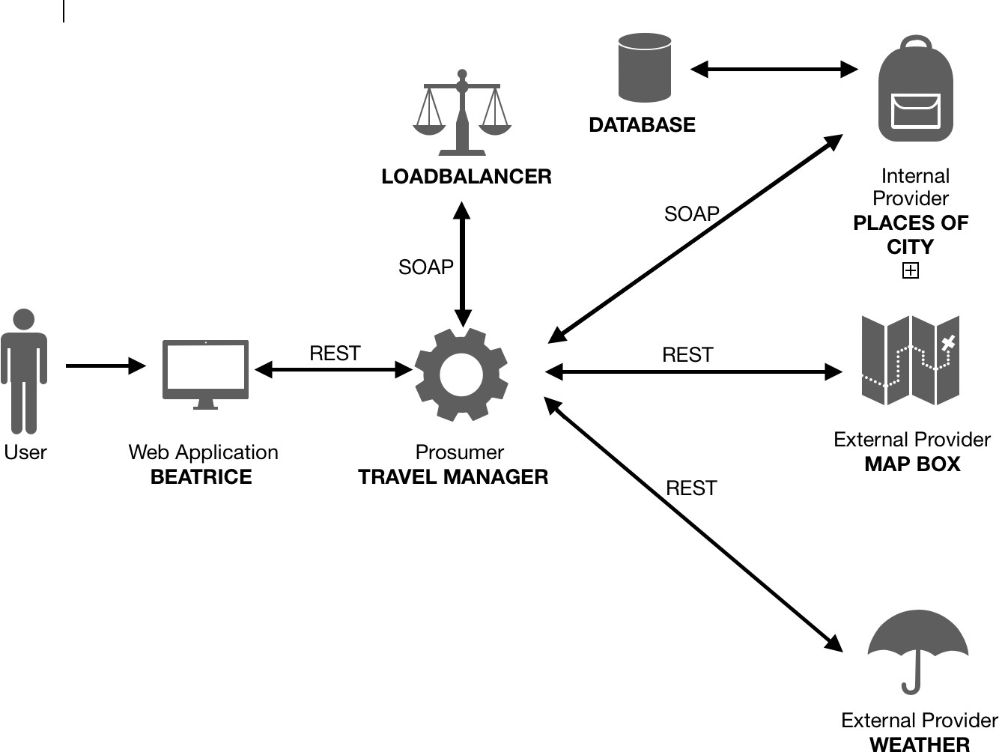</td>
  </tr>
 </table>
 <![endif]><!--[if gte vml 1]></o:wrapblock><![endif]--> 
<o:p></o:p>

 

<o:p>&nbsp;</o:p>

<![if !supportLists]>•&nbsp;&nbsp;&nbsp;&nbsp;
<![endif]><b style='mso-bidi-font-weight:normal'>Beatrice: </b>è la componente che rappresenta l’applicazione web con cui si interfaccia l’utente. L’implementazione
è stata realizzata tramite Javascript,
html e css.

<o:p>&nbsp;</o:p>

<![if !supportLists]>•&nbsp;&nbsp;&nbsp;&nbsp;
<![endif]><b style='mso-bidi-font-weight:normal'>PlacesOfCity: </b>è la componente che fornisce informazioni sui luoghi consigliati della città. Al suo interno
fornisce i nomi delle attività,
le coordinate per raggiungerle, orari di apertura
e chiusura del luogo che fornisce l’attività
indicata, il clima consigliato per svolgere tale attività ed il suo profilo che può essere
uno tra: Nerd (se si desidera visitare
musei o monumenti), Adventure ( per attività
sportive o ricreative) o Tasty (per pub e ristoranti). Permette poi la registrazione dell’utente al sistema e quindi anche il servizio
di login. Inoltre fornisce all’utente registrato di lasciare
like e commenti ad ogni attività presente nell’elenco delle proposte del sistema. Questo servizio
è fruibile tramite il protocollo di
comunicazione SOAP.

<o:p>&nbsp;</o:p>

<![if !supportLists]>•&nbsp;&nbsp;&nbsp;&nbsp;
<![endif]><b style='mso-bidi-font-weight:normal'>MapBOX: </b>è la componente che fornisce la comunicazione con le mappe e le funzionalità ad esse connesse
( come geolocalizzazione, informazioni sui tempi di percorrenza, indicazioni stradali, …). Questo
servizio è fruibile tramite
comunicazione REST.

<o:p>&nbsp;</o:p>

<![if !supportLists]>•&nbsp;&nbsp;&nbsp;&nbsp;
<![endif]><b style='mso-bidi-font-weight:normal'>Weather</b>: è la componente che viene interrogata per la richiesta
delle previsioni meteo della città in
cui si trova l’utente. Questo servizio è fruibile tramite
comunicazione REST.

<o:p>&nbsp;</o:p>

<![if !supportLists]>•&nbsp;&nbsp;&nbsp;&nbsp;
<![endif]><b style='mso-bidi-font-weight:normal'>Travel Manager: </b>è il Prosumer che gestisce le richieste
fatte tramite la web Application, servendosi di servizi a lui esterni (Providers). Il servizio
finale fornito dal prosumer, per quanto riguarda la parte di visualizzazione e di filtraggio
dei servizi offerti in una città, è un elaborato
dei servizi da lui consumati: condizioni meteorologiche, orario ed attività
di una città vengono combinate
per fornire un elenco delle attività da suggerire all’utente
per visitare la città. Travel Manager fornisce
inoltre delle REST API che permettono di consultare la mappa della città con le sue relative funzionalità, descritte in dettaglio
precedentemente in MapBox. Lo stesso vale per i servizi di login, registrazione, like e commenti forniti e spiegati precedentemente in Places Of City. Per quanto riguarda
invece la comunicazione, il prosumer utilizza
sia la comunicazione SOAP ( per comunicare con il Loadbalancer e con il Provider Places
Of City ) che quella
REST

( con i due
Provider Weather e Map Box,
e con la Web Application Beatrice ).

<o:p>&nbsp;</o:p>

<![if !supportLists]>•&nbsp;&nbsp;&nbsp;&nbsp;
<![endif]><b style='mso-bidi-font-weight:normal'>Loadbalancer : </b>è una componente che gestisce
il carico di lavoro tramite un algoritmo
di scheduling di tipo round robin: quando viene fatta una richiesta
al prosumer quest’ultimo invoca il Loadbalancer per richiedere l’indirizzo di connessione ad uno dei server di Place Of City. Il Loadbalancer restituisce un indirizzo di connessione al servizio a seconda del numero di connessioni che ha assegnato
in un certo intervallo di tempo e a seconda
del numero di connessioni che questo supporta.
Di conseguenza, nel momento in cui ad un server vengono assegnate
un numero di richieste pari a quello massimo che può supportare ( numero scelto nell’algoritmo di balancing ) in un determinato intervallo
di tempo, il Loadbalancer verificherà la possibilità di passare la richiesta al server successivo nella lista dei server disponibili, tramite l’algoritmo di Round Robin, fino a trovare il primo server disponibile. L’interrogazione viene fatta dal Prosumer
al Loadbalancer tramite chiamate SOAP.

 

<h1 style='line-height:12.3pt;mso-line-height-rule:exactly'>DIAGRAMMI</h1>

Questa sezione
mostra lo studio dinamico del sistema rappresentato tramite sequence diagrams.
Forniamo quindi di seguito 8 sequence Diagrams
che rappresentano tutte le azioni che è possibile compiere con l’applicazione.

<![if !supportLists]>1.&nbsp;&nbsp;&nbsp;&nbsp; <![endif]>REGISTER

Una volta che l’utente inserisce le credenziali per registrarsi al sistema, il client Beatrice
le invia, tramite
chiamata REST, a Travel Manager
.Il prosumer chiederà
quindi al Loadbalancer l’indirizzo del
provider a cui fare richiesta. Fornitogli
l’indirizzo, Travel Manager invierà la richiesta di registrazione, tramite SOAP, ad uno dei
server su cui è disponibile il servizio Place of

City .Successivamente il provider controllerà se le credenziali precedentemente fornite dall'utente sono già esistenti:
se così fosse lo comunicherebbe al prosumer che, a sua volta, comunicherebbe al client l’impossibilità di effettuare la registrazione con quelle credenziali perché già esistenti. Similmente, quando la registrazione va a buon fine, per prima cosa il provider
genera un token ( o userKey
) identificativo relativo
all’utente che si è appena registrato e lo salva nel database
associandolo a quell’utente, poi comunica tramite SOAP con il prosumer
l’avvenuta registrazione. Una volta che il prosumer sa l’esito della registrazione, che sia andata a buon fine o meno, lo comunica al client tramite il REST.

<!--[if gte vml 1]><o:wrapblock
 pagebreak="t">
 <v:group id="Group_x0020_13" o:spid="_x0000_s1037" style='position:absolute;
  margin-left:26pt;margin-top:17.9pt;width:542.4pt;height:370pt;z-index:-251656192;
  mso-wrap-distance-left:0;mso-wrap-distance-right:0;
  mso-position-horizontal-relative:page' coordorigin="520,358" coordsize="10848,7400"
  o:gfxdata="UEsDBBQABgAIAAAAIQCxgme2CgEAABMCAAATAAAAW0NvbnRlbnRfVHlwZXNdLnhtbJSRwU7DMAyG
70i8Q5QralN2QAit3YGOIyA0HiBK3DaicaI4lO3tSbpNgokh7Rjb3+8vyXK1tSObIJBxWPPbsuIM
UDltsK/5++apuOeMokQtR4dQ8x0QXzXXV8vNzgOxRCPVfIjRPwhBagArqXQeMHU6F6yM6Rh64aX6
kD2IRVXdCeUwAsYi5gzeLFvo5OcY2XqbynsTjz1nj/u5vKrmxmY+18WfRICRThDp/WiUjOluYkJ9
4lUcnMpEzjM0GE83SfzMhtz57fRzwYF7SY8ZjAb2KkN8ljaZCx1IwMK1TpX/Z2RJS4XrOqOgbAOt
Z+rodC5buy8MMF0a3ibsDaZjupi/tPkGAAD//wMAUEsDBBQABgAIAAAAIQA4/SH/1gAAAJQBAAAL
AAAAX3JlbHMvLnJlbHOkkMFqwzAMhu+DvYPRfXGawxijTi+j0GvpHsDYimMaW0Yy2fr2M4PBMnrb
Ub/Q94l/f/hMi1qRJVI2sOt6UJgd+ZiDgffL8ekFlFSbvV0oo4EbChzGx4f9GRdb25HMsYhqlCwG
5lrLq9biZkxWOiqY22YiTra2kYMu1l1tQD30/bPm3wwYN0x18gb45AdQl1tp5j/sFB2T0FQ7R0nT
NEV3j6o9feQzro1iOWA14Fm+Q8a1a8+Bvu/d/dMb2JY5uiPbhG/ktn4cqGU/er3pcvwCAAD//wMA
UEsDBBQABgAIAAAAIQAXA94psgQAANAMAAAOAAAAZHJzL2Uyb0RvYy54bWycV9tu4zYQfS/QfyD0
2CKxaMtXxFkskmaxwLYNuu4H0BJlCSuJKknbSb++Z0jRlh1nky6CSKRmODxz5kL65sNTXbGd1KZU
zTLi13HEZJOqrGw2y+jv1cPVLGLGiiYTlWrkMnqWJvpw+/NPN/t2IYeqUFUmNYORxiz27TIqrG0X
g4FJC1kLc61a2UCYK10Li6neDDIt9rBeV4NhHE8Ge6WzVqtUGoOv914Y3Tr7eS5T+2eeG2lZtYyA
zbqnds81PQe3N2Kx0aItyrSDIX4ARS3KBpseTN0LK9hWly9M1WWqlVG5vU5VPVB5XqbS+QBveHzm
zSettq3zZbPYb9oDTaD2jKcfNpv+sfuk26/to/boMfyi0m8GvAz27WbRl9N845XZev+7yhBPsbXK
Of6U65pMwCX25Ph9PvArnyxL8XEym82SGcKQQpZM5vM47iKQFggTrRsPIYZ0NJ752KTFb91qHmOx
XztN/MKBWPh9HdYO2+1NW6YL/Hd8YfSCr7fzCqvsVsuoM1K/y0Yt9Ldte4XQtsKW67Iq7bNLU1BE
oJrdY5kS1TQBtY+aldkyGsaTJBlPJsk0Yo2oQSvUaHfGE2IhaPu1gnxzQWKNuitEs5EfTYtMR/1h
ffiktdoXUmSGPlM4T6246QmedVW2D2VVURRp3HmOYjlLtgvk+US+V+m2lo31lallBRJUY4qyNRHT
C1mvJbzVnzPgTNEVLDxtddlYH2qj07/ghitJY7W0aUFYcmDqviPeB4Fz4IiZvDNI4zczc8znpxkW
svN7+QXOtbGfpKoZDeAEgLq8F7svhiADWlAh0I0iKgPtBKyLAHBSc0K3M4FhzF5w/L8K+mshWgk0
ZPaYVXw4no0ms3gGf31WPWgpqZUyPibGO/VQ/KZf+c6Ql5Da+5idUwKjeDn3eSsWgdt5V/Scu7I+
1K1YpFvPK5EWuEQbzcAqfdpkHfYVLOR1heb86xWL2XiezNzDp85RDanl1X4ZsFXM9gxbu4w6qgyD
irMEsGNGj3O1UVCDJadU4NV1paOxJGh9H9Y4qBGs5CKsSVDpYM2HF2GB4oODnEPpIiw0yvewhdQ4
GFvNLsLip8Tz4Wh0ERfvM++0LgLjp+xP4tErcezTv+LDy9hO2ed8mlzG1qffaV3GdhqC13OsH4MV
n1zGdhqCV9OM2tEhBqd5hjI5FIIofJ9BxTw1XXFgxND+6ZylWmmVoSN0hUCgCFcjSmiYgBZJX1EG
M6Q8fZey75wrhPo9pjlCSLZ9ab2JhPvmsQIhPet+Wecwdd3zm5yOGG5ya1oDCoQlnsKQ7ZcRtZ6C
etLMkVSrnVwpp2DPLirY6iitmpda08BSEIZ32zN1bHFBGt5ei/CAlXHwMkjDu2/LtS7ACrK0UkZ6
cshTf+oEl4mpXjM1qiqzcJ4bvVnfVZrtBO7ByZD+OpJP1CqXKcezi3bGJuEE8EfGWmXPOGe1wjEI
X3D5x6BQ+t+I7XGRXkbmn62gm1P1ucHBNudJAjXrJsl4Shc83Zes+xLRpDC1jGyEzKbhncUMS7a4
KGwK7MRdGBv1ETfPvHRHL+HzqDqwOFvdyF2bHUvdFZ/u5f250zr+ELn9DwAA//8DAFBLAwQKAAAA
AAAAACEAK+oO/PmAAQD5gAEAFAAAAGRycy9tZWRpYS9pbWFnZTEucG5niVBORw0KGgoAAAANSUhE
UgAABtUAAASpCAIAAAAvOAE+AAAABmJLR0QA/wD/AP+gvaeTAAAACXBIWXMAAA7EAAAOxAGVKw4b
AAAgAElEQVR4nOyddVwU2xfAzywgCEirhKCi4s8uVFTs7u7u7o5n67O7RUARFUUpERGkU1FRJKRB
QqRDBYn9/THLMrXL7rK7rL77/fh5b5m5cWbmnnPvPbcwNpsdHh9dwa4CBEJIurX6nxxLrr6lQEgV
ZC4QCP4gw4gAZCoRdUBCNgSVSQSCP+JVPaRxCIR0QA3vPwv58PjohWf31LcYiD+SO1uOmrbpUN9S
IKQHMhcIRK0gw4hAphJRFyRhQ1CZRCBqRYyqhzQOgZAaqOH9ZyGPj8yMHDC4VYuW+CWs+j8YGwAA
WICxMUIUrPoi528W9wZGDUb4u+YeC4CUHmB4CmwMTwqrjo8R/iL9xKp/sgh3uGmyalIAchqk/2PE
YFRpiUJjlIwIT4kRgjFLSApWHZr4KnDY1IwAgIVVv2KMJhoho5ovgRFjY2wAFiUjNsZmkS5QpcVo
T0QKQ3jM97GR11ztqIEQfzt0c4FD1ACuZaCZDnJwgg0BcomkqBnpMvkK8U+uGaFHJCoa0chU/6Ka
GsItWjCSqCTLU32XbiAoqVEeAv8PLRYPo1QTjGxXeNgoahrERPm8TMp9wi+Gd47DxqhhGa0Z8Hrd
DCKxiOUJo2bIsXKUWIRvzSb8SY7ISZCpGNT23imWkPt/FhsAICzuMzKMCGAylaK3rIConXVvWQGl
TUFKmtoOwZhbVrzSIKgH9xKPlhUlL4yhZUWUqeYe9aUxWqe6N67IwWpvXFX/5tW4IkjLu30l0caV
cNU38KrBa6m+qxPCGK6Rr1BC8KjB+VXfQCwgDPUqLQxVWmoNzqv6JidI/cmr+qYJRYjHXH0D/xqc
d/VNi8QoA8b8znHYPEUiVd/A+LoZRCJV39V3GWpwPtU38K7BeVXfwLcG51V9AwCLLf7qm5fGUXIX
QOmA+/7In0IQ1QOmV0K9Ikj7GYTUQfoFYiAW7Y6AbWlysgxqjzGIB3zLRXUIkbSSnjR/Q0cJIqR6
MooHTG1smiDM4lUrIJ+WNjCoKgijrVCrkeT9YSi+ILraAmp4/5nI4/9r1aJlK6OWFCvCLRrEJhRG
1kOMSXdIKZDNAW652KQCjjFmBAJkRG+5Utu+GLFgM2TE1RbG9ihGeghKMBY3BTbGBmCRHShElSEp
F0aUgpYRi00PRkiBZlvpGRG6HNQUiDUvkzw1KXAbIoQuEM0IIG3/r8IxF8BcJTCUTkIY7hU2uUtH
rH2Ims9QURH+R2s/UWwLo0iUC0DTDlossiHh2yhhqmUxSmr0jjYpFtcoEQYMaCnTMyHEJjdEatIg
dJVZQGv/kWwlQ8qcUOQvRReJ1CxgjEZNnOlr8heJ0FbGKC0djOE/5HwYnoOaOLEnxmjYCbFIibNZ
gAwjgouwLSuCVeRXRzNqDQuAjRFLLKWpQU6EuTEA5DJPsm/0xhU1BbIdrVZSciuCFoFruARrXNXY
BOr7BIbGFcnRybtxRQxZkxpQG1dQYxxoDyWwSCwmlyhVJEnakFYtWhobtWB4NlpdSRSbe4tWUIFu
uonlhiFxHgafVw1OlIAkL1FMiqyUFgUhc7rXg1w3UZ+XVn1TRaLE4lV9UxOnvAtCbJqzj1SD86u+
gfy66TU47+qbngShBudZfQMPW1TzJ0keQuIAwFSDM+gSPR+aTEwaWnOHVw3OXOxB/KpH1zjeuZNF
JIRk0juglnPyNUpWgmsf8FJArhwC6SBNPEoBI4ekhGb2IVIfjUE8elwhVRKor6o6AV7taiArJjDq
Jn8Nqg5IM6T8xBOwjQ0048tHT+lxhW9sM+bCU2GB1uQG3jpLiEbKAjW8/0ToY0r0H3SFZ4ApIv0m
Q8ZM4flmxGAfhROMDpsyokTOSHh4x2RKlPFaXTMSNAUEoq6IUNRorShJZST1WKLEEy0WJ6qQEBtJ
CARCOgjYzqG3i0TKRCzB+KchYCICmhpxWCRBReLX3hKw1cooLkMbmEkkeg+/DvZfsohanYnSeqZP
qhI0L1l9e/WArL8J6bVzRItF9U7JALL+SYWG8YEk+JTS/6RC5SimJxciGaFylD2FQPw9yNdyn6mo
sukDSKLDNyWmEQKJZCQQMqKJoj6A0C+z9mBpKamNquQBQEdHR1tbW0TBEH8J0mopSbkR+5ciijlj
7E9LKpookUTrjtYhFjPIMCJqhT6yy2by9/Ad2a35zd81RpvQwav0StNEiteDKRaEbhoJG4EFwDDW
zZQa14YAQNu2bQXL54+HeeGpIIjqKRUhlnTHJkWqqEWIIvKIh/ARRVNp0V67CHlJQfUkaGd5fEjx
eJ2YUuEz3UaYPIWAZ7riyVDG+wmyIp5QcgjVBxC5yv9vVpp/LgT/o7RKtegtDGaEm2zIBP82oYAp
yBDifsN0OBmkpaXJ/arAf6NuNgJEnbYjtVgieppEamVLrbkscl5/AH+Ar5khJ2QYETWIMuFDDGOE
As64JEzWY7pbM25L9WDySE3yiieBkdS6IoEciDZE7F0pET6TlGagAYB0K8E6rHOScaT5xUSJyBap
WSUFJKp6tcBzXEja0waFRAxOT+lrolBmEGNaJSlRhBRPcoII61Kohw+JU5+aixAe/utI6DeEbPCJ
Xg5lxLDKwmRDvilIYoqo8DcRCCp/aYERumskmvOSaasaQWIJHYODaFMzpDjnRFqxWCKN3/ylhR0h
XupjdmEt/VaG22LZ2YY+H5PRXBC8nwwnvdA3xpGqojFlVptxkBmXqCCIYuhk3atVt+yklI9ozgKp
ThsU3tkiVV+zaEsqpDI+UkeE8zpJTg6ZyVFMyMokIRn/ZEKKJ4anqY/l6giZQHw6WYfNdwS4xS+Y
sDWRsFUQvYlMhE8TWVhVIeyPzlcOoTOizlwgPBFDVD77EyHlRwgO2j2qXhBtnFa6cxH+0k7s31aU
EFJC6JFdJqS3skTgYHXZWVvozRb5p8ZsFAUcKa8Px7EM54e2b657LE5UIUHbN/9d1NtMMQpCFimZ
9jrx0kfGykgsiEchZWgmtrQn20p+ySZCFiHt/yhgGRD26BgM4J/lm74mJs1etXj09Mn7lm/8mpA0
Z/WS0dMn8QrP8wc5px8lP2Ijv3Q361EdjLejjZzFzuXrY2O+cC8qKimpNlLt2rPH/BVLtXS08Iw2
L1kT/yWOJBgGAKCkpPT0tRt+BV+5ffviNQe7xwBw5NzJnmZm3PAnDxx5/eo1MJmnbqY9Tl25sG7x
ii/R0dyL8vLyyqoqrdu0WbdlU0vjlrjYsyZPy8rMXLB40ZJVy7kP8iY09PK5i5GfIrK+fTNu3Wr4
yBE7du9SVlXFM1o2f9GXmC+0PKFhQyUvf1/6deL7EXAtugijowiEpJG13aMuHj7l/9qb8Vbn7t0O
XjixY/mGeIKqysvLK6uotGzTatmGNYbGzcmZYXcu33CyewoAB84cN+3Tk3tr5cwFGWkZPcx6HTp7
ghjl+J5DQb5+zYyMbj68u3HxyvjYWLoYSkoNHb3cAODkgSOREZ/79O+3essG/g+2fM7ClMQkAGjW
3MjKzha/mJeTPXPcFPz3pOnT1m3bRIxy7eJl+4d2APDv+TNmfWosJAawdvmqyIiItu3b3bS6w71+
8ujxFy7PJ06evHX3DmI6Vy5cfPzgIQCcuXDerG8fumzRUVHWd6zehYV9+vhJRVWldevWS5Yvnzl7
lpycHP5Qi+Yv+BIdQ4/YsGFDnwB/AFi4YGFUVCT3ury8vKqqqolJ223bthq3asX3xSAQEoB5XXTt
l64dPxsbEdXD3GzBuuX8Y9ZFpJiIqL1rNwOA3evnCg0UFk+YWZCfv/XgngFDBwmV5PqFK5LiE5at
Wz159gw+GQskHbcdyPjmaC5H/p0tYQd3+QdjrqFkovcl7TmD+5dv+pqYNGvV4lFMHYHYz9FHNuwE
wKzcnyooKNRFwB2L135NSsZ/n7hzxbi1MfHu9iVrkxOSFq5dPm7GZOL1k7sPhQWFcMIc3W82oK+w
+W5dujbxC6fOZcnJKSoqNmnadNnGNV1Mu+EXzxz8Nzric2/zvis2r+WTjsWlaw52TwDg8NmT3Hqf
2Kd49+btzfNXoiMis7K+tWjVavCIYZt2bVVRUQWAdYuWx39hqPcVGyq5eL/Cf394E3bxzLmYyKjM
9Aw9A/2eZr237t7ZqjW3smOYpeDt4Wl7735kRMTXlNSWrYw7dO60bddOk7Ym3ABrliyPjIwkRsHT
OHb6ZP+BAxkfMzQk9NLZcxGfIr59+9aqdevho0bu3LOrkaoqAEyZMDEzI3PxsiUrV606sO+fVy/d
GVPo2avn79/lH8PDVVRVnF2fN2qkhl8vLS0dN3ZsQUFBt67dLCzvEOWRGmKZeClU+1ZMDyjtLHcs
W58Ul4AnhmEs7cbaugb681Yubt2OupzW+uotF7tnALDv9LHuvU25188fOuHn6cUoVKce3Y5ePMX9
k9ii7mHWkxAQti5bGxtd0zJXVFJs1KhRt16m81cu1dbRokhyi6uh506amvWm3P0Q9u7q6fNfoqIz
0jP0DfR79O61ac92bmNyLW8Nfe7twfSGOAjXB+f5aYT4ZmLaFVQsyESViagjzOfPENpe1NYV4xbp
TBFJ11ITEuMiYwpy8wEgNT4pLjI6LzefR3j6JYabLABPZ7fjO/4ZPXUi1/8oOEkJiTERkZSLAV6+
r5xc7TxdVBs1AoCk+IToiM/0uA0bNiT+WVlZaXHlWlbmNwCwuWVJ9D+mpaZFfYpgFEBTUxMAEuPj
P9MCBPkFuDxztH/h3LlrFwCIjY5JTUn59u0bN8D5U2eOHzpSWVmJ/xkZ8Tky4rOD/bPgd29UVVUB
ID4u7tPHj/RMlZWVGYVBICSNNGcxyM7uURlpaXQ7g6OhqQEAKUyG6E1AkLuji6XT445dOnIvVlZW
Wl25mfXtGwA8sLAm+h9btTV57fYqITZ2+8G9uO0CgN9l5Y+sbUqKiwePHA4AifEJUZ+YrJkyx5p9
ePc+0MdPTV2d+2S8Hir+SyzuwouM+JyT9V2naRMA8Pf245qy3mTPYGVl5fWLV75lZgKA1c3bRP8j
ACTExUV8/BTx8dPIUaOmzpyOX/ya+jXi46cePXtS0rl64VJmZiYAWNy81btfH4qQ4R/CJ4wek5+X
j//58+fP7O/ZwUHBPl5eN+9Y4L2ouNi4j3xtY1xs7MdwagBfH9+n9vYv3d27d+/O67UgELxgGhBl
btXwCs8/WUai3n184x/USF1Noo31Xz9/4hasil0FAHHRMbnZOYUFhQAg+GgmACTGxUdHRObm5Igo
hxjW31BbrRSYVpTzS4TrtmEMJpuHX4skiojbN+OdgvzcfMbbv37+jP0cDQBVVVVk8YTOLSUhMS4q
Rl5BnoWxKsrKKHeT4xO/fI7Ky8mlXM/O+p6SkFRWWlpVVVVSVCxgXsS2R3J8QjStcvdwddt/6tjc
5QsB4NO790G+/mrqanweqbKy0uLKdW7/gljv41w5c+HskX+53YGYz5ExnyNdnzl6vAlQUVFJiE+g
dzGAUO+/cn25fN7C32VlAIBhWEpSckpSsrvrC89Av5atjOkRAeDwvgOXzp7n/hkdGRUdGfXcwenY
6ROLly/DL8bHxUd8/ESPW1RYxJjmmZOnjx48xH2KzxERnyMiHJ7Yh34IU1VVjYmOTklOwV9Camoq
Yw0OAJpaWsdO/Nu/T9+qqqqjhw6fPHMGv372zBlfH185OblbN2/RIsmQ9gmCJOe+Mr8KIece1pXk
+IQvNK1xePB4094dizeu4l6prKy8e+XW929ZAPDQ4i7R/5j5lWerW11Tk5gCsUVN8T8ydv/9vXzc
nFyevnblNrOBrqFk/6PnC/dV85dQ9MvD1e1FkHdLY2MAqFVD/+PIVP2IEC98rZlk1qRsO3ng4qM7
g8cOF3jxCzOOto9zswVsrTJnNHbKRLe3/i/e+j8P8dpz8jAAxMZ88XZ/TQozeaJrkJdrkDf33zPv
l8QAPh5euOkBgBdOLvl5edxbuw7/4x7i5x7iZ/34AX7l7PXLniH+niH+p69c5AYbN3miV2jg65AA
zyC/s9cuqaiq5Ofn21haMz5I2Nu3Rw8cqqysnDVndmj4+/fREfsOHQCAlOTk82fOEYNOmTY1KCw0
OCw0OOxN8Ls3we/e+AT6CfyuBXEyI/7bCF8Q/mu7R23av/Opv/tTf/erD63wK0eunHXw93Dw9zh0
4TQ3nxETxzkEeDr4ezz1dT9y6YyyikpBfsFj6/vEpPw8vLOqByFeOj/netkAYOLMqQDwu+y3h4tb
TfjXXiXFxQAweeY07sVxUya6Bfu4Bfu6Bfu+DPZ9Gezr5M08lYALr3fBYrHYbLafD2c+tb+3LwDI
yclx7hLcDq9feeDORwB47uicR7CQRPbt2FXMt5vn6f4qszodJwfH/Nw8IFRg4R/Cx40cnZ+X39us
t5unR0pmurOb69BhQwHA1ua+m+sLYlLTpk8LfR/G/ffmfZhfUCAxwJSpU8Pev3/77t2bt29v3rqp
qqqal5d3x8ICGT+EeCGO7NKuMQTj78wS1DVWiyzVf0uwtAuYtEwffi0s/B+mZg2KLCwukbyh23bi
wLlHFoPGjpB4TgAAcOL2ldDM2NYd2lGu7zl95NqTu0PHjaJcP2t59W1aTMs2rUXKjcVd7Dlm8gSn
QA8HX/eL1reat2xRWVlpeY3uBePEol/y8XjN7V+4ObsUkGvPD2HvTh86VllZOXX2DK93wf6fw7bv
3wsAqckpV8/WdDHGT5nkEez3KtQf7314hvi7+njijTGLK9d+l5WNGDPKJyw48Xv6PftHCgoKxUXF
50+dYRTxpYsr7nwcNGzoK3+f+IxUV69Xpr16lpaW7tqy/UtUNDHw+MmTAt6GEP6FDhzEMPnx7Zu3
h/cfqKysnD13zrtP4Z9iovYfPggAycnJ50+fpQQ+fPRoyLu3oe/D7B0d8Cs3b9968/7dm/fvrt+4
0bNHj3Xr1wHAlctXYqKiAeDr16+nTp4CgHXr1/cwNQUmpFery8pMMeY8ZWcZ7KgpE574uj187XLe
5nZ3s56VFRUXjp6MjapZuRLg6YM7HwHAw8W1kNAe3nxwt0OAp0OA5/VHd/Erx66ccwzwdAz0OHqp
ZvIjpUVdkM8wEDJ+6iTPd4EeYYFuIX77Tx4FgLjoL17unsT9J0ga6kTVUIurN36XlQ0bPcrjbUBM
VqrVY1sFBYXi4uLLJ0m99fFTJhHVE9dQYgCh6mLeYQVYNyF5hBIP8RdDn/9YpxKQ8+27g/XDpJi4
pob6PQf07dHfTKkhac4dG4OIsPDcb1kNlJT0DQ3xi7Gfo54/epaWlGrUqsWoqRPbV8/6uXv5Vl5W
9tTFc78mJXu5uP8oLukzpP+keTMxDLOztEmIjQOAsMCQ03uPrNq5qZFaI2JGER8+utk7q2uor9qx
kZe0jdTVjdu0xs95MGn3P8uL179lZBblFxJfhYa21v86tsdbBowbq9lZ3QeA8VMn+732LiwosL//
aMXGNfgtA8NmBoaGAKCiwnkJLY2N23fuCGRHjLa2Nn6RxYbOXbt4v3r93NHp4/sPjDIf2vMPm83u
btrjmqUFbpK27tqRlJgYEf6xvLwcCFWIlo5Op86dOSPGog0cc0FmAcEDStGwuXCzpLBw8pK50R8+
hnj6ycsrDJk8xrR67ZLlmSu/Sn5MXDzbyepBfm7+hPkzuvTuAQDFRUXBr7w/BIf9KCpu0+F/ExbO
0tDiDFSW/vrlZGMX/T6iuKBIU0e734iBQyaOwW/dvXC9ML9g6ITRHXp0BYAvEVFu9o7KKiord24E
gIsHT7Cr2Eu3rPVweP7WP1hbt8m0RXOM27Z2fmAf/NpXS0d71IyJnXt040r+5XPU8wdPvyanNDdu
OWb6xP916YRfv3Hywo8fJTOXzH9sYZOXkzt98ZzuZr2IjxzxPvzlUxc1TfVV26imRq+ZgZ5hMyBM
rzNq2aJtR2oXSEtL63/VFzt26Rjg6e3u7BoZTpo+8PiuLQCMnTIxwMunsKDQwfbxkvWc0eC2Hdq1
7dDuS2T082eOk+dwVi+6ObgAQKcunVsRVkVpaWu368SxrnXs2Xfq0vnjh3B/L58pM6cDgJ+3DwB0
7Nzp44dwSsj7VncBYNK0qT6erwsKCuzuP1i9YT09waysrGMHD504x9ztAYB7llYAMHX6tNeengX5
BbY299dtqnnhd27eKiwoaNGixQuPV4qKioDBkGFDe/ToPnHsBH0Dfe7EChxtHZ3OnTtz/6RbRx0d
7U5dOgMAC6Bb927uL92fPXv27v17gV4NAsEf8dSndU2lpLDI390rLDC0pKjYpFO76Yvmamhr4WaB
zWa/sHcMfO1bmJevZ2jQpkO7afNnKzRQwLP89O6Dk+2T7O/ZPfuZtetcM0e7plXDZtvft/P38FJW
VR03bZL5kAHVl9kuds/8Xnvn5+XrGzZr16HdzEXzFRo0oMvGZrMd7Ox9PL3y8/INDZu17dB+zuL5
Cg0UAYPr5y5lZ32fv3xJcnyim7NLcVHxwKFDZi+ez51vmJXxzfqWRUx0dDNDw4FDB/cfOFBJhTOX
5POnT4/u2yYnJhm3ajVt9syu3Tj2/8SRYyXFJUtXrrC4cTM3J2fxsqV9+vUT9D3ydRz/cXBq8KVz
Y95/Cvb0FaAGN+VVfdvdss5O/9alj+mAUcPx6O8DQwI8fDQ0NRZsWv05LDw767uikpKeoQG+fXPk
+4/P7Z7lZWV369ezbccOFMEo3YR2XTridvvmqQs/Sn5MXzLP3sImLzdv2qLZXckVNBF6rffx7fvs
zCwlJSUDo2a8YjF+14j3H188dVTX0Fi9YxPTfQ4a2lrtOnYAgI5dO7PZ7E2LV6YkJCYnJrUwbsmc
F7mXYWd9HwDGTZ3k/9qnsKDA/v7jZRvWcO/+u+8Qm83u0qPbhdvXcSk37NySkpT0+WNEZXk5N5gW
3sVg2u49OioaANp37Pi/Du0AYMTY0XsO7Y+JjmljYkILCwBw5vgJAGjfscNjp2csFgsDMOvbx8nd
1bRD18yMjAN79j1yfErIV6tD505Q28TV/Xv2stnsHqY9blvdwYPt2L0rKSHxI6dTQ4poaGRoaGSI
YZiKsgp+xbh1K2JtfuDwIQcHx6+pqZs2bHjp6bF7566fP382b9780OFDvATgIHvqK7m5h/XgdeKZ
JcMNTS2t/3XqAAAdu3UxHzpwotmQjNS0qyfOXbS5jQd4eu8hAIyaPCHY27ewoNDhkf2iNZxtRvSa
Geg1MwBCq7u5cYt2HTtQTnR8cvcBUFvUKyliqKmrt2zTBv/dtkPb25euZaZnFOUVEsPgGjp+6iQ/
jobardiwmns3NioaANp1av+/9u0AYNjYUTsP7ouN/tLKpA0xES1t7Q6dOor1o4jBYSnJk2HEIJ7s
6StCOJjXXzNS69ylqHfh2+es4E6wf3L7nvnIoSfvXSelAeD+xCkuMrqxvl73vr0B4LXzi/1rtpb/
5lSWjy3u7b90esy0iQDgavcsISY2KTY+0Iszy8bD2TUzLX3N7q2vHFwzUtMAICYiMiYicsG65RT/
Y3x07L3rt/UM9Pn4H3/9+JGZngEYu+L379eur75lZCopKQ0aNYwYJj8nN+rTZ1xy/PkbN23SRFcX
v5v9/buXuwcAzF44T0NTw8bC6oHVXa7/UQQFycvLi4yIAIDBw4eRUsAAANhs9ru3YQAwe/48Yqyr
t27Sk8rNzv4Y/pG4BEi3qa6unh6PnDkBZWcEDPFHwSk3Lx7Yf0/PTIj88iEwFL/i/thxw7/7Ji2Y
BQDO9+wKcnI/BITGR8UAgPmIQQBQVFC4eeqi+OqxTZ/n7k/u3D9592r7Hl0rKyo3TVv8+V04i8VS
VlUpKSp+ae/46+fPsbOnAYDLA/uMlK/NW7fE/Y+pCYmPblhpaGni/sdHN62rKis/h32ICOO48j0d
nnfpberzgrPt0XO7p9buz4zbmgCAp/OLf1Ztxq2QP8CjO3cPXTqNb1Brb3U/Lyf3rV8Qvhxs8Ojh
lCdPiImzuW7R1ECf7n8UgYK8/OjPkQBgPnQQ92J21nefV54AMGPhXHVNzQd3rB9a23D9jwAwccbU
UweOBnj7FuTna2pplP/+7fnCHQAmzppOTDw3JyfyYwQQDFOTpk2a6DYVSDJy76VPf/OPH8L9vX0A
IDUx+WtKapOmTVu3NaH4H79nffd86Q4A8xYv0NTStLplcfeOFd3/2MakTVxs3J2bt+fMn9e5W1d6
5llZWe5uLwFg/pJFGlqad27etrawJPofAwMCAWDFqpWKiorcixqamr5B/nQ7nJOdHR7OkRPvGuk1
bdqUh23Mzc39+OkTAIwcUTNVB5lJhJBIs8jwzQsDACjKL1g5aW5sJGe+kqfLi0e3rC/Y3uli2hUA
nljbHtu2jxgp0MP7yiMrAPB8/nLrkjWVFRUA4OX6Ut/IkJ7DhcMn0lK/4r+f2T765+TRBauWAsDD
O/cObN1FDOnj4WXxxJZw+DVH8gcW1vu2kPZ+9X7leffpIwB4+sDuS3RM3JdYHw/OUpXnDk7pX7/u
OLAXAN6Hhs2bPL2goAC/ZXHtxsixY+7aPwQAp2eOa5cs//37N37rzo1bl25emz57FgBY37qTnZ3t
7+OLL4UbPXYs4ysUU+tIpo2HsDU4n+q79OdPu5vWgR7eXP+j5dlrH4JCZ65aDAAv7Z3iImMa6+l2
69MLAHxc3feu2FhZUQkAvm4e+LgdF6Zuwskx0yYBwFMr27yc3DC/ILwwDxw9VLAH5XwF18cOXz5H
NTXQM+1nxj8CHov78eKjv9y9dlvPQJ+//7E6MwwA8rM5q7wpmzjxIjcrx9vdAwBmLpynrqlpa2H1
0Ooe1//IZrM/hL0DgOlzZxNjnbtxmZMnN52cnM/hn9gsjDu1trFuU11dXQDo3a+Pq6PzhVNnAn39
RowdPXj4sFWb1mMYxjgJt6KiIiY6BgBWrFmNOx/xTJQaNpy/ZNGpo8ffvnlDDM+uqvAjEJ0AACAA
SURBVKqoqKgOhbFwyGmy2eywN28BYO6C+cTr1y1uiaYnqqqqF69cmjJhkre397bNW+zs7ADg8tUr
KioqIqWH4IcEvU7VKCkpDRs7+t7123FRMXgS2d+zfV69BoBpC+doaGo8srz32Oo+1/8oCNlZ370Z
WtRU/+OPHz8y0tMBoOJ3uaerW2Z6hlJDpSGELkBO1neOhi6ap6GpaWNh9dDqLtH/2KtvnxdOLpdP
nQv09R8xZtTA4UNWblyLYSzK68jNyYn4+ImodFwNFQAh3qpM1z2I/xhiWt6CYVVVVae2HygqLOre
z+yOx7OrDjbKKsoB7q+9nV/wifejuOT0rkPlv8tnrljkFhmy+fDeivKK8/uO/Pzxkxsm/E3YTQdb
3/hw8+FDAODFEycA2HniQKce3QBg+IQxli52WtraFPeobjO9AcOH9B5oTpWUEMzp8dNBHXoMam86
rGvff/celJOTs3K0MzA0IIZ/4eg83nzYePOh482HjjMfOs58qM1tK+5de9tHFRUVuvp6fQf1nzZv
FgAkxMUHBwRC7WudanB55ji0V78hpn37dOnRtU37pIRELS2tGXNm0SNmpKeXlpYCQDPDZvT0Kd/S
4ekz815m/fB/Pc369TS7feMmSTAh9ycS/IkQ/024BSMmPGLTqf23Xz/rM2wQm822OHaeuD4iNSFp
y8n9i7ev7ztiMAB2YPmm+KgYgxbN9109der+jXZdOxXk5B5Zt7OstDQ2IvLzu3A1dXX32DD32LCD
186YdGof+zmGzRa0EBYXFjm89bYLeNmgQYP83Ly3foGWL+0f+btpN23y88fPAA9vACgpLjm140D5
7/LZyxe9igrdcmRfRXnFmX1Hfv34wU0nJS5x79ljq3dtGTCK2r3RNdAzHz7EbABpvoxQOvLSyWWy
+fCJfYeNNu0/sL1pamKyhpYm0XXo8OBJRUWFrp6e2YB+U+bMAICkuIQ3AcHcvCZMn4JhWEV5+Ssn
VwDw9/ItLiqSk5ObMI20p76rg/PYfoPH9hs8pvrf3VuWwkhaQ5t2bXUaN05PS0+MjcdXYfcdYE6f
YGF3/0FFRYWevn7/QQNnzpsDAPGxcYH+AZRg85cs7tKta2Vl5Zb1G2s2/CIk9tDGtqKiQl9ff8Cg
QXPnzQOAuNjYQD9//G5Odk5cbCwAGOPL5TD4lvntmf1T7j/PV6SdvJ/aP+1j2gv/Z2bay8y0540b
NygBenbv3qNr1/bt2rds3iIhPl5bWxvPlwyyhYi6IvTh1+Jwje1csi42MtqwZYujNy5cemTZoVuX
vJzcvas2lZaWlv8ud3/2XElJ6cL9W6Fp0Tv+PQgAvq9elxSXVJRXnNx9sLKiomc/M6fg17eePaD5
EwAASoqLL9tYeIQHjZ40HgDOHTmRn5tf/rvC9ZmTUkOl6w+sPn1L/OfEUQDwdvfAt4kgUvH7t8sz
R6WGSjcf3Yv5nnrg5DEA8HL3KCaEDAsOtXN1jEpPHDpqBAA4PLYHgKqqqh3rNxUUFJgP6P8q0NfB
3VVFVcXd9YWzvUNxUfHuzdt+//69fO2qyOS4wyePl5eX/7Nj94+SH9z3GR8bd/byhV3/7B01dgzD
a5cGsmJPYsIjNp86IEgNzqf6Hj97upy8XFpiSmTYBwDI/JoeHvwGACbOpx4xVFFecW7fscqKym59
ez30f3HxsRXu3cIhdBMWEroJx4jdhJT4xD1njq7atXnASAH9jwB122FAr5n+QKYuBoXoT59vX7h2
7dSFPeu3Hdt7AABatmnVVE8gz0JN/2Jg/2lzZwJAQlx8aEAQfjczPaOstAwADAzpMzdJD/bcwWlk
v0Gj+gwc0Zfz7+5NC/zW8bOn8H0e34a+Obb/0LA+/U1NOtyzsKIlCHjuZWVlANCyNeUoNsy4lTEA
5Ofl5+bW7KR5z9K6sYp6YxV1HRV1HRW1w/8c4N5iVzsv02s6NQwjGaIxduzYqdOmAcDlS5cAYMaM
GaNHjxZX4nVHTErOlAyPAi1UjkIdM8IbcZoyPUN9AEhPTcMXsjg9tK+sqGiqp9u7f99Jc2YAQHJ8
wtugYMETdHjwpJKhRR1CEdvRzr5/u27923Ub3KXXsT0H5OTk7jo+1ie4CAgaaj61xgMQxA1w+OxJ
fKbz+9C3Jw4cGd13cO//dblvYU2R57mDE1E9iRpKhsf3lXq9IdxkW2Hkk+aWK4j6pWb+I927JNQW
6VlpGQlRXwBgztqlbTt1wADOP7ZUUlY25r1/Cgbw8c37vJxceQX5ZdvWqamrz1y+8P71O9mZ3974
BQwew5lsMmX+7J79+wLA2BkTAzy8CnJzWQAmHdrhBzg01aeOW+Ly9BnYv+/A/hRRKTRSU9NqrAMA
v0tLs79nV5SX79u47cytq526deKG0dbR1ifXi9wphCwAu7u2ADBp+lQWi9XNtEerNq0T4uJtLe72
Mee3eIfyYvPy8rh7oik1bHjs9Ml5ixcqqzCcFVNSXIL/kJOrfeKqTmMdIyMj4tPrGejzjyLgdvEI
BH96DTIfP28GBtjK/VuDPX1+FJdEvQvvM3wwfnf07CkTF8zCfxcXFoUHvQGARdvWjJgyHgA0tDRX
jJmZlpTyMSRMz9AAAIoKC1dPmN1n2KCeA/rednsiryAvePU3Y+l8g+aGAKDf3DA5LmHklAn4uEX7
rp383V9/+5oBAJ/ehOFWaPn29Y001GctX2hzzSI781uIb9DgMZyhzolzZkxbNBeYakezgeZmvDoh
gtW7BXn5BdW9OyUlpb3/Hp66aA7xtKgnNg8BYNz0ySwWq4tpt5ZtWiXFJTy0vNfLnHPSi14z/V79
+oQGBLk8dZi5eC6++LrPAPPG5LmN2jraBuT5Snr6eqK1FDHA+g4wd37q4O/tExQQCAB9B5i/qT4w
lIvt3XsAMHXmdBaL1aOnaWuTNvGxcXctLPv1J70xOTm5c5cvDh8w+H3YO2sLqksUA7CxugsA02bN
ZLFYpr16tjExiYuNtbpt0X9AfwAo+805VYDN5hiwd2FhC2bP5abQrl274Z9qJmbqNG7c3MiImIW+
vgFwdtkAAMjNzeX2oxo2bHju/LklS5eqqqjyeBUIBE/qVDzEcawKPVhxQWFYYAgArNqxcfS0iQCg
pa01b/ikr0nJ74JC+w0ZeMfFrqqqCthVsVExRZzDZKCksPB7RmZmegYALN28rvX/TFr/r+3yzWsP
bNxByWbQqBEjxo9lY+yjl0+7O7v+KCn59D584PDBti+esdlVVVVVXyJjCqunKBYXFjZSI2mWfIMG
j92cKtmVVVXw5XNU9Wk2UFRQyF3mMmfxgn6DBmAAU2ZOf/3yFb4VeHrK16jPkQCwevOGzt27AICd
i6OKiopJWxNfb5+c7GwFBYVte3ZpaGisWLPq+sUrmRkZft7eYyaM46S5YB5+gAZ9zJVHp0jAoVm+
i0vqy3zwzRevwQGAWIP3HT4Ev8utwflX370HmZuPGOr74pXbE6cOpt1ePnFks9ldzEybk0+gBoCv
ScnfMzIBYMGGlcZt2xi3bbNg48p/t3Bm4BK6Cesp3YRBo0fiYSbMmT510ZzaH0x8mA0yNxtUi/MR
AD68CfvwJoz7p6a21pV7jJ4FBh7fswWACdOnslis7tX9iwd3rHub9wWAkhJOd4DFkuOfjraODl7v
c4uxrj6nL9BET9fnTdDjh4+eOzgFBwT9LitLT0vfsX5T7vfsrbupel1YyNFEzonkBOSqZSgrLeVe
pMx35G4PXRMAgDv8QL/LC0HcGecuXnjt6VlQUKCpqXnuwnnAlVrGq2qe5uOPlFtIFxW/uwoKDQCg
sqKirLRUXkXlmc1DABg7bTKLxerco2uL1q2S4xPsLG179uvDLxUCtbaocRqpqek01gGAsrKy71nf
K8rL92zYdt7iaqeunDU6uIbiHoCuBA3tY87ZsKKJblPPN4H2Dx65OjqHBgb/LivLSEvftXFLbnb2
xt3buRnhGkqsZfT1a+mtSw0hhzZl2xWKkCUEWn/N/b6Ew6+p3zwtKQX/0cG0K36vo2m3WpvPeKyK
8orhJqSNgb9nZHF/6+g2wX/gLrmK8gpBZBaEsVMnHbxwAtf5kuLilTMWvg0K+XfPgQduz7hhxkya
cPDcvwAswhIhjpUI9Q9KSkgEgLchb1bNXQwA+PIQN+fn+Xl5WlpaAooxc/7cnf/sDfD22bFpa+mv
Xx/DwxcpLGUKiLU0bslisaqqqjIzMog3MjMzq6qqDA0MOAICAMCkqVMvXLrArbyEUVKk0Ig60dGs
O17sjFobazXRyfueg3v6cFq2rdn6JCY8Ap/vZjZkAABgAP/r1lldU6MwvyA5LqH3IPM5a5c9vHYn
PupLfNQXm0s31TTU1+zfPn5uzQQKNhtfzIBR9vjDaazHccDhu4xx/8RX6eKLg74mpQJARXnFEJMe
xLh4jwinVXsTkNjJ2pPnzNywd1uwb8DhLbtLS0s/f4yYLd+Am9ebwJCUhEQAeB/6dv385QBQ8bsc
ANxdXPPzCjS1NPBgE2dMDQ0ICg0IykzL8HB9CQCTCCfP4IydPPHw+VP0BxFN4fv1N3d+6uDj5f02
OBQAzAf0p/gfg/wDEuMTAOBNcMji2fMBoPz3bwBwdXLOo1nIbqY9lqxYZnHj1pH9B3qbkYaUAv38
E+LjASA0OHjhrDkAgC+idHZ0ysvN09LWMjAw0NfXz8jISE5IxKPoG+hPmzEdAMLff4iPj6dIPnXa
1AuXLxGenfoCFixcePDQQS8vr/Vr1/369evD+w8Kq6g9LirIaiL4Qh/ZJRYZkQ+/FsEoRX74hFvd
vkM5x0G079ZFQ0uzIC8/KTah35CBXz5H3jpzJcTHr6S4RKFBTcn/lsYx4917c0ylYfPm9PR79OI0
5xqpqWloaebl5GZ+TQOA6IjIa6cuBHj7lhQXE5NlkPDT58unzgZ4+RYXFzNuEMndAwdfVlleUQEA
SYkc9e9RvQOgqVkvAGCxAbcM5eXlbQ1aENPJSEvn/m7XAd9zkN+L53/CDxeRF5dIGV75djTrjv9g
rMGN23JmFVCqbwD4X9dOxOp74sIZvi9eeTm+2Hhkj9tjRwCYOI+0JQjOt3RO4p17ccoVPmqII0g3
oVW7mv0KRXuZonl5ao3VrlOHvoMGKCoqqmmoN9ZtOmzsyOrt4GuJGBoQjPcv3oWErpmH9y9+A4Cb
8/NDeXlaWlotWnK6A9zj3XC+ZX5jV7GJsw3GTZ54/MJpnn47Odb8pYvmL11U9rPU39fv+P5DUZ8j
b125tmXXdkqM1tWb1iUnJvYin/ObkpwMAMoqKnoEv8n8JYsuXL0MPCpZnJbGxvhTZFA6NRmZ7Koq
g2YGjLFqRVdXt5+5uevz54MGDWraVLAdZmQAoQqh9I1GfZkp3D7oNG6srKLyNjA0JSEJAD6Evt28
YCUA4CcfeD5/UZiXr66lyZQASXABW9QAMGHa5MMXTgMAhrFLiouXTZ//JjD42O4Dj9ycACA0gOsB
CF09dwkARvQAaFa3b1ksbO7ShXOXLiz9VRrk43fy4NGoz5G3r97YsGsbV7/GTZ54/OIZopTicjoL
5wUW7o4YJJTkFpMIWYe3/1HIT62myVHasp+/QE0NADJT0+Tk5Zvq89pwEABASbkhACgqKu44fQQf
J8MAAFgmnWqOaOC2UzHqSh8xrFriotqo0fBxo98GhYQFh5b+KlVqqES4yawjj+7Z4j/ehZI2Pfld
VvbY5uGqjWsFEw+UFBX1DQ1mzZ9bXlmxdc2Gx7YPVRs1Onme4RwGRUVF41bG8XHxL5xdFixexL2+
c9MWFydn8wH9XV658TVbddff6pF8NEkawZukmBqPT2V5BQCoaapzrygp1ygXt5uRnpii3kMDAApz
84oLiwBAU0cbANb8s23CvBnez93fB4R8DAkrKig8v+fowHEj1dXV8cq7ooKzn1fpr190SRSVOLsB
4oEbKjNMK1ZSUQIARUXFXWcOY5gcAGd3FqIVUqZGFFGVGPVGUVFR10B/8pwZlRWV/2zY5vToiWoj
1QNnjuF3n9x7gP94H/qWGOt32e9n9x8t3cDZBXLUpPEHt+/+XfZ738btRYWFSg2VRkwkriIUP/gE
c08394qKCl09XWMT6lR327s2+I83IaHE62VlZY9s7q/duIESft+hgy4OTllZWa9ekk7lvmd9F/8R
Gkzyb5aVld2/Z7Nh80YA6Nm7l5ODo5Wl1ZoN6+Xk5bp1737X1gYAtm3aQvc/1oqSkpKBoeHChQsr
KypWrlhpY2Oj2qjR5cuXBYiK2kgIvjAVED4ju8RLGMO1GgQ//LpZS87k39TElE5amgBQkJuHz3PU
aqKd8z178dgZP0pKJs6ePn72FF0Dg3E9BgAAsFjq1X2zjK/pbdq1BYCE6C/0vJKTkvEf+bl5+Dn1
Gjpa2VnZs0dN+lFSMmXurClzZug1MxjapTeeLCV6Ttb3GSPHl5SUTJ87e9qcmfpGzfp3MgUAllxN
SG6zkDjBSkOT0/n8VfJTQ0MdAL4mpcjJyzdrZoAbcEUlpdMXzxGjEE+uUGFadMLjLQqNgItL6sl8
ULPlX4MrKnO2L6y1+u45oJ9+c8OMlK82F2+mJ6eqqasPnsCwEla9uvuQmZbe5n8mFAEI3YRDxG/X
tmN7Qphav1390K13z51H/xHBm4CfOAcA72j1vr3NoxUb1zRQbNDCuGVifIK7y4s5i2o2T/xny86X
Lq5m5v0euznVRGNyPgb5BSydNa+wsNA9wLtz966Kyg2HjR7JYrHmTJqWn5+fmpLavEULYjQtLa2m
urpZ377ZWFrPmFOz6WRFRcWj+7YA0L59ewzDhCrFioqKxq1axcfFuTq7LF6yhHt926bNzo5O/Qf0
f+HxqrY0hH63slFJy8pMMSE7c/wneQuEsF6n8DdhAGD8vzYAgE9+BADitGLA28MPnixZR93DEYdN
ONZJwBY1BdVGjUaMG/0mMPhtUEjZr1LFhkp8NPSJzaMVG9eE+AUun7OwqLDwuf/rzt26KDVUGjp6
BIvFmj9lZkF+/teU1OYtqkfvZKNEAoBYRBEqif/CrsoIRsQyDwYAwLBVywaKigDg8vApvghu54LV
k7sNtDp7lRuGXs7admoPAGVlZYYtjcbNnDpg5LAQ74DMr+mazIMYZNFZGPCaDolh2VnfQ30DP5Dt
Ai/YbHZqUrLz46cAoKuvp9RQqdZXUVxY+MLJGQAWrVx268Hd6n/3evfrCwAPre6J8DLnL1o4fPQo
ALC8ccvfx5cxzPY9uwHA3e3l9StXKisrS0tLbe/aODs6sdls49athNpnQVCQXiOEJMwnsKSwCADe
egcU5hcAgDFheoK8Qs2wh34LI01tLQBweWBfUV7BZrOdbR9XVVXJK8h3Nu0W8fb9ia37LE5enLtm
6QU7S+eP/goKCmWlpZ9CwqB6ZnRaUiqe1FvfIBAJ/KC9srIyo5Ytxs+aMmjU0GBvv4y0NKIVkqMt
OILq2d3ZWd9D/QI/hIbRAwjLjAWzB48cDgC2t61C/AIBoKiwyN3xOQDMW7Hkqq0l/u+arWXPfmYA
8OjufW5cdQ2NQSOGAQC+r/bwsaMbqaqJIIPgs6VbtzVp3KQJPoe074D+lFiFhYUuDk4AsHT1Sms7
W+6/vub9AOCepTU9HzV1tWOnT1JyKSwodH7mCAArV6+6//iRLf7vySN8Bbf1Hc5i7ZVrVisqKsZ+
+bJk/sK83DwAKCsre/rE3sXZWcgXQGLJ0qVjx44FgOvXrnl7e9clKcR/GJmpRDEAgGYtmuNW18Hm
UWV5BQD76b2HuNXtYtojPCTsR0lJQ2XlgxdP9DLvm5qQjEdlV1Q2b2WMO/4CXvsAQEV5peeLl9UJ
1zxjwGvvsrIyFsBrt1d4a7Btu3bvQt78KClRVlY+fvmMWf++KfEJeOCqCuq89bdBoSUlJcrKyv9e
Pd9noHliLMcVhZsaPrQyaaOopAQAD+/ZsNlsAGzB9NndTdqfOX6yU9cuAFBWWtqilfHMeXNGjRvj
7en1NfWrlo42N7q8PL8pmbWtnhZyOFz2IEomYA2uX12QuNW3i609XpA6mXYDAAzD8HXc9y7dAICR
MyY2UFSkr4syMm6JL+kN8fIHgIryCt8XNTv2EroJLfBuQqh3wLevGcQKWkGBefWuaC1iQSLlZH0P
9g18T6j3xbg8oqiw0M3JBQAWrFx209b6pq31LVvrWw+te/XrAwAPre/hwTbu2g4AXu6vLK7cqKys
LCste3zvgZvzczab3bK1ca3dgU7duvz48YPNZh/ZdyAt5Sv+UFY3LQBAp3FjQ6ajpXb9swcAggOD
dmzagu+/WZBfsGrJsvi4eADYfWAfPUqt7Nq3BwBevnC7culyZWVlaVmpzd17Tg6ObDa7VevWEunU
cJBdZaQjlJtGTA9Wz++nqqoqNyfn+skLYUGhALBy28aiwiJ8i/M5yxdfsrHg/jPtawYAT6odgozg
6snYor7K1KImwmazU5NSHO2eAoCevr5iQyWSB+Ch9a2H1rgToDdBQztU69fxfQfxA9myv2ffvW0J
ADqNGzcj65dQ75rxeCie8ExaiDzFtCuoWPiT1BbBB0HPv+Y3fIdhAKCsojxv/XLLM1funLzo5eBa
Xl6elpSi3bTxrFWL+STbtlP7PkMGBHv5bZq1ZNiEMV8+R3+JiOzay3TpljVMwUkyaOhoA4Drk2df
PkcevX7eqAVpHVCAp88/67bqGeh7fiZNTiRiZ23z+O59AKg58QBg+cZ1xDD371jbWt6lRHQN9A4L
Cin9VSovL79u59YmTRrXvAsMQgODEuLig/0C+gyofXcYCueuXurfvVdBQcHWdRsDwkLxxjSR6bNn
Oj5zcHN5vmfbzqMHDsvJsYqLigGgmaHhnn9Idf+dm7csb92mRA8Oe9OpUyegUj2rsfoFo9mNiFrg
WwV8T8+c3Wu4SecO+OZQfYcPbvk/k5q1ZuQG5ap/tp/cstf1gX2ol7+KqkpKfCIAzN+wUtfQQFmt
Uchr/5xvWXnZuV3NTKPefyovL1dTV8cPvG7Tod3HkDAHqwclBUVZaRlR4Z9Ee5S2nTr0GzIw0Mt3
/cwlwyaMif0cFRMR2bWX6fLNNVOYMYxnhR/42nf/um1NDfQ9I6i7H/KDxws8fOnkuN5vCgsK923c
4Rrs9fyxQ2lpqby8/Nrtm3Wa6AChQ/U2MCQpLj40INises+aSbOmv3LhnPc1ceZUYrK4RttYWN2/
Y03J0S3Ip31HfOEhOD156vLUgXh30YplR86e4PUQfQeYO9k/w39Qbj2ze1L665e8vPzWXdsbN2lC
eGgsKCAwPjYu0M+/H22L3ikzpj24Z+Pl+Zqbjv0ju194Ont2NWnSBH8QfPf6QP+AuNhYf1+//gMH
9B84wNLm7oLZc5/a2z97+lTfQP971nd8YY68vPyESROJst26cfP2zVsUgUPfhXVhsI1w/eaNLp06
5+fnr161KvzTRyWaTUYgZAmSZXF/5uLh6Eq8MmPJ/O0nDmw8tOfwhh2OtnaBXr4qqirJcQkAsHTz
WgOjZg2VGyo0UPj18+fO5RsMjAwdHzzGIxYWFOgbNZuzbPHda7fOH/w3LCAkNvpL3vdsugQpCUmT
zYfpGRoEePkCwMjxY1u2MVbTUFdooPDz588tS9YYNDd8ep8zjaWooACakw7Q6G3eR6FBg58/f25c
vNLQyPBxdcjCggLD5kbAGxVVlfVbNp05fuLUkeNO9s9+//6dlJDYVFd39YZ1KqoqQ4cPe+3hOXvS
1AlTJkd+jPj08WPvPmZbd9ZswlVTMQntVRQLMtStYqzBuXeJNTif6hsPMG7WlDunLuITBSYwLb4G
AFW1RtOWzX943fLakdPhgW8SYmLzsnO4dxm7CV169Vi6mdBNkMjQO780/T199q7domeg7xVJmeXA
YvNuLdBxtnd4/syJeGXB8iXGJm3w/sWGHVu0mzQGfP4sxgY29iYwOCEuPsQv0GxAv8mzprk6OL1y
dTu0a+/pI8fkWHL4GU0Ghs227K05aP6ehaXNHeqRMp7B/u06ddi2d9e/B4/4e/ua/q9TM8Nm6Wnp
+IDB0lUr6EdLYQDzFi988dzVw83d8ubtuxaWTXV1MzMy8CiLli0dPIzh8J9aP8zM2bMc7Z89d3HZ
tW37kQMHWXJyxUVFAGBoZLh3/z+CvEMclkhzqepX64TzOkkwT2ZBxLR6V2ge3blrZ3mPzWZzd/Se
MHNa7wF9H925V1paKicvv3L7ep3GTUhDJkEhyXEJbwOCe5rz2wUSb1HLEVrUXOG5Lere1Sk8sLr3
0NoGyC6CFZvWAYCT3VOOB2DHFp2mOsSPE1qjoeab9+w8fehooI9fn3ZdDQybZVTr1+KVy4j6de+2
pQ3t0CdcQ4V5bUIj40v4ZX7nU0SdEM6g8Q+9aPPq5bs3N1RumBQbn5v1fcDoYYdvnGtY25KWU3ev
TZg9rbKyyvmhfVpS8sBRw4/evCDIVsTTFs5upK5WXFQc8T68IJdzfgv/0kopzWw2u6qqis1my8nL
K6uodO3Z4/ils/NWLKKHoQAAj+7dBwDzIYN0apyPgAEMHT1CW0cHAHCvpYDawx3N0NXTPXbuNAAk
JSSeO3maMfD9xw//PXNK38Dg548fxUXFLBZr8tQpLzxe6unpAeEb8ZKcIyptfyLGj4sOv0bwgVdh
WLB1tWHrlh8CQwGg34jBuy8d55PI6JmT9l8/06pd27zv2SnxieqaGltO7F+8bR0AqKmrHb19YcCo
YfGfoy3PXgnx9jPp1P70g5v42q5Vuzd379OroqLC7YljRUXFUYtLIj/I6XvXJ8yeXllZ6fzwydek
5EGjhx+/dRETeEN0EJ/LvknTpntPHQOA1MSk62cu4vtb9xs8gNhUAoAho4bjM3ceWd6ruThiuJq6
OgBoaWsNGDqInjh/m4BTawAifQdwHIjm1T+43Le6CwCDhgzmOh9xRo4epaOjebK0ggAAIABJREFU
AwDWtB4RzulLF4g+vntW1gAweOiQJpR0xozGtwa3sriDX5k4aeIj+yczZs7U09dLT0svLy9v3qL5
tBnTg8PeHDh8SNj3wEVPT+/8xQsAEB8f/+9xfiUZgRAWKRx+TSnneP9n/Kyp/96+2Kb9/3KzvifH
JWhoae4+fWT1jk0AoKWjs+XQPoPmhq+cXB9a3F20flWn7l0B4G1gCABs3L9zxqJ5AODj7qmgIH/z
CcOEkXNWN5QbqQZ4+WIYNnzsqONXzwKAdmPtXUcOGDY3euHofP+W5fINa7v06AYAIf6BlOg6jXX2
Hj1o1Ly5q4PT3dt3Vm5a161HdwAI9iOFpD80Btim3dt3HdinrKL8JTom69u30ePH3bC+o6KqAgDW
drazF8yrrKx6eO9+YmLC6PFjb961lJOnGnmBWzjiaAoxfk0ZGP5duHWtgDU4n+obR7OxzoBRwwGg
k2k3Y4ITkwv+uKv3bJ20cDYABHh4ySvIn39EOqSF3k04dvMCS5gKGqQ7rC5UXhQNrWRXcfoXgwdq
E/oXwOlfaAOArRVnVsTtRzYHTx7XM9D/+eNncXExi8UaN3niYzdnXcIR23zqu/Xbtxw/e6pJ06YA
kPY1DQCMWjQ/e+Ui/fAZHAxjPXj65Ozliy1atqiqqspIT2exWG3amljZ2py7cpH3I9aiLA/s7U6e
PW1gYPDjx4/ioiIWizVl2lQ3z1d6Ip7CIZNuSNmeKSamZbDiAS+xAKDTpHHXnj1O3b5y7Po5AHh6
7yEA9B3UX6cxSS8Gj+S0hx9bMU9g5IK3qM3JLWoMgyGjhtFb1FwXgby8vIqKSreePf69fG7ByqXA
9QAMHtiYrKHDyBq6ftumI2dONmnaBADSq/Xr5KXzxMNnoPbeuoCvDYDfJ5elD8yAGNb1I/4ssLex
n5ee27d2wZJWzVsSyznFP4W3kgnDw4S7GAaE1jG7qiorLUNbr0mDBg24wfCtHdkY08bbGABgVZWV
mWnpegYGcvLyzBlVZ0Ko17GK8vKMtDT9Zs0aVO9QTp9hRdxYiSwPkE+VIWZU/WQMwVjcFNgYm7x3
Uc2LwKgpEN8nQ0bV/kfKADxGTAUjJgYAGOTl5hXk5TYzaq6oqMidFsQieQwpMXl9XwxIg4cY6TPV
JFSTwrv4yKXn/lnee0xzbV0AMDExadu2LSD+dsLiIpee27eGYy6ofWIMYHav4d/TM7edOzxm1tSc
b1kNlZVV1BoRbQjRCOCXuWWyuKiotORHk+p904mJs6uq0pNT1XU0cf8aMVZhXj6LxVLX0MBLL1Uf
CWmRCjKTglRVVmamZegb6LPk5cmpUOwGECwf929SPUk1WzxFIsXi2iU2RuqEEoPRDzbgmikA0jxN
4pvm2itg6BqRLThRfEIQSjOAj0iEtSHUaNTEKbaQOT1SLOL8R/IrIkVITUlVV2ukoalJscMUmShF
gmgDgfyiiKdnkj47+WW9i4taem4fMowI3FTSW1bEkoTRWlb862hGlWEBRjZ9lKYG9S9KVV5SWPTz
x4+mBvrEFPDb6alpuvq63FXJXEExgF8/fxbmF+kZ6BHkI2ooi42xc7O+KyopqamrUdo8aanpuvq6
CvLyFJNFb1ylp6bq6evLy8vza1wxNfbY7Kr0lK+6enoKSoqUxlVlZWVa6tdmhoby8vJMjStKm6fG
DhAbV3zeJ0UoenuPxRys5qEojSsAGD9+PIiDmurbqCXVYlb/xmvw7eeOjJ41RYAanGf1zZg4o8Hn
9g4AoPTnr6KCAl3OrvEUrYGqyqrMtHRdAwM5eTmK+MyVLACGwYz+o+OiYs5Y3xg+fhRFNF41OPf2
RLOhCV9iL9lYDB03klqV0EoOr+qbmjjlXRBiU5ZZCFaDc1QjPy8vPy+/maGhomKDWmtwujx5OTnZ
33OMjJo3VFXmVYNTqu+fP36mp6cZNTdSVGrIUIPzrr6Bdw2el5uXm59rZGSkpKjIvUxOnGcNzqf6
BuYavJbqG+qsenSNY86dLiLhVq0tZ8JTUL47Y1GjtuWICgi8mtBcOagi1/yHoQxQ/6AWg1o1kR6C
l6YzSiGkSgL1VVUnwKtdDWTFBB66CQC5OTk52TlGRkbKKirUzICqnrWKR15/zVNJgVbE+egpJS4f
VSWFpJYJIRQWaDoLvFvdhGgMdljsmouQAoKuv4batkjnwmKx9IyaMRVCItRbLDk5g+ZG9DqTv0gK
DRSaG7fkG4RfCmxMWkM+YlgbwpCClraWtrYW+RYtmMAvU8hgCAQJernR0a312EGSYjRSU1NTY96y
kMViGRq3YGw/qWtpCjLXgN5yYsiFaIVqchJaI0RTIQkdrv2nIvKDYQAARuTvKBn+2nePkBz8jzzG
eP9gDFab0eCXF46qulojDXXGWwZGzRivA0BDZeWGyiq87uI0btqE6TLWjHeyBFgAYGjEb7U1v8gs
lmHL5ozPLScn16JlC96vRCCl5h+IcXEJfUVuvR9+XSt4DS6geJTqW7SHUlZuqFx9uA0dvIKmXhVs
CrGvm0dG6tfxs6ZoaXN2/OTfKvd68SolKbkwL5+clSiIerK2cC0CTS0tTS0tQdo5jGjpNNbSaVx7
OALKqspt2jJMaK0VPv0uLW0tLR0tEdJESGQLAv4ZSjR4nZOQ/jxyPjlq6+ho6+jw7auLhhDJyGxF
g/hvwsP/KIFyWtvu3cLCOyajFWa4JuCBhHxMigyskyEgeWeqIP5nBAIBACI3B4XbPYobS6S8QDRl
FrVDJQpSi/Un7h6F+MNgKi4CjuwyzAMgQD/8WkD/JnNeNQIJ6I/7o739sjI0Kz1jIoqhk6b9Fjki
z1gudk8BwGxgP67/kT/PbO183Dx43hb1sURrFEhzbFK4oy0ARH0m6owqgTOTXotFEvCUQzgBJeV1
EtMxI1J/2+LJUHYKiRDuEqm7nYV7TUIprGy5VBAShuh/5GMYhWyfScKrKFVEblwIm4LUMhJVBhn5
IIg/hH+un/79+3fz1q1EiCvj0wal2gcQLS9RHJe1TVUXM392J1bM+SD+E0izcAhYmxN+Vf/kb3ME
nJjJov2oJTUmk8XG2HwfpB7chX/l4deM0vCvwWmLQEXPSGqxth7dV1JUgv/WZzrTGZj6OMs2rp4w
ezoAsAA6m3YVMFYdxKwF4hpPhCjIlvIJCq8yJv2n4ZGjGMSrDw+aMA5ckdrVfwe8h+TFPKGsVmRF
DRDiQ4j118wIajkk7CaTAPzzozeRRZaPx3gjT2eugFMYuPcFDE/f/kP21wchZI32PboCVod2uYgt
EdF2UpB5r9afgIiTH0TKS8ZdwLIzyQLxRyD0yC4T4l5ZImZoGyDyCkbY/JHhLs8fIgrFJxVxDu4K
Tj1+MFLWda3BBc1HKhEBAKD3QHP8h1AmvWsvUxG3X5EwolSCok0aFHWuoQiRMO5/pBRLFkHthzrC
4wVK0GsvVNIy4zIWNrCkBEfDKf9xhCgA9AU+/OEGq21InKebjH9GzIfh8I5IO3yGwdHGIyOG/dEp
P8gZ8fnBP6PaU2CE6Yn4IeDh1wwRGX8iELyRpq9OpKa5qBJKa5KcdHaPqo4F0vtiopoQmTqoEYGQ
CIJuIyP+jIULxhRcpB0kqNDPKOArB7Ojkzu4S29c1ZYaf8Qx7i5LjmMR/VPSiiWip0kk/6Hsj439
AdSTr1k2c5Jy7kLNFBOy3PJIRZinEZPPTogsxVIfiQnGal2SRVG4tMUgiVBJiKUxjxz3fygkU8DQ
kqu+wlhK+LrJBGwy8r5HvFZ9Udg6no8QjCapDnaAj51kekoBn1yojJASImSVP333KDEjaj7SX6gi
edDuUYi/HAGHD0VTBLEG45+GgIkIqJrimP1Qh/U3ArZahR5sZhKJ6WxZhGyDtm+ue05SjPV3b98s
4TFXWRoJkQySm6jIW9+FSEaoHIXfobWueYppV1Cx8FcVy/84TOWqlu9b988v2Ei0GBxtAmbEBxlp
LorsrhA2BeTcRAiKCAXiT9w9SrBYUvZqCReRJdLuUaJ2v0SKJvsg+4eoMyKP7DLeFXZlCU+hpId4
PZhiQVLz4+ifiXyX+nVkxcCIuvhaxqcNyvjeHQBo++b6y66edE84r5PU8xRKPAk7SEWfsCMVZMRR
IBzSf4FClihZ+sIICVC3oXeBkd6KOTEP0Us0BXG+FCm+YWllhPgzkPU5g6jEEkG7R4kjFgIhPHUY
2eU/R49+j7/jkjBZjylYzbitQB5M6R5+XV/6R8tXgoL8sTYGbd/8p4G2byZkJMlPLNszxSTafxSq
jEnf6ySkeEKULLE8iZDiCX9H2ggz2VZ2pEZIgNp1CR1+LXw8CU8RlUBGMr6HPULGEdE/Ja1YInqa
RJpaIPtN8z+AP8DX/Ne+e4RYqY/ZhcI3G4TdAJoxBwF31iZ4P3kdfs0cXhikObgr7ITIPwlp+urQ
9s2EWGj75v80kpt7KEuvX5ZkYUAsO4QIdVksMKctzNW/6lwdhMxSNwUTw+HXIqYgbOtB2EaAyE1k
/g10OvT90QUVjJsC34BMUx745cTn8Guk8wiEoKDdo+qekxRj/d27RyFkEAkefi06YkhOhJ21RT7Z
jz889oKQ2uCu4NR98F6y/CHbN0sL2ZZOuqDtm2UDcWwNLkmvkxjEEyoJ6a+IlnCOf/8UoT9yETui
DtR8cf4Fmb5Om394uneM/0pvPv672lquvB1tTOH5DNHXoYnMLyZBHgEz4vmDf0Z1P6BcQP4T1TlC
NNDuUXXLSPS80O5R9ZUdMocI8SLo4df1VfKk6S8TQ+OKfvi1gK1Q/tkKGEyEm1JAhPxlfvtmUZd/
S2scDhOw4JBhiXSAr6jjnyJFk33qW91weEoh4vQYsQYVJRXZcIpJ8iFFa1fXTQ5hvq8MvWymBooM
He2NkDnk8f8lpCRhNRPxKF8VAxZw75KcXKSQxD9qfuPhiaP0LFJLkVghk/SO3BbEgOzvI5wnSK7S
GdMg+ES4l+hFl9g4YHGv0cbDuVIzPi85CCkBrvxshoxYXDNHTZv0BwsDwD8GRkqSV0ZsFvUa5VVg
QBIXSMFIomB404TNAgDs/ZcIagTEf4bElGQg90Fr6mgWr82csOq7NZdYlNtMSgnUskkKRDcv3GBE
dWNxBagRhbkLjVF/YzRRMW6yBDEYzQTvkQOavSO9TOAJpQPDNVPA8PLIifN4XD5+DkJ8hneOw6Y9
AeEui9h0o5s1BkHxWFBTnqhWjnOVzQlGEwnvp9GNHiEv5mLA/70TnerE/xNMIucKMowIIrW0rAga
SDKG5JYVkJpDNbdok3Yxrj0kWjyMpny8G1cYkA5r5tXmwcjxmVoUlEeltnkoJkvGG1ds+vAz/8YV
8TfdyNLsCceY4Cm+//KZGkGs0KtvqL0GZ6i+ofYanLlpKUANjlE+KM8anHf1TQlBqcF5Vd81EfjU
4LTqG8jvk1dNQvc/8q7BBam+aZEIQXhV38Bcg9dSfQPj62YQqbpe5lOD866+obYanFeTCfi+d6bq
GxhrcAlV34nJyYy5E5UOgLfeAb+WMzCVnprLtIuMhUGwJjQpPcYKgekvasnho4kgqDIC7V3i/+db
PHggjFZSUxJSN3nIw7uBDTQNBZGUlOkqqaVdHYCuqiCytgKzkWS2bMxxBVJbkJzmIiSKvDzGAoCX
vl71LQkCgZB1kLlAIBCIWkGmEiFroDKJQEgTjsb5eYFffYuCQCAQsgTGZrPD46Mr2FX432kpqWlp
afUrk4zwrTjXJSp0fPveuo2061sWGcVQqwkLYwGAiYlJ27Zt61schDRA5kJ2QDZKNkGGEQFkU5me
+vXr16/1K4+MgKyWIHBtCACMHz9eXMkSyyQAhAQGiStlhAggXZBBxKt6SOP+OJBW/qFIqNJESAh5
AOjauh3370ZV8nK/KupPHplDt5F2c23d+pYCgZAVkLmQNZCNQiBkEKKpVGMrsH6W16MwsgayWvUC
sUwCQGZMYn1JguCCdOEvBmncHwrSSgRCoqAThxAIBAKBQCAQCAQCgUAgEAiEpJCn/K2jo1Mvcsgg
lV/lIRSaNWtmYmhc37LIOqjY/DdB371+QTZKxkEKgsDR1tY2MTGpbylkAmS1ZAdUJusXpAv/NZDG
yT5IKxEIKUD1P2pra2troy0PAACKWRUA0Ky5Uds2aAMvBIIBZC7qF2SjEIg/AmQquSCrJTug3Wnr
F6QL/zWQxsk+SCsRCCmA1l8jEAgEAoFAIBAIBAKBQCAQCEmB/I8IBAKBQCAQCAQCgUAgEAgEQlIg
/yMCgUAgEAgEAoFAIBAIBAKBkBRyBw8erG8ZZBQMQL2hiqlJx0bKKvUtCwKBQFBBNgqBQPxZIKuF
QOAgXUAgZA2klQiEFMDYbHZ9y4BAIBAIBAKBQCAQCAQCgUAg/k7Q+msEAoFAIBAIBAKBQCAQCAQC
ISmQ/xGBQCAQCAQCgUAgEAgEAoFASArkf0QgEAgEAoFAIBAIBAKBQCAQkgL5HxEIBAKBQCAQCAQC
gUAgEAiEpED+R55k5n6/9fxRZu73+hYEgUAgGEA2CoFA/Fkgq4VA4CBdQCBkDaSVCIQUQP5HnqTn
ZV91tUvPy65vQRAIBIIBZKMQCMSfBbJaCAQO0gUEQtZAWolASAHkf0QgEAgEAoFAIBAIBAKBQCAQ
kgL5HxEIBAKBQCAQCAQCgUAgEAiEpED+RwQCgUAgEAgEAoFAIBAIBAIhKZD/EYFAIBAIBAKBQCAQ
CAQCgUBICuR/RCAQCAQCgUAgEAgEAoFAIBCSAvkfEQgEAoFAIBAIBAKBQCAQCISkQP5HBAKBQCAQ
CAQCgUAgEAgEAiEp5A4ePFjfMsgoGIB6QxVTk46NlFXqWxYEAoGggmwUAoH4s0BWC4HAQbqAQMga
SCsRCCmAsdns+pYBgUAgEAgEAoFAIBAIBAKBQPydoPXXCAQCgUAgEAgEAoFAIBAIBEJSIP8jAoFA
IBAIBAKBQCAQCAQCgZAUyP+IQCAQCAQCgUAgEP9n787joir3B44/AwiKuAEiiCKIiopmbuWChglS
CWi5kXYR3ENNwzJFLfWi4XIvJW6kZFIIaNgClkthklppqSAoKYGKNiyCgoqKMPP749Tc+bEMaMwM
yuf9x33NnPMs3+c5PPPqfj3nPAAAQFvIPwIAAAAAAADQFvKP1ZIX5H2UECMvyNN3IABQBX6jADxe
+NUCJKwFoL5hVQI6QP6xWtcK8zfti71WmK/vQACgCvxGAXi88KsFSFgLQH3DqgR0gPwjAAAAAAAA
AG0h/wgAAAAAAABAW8g/AgAAAAAAANAW8o8AAAAAAAAAtIX8IwAAAAAAAABtIf8IAAAAAAAAQFvI
P0KfFAqFvkMA6lJ5ebm+QwAAAAAAoH4h/1gtW/PWs0dOsDVvrctOL1682KNHj0uXLtWy/Lx583qr
6d+//yuvvPLWW29dvXr1H0bi7u4eGhpaY7GkpKRH7mLjxo0zZsx45OoPRX04Li4uW7du1U2/urdz
585+/frpO4qGy8vLa+/evbrpSy+/UQDwyPjVAiSsBaC+YVUCOmCk7wDqLxsLqxmePrrsMT8/39vb
Oz09/cGDB7WskpmZeeXKlXnz5klfS0tLjx07tmHDhujo6B9//LFjx46PHMydO3dKS0s1l3nzzTeP
Hj168uTJR2i/uLh4/fr1P//88yNF99DUh3P27Fm5XK6bfnUvLy8vOTlZ31E0XOvWrRszZoyXl1ej
Ro203Zfuf6MA4J/gVwuQsBaA+oZVCegA+cf6YteuXfPmzSspKXnYiq1atXr33XfVjxw8eNDDw2PX
rl1Lly595HiOHz9eY5m8vLxHbj8kJMTT09Pa2vqRW3gotRkO8M85Ozt369YtPDx8zpw5+o4FAAAA
AIB6gfxjvXD69OnXXnvNz8/Pzc1t0qRJ6qf2799/8ODBoKAgS0vLWrbm7u7etGnT3377TXXkwoUL
27ZtS09P79Chw6RJkwYOHKg6dfz48a+++iojI8PV1dXd3f2jjz4KDg42NTVdvnx53759vby8hBA3
btzYuHHjr7/+2rRp0969e8+ZM6dJkybbtm07derUjRs3AgMDAwICOnXqpKGjpUuXent7f/fdd2lp
aX5+fl27dg0NDT106JB62NXVfe+990aOHJmTkxMXF2doaOjj4zNixIjExMRdu3aZmJi89tpr6sNJ
TEyMj4+/ePGiubn5M888M3PmTOk2NPXhVOe9997z8PDIysqKj4+3srLy9vZ2c3OrseUqJ0eqUuWp
VatWOTo6+vj89c9r77//vqmpqeoO1u3bt8tksqlTpwohzp49+9FHH2VlZdnb2/v4+Li4uFQ5me7u
7seOHdu7d292dvZLL71Uu7+Rv8b70ksvFRQU7N27t6ioyNXV9fXXXzcwMNA83oe6HBr+8KpT3XwG
BQU999xzHh4eUrHDhw8nJCT85z//qXJOjh49qseh+fj4zJkzx9fXt3nz5rW/HAAAAAAAPLGUqAdy
cnJSU1OVSuXXX38thLhw4YLq1LJly4QQFy9erLKip6eno6NjhYO7d+8WQrz77rvS1wMHDpiamnbo
0OGdd94ZO3asoaHh9u3bpVPx8fEymczJyWn27NktWrRwdHQUQhQUFCiVSmtr67feekupVJaXl/fp
08fBwWH+/PkBAQGWlpZ9+/ZVKpVbt27t0qWLlZXV3LlzpYA1dCQlelq0aNGpU6cPP/xw3bp11tbW
CoVCFbOGulZWVs8++6y9vf2sWbM6d+7cqFGjRYsWtWrVyt/fX0r6SFOnVCpDQkKMjIxGjx69ZMkS
V1dXQ0PDf/3rX9Ip1XCUSmXz5s1Vk6POysqqe/funTp1WrNmzfTp02Uy2c6dOzW3XN3kaDg1efLk
bt26SWWuX79uYGBgamp6//59pVJZVlZmYWGxbt06pVL5+eefGxoaPvfcc1JSzMDAIDQ0tMrJ3Ldv
n4GBQdeuXRctWtS1a1dbW1sjI6Mq/1oqj3fw4MHNmzf39fX19PQUQsyePbvGmaz95dBwTaujYT4r
XLW1a9caGBiovlaYE/0O7datW8bGxlFRUbW5CgAAAAAAPPHIP9YvlfOPt27dksvlZWVlVZb39PRs
3rz5jL+99tprgwYNkslkffv2LS4uViqV9+/fd3BwGDhwYHl5uVRlwYIFzZs3z8vLu3XrVvPmzceP
Hy+dunnzpo2NTeX8Y0pKihDi0KFDUvX4+PghQ4ZcuXJFqVROnDixX79+0nENHSmVSnNz89atW+fn
5yuVSoVCMXny5GHDhqlGobmulZWVlZWVXC5XKpWFhYUGBgYymUwK4P79+23atAkODlYqlffu3WvT
ps2sWbNUzY4dO9bU1FT6XMv8o5GRUW5urvT13Xffbdy4cU5OjoaWNUxOdafi4uKEEFKZ2NhYS0tL
mUyWlJSkVCqPHj0q5Zpv3LhhYWHh4+OjStFOmTLFxMQkMzOzwmTeuXOnRYsWU6ZMkabu1q1b7du3
r33+0crKqrCwUPrq4+NjZmZW40zW8nJovqbV0TCfNeYf1f/A9D60Ll26BAUF1XQFAAAAAABoENj/
ulrygryPEmLkBY/+isM6YWZmZm1tbWhoWF2B0tLS9PT08+fPHzly5LPPPisoKIiJifn555+bNWsm
hEhOTs7KypowYUJubq5cLpfL5R4eHsXFxUePHj19+nRxcfHYsWOl51JbtGhR5dO79vb2JiYmCxcu
/OSTT3Jycjw9PZOSktq3b1+hmIaOpAKurq7SI+QymSwtLU29hRrruri4SG+KbNWqlaOjY//+/aXq
xsbG9vb2p06dEkKYmJjI5fKwsDBpTlJTUxs1alRSUqJQKGo/2wMHDrSyspI+T58+/d69e7/++quG
ljVMTnWnRowYYWJicvDgQSHEwYMHR44c6eTklJiYKIRISEhwdnbu1KnT6dOnCwoKFixYIJPJpGDG
jx9///797777rsJkpqWlFRUVBQQESBfRzMzM39+/9uMdMWJEq1atpM/9+vW7fft2aWlpjTNZm8tR
4zWtUi3/2Kqk/gem96HZ2dmlpqbW7iI8unryGwUAtcSvFiBhLQD1DasS0AHyj9W6Vpi/aV/stcJ8
fQdSA1tb2yNHjiQlJaWnp0dERFy8ePHo0aNGRn+92fOPP/4QQsyfP7/t30aMGCEdP3v2rBBi2LBh
qqbUX3eo0qxZs3379hUXF/v7+7dt27Zfv34xMTGVi2noSCpgb2+vKnz+/HlbW9va1+3QoYOqsLGx
cffu3dW/KpVKVTszZszo0qWLqampi4vLTz/9JIR4qPyj1K/E1tbWwMAgLS1NQ8saJqe6U2ZmZsOH
Dz9w4IAQ4tChQ8OHD3d1df3++++FEAkJCaNHjxZCXLhwQQjh4OCgCsbV1dXY2PjSpUsVJlNKcqln
6NRr1Uh9/5+mTZsKIcrKyjSMVypZm8tR4zWtUi3/2Kqk/gem96HZ2tqmp6fXMvJH9rj8RgGAhF8t
QMJaAOobViWgA+QfnyhTpkwJDAwMCwvbsmWLdETaASM2Njbn/3v99dfNzc2FELdu3VJVr2737eHD
h2dkZKSkpKxdu1apVL766qtfffVVhTIaOpIKSFt8SBo3bqy+d/ZD1a1OQUHBkCFDfvnll8DAwFOn
ThUWFvr5+dVYS4OioiKFQmFnZ6e5ZQ2TU90pb2/v77///vz581euXBk+fLibm9svv/xy7ty51NRU
Kf8o3bhXVFSk6kWpVD548ECVW1RNSNu2bSuUfKgt1FVbsqircSZrczlqvKbV0TCfDx48UBW7ceNG
hYoVotLv0PLy8kxMTGpsCgAAAACAhoD845MmODjY2dk5MDAwIyNDCOHs7CyTyb799ts2f8vIyJg1
a9aVK1eeffZZQ0PDhIQEVd34+PjKDZ48edLT0/Pq1as9e/Z86623fvjhBxMTk2PHjgkhZDKZ6sYx
DR1VbtPGxub3339XfX2outU5cuRITk5OeHj4rFmznnrqKQMDA+lpWembdtNIAAAgAElEQVSut1pS
f4T28OHDQoi+fftqaFnD5Gg45eXldePGjXXr1nXr1q1t27bPP/98WVnZokWL2rVr17dvXyFEjx49
hBCqp62FEN9//71Sqezdu3eFgKXy0uPbEqmLf6JOZvLRrqmGSTMzM7t+/bqq5NmzZ1X3vdbDoaWn
p0tvUwUAAAAAAOQf67vPP/984sSJubm5tSxvYmKyffv20tLSGTNmCCE6dOjg7+8fGxu7YsWK7Ozs
I0eO+Pn53bx5s2vXrg4ODtOnT3/77bdnzpy5d+/eF154Qdr9poKePXumpKTMnj379OnTcrl848aN
9+/fd3V1FUI0a9YsMzNz3759169f19BR5TYHDRqk/nTqQ9WtzsCBAxs1ahQVFXXjxg25XP7uu+9K
w9FwP2B0dPTEiRMLCgpURw4cODB79uxLly4dO3Zs/vz5//rXvzp37qyhZQ2To+GU9GRxZGTk8OHD
hRCtWrXq06dPfHz8qFGjpHcXdu/efdy4cUFBQV9//fWtW7d++OGHgICA4cOHP/XUUxWGYGlp+frr
ry9btuzgwYPXrl175513pN3PNYxRGzNZmeZrWl1UGibtmWeeiYqKio+P/+OPP1asWCE9sf6wdDA0
IcS9e/cuX748aNCgR4gQAAAAAIAnD/nH+i4lJSU6Olr9KekaDRgwICAg4PDhwx9//LEQIiwsbNq0
aatXr7azsxs9enS/fv0iIiKkPNemTZvefvvtH374Ydq0aS1atFi+fLkQwtTUVL21xo0bb9++/fbt
2wMHDmzbtu26des2b94s7VQzefJkQ0NDT09PKYmjoaMKvLy8rl+/LpfLVUdqX7c6NjY2ISEhBw4c
sLS0bN++/fnz57/99lshxPHjx6urkpycHB0dfefOHdWRV1555ccff3RwcHjhhReGDh26fft2zS1r
mBwNp4QQ3t7e5eXlUv5R/P3mTenha0lERMTo0aPHjBnTvHnzUaNGDR48+Ouvv67y6eANGzZ4e3uP
HTu2Xbt2e/fuDQoK0jxGbcxklTRc0+qi0jBp69ev79q1q7e3d+fOnRMTEzdu3PhQfx46G5oQIi0t
TaFQeHt7P2x4AAAAAAA8kWSP8AxjA/HrxbSp/10aERjcr7OzvmOpA2VlZZcvX+7QoYNqa5qSkpIL
Fy50797d2NhYOrJy5cp169ZVl+ssKSnJz89X36BDUlBQYG5urkq+VO6osvLy8l69er3yyisrV67U
HOQjyMrKsrGxady4cW0K9+/f/8cff5QKt2nTxs/Pb82aNdnZ2VZWVpXf36eh5eomR/OpGpWWll65
csXBwUHDBuiqkjk5OXZ2dpVPqY/xoTzUTFanumuqOarqJi0nJ6dRo0YWFhb/JCSh5aFNnTr18uXL
6o/Pa8kT9hsF4InHrxYgYS0A9Q2rEtAB7n9sKIyMjBwdHdUTJUqlsm/fvosXL5Zy0FevXg0LC/Pw
8KiuBVNT0yqTaBYWFup3olXuqDJDQ8PQ0NBNmzbdvn1bc5CPwMHBoZZ5pbi4uC5dulQu3L59+yo3
D9HQcnWTo/lUjYyNjTt16lRj8lEqWWXysbox1kbtZ1KDKq9pjVFVN2nW1tb/PPkotDm0a9euRUdH
h4aG/sPGAQAAAAB4YpB/bLiaNm26evXqLVu2WFtb9+rVy87Ozt7ePiIiQje9u7u7Dx48eNu2bbrp
rkouLi6RkZF6DEAH6ucY62dUdSI0NNTX17dnz54PWzErK6u8vFwbIQEAAAAAoF+G0iv/UJlMiBZN
mvbr0qOZaVN9x6ItLi4uCxYs6Nu3r5OT07///e+goKAmTZrorPcBAwbk5eU9/fTTOuuxAjMzMwOD
/6Xg+/Xr99xzz9XJ7XX1R4Ux1hP1M6o6cfHixTfeeKPCS1RrlJqaGhAQsHv3bicnp7Zt29ayVkP4
jQLwJOFXC5CwFoD6hlUJ6ADvfwQAPUtOTg4MDJQ+d+nSZf78+U5OTvoNCQAAAACAuvJk3oIEAI+p
CxcuBAQEvPvuu/n5+fqOBQAAAACAOkD+EQDqnWPHjk2aNCk0NLTCHk0AAAAAADx2yD8CQH1UXl6e
kJAwfvz4PXv2lJaW6jscAAAAAAAeEe9//MuZjPNlSkUtC9+4XmjRuKmhgaFWQwLQQGRkZGzevFlD
ATMzs2EeboOGu9Z+357ejl35jQIAAAAA1AfkH4UQ4kzG+cn/Cap9ebOC+40L7msvHgCorLh909Im
tU0pRgQG9+vsrNV4AOChyAvy4n9K9Br4vI2Flb5jAfSJtQDUN6xKQAeM9B1AvSDd+egxdJijvUON
hf+4lPX9d4nzfGc4ta+5MADUqLr7H42NjVu3bi2Xy5uaNc0zfuDqPrxTx441tvbHpawDSYe1ECYA
/CPXCvM37Yvt49ST/3eHBo61ANQ3rEpAB8g//o+jvUNHO/valDxgLOvo1LkX9xYB0A5DQ8MOHTpc
vny5qKho+vTptt07BWz6d6eOHWv5GyXIPwIAAAAA6g3yjwBQv1hbWxcXF1+9enXMmDGTJk0yMzP7
9WKavoMCAAAAAOARkX8EgPqiRYsWQoicnBwPDw9fX19ra2t9RwQAAAAAwD9F/hEA6ouioqL+/fv7
+/s7OTnpOxYAAAAAAOoG+UcA0DNDQ0MhhJmZ2XvvvdenTx99hwMAAAAAQF0i/wgAetajR4/t27fb
2dlJiUgAAAAAAJ4k5B8BQP8cHBz0HQIAAAAAAFphoO8AAAAA8OSzNW89e+QEW/PW+g4E0DPWAlDf
sCoBHeD+RwAAAGidjYXVDE8ffUcB6B9rAahvWJWADnD/IwAAAAAAAABtIf8IAAAAAAAAQFvIPwIA
AAAAAADQFvKPAADgcaVQKKQP5eXl+o0EAAAAQHXIPwIAUPe+/vprb2/vp5566oUXXti2bZsqTaYl
SUlJqs/z5s3z9vauXOaZZ555//33q6zu4uKydetW1dfMzEwfH58uXbqYmpr27dt39uzZN2/erNuA
3d3dQ0ND/2EjGzdunDFjhvTZy8tr7969/zguaJG8IO+jhBh5QZ6+AwH0jLUA1DesSkAHyD8CAFDH
NmzYMHr06Nu3b0+dOtXU1HT27Nlz5szRXndvvvnmggULVF8zMzPPnTtXuVhycnJ2dnaVLZw9e1Yu
l0ufT58+3a9fvxMnTjz//PPvv/++o6NjVFTUM888c+3atTqM+c6dO6Wlpf+kheLi4vXr1wcHB0tf
161bFxQU9ODBg7qIDlpxrTB/077Ya4X5+g4E0DPWAlDfsCoBHSD/CABAXSorK1u6dOlLL72UmJg4
b968vXv3zpw5c8uWLVevXtVSj3l5dfnP9du3by8rKztx4sTWrVvnzZu3e/fuL7744uLFi59++mkd
9nL8+PF33nnnn7QQEhLi6elpbW0tfXV2du7WrVt4eHhdRAcAAACgLpF/BACgLhUUFLz88stvvPGG
6oi7u7sQ4tKlS0KI/fv3BwYGXr9+vbrqUmJuzJgxYWFh6enpgYGBJSUl0qkLFy68/fbbXl5ec+bM
+emnn6SD27ZtO3XqVHZ2dmBgYEZGRi2DXLp06YkTJ1avXj1p0qRDhw6pn8rMzLSysrKwsFAdGTZs
WFBQUOvWrVVHqoykcrM7duxYs2aNeuMJCQlBQUFKpXL58uXx8fGq42lpaatWrRozZsz69evVR1Fd
R9nZ2aGhoT4+PuqN+/j4rFixori4uJaTAAAAAEA3yD8CAFCX2rRps3PnzhEjRqiOxMXFGRgYODs7
CyGOHz8eGhpa3esUExISXFxcvvrqKxsbm2XLlnl6eoaGht67d08IcfDgwd69e+/Zs8fZ2Tk3N3fI
kCERERFCCIVCoVAolEplWVmZUqmsZZBbtmyZO3fu2rVrT5w4cf78efVTXl5ef/zxx8SJE3/44QfV
I9KrVq2aOnWq9Lm6SCo3q1AoFi9efPnyZVXjS5YsyczMlMlk4eHhqndW/vbbbwMGDNi4caODg8MX
X3zRvXv333//XXNHsbGxLVu2HDx4sHrkI0eOLC4uTkhIqOUkAAAAANANI30HAADAkywpKSk2NnbB
ggWtWrUSQixcuDAgIED9XkKV27dvT5o0ady4cdHR0QYGBqtWrerWrZt0qrS0dNasWb169Tp69KiB
gYEQ4q233goMDPT29p45c2ZSUtKFCxc2bNjwUIFlZWVlZGRYWloqlcply5apjgcEBBQWFq5cuTIm
JqZp06aDBw9+6aWX/Pz8WrRooTkSaVDqzd6+fXvevHlRUVFBQUFCiJSUlJSUlLVr11aIZPTo0a6u
rnFxccbGxgqFok+fPgsXLtyzZ4+GjlJTU7t16yaTydTbMTMzs7e3T0tLe6h5AAAAAKBt3P8IAIC2
/PDDD97e3gMGDFi5cqV0xMzMzNra2tDQsHLh06dPFxcXjx07Vkq3tWjR4qWXXpJOJScnZ2VlTZgw
ITc3Vy6Xy+VyDw+P4uLio0ePPnJsrq6ulpaWQogKWTwhxNKlS69du/bJJ5+8/PLLqamp8+fP79u3
79mzZ2sTiXqzzZo1Gzt2bFRUlHQqMjKyXbt20tPoKleuXLl69WpAQICxsbEQwsDAIDExMSYmRnNH
aWlp7du3rzwoOzu71NTUR54TAAAAANpA/hEAAK2Ijo728PBwcXH55ptvGjduXGN5KcE3bNgw1RE3
Nzfpwx9//CGEmD9/ftu/Sc93S8crsLCwqLy19P3790tLS83NzVVH7O3tNQTTunXryZMnf/rpp9eu
XYuPj799+7afn19tIqnQrL+//7lz506fPl1eXr5r1y5fX18pu6qSkpIihLCzs1MdMTc3b9KkieaO
zp8/b2trWzlsW1vb9PR0DeMCAAAAoHs8fw0AQN3bunXr7NmzZ8yYsXHjxirvdqxMSg7eunVLun9Q
CKHaeaZ58+ZCiNjY2Oeee069ipmZWeV2nJycdu/eXV5ert6vXC4XQnTu3Fl1pFGjRpXrXr161dXV
ddWqVRMmTFAd9PT0nDdv3pIlS27evFljJBWaHTp0qKOjY1RU1PXr1+VyuZTErFzx1q1bqiMlJSUG
BgaaO2rcuHGVu37n5eWZmJhUPg4AAABAj7j/EQCAOvbxxx+//vrrwcHBW7ZsqWXyUQjx7LPPGhoa
qm+fotoh2tnZWSaTffvtt23+lpGRMWvWrCtXrgghZDKZQqFQ1XJycrp7967qqWfJ7t27hRBdunTR
HEO7du2EEJs2bbp796768YsXL7Zr165ly5aaI6lMJpP5+fnFxcXFxMS4uLioJ0AlXbt2NTAwOHbs
mOrI3Llze/fuLb3esbqObGxspD1qKkhPT7exsdE8RuiLrXnr2SMn2JpX8fJToEFhLQD1DasS0AHu
fwQAoC7l5uYGBgZ26dKldevW27dvVx0fMWKEnZ3d559/vnfv3tDQ0DZt2lSo6ODgMH369Lfffjs1
NdXDw+Ojjz46dOiQdKpDhw7+/v7R0dH29vZTpkzJzMycNm1au3btunbtKoRo1qxZZmbmvn37nn32
WUtLy5EjRw4bNmz69Onp6ekuLi5KpfLIkSMbNmzw9/cfOHBgjfG/++67U6dOHTBgwNSpU3v27Hn9
+vWvvvoqKirqP//5T42RVGny5MnvvfdeVFTU5s2bK5+1traeNm1acHBweXn5a6+9lpiYGBUV9ckn
nzg4OGjoaNCgQXv37q3Q1L179y5fvjx58uQaxwi9sLGwmuHpo+8oAP1jLQD1DasS0AHyjwAA1KW4
uLiioqKioqLp06erH//qq6/s7OxSUlKio6NXrlxZOf8ohNi0aZOlpeXu3bv37Nnj7u6+fPnyd999
19TUVAgRFhbWtGnT1atXL1++vGXLli+88MKqVaukrWMmT568Z88eT0/PiIiIKVOmmJiYfPnll7Nm
zYqMjHz//fdlMlnXrl1nzZq1bt262sTv6+tra2u7cOHCd9555969ezKZrHPnzpGRkf/617+kAhoi
qVL79u3d3NyOHTs2bty4KguEhoYaGBgsXbr0nXfeMTQ0nDFjhvT0t4aOvLy8PvroI7lcrn63Y1pa
mkKh8Pb2rs0wAQAAAOiMTKlU6jsG/fv1YtrU/y4N8J3S0c6+xsKZVy5tjvw4IjC4X2dn7YcGAPxG
NRQlJSUXLlzo3r27tBO0EGLlypXr1q1TfzdiWVnZ5cuXO3ToYGRU8V8QCwoKzM3NK+QB//zzT2Nj
Y9ULJR9KeXl5VlZW69atW7RoUfmshkgeTWlp6aVLl2xtbZs2bVpjR+Xl5b169XrllVdUG4sLIaZO
nXr58uXvvvuuTuIBAAAAUFd4/yMAAPWCUqns27fv4sWLpX8avHr1alhYmIeHh3oZIyMjR0fHKlN+
FhYWlW9CbNu27aMlH4UQhoaGnTp1qjL5qDmSR2NsbNylS5cKycfqOjI0NAwNDd20adPt27elI9eu
XYuOjg4NDa2reAAAAADUFfKPAADUC9Kzxlu2bLG2tu7Vq5ednZ29vX1ERIS+46qn3N3dBw8evG3b
NulraGior69vz5499RtVw1FeXl5eXq7vKAAAAPB4IP8IAEB98c477xQWFn766adz5sw5ffr0zz//
XN3thxBCfPjhh+bm5tJnBweH4OBg/cbToERHRwcEBCQnJ9e+irwg76OEGHlBnvaiAh4LrAWgvmFV
AjrA/jMAANQjjRs3HjFihL6jeDw4ODg4ODhIn2fPnq3fYBoaJyen77//PjAwsH///v7+/k5OTjVW
uVaYv2lfbB+nnjYWVjqIEKi3WAtAfcOqBHSA+x8BAADwcPr37799+/YFCxZcunQpICBg7dq1+fn5
+g4KAAAA9RT5RwAAADw0Q0PDl156KTIy0tfX99ixY76+vuHh4aodgQAAAAAV8o8AAAB4RMbGxpMn
T46MjPTy8oqLi5s0aVJcXFxpaam+4wIAAEA9wvsfAeBJY1SqzPz9YqOSMn0HAqABGTx4cJcuXfbt
27d169aYmJjBw4YOGu5qYPC/f+q+mJ2p+t/Kejt2NTQw1FGsAAAA0C3yjwDwpGl8qzQ8NEzfUQBo
uAoLC+Pjvow6cai0ScWUYsiej6usEhEY3K+zs/ZDAwAAgB6QfwSAJ829ZsbzfGc4tXfQdyAAGpb8
/Pz9+/cnJyc3NWuaZ/zA1X14p44da6z1x6WsA0mHdRAeAAAA9IX8IwA8acqMZR2dOvfiTiIAulJU
VBQVFfXll182adJk+vTptt07BWz6d6eOHTva2deqPvnHJ45CoTAwMCgvLzc05LF6AADA/jMAAAB4
VKWlpZ999pmvr298fPyYMWOioqLGjx9vYmKi7X6//PLLF198sW/fvjNnzjxz5oy2u1Pn7u4eGhoq
fS4tLZ04caK5uXnLli0LCwtrrLtkyZLevXvv27evbsNwcXHZunVrjVWGDRsWFlb12zmqbE39oBAi
KSmplrFt3LhxxowZQggvL6+9e/fWslbDYWveevbICbbmrfUdCIC/sCoBHSD/CAAAgIdWXl7+zTff
+Pr67tixY/DgwTt27Jg5c6aZmZkOuv7hhx9efvnlJk2a+Pn5/f7770OHDv3pp5900K/kzp07qg2+
t23bFh0dPXPmzK1bt5qbm9dYMSwsLC8v74MPPqjbMM6ePSuXy2uskpqa+ueff9a+NfWDb7755oIF
C2oTWHFx8fr164ODg4UQ69atCwoKevDgQW0qNhw2FlYzPH1sLKz0HQiAv7AqAR3g+WsAAAA8nJMn
T4aHh2dlZfXv33/FihVOTk667H3RokUjRoyQbqx7/fXX7ezsNm7cOHDgQN30fvz4cdXnrKwsc3Pz
1atXy2SyGivu2bOntLR0zZo1vr6+Fy9e7Ny5c12F8c9V2Zr6wby8vFo2FRIS4unpaW1tLYRwdnbu
1q1beHj4nDlz6iROAADwmOL+RwAAADyc33//3dDQcN26dSEhITpOPpaWlr7zzjv/+c9/pK9GRkZW
Vlaq2/r2798fGBh4/fr1Kuvu2LFjzZo16kcSEhKCgoKUSqUQ4sKFC2+//baXl9ecOXPUb6hcunTp
iRMnVq9ePWnSpEOHDi1fvjw+Pl4IERISkpiYWFZWtmDBgvj4+Ojo6GXLlqk3fuTIkYULF5aXl0tf
P/7446FDh44bN65Zs2bqj0trjioxMfHNN9/09PT09fXduHGj6l5CVRiVVVdFEhMTM2HChKlTp6o/
Bl5la6qD27ZtO3XqVHZ2dmBgYEZGhoaRZmdnh4aG+vj4qE75+PisWLGiuLi4ylABAEADQf4RAAAA
D+fVV1/dvHlznz59dN+1sbHxyy+/3KNHDyFESUnJxo0bk5OTJ06cKJ09fvx4aGjozZs3q6yrUCgW
L158+fJl1ZElS5ZkZmbKZLKDBw/27t17z549zs7Oubm5Q4YMiYiIkMps2bJl7ty5a9euPXHixPnz
58PDw6U3IZaXlysUCqVSWVZWplAojIyMgoODT548qWo8ODg4LS1N2oDl4sWLP/7448SJE01MTMaN
G/fJJ5/cu3evxqjWrFnj4eFx6dKlp59+Ojs7e/78+VOnTpXKqMKoQEMVIcTOnTsXL17s6Oj422+/
eXp6qvKeVbamOqhQKFQjVSqVGkYaGxvbsmXLwYMHq06NHDmyuLg4ISGhyisCAAAaCPKPAAAAeDiG
hoZ639f4m2++sbCwmDt37htvvDF9+nTp4MKFC+VyuYODQ5VVxo8fb2pqGhUVJX1NSUlJSUnx9/cv
LS2dNWtWr169MjMzQ0JC9uzZM3/+/MDAwPz8fKlkVlZWRkbGxYsX586dq2ptyZIlrq6u5ubmGzZs
GDVqlLe3t7m5+WeffSadvXbtWmJiop+fn/T1448/btq06dixY4UQ/v7+hYWFu3fv1hzV/fv3Q0ND
p02b9sUXXwQHBx8+fPjll1+Oi4vTMCc1Vrl+/fovv/yyevXq06dPz58/f8WKFTk5OTVO9cyZM/v1
62dnZ7dhw4bOnTtrGGlqamq3bt3Un0Y3MzOzt7dPS0ursRcAAPAEI/8IAACAx4+jo2NMTMy0adMi
IiJUrxc0MzOztrauLjfarFmzsWPHqjJ9kZGR7dq1c3d3T05OzsrKmjBhQm5urlwul8vlHh4excXF
R48elUq6urpaWloKITS859HExGTixIkxMTFlZWVCiM8++6xFixbe3t5CiPLy8sjIyLFjx0r78wwe
PLhz585btmzRHJWJiYlcLpd2rC4tLU1NTW3UqFFJSYlCodAQg+YqLi4uVlZW0kDmzp179+7d2u9q
XZuRpqWltW/fvkJ5Ozu71NTUh+3lCSYvyPsoIUZeUNtXagLQNlYloAPkHwEAAPD4cXJyGjVq1LZt
2954441NmzapP7+sgb+//7lz506fPl1eXr5r1y5fX18DA4M//vhDCDF//vy2fxsxYoQQQjouhLC3
t69l43l5eYcOHRJCREZG+vj4mJiYCCH279//559/fvvtt05/y8nJ+fnnn8+cOaMhKimAGTNmdOnS
xdTU1MXFRXorpYb8Y41V3N3dVSXt7OyEEJcuXarN0Go50vPnz9va2lYobGtrm56e/gi9PKmuFeZv
2hd7rTBf34EA+AurEtAB8o8AAAB4bJSUlPz000/qb3gcPXq0EKKW9/ENHTrU0dExKioqMTFRLpdL
Tw03b95cCBEbG5vz/73++utSrUaNGtWm8T59+jz11FO7du06c+bMuXPn1B++trGxWbZs2dy/rVix
wsDAQLULTZVRFRQUDBky5JdffgkMDDx16lRhYaGqweo8VJWioiIhRJs2bWoztFqOtHHjxpV3ys7L
y5OykwAAoMEy0ncAAAAAQG3J5fJBgwa98847ISEh0pH9+/cLITp27Fib6jKZzM/PLyIi4saNGy4u
Lp07dxZCODs7y2Syb7/9dvz48VKxY8eOrV+/fvXq1d26dXuo8Pz9/VesWGFnZ9etW7dnnnlGCJGf
nx8fHz9//nzVQ+KSQ4cORUVFrVu3rlmzZlVGdeTIkZycnD179ri4uEhVTp06JYQoKyszMqr6v+Fr
rKK+r/f3338vhOjVq1dtxiWTySrcd1l5pEIIGxub33//vULd9PR0aUQAAKDB4v5HAAAAPDYcHR1f
eOGFLVu2xMTE5Obmbtq0KSws7Pnnnx80aJAQ4vPPP584cWJubq6GFiZPnnzlypWoqCh/f3/pSIcO
Hfz9/WNjY1esWJGdnX3kyBE/P7+bN2927dr1YcObNGnSnTt3Pvzww8mTJ0tHPv300wcPHvzrX/+q
UHLKlCm3b9/+9NNPq4tq4MCBjRo1ioqKunHjhlwuf/fdd7/++mshRElJSXW911glISEhJCSksLAw
KSkpMDBw1KhRTz/9dG3G1axZs8zMzH379l2/fr26kQohBg0aVOFR63v37l2+fFm6OgAAoMEi/wgA
AIDHSVRU1AsvvPDqq69aW1u/8cYbL7zwwu7du6WdYVJSUqKjo2/duqWhevv27d3c3IyMjMaNG6c6
GBYWNm3atNWrV9vZ2Y0ePbpfv34REREadpupTuvWrT09Pe/du6dKOH788cdPPfVUz549K5T09va2
tLRUPYJdOSobG5uQkJADBw5YWlq2b9/+/Pnz3377rRDi+PHj1fVeY5W33norOjrawsJi2LBhgwYN
2rlzZy3HNXnyZENDQ09PTymhWeVIhRBeXl7Xr1+Xy+WqI2lpaQqFQtqdBgAANFg8fw0AAIDHibm5
eWxs7LZt265everg4NCkSRPVqZUrV65cubLGFg4cOFDhiKmp6YYNG/773/9evny5Q4cO6g84FxQU
qJdUT6598MEHH3zwQYWmDAwMRowY0bZtW+lrdVs/Gxsb5+f/v70OKkcVGBgYGBiYlZVlY2PTuHFj
IYRSqawchvQmxxqrSN2tXbs2Ozu7ZcuWzZo1q3JQqtbUDw4YMOD69esFBQXm5ubVjVQI8eKLLzo7
O2/ZskV1FTZv3jx8+PDevXtXOQkAAKCBIP8IAACAx0/z5s27d8Wd+DAAACAASURBVO9et20aGRk5
Ojo+Wl0pzXfy5Mmvvvpq7969dRiVg4ND3VZp3779o0ViYWEhNI7U0NAwNDTUx8dn4cKFZmZm165d
i46O/uWXXx6tOwAA8MTg+WsAAADgn7px44aJicmzzz7r5eXl6emp73C0SPNI3d3dBw8evG3bNiFE
aGior69v5WfPAQBAQ8P9jwAAAMA/ZW5uHh4e3rJlyxdffPERXhz5GKlxpB9++GFSUpIQwsHBYcKE
CToPsL6zNW89e+QEW/PW+g4EwF9YlYAOkH8EAAAA6oBq6+onnuaROjg4SA+Az549W1cRPU5sLKxm
eProOwoA/8OqBHSA568BAAAAAAAAaAv5RwAAAAAAAADaQv4RAAAAAAAAgLbw/kcAAADok1GpMvP3
i41KyvQdyMPp0aOHoaGhvqMAAAB4DJB/BAAAgD41vlUaHhqm7yge2n//+99evXrpOwo8fuQFefE/
JXoNfN7GwkrfsQAQglUJ6AT5RwAAAOjTvWbG83xnOLV30HcgtXXmzJnIyEh9R4HH1bXC/E37Yvs4
9STTAdQTrEpAB8g/AgAAQJ/KjGUdnTr36uys70AeAvlHAACA2mP/GQAAAAAAAADaQv4RAAAAAAAA
gLaQfwQAAAAAAACgLeQfAQAAAAAAAGgL+UcAAAAAAAAA2kL+EQAAAAAAAIC2kH8EAAAAAB2xNW89
e+QEW/PW+g4EwF9YlYAOGOk7AAAAAABoKGwsrGZ4+ug7CgD/w6oEdID7HwEAAAAAAABoC/lHAAAA
AAAAANpC/hEAAAAAAACAtpB/BAAAAAAAAKAt5B8BAAAAQEfkBXkfJcTIC/L0HQiAv7AqAR0g/wgA
AAAAOnKtMH/Tvthrhfn6DgTAX1iVgA6QfwQAAAAAAACgLeQfAQAAAAAAAGgL+UcAAAAAAAAA2kL+
EQAAAAAAAIC2kH8EAAAAAAAAoC3kHwEAAAAAAABoC/lHAAAAAAAAANpC/hEAAAAAdMTWvPXskRNs
zVvrOxAAf2FVAjpgpO8AAAAAAKChsLGwmuHpo+8oAPwPqxLQAe5/BAAAAAAAAKAt5B8BAAAAAAAA
aAv5RwAAAAAAAADaQv4RAAAAAAAAgLaQfwQAAED9lZWVVV5eru8ogDojL8j7KCFGXpCn70AA/IVV
CegA+UcAAADUR1euXPHz85s2bdr58+f1HQtQZ64V5m/aF3utMF/fgQD4C6sS0AEjfQcAAAAA/D93
796Nioras2dPWVmZEIL7HwEAAB5r5B8BAABQjyQlJW3cuLGwsFCpVOo7FgAAANQB8o8AAACoF65c
ubJhw4bTp0/LZDKSjwAAAE8M8o8AAADQs/v374eHh8fFxSkUCiEEyUcAAIAnCflHAAAA6JPpzdL3
F793t6SkugIZGRm6jKdGZ86c0XcIAAAAjxPyjwAAANCbgity07x7dzWW2bx5s46iAQAAgBaQfwQA
AIDeWNjZlFg1blWkvH//fnVlAgICOnXqpMuoaqNHjx76DgEAAODxQP4RAABdCwwMvH79emRkZC3L
z5s3Lysr6+uvv65w/Jlnnnn55ZcXL15cuYqLi8trr702a9YsIURAQMBPP/2kOmVmZmZjYzN+/Pgx
Y8bIZLJHHURF7u7uL7300ptvvlnh+M6dO8PCwn799de66khq84MPPjh48GDr1q3rsFnoS0lL4/VL
lqUeO7lnzx5R1csfO3Xq1KtXL32EBtQ9W/PWs0dOsDXn5wuoL1iVgA4Y6DsAAAAalri4uNDQ0AsX
LtS+SmZm5rlz5yofT05Ozs7OrrLK2bNn5XK59DkjI+Py5cuD/ubo6Hju3Llx48YtXbr0EeKvzp07
d0pLSysfz8vLS05OrsOOhBC5ublnzpx58OBB3TYLPTIxMZk5c+bHH3/cs2dPIUQdZsaB+sbGwmqG
p4+NhZW+AwHwF1YloAPc/wgAgO78+eefM2fOtLS01HG/NjY2mzZtUn198OCBp6dnSEjIokWLmjVr
ViddHD9+vE7aQUNmZ2cXGhp6+PDhTZs23bx5k12wAQAAngzc/wgAgI4olUo/P78RI0YMGzZM/fj+
/fulJ7IfueWlS5eeOHFi9erVkyZNOnToUI3lGzVq9PLLLysUipSUlCqrnz17du7cuZ6ennPmzDl6
9KhUa8eOHWvWrFFvJyEhISgoSEoSLV++PD4+Xjp+7NixBQsWjB8//pNPPqnQ9YULF95++20vL685
c+aoPxX+CKPAk2rYsGGffvqpj4+PgQH/pQoAAPAk4L/qAADQkQ0bNpw/f179PkTJ8ePHQ0NDb968
+cgtb9myZe7cuWvXrj1x4sT58+drU+Xw4cNCCBsbm8rV4+Lievfuffbs2X79+l26dOm555774IMP
hBAKhWLx4sWXL19WNbJkyZLMzEzpUdnw8PCkpCQhxDfffDN06NBvvvnG0dFxzZo1H374oar8wYMH
e/fuvWfPHmdn59zc3CFDhkRERPyTUeBJ1aRJk2nTpkVERLRt21YIYWhoqO+IAAAA8Oh4/hoAAF1I
TU1dvHjx119/3apVqwqnFi5cGBAQ8A+3UsnKysrIyLC0tKzykdW7d++eOnVK+nzjxo2jR49+8cUX
bm5uHTt2rFD9xo0bnTt3Hjdu3K5du6TE4tSpUxctWjRq1Kjx48fPmzcvKioqKChICJGSkpKSkrJ2
7doKHU2cONHPz2/btm0GBgZLlizp3r27dKq0tHTWrFm9evU6evSodF/bW2+9FRgY6O3trRq75lGg
obGzs/v0008zMjIcHBz0HQsAAAAeHfc/AgCgdffv3580adL06dPd3NwqnzUzM7O2tv6Hd3i5urpK
r5WscuOOrKysvn9zc3MLDg6eMGHCZ599Vrn6mTNnCgoKFixYoGpn/Pjx9+/f/+6775o1azZ27Nio
qCjpeGRkZLt27dzd3dU7Sk1NLSoqCggIkDKMZmZm/v7+0qnk5OSsrKwJEybk5ubK5XK5XO7h4VFc
XKx6vrvGUaBh6tSpE/c/4kkiL8j7KCFGXpCn70AA/IVVCegA9z8CAKB1y5Yty8vL8/PzS09PF0IU
FxffvXs3PT3dxsamRYsWNVa3sLCovLX0/fv3S0tLzc3Npa/29vYaWnBwcPj888+lz5aWlra2thUS
Oqrq0sbc6rebubq6GhsbX7p0SQjh7++/c+fO06dPP/XUU7t27fL396/whr7U1FQhRPv27dW7lj78
8ccfQoj58+fPnz9fvYp0vDajAIAnwLXC/E37Yvs49WSzXaCeYFUCOkD+EQAArfvhhx9ycnL69Omj
frBbt247duzw8/OrsbqTk9Pu3bvLy8vVk4ZyuVwI0blzZ+lro0aNNLTQpEmTCr1XoKouPR5eVFRk
YWEhHVEqlQ8ePJDSiEOHDnV0dIyKirp+/bpcLq8cvPS2vqKiIiurv/4LvqSkRPrQvHlzIURsbOxz
zz2nXsXMzKxyGAAAAACeGDx/DQCA1sXExJxVM2LEiJ49e549e3b06NG1qe7k5HT37l3Vg8+S3bt3
CyG6dOlSt6H26NFDCPHdd9+pjnz//fdKpbJ3795CCJlM5ufnFxcXFxMT4+Liosp+qvTt21cIkZiY
qDpy7Ngx6YOzs7NMJvv222/b/C0jI2PWrFlXrlyp2yEAAAAAqFe4/xEAAK1TbfMiadGiRVFRkZTp
E0J8/vnne/fuDQ0NbdOmTZXVR44cOWzYsOnTp6enp7u4uCiVyiNHjmzYsMHf33/gwIF1G2r37t3H
jRsXFBRkbW09bNiw3377LSAgYPjw4U899ZRUYPLkye+9915UVNTmzZsrV7e0tHz99deXLVvm4ODg
7Oy8YcMGKU8qhOjQoYO/v390dLS9vf2UKVMyMzOnTZvWrl27rl271u0QAAAAANQr3P8IAICepaSk
REdH37p1q7oCJiYmX3755ZgxYyIjI0eOHOnl5ZWQkDBr1qzw8HBtxBMRETF69OgxY8Y0b9581KhR
gwcP/vrrr1VPRrdv397Nzc3IyGjcuHFVVt+wYYO3t/fYsWPbtWu3d+9eabNsSVhY2LRp01avXm1n
Zzd69Oh+/fpFRESw1QwAAADwZOP+RwAAdE11S6Bk5cqVK1eu1FylefPmu3btEkL8+eefxsbG0ibR
KgUFBRXKFxUVqT4fPHhQc+MVqjdr1mz79u2bN2++cuWKg4ND5a2HDxw4ULkR6X2UQggjIyOpek5O
jp2dnRBixYoV0ilTU9MNGzb897//vXz5cocOHYyM/t9/h1QeRXUWLly4cOHCWhYGAAAAoF/kHwEA
eJxIG7zogLGxcadOnf5JdSn5WJmRkZGjo+MjtwwAAADg8UL+EQAalgp7KAP10OnTp+fOnVvd2WXL
lnl4eOgyHgAAAAD/BPlHAGgorly5snnzZicnJ39/f33HAmhib2+/bNmy6s6qdsIBgMeRrXnr2SMn
2Jq31ncgAP7CqgR0gPwjADz57t69GxUVFRcX16RJEzc3N32HA9SgVatW3OEI4EllY2E1w9NH31EA
+B9WJaAD5B8B4AmXlJQUHh6en5/v5eXl7+9vZmam74gAAAAAAA0I+UcAeGJJD1yfPHmyR48eK1as
+Cd7iQAAAAAA8GjIPwLAE+j+/fvbt2+XHrheuHChm5sbe84AAAAAAPSC/CMAPGlMb5auW7byzu07
gwYNevHFF5s0aZKamlpd4TZt2lhbW9ey5ZycnNzc3FoWpmVapuUG3vIfl7Jq01otiwEAAODxRf4R
AJ4oBVfkpnn3bol7QoijR48ePXpUc3lfX9/JkyfXsvEDBw5ERkbWsjAt0zItN9iWjWQGQogDSYdF
0uFatgk0HPKCvPifEr0GPm9jYaXvWAAIwaoEdIL8IwA8USzsbEqsGlveNrh3756Li4uHh0eTJk00
lG/Tpk3tG/fw8Hj66adrWZiWaZmWG2zLT3fqtnPB6jKlQv3gxezMkD0fLxo3pXP7jpWr9HbsWsve
gcfdtcL8Tfti+zj1JNMB1BOsSkAHyD8CwJOmpKXxoiXLzv98avfu3cnJyQEBAW5ubnXSsrW1de0f
56RlWqblhtzy0526VXm8c/uO/To712FHAAAAqP8M9B0AAKDumZiYTJs2bfv27Y6Oju+///68efOy
snjDGgAAAABAD8g/AsATy87Obt26dUuXLs3NzZ05c+bmzZtv376t76AAAAAAAA0L+UcAeMINGzZs
x44d48eP//LLL319fQ8fZjsIAAAAAIDukH8EgCdfkyZNVI9jX7p0Sd/hAAAAAAAaEPafAYCGQnoc
u7S0VN+BAAAAAAAaEO5/BICGxdjYWN8hAAAAAAAaEPKPAAAA0Dpb89azR06wNW+t70AAPWMtAPUN
qxLQAZ6/BgAAgNbZWFjN8PTRdxSA/rEWgPqGVQnoAPc/AgAAAAAAANAW8o8AAAAAAAAAtIX8IwAA
AAAAAABtIf8IAAAAAAAAQFvIPwIAAEDr5AV5HyXEyAvy9B0IoGesBaC+YVUCOkD+EQAAAFp3rTB/
077Ya4X5+g4E0DPWAlDfsCoBHSD/CAAAAAAAAEBbyD8CAAAAAAAA0BbyjwAAAAAAAAC0hfwjAAAA
AAAAAG0h/wgAAAAAAABAW8g/AgAAAAAAANAW8o8AAAAAAAAAtIX8IwAAALTO1rz17JETbM1b6zsQ
QM9YC0B9w6oEdMBI3wEAAADgyWdjYTXD00ffUQD6x1oA6htWJaAD3P8IAAAAAAAAQFvIPwIAAAAA
AADQFvKPAAAAAAAAALSF/CMAAAAAAAAAbSH/CAAAAK2TF+R9lBAjL8jTdyCAnrEWgPqGVQnoAPlH
AAAAaN21wvxN+2KvFebrOxBAz1gLQH3DqgR0gPwjAAAAAAAAAG0h/wgAAAAAAABAW8g/AgAAAAAA
ANAW8o8AAOAvCoVC3yE8BsrLy/UdAgAAAPA4If8IABCTJ0+eqMbf31+r3SUlJak+BwQE9FYzZMiQ
8ePHf/7550qlUirg4uKydetWrcZTpXPnzr366qtdu3Zt2rTp888/v3r16oyMDPUCpaWlEydONDc3
b9myZWFhoRDi5MmTCxcufPbZZ5s0adKpU6e33nrr+vXrqvLu7u6hoaGqr+qTUJ0aJ+dhae5048aN
M2bMEELMmzfP29u7coFnnnnm/fffr6666krVedhVqjCf6nbu3NmvX7867Etqs3fv3vn5+UIILy+v
vXv31m37AAAAwBOM/CMANHRZWVmRkZEXL17M+5uUZNGSN998c8GCBaqvGRkZly9fHvQ3R0fHc+fO
jRs3bunSpVKBs2fPyuVy7cVTpe3bt/ft2/fUqVM+Pj5hYWEODg5hYWEDBgxIT09Xldm2bVt0dPTM
mTO3bt1qbm7+3XffDRkyZO/evc8+++wHH3zQp0+f8PDwUaNGqe4ovHPnTmlpqfS5wiRUp8bJeSia
Oy0uLl6/fn1wcLAQIjMz89y5c5XLJCcnZ2dnV9eC6krVbdjVUZ/PCvLy8pKTk+uwLyFEbm7umTNn
Hjx4IIRYt25dUFCQ9BkAAABAjYz0HQAAQM/OnDkjhIiPj7e2ttZBd3l5eRWO2NjYbNq0SfX1wYMH
np6eISEhixYtatasmQ5CqiA9PT0gIGDMmDE7duxo3LixEGLKlCkFBQUDBgwYMWLEsWPH2rdvL4TI
ysoyNzdfvXq1TCb7+eefR40a5e7uHh8fLzUyc+bMhIQELy+vDz74IDAwUAhx/PhxVReVJ6E6dTg5
mjsNCQnx9PSsq78BHVxT9fnUMWdn527duoWHh8+ZM0dfMQAAAACPEe5/BICG7syZM7a2tlUmnvbv
3x8YGKj+EHEFN27c+Pe//z1q1KiJEyeuW7fu7t27qlMXLlx4++23vby85syZ89NPP0kHt23bdurU
qezs7MDAwAqPM6s0atTo5ZdfVigUKSkpFU4lJia++eabnp6evr6+GzduVL8BLS0tbdWqVWPGjFm/
fn2FlquMREPwb7/9dvPmzTdt2iQlHyUWFhb79u37888/t2zZIoQICQlJTEwsKytbsGBBfHz8li1b
mjZtumPHDvV+PT09FyxYUFBQIH1dvny5lJ2sMAnR0dHLli1Tr3jkyJGFCxdW+ZLBypNz9uzZuXPn
enp6zpkz5+jRo6qSS5cuPXHixOrVqydNmnTo0CHNM5+dnR0aGurj41O5x+pUaF9z4QphV1m3yoHs
2LFjzZo16k0lJCQEBQUplUrVfEqOHTu2YMGC8ePHf/LJJxV6r+4P4KGGUIGPj8+KFSuKi4sfqlYD
Z2veevbICbbmrfUdCKBnrAWgvmFVAjpA/hEAGrrTp0936tTp448/Hjly5MiRIyMiIlSnjh8/Hhoa
evPmzSorKhQKNze3HTt2dOzYsVWrVmvXrh0yZIh06uDBg717996zZ4+zs3Nubu6QIUOkZhUKhUKh
UCqVZWVlGt4GePjwYSGEjY2N+sE1a9Z4eHhcunTp6aefzs7Onj9//tSpU6VTv/3224ABAzZu3Ojg
4PDFF1907979999/rzGS6oL/8ccfX3jhBXNz8wpRdenSpWvXrj///LMQory8XDUQhULx888/Dxky
xNLSskKV9evXr1q1SvocHh4uvX6xwiQYGRkFBwefPHlSVSs4ODgtLc3Q0LDGyYmLi+vdu/fZs2f7
9et36dKl55577oMPPpCKbdmyZe7cuWvXrj1x4sT58+c1z3xsbGzLli0HDx5c3RWprEL7NZZXD7ty
3eoGolAoFi9efPnyZVU7S5YsyczMlMlkqvkUQnzzzTdDhw795ptvHB0d16xZ8+GHH6rKV/cH8AhD
UDdy5Mji4uKEhISHqtXA2VhYzfD0sbGw0ncggJ6xFoD6hlUJ6ADPXwNAQ3fmzJns7OxmzZr17Nkz
Li5u2rRpJ0+elDYSWbhwYUBAQOvWVf9rcFpa2qlTpw4dOuTm5iaEePHFF9euXZudnd2mTZtZs2b1
6tXr6NGjBgYGQoi33norMDDQ29t75syZSUlJFy5c2LBhg6qdu3fvnjp1Svp848aNo0ePfvHFF25u
bh07dlSVuX//fmho6LRp06TbD4UQ48aNi4uLi4yMFEKMHj3a1dU1Li7O2NhYoVD06dNn4cKFX331
VWlpaXWR5OTkVBm8sbFxUVGRetfq+vTp8+WXXyoUiiVLluTn59+8eXPDhg2FhYUXLlwYP358LSe8
wiTY2dmZm5t/9tln/fv3F0Jcu3YtMTExJiamxsm5efPmzJkzx40bt2vXLplMJoSYOnXqokWLRo0a
5eDgIITIysrKyMiwtLRUKpUymazyzKukpqZ269ZNaqT21NuvcKrGa6peV8NAxo8fP2/evKioqKCg
ICFESkpKSkrK2rVrK/Q1ceJEPz+/bdu2GRgYLFmypHv37tIpDX8A0l+1hiFoZmZmZm9vn5aW9lC1
AAAAgIaJ+x8BoEFTKBQzZsyIjIyMj48PCQm5cOHC5MmTw8PDf/31VyGEmZmZtbV1dTfi2dvbm5iY
LFy48JNPPsnJyfH09ExKSmrfvn1ycnJWVtaECRNyc3PlcrlcLvfw8CguLlZ/OlhdVlZW37+5ubkF
BwdPmDDhs88+Uy9jYmIil8vDwsKEEKWlpampqY0aNSopKVEoFFeuXLl69WpAQICxsbEQwsDAQJW/
0xBJdcGXlJQIIZo3b15lqC1atLh//36FjUekHWYeeXNnExOTiRMnxsTElJWVCSE+++yzFi1aqLaf
1jA5p0+fLigoWLBggSpvOP7/2LvzuKiq//Hjhx0RN5BNFEFxRTSXMrdCUUgd0NQSl1BckEDTcCu+
aOaaS1IqKorlhyIllVxQc8mFXMolS0VJEQQlEATXkH1+f9xf8+HDMuAycwlfz8fn8Xkw555z7vue
mTNT786959138/LyDh8+LL10cXGRlmRWmliMi4uTHmr5VNT0X+l7WrKtmgupU6fOsGHDIiMjpfKI
iIjGjRv369ev5LkuX7784MEDf39/KcNoamqq2sC90o9i1YeoLDs7u8uXLz9tKwAAAOAlRP4RAF5q
urq6wcHB7733nvRSR0dn3LhxQoiSj8mrSJ06dfbu3fvw4UMfH59GjRp16dJFyvrduHFDCDFt2rRG
/3Bzc1OVl+Xg4HD+H8nJybm5ud98842VlVWpajdu3PD19W3ZsqWJiUnPnj2lCFWPFLSzs1PVNDMz
q1WrlvpIKgrewcHB0tKyolATEhI6depkZGRUsrBhw4ZNmjQpdynckydPVPtfq+Hj45ORkSE9gjAi
IsLLy0t1CjWDc+3aNamCqh8XFxdDQ8ObN29KL+3t7Ss9teTq1au2traql+bm5mW3ls7Ly8vPzy95
W7qa/it9T0u2VX8hPj4+V65cuXDhQlFR0Xfffeft7S3lGVWkJGDJ/Kmqq0o/ilUforJsbW1L7ocO
AAAAoCLcfw0AL7Xc3NykpCRbW1vVij9LS0vxz5q+Srm6uiYkJFy6dOnAgQNbtmwZMWJErVq1pK6i
oqLefPPNkpVNTU3L7aRWrVqdOnVSf6KsrKxevXqZmZkFBgZ27969Xbt2CxYsmDdvnqrbR48eqSrn
5OTo6uoaGxurj6Tc4AcNGtS9e/eDBw/m5eWVyjPevXv39OnTqodOltS5c+cLFy4UFhbq6//PD+v4
8eMPHDgQFxenfl/pTp06tW/f/rvvvrOxsbly5UrJfWzUDE6DBg2EEA8ePDA3N5dKlEplQUGBKvtm
YGCg5qQlGRsbl9wdu1WrVt9//31RUVHJpa9paWlCiBYtWqhK1PRf6Xtasq36C3njjTeaN28eGRl5
9+7dtLS0sWPHluqqUaNGUnPpoyuEkBaxin/Wsar5KFZ9iMrKyMgo9QkBAAAAUC7WPwLASy05Oblt
27bz589XlURFRQkhpGcRqnf27FmFQnH79m1nZ+cZM2YcO3bMyMjo5MmTTk5OOjo6+/fvt/pHQkKC
n59fSkqKEEJHR6eKyc2Sjh8/np6eHhYW5ufn1759e11dXenxgoWFha1bt9bV1T158qSq8pQpUzp2
7FhcXKwmkoqCl5rfunVLSm6qFBUVBQYGFhQUjBw5smx4vr6+0pY4JQvPnTu3devWdu3alU0+lh0E
Hx+fmJiYbdu2tWnT5rXXXqvKmLRr104IobrbWgjx008/KZXKjh07lltfzcjb2NioduwRQrRq1erJ
kyequ54l33//vRCiZcuWVYntqai/EB0dnbFjx+7YsWPr1q09e/YsmQCVdO7cWQhx5MgRVYnqw6D+
o/ic4uPjS22RBPXSsjI2xGxNy8qovCpQozEXgOqGWQloAflHAHiptWrVqnfv3mFhYd9++216evrK
lStXr149YMCA7t27CyG2b98+cuTIO3fulNvW2dn54sWLAQEBFy5cSEtLW7NmTV5enouLS9OmTX18
fKKioj799NNbt24dP3587Nix9+/fb926tRCiTp06iYmJe/fuvXv3btXj7Natm4GBQWRk5L1799LS
0ubOnbt7924hRE5OjrW19YQJExYuXLhs2bK//vrr22+/jYyM/OSTT3R1ddVEUlHwQog+ffps3rx5
6dKlnp6eP/zwwx9//BEVFdW7d+/vv/9+586dUrarlP79+y9YsCA0NHTUqFFRUVE///zztGnTFApF
vXr1pJ18Sik7CKNGjfr777+//PLLMWPGVHFM2rZt+8477wQFBe3evfvRo0fHjh3z9/d3dXVt3759
ufXVjHz37t1L3ko8cODA3r17T5w4MSgoaN++fXv37p01a9bcuXN9fHy6detWxfCqrtILGTNmTEpK
SmRkpOrBjiU1bNjw/fffnzNnzsGDB1NTU2fPni2lSoUQ6j+KzyM3Nzc5OVmaJqii1OzM0L1RqdmZ
cgcCyIy5AFQ3zEpAC8g/AsDLLioqys3N7b333rOxsQkKCho0aNCOHTukQxcvXtyyZUvJW5tLMjY2
Dg8Pf/z4cbdu3Ro1arR8+fK1a9cOGDBACLF69eoJEyYsln++RgAAIABJREFUXrzYzs5u8ODBXbp0
2bRpk7TFx5gxY/T09BQKhZRArCIbG5vPPvvswIED0sMWr169un//fiHEqVOnhBAhISFeXl7BwcG2
trZjx44dN27c8OHDpYYVRaImeCHEyJEjv/vuu4SEhCFDhrzyyivSJuAxMTGldj4pKSgo6PPPP8/I
yBg3btwbb7yxatWqV1555eeff27Tpk3ZymUHwcLCQqFQ5Obmqp7FWRWbNm0aPHjw0KFD69atO2jQ
oB49euzevbuie4rVjLyHh4d0d7P00sjIaOfOnUOHDo2IiBg4cKCHh0dMTIyfn19YWFjVY3sq6i+k
SZMmffv21dfXf+edd8ptvmrVKk9Pz2HDhjVu3Dg6OlraLFui5qP4POLi4oqLi1XbBAEAAABQQ+eZ
9+usSc5djxu/Mtjfe1wzO/tKKyem3Fwb8dWmwIVdWjhpPjQA0NJ31KNHj/76669mzZo9wxPxcnJy
MjMzmzZtWqq8sLAwOTm5adOmpZ6KKITIysoyMzN7hjRQUlKSjY2NsbFx2UP5+fk3b960tbWtXbt2
1SOpKHjJ3bt3s7OzW7RoUfVQCwoKEhMTmzRpYmJior5mqUEYNmxYTk7Ovn37qngilfz8/JSUFAcH
h4p2KldzUklRUVGHDh2GDBlS8k58yV9//WVoaChtEq1pT3Uh5TZPT08vuRORipoPwLMZP358cnJy
yXvGUSnpq4x/ggKYC0B1w6wEtID9ZwAAQghRp06dVq1aPVtbExOTcvN3+vr6zZs3L7eJaqeRp1Vy
l+RSDA0NK3o6oZpIKgpe0rBhw6dNvRkYGFRxJKVBkP5D4NmzZ3ft2hUdHf1U55IYGho6OjpWsXK5
I6+npyetIZ01a1apbYKk3V2046kupNzm5SYfhdoPwDNITU3dsmXLr7/++qI6BAAAAGo28o8AAMjp
3r171tbWBQUFb7/9tkKhkCuMfv369ejRY+PGjR9++KFcMcjowoULU6ZMqejonDlz3N3dVS9DQkK8
vb2dnZ21EhoAAADwr0f+EQAAOZmZmYWFhdWvX79///7P/1zC5/Hll1/GxsbKGICM7O3t58yZU9HR
Ulv6ODg4qB4wCgAAAKBS5B8BAJBZuds6a5+Dg4Oa29trtgYNGpRc4aheQECARoMBAAAAahj2vwYA
AAAAAACgKeQfAQAAoHG2ZhYBA4fbmlnIHQggM+YCUN0wKwEt4P5rAAAAaJyNuaWvwkvuKAD5MReA
6oZZCWgB+UcAqGn085WJf143yCmUO5Cn065dOz09PbmjAAAAAAC8YOQfAaCmMX6UHxayWu4ontrK
lSs7dOggdxQAAAAAgBeM/CMA1DS5dQynevu2avKv2cj4999/j4iIkDsKAAAAAIBGkH8EgJqm0FCn
WasWHVo4yR3IUyD/CAAAAAA1FftfAwAAQOPSsjI2xGxNy8qQOxBAZswFoLphVgJaQP4RAAAAGpea
nRm6Nyo1O1PuQACZMReA6oZZCWgB+UcAAAAAAAAAmkL+EQAAAAAAAICmkH8EAAAAAAAAoCnkHwEA
AAAAAABoCvlHAAAAAAAAAJpC/hEAAAAAAACAppB/BAAAAAAAAKAp5B8BAACgcbZmFgEDh9uaWcgd
CCAz5gJQ3TArAS3QlzsAAAAA1Hw25pa+Ci+5owDkx1wAqhtmJaAFrH8EAAAAAAAAoCnkHwEAAAAA
AABoCvlHAAAAAAAAAJpC/hEAAAAAAACAppB/BAAAgMalZWVsiNmalpUhdyCAzJgLQHXDrAS0gPwj
AAAANC41OzN0b1RqdqbcgQAyYy4A1Q2zEtAC8o8AAAAAAAAANIX8IwAAAAAAAABNIf8IAAAAAAAA
QFPIPwIAAAAAAADQFPKPAAAAAAAAADSF/CMAAAAAAAAATSH/CAAAAAAAAEBTyD8CAABA42zNLAIG
Drc1s5A7EEBmzAWgumFWAlqgL3cAAAAAqPlszC19FV5yRwHIj7kAVDfMSkALWP8IAAAAAAAAQFPI
PwLAyyUpKamoqEjuKAAAAAAALwvyjwDwskhJSRk7duyECROuXr0qdywAAAAAgJcFz38EgJrvyZMn
kZGR27ZtKywsFEKw/hEAAAAAoDWsfwSAGi42NnbMmDFbt26Vko8AIIu0rIwNMVvTsjLkDgSQGXMB
qG6YlYAWkH8EgBorJSVlxowZn376aXZ2tlKplDscAC+11OzM0L1RqdmZcgcCyIy5AFQ3zEpAC7j/
GgBqoLy8vLCwsB07dhQXFwshSD4CAAAAAORC/hEAahqT+/lLPv7kSU5ORRUSEhK0GU+lfv/9d7lD
AAAAAABoCvlHAKhRslLSTDJyn6its3btWi1FAwAAAAB46ZF/BIAaxdzOJsfSuMEDZV5eXkV1/P39
HR0dtRlVVbRr107uEAAAAAAALx75RwCoaXLqG674vzmXT57dtm2bKO/hj46Ojh06dJAjNAAAAADA
S4f9rwGgBjIyMpo0adJXX33l7OwshNDR0ZE7IgAAAADAS4r8IwDUWHZ2diEhIcHBwfXr1ycFCQAA
AACQBflHAKjhevfu/c0333h5eenq8p0PQDa2ZhYBA4fbmlnIHQggM+YCUN0wKwEt4N9FAaDmq1Wr
1oQJEzZt2tSoUSMhhJ6entwRAXjp2Jhb+iq8bMwt5Q4EkBlzAahumJWAFrD/DAC8LOzs7L755puE
hAQHBwe5YwEAAAAAvCzIPwLAy8XR0VHuEAAAAAAALxHuvwYAAAAAAACgKeQfAQAAAAAAAGgK+UcA
AABoXFpWxoaYrWlZGXIHAsiMuQBUN8xKQAvIPwIAAEDjUrMzQ/dGpWZnyh0IIDPmAlDdMCsBLSD/
CAAAAAAAAEBTyD8CAAAAAAAA0BTyjwAAAAAAAAA0hfwjAAAAAAAAAE0h/wgAAAAAAABAU8g/AgAA
AAAAANAU8o8AAAAAAAAANIX8IwAAADTO1swiYOBwWzMLuQMBZMZcAKobZiWgBfpyBwAAAICaz8bc
0lfhJXcUgPyYC0B1w6wEtID1jwAAAAAAAAA0hfwjAAAAAAAAAE0h/wgAAAAAAABAU8g/AgAAAAAA
ANAU8o8AAADQuLSsjA0xW9OyMuQOBJAZcwGobpiVgBaQfwQAAIDGpWZnhu6NSs3OlDsQQGbMBaC6
YVYCWkD+EQAAAAAAAICmkH8EAAAAAAAAoCnkHwEAAAAAAABoCvlHAAAAAAAAAJpC/hEAAAAAAACA
ppB/BAAAAAAAAKAp5B8BAAAAAAAAaAr5RwAAAGicrZlFwMDhtmYWcgcCyIy5AFQ3zEpAC/TlDgAA
AAA1n425pa/CS+4oAPkxF4DqhlkJaAHrHwEAAAAAAABoCvlHAAAAAAAAAJpC/hEAAAAAAACAppB/
BAAAAAAAAKAp5B8BAACgcWlZGRtitqZlZcgdCCAz5gJQ3TArAS0g/wgAAACNS83ODN0blZqdKXcg
gMyYC0B1w6wEtID8IwAAAAAAAABNIf8IAAAAAAAAQFPIPwIAAAAAAADQFPKPAAAAAAAAADSF/CMA
AAAAAAAATSH/CAAAAAAAAEBTyD8CAAAAAAAA0BTyjwAAANA4WzOLgIHDbc0s5A4EkBlzAahumJWA
FujLHQAAAABqPhtzS1+Fl9xRAPJjLgDVDbMS0ALWPwIAAAAAAADQFPKPAAAAAAAAADSF/CMAAJpV
XFwsdwjAi1RUVCR3CAAAAPg3If8IANCeO3fuTJky5fXXX3/vvfdiYmIKCwur0mrq1KkdS3j11VeH
DBkyY8aM27dvP2c8/fr1CwkJqbRabGzsM59izZo1vr6+z9z8qZS8nJ49e65fv14759W+//znP126
dJE7ipeXh4dHdHS03FEAAADgX4P8IwBAS5KTkzt16vTzzz97eXkVFxcPGTJk3bp1VWmYmJiYkpLy
9j/c3d3v3bu3atWqrl27JiYmPk9If//9d35+vvo6H3744fTp05+t/4cPH65YsWLhwoXP1vxplbyc
S5cupaWlaee82peRkfHHH3/IHcXLa/ny5UFBQQUFBU/VKi0rY0PM1rSsDA1FBfxbMBeA6oZZCWgB
+18DALRk6dKlQojDhw83bNhQCNG4ceOlS5f6+voaGRlV2rZBgwZz584tWXLw4EF3d/fvvvsuODj4
mUM6depUpXUyMp79H0Y/++wzhUJhbW39zD08lapcDvD8nJyc2rRpExYWNnny5Kq3Ss3ODN0b1amV
s425peZiA6o/5gJQ3TArAS0g/wgA0IbHjx9//fXXq1atkpKPQojg4GBfX189PT0hxI8//njw4MGg
oCDV0Ur169evdu3a58+fV5Vcu3Zt48aN8fHxTZs2HTVqVLdu3VSHTp06tWvXroSEBBcXl379+m3Y
sGHhwoUmJibz5s3r3Lmzh4eHEOLevXtr1qw5d+5c7dq1O3bsOHny5Fq1am3cuPG33367d+9eYGCg
v7+/o6OjmhMFBwd7enoePnw4Li5u7NixrVu3DgkJOXToUMmwK2r7ySefDBw4MD09fceOHXp6el5e
Xm5ubkeOHPnuu++MjIxGjx5d8nKOHDmyZ8+e69evm5mZvfbaa5MmTTIwMBBClLycinzyySfu7u5J
SUl79uyxtLT09PTs27dvpT2XOzhSk3IPLVq0qHnz5l5eXlKdJUuWmJiYTJ06VXoZHh6uo6Mzfvx4
IcSlS5c2bNiQlJRkb2/v5eXVs2fPcgezX79+J0+ejI6OvnXr1oABA6r2Gfn/1ztgwICsrKzo6OgH
Dx64uLi8//77urq66q/3qd4ONR+8ilQ0nkFBQW+++aa7u7tU7ejRozExMZ9//nm5Y3LixAkZL83L
y2vy5Mne3t5169at+tsBAACAlxP3XwMAtCE5OTk3N7dbt24HDx4MDAycMWPG5cuXmzdvrq+vL4Q4
depUSEjI/fv3q97h9u3b//777/bt20svDx482LFjx23btjk5Od25c6dXr16bNm2SDsXExPTs2XPX
rl02NjZz5sxRKBQhISG5ublCiLCwMOnZjsXFxX379v3666+bNWvWoEGDZcuW9erVSyovLi5WKpWF
hYVKpVL9idatWzdlypRly5adOXPm6tWrUVFR9evX79GjhypmNW3Xr1//wQcfTJ061cTE5MSJEwqF
4uOPPx42bFhxcfGFCxe6d+8eFxcn1Vy6dKm7u/vNmzdfeeWVW7duTZs2TUrklbwcNdavXz9x4sR5
8+Z16tQpNzfXzc0tIiJCfc8VDY6aQ9evX58/f75UJysrKzg4OCgoSLo3vKio6KOPPrp3754QYseO
HR07drx06VKXLl1u3rz55ptvfvHFF+UO5r59+9544419+/Y1b9586dKlX375ZRU/J+vXr58+ffqI
ESMKCgpyc3MnT578wQcfVDqSVX871LynFVEznqGhoSUXsZ47d041IGXHRN5LGzhw4MOHD2NiYqr4
RgAAAOClpoRSefba5fZ+g9ef2n3w9sVK/7f+1O72foPPXrssd9QAXhY14zvqwIEDQgh/f389Pb2+
ffvWq1dPV1d3/fr10tFHjx6lpaVJOb6yFApF3bp1ff8xevTo7t276+jodO7c+eHDh0qlMi8vz8HB
oVu3bkVFRVKT6dOn161bNyMj49GjR3Xr1n333XelQ/fv37exsRFCZGVlKZVKa2vrGTNmKJXKixcv
CiEOHTokNd+zZ0+vXr1SUlKUSuXIkSO7dOkilas5kVKpNDMzs7CwyMzMVCqVxcXFY8aM6d27t+oq
1Le1tLS0tLRMS0tTKpXZ2dm6uro6OjpSAHl5eVZWVgsXLlQqlbm5uVZWVn5+fqpuhw0bZmJiIv2t
uhylUlm3bt25c+eWHUxLS0t9ff07d+5IL+fOnWtsbJyenq6mZzWDU9GhHTt2CCGkOlFRUQ0bNtTR
0YmNjVUqlSdOnBBCXL9+/d69e+bm5tLDQKXm48aNMzIySkxMLDWYf//9d7169caNGycN3aNHj5o0
aaKvr1/up6Xs9VpaWmZnZ0svvby8TE1NKx3JKr4d6t/TiqgZz1Lv2rJly3R1dVUvS33AZL+0li1b
BgUFVfYO/Jf0VVYNv50ALWMuANUNsxLQAtY/AgC04e7du0KInTt3JiUlHTp06Pbt2+7u7oGBgenp
6UIIU1NTa2tr6V7scuXn58fHx1+9evX48ePffvttVlbW1q1bf/nllzp16ggh/vjjj6SkpOHDh9+5
cyctLS0tLc3d3f3hw4cnTpy4cOHCw4cPhw0bJt2XWq9evXLv3rW3tzcyMpo1a9bmzZvT09MVCkVs
bGyTJk1KVVNzIqmCi4uLdAu5jo5OXFxcyR4qbduzZ0/pSZENGjRo3rz5q6++KjU3NDS0t7f/7bff
hBBGRkZpaWmrV6+WxuTy5csGBgY5OTnFxcVVfy+6detmafn/H280ceLE3Nzcc+fOqelZzeBUdMjN
zc3IyOjgwYNCiIMHDw4cOLBVq1ZHjhwRQsTExDg5OTk6Ol64cCErK2v69Ok6OjpSMO+++25eXt7h
w4dLDWZcXNyDBw/8/f2lN9HU1NTHx6fq1+vm5tagQQPp7y5dujx+/Dg/P7/SkazK21Hpe1quKn7Y
ylXyAyb7pdnZ2V2+fLlqbwIAAABeauQfAQDaICW8Ro8eLWU6TE1NJ06cmJOT8+uvv1alua2t7fHj
x2NjY+Pj4zdt2nT9+vUTJ05I924LIW7cuCGEmDZtWqN/uLm5SeWXLl0SQvTu3VvVVcnHHarUqVNn
7969Dx8+9PHxadSoUZcuXbZu3Vq2mpoTSRXs7e1Vla9evWpra1v1tk2bNlVVNjQ0bNu2bcmXSqVS
1Y+vr2/Lli1NTEx69ux5+vRpIcRT5R+l80psbW11dXWlW24r6lnN4FR0yNTU1NXVVVr0eujQIVdX
VxcXl59++kkIERMTM3jwYCHEtWvXhBAODg6qYFxcXAwNDW/evFlqMKUkV8kMXclWlSq5/0/t2rWF
EIWFhWquV6pZlbej0ve0XFX8sJWr5AdM9kuztbWNj4+vYuQAAAB4mZF/BABoQ+PGjYUQTk5OqpJW
rVoJIaRnAj6VcePGBQYGrl69et26dVKJtANGVFRU+v96//33zczMhBCPHj1SNc/JySm3W1dX14SE
hIsXLy5btkypVI4YMWLXrl2l6qg5kVRB2uJDYmxsXHLv7KdqW5GsrKxevXr9+uuvgYGBv/32W3Z2
9tixYyttpcaDBw+Ki4vt7OzU96xmcCo65Onp+dNPP129ejUlJcXV1bVv376//vrrlStXLl++LOUf
pYV7Dx48UJ1FqVQWFBSocouqAWnUqFGpmhW9ieVSbclSUqUjWZW3o9L3tCJqxrOgoEBVTXpKppqo
5L20jIyMqmxeDwAAAJB/BABog6Ojo52dnbQCTrJ7924hRFU2Cy5r4cKFTk5OgYGBCQkJQggnJycd
HZ39+/db/SMhIcHPzy8lJaVr1656enold8nYs2dP2Q7Pnj2rUChu377t7Ow8Y8aMY8eOGRkZnTx5
Ugiho6OjWjim5kRl+7Sxsfnzzz9VL5+qbUWOHz+enp4eFhbm5+fXvn17XV1d6W5ZadVbFZW8hfbo
0aNCiM6dO6vpWc3gqDnk4eFx79695cuXt2nTplGjRn369CksLPzoo48aN27cuXNnIUS7du2EEKq7
rYUQP/30k1Kp7NixY6mApfrS7dsS6RTP44WM5LO9p2oGzdTUVHpSgeTSpUuqda/V8NLi4+Olp6kC
AAAA6pF/BABog76+/scffxwREbFixYrMzMyIiIjVq1e//fbb0rrI7du3jxw58s6dO1XszcjIKDw8
PD8/39fXVwjRtGlTHx+fqKioTz/99NatW8ePHx87duz9+/dbt27t4OAwceLEmTNnTpo0KTo6+q23
3pLynqU4OztfvHgxICDgwoULaWlpa9asycvLc3FxEULUqVMnMTFx7969d+/eVXOisn1279695N2p
T9W2It26dTMwMIiMjLx3715aWtrcuXOly1GzHnDLli0jR47MyspSlRw4cCAgIODmzZsnT56cNm3a
e++916JFCzU9qxkcNYekO4sjIiJcXV2FEA0aNOjUqdOePXsGDRokPbuwbdu277zzTlBQ0O7dux89
enTs2DF/f39XV1fVnuYqDRs2fP/99+fMmXPw4MHU1NTZs2d///336q9REyNZlvr3tKKo1Azaa6+9
FhkZuWfPnhs3bnz66acl8/XV6tKEELm5ucnJyd27d696n7ZmFgEDh9uaWTzV5QA1D3MBqG6YlYAW
kH8EAGiJn5/fqlWrFixYYGlp6efn16NHj++++046dPHixS1btpS8S7pSr7/+ur+//9GjR7/66ish
xOrVqydMmLB48WI7O7vBgwd36dJl06ZNUp4rNDR05syZx44dmzBhQr169ebNmyeEMDExKdmbsbFx
eHj448ePu3Xr1qhRo+XLl69du1baqWbMmDF6enoKhUJK4qg5USkeHh53795NS0tTlVS9bUVsbGw+
++yzAwcONGzYsEmTJlevXt2/f78Q4tSpUxU1+eOPP7Zs2fL333+rSoYMGfLzzz87ODi89dZbb7zx
Rnh4uPqe1QyOmkNCCE9Pz6KiIin/KP558qZ087Vk06ZNgwcPHjp0aN26dQcNGtSjR4/du3eXe3fw
qlWrPD09hw0b1rhx4+jo6KCgIPXXqImRLJea97SiqNQM2ooVK1q3bu3p6dmiRYsjR46sWbPmqT4e
Wrs0IURcXFxxcbGnp+dTBGZu6avwsjG3fKowgJqHuQBUN8xKQAt0nuG+nprn3PW48SuD/b3HNbOz
r7RyYsrNtRFfbQpc2KWFU6WVAeD51bDvKKVSmZiY2LhxY008Oa6wsDA5Oblp06aqrWlycnKuXbvW
tm1bQ0NDqWT+/PnLly+vKNeZk5OTmZlZcoMOSVZWlpmZmSr5UvZEZRUVFXXo0GHIkCHz589XH+Qz
SEpKsrGxMTY2rkrlV1999eeff5YqW1lZjR07dunSpbdu3bK0tCz7LqjpuaLBUX+oUvn5+SkpKQ4O
Dmo2QFfVTE9Pt7OzK3uo5DU+lacayYpU9J6qj6qiQUtPTzcwMDA3N3+ekISGL238+PHJycklb58H
AAAAKsL6RwCAVuno6DRv3lxD21bo6+s3b968ZKJEqVR27tz5448/lv572+3bt1evXu3u7l5RDyYm
JuUm0czNzUuuRCt7orL09PRCQkJCQ0MfP36sPshn4ODgUMW80o4dO1q2bFm2cpMmTcp9F9T0XNHg
qD9UKUNDQ0dHx0qTj1LNcpOPFV1jVVR9JNUo9z2tNKqKBs3a2vr5k49Ck5eWmpq6ZcuWkJCQ5+wc
qAGSkpLkDgEAgH8B8o8AgJqsdu3aixcvXrdunbW1dYcOHezs7Ozt7Tdt2qSds/fr169Hjx4bN27U
zunK1bNnz4iICBkD0ILqeY3VM6oXIiQkxNvb29nZWe5AAJldvnx5woQJXl5eZCEBAFDvuRZfAABQ
/c2ePXvq1KmxsbHJycmvvfZau3btqrLU7kX58ssvY2NjtXa6sqysrEq+3Lp1q62trVzBaEipa6wm
qmdUL4SDg8Pw4cPljgKQX1FRkRAiMzNz0qRJgwcP9vb2NjU1lTsoAACqI/KPAICaz9jY2M3NTZZT
Ozg4ODg4yHLqcvXu3VvuEPCvFxAQ8Ayt0rIy9pw+4tGtDw/4R40UHR196NChgIAAaa8tNZgLQHXD
rAS0gPuvAQAAoHGp2Zmhe6NSszPlDgR48YqKipRKZU5OzpIlS6ZOnar+dmzmAlDdMCsBLSD/CAAA
AADPq7CwUAgRHx/v6+u7du3aUpuPAQDwMuP+awCoafTzlYl/XjfIKZQ7EAD4r8RbSYY5RXw7oSZJ
SEgoWyhlIaOjo/fv3+/a3627q4uu7v+s+bh+K1H1/6V0bN5aT1d7TygGAEBryD8CQE1j/Cg/LGS1
3FEAQGl1heDbCS8J6XbsPTt2Rp45lF+rnJTiZ9u+Klu4KXBhlxZOmo8OAABtI/8IADVNbh3Dqd6+
rZpUoz1PAODPW0nLt301851xfDuhxkhISFi7dm25h3R1dQ0MDO6bCpd+ro7NmlXa1Y2bSQdij77o
AAEAqC7IPwJATVNoqNOsVYsOLKAAUJ0UmOjnm+jx7YQaz8DAoKioyNPT85U3u01et8ixWbNmdvZV
akn+EQBQc5F/BAAAAIDnpa+vX1hY2KpVqylTpjg6Op67Hid3RAAAVBfkHwEAAADg2enp6QkhTExM
/Pz8+vbtK70EAAAq5B8BAACgcbZmFgEDh9uaWcgdCKARHh4ePj4+pqamcgcC4KnxCwVoAflHAAAA
aJyNuaWvwkvuKIAXSVrnaGFhsXDhQkdHR7nDAfCM+IUCtID8IwAAAAA8tXbt2oWHh9vZ2XHDNQAA
6pF/BAAAAIBn4eDgIHcIAAD8C+jKHQAAAAAAAACAGov8IwAAAAAAAABNIf8IAAAAjUvLytgQszUt
K0PuQAAA+B/8QgFaQP4RAAAAGpeanRm6Nyo1O1PuQAAA+B/8QgFaQP4RAAAAAAAAgKaQfwQAAAAA
AACgKeQfAQAAAAB4KRQXFwshioqK5A4EwMtFX+4AAAAAAAAvhYSEhODg4LLlPj4+7u7uVekhMTEx
KCjot99+u337dps2bV5//fVFixbVr19fOjpt2rTjx4+XbWVvb//DDz8IIUaPHq2vr7958+aydSpt
Kzl79uy2bduOHz9+8eJFW1vbwYMHf/TRRw0bNhRCfPrppzt37iw37C5dumzcuLEqF6hRa9as+f33
38PDwz08PCZMmDBkyBC5IwLwsiD/CAAAAADQhoKCgrt375YsuXHjxs2bN4cNG1aV5hcuXHB1da1f
v76bm1ubNm1OnjwZGRl56NCho0eP2traCiGSkpISExNHjx5dqqGVlZX0x7Vr1wwMDMrtvNK2QojD
hw8rFIrGjRsPGDBg3LhxP/30U1hY2OnTp3/++WcNeAMnAAAgAElEQVRdXV1HR8fu3btLNffs2fP4
8eMRI0ZIL1u2bFmVC9Sohw8frlix4pdffhFCLF++fOjQoR4eHhWNBgC8WOQfAQAAAADa0KZNm8OH
D6tePnjwoF27dgqFoor5x/Dw8MLCwjNnzkjrDadOnXr06NE+ffp88803H330kVTH3Nw8NDT02cJT
3/aXX34ZNGhQv3799uzZI5VMmjQpJibGw8Pjiy++CAwMHDVq1KhRo6RDN27cSE5OfuZINOGzzz5T
KBTW1tZCCCcnpzZt2oSFhU2ePFnuuAC8FHj+IwAAAABABtOmTcvLywsPD5de/vjjj4GBgaUWSJaU
mJhoaWlpbm6uKundu3dQUJCFhYXGYxVi3bp1tWvX/vrrr0sWKhSK6dOnZ2VlPWfnQUFBBw4cUL08
evTo9OnTpb/v3bu3YMGCQYMGjRw5cvny5U+ePFFVu3bt2syZMz08PCZPnnz69GlVeXBw8JkzZxYv
Xjxq1KhDhw4JIW7duhUSEuLl5aWq4+Xl9emnnz58+PA5IweAqiD/CAAAAI2zNbMIGDjc1kwbOQIA
/wp79+7dvHlzWFiY6gbnU6dOhYSE3L9/v6ImHh4eN27cGDly5LFjx/Lz86XCRYsWjR8/XgsB//LL
L7169ZKWXpa0YsWKRYsWPWfnoaGhp06dUr08d+7cF198IYQoLi7u27fv119/3axZswYNGixbtqxX
r15SnYMHD3bs2HHbtm1OTk537tzp1avXpk2bpEPr1q2bMmXKsmXLzpw5c/XqVSFEVFRU/fr1e/To
oTrFwIEDHz58GBMT85yR1wD8QgFawP3XAAAA0Dgbc0tfhVfl9QC8NBYsWNCmTZu3335bVTJr1ix/
f381ixn9/f2zs7Pnz5+/devW2rVr9+jRY8CAAWPHjq1Xr56qTmpqapcuXUo1DAoKqspeK2raZmdn
X7t27d13363Stb04cXFxv/3226FDh/r27SuE6N+//7Jly27dumVlZeXn59ehQ4cTJ07o6uoKIWbM
mBEYGOjp6SkNYFJSUkJCQsOGDZVKpRDi8uXLbdq00dHRUfVsampqb28fFxen5SuqhviFArSA/CMA
AAAAQKsuXbr066+/rl69umShqampqamp+obBwcGTJk3at2/f4cOHjxw5cvDgwdWrV//www/Ozs5S
BWNj465du5ZqZWlpWZWo1LQtLi4WQki5PG2yt7c3MjKaNWvWBx988NZbbykUCoVCIYQ4e/ZsUlLS
1KlT79y5I9V0d3f//PPPT5w4IaV0XVxcpKWaUs4xLi6ubdu2pTq3s7O7fPmyVq8HwMuK/CMAAAAA
QKs2btxoamo6ZsyYZ2hrYWExZswYqW1MTMyECRPGjh17/vx56aiG9p9p2LBhkyZNyl0t+OTJEyMj
I2kR4gtXp06dvXv3Tpo0ycfHR0dHp1OnTjNmzPDy8rpx44YQYtq0adOmTStZXyoXQtjb25csv3r1
ar9+/Up1bmtrW/KpkQCgOTz/EQAAAACgPYWFhd9+++3o0aPr1KlT9Va3b992dHSMiooqWahQKKZO
nXrhwgU1T418UTp37nzhwoXCwsJS5ePHj7ewsEhPT3/O/gsKClR/37t3T/W3q6trQkLCxYsXly1b
plQqR4wYsWvXrrp16wohoqKi0v/X+++/L7UyMDAo2bmxsXFGRkapM2ZkZBgZGT1n2ABQFeQfAQAA
AADac/369Xv37r3xxhtP1apx48ZCiNDQ0JIbQEu9NW7cuH79+i8yxPL4+vreunWr1HrDc+fObd26
tV27dtbW1s/TuampacmNvy9duiTd63327FmFQnH79m1nZ+cZM2YcO3bMyMjo5MmTTk5OOjo6+/fv
t/pHQkKCn59fSkpKuf3b2Nj8+eefpQrj4+NtbGyeJ2wAqCLuvwYAAIDGpWVl7Dl9xKNbHxvzKj2F
DUANJu3I7OTkVKp8+/bt0dHRISEhqh2xS5k7d+748eNff/318ePHOzs73717d9euXZGRkZ9//rmq
zqNHj8LDw8u29fLykh4ueefOnVIV2rRpI20Mrb5t//79FyxY8H//93/37t3z9PRs1KjRjh07tm7d
Wq9evfXr1z/dEJTx2muvRUZGenh4tG3b9ttvv/3pp5+kcmdn54sXLwYEBMybN8/a2nrz5s15eXku
Li5Nmzb18fHZsmWLvb39uHHjEhMTJ0yY0Lhx49atW5fbf/fu3aOjo0uW5ObmJicnP9st8DUMv1CA
FpB/BAAAgMalZmeG7o3q1MqZf7sDcOXKFX19/bKZsosXL27ZsmX+/PkV5R+9vb1tbW1nzZo1e/bs
3NxcHR2dFi1aREREvPfee6o6d+/enThxYtm2bm5uUv7xxo0bpSq8//77Uv6x0rZBQUHGxsb79+8f
N25cTk6Ojo6Om5vbihUr2rRp83RDUMaKFSveffddT09PHR2dXr16rVmzRorE2Ng4PDx86dKl3bp1
y8vLa9Cgwdq1awcMGCCEWL16de3atRcvXjxv3rz69eu/9dZbixYtKrnDdUkeHh4bNmxIS0tTLXiM
i4srLi729PR8zshrAH6hAC0g/wgAAAAA0J7g4ODg4OCy5fPnz58/f776tq6urufPny8qKkpKSrKw
sKhXr17Jo7t27VLf/MyZMxUdqrStJDAwMDAwsKCgIDExsUmTJiYmJuVW+/HHH6vSm0rz5s3Pnz+f
np5uYGBgbm4uhBg3bpx0yM3Nzc3NLScnJzMzs2nTpqomJiYmq1atWrlyZXJyctOmTfX1//tv91lZ
WaX679+/v5OT07p161QjvHbtWldX144dOz5VnADwbHj+IwAAAADg30RPT8/R0bFU8lGbDAwMWrVq
VVHy8ZlZW1tLyceyTExMSiYfVfT19Zs3b14y+VguPT29kJCQ0NDQx48fCyFSU1O3bNkSEhLy/DFX
N0lJSXKHAKAcrH8EAAAAAECDLly4MGXKlIqOzpkzx93dXdMx9OvXr0ePHhs3bvzwww9DQkK8vb2d
nZ01fVItu3z58tSpUy0sLJYsWeLg4CB3OAD+i/wjAAAAAAAaZG9vP2fOnIqOtm/fXjthfPnll7Gx
sUIIBweH4cOHa+ek2lRUVCSEyMzMnDRp0uDBg729vaUHdwKQHflHAAAAAAA0qEGDBlpY4VgpBwcH
aVVgQECA3LFoXHR09KFDhwICAvr27St3LAB4/iMAAAAAAKhBioqKlEplTk7OkiVLpk6dykMhAdmR
fwQAAAAAADVNYWGhECI+Pt7X13ft2rXS3jsAZMH91wAAANA4WzOLgIHDbc0s5A4EqKb085WJf143
yCmUOxDgXywhIaFsoZSFjI6O3r9/v2t/t+6uLrq6/7MSK/vBvSGv985+cO/c9bhSbTs2b62nq6e5
gIGXB/lHAAAAaJyNuaWvwkvuKIDqy/hRfljIarmjAGos6XbsPTt2Rp45lF+rnJRi9C9HyxZuClzY
pYWT5qMDaj7yjwAAAAAgs9w6hlO9fVs1cZA7EOBfLCEhYe3ateUe0tXVNTAwuG8qXPq5OjZrVmlX
N24mHYgtJyMJ4NmQfwQAAAAAmRUa6jRr1aIDK62AF83AwKCoqMjT0/OVN7tNXrfIsVmzZnb2VWpJ
/hF4ccg/AgAAAACAmkZfX7+wsLBVq1ZTpkxxdHQs+3hHAFpD/hEAAAAAANQcenp6QggTExM/P7++
fftKLwHIiPwjAAAANC4tK2PP6SMe3frYmFvKHQsAoObz8PDw8fExNTWVOxAAQpB/BAAAgBakZmeG
7o3q1MqZ/CMAQEOkdY4WFhYLFy50dHSUOxwA/0X+EQAAAAAA/Ou1a9cuPDzczs6OG66B6ob8IwAA
AAAAqAkcHBzkDgFAOXTlDgAAAAAAAABAjUX+EQAAAAAAAICmkH8EAAAAAAAAoCnkHwEAAAAAAABo
CvlHAAAAAAAAAJpC/hEAAAAaZ2tmETBwuK2ZhdyBAAAAQNv05Q4AAAAANZ+NuaWvwkvuKAAAACAD
1j8CAAAAAAAA0BTyjwAAAAAAAAA0hfwjAAAAAAAAAE0h/wgAAAAAAABAU8g/AgAAQOPSsjI2xGxN
y8qQOxAAAABoG/lHAAAAaFxqdmbo3qjU7Ey5AwEAAIC2kX8EAAAAAAAAoCnkHwEAAAAAAABoCvlH
AAAAAAAAAJpC/hEAAAAAAACAppB/BAAAAAAAAKAp5B8BAAAAAAAAaAr5RwAAAAAAAACaQv4RAAAA
GmdrZhEwcLitmYXcgQAAAEDb9OUOAAAAADWfjbmlr8JL7igAAAAgA9Y/AgAAAAAAANAU8o8AAAAA
AAAANIX8IwAAAAAAAABNIf8IAAAAAAAAQFPIPwIAAEDj0rIyNsRsTcvKkDsQAAAAaBv5RwAAAGhc
anZm6N6o1OxMuQMBAACAtpF/BAAAAAAAAKAp5B8BAAAAAC/S8ePHBw8e3KFDB4VCsX///ufszdXV
9csvv3whgUn69esXEhJStnzatGkdy/P2228/W4elxMbGPm0TNaZOnerp6Vm2/LXXXluyZMnz9AwA
Lxz5RwAAAADAC3Pw4MHevXvfv39//PjxxcXFAwYM+O67756nw8uXL//1118vKjw1HSYlJSUmJnYv
o2PHjuo7/Pvvv/Pz89XX+fDDD6dPn/5UTdRLTEy8cuVK2fI//vjj1q1bz9MzALxw+nIHAAAAAACo
OVauXNm4cePDhw/r6+t/8MEHHTp0+Oyzz0aOHCl3XFVibm4eGhr6tK1OnTpVaZ2MjP/ZgKsqTQCg
xmD9IwAAAADghXny5Enjxo319f//Ypc2bdo8evRI+vvHH38MDAy8e/duRW3j4uIWLVo0dOjQFStW
JCQklDy0f/9+Hx8fLy+v9evXK5VKVfm1a9dmzpzp4eExefLk06dPV71DyZUrVwIDA3fu3FnpdR07
diwwMPDChQuqy5w9e/amTZuEEPPmzduzZ49Ufu/evQULFgwaNGjkyJHLly9/8uSJEGLjxo2//fbb
rVu3AgMDpTBKNvnkk09+/fXXffv2TZgw4Z133gkNDS0uLlad99SpU7Nnzx46dOjq1avj4+MDAwNz
cnIqjVZNMOrHLTg4+MyZM4sXLx41atShQ4eqeCIAUI/8IwAAAADghRk1atTp06c3btz44MGD6Ojo
nTt3jho1Sjp06tSpkJCQ+/fvl9vw/Pnzr7/++po1axwcHH744Ye2bdv++eef0qEtW7ZMnDjRyMjo
r7/+8vf3nzFjhlR+8ODBjh07btu2zcnJ6c6dO7169ZISgpV2KImPj+/Tp8/ly5fd3d0rva5XX311
z549o0ePlu6bnjlz5urVq7t16yaECAsLk57tWFxc3Ldv36+//rpZs2YNGjRYtmxZr169pPLi4mKl
UllYWCglT1VNhBDr16+fPn36iBEjCgoKcnNzJ0+e/MEHH0iHYmJievbsuWvXLhsbmzlz5igUipCQ
kNzc3Kq8ERUFo37c1q1bN2XKlGXLlp05c+bq1atVOREAVIr7rwEAAAAAL4yvr+/9+/d9fX0nTZqk
VCr9/PwWLlwoHZo1a5a/v7+FhUW5DQcPHuzi4rJjxw5DQ8Pi4uJOnTrNmjVr165dQoj8/Pzz58/b
2toKIQYMGLBt27bPP/88Pz/fz8+vQ4cOJ06c0NXVFULMmDEjMDDQ09NTOoWaDoUQ165d69OnT5cu
XXbs2GFkZCQVpqamdunSpVRgQUFBQ4YMqV279rffftuzZ8+FCxd27do1NDR048aNbdu2LVkzLi7u
t99+O3ToUN++fYUQ/fv3X7Zs2a1btyZNmhQbG3vt2rVVq1aVe+3Xr1+/efNmgwYNhBAjRoz4z3/+
s2bNmsePH48aNeqdd97ZsmWLrq7uokWL2rRpU/U3oqJgrKys1I9bUlJSQkJCw4YNS64zBYDnwfpH
AAAAaJytmUXAwOG2ZuUnHQDUJCtWrFiwYMF77723ffv2iRMnRkZGzp07VzpkampqbW2tp6dXtlVK
Ssrt27f9/f0NDQ2FELq6ukeOHNm6dat09M0335SSj0KIfv363b59Ozc3948//khKSho+fPidO3fS
0tLS0tLc3d0fPnx44sSJSjtMSEjo06ePtbV1dHS0KvkohDA2Nu5ahqWlpXS0a9euc+bMWbp0qY+P
z/DhwydMmFDqKuzt7Y2MjGbNmrV58+b09HSFQhEbG9ukSZNKB83NzU1KPgohunTp8vjx4/z8/AsX
Ljx8+HDYsGFSlrBevXoDBgyowjtQSTDqx00I4eLi0rBhQyGEjo5O1U8HAGqw/hEAAAAaZ2Nu6avw
kjsKABqXk5Mzd+7cMWPGrFu3TggxZMiQJk2azJ07d+LEierTcBcvXhRC2NnZqUrMzMxUf5csr1On
jlKpzM/Pv3HjhhBi2rRp06ZNK9mVVK6+w507d9rZ2V26dCkuLq7k9taV7j8TFBQUGhqamZm5ZMmS
skfr1Kmzd+/eSZMm+fj46OjodOrUacaMGV5elX/7WVtbq/6uXbu2EKKwsPDSpUtCiN69e6sO9e3b
V3WjtLm5edkdtPPy8vLz86UrrSgY9eMmhLC3t680YAB4Kqx/BAAAAAC8GKdPn37y5EnJjJu08/Xh
w4fVNzQ1NRVCqHaqEULk5OSoHnQoLQAspW7dukKIqKio9P/1/vvvV9qhm5vb1atXW7RoMXbs2LJZ
PDXCwsKysrLMzc1nzZpVbgVXV9eEhISLFy8uW7ZMqVSOGDFCdce3GuVeoJRGLHUJqr9btWp19+7d
oqKikk3S0tKEEC1atFATjPpxE0IYGBhUGjAAPBXyjwAAAACAF0O6S/ratWuqEumuXhsbG/UNW7du
raure/LkSVXJlClTOnbsWHIn6FKcnJx0dHT2799v9Y+EhAQ/P7+UlJRKO2zfvr2JiUl4ePjly5cX
LFhQxauLj4+fOXNmYGDgV199tX379v/85z+lKpw9e1ahUNy+fdvZ2XnGjBnHjh0zMjKSYtDR0VFz
LeXq2rWrnp5eTEyMqkS1ZbYQolWrVk+ePImMjCzZ5PvvvxdCtGzZUk0w6scNADSB+68BAAAAAC9G
69at33rrrZkzZ1pZWfXq1evHH39csGBB+/btpZuIt2/fHh0dHRISYmVlVaqhtbX1hAkTFi5cWFRU
NHr06CNHjkRGRm7evLnchYGSpk2b+vj4bNmyxd7efty4cYmJiRMmTGjcuHHr1q2r2GH37t0DAgI+
++yzwYMHd+7cWQjx6NGj8PDwsufy8vIyMjIaNWpU06ZN58+fb2xsPGrUqClTprzxxhsODg6qas7O
zhcvXgwICJg3b561tfXmzZvz8vJcXFyEEHXq1ElMTNy7d2/Xrl2lpytWysHBYeLEiTNnzpR26N6w
YcOhQ4dURwcOHNi7d++JEyfGx8f37NlTqVQeP3581apVPj4+0q7cFQWjftwAQBPIPwIAAAAAXpjI
yMgPPvjg7bfflpb79e/ff/369dIeLxcvXtyyZcv8+fPL5h+FECEhIbq6usHBwbNnz9bT0/P19R0+
fLj6c61evbp27dqLFy+eN29e/fr133rrrUWLFql2TalKh4sXL969e/fYsWPPnz8vhLh79+7EiRPL
nsjNzW3dunW///77yZMnjY2NhRCrVq06fPiwt7f3sWPHVNWMjY3Dw8OXLl3arVu3vLy8Bg0arF27
Vto0ZsyYMdu2bVMoFJs2bRo3blwVBzM0NLRhw4bff//9tm3b+vXrN2/evLlz55qYmAghjIyMdu7c
6efnFxERsWTJEh0dndatW/v5+S1fvrzSYNSPGwC8cDpKpVLuGOR37nrc+JXB/t7jmtnZV1o5MeXm
2oivNgUu7NLCSfOhAQDfUQBqgrSsjD2nj3h062Njbil3LIA28PP95MmT5ORkW1vbOnXqPFXD/Pz8
mzdv2traStuwVEVhYWFycnLTpk319ctZYfMMHT6/nJyczMzMpk2blirPysoyMzOrYqYvJyfn2rVr
bdu2lbbwFkLMnz9/+fLlJZ8IKfnrr78MDQ0rWlZZUTDqx63mYVYCMuL5jwAAANC41OzM0L1RqdmZ
cgcCQEtq1arVunXrp00+CiEMDQ1btmz5VLlCfX395s2bV5REe4YOn5+JiUnZfJ8QwtzcvOrLDJVK
ZefOnT/++GNp2dDt27dXr17t7u5etmajRo3U3NNdUTDqxw0AXiDyjwAAAABQ3ZXa5hgvA+kW6XXr
1llbW3fo0MHOzs7e3n7Tpk1yxwUAT438IwAAAABUX1euXAkMDIyIiJA7EMhg9uzZ2dnZ33zzzeTJ
ky9cuPDLL7/Uq1dP7qAA4Kmx0BoAAAAAqqPU1NSvv/46NjbWwsLCw8ND7nAgD2NjYzc3N7mjAIDn
Qv4RAAAAAKqXBw8eREZG7ty5s1atWhMmTPDw8KhVq5bcQQEA8IzIPwIAAABAdZGfn//9999v27Yt
Pz9/6NCho0aNMjU1lTsoAACeC/lHAAAAAJBfcXHxvn37IiIiMjMz3d3dvb29ra2t5Q4KAIAXgPwj
AAAAAMjM5EHB0uBP72ffa9269ahRo+zs7O7cuXPnzp1yK1tZWVU9NZmenl5RP/RMz/QMQDvIPwIA
AEDjbM0sAgYOtzWzkDsQoDrKSkkzufPkvngihIiPj4+Pj1df39vbe8yYMVXs/MCBA1XfO5ue6fml
7RmARpF/BAAAgMbZmFv6KrzkjgKopsztbHKsatnkGT24f79169ZvvfWWnZ2dmvpWVlZV79zd3f2V
V16pYmV6pueXtmcAGkX+EQAAAABkllPP4KNp8+7euBUREfHFF1+4u7v7+PhYWLyAJcPW1tYaugWV
num5JvUMQKN05Q6g+npwNzslPiEr7U5xUbHcsQBAaXxHAQDwb6TmF1xXV3fAgAERERHe3t4nT570
9vYOCwt7/PixLHECLw/+uRrQAtY/luNR9v1dayNuX0uUXlrZ2fYaNsDxFSd5owIACd9RAAD8GyVe
uhq7fX96Uor0snHLZgMnjmxg1bBUNUNDwzFjxgwePDgyMnLHjh379u3z9vb28PAwNDTUeshADVfF
WQng+bH+sbT83LzvlqzJSEnt+bb70KnjXd5V5OflbV+58dyBY3KHBgB8RwEA8K907sCx7Ss35uXk
uLyrGDp1/BvD+t+9nfb9ivX5uXnl1q9Xr56/v//XX3/dqVOnsLAwHx+fo0ePajlmoGZ72lkJ4Hmw
/rG02Oj9D+5mf7jsk15tO9cxrPW4IDdu0MCvlq85HLmzvpUFK4wAyIvvKAD/UmlZGXtOH/Ho1sfG
3FLuWABtS7x09cjW3fZtW3306Rz7uhY6QudWTnbrzh3Cg5fFRu/vO3JwRQ1tbW0/+eSTK1euhIeH
37x5U4shAzXcM89KAM+G9Y//o7Cg4HLsr6/1fdOtfbc6hrWEEKYGxl2sHL0+nNjAquHP2/fxPAgA
MuI7CsC/V2p2ZujeqNTsTLkDAWQQu31/vYZmH306p3k9Kz0dXV0dnaa1zV936uTcq+vl2F8LCwrU
N2/btu3KlStHjRqlnWiBl8FzzkoAT+sFrH/cvXt3gRyTs1mzZrq6LyZ/mngryTCnKCPxds6tzNyc
J91f7aqvq6c6qqejWydPz75dqws/nbzyy/nHBXmGOUWJf143yCl8IWcHAPX4jgJQA0hfZXw74eWh
+vnOS8tOT0p5pXf3pqbmJSs0rlXfqLZxbs6T+DO/8/MNaAGzEpBLu3btdJRK5fN0sXv37i+//PJF
BVRNvPvuu5MmTSpZEh4evmXLFrniAYCS+I4CAODfKCYmplatWqqX+fn5/fv3lzEeAMxKQDtWrlz5
vOsfpZWPHTp06NGjx4sIqUpu3Lhx4MABf39/R0fHF9Lhn7eSlm/7ytOtf71aJrtCI+7p5OUXFhjq
G0hHC4sKTVs3fqV399+PnlJMGvW4IO//sXfvcT3e/+PHX+mog0MntaIirCWtaXO2jGpSOWxWZJGk
VllpaZsPGzY2h61NyilGWIzZnOa4ocX2cSZ9kJTQouQQUqF+f1yfz/v7/hVJunpHj/tf1/t1vV7P
6/m+uvV+8+z1ul6bdm6bOGxMx9Y2dXJ1AKgen1EAXgDSRxmfTmg8Kn19O/R+IyP/kqNVB0WHjKuX
unu7/bVp56Aw/1v3ivn6BuTGbyVQ/44fP56UlCTqav+Znj17vvPOO3USqiZOnDixY8cOW1tbR0fH
Ogl4X1ejTFfdtK1l2zbWqRt2pB08dnhgpoOJtbS3w5lb/zxQF2f+fcyyQ9tXunW5kHuxTFe9bcf2
ju3Z5wFAfeAzCsALQPoo49MJjYfy1/eRXalnD5046ZrZzKhFGz1jaaeLK6I4Jz2jubGhXdfXsi5e
4BcEkBu/lYBK1GX98UXS590Bv8Qtj/98dpf+PQ0MW9y+fvPyuQun/z6q19xgYNCIJurs2ANAlfiM
AgDguTMo1P/Hr+YnTYs90vP1l9q2adnK+O6t20d2pf5z/sKgUH9VZwc0RvxWAvWM+mNlHV9/dcj4
0Xt/2rJ1yX8fpqaj27SzS/c+Qwdo6WirNjcA4DMKAIDnjoFhi4AvJqZs2HYq5d9pKf+WGpsbGw4K
9bfr9ppqcwMaJ34rgXpG/fEROr7+asfXX7117fqta9f1mhs0NzbU0NRUdVIA8F98RgEA8NzR0tHu
P2Kwy7CBt65dv3vrdnNjw+bGhqpOCmjU+K0E6hP1x8fi0wdAQ8ZnFIDni4WhSdhAHwtDE1UnAqiS
hqamkXkrI/NWqk4EwH/xWwnUD+qPAAAAkJ25kek4T19VZwEAAAAVUOVOBT4+Pk5OTitXrlS03L59
e//+/SpMCQAAAAAAAEAdUmX98ezZs8ePHy8oKJBerl+/vn379uvXr1dhSgAAAAAAAADqkCrrj5X8
8MMPV69eVXUWAAAAAAAAAOqM7PXHioqKVatWjRw5csCAASEhIfHx8WVlZVW7JSQk/Oc//xFC7Nu3
Lyoq6tatW3InBgAAAAAAAEBusu8/s3DhwhZRTa4AACAASURBVNDQUOWWbdu2bdmypVK3n3766cKF
C0KIY8eOHTt27KOPPmrevLncuQEAAKB+5BXmb/7rD6/ub5kbmao6FwAAANQreec/lpWVrV27tmnT
pr/88sudO3e+++47IcTWrVuLiooq9fz++++7du0qhHj33Xf37t1rYmIia2IAAKBxKi8vV3UKT/bw
4UNVp1D3cq8XxG9dm3u9QNWJAAAAoL7JO/9RS0tr79695eXl5eXlJ0+evHHjhtR+8+bNZs2aKfd0
dHQ0MjISQlhaWr755puyZgUAQGOzbdu2RYsW/fPPP3379vXz8+vcubOqM1KN+fPnHz9+PDExcdKk
Sdu2bava4ZtvvnnrrbcUL//1r3/99ttvX3755cCBA5W7jRw5UkNDY/ny5Y+7UFZW1qRJk44ePXr5
8mU7O7tu3brNmDGjRYsW0tnIyMh9+/ZVHWVtbf3LL78IIby8vMaOHTt06NBavUsAAACgYZF9/fXx
48e//PLLXbt2FRUVaWlpyX05AABQyeLFi4ODg+3s7AICAjZt2rRw4cK//vrrlVdeUXVe9a2oqGju
3Ll///23ECInJ+fMmTNjxoyp1Ef6a6jk7t27cXFxBgYG3333XaX6Y0ZGhqam5uMudOzYsX79+rVo
0cLNzc3Ozm7//v2rV6/etWvXnj17LCwshBDZ2dlZWVkjR46sNLBVq1bSwZw5c9555x0vL69qrgIA
AAA8L+StP165cqVPnz63b98ePXq0v79/mzZtbG1thRBNmjSgfbcBAHiB3b17d+LEiT169EhNTVVT
U5s4ceKQIUMGDRp05swZdXV1VWdXr77++mtPT08zMzPppYGBQXx8fDX9161bV1ZWNmvWLH9//3Pn
zrVv376GF0pMTHzw4MHBgweNjY2FEBEREXv27HnrrbdWrlz5ySefSH2MjIyqubq9vb2dnd2iRYvC
w8NreFEAAACgwZK3Dpiamnr79m09Pb0lS5b07ds3IyNDan/w4MEjUmnSRAhx//59WVMCAKBRSU9P
LyoqGjlypJqamtTi4+OTmZl55MgRIcT27dujoqKuXbv2yLGTJ08+ePDgzJkz/fz8du3aJYTIyMiY
OHGil5dXeHj4X3/9pdz5xo0bX3zxxaBBg0aMGDFnzpx79+5J7Z9//vmBAwdWr17t6+v74Ycf7t69
W3lUWlra+PHjPT09w8PDU1NTFe2ff/75v//9799++23s2LHDhg2Lj49XPLfxcReSPC7DS5cuxcbG
+vr61vzWLVu2rE+fPsOGDTMwMFi4cGHNB2ZlZZmamipPpezbt++kSZOe6vHWvr6+06ZNq/rIbAAA
AOC5I2/9sU+fPlpaWnfv3h0xYkRMTIy/v7/UrngQpDLpH+WrVq3q1atXVlaWrIkBANBIFBcXCyGk
Zb8SXV1dIcTZs2eFEAcOHIiNjb158+Yjxy5YsGD8+PGzZ88+ePDg6dOnd+7c6eTktG7dOnt7+6tX
r/bu3Xvp0qVSz/Ly8v79+//www9t27Zt2bLl7Nmze/fuLZ1auHBhUFDQ1KlTX3vttZKSEjc3t6Sk
JOnUzz//7OTklJaW5uzsfOHChTfffFPaqk4a9dFHHw0fPvz+/fslJSXh4eEffvhh9RcSQlST4dq1
a1u0aNGzZ88a3rdz5879+eefI0aM0NbWHjZs2PLly0tKSmo41svL6/z58yNGjNi7d29ZWZnUOGPG
jMDAwBpGEEIMHDiwqKhoy5YtNR8CAAAANEzyrr82NTWdM2fOd999t27dOl1d3c8///znn38+ePDg
3r17nZycKnUeN27cL7/8cvPmzYMHDxYUFLRt2/ZxYaWpE41t1RgAALVgb2+vrq6+atUqb29vqWXd
unVCCKnmGBMTExoaWs28vOzs7MzMTGNj49LSUjs7O0dHx9TUVGnJQnR0dFRUlLe3t4mJSXp6+tGj
R3ft2tW/f38hxIABA2bPnn3p0qXWrVsLITIyMnJzc01NTYUQ5ubmwcHB7u7u2trawcHBw4YN+/HH
H6W5mYGBgZ988smgQYNsbGyEEOfOnbtw4ULLli2FEMOHD1+xYsX8+fOruVBZWVlISMjjMjx16pSd
nZ1iEqh0B/r06aP8Zj/44IPhw4dLx8uWLdPT03v33XeFEAEBAUuXLv3pp58Uf0mtXmho6PXr16dP
n75mzRo9Pb2ePXt6eHiMHj26efPmij65ubnOzs6VBk6aNEmx54y+vr61tXV6enpNrggAAAA0ZLI/
h/HDDz/MysrKzs6+detWTEzMv//974qKigkTJgghjh8/XlFRERUVJfXs1q3b1atXMzIy7ty507Vr
18cFXLVq1W+//TZy5MhOnTrJnTwAAM87ExOT8PDw9evXv/3224mJid7e3sePHxdCaGhoCCH09fXN
zMyq+ZOei4uL9BDDkydPZmdn+/j4XL16NS8vLy8vz93dvaioSFo0bW1tra2tHRMTs3z58itXrnh6
eqakpEjFRyFE9+7dpeKjECIoKKikpOTw4cPHjh0rLCz86KOPFDXB9957r7S0VLFA283NTSo+CiGc
nZ3v3LlTVlZWzYVOnDhRTYbp6emKfCRNmjSx/v8p6oMPHz5MSkp699139fX1hRA9e/Zs3779ggUL
an7bJ0+enJubu3z58iFDhpw6dSoyMrJLly5paWmKDjo6Ol2rUNwlSZs2bU6dOlXziwIAAAANk+z7
X0usra1r0k1LS6v6h7uvWLEiKSlp5MiRAQEBdZMZAAAvum+++cbIyGjFihVTpkxxdXVdu3atvb19
ixYtajJW8Q1+/vx5IURkZGRkZKRyB6ndwMBg69atwcHBAQEBampqr732WnR0tOJhi25ubor+FhYW
TZo0SU9Pl4p90lRHiYuLi5aW1oULF6SXio1ihBB6enpCiAcPHlRzoeozPH36tKurq3J7s2bNFCvB
K9m+ffs///yzbdu2jh07Si1Xrlw5d+7c8ePHX3311RrcNiGEMDExGTVq1KhRo4QQW7ZsGTt27OjR
o6XHboon7T8jsbCwqPSQzeeahaFJ2EAfC8OneAgmAAAAXgz1VH+sE6tWrUpKSvL395f+KQ8AAGpC
XV19ypQpU6ZMkV7++eefQohXXnmlJmM1NTWlg2bNmgkh1q5d++abbyp3kGYICiH69euXmZmZlpa2
Y8eO5OTk4cOHN23adNCgQZUC3rp1q7y8vE2bNtIS6Vu3bin2aamoqLh//76iIil1qOpxF6o+Qx0d
nfz8/Jq8ZSHEsmXLzM3NJ02apGi5f/9+dHT0woULn7gRzeXLl11cXGbMmOHj46No9PT0jIiI+Ne/
/nXz5s0aVn6FEPn5+dra2jXs3PCZG5mO83yK/X8AAADwwqib+uP58+dPnDhRJ6EeZ/fu3dKya4qP
AADUXHl5+cCBAz08PMaPHy+1rFy50sbGxsHB4ani2Nvbq6mpbdu27b333pNa9u/fP3fu3JkzZ9rZ
2R06dGjatGkLFy50cHBwcHAIDg42MTHZv3+/VH9U3th6z549QoguXbrcv39fCLF79+5x48ZJp37/
/feKioqqT4hWVs2Fqs/Q3Nxc2nLniQoKCjZv3hwZGRkeHq7cvmvXrtWrV8+ZM8fAwKCa4ZaWlkKI
+Ph4b2/vpk2bKtrPnTtnaWlZ8+KjEOLMmTPVrwsBAAAAngvPWn+Unhi1Y8eOHTt21EU+1WHZNQAA
T6tJkybdunWbMWOGVLBbtWrVihUr9uzZI80uXL9+/YYNG2JjY1u1alV9HCsrq4CAgOTkZGtr6zFj
xmRlZY0dO9bS0vLll18WQjg4OJw8eTIsLGzq1KlmZmbLly8vLS11cXGRxu7YsSMsLGzixIm5ubmR
kZHvv/++VFYbNmzYpEmTzMzM+vbte+TIkdDQ0H79+nXu3LmaNKq5UPUZ9ujRY8OGDTW5YytXrrx/
//77779fqX3MmDHbtm1buXJlaGioEOLq1auJiYnKHezs7KT9tT/77LPAwMBu3boFBgY6ODhcu3Zt
48aNq1ev/uabbxSdb9++XWm4xNfXV5qwWVJSkpOTw59dAQAA8AJ41vqjtEgqNDTU1ta2LvJ5LHV1
dTacAQCgFiIiIi5evDh06NAbN244OTktWrSoR48e0qmTJ08mJydPnz79ifVHIURcXJyent7MmTOn
Tp3aokWLt99+e8aMGdLuMTo6OomJibNmzerevXtpaWnLli0TEhI8PDykgUOHDv3zzz8TEhL09fUH
Dx6sqLstXbp0woQJ77zzzoMHD5o1azZw4MDExETFiu9Hqv5C1WTo5eW1ePHivLw8c3Pz6t/msmXL
OnfuXHV+qLe3t7Gx8cKFC6X64/nz54OCgpQ7fPDBB1L90d/f38LCIiYm5uOPPy4pKVFTU2vfvn1S
UpJyTfPatWuVhkvc3Nyk+mN6enp5ebli13IAAADg+VU3669tbW0dHR3rJBQAAKhbLVq0WLp06cKF
CwsKCl566SXlU9OnT58+ffrjBhYWFiq/1NXVnTdv3rfffpuTk2NlZSXtoK3g5ubm5uZWXFxcUFBg
ZWWlfMrW1vbnn3++dOmSqamp8gMNDQwMEhMTExISLl68aGNjo7wN99WrV5UjhISEhISEPPFC1WQ4
YMAAe3v7BQsWSO939erVj3vXj9tyWktLq6CgQDo+ePDg44ZL+vXrd+TIkYcPH2ZnZ5uYmCh21pZs
3Lix+uFCiISEhH79+lW/Gh0AAAB4Ljz6ye4AAOAFo6mpWan4WDsaGhrt2rWrVHxU0NXVrVQTVGjd
uvUjd1PR0tKytbVVLj7WRDUXemSG6urqsbGx8fHxd+7ceaoLPQt1dXVbW9tKxceayM3NTU5Ojo2N
lSMrVckrzF+8ZU1eYU13AQIAAMALg/ojAABoFFxdXXv27LlkyRJVJ/JksbGx/v7+T7tHUAOXe70g
fuva3OsFqk4EAAAA9a1u1l8DAAA80po1aywsLFSdxX99//33KSkpqs7iyWxsbHx8fFSdBQAAAFA3
qD8CAAAZ9e3bV9Up/B8bGxtp67wGLiwsTNUpAAAAAHWG9dcAAAAAAAAA5EL9EQAAAAAAAIBcqD8C
AAAAAAAAkAv1RwAAAAAAAAByof4IAI3Lw4cPVZ0CAAAAAKARof4IAI3FxYsXP/nkk6SkJFUnAqAx
sjA0CRvoY2FooupEAAAAUN80VJ0AAEB29+7dW7169c8//9y0adP+/furOh0AjZG5kek4T19VZwEA
AAAVoP4IAC+4lJSURYsWFRQUeHl5BQQE6OvrqzojAAAAAEAjIkv90cPDIy8vTwjxzTffbNq0ad++
fVX7WFtb//LLL9UEcXV19fDwmDBhQvXXSklJ6dOnz1MNqUbC57OuXsyd9sO8Su3hA0f0GvCWb/jY
WkeW27Rp03799ddHnnJ2dl6yZElERERKSoqiUUNDo3Xr1m3bto2MjLS0tJQaIyIisrOzN23aVCnC
G2+8MWTIkE8//VQIERkZWc0PNCoqas+ePUKIoKCg0NDQOnlrAGrt4sWLCQkJhw4d6tSp07Rp02xt
bVWdEQAAAACg0ZGl/pient6+ffvhw4e3a9cuOzs7Kytr5MiRlfq0atWq+iB3794tKyurvs+ECRNS
U1MPHTpU8yHVu5Jz+eK5rKrt2f8529HR/lkiy83W1rZHjx7S8ebNm+/cuTN8+HDpZYcOHYQQWVlZ
Fy9ejIiIkBrLysr2798/b9685OTkP//8s23btlKf06dPVw1+4sQJZ2dn6bj6H6iHh4e9vf348eOl
AjQAVSktLU1MTJQWXMfExPTv319dXV3VSQEAAAAAGiO51l/b29sHBgZKx0ZGRvHx8U8b4cCBA0/s
k5+f/7RDXlR+fn5+fn7S8fnz53Nycqre85YtW3722WfKLTt37nR3d//xxx8nT55c82tV8wOVnisX
HR39FKkDqGu6N8vmTJl+987dHj16DBgwoGnTpqdOnXpc51atWpmZmdUw8pUrV65evVrDzkQmMpGJ
TGQiN+bIN4qLatgTAIAXnoqf/7h3795Nmza9//77Tk5OQoh79+5NnTq1Q4cOgYGBU6dO7dKli5eX
lxDixo0b8+fPP3z4sJ6enpOTU3h4eNOmTZcsWXL06NEbN25ERUWFhoba2toqD/n88889PDwKCws3
bNhw69YtFxeXDz74oEmT/+73feDAgY0bN2ZmZrq4uLi6usbOml2hUV7DnO8W3ck/cvajkPEWrcwU
yUinMjIylixZcubMGSsrKz8/v+7du0vtkydP9vb23r17d3p6+ujRo11dXRXRysrKdu7cWfUqpqam
b7zxRvVna5hwNVxdXfX09I4cOfLsoQA0EIUX83TzS26LEiFEampqampq9f39/f1HjRpVw+A7duyo
+fbZRCYykYlMZCI35siuAwfUsCcAAC88FdcfX3/99aCgoB07dhw7dkxLS2vixInLli07fPiwEGLR
okUjR4708vIqLy/v37//jRs3Bg0aVFZWNnv27LVr1x4+fLi8vLy8vLyiouLBgwcVFRXKQ4QQCxcu
/P3339PS0gYPHlxSUhIeHn769On58+cLIbZs2eLt7d2hQ4f+/ftPmTLl+++/P3/+vP3ogTVJuLy8
fN6HU27kXbEY6txSz0CRjBBi586dQ4YMMTEx8fX1PX/+fO/evRctWiRNAl2wYMGuXbvOnj1rYmLS
tWtX5fpjUVGRlHAlb7/99rZt26o/W4sbXsn69evv3r3buXPnZw8FoIEwamNebKpjfKdJSUlJr169
3N3dFX8jeaQnPg1Dmbu7+6uvvlrDzkQmMpGJrBz57KXsOeuWTRw2pmNrm7qNXBNEJnL9R84vLko+
t7/mwQEAeIHVR/0xNzdX8fRAhUmTJg0dOlRPT2/VqlW9evX68ssvu3btGh8fv2TJkldeeUW5Z3p6
+tGjR3ft2iWt7R0wYMDs2bMvXboUHByckpKSkZExb17l7WIk586du3DhQsuWLYUQw4cPX7Fixfz5
8+/cuePn5zds2LDk5OQmTZrMmDHDzs6u5u8lJ+N8Tsb5dp49o/71sXN7e0UyrVq1CgkJcXR0TE1N
lWZZRkdHR0VFeXt7m5iYCCGys7MzMzONjY2lUqmCkZHRrVu3ql5IQ0PjiWefVkFBQXBwsHRcXFyc
lZX1119/denS5WmXS1fzA61FVgDqXHELrU/+NeX030d/+umnEydOhIaGSp+fz87MzKzmi9SITGQi
E1k58n1djTJd9bYd2zu2r5tnaj/Xd4PIjSHy4XPpcuQAAMDzqD7qjzo6Ol27dq3UaGpqKh107dp1
ypQpM2bMaN68uY+Pz9ixlfeYtra21tbWjomJ+fDDD99++21PT09PT8+aXNfNzU0qPgohnJ2d16xZ
U1ZWduzYsaKionfffVeqEjZv3tzDw2Pp0qU1fC+tLF/S0NTM+zt988+/Wo42UiRz6NCh7OzsiIgI
xRNh3N3dv/nmm9TU1CFDhgghXFxcjI2NhRBqamrKAdXU1Jo1a/a4y1V/9mmVlZWdOXOmoqIiPz//
7NmzHTt2XLNmzdChQ5+2mln9DxRAQ6CtrT127Fg3N7e4uLivvvpq8+bNkZGRNjaPnXMEAAAAAIBM
6qP++MT9ZyZNmhQfH19QUPDVV19VPWtgYLB169bg4OCAgAA1NbXXXnstOjra19f3iddV/uOknp6e
EOLBgwdpaWlCiL59+ypO9e/fX1F/NDBscf/+/Upx7peV3b9/36BFcyGErr5e+DefLZj89fRPJ38x
aYoimfPnzwshIiMjIyMjlcdK7UIIa2vrRyZZVFT0yPfi7Ow8ffr06s9W++4fwcLCYt++fdLxsmXL
goKCUlNT33vvPUUHIyOjqhuIl5aWlpWVGRoaKnerxYZCAOpfmzZt5syZs2fPnkWLFgUHBw8ePNjf
319fX1/VeQEAAAAAGhEVP/9RsmjRosLCQiMjo5iYmHXr1lXt0K9fv8zMzLS0tB07diQnJw8fPrxp
06aDBg2qPqxitxllUh3t9u3b0mxEIURxcbHibOu2Vimbtpc/LG+i/n9jr+dfE0JY2LSWXr7s7Nhx
hOukgaMunclUJCPNUly7du2bb76pfDnF//M1NTUfmaSampqRkVHVdgMDgyeefRZjxow5ffr03Llz
7ezsPvjgA6mxY8eOP/3008OHD9XV1RU98/LyhBDt27d/xisCUJW+fft269Zt9erVP/300+7du8eP
H6/8NxgAAAAAAGSl+vrjmTNnJk6cGBUV1bt3b29v7xUrVlTage7QoUPTpk1buHChg4ODg4NDcHCw
iYnJ/v37Bw0apKamVl5e032rJV27dlVXV9+yZcv48eOlls2bNyvOWrazLi0p/f2XLa7veisa927e
LoSwbGsthDh74tSiGbEP2xq169jex3OwIpmwsDA1NbVt27YpphPu379/7ty5M2fOrP75kgYGBitX
rqzd2Wf05Zdfbtu2LSoqytXV1dbWVgjRsWPHe/furV692t/fX9Htp59+EkJ06NBBpjQA1IOmTZsq
lmNfuHBB1ekAAAAAABqR+qg/3r59OzExsWq7r6+vtra2n5+flZXV9OnTdXR0/Pz8xo8f36dPH+WH
lDk4OJw8eTIsLGzq1KlmZmbLly8vLS11cXERQhgYGGRlZW3durVr166K+YzVs7GxCQoKmjhx4qlT
p9zd3RcvXrxr1y7F2a79+jj2eOO7idMunc/u9PprFRUVJ/8+8uvS1e4+g+26OAohbF5un5uZXZ57
+Wz6aQt9Q0UyVlZWAQEBycnJ1tbWY8aMycrKGjt2rKWl5csvv/yMd08+2traiYmJPXv2HDdu3B9/
/CGEGDhwYN++fYOCgs6cOdOrV6+Kiop9+/bNmzcvICCge/fuioHV/EBZ1wk0ZNJy7KqPWQAAAAAA
QD71UX+8du1aUFBQ1XY3N7cFCxYcP358//79Ojo6Qoh58+bt3r3b399/7969im46OjqJiYmzZs3q
3r17aWlpy5YtExISPDw8hBCjRo1at26dp6fn0qVLx4wZU8N84uPjjY2Nf/rpp3Xr1rm6uk6dOvWz
zz5rotlECKGppTV12XfzPv5y97rNa+KWqqmptba1Gej/3rjJUdJYLW3t9z8d/8Oc+WN8/MrKypST
iYuL09PTmzlz5tSpU1u0aPH222/PmDGj0m4zDU23bt1CQ0Pnz5+/bNmyMWPGaGtr//rrryEhIUlJ
SV999ZWamtrLL78cEhIyZ84c5VHV/ECpPwINn5aWlqpTAAAAAAA0IrLXHzdu3FjN2a+++kp5zxlD
Q8MrV65Ix9JjByVubm5ubm7FxcUFBQVWVlaK9m7dul27dq2wsFB6qqPyEMU+1JKQkJCQkBAhRHFx
cUZGxpQpU7744gvp1PTp03V1ddX+98RDPX39T+O/FkJcu5qvqanZ3LBlpZxf6epk490zIWSyZQtj
5WR0dXXnzZv37bff5uTkWFlZKW8qXVhYWM1NqHPbt2+v2qi8zFxZXFxcXFyc4mWzZs1+/PFHIcQ/
//yjpaVVdVZp9T9QAACAR7IwNAkb6GNhaKLqRAAAAFDfHrFDS4Olq6urXO9TMDIyqvk0w4qKii5d
unz66acVFRVCiMuXL8fFxXXr3bNqT+NWplWLjwraujqPTEZDQ6Ndu3bKxcfn1EsvvVTDJe0AAABP
ZG5kOs7T19zIVNWJAAAAoL7JVX9cvHixiYnJ1q1bZYpfa9IS6QULFpiZmTk6OrZp08ba2vqzGV+o
Oq8XxKhRo0xMTG7duqXqRAAAAAAAANAgyDJNb+XKlffu3RNCODk5yRH/GX388ccREREpKSk5OTlv
vPFGp06djmWdUXVSL4gJEyaMGDFCCNGuXTtV5wIAAAAAAADVk6X+2KdPHznC1iEdHR03NzdVZ/EC
evXVV1WdAgAAAAAAABqQ5+n5jwAAAAAAAACeL9QfAQAAILu8wvzFW9bkFearOhEAAADUN+qPAAAA
kF3u9YL4rWtzrxeoOhEAAADUN+qPAAAAAAAAAORC/REAAAAAAACAXKg/AgAAAAAAAJAL9UcAAAAA
AAAAcqH+CAAAAAAAAEAu1B8BAAAAAAAAyIX6IwAAAAAAAAC5UH8EAACA7CwMTcIG+lgYmqg6EQAA
ANQ3DVUnAAAAgBefuZHpOE9fVWcBAAAAFWD+IwAAAAAAAAC5UH8EAAAAAAAAIBfqjwAAAAAAAADk
Qv0RAAAAAAAAgFyoPwIAAEB2eYX5i7esySvMV3UiAAAAqG/UHwEAACC73OsF8VvX5l4vUHUiAAAA
qG/UHwEAAAAAAADIhfojAAAAAAAAALlQfwQAAAAAAAAgF+qPAAAAAAAAAORC/REAAAAAAACAXKg/
AgAAAAAAAJAL9UcAAAAAAAAAcqH+CAAAANlZGJqEDfSxMDRRdSIAAACobxqqTgAAAAAvPnMj03Ge
vqrOAgAAACrA/EcAAAAAAAAAcqH+CAAAAAAAAEAu1B8BAAAAAAAAyIX6IwAAAAAAAAC5UH8EAACA
7PIK8xdvWZNXmK/qRAAAAFDfqD8CAABAdrnXC+K3rs29XqDqRAAAAFDfqD8CAAAAAAAAkAv1RwAA
AAAAAAByof4IAAAAAAAAQC7UHwEAAAAAAADIhfojAAAAAAAAALlQfwQAAAAAAAAgF+qPAAAAAAAA
AORC/REAAACyszA0CRvoY2FooupEAAAAUN80VJ0AAAAAXnzmRqbjPH1VnQUAAABUgPmPAAAAAAAA
AORC/REAAAAAAACAXKg/AgAAAAAAAJAL9UcAAAAAAAAAcqH+CAAAANnlFeYv3rImrzBf1YkAAACg
vlF/BAAAgOxyrxfEb12be71A1YkAAACgvlF/BAAAAAAAACAX6o8AAAAAAAAA5EL9EQAAAAAAAIBc
NOokSmZmZg17tmrVyszMrIadr1y5cvXq1XqInHUpW6v4YX7WZY3iB1U7Nzc2bG5sWLvI1WuYd4PI
RCZyQ4us/BnFJxKRiUzk5zTyjWvX22DYHgAAIABJREFUtYofZp09p/mof249S+Tn8W4QuTFEVnx9
G+k247ubyER+XiLfunb91rXrQoj8K1ee+LXVQHImMpEbcmRFwbBu6o8JCQk17Onv7z9q1Kgadt6x
Y0dSUlL9RG4mxN5l6x/ZudcQ915DBtQ6cjUa7N0gMpGJ3NAiKz6j+EQiMpGJ/JxGPvLXv5tdvrso
Nq7OIz+Pd4PIjSSy9PX9gO9uIhP5+Ymc9ue/U3/ZIR03E6L6r60GkjORidzAI0vUKioqnmpAJSdO
nIiKigoNDbW1ta1J/4ZZqT17KXvOumXebgNeelSESrONsi5eSEhatjTqS+f29irMmchEJnLjiaz8
GfXE+Y/Kn1Ev5N0gMpGJ/JxG3vXXn5MWzpk4bEzH1jZ1G/l5vBtEbgyRFV/fdp1eeeL8R8XXt6WB
0Qt5N4hM5IYQ+fC59MBvJ4f6j2nbxvpxnRXzH/+5cmXTzm3Vf20913eDyESun8iZmZkJCQnffvtt
3cx/tLW1dXR0rJNQyszMzGr+5p8l8n1djTJdddO2lm0e/zFUu8h1iMhEJnKjjVzrz6gX8m4QmchE
fk4jtzQ2LNNVb9uxveOj/oL7LJ7Hu0HkxhBZ8fVd88XXNYxcO0QmMpFrQvHH/ge6GnX7tfU83g0i
E7kOI7P/DAAAAGRnYWgSNtDHwtBE1YkAAACgvtXN/EcAAACgGuZGpuM8fVWdBQAAAFSA+Y8AAAAA
AAAA5EL9EQAAAAAAAIBcqD8CAAAAAAAAkAv1RwAAAAAAAAByof4IAAAA2eUV5i/esiavMF/ViQAA
AKC+UX8EAACA7HKvF8RvXZt7vUDViQAAAKC+UX8EAAAAAAAAIBdZ6o8eHh5OTk5OTk5//PFHNd16
9eq1cOHC2l0iKipKukRCQkLtIgAAAAAAAACQmyz1x/T0dCMjo/Dw8Hbt2lXTLS0tLS8vr3aX8PDw
CA8PP3v2bK0jAAAAAAAAAJCbhkxx7e3tAwMDZQouhOjfv78QIjo6Wr5LAAAAAAAAAHhGctUflWVk
ZCxZsuTMmTNWVlZ+fn7du3ev2ufGjRvz588/fPiwnp6ek5NTeHh406ZNaz4cAAAAAAAAQAMk+/4z
O3fudHJyWrdunb29/dWrV3v37r106dJKfcrLy/v37//DDz+0bdu2ZcuWs2fP7t27d82HAwAAAAAA
AGiY5J3/WFZWFhIS4ujomJqa2qRJEyFEdHR0VFSUt7e3iYmJolt6evrRo0d37dolraoeMGDA7Nmz
L1261KpVq5oMBwAAAIBG69y5c0OGDNmyZYu1tbWiMT09ffXq1b///nuHDh1CQ0NfvGVkKSkpffr0
qb7PtGnTfv3110eecnZ2XrJkSTVjXV1dPTw8JkyYUPsUAQD/I+/8xxMnTmRnZ/v4+Fy9ejUvLy8v
L8/d3b2oqCg1NVW5m7W1tba2dkxMzPLly69cueLp6ZmSktK6desaDgcAAEADZ2FoEjbQx8KQPyED
daygoMDb2zs9Pf3+/fuKxry8vF69ep08eXLMmDG3b9/u169fSkqKCpOscxMmTPjoo4+e2M3W1rbH
/xQWFubk5ChedurUqfqxp06d+ueff+ooXwBo7OSd/3j+/HkhRGRkZGRkZNV2BQMDg61btwYHBwcE
BKipqb322mvR0dG+vr41HA4AAIAGztzIdJynr6qzAF40P/74Y0RERHFxcaX28PBwKyurTZs2NWnS
ZNy4cf379//ss8/27t2rihxlkZ+fX5Nufn5+fn5+0vH58+dzcnLi4+PlzAsA8Gjy1h+bNWsmhFi7
du2bb76p3K6vr1+pZ79+/TIzM9PS0nbs2JGcnDx8+PCmTZvWfDgAAAAANCrHjh0bOXLk6NGj+/fv
r6iyCSHu3LmzcePGr7/+WnqGlZqa2qhRo0aNGnX58mVLS8vt27fv3Llz0qRJxsbGNbnKgQMHNm7c
mJmZ6eLi4urqunjx4i+//FJXV1c8fqfQzz//3MPDo7CwcMOGDbdu3XJxcfnggw+kZKoZNXnyZG9v
7927d6enp48ePdrV1VUI8ccff2zevPncuXOGhoZvvPFGcHCwpqbmkiVLjh49euPGjaioqNDQUFtb
22rCPlFaWtrixYuzs7Otra19fX179epVtc9//vOfxMTEPn36DB48uNZvHAAaM3k/Cu3t7dXU1LZt
29bqfzIzM0NCQi5evKjc7dChQ56enpcvX3ZwcIiOjt67d6+2tvb+/ftrOBwAAAAAGpuXXnopLS1t
2bJlBgYGyu3/+c9/Hj582LFjR0VLhw4dhBDSf6MOHDgQGxt78+bNmlxiy5YtvXr12rhxo7m5+ZQp
Uzw9PWNjY0tKSkS1O4UuXLjwo48+Gj58+P3790tKSsLDwz/88EPpVDWjFixYMH78+NmzZx88ePD0
6dNCiFmzZrm7u1+4cOHVV1+9dOlSZGRkYGCgEKK8vLy8vLyiouLBgwcVFRXVh63ezz//7OTklJaW
5uzsfOHChTfffPO7776r1OfMmTNvvfXWqVOn3N3da/3GAaCRk3f+o5WVVUBAQHJysrW19ZgxY7Ky
ssaOHWtpafnyyy8rd3NwcDh58mRYWNjUqVPNzMyWL19eWlrq4uJSw+EAAAAA0NhIUzSqtku1RSMj
I0WLoaGhEOLKlStCiJiYmNDQ0Jrs53nnzh0/P79hw4YlJyc3adJkxowZdnZ20qknbjR67ty5Cxcu
tGzZUggxfPjwFStWzJ8//4mjsrOzMzMzjY2NKyoqSktLY2Njx44du2DBAumiw4YN+/nnn5OSkoKD
g1NSUjIyMubNm1eTZB7n5s2bwcHBw4YN+/HHH9XU1IQQgYGBn3zyyaBBg2xsbKQ+GRkZb731lrOz
888//6ytrV27N/7EWw0ALzzZp4LHxcWNHTt25syZbdq0GTx4sLOz89KlS6UPdwUdHZ3ExMQ7d+50
7979pZdemjNnTkJCgoeHRw2HAwAAAAAk0pRAbW1tRYuWlpYQ4u7du0IIfX19MzMzdXX1J8Y5duxY
UVHRu+++KxXamjdvLv0fTdRgo1E3NzepBieEcHZ2vnPnTllZ2RNHubi4SKvC1dTUtLW18/Ly4uLi
hBBlZWWnTp3S1NQsLi4uLy+vlGetty09duxYYWHhRx99pPgP5nvvvVdaWrp7927pZWZm5ltvvWVm
ZrZhwwbpftbujT/xVgPAC0/e+Y9CCF1d3Xnz5n377bc5OTlWVlYaGv93xVu3bimO3dzc3NzciouL
CwoKrKysajIcAAAAz4u8wvzNf/3h1f0tcyNTVecCvODMzc2FEDdu3FC0XL9+Xfzv6fw1l5aWJoTo
27evoqV///7SWuMn7hRqZmamaNTT0xNCPHjw4ImjrK2tK7XPnDkzNTU1KytLX19fquuVl5dXeqJi
rbctzcjIEEIopjoKIVxcXLS0tC5cuCC9/PXXX9u0aZOWlpaenu7k5FTrNy7VfwGgMauncp6Ghka7
du2e2E1XV1e5+Pi0wwEAANAw5V4viN+69rWODtQfAbm99NJL4n+rrSXSsXKhrSakVdu3b99W7FSj
2Gj7iTuFPnLTlSeO0tTUVDQWFhb27t3b0NAwKiqqR48enTp1+uKLL6ZOnVqLsI8jFTRv3bqlWKte
UVFx//59xY1yc3P75ZdfnJ2dR48efejQIS0trdq9cQCAXB+OixcvNjEx2bp1q0zxR40aZWJiojyD
EgAAAABgbGzs6Oi4efNmRcvmzZvNzMzs7e2fKk7Xrl3V1dW3bNmiHEc6qN1OoU81at++fVeuXFm0
aFFISEjnzp2bNGly9OhRIcSDBw+EEGpqaoqF2LXetrRTp05CCMVqayHE77//XlFRIU11FEJ07txZ
V1c3MTHx1KlTX3zxxbNcCwAaOVnmP65cufLevXtCCMUHd52bMGHCiBEjhBDMiwQAAAAAZdHR0QEB
AYmJie+9995vv/22fPnypKQk6ZmP69ev37BhQ2xs7CP3rlFmY2MTFBQ0ceJEaevnxYsX79q1SzpV
u51Cn2pU9+7dNTU1V69ebW9vX1JSsmDBgk2bNgkhiouLdXR0DAwMsrKytm7d2rVr11pvW/rKK68M
GzZs0qRJZmZmffv2PXLkSGhoaL9+/Tp37qzcrUePHmFhYV9//fXgwYO7dOnCFqkAUAuyzH/s06eP
u7u7u7u7qalc62teffVV6RK2trYyXQIAAAAAnkd+fn6fffZZeHh48+bNY2JiPv7442HDhkmnTp48
mZycfPv27ZrEiY+Pnzhx4t69e8eOHdu8eXNp+bOurq6o7U6hNR9lbm7+9ddf79ixw9jYuHXr1qdP
n962bZsQ4sCBA0KIUaNGqaure3p6SkXJWm9bunTp0sGDB7/zzjvNmjUbNGhQz549N23apLwMXDJz
5kwLC4vRo0eXlZWxRSoA1ALbuQAAAADAc8zLy0va81pBTU1typQpn3zyycWLF9u2batcHZs+ffr0
6dNrEra4uDgjI2PKlCnS0mNprL6+vo6Ojqh2p9CrV68qxwkJCQkJCZGOqxlVWFhYKYGoqKioqKjs
7Gxzc3Ppooq32a1bt2vXrhUWFkoPqazJtqXbt2+v2mhgYJCYmJiQkHDx4kUbGxvlbcHz8vIUx/r6
+opNabS0tGrxxgGgkePhuAAAAADwAtLU1GzXrl2tp+ZVVFR06dLl008/lap+ly9fjouLc3d3V+4j
7RT6yHpfNZ5qlI2NjVR8rMrIyEj53dUuGSGElpaWra2tcvHxiWp9LQBonKg/AgAAAAAq09PTmzlz
5oIFC8zMzBwdHdu0aWNtbb106VJV5wUAeP7w5xoAAAAAwCN8/PHHERERKSkpOTk5b7zxRqdOnZ5q
kiAAABLqjwAAAJCdhaFJ2EAfC0MTVScC4Ono6Oi4ubmpOgsAwPON+iMAAABkZ25kOs7TV9VZAAAA
QAV4/iMAAAAAAAAAuTD/EQAAAABUTKOsIuvsOc3iB6pO5OnwREgAQE1QfwQAAAAAFdO5XbYoNk7V
WTy1b7/91tHRUdVZAAAaOuqPAAAAAKBiJQZaEf7jOra2UXUiNXX8+PGkpCRVZwEAeD5QfwQAAIDs
8grzN//1h1f3t8yNTFWdC9AQPdBSa9uxvWN7e1Un8hSoPwIAaoj9ZwAAACC73OsF8VvX5l4vUHUi
AAAAqG/UHwEAAAAAAADIhfojAAAAAAAAALlQfwQAAAAAAAAgF+qPAAAAAAAAAORC/REAAAAAAACA
XKg/AgAAAAAAAJAL9UcAAAAAAAAAcqH+CAAAANlZGJqEDfSxMDRRdSIAAACobxqqTgAAAAAvPnMj
03GevqrOAgAAACrA/EcAAAAAAAAAcqH+CAAAAAAAAEAu1B8BAAAAAAAAyIX6IwAAAAAAAAC5UH8E
AACA7PIK8xdvWZNXmK/qRAAAAFDfqD8CAABAdrnXC+K3rs29XqDqRAAAAFDfqD8CAAAAAAAAkAv1
RwAAAAAAAAByof4IAAAAAAAAQC7UHwEAAAAAAADIhfojAAAAAAAAALlQfwQAAAAAAAAgF+qPAAAA
AAAAAORC/REAAACyszA0CRvoY2FooupEAAAAUN80VJ0AAAAAXnzmRqbjPH1VnQUAAABUgPmPAAAA
AAAAAORC/REAAAAAAACAXKg/AgAAAAAAAJAL9UcAAAAAaOiys7MfPnyo6iwAAKgN6o8AAACQXV5h
/uIta/IK81WdCPD82bdv38CBA8eOHXv69GlV5wIAQG2w/zUAAABkl3u9IH7r2tc6Opgbmao6F+C5
kZWV9cUXX1y8eFF6yfxHAMBzivojAAAAADQs169fnzlz5rFjx1SdCAAAdYD6IwAAAAA0FGVlZfPm
zduxY0d5ebmqcwEAoG5QfwQAAAAA1SsvL09OTk5KSiorK1N1LgAA1CXqjwAAAACgYro3yqZGfVxa
UlpNn8zMzHrL54mOHz+u6hQAAM8N6o8AAAAAoEqFF/N0C6otPQohhEhISKiPbAAAqGvUHwEAAABA
lYzamBe3ampeqn3r5k09Pb27d+8+sltoaKitrW0951a9Tp06qToFAMBzgPojAAAAAKhYcXPNTyKn
Xjt/KSkp6e7du/r6+nfu3KnUx9bW1tHRUSXpAQDwLJqoOgEAAAC8+CwMTcIG+lgYmqg6EaDhatKk
iYeHR1JSkr+/vxBCXV1dV1dX1UkBAFAHqD8CAABAduZGpuM8fc2NTFWdCNDQaWlpjRo1KikpafDg
waWlpZqamk2a8L82AMDzjW8yAAAAAGhYmjdvHhoa+sMPP3Tv3l1NTU3V6QAA8EyoPwIAAABAQ2Rh
YfH5559/9913ZmZmQgh1dXVVZwQAQG2w/wwAAAAANFyvvPLK6tWrMzMzbWxsVJ0LAAC1Qf0RAAAA
ABo6W1tbVacAAEAtsf4aAAAAsssrzF+8ZU1eYb6qEwEAAEB9o/4IAAAA2eVeL4jfujb3eoGqEwEA
AEB9o/4IAAAAAAAAQC7UHwEAAAAAAADIhfojAAAAAAAAALlQfwQAAAAAAAAgF+qPAAAAAAAAAORC
/REAAAAAAACAXKg/AgAAAAAAAJAL9UcAAADIzsLQJGygj4WhiaoTAQAAQH3TUHUCAAAAePGZG5mO
8/RVdRYAAABQAeY/AgAAAAAAAJAL9UcAAAAAAAAAcqH+CAAAAAAAAEAu1B8BAAAAAAAAyIX6IwAA
AGSXV5i/eMuavMJ8VScCAACA+kb9EQAAALLLvV4Qv3Vt7vUCVScCAACA+kb9EQAAAAAAAIBcqD8C
AAAAAAAAkAv1RwAAAAAAAAByof4IAAAAAAAAQC7UHwEAAAAAAADIhfojAAAAAAAAALlQfwQAAAAA
oBEpLy+XDh4+fKjaTAA0EtQfAQAAIDsLQ5OwgT4WhiaqTgSAip07d65Tp04XLlx4qlOPs2LFCicn
p4KCAiHEuHHjXn/99ZycnEp9+vTpM3fuXMXLrKwsX1/fDh066OrqdunSJSws7ObNm4qzkZGRTo8y
ZMgQqUNERIRy++uvvz506NDo6OjLly9LHaZNm/bICE5OTkFBQTV/a/KZP3/+uHHjpGMvL68NGzao
Nh8AjYGGqhMAAADAi8/cyHScp6+qswCgYgUFBd7e3mfOnLl//37NT1Xj6tWrx48fl4ZkZmYePnx4
7Nixu3btUu6TlpbWpUsX6fjYsWP9+vVr0aKFm5ubnZ3d/v37V69evWvXrj179lhYWAghsrOzs7Ky
Ro4cWelCrVq1kg6ysrIuXrwYEREhvSwrK9u/f/+8efOSk5P//PPPtm3b2tra9ujRQzq7efPmO3fu
DB8+XHrZoUOHmr81mRQVFc2dO/fvv/+WXs6ZM+edd97x8vLS1NRUbWIAXmzUHwEAAAAAsvvxxx8j
IiKKi4uf6tRT0dLS2r1796JFi4KDgx/ZITEx8cGDBwcPHjQ2NhZCRERE7Nmz56233lq5cuUnn3wi
9TEyMoqPj6/mKi1btvzss8+UW3bu3Onu7v7jjz9OnjzZz8/Pz89Paj9//nxOTk710erZ119/7enp
aWZmJr20t7e3s7NbtGhReHi4ahMD8GJj/TUAAAAAQF7Hjh0bOXKkl5fXkiVLan5q+/btUVFR165d
q+FVunXr5u7uHh0d/bhF3FlZWaampkZGRoqWvn37Tpo0ycTkmZ4O4erqqqend+TIkWcJIoSYNGnS
jh07FC/37Nnz0UcfScc3btz44osvBg0aNGLEiDlz5ty7d095YEZGxsSJE728vMLDw//66y9F++TJ
kw8ePDhz5kw/P79du3ZdunQpNjbW1/f/m43u6+s7bdq0oqKiZ0weAKpB/REAAAAAIK+XXnopLS1t
2bJlBgYGNT914MCB2NhY5eczPlFiYqK6unpgYGBFRUXVs15eXufPnx8xYsTevXvLysqkxhkzZgQG
Bj7Nu6ls/fr1d+/e7dy587MEEULEx8cfOHBA8fLw4cPfffedEKK8vLx///4//PBD27ZtW7ZsOXv2
7N69eyu67dy508nJad26dfb29levXu3du/fSpUulUwsWLBg/fvzs2bMPHjx4+vTptWvXtmjRomfP
nsoXHThwYFFR0ZYtW54xeQCoBuuvAQAAAADyatWqleIRijU/FRMTExoa+lSTEy0tLb/99tvAwMCF
Cxd+8MEHlc6GhoZev359+vTpa9as0dPT69mzp4eHx+jRo5s3b67ok5ub6+zsXGngpEmThg4dKh0X
FBQo1ncXFxdnZWX99ddfXbp0iY6OrnmeTyU9Pf3o0aO7du3q37+/EGLAgAGzZ8++dOlS69aty8rK
QkJCHB0dU1NTmzRpIoSIjo6Oiory9vaW7lt2dnZmZqaxsXFFRUVAQICdnZ2amppycH19fWtr6/T0
dJmSBwDB/EcAAADUg7zC/MVb1uQV5qs6EQDPE319fTMzM3V19acaNWbMmLfffjsmJiY7O7vq2cmT
J+fm5i5fvnzIkCGnTp2KjIzs0qVLWlqaooOOjk7XKkxNTRUdysrKzpw5c/r06X379q1ataqwsHDN
mjV///131fmbdcXa2lpbWzsmJmb58uVXrlzx9PRMSUlp3bq1EOLEiRPZ2dk+Pj5Xr17Ny8vLy8tz
d3cvKipKTU2Vxrq4uEgPu1RTU0tPT5dGVdKmTZtTp07JlDwACOY/AgAAoB7kXi+I37r2tY4O5kam
T+4NAM9myZIlnTp1CgwM/P3336ueNTExGTVq1KhRo4QQW7ZsGTt27OjRoxVPb3zi/jMWFhb79u2T
jpctWxYUFJSamvree+/V9Zv4PwYGBlu3bg0ODg4ICFBTU3vttdeio6OlxzieP39eCBEZGRkZGak8
RGoXQlhbWysaT58+7erqWjW+hYWF8lMjAaDOMf8RAAAAAPBCsbS0jI2N3bNnT0JCgqLx8uXLtra2
a9euVe7p6ekZERFx7Nixp3rKpMKYMWOioqLi4uIWLFjwrEkLIYS4f/++4vjGjRuK4379+mVmZp48
eXL27NkVFRXDhw/fuHGjEKJZs2ZCiLVr1175/ynWnmtqaiqC6Ojo5Oc/Yh56fn6+trZ2neQPAI9E
/REAAAAA8KIJCAgYMGDAxx9/XFxcLLVYWloKIeLj4yttHn3u3DlLS8sWLVrU7kJffvmlvb19VFRU
ZmbmM+asr6+vvNl3WlqatIvOoUOHPD09L1++7ODgEB0dvXfvXm1t7f379wsh7O3t1dTUtm3b1up/
MjMzQ0JCLl68WDW+ubn52bNnq7afOXPG3Nz8GZMHgGqw/hoAAAAA0BCtX79+w4YNsbGxj9ugpnrS
Kuy7d+8qWj777LPAwMBu3boFBgY6ODhcu3Zt48aNq1ev/uabbxR9bt++nZiYWDWar6+vvr5+1XZt
be3ExMSePXuOGzfujz/+qEWeCm+88cbq1au9vLxeeeWVVatWKRaPOzg4nDx5MiwsbOrUqWZmZsuX
Ly8tLXVxcRFCWFlZBQQEJCcnW1tbjxkzJisra+zYsZaWli+//HLV+D169NiwYUOlxpKSkpycHGk1
OgDIhPojAAAAAKAhOnnyZHJy8vTp02tXf7SwsIiNjQ0ICFC0+Pv7W1hYxMTEfPzxxyUlJWpqau3b
t09KSnr//fcVfa5duxYUFFQ1mpub2yPrj0KIbt26hYaGzp8/f9myZWPGjKlFqpK5c+e+99573t7e
ampqvXv3nj9/vpSJjo5OYmLirFmzunfvXlpa2rJly4SEBA8PD2lUXFycnp7ezJkzp06d2qJFi7ff
fnvGjBmVNrmWeHl5LV68OC8vT3m2Y3p6enl5ube3d63TBoAnov4IAAAAAKgnXl5e0primpyaPn36
9OnTq4kWExMTExMjHT9y7uHo0aNHjx6t3NKvX78jR448fPgwOzvbxMSkefPmymelhypWY/PmzY9s
j4uLi4uLq9S4ffv26qNV0q5duyNHjly5ckVTU9PIyEgIoahmurm5ubm5FRcXFxQUWFlZKY/S1dWd
N2/et99+m5OTY2VlpaHxf//NLywsVO45YMAAe3v7BQsWKN/VhISEfv36OTk5PVWqAPBUeP4jAAAA
AKBxUVdXt7W1rVR8bCDMzMyk4mNVurq6lYqPChoaGu3atVMuPlalrq4eGxsbHx9/584dqSU3Nzc5
OTk2NvYZcwaA6jH/EQAAAAAA2R07dmz8+PGPOztlyhR3d3e5c3B1de3Zs+eSJUsmTJgghIiNjfX3
93dwcJD7uvUmOzvbxsZG1VkAqIz6IwAAAGRnYWgSNtDHwtBE1YkAgMpYW1tPmTLlcWc7d+5cP2l8
//33KSkp0rGNjY2Pj0/9XLcenDp1KiIiokWLFnPnzqUKCTQo1B8BAAAgO3Mj03GevqrOAgBUqWXL
lvUww/GJbGxsFLW5sLAw1SZTtx4+fCiEuHnzZlBQkJeXV2Bg4OO2DAJQz3j+IwAAAAAAeHFUVFRs
2rTJx8dn586dqs4FgBDUHwEAAAAAwIunpKRk1qxZAQEB2dnZqs4FaOyoPwIAAAAAgBfTxYsXg4KC
Zs2ade/ePVXnAjRePP8RAAAAAFRMo6wi6+w5zeIHqk4EeI5lZmY+sr2iomLnzp2///G7XnONiv/H
3r3H9Xz2Dxy/OugcOkdUzixmWRs5hhSpnDZq+UWUUqGltc3tvpmf2caGkXNObeTM0MxhhmV2z1ma
pJNDUikKqW+p3x+f+/e9U0kz374dXs+/Pt/rc33e1/v7uR/397J31+dzlZbWclYABPVHAAAA1IKM
nKwDZ4672Q9qYWSq7FyAukjrkWzNkuXKzgJoyJ6VPNPOeZZ7J7OddVtl5wI0OtQfAQAAoHDpudkr
Yrb36NSN+iNQpUJ9jRneUzq1bqPsRIB6LCkpaeXKlZXbmzdv/vjxY/Um6g90ygxbmdV+YgCoPwIA
AACAkpVoqLTt1KF7BxtlJwI0KMbGxiUlJY8ePXJzc3trgH3wqs9VVNkGA1AC6o8AAAAAAKBB0dHR
MTQ0vHPnTteuXadNm9a+fftJDHgrAAAgAElEQVRzN+KVnRTQeFF/BAAAAAAADUf79u1v3rz56NGj
8PBwR0dHNTU1ZWcENHbUHwEAAAAAQMORmprq5ubm4+Ojp6en7FwACEH9EQAAAAAANADSOkcTE5P5
8+e3b99e2ekA+C/qjwAAAAAAoN7r2rVrZGSkpaUlD1wDdQ31RwAAAAAA0BC0adNG2SkAqAIbzwMA
AEDhLAxNgoaPszA0UXYiAAAAqG2sfwQAAIDCtTAyneLqoewsAAAAoASsfwQAAAAAAACgKNQfAQAA
AAAAACgK9UcAAAAAAAAAikL9EQAAAAAAAICiUH8EAACAwmXkZK09uC0jJ0vZiQAAAKC2UX8EAACA
wqXnZq+I2Z6em63sRAAAAFDbqD8CAAAAAAAAUBTqjwAAAAAAAAAUhfojAAAAAAAAAEWh/ggAAAAA
AABAUag/AgAAAAAAAFAU6o8AAAAAAAAAFIX6IwAAAAAAAABFof4IAAAAhbMwNAkaPs7C0ETZiQAA
AKC2qSs7AQAAADR8LYxMp7h6KDsLAAAAKAHrHwEAAAAAdc6NGze6du2alpZWvnH//v3u7u5vvvnm
0KFD161bV1pa+neGGDx48Lfffvu3snzekCFDlixZUrl98+bNtra22dnZr3Gs6p06darWxgKAl6L+
CAAAAACoW7Kzs93d3ePj44uLi+WNy5YtGzly5OPHjydPnqyjoxMUFBQcHPx3Rrl69erdu3f/drIv
D5iZmXnp0qXy30WhPvzww5kzZ9bOWABQE9QfAQAAAAB1yNatW994441bt26VbywpKZk9e7aLi8vx
48dnzJixZ88ef3//VatW3blzR1l51llZWVnKTgEAnsP7HwEAAAAAdcXFixfHjx8/ceJER0dHLy8v
eXtOTs6oUaPKtwwZMiQiIiItLa1Vq1Y//fTTkSNHZs2aZWxsXGXY+Pj4ffv2Xbhwwd7efuTIke3b
t5efOnTo0I4dO54+ferg4ODv76+ioiK1JyYmrlu3LiEhwcrKysvLy97evoYBJX/++WdkZGT//v1H
jhxZ4dScOXNcXFxycnL27NmTl5fn4OAwdepUVVVVIcSDBw8iIiLOnTunq6tra2sbHBysra1dfT6z
Z892d3c/duxYfHz8xIkT09LSLly48ODBg9DQ0MDAwMqJAUDtY/0jAAAAFC4jJ2vtwW0ZOSzJAfAS
LVu2jIuL27Bhg76+fvl2MzOzzZs3Ozk5yVt2796tqqpqY2MjhPjtt9+WLFny8OHDKmOeP3++V69e
ERERbdq02bt37xtvvHH9+nXpVHR0tJ+fn6am5t27dwMDA8PCwqT2I0eO2Nra7ty508bGJjMzs1+/
fuvXr69JQElCQsKgQYOuXr3q7OxcOZ/Vq1fPnDnT09OzuLi4sLAwODh4+vTpQojS0lJHR8eNGze2
bdvWwMBg4cKF/fr1e2k+q1atmjZt2sKFC//4449r166VlpaWlpaWlZWVlJSUlZX9hVsPAArD+kcA
AAAoXHpu9oqY7T06dWthZKrsXADUaWZmZmZmZi/tdurUqe3bt8+cOdPAwEAIER4eHhgYaGJiUmXn
kSNHOjg47N69W0NDo7S0tEePHuHh4T/88IMQQiaTnT9/3sLCQgjh4uKyc+fOb775RiaTBQQEdO/e
PTY2VlqWGBYWFhoa6u7uLg1RTUAhRGJi4qBBg+zs7Hbv3q2pqVllSjdu3EhLS5OS9/T03Lx5c0RE
RHx8/IULF44ePero6CiEGDZs2MKFC2/fvm1mZlZ9PqmpqUlJScbGxmVlZSoqKqdOnUpMTFy2bNlf
vfkAoCCsfwQAAAAA1CcnTpxwd3fv1avXvHnzpBY9PT1zc3M1NbXKnW/dunXnzp3AwEANDQ0hhKqq
6vHjx7dt2yadHTBggFR8FEIMGTLkzp07hYWFly9fTk1NHTduXGZmZkZGRkZGhrOzc35+fmxs7EsD
JiUlDRo0yNzcfM+ePS8qPgohnJycpOKjEMLOzu7x48cymcza2lpTUzM8PHzTpk337t1zdXU9depU
69atq89HCOHg4CA9eC5/eBwA6hTqjwAAAACAeiM6OtrZ2blv374//vijlpbWS/tfuXJFCGFpaSlv
MTQ0lL9UsXy7vr5+WVmZTCZLTk4WQoSEhLT8f9Jz31J79QH37dunpqYWFxcXHx9fTVbm5ubyY11d
XSFESUmJvr5+TExMfn6+j49Py5Yt7ezspLJm9fkIIaytrV96HwBAiXj+GgAAAABQP6xevTooKGjK
lCkRERFVrnasTE9PTwjx6NEjeUtBQYGqqqpUu5QeZ66gadOmQojt27cPGDCgcqjqAzo5Oe3du9fO
zm7ixIlnz56V1khWVuW4QojBgwcnJSXFxcUdPnw4Ojra09NTW1u7+nyEEE2aNHnJXQAApWL9IwAA
AACgHtiwYcPUqVPnz5+/atWqGhYfhRCdO3dWVVU9ffq0vGXatGm2tralpaUvusTGxkZFReXQoUNm
/y8pKSkgIODWrVsvDfjmm2/q6OhERkZevXr1f//3f//SFzx79qyrq+udO3e6desWFhZ24sQJTU3N
06dPV59PZSoqKtV8OwCofax/BAAAAADUdZmZmaGhoR07djQxMYmMjJS3Ozk5WVpa7tq1a8+ePUuW
LKm8d425ubmvr+/8+fOfPXs2fvz448ePb9myZdOmTS9agSiEsLKy8vHxiY6Otra2njRpUkpKiq+v
b6tWrTp37lzDgL179w4KCvryyy9Hjhz59ttv1/A7duvW7cqVK0FBQXPnzjU3N9+0aVNRUZGDg0P1
+VSmr6+fkpISExPTs2dP6b2QAKBc1B8BAAAAAHXd7t278/Ly8vLy/Pz8yrf/8MMPlpaWV65ciY6O
njdvXpV7Zy9ZskRVVXX27Nkff/yxmpralClTxo0bV/1wy5cv19XVXbBgwdy5c5s3bz506NDPP/9c
vrtLTQIuWLBg//79EydOPH/+fA2/o5aWVmRk5FdffWVvb19UVGRgYLBy5UoXF5eX5lPBhAkTdu7c
6erqun79+kmTJtVwdABQHOqPAAAAAIA6x83NraysTP4xMDAwMDDwRZ3nzZsn3wu7Mh0dnVWrVn37
7bdpaWkWFhbSfi9CiMzMzPLdfH19fX195ZcsW7Zs8eLFN2/etLKyUldXr0nAjIwMeR89Pb20tDTp
ODw8PDw8XH6qwrgBAQEBAQHSsZOTk5OTU0FBQXZ2tpWVVfkRX5RPTk5Ohe/bq1ev+/fv5+TkGBoa
vuieAEBtov4IAAAAhbMwNAkaPs7C0ETZiQD11bNnz2r+xkNUSUNDo2PHjn/pEnV19Xbt2r3GgDWk
o6NTvvhYw3wqMDIyeq1JAcCrY/8ZAAAAKFwLI9Mprh4tjEyVnQhQ//z555+hoaFRUVHKTgQAgFfE
+kcAAAAAqIvS09M3btx46tQpExMTNzc3ZacDAMArov4IAAAAAHVLXl7eli1b9u3bp62t7evr6+bm
pq2treykAAB4RdQfAQAAAKCukMlkO3bs2Llzp0wmGzNmjJeXl56enrKTAgDgb6H+CAAAAADKV1pa
+uOPP0ZFRWVnZzs7O3t7e5ubmys7KQAAXgPqjwAAAFC4jJysA2eOu9kPYgsaoEo6ecVfzf7sYe6D
zp07e3l5WVpaZmZmZmZmVtnZzMys5qXJe/fuvSgOkYlMZAC1g/ojAAAAFC49N3tFzPYenbpRfwQq
y7mVoZP59KF4KoRISEhISEiovr+3t/eECRNqGPzw4cM13zubyERutJEBKBT1RwAAAABQJiPLFgVm
2i2KNPMePuzcufPQoUMtLS2r6W9mZlbz4M7Ozm+99VYNOxOZyI02MgCFov4IAAAAAEpW0KzJJyFz
7yffjoqKWrp0qbOzs4+Pj4mJyd+PbG5urqBHUIlM5IYUGYBCqSo7AQAAAACAUFVVdXFxiYqK8vb2
Pn36tLe395o1ax4/fqzsvAAA+LuoPwIAAABAXaGhoTFhwoSoqCg3N7fdu3d7eXnt3r1bJpMpOy8A
AF4d9UcAAAAAqFuaNWsWGBi4cePGHj16rFmzxsfH55dfflF2UgAAvCLqjwAAAABQF1lYWMyZM2fp
0qVmZmZpaWnKTgcAgFfE/jMAAAAAUHe98cYbixcv5hFsAED9xfpHAAAAKJyFoUnQ8HEWhq9hM1+g
cdLQ0FB2CgAAvCLWPwIAAEDhWhiZTnH1UHYWAAAAUALWPwIAAAAAAABQFOqPAAAAAAAAABSF+iMA
AAAAAAAARaH+CAAAAAAAAEBRqD8CAABA4TJystYe3JaRk6XsRAAAAFDbqD8CAABA4dJzs1fEbE/P
zVZ2IgAAAKht1B8BAAAAAAAAKAr1RwAAAAAAAACKQv0RAAAAAAAAgKJQfwQAAAAAAACgKOrKTgAA
AAAAAKA23L13r+bdSktLFZwO0FhQfwQAAAAAAA1ccnqaEGLfkR//0iXvduqmqISAxoT6IwAAAAAA
aOCkxYxGzQ3aWVm/tHPyzbSchw8UnhPQaFB/BAAAgMJZGJoEDR9nYWii7EQAAI2Uupq6ECLn4QMK
i0Dto/4IAAAAhWthZDrF1UPZWQAAGq/3BwwTQpQ8K6n5JWP6OyssHaBxof4IAAAAAAAaPqkECaD2
qSo7AQAAAAAAAAANFvVHAAAAAAAAAIpC/REAAAAAAACAolB/BAAAgMJl5GStPbgtIydL2YkAAPAc
ZiigFlB/BAAAgMKl52aviNmenput7EQAAHgOMxRQC6g/AgAAAAAAAFAU6o8AAAAAAAAAFIX6IwAA
AAAAAABFof4IAAAAAAAAQFGoPwIAAAAAAABQFOqPAAAAAAAAABRFXdkJ1F1593Pz7ufqNtNvZmyo
3qSJstMBgOfwGwUAQL1TUlycdz/3Sd6jZsaGzYwNlZ0OACGTybIzMjUKnj24nys6KDsboOGi/liF
62cvxe49nH0nQ/qopaPdtX/P/qOHaWhpKjcxABD8RgGonywMTYKGj7MwNFF2IoByyAqLTu05dPXU
vwsLnkotzYwNB3m6d3rnLeUmBjRaT58+3bhx4+HDhx8/ftxUiC9nz91kbu7v79+/f39lpwY0QNQf
K7p+9tLe5ZvM21gGz/3EyqLV7fQ7J0+cvPTz6eSLV8eGBRiYGSs7QQCNGr9RAOqpFkamU1w9lJ0F
oByPch9u/SIi737uu44DBg8erKevF5eYcHzfj3uXbxoR6N2lVw9lJwg0OtnZ2TNnzrx3756rq+ug
QYOaN2+empoaHR392WefzZ49e+DAgcpOEGhoqD9WdGrXIfM2lt8sXWyuZyCE6NG2S693eh4bcmbr
58tj1m394NNgZScIoFHjNwoAgHrnh5VRT/IehS6aO6RbL3VVNSHE2x1s3ny3x7LZC07sOEj9Eah9
8+fPz83NjYyMtLS0lFpatWrVp0+fGTNmREZGUn8EXru6Xn/cv39/cXGxoke5k31P54Es8beL6eev
5WRkjp04XvoPe4mZVlMznWade9pe+uW3P38//7i4SKPgWcr1G00KShSdGAAIIVJup2oUPMtKuVOU
kZuTkTlhegC/UQAA1HHlp+87iSnd+r37ThsbqfgohFBTUW2rbWxl0/HM/iPX/n0h72kB0zdQa3Jz
c69evers7Gxs/NzDQ0VFRba2tlu2bPnll18MDXlDK/CKunbtqqamVqFRpays7O8EvXz5cmho6OLF
i7t37/534lRp//7933777WsP+1ITJkzw9vYu3xIVFbV58+bazwQAKuM3CgCA+ujnn3+u0DJ48GCl
ZAJAwv8rAUUoXySUlw3r9PpHaeVj9+7d+/Tpo9CB7mTf23bix97v9NRWb3Jm/7Hr169X6NDyrY62
d/pc/Pm0q7/X4+Ki/UcOffT+pE6t2yg0KwCQXL+dumjnBnenYXpNNA+u2VKqo1GhA79RAADUNfLp
u5m2zg8rot4a2Pt+/kPjps3lHXIe5b07fOAfMb8wfQO1LDc3d/78+cOHDy8oKNDR0ZG3P336dOzY
sTt27Pjkk09MTU2VmCFQT126dCkqKqrKU3W6/ijp06fPmDFjFDrEuRvxGy4f69jb1rKFxfkjv/7+
+++pWXfbmLaUzmYW5pc000y7et3M0uKNXm+npd+S6ai17dShewcbhWYFAJJiHXWZjppp21aWLSyO
fbfnwpWLw1xdzLSaSmf5jQJQL2TkZB04c9zNflALI/6LDo2CfPpua2n97x9P3Pwz8caTzOZ6+tIj
2M/KSlOLcoqeFGrpaHd+961bGelM30Bt2rlz56VLl5o0aSJvKSsr09bWfvz4sZ6e3oABAzQ0Kv7J
H0BNvKj+qFrLedRx6k2atHmzixBi55EDF3PSUh5lXsq9eTEzee+yjQ8y7/d7z0VVjTsGQGnUmzTp
2r/ntd8vHD73K79RAOqX9NzsFTHb03OzlZ0IoAT93xuWdz838otvT6X/eSM/Iyn/3m+ZiQk3EuNP
n+vav6d6uQoIgNrh4+Nz7969WbNmFRcX38nOjNj3XVzqjaSkpGPHjjk7O1N8BF67erD+sZa92b/n
9T8uHd+y98nDvJbtre/fybh4/LcHmfcdvUa2f4u/RgJQsv6jhyVfvBr9xYrkYQ78RgEAUC+07dZl
kIf78W37V348v/uAXqZWFlk3038/+LO+YbP+o4cpOzugMXrnnXf8/f3XrFkzefLkN9/psePsz4W3
c3499ouJiYmPj4+yswMaIOqPFTXRaCKEMDA1id17WGoxs7R4L9SP/7AHUBdoaGl+8GnwDyuj+I0C
AKAesXN2MGxpdmrXoRM7DkotrTq2He73gYaWpnITAxqtMWPGWFpabty48dC+A/pCHEo/0LVr1/Dw
cG1tbWWnBjRA1B+r5ug9upmxYd79XN1m+gamJjzSCKDu0DdsPn729Lz7ufxGAQBQj7Tt1qVtty7M
4EDd8c4777zzzjtHz/w6a/WieZNDnPoMUFNTU3ZSQMNE/fGFmhkbNjM2VHYWAFA1fqMAAKiPmMGB
usbA2FCmo2bSwoziI6A4DfkPbuPGjbO1tf3uu++kj48ePTp9+rRyUwIAAAAAAAAalYZcf7x+/fql
S5eys7OFELt27erQocOuXbuUnRQAAAAAAADQiDTk+mN5GzduzMzMVHYWAAAAAAAAQONS7+uPZWVl
33///fjx44cNGxYQELBixQqZTFahz8qVK//8808hxMmTJ0NDQ/Py8pSRKQAAQONlYWgSNHychaGJ
shMBAOA5zFBALaj3+8+sXr06MDCwfMuhQ4cOHjxYvmXHjh1paWlCiIsXL168eHHmzJnNmjWrzSQB
AAAauRZGplNcPZSdBQAAFTFDAbWgfq9/lMlk27dv19bW3rt37+PHj5cuXSqEiImJyc/PL9/t22+/
7dmzpxDivffeO3HihIkJf9YAAAAAAAAAakP9Xv+ooaFx4sSJ0tLS0tLSK1euPHjwQGp/+PBh06ZN
5d26d+9uZGQkhGjVqtWAAQOUkysAAAAAAADQ+NTv+qMQ4tKlS/Pnzz969Gh+fr6Ghoay0wEAAAAA
AADwX/W7/njv3r3+/fs/evRo4sSJ3t7elpaW7du3F0Koqtbv58oBAAAAAACAhqF+1+liY2MfPXqk
q6u7bt26gQMHJiYmSu0lJSUVekoVyeLi4tpOEQAAAEJk5GStPbgtIydL2YkAAPAcZiigFtTv+mP/
/v01NDSePHnywQcfhIeHe3t7S+3yF0HKSXvOfP/993379k1JSantRAEAABq39NzsFTHb03OzlZ0I
AADPYYYCakH9rj+ampouWrSoTZs2O3fuXLFixUcfffTuu+8KIU6cOFGh55QpU5o3b56Xl/fHH39k
Z/OzAgAAAAAAANSG+v3+RyHE9OnTp0+fnpaW1qpVK3V19fDwcPmpS5cuyY979eqVmZl58+ZNKyur
6repiYs9K3iDJAAAAAAAAPA61Pv6o8Ta2vqlfTQ0NDp06FB9n9i9h+JO/bvvKOdWHdu+nswAAAAA
AACARqyB1B9fi6vHz/x5/N99Rzn3HTVM2bkAAAAAAAAADUE9qD8mJydfvnxZoUOk3E5tmvn0z0SK
jwAAAAAAAMDrVKfrj2pqakKIw4cPHz58WNFjaQjxxqCeFB8BAGi0SktL684LoJ89eyb9QwgAAACo
7+p0/bFNmzZCiMDAwPbt2yt0oOu3Uxft2tB1kL1CRwEAQLlu3LgxatSogwcPln9v8r59+9asWZOV
lWVnZzd16tS33npLeQkqU0RExKVLl1q3br1v374qO9jZ2a1bt27GjBmnTp2SN6qrq7du3bpt27Yh
ISGtWrWSGmfMmJGamrp///4KEd59991Ro0Z9+umnQoiQkJCTJ09WHsXa2nrv3r1CCDc3N19f39Gj
R7+WbwcAAAAoUZ2uP0rat2/fvXt3hQ5RrKMu02aJAQCgIcvOznZ3d09ISCguLpY3njhxYtSoUaNG
jZo4ceLu3bv79+9/+PBhe/tG9we5/Pz8r7/++vfff//555979+4tNR44cODx48eenp7Sx44dOwoh
UlJSbt26NWPGDKlRJpOdPn162bJl0dHRv/76a9u2baU+165dqzzK5cuX7ezspOPU1NSUlJTx48dX
6GNmZiYdLFq0aMyYMW5ubk2aNHnN31ZJLAxNgoaPszA0UXYiAAA8hxkKqAX1oP4IAAD+pq1bt86Y
MaOgoKBC+yeffOLk5LRnzx4hxNSpUy0tLSMiIhph/fHLL790dXU1Nzf38vLy8vKSGpOTk2/evLli
xYoKnQ0MDP71r3+Vbzly5Iizs/PWrVtnz55d80GNjIwqB5ezsbHp0qXLmjVrgoODax6zLmthZDrF
1UPZWQAAUBEzFFALqD8CANDAXbx4cfz48RMnTnR0dJQX14QQMpns448/7tChg/RRXV3d1NT07t27
0seffvrpyJEjs2bNMjY2rhxz9uzZ7u7ux44di4+Pnzhx4pAhQxITE9etW5eQkGBlZeXl5VW+iPng
wYOIiIhz587p6ura2toGBwdra2sLIebMmePs7JyamnrgwAFTU1N3d3dHR0f5VXFxcWvXrk1NTbW2
tvbw8Ojbt6/UPmfOHBcXl5ycnD179uTl5Tk4OEydOlV6b+OLBpK8KMPbt28vWbLk6NGjr3yHhwwZ
oqure/78+VeOUCUPD4/g4GBvb++mTZu+3sgAAABAbaorL1kHAAAK0rJly7i4uA0bNujr65dv19DQ
GDVqVNeuXYUQBQUFERERly9f/uCDD6Szv/3225IlSx4+fFhlzFWrVk2bNm3hwoV//PHHtWvXjhw5
Ymtru3PnThsbm8zMzH79+q1fv17qWVpa6ujouHHjxrZt2xoYGCxcuLBfv37SqdWrV/v5+c2dO7dH
jx6FhYVOTk5RUVHSqd27d9va2sbFxdnZ2aWlpQ0YMGDp0qXyq2bOnOnp6VlcXFxYWBgcHDx9+vTq
BxJCVJPh9u3bmzdv3qdPn1e+w7t27Xry5Mmbb775yhGqNHz48Pz8/IMHD77esAAAAEAtY/0jAAAN
nJmZmfytglX68ccfx4wZU1hYOH36dD8/P6kxPDw8MDDQxOSF70JKTU1NSkoyNjYuKirq0qVL9+7d
Y2NjpXWIYWFhoaGh7u7uJiYm8fHxFy5cOHr0qLS2cdiwYQsXLrx9+3br1q2FEImJienp6aampkKI
Fi1a+Pv7Ozs7a2pq+vv7v//++1u3blVRURFCTJ48+ZNPPhkxYoS0N92NGzfS0tIMDAyEEJ6enps3
b46IiKhmIJlMFhAQ8KIMr1692qVLF2mgmsjOzvb395eOCwoKUlJSzpw58/bbb4eFhdUwgiQ9PV3+
Oki5WbNmyfec0dPTs7a2jo+P/0thAQAAgLqG9Y8AADR27dq127Ztm6+v7/r16+VvG9TT0zM3N1dT
e+H+bA4ODtKj2VeuXElNTR03blxmZmZGRkZGRoazs3N+fn5sbKwQwtraWlNTMzw8fNOmTffu3XN1
dT116pRUfBRC2NvbS8VHIYSfn19hYeG5c+cuXryYk5Mzc+ZMeU1w7NixRUVFx44dkz46OTlJxUch
hJ2d3ePHj2UyWTUDXb58uZoM4+Pj5fnUhEwmS0hIuHbt2smTJ7///vucnJxt27b9/vvvFZaXvpSW
llbPSuR3Q2JpaXn16tW/FBYAAACoa1j/CABAY9epU6dOnTqNGDHCxMTkiy+++Oijj6ysrF56lbW1
tXSQnJwshAgJCQkJCSnfQWrX19ePiYnx9/f38fFRUVHp0aNHWFiYh8d/3vLu5OQk729hYaGqqhof
H9+sWTMhhLTUUeLg4KChoZGWliZ9NDc3l5/S1dUVQpSUlFQzUPUZXrt2bciQITW6U/+f58mTJ6Xj
DRs2+Pn5xcbGjh07Vt7ByMhIJpNVuKqoqEgmkxkaGpbvVs3+M/Kxzpw5U/Pc6rKMnKwDZ4672Q9q
YWT68t4AANQWZiigFrD+EQCARqqgoODMmTPl3/A4cuRIIcSpU6dqcnmTJk2kA2l3lO3bt9973tSp
U6UOgwcPTkpKunLlysKFC8vKyjw9PX/44YfKAfPy8kpLSy0tLaW1jXl5efJTZWVlxcXF8oqk9Ax1
ZS8aqPoMtbS0srKyavKVK5s0aVJoaOjy5ctXrVolb+zUqdP9+/efPXtWvmdGRoYQQr7bTw1lZWVp
amq+Wm51TXpu9oqY7em52cpOBACA5zBDAbWA+iMAAI1URkZG7969v/zyS3nLTz/9JIRo27btX4pj
Y2OjoqJy6NAhs/+XlJQUEBBw69YtIcTZs2ddXV3v3LnTrVu3sLCwEydOaGpqnj59WrpWegJa8ssv
vwgh3n77bWlLHPnT1kKIn3/+uayszNbWtpo0qhmo+gxbtGhx/fr1v/SVy5s/f76NjU1oaGhSUpLU
0qlTp6dPn27ZsqV8tx07dgghOnbs+JeCJyQktGjR4pVzAwAAAOoCnr8GAKCRateu3dChQ1etWvXW
W28NHDhw165dy5cvHwBl95QAACAASURBVDRoUO/evYUQu3bt2rNnz5IlS6rfu0YIYWVl5ePjEx0d
bW1tPWnSpJSUFF9f31atWnXu3FkI0a1btytXrgQFBc2dO9fc3HzTpk1FRUUODg7StYcPHw4KCvro
o4/S09NDQkL+53/+R1oh+P7778+aNcvc3HzgwIHnz58PDAwcPHhw9RtMVzNQ9Rn27t17z549r3wb
NTU1IyMj+/TpM2XKlOPHjwshhg8fPnDgQD8/v4SEhL59+5aVlZ08eXLZsmU+Pj729vbyCx89ehQZ
GVk5oIeHh56enhCisLDw5s2bEyZMeOXcAAAAgLqA+iMAAI3Xli1bpk6d6unpKYRQVVX94IMPli5d
Ku36cuXKlejo6Hnz5r20/iiEWL58ua6u7oIFC+bOndu8efOhQ4d+/vnnUhwtLa3IyMivvvrK3t6+
qKjIwMBg5cqVLi4u0oWjR4/+9ddfV65cqaenN3LkSHk9bv369R9++OGYMWNKSkqaNm06fPjwyMhI
+RPfVap+oGoydHNzW7t2bUZGxiuvNOzVq1dgYGBERMSGDRsmTZqkqam5b9++gICAqKioL774QkVF
pXPnzgEBAYsWLSp/1f379+W7jZfn5OQk1R/j4+NLS0vd3d1fLSsAAACgjqD+CABAY+Hm5lZWVla+
xdDQcPv27evWrbtz506bNm20tbXlp+bNmzdv3rwXhcrJySn/UUdHZ9myZYsXL75586aVlZW6+nP/
wHBycnJyciooKMjOzq6ws0379u137959+/ZtU1PT8i861NfXj4yMXLly5a1bt9q0aVN+G+7MzMzy
EQICAgICAl46UDUZDhs2zMbGZtWqVRW+r/Q0egUHDhyo8oYsX758+fLl8o9NmzbdunWrEOLu3bsa
GhrSRuHlVfkGzApWrlw5ePDg6p86BwAAAOo+6o8AADR2TZs2feONN/5+HHV19Xbt2r3orI6Ozou2
1W7dunWV7RoaGu3bt/+raVQzUJUZqqmpLVmyxMPDIzw8XFp4+Bq1bNny1S5MT0+Pjo7+97///Xrz
AQAAAGof+88AAIDGbsiQIX369Fm3bp2yE/mvJUuWeHt7d+vWTdmJAAAAAH9X/Vv/6OLikpGRIYT4
5ptvBg0a9KJugwcPdnd3nzFjxmsZ9BPPKe8M6jvGz7vyqc2bNy9duvTIkSMmJiavZazqnTp1qn//
/goK/tlnn+3bt6/KU3Z2duvWrZsxY8apU6fkjerq6q1bt27btm1ISEirVq2kxhkzZqSmpu7fv79C
hHfffXfUqFGffvqpECIkJOTkyZOVR7G2tt67d29oaKi0Baqfn19gYOBr+WoAgDpo27ZtFhYWys7i
P7799tvyc5zStWnTZty4ccrOAgAAAHgN6l/9MT4+vkOHDp6entU84SWEuHr1qp2d3esaNDUhqa1N
5ypPZWZmXrp0qbi4+HWNVY0PP/wwNjb27NmzCorfvn17ac9TIcSBAwceP34s7UgghOjYsaMQIiUl
5datW/KqrkwmO3369LJly6Kjo3/99de2bdtKfa5du1Y5+OXLl+X/i6SmpqakpIwfP75CH2mLAxcX
Fxsbm2nTpkmFZgBAQzVw4EBlp/Bfbdq0adOmjbKz+K+goCBlp/CaWRiaBA0fZ2FYG3+vBQCg5pih
gFpQ/+qPQggbG5vJkycrOwslyMrKUmh8Ly8vLy8v6Tg5OfnmzZsrVqyo0MfAwOBf//pX+ZYjR444
Oztv3bp19uzZNR/LyMiocnCJo6OjECIsLOwvpA4AAOq2FkamU1w9lJ0FAAAVMUMBtaBe1h8riI+P
37dv34ULF+zt7UeOHFn+RfWHDh3asWPH06dPHRwc/P39VVRUpPbExMR169YlJCRYWVl5eXk1MW4q
vyQtMen04eNJVxLesHuzj/OgltaWFYa7m3o747e4E91+tutgU+HUnDlzXFxccnJy9uzZk5eX5+Dg
MHXqVFVVVSHEgwcPIiIizp07p6ura2trGxwcXH6P0Qr52NvbS+2zZ892d3c/duxYfHy8qanphQsX
Hjx4EBoaGhgYWOF9/DKZ7MiRI5Vvjqmp6VtvvfWiU+++++7L7u7LDRkyRFdX9/z5838/FAAAAAAA
ABqYel9/PH/+vIODg56enpeX1969e2fNmhUXF9epUychRHR09JYtW1xdXZOTkwMDA2/cuPHNN98I
IY4cOTJq1CgTExMPD4/k5OR+/fp9Om+OFC0x7s+P3pukpaMzaPTw04eOb/xi2Zqf97RuZy0f7nZS
6tJp/xA6Gr379q2czOrVq3/++ee4uLiRI0cWFhYGBwdfu3YtIiKitLTU0dHxwYMHI0aMkMlkCxcu
3L59+7lz56SrKuezZs0aaYHnqlWrjh49ev36dRMTkx49epSWlpaVlZWUlJSVlVUYOj8/383NrXJK
Q4cO/e6771506tChQ3/9lle0a9euJ0+evPnmm38/FAAAAAAAABqYel9/HDlypIODw+7duzU0NEpL
S3v06BEeHv7DDz8IIWQy2fnz56UX27u4uOzcufObb76RyWQBAQHdu3ePjY2VViaGhYUt+WKh1Zj+
Qoi5k2Z0t3/nn+sWN2nSpLS0NGjouMj5Sz7b+K001p2Umx+N9bXs3EHFpqWGtmaV+dy4cSMtLc3A
wEAI4enpuXnz5oiIiPj4+AsXLhw9elR6snjYsGELFy68fft269atq8wnNDTU3d1d2tAmNTU1KSnJ
2Ni4rKxs/PjxiYmJy5YtqzyukZFRXl5e5XZ1dXVtbe0XnXqFG56dne3v7y8dFxQUpKSknDlz5u23
3/6rj0unp6dXfkHnrFmzRo8e/QpZAQAAAAAAoG6q3/XHW7du3blzZ+3atRoaGkIIVVXV48ePy59r
HjBggHxXzSFDhvz000+FhYVxcXGpqakzZszIzMyUTjk7O3/zzTcF93Jy72Xfz8gMWTinSZMmUrSv
dkRqamlJ3TJSb4WPnWxgahyw4NO126JelJKTk5NUfBRC2NnZbdu2TSaTWVtba2pqhoeHT58+fejQ
oa6urq6urlKfy5cvV5lPbGzsqFGjhBAODg7GxsZCCPnD41VSUVFp2rTpi85Wc+qvkslkCQkJZWVl
WVlZ169f79Sp07Zt20aPHv1Xq5laWlo9e/as0Ghqavq68gQAAAAAAEBdUL/rj1euXBFCWFr+9xWN
hoaG8uPy7fr6+mVlZTKZLDk5WQgREhISEhJSPlRR/pM7yWlCCFMLc3lj0+bN5MenDx83tWiRlpCY
kXqrmpTMzf97ua6urhCipKREX18/JibG39/fx8dHRUWlR48eYWFhHh4eQogX5SO1CyGsra1fcheE
EELk5+dLASuws7OTj1X51Lx582oSvDwLC4uTJ09Kxxs2bPDz84uNjR07dqy8g5GRkUwmq3BVUVGR
TCYr/79ONfvPAACAhicjJ+vAmeNu9oNaGPHnRgBAHcIMBdSC+l1/1NPTE0I8evRI3lJQUKCqqqql
pSWEkB5nrkBaCbh9+/YBAwbIGy8nXw/duEhLW0sIUfC4QN5e+LRQVVVFQ1NTCPF2/95z1i8NdvHY
NH+p0eAXvuuwykGFEIMHD05KSoqLizt8+HB0dLSnp6e2tvaIESOqzEf+1YQQ0mLMl1JRUTEyMqrc
rq+vX82pmkSuxqRJk65du/b111936dJl6tSpUmOnTp127Njx7NkzNTU1ec+MjAwhRIcOHf7miAAA
oJ5Kz81eEbO9R6du/NcdAKBOYYYCakH9rj927txZVVX19OnTvXr1klqmTZv222+/xcfHv+gSGxsb
FRWVQ4cOyZfsnT59+ou584qNVMytWqmqqv557uIbPf5TXlz5zy/iz11ad3yvEKLNGx21tLVCF839
cPSEkvNVv/zxRc6ePfvZZ5+tXr26W7du3bp18/f3NzExOX369IgRI6rM5+uvv16wYEGXLl0qxFFR
USktLa1yCH19/e++++5FCVRz6m+aP3/+oUOHQkNDhwwZIm3J3alTp6dPn27ZssXb21vebceOHUKI
jh07KigNAAAAAAAA1E31u/5obm7u6+s7f/78Z8+ejR8//vjx41u2bNm0adOLFiEKIaysrHx8fKKj
o62trSdNmpSSkuLr69vc0ECrvUVTI4NhH4zeunTts2fPBo92vXz6j5/3xIQt/d/y0d6we8thjOuJ
3QcTrv5p18Gmhnl269btypUrQUFBc+fONTc337RpU1FRkYODw4vyadWqVefOnSvH0dfXT0lJiYmJ
6dmzp/RSSKXT1NSMjIzs06fPlClTjh8/LoQYPnz4wIED/fz8EhIS+vbtW1ZWdvLkyWXLlvn4+Njb
28svfPToUWRkZOWAHh4e8rWfAAAAAAAAqO/qd/1RCLFkyRJVVdXZs2d//PHHampqU6ZMGTduXPWX
LF++XFdXd8GCBXPnzm3evPnQoUM9fSf+c9dqIYT/nHChqrr5q4j1ny9VVVMd7vW+g9vQCpeP8P+f
04d+/uzjf4wdPkLa9+altLS0IiMjv/rqK3t7+6KiIgMDg5UrV7q4uLwon88//7zK3WYmTJiwc+dO
V1fX9evXT5o0qSZD14JevXoFBgZGRERs2LBh0qRJmpqa+/btCwgIiIqK+uKLL1RUVDp37hwQELBo
0aLyV92/f9/Pz69yNCcnJ+qPAAAAAAAADUa9rz/q6OisWrXq22+/TUtLs7CwkLZ8EULIt5OW+Pr6
+vr6yi9ZtmzZ4sWLb968aWVlpa6ufu7Gf57X1tLWmrFgduBnH2fevmtsbqql85+ttLdfPC4PpaWj
1Xm80/rQ+VLxMTw8PDw8vMpBAwICAgICpGMnJycnJ6eCgoLs7GwrK6sKX6FCPvJTOTk55Xv26tXr
/v37OTk55TdyUZCffvqpcuOBAweq7Lx8+fLly5fLPzZt2nTr1q1CiLt372poaFReqvnDDz+8vkwB
/DUVXs8KAAAAAIBC1fv6o0RDQ+OvvltQXV29Xbt2VZ5q0qRJq7ZWVZ76m3R0dCoUH2uSTwVVbiZT
N7Vs2VLZKQD4r1u3bq1cubJTp04+Pj7KzgUAAAAA0Fi88D2JddnatWtNTExiYmKUnQgUYsKECSYm
Jnl5ecpOBGg4nj59GhkZ6e/vn5iY2Lp1a2WnAwAAAABoROrf+sfvvvvu6dOnQghbW1tl5wKF+PDD
Dz/44AMhRA0XhAKo3qlTp9asWZOdne3m5ubj48MrVgEAAAAAtan+1R/79++v7BSgWG+99ZayUwAa
COmB67Nnz3bt2vWzzz5r3769sjMC0HhZGJoEDR9nYWii7EQAAHgOMxRQC+pf/REA8FJFRUWRkZG7
d+/W1tYODw93dHRkzxkAytXCyHSKq4eyswAAoCJmKKAWUH8EgIZG56Fs0T/nPXn8pHfv3sOGDdPW
1r569eqLOpuZmZmbm9cw8r179zIzM2vYmchEJjKRiUzkxhz5QUF+DXsCANDgUX8EgAYl51aGTlbh
I1EohIiNjY2Nja2+v7e394QJE2oY/PDhw1FRUTXsTGQiE5nIRCZyY448ZPiwGvYEAKDBo/4IAA2K
kWWLAlMt48eqhYWFffv2dXZ21tbWrqa/mZlZzYM7OzvX/A2tRCYykYlMZCI35shZBfnRN07XPDgA
AA0Y9UcAaGgKmmt88o9/Xvv9wo4dOy5fvhwYGOjo6PhaIpubm9f8ITUiE5nIRCYykRtz5HM34hWR
AwAA9ZGqshMAALx+mpqavr6+kZGR7dq1++KLL2bMmJGamqrspAA0ahk5WWsPbsvIyVJ2IgAAPIcZ
CqgF1B8BoMGytLRctGjR7NmzMzMz/f39V65c+fjxY2UnBaCRSs/NXhGzPT03W9mJAADwHGYooBZQ
fwSABm7gwIEbN24cO3bsvn37vL29f/nlF2VnBAAAAABoRKg/AkDDp62tLX8cOy0tTdnpAAAAAAAa
EfafAYDGQnocWyaTKTsRAAAAAEAjwvpHAGhcNDQ0lJ0CAAAAAKARof4IAAAAAAAAQFGoPwIAAAAA
AABQFOqPAAAAAAAAABSF+iMAAAAUzsLQJGj4OAtDE2UnAgDAc5ihgFrA/tcAAABQuBZGplNcPZSd
BQAAFTFDAbWA9Y8AAAAAAAAAFIX6IwAAAAAAAABFof4IAAAAAAAAQFGoPwIAAAAAAABQFOqPAAAA
ULiMnKy1B7dl5GQpOxEAAJ7DDAXUAuqPAAAAULj03OwVMdvTc7OVnQgAAM9hhgJqAfVHAAAAAAAA
AIpC/REAAAAAAACAolB/BAAAAAAAAKAo1B8BAAAAAAAAKAr1RwAAAAAAAACKQv0RAAAAAAAAgKJQ
fwQAAAAAAACgKNQfAQAAoHAWhiZBw8dZGJooOxEAAJ7DDAXUAnVlJwAAAICGr4WR6RRXD2VnAQBA
RcxQQC1g/SMAAAAAAAAARaH+CAAAAAAAAEBRqD8CAAAAAAAAUBTqjwAAAAAAAAAUhfojAAAAFC4j
J2vtwW0ZOVnKTgQAgOcwQwG1gPojAAAAFC49N3tFzPb03GxlJwIAwHOYoYBaQP0RAAAAAAAAgKJQ
fwQAAAAAAACgKNQfAQAAAAAAACgK9UcAAAAAAAAAikL9EQAAAAAAAICiUH8EAAAAAAAAoCjUHwEA
AAAAAAAoCvVHAAAAKJyFoUnQ8HEWhibKTgQAgOcwQwG1QF3ZCQAAAKDha2FkOsXVQ9lZAABQETMU
UAtY/wgAAAAAAABAUag/AgAAAAAAAFAU6o8AAAAAAAAAFIX6IwAAAAAAAABFqQf7zyQlJdWwp5mZ
mbm5eQ0737t3LzMzUzpOuZ2qUfAsK+WOekFJlZ2bGRs2MzZ8hcgv9co5E5nIRG48kSv8RvGLRGQi
E7k+Rs7Iydp2+IfurToYNTN4vZFFPbwbRG4MkctP38zdRCZyXY6ckZN14MxxN/tBLYxMX2/kCohM
5AYfuZoKXj2oP65cubKGPb29vSdMmFDDzocPH46KipJ/bCrEiQ27XtS57yjnvqOGvVrk6v2dnIlM
ZCI3nsjlf6P4RSIykYlcHyOn52bv2rf3YE7Ra48s6uHdIHIjiSyfvpm7iUzkuhw5PTd7Rcz2Hp26
SfXHepEzkYlcvyILIVTKyspq3ruyy5cvh4aGLl68uHv37n8nTjXBAwMD27dvX5P+r1ypvX47ddHO
De5Ow1q+4PLyf7FMuZW2MmrD+tD5dh1sXhpZcTkTmchEbjyRK/xGVb+GosJvVMO7G0QmMpHraeRz
N+L9v/zHx6Mmdmrd5vVGFvXwbhC5MUQuP32/dP1j+em7Qd4NIhO5Lkc+dyN+8uLZ/PuZyER+Lesf
V65cWb5IKC8b1oP1j+3bt1dEcdPc3Fx+W4t11GU6aqZtW1laWr/eyK8XkYlM5MYZ+e/8RjW8u0Fk
IhO5/kYu0VBp26lD9xf8BffvqI93g8gNPvIrT98N8m4QmchEJjKRG3lk9p8BAAAAAAAAoCjUHwEA
AAAAAAAoCvVHAAAAAAAAAIpC/REAAAAAAACAolB/BAAAAAAAAKAo1B8BAACgcBaGJkHDx1kYmig7
EQAAnsMMBdQCdWUnAAAAgIavhZHpFFcPZWcBAEBFzFBALWD9IwAAAAAAAABFof4IAAAAAAAAQFGo
PwIAAAAAAABQlPpXf3RxcbG1tbW1tT1+/Hj1Pfv27bt69epXG2X1vK8DnccGOo/dH7Xt1SIAAAAA
AAAAqH/1x/j4eCMjo+Dg4Hbt2lXfMy4uLiMj49VGeXdgX3cfj9vJqbmZOa8WAQAAAHIZOVlrD27L
yMlSdiIAADyHGQqoBfWv/iiEsLGxmTx5spWVleKG6NGv11CP0U00NBQ3BAAAQOORnpu9ImZ7em62
shMBAOA5zFBALVBXdgKvQWJi4rp16xISEqysrLy8vOzt7St0ePDgQURExLlz53R1dW1tbYODg7W1
tctfvmzh12lHf9+WXTzK26PL291rN30AAAAAAACgwaqX6x/LO3LkiK2t7c6dO21sbDIzM/v167d+
/fryHUpLSx0dHTdu3Ni2bVsDA4OFCxf269evwuXHDh3RNNLPf/Dww9ETftq2p9a/BAAAAAAAANAw
1e/1jzKZLCAgoHv37rGxsaqqqkKIsLCw0NBQd3d3ExMTqU98fPyFCxeOHj3q6OgohBg2bNjChQtv
377dunVr+eVLN67xW/qvKd6Tjm7evWbu172GDGxuZKDMLwYAAAAAAAA0CPV7/ePly5dTU1PHjRuX
mZmZkZGRkZHh7Oycn58fGxsr72Ntba2pqRkeHr5p06Z79+65urqeOnWqdevW5S9/cD+n5ElR3v3c
dxx6P3n8+OrZC8r7TgAAAAAAAEDDUb/XPyYnJwshQkJCQkJCKrdL9PX1Y2Ji/P39fXx8VFRUevTo
ERYW5uHhUf5yqefH3x2SDjJu3q6d/AEAAAAAAICGrX7XH5s2bSqE2L59+4ABA8q36+nplf84ePDg
pKSkuLi4w4cPR0dHe3p6amtrjxgxQn5581bmIWu+8nnfw6p1ayGEto5OLX4JAABQG0pLS6W3tdRl
z549U1NTU3YWAAAAwOtU1/8VXj0bGxsVFZVDhw6Z/b+kpKSAgIBbt27J+5w9e9bV1fXOnTvdunUL
Cws7ceKEpqbm6dOny19uaGLUREejqVHzu6m3ln38v1l3M5T3nQAAeEU3btzo2rVrWlpalWdDQ0O9
vb1rN6M6JCIiYsqUKdLxrFmzbKty/Pjx8pf84x//sLW1jYmJqRBq/PjxEydOfNFAKSkpHh4eHTt2
1NHRefvtt4OCgh4+fCg/GxISUuXQo0aNkjq4ubnt2cNWeAAAAGhQ6vf6RysrKx8fn+joaGtr60mT
JqWkpPj6+rZq1apz587yPt26dbty5UpQUNDcuXPNzc03bdpUVFTk4OBQ/nINfZ3iR4WJF69uW7Ta
pIVZ63ZtlPaVAAB4JdnZ2e7u7gkJCcXFxZXP7t69e8mSJT179qz9xOqC/Pz8r7/++vfff5c+3rx5
MyEhYdKkSRW6GRkZyY+fPHmyfPlyfX39pUuXDh8+vHy3xMTEJk2aVDnQxYsXBw8e3Lx5cycnpy5d
upw+fXrLli1Hjx795ZdfLCwshBCpqakpKSnjx4+vcKGZmZl0sGjRojFjxri5ub1oiPrLwtAkaPg4
C0MTZScCAMBzmKGAWlC/649CiOXLl+vq6i5YsGDu3LnNmzcfOnTo559/rqKiIu+gpaUVGRn51Vdf
2dvbFxUVGRgYrFy50sXFpfzlq1evLi4uvvnDr+8O6u/zybTylwMAUPdt3bp1xowZBQUFVZ69e/eu
v7+/sbFxLWdVd3z55Zeurq7m5ubyFn19/RUrVlRzyc6dO2Uy2VdffeXt7X3jxo0OHTrUZKDIyMiS
kpI//vhDutszZsz45ZdfBg0a9N13333yySdSHyMjo2qGtrGx6dKly5o1a4KDg2v03eqPFkamU1w9
lJ0FAAAVMUMBtaDe1x91dHSWLVu2ePHimzdvWllZqav/9xvl5eVJB05OTk5OTgUFBdnZ2VZWVpUv
9wr09Zn3UXDg1A5t2tVq9gAA/G0XL16Ungh2dHT08vKqcLasrGzixIlOTk4lJSXl30/y008/HTly
ZNasWS+qS86ePdvd3f3YsWPx8fETJ04cMmRIYmLiunXrEhISrKysvLy87O3tpZ4PHjyIiIg4d+6c
rq6ura1tcHCwtra2EGLOnDnOzs6pqakHDhwwNTV1d3d3dHQsP0RcXNzatWtTU1Otra09PDz69u0r
tc+ZM8fFxSUnJ2fPnj15eXkODg5Tp06VXt34orGEEC9K7/bt20uWLDl69OhfuqsbNmzo37//+++/
HxQUtHr16m+++aYmV6WkpJiampZfRzlw4MBZs2aZmPyFJRUeHh7BwcHe3t7Si6oBAACA+q5+v/9R
Tl1dvV27duWLj5Xp6OhUKD7KqampNWmmw+veAQD1UcuWLePi4jZs2KCvr1/57LJly65du1Z5wd1v
v/22ZMmS8q8mrGDVqlXTpk1buHDhH3/8ce3atSNHjtja2u7cudPGxiYzM7Nfv37r168XQpSWljo6
Om7cuLFt27YGBgYLFy7s16+fFGH16tV+fn5z587t0aNHYWGhk5NTVFSUPP7u3bttbW3j4uLs7OzS
0tIGDBiwdOlS+YUzZ8709PQsLi4uLCwMDg6ePn169WO9KD0hbTTXvHmfPn1qfktv3Ljx66+/fvDB
B5qamu+///6mTZsKCwtrcqGbm1tycvIHH3xw4sQJmUwmNX7++eeTJ0+u+ejDhw/Pz88/ePBgzS8B
AAAA6rJ6uf5x7dq1W7du3bRpU4X3Mb1Giz6c/e+ff33y6LGC4gMA8LpIO7BVeerq1auffvrp/v37
DQwMKpwKDw8PDAysfl1eampqUlKSsbFxUVFRly5dunfvHhsbK61DDAsLCw0NdXd3v3fv3oULF44e
PSqtbRw2bNjChQtv377dunVrIURiYmJ6erqpqakQokWLFv7+/s7OzmZmZg8fPvT393///fe3bt0q
vfZk8uTJn3zyyYgRI9q0aSOEuHHjRlpampS2p6fn5s2bIyIi4uPjqxzLzMwsICCgyvRMTEyuXr3a
pUuXCi9XefjwYf/+/cu3TJ061dPTUzresGGDrq7ue++9J4Tw8fFZv379jh07arJ7T2BgYG5u7rx5
87Zt26arq9unTx8XF5eJEyc2a9ZM3ic9Pd3Ozq7ChbNmzRo9erR0rKenZ21tHR8f/9LhAAAAgHqh
/q1//O677/bt2/f999+/8847ihtllO/4T5Yv+Pz7lU7vuyluFAAAFKeoqMjLy8vPz6/CU88SPT09
c3Pz6tf+Ozg4SE9nX7lyJTU1ddy4cZmZmRkZGRkZGc7Ozvn5+bGxsdbW1pqamuHh4Zs2bbp3756r
q+upU6ek4qMQwt7eXio+CiH8/PwKCwvPnTsnhLh48WJOTs7MmTPlZcGxY8cWFRUdO3ZM+ujk5CSv
mdrZ2T1+/FgmeFHM6gAAIABJREFUk71orMuXL78oPSFEfHy8PB85VVVV6+fJS4TPnj2Liop67733
9PT0hBB9+vTp0KHDqlWranjbZ8+enZ6evmnTplGjRl29ejUkJOTtt9+Oi4uTd9DS0upZifwuSSwt
La9evVrDEQEAAIA6rv6tf6ywWkFB2tt0fnknAADqsH/+859ZWVkTJ05MSEgQQuTn5z99+jQhIaFF
ixbll+NVw9raWjpITk4WQoSEhISEhJTvkJycPGrUqJiYGH9/fx8fHxUVlR49eoSFhXl4/Ocl7k5O
TvLOFhYWqqqq8fHxw4cPT0xMFEJISx0lDg4OGhoaaWlp0sfye8Xo6uoKIUpKSvT19ascq5r0hBDX
rl0bMmRIha/WtGnT8g+Dl/fTTz/dvXv30KFDnf6vvbsPrqq+8wd+gAgEwWpinrzKM0MVYkXpzoK2
QolJIQHcOgiu5UkRKbGL3VrWoXarzPRJprKtkgKN0KVLIVYcK1AXt63U4rpTtCLItAoaCMY8NSkI
xfD8++P+lo0UwlU591yS1+svcu853/NOZj7n6nvOuWfgwPgrtbW1O3bs2LJlyzXXXHP2v1oQZGVl
TZ06derUqUEQrFu3bsaMGdOmTXvllVfi77b+/Jm4WCz20ksvJXKs80hNY/3al34zdtjn8jKzz741
ACSLTyhIgvOvfwQAErFx48ba2tprr7225YtXXnnl8uXLp02blsgKF1xwQfwf8QehVFRU3HjjjS03
iF8hOGrUqJ07d27btm3Dhg2rVq267bbb0tPTx48ff8pq+/btO378eM+ePYMgiF/buG/fvpOPajlx
4sSRI0dONpLx26j/1mmP1Xq8rl271tfXJ/L7xi1btiwvL2/evHknXzly5Mh99923ePHixYsXt7Lj
O++8M2LEiG9961sTJ048+WJJScmcOXO+/vWv79279+KLL04wQ319fZcuXRLPfF6obmpYtL7i2oH5
/u8OgJTiEwqS4Py7/xoASMTq1au3tVBYWJifn79t27abb775wy41aNCgDh06PPvsszn/a+fOnbNm
zaqqqtq8eXNJSck777yTn59/3333bdy4sUuXLi+++GJ8x/gd0HHPP/98EATXXXddEASDBw8OguDk
3dZBEPz6178+ceLEkCFDWolxpmO1Ei8Igry8vDfeeCPB37ShoWHt2rVf/OIX72nhK1/5SlFR0cqV
K/fv39/KvpdffnkQBIsWLXr//fdbvr5jx47LL7888fIxCIL4ZaqJbw8AAKnM9Y8A0Db17du35Y+f
+MQn9u3bFy/+giB48sknn3rqqYULF57p2TUt9erVa/r06atWrerdu/cdd9zx9ttvz5gx4/LLL//k
Jz956NChrVu3lpaWPvjgg7m5uT/5yU8OHTo0YsSI+I4bNmwoLS392te+Vl1dfe+9906ePHnAgAFB
EFx11VUTJkyYN29ebm7uyJEjX3nlldmzZ48aNerqq69uJUZ+fv5pj9VKvCAIhg8f/tRTTyX4R/vp
T3965MiRyZMnn/L6HXfc8eyzz/70pz+dPXt2EAR1dXXl5eUtN7jyyiuvv/76f/3Xf73zzjv//u//
/s4778zPz//zn//8i1/8YuXKld///vdPbrl///5T9o2bNGlS/ILN5ubm3bt3x2/fBgCANkD/CADt
0datW1etWjV//vxE+scgCB599NELL7zw29/+9oMPPnjxxRd//vOf/9a3vtWhQ4euXbuWl5d/73vf
GzZs2KFDhy655JKysrIxY8bE9/rCF77wu9/9rqysrHv37jfffHPL3u3xxx//yle+cssttxw9evSi
iy4qLi4uLy8/ecf3abVyrDPFC4Jg7NixS5curampSeSKwmXLll199dX5+fmnvD5u3LhLL7108eLF
8f7xrbfeuuuuu1pu8KUvfen666+fMmVKLBabO3fuv/zLvzQ3N3fo0GHAgAErVqxoWWj++c9/PmXf
uMLCwnj/uH379uPHj48bN+6saQEA4LygfwSANmLs2LEnTpw407tPPPFEyx/nz58/f/78VlZrbGxs
+WO3bt1++MMfPvLII7t37+7Vq1da2v/9J0RhYWFhYeHBgwcbGhp69erVcq/+/fuvWbNmz5492dnZ
p3yhYY8ePcrLy8vKyqqqqvr06dPySdx1dXUtt5w1a9asWbNaP1Yr8UaPHj1o0KAf/ehHJ3/flStX
num3PtNTpzt37tzQ0BD/9+9///sz7R4EwahRo1555ZVjx45VVlZmZWWd8qifX/ziF63sG1dWVjZq
1KjWb0UHAIDziO9/BAASlZaW1q9fv5bt3kndunU7pXw86YorrjjT01Q6d+7cv3//luVjIs50rNPG
69Sp08KFCxctWnTgwIEPdZSPo1OnTv3790/wOeMtVVdXr1q1auHChWGkAgCASOgfAYA27qabbrr+
+ut//OMfRx3k7BYuXDhlypS/vQEcAADOX+6/BgBCsXr16lgsFnWK/+8HP/jBCy+8EHWKs+vTp8/E
iROjTgEAAOeS/hEACMXIkSOjjvB/+vTp06dPn6hTnF1paWnUEcISy8gqLZ4Yy8iKOggAfIBPKEgC
/SMAAKHLy8yeWTIp6hQAcCqfUJAEvv8RAAAAAAiL/hEAAAAACIv+EQAAAAAIi/4RAAAAAAiL/hEA
gNDVNNYvXbe6prE+6iAA8AE+oSAJ9I8AAISuuqlh0fqK6qaGqIMAwAf4hIIk0D8CAAAAAGHRPwIA
AAAAYdE/AgAAAABh0T8CtC/Hjh2LOgIAAADtiP4RoL2oqqq6//77V6xYEXUQAAAA2pG0qAMAELr3
339/5cqVa9asSU9PLygoiDoOAAAA7Yj+EaCNe+GFF5YsWdLQ0DB27Njp06d379496kQAAAC0I/pH
gDarqqqqrKxs8+bNgwcPfuihh/r37x91IqD9imVklRZPjGVkRR0EAD7AJxQkgf4RoA06dOhQeXl5
/IbruXPnFhQUdOrUKepQQLuWl5k9s2RS1CkA4FQ+oSAJ9I8AbU23vYcXfGP+Xw/8dfjw4aNHj05P
T3/99dfPtHFOTk5ubm6CK9fW1tbV1SW4sZWtbGUrW9nK7Xnlvxx8L8EtAaDN0z8CtCmNVTXd6pv3
B81BEGzatGnTpk2tbz9lypSpU6cmuPiGDRsSf3y2la1sZStb2crteeWbikcnuCUAtHn6R4A2JbNn
3sHsrpce6Njc3HzDDTcUFRWlp6e3sn1OTk7iixcVFV1zzTUJbmxlK1vZyla2cnteuf7ge6t2vJj4
4gDQhukfAdqagxd3vv/r3/jj//zhiSeeeO2112bPnl1QUHBOVs7NzU38JjUrW9nKVrayldvzyi/v
2B5GBgA4H3WMOgAA516XLl1mzJhRXl7er1+/73znO3PmzKmsrIw6FNCu1TTWL123uqaxPuogAPAB
PqEgCfSPAG1Wz549FyxY8MADD9TV1d19991lZWUHDhyIOhTQTlU3NSxaX1Hd1BB1EAD4AJ9QkAT6
R4A2buTIkcuXL7/11luffvrpKVOmPP/881EnAgAAoB3RPwK0fenp6Sdvx961a1fUcQAAAGhHPH8G
oL2I3459+PDhqIMAAADQjrj+EaB96dy5c9QRAAAAaEf0jwAAAABAWPSPAAAAAEBY9I8AAAAAQFj0
jwAAhC6WkVVaPDGWkRV1EAD4AJ9QkASefw0AQOjyMrNnlkyKOgUAnMonFCSB6x8BAAAAgLDoHwEA
AACAsOgfAQAAAICw6B8BAAAAgLB4/gwAAKGraaxf+9Jvxg77XF5mdtRZIHnera1NfLPjx4+HHAc4
DZ9QkAT6RwAAQlfd1LBofcW1A/P93x3txFvVu4IgePq5X36oXf5uYH5YgYAz8AkFSaB/BAAAOMfi
FzNmXnxJv169z7rxW7t3Ne79S+iZACAi+kcAAIBzLK1TWhAEjXv/olgEAP0jAADAOTbhxtFBEBw9
dvSU1/fU16787S9vv3HMFdm5p7x1y2eLkhQOAJJL/wgAAHDuxSvIU7y8Y/vK3/7yc9cNHzpgUPIj
AUAkOkYdAAAAAABos/SPAAAAAEBY9I8AAAAAQFj0jwAAhC6WkVVaPDGWkRV1EIiYWYBUYyohCTx/
BgCA0OVlZs8smRR1CoieWYBUYyohCVz/CAAAAACERf8IAAAAAIRF/wgAAAAAhEX/CAAAAACERf8I
AEDoahrrl65bXdNYH3UQiJhZgFRjKiEJ9I8AAISuuqlh0fqK6qaGqINAxMwCpBpTCUmgfwQAAAAA
wqJ/BAAAAADCon8EAAAAAMKifwQAAAAAwqJ/BAAAAADCon8EAAAAAMKifwQAAAAAwqJ/BAAgdLGM
rNLiibGMrKiDQMTMAqQaUwlJkBZ1AAAA2r68zOyZJZOiTgHRMwuQakwlJIHrHwEAAACAsJwH1z9u
2bIl7EO8vaey88Fj9W+/k3bw6Fk3rq+t7Xzw2Ntv7LgggY0BPj7nKAAAAFJcKw1eSvePnTp1CoJg
xYoVK1asCPtYFwXBxmVPJr7xkoWPhpoHoCXnKAAAAM5TKd0/Dh48+Ac/+MGxY8fCPtAbeyoX/HzZ
uMLRl+XmnnXjd2trn3nu2a9NuGPgFX3CDgYQOEcBAABwnhg8ePDfvpjS/WNwhtDn3JFuaYe7dcru
e3nPnr3PuvHRbmmHu3XqO3DApwYMCj8agHMU0BbUNNavfek3Y4d9Li8zO+osECWzAKnGVEISeP4M
AAChq25qWLS+orqpIeogEDGzAKnGVEIS6B8BAAAAgLDoHwEAAACAsOgfAQAAAICw6B8BAAAAgLDo
HwEAAACAsOgfAQAAAICw6B8BAAAAgLDoHwEACF0sI6u0eGIsIyvqIBAxswCpxlRCEqRFHQAAgLYv
LzN7ZsmkqFNA9MwCpBpTCUng+kcAAAAAICz6RwAAAAAgLPpHAAAAACAs5+b7H7ds2XJO1onK23sq
Ox88Vv/2O2kHj5514/ra2s4Hj739xo4LEtgY4ONzjgIAAOC8c7Iw7HDixImPs9Drr78+Z86ccxEJ
AAAAAGhTHnnkkY/bPwZB8Prrrx87duycBIrKG3sqF/x82bjC0Zfl5p5143dra5957tmvTbhj4BV9
kpANwDkKaAPipzJnJzALkGpMJYRt8ODB5+D+68GDB3/8RaJ1pFva4W6dsvte3rNn77NufLRb2uFu
nfoOHPCpAYPCjwbgHAW0BUecnSAIArMAqcdUQhJ4/gwAAAAAEBb9IwAAAAAQFv0jAAAAABAW/SMA
AAAAEBb9IwAAAAAQFv0jAAAAABAW/SMAAKGLZWSVFk+MZWRFHQQiZhYg1ZhKSIK0qAMAAND25WVm
zyyZFHUKiJ5ZgFRjKiEJXP8IAAAAAIRF/wgAAAAAhEX/CAAAAACERf8IAAAAAIRF/wgAQOhqGuuX
rltd01gfdRCImFmAVGMqIQn0jwAAhK66qWHR+orqpoaog0DEzAKkGlMJSaB/BAAAAADCon8EAAAA
AMKifwQAAAAAwqJ/BAAAAADCon8EAAAAAMKifwQAAAAAwqJ/BAAAAADCon8EACB0sYys0uKJsYys
qINAxMwCpBpTCUmQFnUAAADavrzM7Jklk6JOAdEzC5BqTCUkgesfAQAAAICw6B8BAAAAgLDoHwEA
AACAsOgfAQAAAICw6B8BAAhdTWP90nWraxrrow4CETMLkGpMJSSB/hEAgNBVNzUsWl9R3dQQdRCI
mFmAVGMqIQn0jwAAAABAWPSPAAAAAEBY9I8AAAAAQFj0jwAAAABAWPSPAAAAAEBY9I8AAAAAQFjS
og4AybBjx45/+Id/WLduXe/evU++OHXq1CNHjpz8sUuXLsuXL48gHAAAAEDbpX+k7WtoaBg3btyf
/vSnlm1jZWXlihUrhg4d+olPfCL+SteuXSMKCABtXywjq7R4YiwjK+ogEDGzAKnGVEIS6B9p4372
s5/NmTPn4MGDp7y+ZcuWIAjWrl2bm5sbRS4AaF/yMrNnlkyKOgVEzyxAqjGVkAT6R9qyV1999Ytf
/OK0adMKCgpuv/32lm9t2bIlFoudtnz8z//8z+eee27evHmXXnrpaZd94IEHxo0b96tf/Wr79u3T
pk276aab3nzzzR//+Md/+tOfevXqdfvttw8bNiy+5V/+8pfHHnvs5ZdfvvDCC4cMGXLPPfekp6cH
QfDNb36zqKiosrJy7dq12dnZ48aNKygoaHmIbdu2LV26tLKysnfv3pMmTbrhhhvir3/zm98cM2ZM
Y2PjU089tW/fvhEjRnzpS1/q2LFjK8cKguBM8QAAAADC5vkztGWXXXbZtm3bli1b1qNHj1PeevXV
V/v3779s2bLi4uLi4uLHH3/85Fv//d//vXDhwr17955p2R/96Edf/vKXH3744d///vd//OMfn3vu
uSFDhvz85z8fNGhQXV3dZz7zmfhqx48fLygoWL58ed++fS+55JKHH374M5/5THyFxYsX33XXXQ8+
+OC1117b3NxcWFi4YsWKk+uvWbNmyJAh27ZtGzp06K5du2688cZ/+7d/O7njV7/61dtuu+3IkSPN
zc333HPPP/3TP7V+rDPFAwAAAEgC1z/SluXk5OTk5Jz2rS1btuzZs6dHjx75+flr1qyZMWPG5s2b
Fy9eHATB3LlzZ8+enZXV2td/VFZW7ty589JLLz106NCVV175qU99atOmTfHrEO+7775//ud/Hjdu
XG1t7R/+8If/+q//il/bOHr06IcffnjPnj1XXHFFEARvvvlmdXV1dnZ2EAR5eXl33313UVFRTk7O
3r1777777gkTJvzsZz/r0KFDEAR33nnn/fffP378+D59+gRBsGPHjl27dl1yySVBENx2223//u//
/thjj23fvv20x8rJyZk1a9Zp47X+CwIAAACcE65/pD06fvz4zJkzV6xYsXbt2u9+97tvvvnm1KlT
lyxZ8vLLLwdB0L1799zc3E6dOrWywogRI+J3Z2/durWysnLixIl1dXU1NTU1NTVFRUXvvffepk2b
evfu3aVLl7lz5/7kJz+pra0tKSl54YUX4uVjEATDhg2Ll49BENx1113Nzc3xo7/66quNjY1f/epX
4+VjEAS33nrroUOHfvWrX8V/LCwsjJePQRAMHTr0wIEDhw8fPtOxXnvttTPFO/d/VgAAAIC/oX+k
PerYseMDDzwwefLk+I8dOnS44447giB46aWXElyhd+/e8X+89dZbQRDce++9l/2vwsLC+Os9evRY
v379e++9N3369Msuu2zo0KGrV68+uUJ8s7hYLNaxY8ft27cHQfDmm28GQRC/1DFuxIgRnTt33rVr
V/zHlt9ZeeGFFwZBcPTo0TMdq5V4if+5AODjq2msX7pudU1jfdRBIGJmAVKNqYQkcP817VFzc3Nl
ZWUsFrvooovir8QvRTx+/HiCK1xwwQXxf8RXqKiouPHGG1tu0L179yAIRo0atXPnzm3btm3YsGHV
qlW33XZbenr6+PHjT1lt3759x48f79mzZxAE8Wsb9+3bl5mZGX/3xIkTR44cOdlIxm+j/lunPVbr
8QAgaaqbGhatr7h2YH5eZnbUWSBKZgFSjamEJHD9I+3R7t27r7rqqvnz5598paKiIgiCT3/60x92
qUGDBnXo0OHZZ5/N+V87d+6cNWtWVVXV5s2bS0pK3nnnnfz8/Pvuu2/jxo1dunR58cUX4zu2vAP6
+eefD4LguuuuC4Jg8ODBQRCcvNs6CIJf//rXJ06cGDJkSCsxznSsVuJ92N8UAAAA4CPQP9IeDRw4
cOTIkUuWLPmP//iP2traRx555NFHHx0zZszw4cODIHjyySf/8R//sa6uLpGlevXqNX369IqKioce
emjPnj2//e1vp02btnfv3k9+8pP5+flbt24tLS199dVXa2pqHnvssUOHDo0YMSK+44YNG0pLS3ft
2vXiiy/ee++9kydPHjBgQBAEV1111YQJE+bNm/fMM8/s379/48aNs2fPHjVq1NVXX91KjDMdq5V4
H/ePCAAAAJAA/SPtVEVFRWFh4eTJk/Py8ubNmzd+/Pg1a9bE39q6deuqVav279+f4FKPPvrojBkz
vv3tb/fs2fPmm28eOnTo448/3qFDh65du5aXlx84cGDYsGGXXXbZggULysrKxowZE9/rC1/4wu9+
97s+ffp8/vOf/+xnP1teXn5ywccff/zmm2++5ZZbLrroovHjx19//fXPPPPMyTu+T6uVY50p3kf5
qwEAAAB8SL7/kXZh7NixJ06caPlKVlbWmjVr9u/f/+677/bt27dluzd//vyWt2b/rcbGxpY/duvW
7Yc//OEjjzyye/fuXr16paX931gVFhYWFhYePHiwoaGhV69eLffq37//mjVr9uzZk52d3aVLl5Zv
9ejRo7y8vKysrKqqqk+fPi2fxH3KVZmzZs2aNWtW68dqJR4AAABA2DQR596xY8daFkaksh49egwc
OPCcLJWWltavX7/TvtWtW7dTyseTrrjiijMt2Llz5/79+3/YGGc6VivxAAAAAMLj/utzqaqq6v77
71+xYkXUQQAAAAAgJbj+8dx4//33V65cuWbNmvT09IKCgqjjkOpWr14di8WiTgEAAAAQOv3jOfDC
Cy8sWbKkoaFh7Nix06dP7969e9SJSHUjR46MOgIAJFUsI6u0eGIsIyvqIBAxswCpxlRCEugfP5aq
qqqysrLNmzcPHjz4oYce+gjf1gcA0B7kZWbPLJkUdQqInlmAVGMqIQn0jx/RoUOHysvL4zdcz507
t6CgwDNnAAAAAOAU+sePotvewwu+Mf+vB/46fPjw0aNHp6env/7662faOCcnJzc3N8GVa2tr6+rq
EtzYyla2spUBAAAgxekfP7TGqppu9c37g+YgCDZt2rRp06bWt58yZcrUqVMTXHzDhg2JPz7byla2
spUBAAAgxekfP7TMnnkHs7teeqBjc3PzDTfcUFRUlJ6e3sr2OTk5iS9eVFR0zTXXJLixla1sZSsD
AABAitM/fhQHL+58/9e/8cf/+cMTTzzx2muvzZ49u6Cg4JysnJubG9JNl1a2spXb6soA54Waxvq1
L/1m7LDP5WVmR50FomQWINWYSkiCjlEHOF916dJlxowZ5eXl/fr1+853vjNnzpzKysqoQwEApKjq
poZF6yuqmxqiDgIRMwuQakwlJIH+8WPp2bPnggULHnjggbq6urvvvrusrOzAgQNRhwIAAACAVKF/
PAdGjhy5fPnyW2+99emnn54yZcrzzz8fdSIAAAAASAn6x3MjPT395O3Yu3btijoOAAAAAKQEz585
l+K3Yx8+fDjqIAAAAACQElz/eO517tw56ggAAAAAkBL0jwAAAABAWPSPAAAAAEBY9I8AAIQulpFV
WjwxlpEVdRCImFmAVGMqIQk8fwYAgNDlZWbPLJkUdQqInlmAVGMqIQlc/wgAAAAAhEX/CAAAAACE
Rf8IAAAAAIRF/wgAAAAAhEX/CABA6Goa65euW13TWB91EIiYWYBUYyohCfSPAACErrqpYdH6iuqm
hqiDQMTMAqQaUwlJoH8EAAAAAMKifwQAAAAAwqJ/BAAAAADCon8EAAAAAMKifwQAAAAAwqJ/BAAA
AADCon8EAAAAAMKifwQAIHSxjKzS4omxjKyog0DEzAKkGlMJSZAWdQAAANq+vMzsmSWTok4B0TML
kGpMJSSB6x8BAAAAgLDoHwEAAACAsOgfAQAAAICw6B8BAAAAgLDoHwEACF1NY/3SdatrGuujDgIR
MwuQakwlJIH+EQCA0FU3NSxaX1Hd1BB1EIiYWYBUYyohCfSPAAAAAEBY9I8AAAAAQFj0jwAAAABA
WPSPAAAAAEBY9I8AAAAAQFj0jwAAAABAWPSPAAAAAEBY9I8AAIQulpFVWjwxlpEVdRCImFmAVGMq
IQnSog4AAEDbl5eZPbNkUtQpIHpmAVKNqYQkcP0jAAAAABAW/SMAAAAAEBb9IwAAAAAQFv0jAAAA
ABAW/SMAAKGraaxfum51TWN91EEgYmYBUo2phCTQPwIAELrqpoZF6yuqmxqiDgIRMwuQakwlJIH+
EQAAAAAIi/4RAAAAAAiL/hEAAAAACIv+EQAAAAAIi/4RAAAAAAiL/hEAAAAACIv+EQAAAAAIi/4R
AIDQxTKySosnxjKyog4CETMLkGpMJSRBWtQBAABo+/Iys2eWTIo6BUTPLECqMZWQBPpHgPPDu7W1
iW92/PjxkOMAAABAQvSPAKnurepdQRA8/dwvP9QufzcwP6xAAAAAkDDf/wiQ6jp2cK4GAADgfOX6
R4BUN+HG0UEQHD12NPFdbvlsUWhxAAAA4EPQPwKcB+IVZEs1jfVrX/rN2GGfy8vMjiQSwIfirAVx
ZgFSjamEJHBPH8B5qbqpYdH6iuqmhqiDACTEWQvizAKkGlMJSaB/BAAAAADCon8EAAAAAMKifwQA
AAAAwqJ/BAAAAADCon8EAAAAAMKifwQAAAAAwqJ/BAAAAADCon8EOC/FMrJKiyfGMrKiDgKQEGct
iDMLkGpMJSRBWtQBAPgo8jKzZ5ZMijoFQKKctSDOLECqMZWQBK5/BAAAAADCon8EAAAAAMKifwQA
AAAAwqJ/BAAAAADCon8EOC/VNNYvXbe6prE+6iAACXHWgjizAKnGVEIS6B8BzkvVTQ2L1ldUNzVE
HQQgIc5aEGcWINWYSkgC/SMAAAAAEBb9IwAAAAAQFv0jAAAAABAW/SMAAAAAEBb9IwAAAAAQFv0j
AAAAABAW/SMAAAAAEBb9I8B5KZaRVVo8MZaRFXUQgIQ4a0GcWYBUYyohCdKiDgDAR5GXmT2zZFLU
KQAS5awFcWYBUo2phCRw/SMAAAAAEBb9IwAAAAAQFv0jAAAAABAW/SMAAAAAEBb9I8B5qaaxfum6
1TWN9VEHAUiIsxbEmQVINaYSkkD/CHBeqm5qWLS+orqpIeogAAlx1oI4swCpxlRCEugfAQAAAICw
6B8BAABKJHKXAAAACUlEQVQAgLD8P4mtKxpZvL6NAAAAAElFTkSuQmCCUEsDBBQABgAIAAAAIQAy
JJIp5AAAAA8BAAAPAAAAZHJzL2Rvd25yZXYueG1sTI9Pa8MwDMXvg30Ho8Fuq5OGtCONU0r351QG
awdjNzdWk9BYDrGbpN9+6mm7CEkPPb1fvp5sKwbsfeNIQTyLQCCVzjRUKfg6vD09g/BBk9GtI1Rw
RQ/r4v4u15lxI33isA+VYBPymVZQh9BlUvqyRqv9zHVIrJ1cb3Xgsa+k6fXI5raV8yhaSKsb4g+1
7nBbY3neX6yC91GPmyR+HXbn0/b6c0g/vncxKvX4ML2suGxWIAJO4e8CbgycHwoOdnQXMl60CtI5
8wQFScoYNz1OFtwdFSyXvJJFLv9zFL8AAAD//wMAUEsDBBQABgAIAAAAIQCqJg6+vAAAACEBAAAZ
AAAAZHJzL19yZWxzL2Uyb0RvYy54bWwucmVsc4SPQWrDMBBF94XcQcw+lp1FKMWyN6HgbUgOMEhj
WcQaCUkt9e0jyCaBQJfzP/89ph///Cp+KWUXWEHXtCCIdTCOrYLr5Xv/CSIXZINrYFKwUYZx2H30
Z1qx1FFeXMyiUjgrWEqJX1JmvZDH3IRIXJs5JI+lnsnKiPqGluShbY8yPTNgeGGKyShIk+lAXLZY
zf+zwzw7TaegfzxxeaOQzld3BWKyVBR4Mg4fYddEtiCHXr48NtwBAAD//wMAUEsBAi0AFAAGAAgA
AAAhALGCZ7YKAQAAEwIAABMAAAAAAAAAAAAAAAAAAAAAAFtDb250ZW50X1R5cGVzXS54bWxQSwEC
LQAUAAYACAAAACEAOP0h/9YAAACUAQAACwAAAAAAAAAAAAAAAAA7AQAAX3JlbHMvLnJlbHNQSwEC
LQAUAAYACAAAACEAFwPeKbIEAADQDAAADgAAAAAAAAAAAAAAAAA6AgAAZHJzL2Uyb0RvYy54bWxQ
SwECLQAKAAAAAAAAACEAK+oO/PmAAQD5gAEAFAAAAAAAAAAAAAAAAAAYBwAAZHJzL21lZGlhL2lt
YWdlMS5wbmdQSwECLQAUAAYACAAAACEAMiSSKeQAAAAPAQAADwAAAAAAAAAAAAAAAABDiAEAZHJz
L2Rvd25yZXYueG1sUEsBAi0AFAAGAAgAAAAhAKomDr68AAAAIQEAABkAAAAAAAAAAAAAAAAAVIkB
AGRycy9fcmVscy9lMm9Eb2MueG1sLnJlbHNQSwUGAAAAAAYABgB8AQAAR4oBAAAA
">
  <v:shape id="Picture_x0020_14" o:spid="_x0000_s1038" type="#_x0000_t75"
   style='position:absolute;left:519;top:358;width:10848;height:7400;
   visibility:visible;mso-wrap-style:square' o:gfxdata="UEsDBBQABgAIAAAAIQDb4fbL7gAAAIUBAAATAAAAW0NvbnRlbnRfVHlwZXNdLnhtbHyQz07DMAyH
70i8Q+QralM4IITa7kDhCAiNB7ASt43WOlEcyvb2pNu4IODoPz9/n1xv9vOkForiPDdwXVagiI23
jocG3rdPxR0oScgWJ8/UwIEENu3lRb09BBKV0ywNjCmFe63FjDSjlD4Q50nv44wpl3HQAc0OB9I3
VXWrjedEnIq03oC27qjHjympx31un0wiTQLq4bS4shrAECZnMGVTvbD9QSnOhDInjzsyuiBXWQP0
r4R18jfgnHvJr4nOknrFmJ5xzhraRtHWf3Kkpfz/yGo5S+H73hkquyhdjr3R8m2lj09svwAAAP//
AwBQSwMEFAAGAAgAAAAhAFr0LFu/AAAAFQEAAAsAAABfcmVscy8ucmVsc2zPwWrDMAwG4Ptg72B0
X5TuUMaI01uh19I+gLGVxCy2jGSy9e1nemrHjpL4P0nD4SetZiPRyNnCruvBUPYcYp4tXC/Htw8w
Wl0ObuVMFm6kcBhfX4Yzra62kC6xqGlKVgtLreUTUf1CyWnHhXKbTCzJ1VbKjMX5LzcTvvf9HuXR
gPHJNKdgQU5hB+ZyK23zHztFL6w81c5zQp6m6P9TMfB3PtPWFCczVQtB9N4U2rp2HOA44NMz4y8A
AAD//wMAUEsDBBQABgAIAAAAIQCVdU/yzgAAAOgAAAAPAAAAZHJzL2Rvd25yZXYueG1sRI9La8Mw
EITvhf4HsYXeGrnBcYITJYSWQo95P25ba2M7sVbGUh3330eFQC4DwzDfMJNZZyrRUuNKywreexEI
4szqknMFm/XX2wiE88gaK8uk4I8czKbPTxNMtb3yktqVz0WAsEtRQeF9nUrpsoIMup6tiUN2so1B
H2yTS93gNcBNJftRlEiDJYeFAmv6KCi7rH6Ngl27qLbZefhzvPjdgfenfN+1C6VeX7rPcZD5GISn
zj8ad8S3VtCPkjgeJEk8hP9j4RTI6Q0AAP//AwBQSwECLQAUAAYACAAAACEA2+H2y+4AAACFAQAA
EwAAAAAAAAAAAAAAAAAAAAAAW0NvbnRlbnRfVHlwZXNdLnhtbFBLAQItABQABgAIAAAAIQBa9Cxb
vwAAABUBAAALAAAAAAAAAAAAAAAAAB8BAABfcmVscy8ucmVsc1BLAQItABQABgAIAAAAIQCVdU/y
zgAAAOgAAAAPAAAAAAAAAAAAAAAAAAcCAABkcnMvZG93bnJldi54bWxQSwUGAAAAAAMAAwC3AAAA
AgMAAAAA
">
   <v:imagedata src="README.fld/image004.png" o:title=""/>
  </v:shape><v:shape id="Freeform_x0020_15" o:spid="_x0000_s1039" style='position:absolute;
   left:5947;top:1114;width:90;height:118;visibility:visible;mso-wrap-style:square;
   v-text-anchor:top' coordsize="90,118" o:gfxdata="UEsDBBQABgAIAAAAIQDb4fbL7gAAAIUBAAATAAAAW0NvbnRlbnRfVHlwZXNdLnhtbHyQz07DMAyH
70i8Q+QralM4IITa7kDhCAiNB7ASt43WOlEcyvb2pNu4IODoPz9/n1xv9vOkForiPDdwXVagiI23
jocG3rdPxR0oScgWJ8/UwIEENu3lRb09BBKV0ywNjCmFe63FjDSjlD4Q50nv44wpl3HQAc0OB9I3
VXWrjedEnIq03oC27qjHjympx31un0wiTQLq4bS4shrAECZnMGVTvbD9QSnOhDInjzsyuiBXWQP0
r4R18jfgnHvJr4nOknrFmJ5xzhraRtHWf3Kkpfz/yGo5S+H73hkquyhdjr3R8m2lj09svwAAAP//
AwBQSwMEFAAGAAgAAAAhAFr0LFu/AAAAFQEAAAsAAABfcmVscy8ucmVsc2zPwWrDMAwG4Ptg72B0
X5TuUMaI01uh19I+gLGVxCy2jGSy9e1nemrHjpL4P0nD4SetZiPRyNnCruvBUPYcYp4tXC/Htw8w
Wl0ObuVMFm6kcBhfX4Yzra62kC6xqGlKVgtLreUTUf1CyWnHhXKbTCzJ1VbKjMX5LzcTvvf9HuXR
gPHJNKdgQU5hB+ZyK23zHztFL6w81c5zQp6m6P9TMfB3PtPWFCczVQtB9N4U2rp2HOA44NMz4y8A
AAD//wMAUEsDBBQABgAIAAAAIQB8WspNzAAAAOgAAAAPAAAAZHJzL2Rvd25yZXYueG1sRI/BagIx
EIbvBd8hjNBbzapU19UoohR6rLboddiMm9XNZNlETfv0TaHgZWDm5/+Gb7GKthE36nztWMFwkIEg
Lp2uuVLw9fn2koPwAVlj45gUfJOH1bL3tMBCuzvv6LYPlUgQ9gUqMCG0hZS+NGTRD1xLnLKT6yyG
tHaV1B3eE9w2cpRlE2mx5vTBYEsbQ+Vlf7UKfsbnjxAPUzk9rmt/NX4Xz9Io9dyP23ka6zmIQDE8
Gv+Id50cRq/5eJJn+Qz+xNIB5PIXAAD//wMAUEsBAi0AFAAGAAgAAAAhANvh9svuAAAAhQEAABMA
AAAAAAAAAAAAAAAAAAAAAFtDb250ZW50X1R5cGVzXS54bWxQSwECLQAUAAYACAAAACEAWvQsW78A
AAAVAQAACwAAAAAAAAAAAAAAAAAfAQAAX3JlbHMvLnJlbHNQSwECLQAUAAYACAAAACEAfFrKTcwA
AADoAAAADwAAAAAAAAAAAAAAAAAHAgAAZHJzL2Rvd25yZXYueG1sUEsFBgAAAAADAAMAtwAAAAAD
AAAAAA==
" path="m,l,77r,41l90,59,,xe" fillcolor="#424242" stroked="f">
   <v:path arrowok="t" o:connecttype="custom" o:connectlocs="0,1115;0,1192;0,1233;90,1174;0,1115"
    o:connectangles="0,0,0,0,0"/>
  </v:shape><w:wrap type="topAndBottom" anchorx="page"/>
 </v:group><![endif]--><![if !vml]>
 <table cellpadding=0 cellspacing=0 align=left>
  <tr>
   <td width=16 height=0></td>
  </tr>
  <tr>
   <td></td>
   <td></td>
  </tr>
 </table>
 <![endif]><!--[if gte vml 1]></o:wrapblock><![endif]--> 
<o:p></o:p>

 

<![if !supportLists]>2.&nbsp;&nbsp;&nbsp;&nbsp; <![endif]>LOGIN

Illustriamo
qui il servizio di Login. L’utente fornisce le sue credenziali ( email e password ) per effettuare l’accesso tramite il client Beatrice
che le invia, sotto forma di richiesta
REST, al prosumer. Poi il prosumer chiede al Loadbalancer l’indirizzo del provider a cui fare richiesta.
Fornitogli l’indirizzo, Travel
Manager invierà la richiesta di login, tramite
SOAP, ad uno dei server
su cui è disponibile il servizio Place of City.
Ricevute la richiesta, il provider recupererà le informazioni dell’utente dal Data Base. La risposta
della base di dati viene comunicata al prosumer sempre
tramite SOAP, ed infine al client tramite
REST.

Se le credenziali inserite
risulteranno corrette, l’utente
riuscirà ad effettuare l’accesso alla web application e gli verrà restituito il suo token ( o userKey ) identificativo con il quale potrà effettuare
tutte le richieste che chiedono
l’autenticazione.

Nel caso in cui le credenziali dovessero risultare scorrette
non sarà possibile
accedere all’applicazione. Una volta effettuato il login l’utente
ha dei permessi diversi dal semplice utente visitatore: può visualizzare i like corrispondenti ai luoghi della città che lui stesso ha gradito e può visualizzare
e scrivere i commenti relativi ad
un’attività.

<o:p>&nbsp;</o:p>

<o:p>&nbsp;</o:p>

<!--[if gte vml 1]><o:wrapblock><v:shape
  id="image4.png" o:spid="_x0000_s1036" type="#_x0000_t75" style='position:absolute;
  margin-left:30.75pt;margin-top:16.4pt;width:537.9pt;height:306.55pt;
  z-index:3;visibility:visible;mso-wrap-style:square;mso-width-percent:0;
  mso-height-percent:0;mso-wrap-distance-left:0;mso-wrap-distance-top:0;
  mso-wrap-distance-right:0;mso-wrap-distance-bottom:0;
  mso-position-horizontal:absolute;mso-position-horizontal-relative:page;
  mso-position-vertical:absolute;mso-position-vertical-relative:text;
  mso-width-percent:0;mso-height-percent:0;mso-width-relative:page;
  mso-height-relative:page'>
  <v:imagedata src="README.fld/image005.png" o:title=""/>
  <w:wrap type="topAndBottom" anchorx="page"/>
 </v:shape><![endif]--><![if !vml]>
 <table cellpadding=0 cellspacing=0 align=left>
  <tr>
   <td width=21 height=0></td>
  </tr>
  <tr>
   <td></td>
   <td>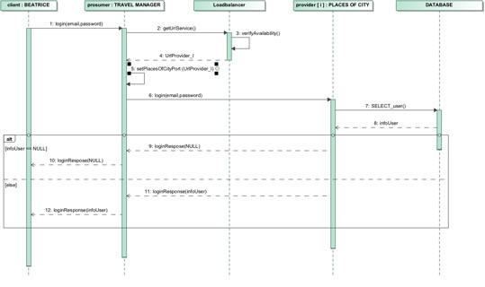</td>
  </tr>
 </table>
 <![endif]><!--[if gte vml 1]></o:wrapblock><![endif]--> 
<o:p></o:p>

 

<o:p>&nbsp;</o:p>

<o:p>&nbsp;</o:p>

<![if !supportLists]>3.&nbsp;&nbsp;&nbsp;&nbsp;
<![endif]>MAPBOX

Il provider MAPBOX fornisce,
sempre secondo lo stesso principio,
tre tipi servizi all’utente: la visualizzazione della mappa, la visualizzazione del percorso a seconda del mezzo di trasporto scelto ed il tempo impiegato
per percorrere quella strada in base al mezzo scelto.
Tutti e tre questi servizi sono chiesti dall’utente tramite Beatrice con una richiesta REST al prosumer.

Successivamente TravelManager richiederà il servizio
al provider MAPBOX
tramite REST. Quando
il provider darà la risposta a TravelManager, quest’ultimo filtrerà tale risposta a seconda di ciò che ha chiesto
l’utente, riadattando anche i dati per l’applicazione. Terminata questa operazione restituirà il risultato
all’utente tramite il client.

<o:p>&nbsp;</o:p>

<!--[if gte vml 1]><o:wrapblock><v:shape id="image5.jpeg"
  o:spid="_x0000_s1035" type="#_x0000_t75" style='position:absolute;
  margin-left:20.3pt;margin-top:16.35pt;width:551.95pt;height:227.95pt;
  z-index:4;visibility:visible;mso-wrap-style:square;mso-width-percent:0;
  mso-height-percent:0;mso-wrap-distance-left:0;mso-wrap-distance-top:0;
  mso-wrap-distance-right:0;mso-wrap-distance-bottom:0;
  mso-position-horizontal:absolute;mso-position-horizontal-relative:page;
  mso-position-vertical:absolute;mso-position-vertical-relative:text;
  mso-width-percent:0;mso-height-percent:0;mso-width-relative:page;
  mso-height-relative:page'>
  <v:imagedata src="README.fld/image007.jpg" o:title=""/>
  <w:wrap type="topAndBottom" anchorx="page"/>
 </v:shape><![endif]--><![if !vml]>
 <table cellpadding=0 cellspacing=0 align=left>
  <tr>
   <td width=10 height=0></td>
  </tr>
  <tr>
   <td></td>
   <td>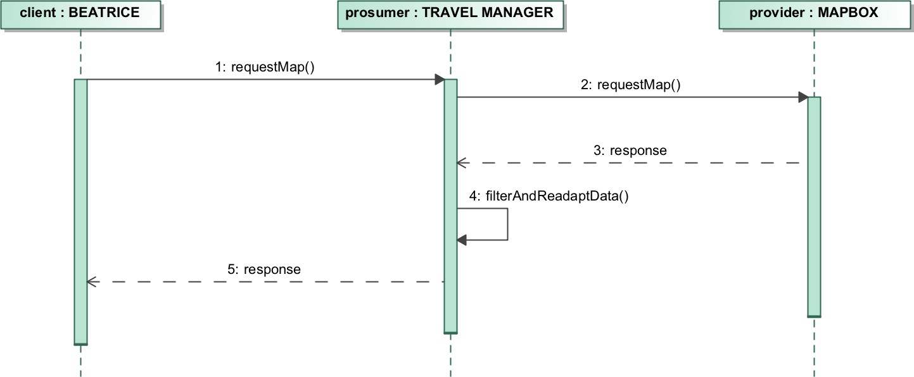</td>
  </tr>
 </table>
 <![endif]><!--[if gte vml 1]></o:wrapblock><![endif]--> 
<o:p></o:p>

 

<![if !supportLists]>4.&nbsp;&nbsp;&nbsp;&nbsp; <![endif]>LIKE BY USER

<o:p>&nbsp;</o:p>

Quando l’utente
ha effettuato il login può visualizzare i like da lui assegnati
in precedenza. Questa operazione avviene automaticamente non appena l’utente effettua il login: per prima cosa il client invia
al prosumer la userKey dell’utente tramite servizio REST. Poi il prosumer
chiede al Loadbalancer l’indirizzo del provider a cui fare richiesta. Fornitogli
l’indirizzo, Travel Manager invierà la richiesta di visualizzazione dei like, tramite
SOAP, ad uno dei server
su cui è disponibile il servizio Place of City. Quest’ultimo controllerà nel Data Base se l’userKey
fornitagli corrisponde effettivamente ad un utente esistente
nella base di dati.

Se
la risposta è positiva ( quindi l’IDuser è diverso da NULL ), significa che il
Data Base restituirà la lista dei
like al provider che a sua volta la inoltrerà al prosumer tramite SOAP, che
infine la restituirà all’utente grazie al client tramite REST.

Invece,
nel caso in cui l’userKey non ha un IDuser corrispondente nel Data Base (
quindi l’IDuser è NULL ), il provider
lo comunicherà al prosumer tramite SOAP e, come sempre, tale risultato
sarà inoltrato da TravelManager
al client tramite REST.

<o:p>&nbsp;</o:p>

<o:p>&nbsp;</o:p>

<o:p>&nbsp;</o:p>

<!--[if gte vml 1]><o:wrapblock><v:shape
  id="image6.png" o:spid="_x0000_s1034" type="#_x0000_t75" style='position:absolute;
  margin-left:20.4pt;margin-top:7.85pt;width:542.5pt;height:326.35pt;z-index:5;
  visibility:visible;mso-wrap-style:square;mso-width-percent:0;
  mso-height-percent:0;mso-wrap-distance-left:0;mso-wrap-distance-top:0;
  mso-wrap-distance-right:0;mso-wrap-distance-bottom:0;
  mso-position-horizontal:absolute;mso-position-horizontal-relative:page;
  mso-position-vertical:absolute;mso-position-vertical-relative:text;
  mso-width-percent:0;mso-height-percent:0;mso-width-relative:page;
  mso-height-relative:page'>
  <v:imagedata src="README.fld/image008.png" o:title=""/>
  <w:wrap type="topAndBottom" anchorx="page"/>
 </v:shape><![endif]--><![if !vml]>
 <table cellpadding=0 cellspacing=0 align=left>
  <tr>
   <td width=10 height=0></td>
  </tr>
  <tr>
   <td></td>
   <td>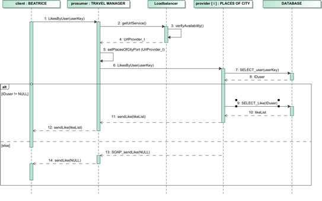</td>
  </tr>
 </table>
 <![endif]><!--[if gte vml 1]></o:wrapblock><![endif]--> 
<o:p></o:p>

 

<![if !supportLists]>5.&nbsp;&nbsp;&nbsp;&nbsp;
<![endif]>ALL COMMENT

Quando l’utente
desidera visualizzare i commenti lasciati
per un’attività, il client invia questa richiesta
tramite REST al prosumer, passando
l’id di dell’attività richiesta. Poi il prosumer
chiede al Loadbalancer l’indirizzo del provider a cui fare richiesta. Fornitogli l’indirizzo, Travel Manager invierà la richiesta di visualizzazione
dei commenti, tramite SOAP, ad uno dei server su cui è disponibile il servizio
Place of City. In questo modo il provider può quindi richiedere le informazioni desiderate al Data Base. Quando la base di dati risponderà, restituirà la lista dei commenti
al provider che, a sua volta, la inoltrerà al prosumer con il fine di fornirla all’utente tramite Beatrice.

<o:p>&nbsp;</o:p>

<o:p>&nbsp;</o:p>

<!--[if gte vml 1]><o:wrapblock><v:shape
  id="image7.jpeg" o:spid="_x0000_s1033" type="#_x0000_t75" style='position:absolute;
  margin-left:16.2pt;margin-top:18.8pt;width:551.35pt;height:248.6pt;z-index:6;
  visibility:visible;mso-wrap-style:square;mso-width-percent:0;
  mso-height-percent:0;mso-wrap-distance-left:0;mso-wrap-distance-top:0;
  mso-wrap-distance-right:0;mso-wrap-distance-bottom:0;
  mso-position-horizontal:absolute;mso-position-horizontal-relative:page;
  mso-position-vertical:absolute;mso-position-vertical-relative:text;
  mso-width-percent:0;mso-height-percent:0;mso-width-relative:page;
  mso-height-relative:page'>
  <v:imagedata src="README.fld/image010.jpg" o:title=""/>
  <w:wrap type="topAndBottom" anchorx="page"/>
 </v:shape><![endif]--><![if !vml]>
 <table cellpadding=0 cellspacing=0 align=left>
  <tr>
   <td width=6 height=0></td>
  </tr>
  <tr>
   <td></td>
   <td>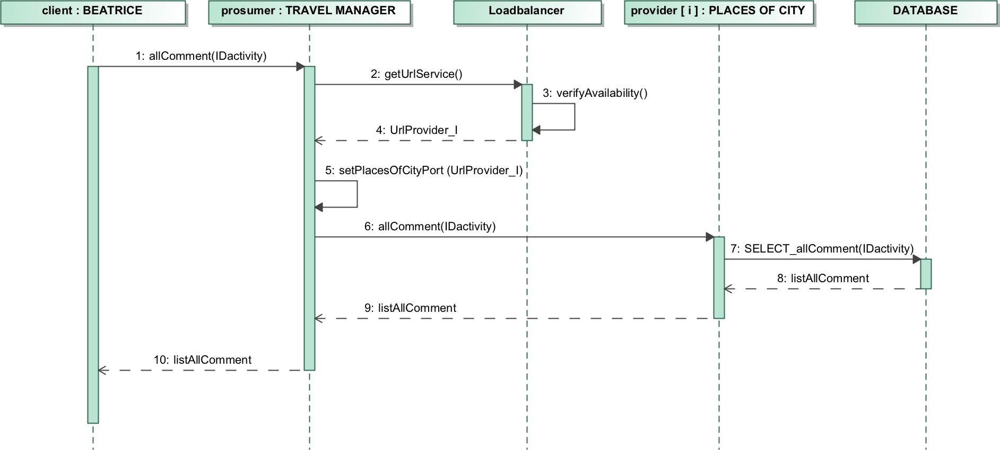</td>
  </tr>
 </table>
 <![endif]><!--[if gte vml 1]></o:wrapblock><![endif]--> 
<o:p></o:p>

 

<![if !supportLists]>6.&nbsp;&nbsp;&nbsp;&nbsp; <![endif]>ADD LIKE

<o:p>&nbsp;</o:p>

Se l’utente
desidera mettere un like ad un’attività, il client inoltrerà
tale richiesta al prosumer tramite
servizio REST, passandogli la userKey e l’IDactivity.

Poi il prosumer chiede al Loadbalancer l’indirizzo del provider
a cui fare richiesta. Fornitogli
l’indirizzo, Travel Manager invierà la richiesta di aggiungere un like,
tramite SOAP, ad uno dei server su cui è disponibile il servizio Place of City. Il provider
comunicherà poi con il Data Base per capire se l’azione richiesta
dall’utente è possibile.
Infatti per prima cosa PlacesOfCity fornirà l’userKey al Data Base con il fine di vedere se esiste l’IDuser
per quell’utente. Se la risposta
è positiva ( quindi l’IDuser
è diverso da NULL ), significa che viene effettuata
l’aggiunta del like.

Successivamente il sistema controllerà l’esito di tale operazione, restituendo la risposta di errore o di corretto
funzionamento al prosumer
tramite SOAP, che sarà infine inviata dal prosumer al client tramite
REST.

Invece,
nel caso in cui l’userKey non ha un’IDuser corrispondente
nel Data Base ( quindi l’IDuser è NULL ), il provider lo comunicherà al prosumer tramite SOAP e, come sempre, tale risultato
sarà inoltrato da TravelManager
al client tramite REST.

<!--[if gte vml 1]><o:wrapblock><v:shape id="image8.jpeg"
  o:spid="_x0000_s1032" type="#_x0000_t75" style='position:absolute;
  margin-left:34.25pt;margin-top:15.75pt;width:543.25pt;height:370.45pt;
  z-index:7;visibility:visible;mso-wrap-style:square;mso-width-percent:0;
  mso-height-percent:0;mso-wrap-distance-left:0;mso-wrap-distance-top:0;
  mso-wrap-distance-right:0;mso-wrap-distance-bottom:0;
  mso-position-horizontal:absolute;mso-position-horizontal-relative:page;
  mso-position-vertical:absolute;mso-position-vertical-relative:text;
  mso-width-percent:0;mso-height-percent:0;mso-width-relative:page;
  mso-height-relative:page'>
  <v:imagedata src="README.fld/image011.jpg" o:title=""/>
  <w:wrap type="topAndBottom" anchorx="page"/>
 </v:shape><![endif]--><![if !vml]>
 <table cellpadding=0 cellspacing=0 align=left>
  <tr>
   <td width=24 height=0></td>
  </tr>
  <tr>
   <td></td>
   <td>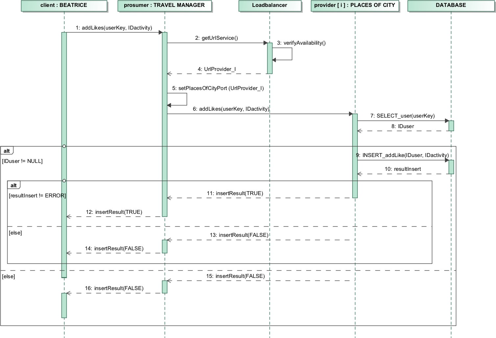</td>
  </tr>
 </table>
 <![endif]><!--[if gte vml 1]></o:wrapblock><![endif]--> 
<o:p></o:p>

 

<![if !supportLists]>7.&nbsp;&nbsp;&nbsp;&nbsp; <![endif]>ADD COMMENT

<o:p>&nbsp;</o:p>

Il processo per inserire un commento è molto simile a quello per inserire un like: il client inoltrerà
il commento appena inserito
dall’user al prosumer, tramite servizio REST, passandogli anche la userKey
e l’IDactivity.

Poi il prosumer chiede al Loadbalancer l’indirizzo del provider
a cui fare richiesta. Fornitogli l’indirizzo, Travel Manager invierà la richiesta di aggiunta
commento, tramite SOAP, ad uno dei server su cui è disponibile il servizio Place of City. Il provider,
successivamente, comunicherà con il Data Base per capire se l’azione richiesta
dall’utente è possibile. Infatti per prima cosa PlacesOfCity fornirà l’userKey al Data Base con il fine di vedere se esiste l’IDuser
per quell’utente. Se la risposta è positiva ( quindi l’IDuser
è diverso da NULL ), significa
che viene effettuata l’aggiunta del commento.
Successivamente il sistema
controllerà l’esito di tale operazione, restituendo la risposta
di errore o di corretto
funzionamento al prosumer
tramite SOAP, che sarà infine
inviata dal prosumer al
client tramite REST.

Invece,
nel caso in cui l’userKey non ha un’IDuser corrispondente
nel Data Base ( quindi l’IDuser è NULL ), il provider lo comunicherà al prosumer tramite SOAP e, come sempre, tale risultato
sarà inoltrato da TravelManager
al client tramite REST.

<o:p>&nbsp;</o:p>

<!--[if gte vml 1]><o:wrapblock><v:shape
  id="image9.jpeg" o:spid="_x0000_s1031" type="#_x0000_t75" style='position:absolute;
  margin-left:29.35pt;margin-top:14.45pt;width:540.85pt;height:342.15pt;
  z-index:8;visibility:visible;mso-wrap-style:square;mso-width-percent:0;
  mso-height-percent:0;mso-wrap-distance-left:0;mso-wrap-distance-top:0;
  mso-wrap-distance-right:0;mso-wrap-distance-bottom:0;
  mso-position-horizontal:absolute;mso-position-horizontal-relative:page;
  mso-position-vertical:absolute;mso-position-vertical-relative:text;
  mso-width-percent:0;mso-height-percent:0;mso-width-relative:page;
  mso-height-relative:page'>
  <v:imagedata src="README.fld/image012.jpg" o:title=""/>
  <w:wrap type="topAndBottom" anchorx="page"/>
 </v:shape><![endif]--><![if !vml]>
 <table cellpadding=0 cellspacing=0 align=left>
  <tr>
   <td width=19 height=0></td>
  </tr>
  <tr>
   <td></td>
   <td>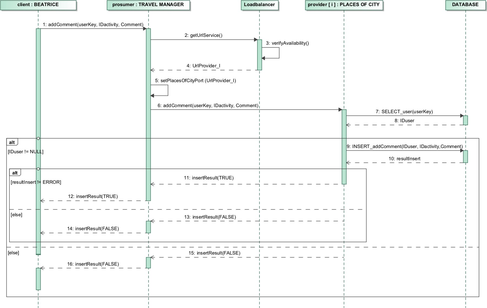</td>
  </tr>
 </table>
 <![endif]><!--[if gte vml 1]></o:wrapblock><![endif]--> 
<o:p></o:p>

 

<![if !supportLists]>8.&nbsp;&nbsp;&nbsp;&nbsp; <![endif]>ACTIVITY LIST

<o:p>&nbsp;</o:p>

Quando l’utente
richiede al prosumer,
tramite REST, la lista delle attività proposte
da Beatrice per quella città, questo chiede per prima cosa al Loadbalancer l’indirizzo del provider Place of City a cui effettuare la richiesta di questa lista.
Fornitogli tale indirizzo,
TravelManager inoltrerà parallelamente due richieste: la richiesta (tramite REST) del tempo atmosferico per quella città in quel giorno e la richiesta
(tramite SOAP) delle attività per
quella città ( all’indirizzo che il Loadbalancer ha restituito al
prosumer). La prima verrà richiesta al provider PlacesOfCity, che a sua volta interrogherà il Data Base per essere in grado di fornire
tale risposta. La seconda
verrà richiesta al provider Weather.
Non appena i provider avranno
risposto al prosumer,
TravelManager gestirà le informazioni appena ricevute componendo la lista delle attività secondo il tempo metereologico della città in quel momento,
mostrando solo le attività disponibili in quel momento
secondo il meteo e l’orario.
Composta questa lista, il risultato
sarà mostrato all’utente tramite Beatrice.

<o:p>&nbsp;</o:p>

<!--[if gte vml 1]><o:wrapblock><v:shape
  id="image10.jpeg" o:spid="_x0000_s1030" type="#_x0000_t75" style='position:absolute;
  margin-left:20.25pt;margin-top:18.6pt;width:560.45pt;height:348.6pt;
  z-index:9;visibility:visible;mso-wrap-style:square;mso-width-percent:0;
  mso-height-percent:0;mso-wrap-distance-left:0;mso-wrap-distance-top:0;
  mso-wrap-distance-right:0;mso-wrap-distance-bottom:0;
  mso-position-horizontal:absolute;mso-position-horizontal-relative:page;
  mso-position-vertical:absolute;mso-position-vertical-relative:text;
  mso-width-percent:0;mso-height-percent:0;mso-width-relative:page;
  mso-height-relative:page'>
  <v:imagedata src="README.fld/image013.jpg" o:title=""/>
  <w:wrap type="topAndBottom" anchorx="page"/>
 </v:shape><![endif]--><![if !vml]>
 <table cellpadding=0 cellspacing=0 align=left>
  <tr>
   <td width=10 height=0></td>
  </tr>
  <tr>
   <td></td>
   <td>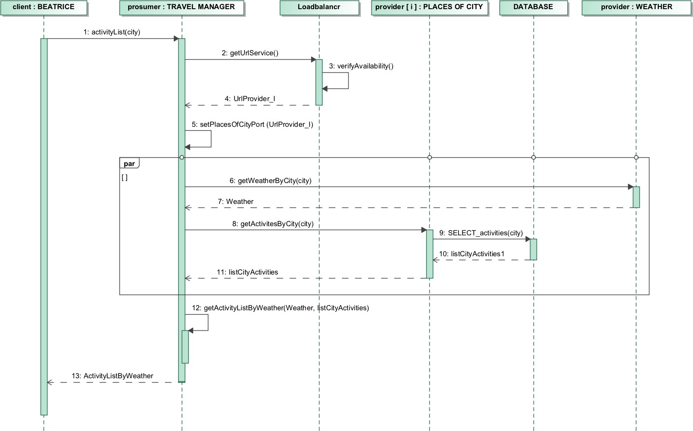</td>
  </tr>
 </table>
 <![endif]><!--[if gte vml 1]></o:wrapblock><![endif]--> 
<o:p></o:p>

 

<h1 style='line-height:12.3pt;mso-line-height-rule:exactly'>INSTALLAZIONE</h1>

In questa sezione illustriamo le tecnologie e i tools usati ed una breve descrizione di come installare il sistema.

TECHNOLOGIES AND TOOLS

<o:p>&nbsp;</o:p>

<table class=MsoNormalTable border=1 cellspacing=0 cellpadding=0
 style='margin-left:46.15pt;border-collapse:collapse;mso-table-layout-alt:fixed;
 border:none;mso-border-alt:solid #7F7F7F .5pt;mso-yfti-tbllook:480;mso-padding-alt:
 0cm 0cm 0cm 0cm;mso-border-insideh:.5pt solid #7F7F7F;mso-border-insidev:.5pt solid #7F7F7F'>
 <tr style='mso-yfti-irow:0;mso-yfti-firstrow:yes;height:22.6pt'>
  <td width=321 valign=top style='width:240.8pt;border:none;border-bottom:solid #7F7F7F 1.0pt;
  mso-border-bottom-alt:solid #7F7F7F .5pt;background:#BEC0BF;padding:0cm 0cm 0cm 0cm;
  height:22.6pt'>
  
<b style='mso-bidi-font-weight:
  normal'>Tool</b><b
  style='mso-bidi-font-weight:normal'> </b><b style='mso-bidi-font-weight:normal'>or</b><b
  style='mso-bidi-font-weight:normal'> </b><b style='mso-bidi-font-weight:normal'>Technology</b><b
  style='mso-bidi-font-weight:normal'><o:p></o:p></b>

  </td>
  <td width=321 valign=top style='width:240.8pt;border:none;border-bottom:solid #7F7F7F 1.0pt;
  mso-border-bottom-alt:solid #7F7F7F .5pt;background:#BEC0BF;padding:0cm 0cm 0cm 0cm;
  height:22.6pt'>
  
<b style='mso-bidi-font-weight:
  normal'>Version</b><b
  style='mso-bidi-font-weight:normal'><o:p></o:p></b>

  </td>
 </tr>
 <tr style='mso-yfti-irow:1;height:22.35pt'>
  <td width=321 valign=top style='width:240.8pt;border:solid #BFBFBF 1.0pt;
  border-top:none;mso-border-top-alt:solid #7F7F7F .5pt;mso-border-alt:solid #BFBFBF .25pt;
  mso-border-top-alt:solid #7F7F7F .5pt;padding:0cm 0cm 0cm 0cm;height:22.35pt'>
  
JDK<o:p></o:p>

  </td>
  <td width=321 valign=top style='width:240.8pt;border-top:none;border-left:
  none;border-bottom:solid #BFBFBF 1.0pt;border-right:solid #BFBFBF 1.0pt;
  mso-border-top-alt:solid #7F7F7F .5pt;mso-border-left-alt:solid #BFBFBF .25pt;
  mso-border-alt:solid #BFBFBF .25pt;mso-border-top-alt:solid #7F7F7F .5pt;
  padding:0cm 0cm 0cm 0cm;height:22.35pt'>
  
1.8<o:p></o:p>

  </td>
 </tr>
 <tr style='mso-yfti-irow:2;height:22.5pt'>
  <td width=321 valign=top style='width:240.8pt;border:solid #BFBFBF 1.0pt;
  border-top:none;mso-border-top-alt:solid #BFBFBF .25pt;mso-border-alt:solid #BFBFBF .25pt;
  background:#EFEFEF;padding:0cm 0cm 0cm 0cm;height:22.5pt'>
  
Eclipse Photon<o:p></o:p>

  </td>
  <td width=321 valign=top style='width:240.8pt;border-top:none;border-left:
  none;border-bottom:solid #BFBFBF 1.0pt;border-right:solid #BFBFBF 1.0pt;
  mso-border-top-alt:solid #BFBFBF .25pt;mso-border-left-alt:solid #BFBFBF .25pt;
  mso-border-alt:solid #BFBFBF .25pt;background:#EFEFEF;padding:0cm 0cm 0cm 0cm;
  height:22.5pt'>
  
4.8.0<o:p></o:p>

  </td>
 </tr>
 <tr style='mso-yfti-irow:3;height:22.5pt'>
  <td width=321 valign=top style='width:240.8pt;border:solid #BFBFBF 1.0pt;
  border-top:none;mso-border-top-alt:solid #BFBFBF .25pt;mso-border-alt:solid #BFBFBF .25pt;
  padding:0cm 0cm 0cm 0cm;height:22.5pt'>
  
Tomcat<o:p></o:p>

  </td>
  <td width=321 valign=top style='width:240.8pt;border-top:none;border-left:
  none;border-bottom:solid #BFBFBF 1.0pt;border-right:solid #BFBFBF 1.0pt;
  mso-border-top-alt:solid #BFBFBF .25pt;mso-border-left-alt:solid #BFBFBF .25pt;
  mso-border-alt:solid #BFBFBF .25pt;padding:0cm 0cm 0cm 0cm;height:22.5pt'>
  
8.5<o:p></o:p>

  </td>
 </tr>
 <tr style='mso-yfti-irow:4;mso-yfti-lastrow:yes;height:22.5pt'>
  <td width=321 valign=top style='width:240.8pt;border:solid #BFBFBF 1.0pt;
  border-top:none;mso-border-top-alt:solid #BFBFBF .25pt;mso-border-alt:solid #BFBFBF .25pt;
  background:#EFEFEF;padding:0cm 0cm 0cm 0cm;height:22.5pt'>
  
Maven<o:p></o:p>

  </td>
  <td width=321 valign=top style='width:240.8pt;border-top:none;border-left:
  none;border-bottom:solid #BFBFBF 1.0pt;border-right:solid #BFBFBF 1.0pt;
  mso-border-top-alt:solid #BFBFBF .25pt;mso-border-left-alt:solid #BFBFBF .25pt;
  mso-border-alt:solid #BFBFBF .25pt;background:#EFEFEF;padding:0cm 0cm 0cm 0cm;
  height:22.5pt'>
  
3.6.0<o:p></o:p>

  </td>
 </tr>
</table>

<o:p>&nbsp;</o:p>

API REST

Presentiamo la lista delle
API REST messe
a disposizione dal prosumer:

<o:p>&nbsp;</o:p>

<table class=MsoNormalTable border=1 cellspacing=0 cellpadding=0
 style='margin-left:45.9pt;border-collapse:collapse;mso-table-layout-alt:fixed;
 border:none;mso-border-alt:solid #FFFEBF .25pt;mso-yfti-tbllook:480;
 mso-padding-alt:0cm 0cm 0cm 0cm;mso-border-insideh:.25pt solid #FFFEBF;
 mso-border-insidev:.25pt solid #FFFEBF'>
 <tr style='mso-yfti-irow:0;mso-yfti-firstrow:yes;height:32.65pt'>
  <td width=642 colspan=2 valign=top style='width:481.6pt;border:solid #FFFEBF 1.0pt;
  border-bottom:solid #7F7F7F 1.0pt;mso-border-alt:solid #FFFEBF .25pt;
  mso-border-bottom-alt:solid #7F7F7F .5pt;background:peachpuff;padding:0cm 0cm 0cm 0cm;
  height:32.65pt'>
  
<b style='mso-bidi-font-weight:normal'>infoPoint2PointByMeans</b><b
  style='mso-bidi-font-weight:normal'><o:p></o:p></b>

  
Ottenere i tempi
  di percorrenza tra due punti

  </td>
 </tr>
 <tr style='mso-yfti-irow:1;height:31.65pt'>
  <td width=642 colspan=2 valign=top style='width:481.6pt;border-top:none;
  border-left:solid #FFFEBF 1.0pt;border-bottom:solid #7F7F7F 1.0pt;border-right:
  solid #FFFEBF 1.0pt;mso-border-top-alt:solid #7F7F7F .5pt;mso-border-top-alt:
  #7F7F7F .5pt;mso-border-left-alt:#FFFEBF .25pt;mso-border-bottom-alt:#7F7F7F .5pt;
  mso-border-right-alt:#FFFEBF .25pt;mso-border-style-alt:solid;background:
  #E5EFB0;padding:0cm 0cm 0cm 0cm;height:31.65pt'>
  
http://localhost:8080/travelmanager/api/maps-info-poiny2point/start/{startLon}/{startLat}/end/

  
{endLon}/{endLat}

  </td>
 </tr>
 <tr style='mso-yfti-irow:2;height:22.35pt'>
  <td width=118 valign=top style='width:88.2pt;border-top:none;border-left:
  solid #FFFEBF 1.0pt;border-bottom:solid #BFBFBF 1.0pt;border-right:solid #BFBFBF 1.0pt;
  mso-border-top-alt:solid #7F7F7F .5pt;mso-border-top-alt:#7F7F7F .5pt;
  mso-border-left-alt:#FFFEBF .25pt;mso-border-bottom-alt:#BFBFBF .25pt;
  mso-border-right-alt:#BFBFBF .25pt;mso-border-style-alt:solid;padding:0cm 0cm 0cm 0cm;
  height:22.35pt'>
  
<b style='mso-bidi-font-weight:normal'>PARAMETRO<o:p></o:p></b>

  </td>
  <td width=525 valign=top style='width:393.4pt;border-top:none;border-left:
  none;border-bottom:solid #BFBFBF 1.0pt;border-right:solid #FFFEBF 1.0pt;
  mso-border-top-alt:solid #7F7F7F .5pt;mso-border-left-alt:solid #BFBFBF .25pt;
  mso-border-top-alt:#7F7F7F .5pt;mso-border-left-alt:#BFBFBF .25pt;mso-border-bottom-alt:
  #BFBFBF .25pt;mso-border-right-alt:#FFFEBF .25pt;mso-border-style-alt:solid;
  padding:0cm 0cm 0cm 0cm;height:22.35pt'>
  
<b style='mso-bidi-font-weight:
  normal'>DESCRIZIONE<o:p></o:p></b>

  </td>
 </tr>
 <tr style='mso-yfti-irow:3;height:22.5pt'>
  <td width=118 valign=top style='width:88.2pt;border-top:none;border-left:
  solid #FFFEBF 1.0pt;border-bottom:solid #BFBFBF 1.0pt;border-right:solid #BFBFBF 1.0pt;
  mso-border-top-alt:solid #BFBFBF .25pt;mso-border-alt:solid #BFBFBF .25pt;
  mso-border-left-alt:solid #FFFEBF .25pt;background:#EFEFEF;padding:0cm 0cm 0cm 0cm;
  height:22.5pt'>
  
<b style='mso-bidi-font-weight:normal'>{startLon}</b><b
  style='mso-bidi-font-weight:normal'><o:p></o:p></b>

  </td>
  <td width=525 valign=top style='width:393.4pt;border-top:none;border-left:
  none;border-bottom:solid #BFBFBF 1.0pt;border-right:solid #FFFEBF 1.0pt;
  mso-border-top-alt:solid #BFBFBF .25pt;mso-border-left-alt:solid #BFBFBF .25pt;
  mso-border-alt:solid #BFBFBF .25pt;mso-border-right-alt:solid #FFFEBF .25pt;
  background:#EFEFEF;padding:0cm 0cm 0cm 0cm;height:22.5pt'>
  
Longitudine del punto relativo alla posizione dell’utente<o:p></o:p>

  </td>
 </tr>
 <tr style='mso-yfti-irow:4;height:22.5pt'>
  <td width=118 valign=top style='width:88.2pt;border-top:none;border-left:
  solid #FFFEBF 1.0pt;border-bottom:solid #BFBFBF 1.0pt;border-right:solid #BFBFBF 1.0pt;
  mso-border-top-alt:solid #BFBFBF .25pt;mso-border-alt:solid #BFBFBF .25pt;
  mso-border-left-alt:solid #FFFEBF .25pt;padding:0cm 0cm 0cm 0cm;height:22.5pt'>
  
<b style='mso-bidi-font-weight:normal'>{startLat}<o:p></o:p></b>

  </td>
  <td width=525 valign=top style='width:393.4pt;border-top:none;border-left:
  none;border-bottom:solid #BFBFBF 1.0pt;border-right:solid #FFFEBF 1.0pt;
  mso-border-top-alt:solid #BFBFBF .25pt;mso-border-left-alt:solid #BFBFBF .25pt;
  mso-border-alt:solid #BFBFBF .25pt;mso-border-right-alt:solid #FFFEBF .25pt;
  padding:0cm 0cm 0cm 0cm;height:22.5pt'>
  
Latitudine del punto relativo
  alla posizione dell’utente<o:p></o:p>

  </td>
 </tr>
 <tr style='mso-yfti-irow:5;height:22.5pt'>
  <td width=118 valign=top style='width:88.2pt;border-top:none;border-left:
  solid #FFFEBF 1.0pt;border-bottom:solid #BFBFBF 1.0pt;border-right:solid #BFBFBF 1.0pt;
  mso-border-top-alt:solid #BFBFBF .25pt;mso-border-alt:solid #BFBFBF .25pt;
  mso-border-left-alt:solid #FFFEBF .25pt;background:#EFEFEF;padding:0cm 0cm 0cm 0cm;
  height:22.5pt'>
  
<b style='mso-bidi-font-weight:normal'>{endLon}</b><b
  style='mso-bidi-font-weight:normal'><o:p></o:p></b>

  </td>
  <td width=525 valign=top style='width:393.4pt;border-top:none;border-left:
  none;border-bottom:solid #BFBFBF 1.0pt;border-right:solid #FFFEBF 1.0pt;
  mso-border-top-alt:solid #BFBFBF .25pt;mso-border-left-alt:solid #BFBFBF .25pt;
  mso-border-alt:solid #BFBFBF .25pt;mso-border-right-alt:solid #FFFEBF .25pt;
  background:#EFEFEF;padding:0cm 0cm 0cm 0cm;height:22.5pt'>
  
Longitudine del punto relativo alla destinazione dell’utente<o:p></o:p>

  </td>
 </tr>
 <tr style='mso-yfti-irow:6;mso-yfti-lastrow:yes;height:22.5pt'>
  <td width=118 valign=top style='width:88.2pt;border-top:none;border-left:
  solid #FFFEBF 1.0pt;border-bottom:solid #FFFEBF 1.0pt;border-right:solid #BFBFBF 1.0pt;
  mso-border-top-alt:solid #BFBFBF .25pt;mso-border-top-alt:#BFBFBF;mso-border-left-alt:
  #FFFEBF;mso-border-bottom-alt:#FFFEBF;mso-border-right-alt:#BFBFBF;
  mso-border-style-alt:solid;mso-border-width-alt:.25pt;padding:0cm 0cm 0cm 0cm;
  height:22.5pt'>
  
<b style='mso-bidi-font-weight:normal'>{endLat}<o:p></o:p></b>

  </td>
  <td width=525 valign=top style='width:393.4pt;border-top:none;border-left:
  none;border-bottom:solid #FFFEBF 1.0pt;border-right:solid #FFFEBF 1.0pt;
  mso-border-top-alt:solid #BFBFBF .25pt;mso-border-left-alt:solid #BFBFBF .25pt;
  mso-border-top-alt:#BFBFBF;mso-border-left-alt:#BFBFBF;mso-border-bottom-alt:
  #FFFEBF;mso-border-right-alt:#FFFEBF;mso-border-style-alt:solid;mso-border-width-alt:
  .25pt;padding:0cm 0cm 0cm 0cm;height:22.5pt'>
  
Latitudine del punto relativo alla destinazione dell’utente<o:p></o:p>

  </td>
 </tr>
</table>

<o:p>&nbsp;</o:p>

<o:p>&nbsp;</o:p>

<table class=MsoNormalTable border=1 cellspacing=0 cellpadding=0
 style='margin-left:45.9pt;border-collapse:collapse;mso-table-layout-alt:fixed;
 border:none;mso-border-alt:solid #FFFEBF .25pt;mso-yfti-tbllook:480;
 mso-padding-alt:0cm 0cm 0cm 0cm;mso-border-insideh:.25pt solid #FFFEBF;
 mso-border-insidev:.25pt solid #FFFEBF'>
 <tr style='mso-yfti-irow:0;mso-yfti-firstrow:yes;height:32.65pt'>
  <td width=642 colspan=2 valign=top style='width:481.6pt;border:solid #FFFEBF 1.0pt;
  border-bottom:solid #7F7F7F 1.0pt;mso-border-alt:solid #FFFEBF .25pt;
  mso-border-bottom-alt:solid #7F7F7F .5pt;background:peachpuff;padding:0cm 0cm 0cm 0cm;
  height:32.65pt'>
  
<b style='mso-bidi-font-weight:normal'>routePoint2Point</b><b
  style='mso-bidi-font-weight:normal'><o:p></o:p></b>

  
Ottenere il percorso verso l'attività desiderata attraverso un determinato mezzo di trasposto

  </td>
 </tr>
 <tr style='mso-yfti-irow:1;height:31.65pt'>
  <td width=642 colspan=2 valign=top style='width:481.6pt;border-top:none;
  border-left:solid #FFFEBF 1.0pt;border-bottom:solid #7F7F7F 1.0pt;border-right:
  solid #FFFEBF 1.0pt;mso-border-top-alt:solid #7F7F7F .5pt;mso-border-top-alt:
  #7F7F7F .5pt;mso-border-left-alt:#FFFEBF .25pt;mso-border-bottom-alt:#7F7F7F .5pt;
  mso-border-right-alt:#FFFEBF .25pt;mso-border-style-alt:solid;background:
  #E5EFB0;padding:0cm 0cm 0cm 0cm;height:31.65pt'>
  
http://localhost:8080/travelmanager/api/maps-coordinate/means/{means}/start/{startLon}/

  
{startLat}/end/{endLon}/{endLat}

  </td>
 </tr>
 <tr style='mso-yfti-irow:2;height:22.35pt'>
  <td width=118 valign=top style='width:88.2pt;border-top:none;border-left:
  solid #FFFEBF 1.0pt;border-bottom:solid #BFBFBF 1.0pt;border-right:solid #BFBFBF 1.0pt;
  mso-border-top-alt:solid #7F7F7F .5pt;mso-border-top-alt:#7F7F7F .5pt;
  mso-border-left-alt:#FFFEBF .25pt;mso-border-bottom-alt:#BFBFBF .25pt;
  mso-border-right-alt:#BFBFBF .25pt;mso-border-style-alt:solid;padding:0cm 0cm 0cm 0cm;
  height:22.35pt'>
  
<b style='mso-bidi-font-weight:normal'>PARAMETRO<o:p></o:p></b>

  </td>
  <td width=525 valign=top style='width:393.4pt;border-top:none;border-left:
  none;border-bottom:solid #BFBFBF 1.0pt;border-right:solid #FFFEBF 1.0pt;
  mso-border-top-alt:solid #7F7F7F .5pt;mso-border-left-alt:solid #BFBFBF .25pt;
  mso-border-top-alt:#7F7F7F .5pt;mso-border-left-alt:#BFBFBF .25pt;mso-border-bottom-alt:
  #BFBFBF .25pt;mso-border-right-alt:#FFFEBF .25pt;mso-border-style-alt:solid;
  padding:0cm 0cm 0cm 0cm;height:22.35pt'>
  
<b style='mso-bidi-font-weight:
  normal'>DESCRIZIONE<o:p></o:p></b>

  </td>
 </tr>
 <tr style='mso-yfti-irow:3;height:22.5pt'>
  <td width=118 valign=top style='width:88.2pt;border-top:none;border-left:
  solid #FFFEBF 1.0pt;border-bottom:solid #BFBFBF 1.0pt;border-right:solid #BFBFBF 1.0pt;
  mso-border-top-alt:solid #BFBFBF .25pt;mso-border-alt:solid #BFBFBF .25pt;
  mso-border-left-alt:solid #FFFEBF .25pt;background:#EFEFEF;padding:0cm 0cm 0cm 0cm;
  height:22.5pt'>
  
<b style='mso-bidi-font-weight:normal'>{means}</b><b
  style='mso-bidi-font-weight:normal'><o:p></o:p></b>

  </td>
  <td width=525 valign=top style='width:393.4pt;border-top:none;border-left:
  none;border-bottom:solid #BFBFBF 1.0pt;border-right:solid #FFFEBF 1.0pt;
  mso-border-top-alt:solid #BFBFBF .25pt;mso-border-left-alt:solid #BFBFBF .25pt;
  mso-border-alt:solid #BFBFBF .25pt;mso-border-right-alt:solid #FFFEBF .25pt;
  background:#EFEFEF;padding:0cm 0cm 0cm 0cm;height:22.5pt'>
  
Mezzo scelto per il trasporto<o:p></o:p>

  </td>
 </tr>
 <tr style='mso-yfti-irow:4;height:22.45pt'>
  <td width=118 valign=top style='width:88.2pt;border-top:none;border-left:
  solid #FFFEBF 1.0pt;border-bottom:solid #BFBFBF 1.0pt;border-right:solid #BFBFBF 1.0pt;
  mso-border-top-alt:solid #BFBFBF .25pt;mso-border-alt:solid #BFBFBF .25pt;
  mso-border-left-alt:solid #FFFEBF .25pt;padding:0cm 0cm 0cm 0cm;height:22.45pt'>
  
<b style='mso-bidi-font-weight:normal'>{startLon}<o:p></o:p></b>

  </td>
  <td width=525 valign=top style='width:393.4pt;border-top:none;border-left:
  none;border-bottom:solid #BFBFBF 1.0pt;border-right:solid #FFFEBF 1.0pt;
  mso-border-top-alt:solid #BFBFBF .25pt;mso-border-left-alt:solid #BFBFBF .25pt;
  mso-border-alt:solid #BFBFBF .25pt;mso-border-right-alt:solid #FFFEBF .25pt;
  padding:0cm 0cm 0cm 0cm;height:22.45pt'>
  
Longitudine del punto relativo
  alla posizione dell’utente<o:p></o:p>

  </td>
 </tr>
 <tr style='mso-yfti-irow:5;height:22.5pt'>
  <td width=118 valign=top style='width:88.2pt;border-top:none;border-left:
  solid #FFFEBF 1.0pt;border-bottom:solid #BFBFBF 1.0pt;border-right:solid #BFBFBF 1.0pt;
  mso-border-top-alt:solid #BFBFBF .25pt;mso-border-alt:solid #BFBFBF .25pt;
  mso-border-left-alt:solid #FFFEBF .25pt;background:#EFEFEF;padding:0cm 0cm 0cm 0cm;
  height:22.5pt'>
  
<b style='mso-bidi-font-weight:normal'>{startLat}</b><b
  style='mso-bidi-font-weight:normal'><o:p></o:p></b>

  </td>
  <td width=525 valign=top style='width:393.4pt;border-top:none;border-left:
  none;border-bottom:solid #BFBFBF 1.0pt;border-right:solid #FFFEBF 1.0pt;
  mso-border-top-alt:solid #BFBFBF .25pt;mso-border-left-alt:solid #BFBFBF .25pt;
  mso-border-alt:solid #BFBFBF .25pt;mso-border-right-alt:solid #FFFEBF .25pt;
  background:#EFEFEF;padding:0cm 0cm 0cm 0cm;height:22.5pt'>
  
Latitudine del punto relativo alla posizione dell’utente<o:p></o:p>

  </td>
 </tr>
 <tr style='mso-yfti-irow:6;height:22.5pt'>
  <td width=118 valign=top style='width:88.2pt;border-top:none;border-left:
  solid #FFFEBF 1.0pt;border-bottom:solid #BFBFBF 1.0pt;border-right:solid #BFBFBF 1.0pt;
  mso-border-top-alt:solid #BFBFBF .25pt;mso-border-alt:solid #BFBFBF .25pt;
  mso-border-left-alt:solid #FFFEBF .25pt;padding:0cm 0cm 0cm 0cm;height:22.5pt'>
  
<b style='mso-bidi-font-weight:normal'>{endLon}<o:p></o:p></b>

  </td>
  <td width=525 valign=top style='width:393.4pt;border-top:none;border-left:
  none;border-bottom:solid #BFBFBF 1.0pt;border-right:solid #FFFEBF 1.0pt;
  mso-border-top-alt:solid #BFBFBF .25pt;mso-border-left-alt:solid #BFBFBF .25pt;
  mso-border-alt:solid #BFBFBF .25pt;mso-border-right-alt:solid #FFFEBF .25pt;
  padding:0cm 0cm 0cm 0cm;height:22.5pt'>
  
Longitudine del punto relativo
  alla destinazione dell’utente<o:p></o:p>

  </td>
 </tr>
 <tr style='mso-yfti-irow:7;mso-yfti-lastrow:yes;height:22.5pt'>
  <td width=118 valign=top style='width:88.2pt;border-top:none;border-left:
  solid #FFFEBF 1.0pt;border-bottom:solid #FFFEBF 1.0pt;border-right:solid #BFBFBF 1.0pt;
  mso-border-top-alt:solid #BFBFBF .25pt;mso-border-top-alt:#BFBFBF;mso-border-left-alt:
  #FFFEBF;mso-border-bottom-alt:#FFFEBF;mso-border-right-alt:#BFBFBF;
  mso-border-style-alt:solid;mso-border-width-alt:.25pt;background:#EFEFEF;
  padding:0cm 0cm 0cm 0cm;height:22.5pt'>
  
<b style='mso-bidi-font-weight:normal'>{endLat}</b><b
  style='mso-bidi-font-weight:normal'><o:p></o:p></b>

  </td>
  <td width=525 valign=top style='width:393.4pt;border-top:none;border-left:
  none;border-bottom:solid #FFFEBF 1.0pt;border-right:solid #FFFEBF 1.0pt;
  mso-border-top-alt:solid #BFBFBF .25pt;mso-border-left-alt:solid #BFBFBF .25pt;
  mso-border-top-alt:#BFBFBF;mso-border-left-alt:#BFBFBF;mso-border-bottom-alt:
  #FFFEBF;mso-border-right-alt:#FFFEBF;mso-border-style-alt:solid;mso-border-width-alt:
  .25pt;background:#EFEFEF;padding:0cm 0cm 0cm 0cm;height:22.5pt'>
  
Latitudine del punto
  relativo alla destinazione dell’utente<o:p></o:p>

  </td>
 </tr>
</table>

 

<table class=MsoNormalTable border=1 cellspacing=0 cellpadding=0
 style='margin-left:45.9pt;border-collapse:collapse;mso-table-layout-alt:fixed;
 border:none;mso-border-alt:solid #FFFEBF .25pt;mso-yfti-tbllook:480;
 mso-padding-alt:0cm 0cm 0cm 0cm;mso-border-insideh:.25pt solid #FFFEBF;
 mso-border-insidev:.25pt solid #FFFEBF'>
 <tr style='mso-yfti-irow:0;mso-yfti-firstrow:yes;height:32.65pt'>
  <td width=642 colspan=2 valign=top style='width:481.6pt;border:solid #FFFEBF 1.0pt;
  border-bottom:solid #7F7F7F 1.0pt;mso-border-alt:solid #FFFEBF .25pt;
  mso-border-bottom-alt:solid #7F7F7F .5pt;background:peachpuff;padding:0cm 0cm 0cm 0cm;
  height:32.65pt'>
  
<b style='mso-bidi-font-weight:normal'>register</b><b
  style='mso-bidi-font-weight:normal'><o:p></o:p></b>

  
Registrazione alla web application

  </td>
 </tr>
 <tr style='mso-yfti-irow:1;height:22.25pt'>
  <td width=642 colspan=2 valign=top style='width:481.6pt;border-top:none;
  border-left:solid #FFFEBF 1.0pt;border-bottom:solid #7F7F7F 1.0pt;border-right:
  solid #FFFEBF 1.0pt;mso-border-top-alt:solid #7F7F7F .5pt;mso-border-top-alt:
  #7F7F7F .5pt;mso-border-left-alt:#FFFEBF .25pt;mso-border-bottom-alt:#7F7F7F .5pt;
  mso-border-right-alt:#FFFEBF .25pt;mso-border-style-alt:solid;background:
  #E5EFB0;padding:0cm 0cm 0cm 0cm;height:22.25pt'>
  
http://localhost:8080/travelmanager/api/register/{name}/{surname}/{email}/{password}

  </td>
 </tr>
 <tr style='mso-yfti-irow:2;height:22.35pt'>
  <td width=118 valign=top style='width:88.2pt;border-top:none;border-left:
  solid #FFFEBF 1.0pt;border-bottom:solid #BFBFBF 1.0pt;border-right:solid #BFBFBF 1.0pt;
  mso-border-top-alt:solid #7F7F7F .5pt;mso-border-top-alt:#7F7F7F .5pt;
  mso-border-left-alt:#FFFEBF .25pt;mso-border-bottom-alt:#BFBFBF .25pt;
  mso-border-right-alt:#BFBFBF .25pt;mso-border-style-alt:solid;padding:0cm 0cm 0cm 0cm;
  height:22.35pt'>
  
<b style='mso-bidi-font-weight:normal'>PARAMETRO<o:p></o:p></b>

  </td>
  <td width=525 valign=top style='width:393.4pt;border-top:none;border-left:
  none;border-bottom:solid #BFBFBF 1.0pt;border-right:solid #FFFEBF 1.0pt;
  mso-border-top-alt:solid #7F7F7F .5pt;mso-border-left-alt:solid #BFBFBF .25pt;
  mso-border-top-alt:#7F7F7F .5pt;mso-border-left-alt:#BFBFBF .25pt;mso-border-bottom-alt:
  #BFBFBF .25pt;mso-border-right-alt:#FFFEBF .25pt;mso-border-style-alt:solid;
  padding:0cm 0cm 0cm 0cm;height:22.35pt'>
  
<b style='mso-bidi-font-weight:
  normal'>DESCRIZIONE<o:p></o:p></b>

  </td>
 </tr>
 <tr style='mso-yfti-irow:3;height:22.5pt'>
  <td width=118 valign=top style='width:88.2pt;border-top:none;border-left:
  solid #FFFEBF 1.0pt;border-bottom:solid #BFBFBF 1.0pt;border-right:solid #BFBFBF 1.0pt;
  mso-border-top-alt:solid #BFBFBF .25pt;mso-border-alt:solid #BFBFBF .25pt;
  mso-border-left-alt:solid #FFFEBF .25pt;background:#EFEFEF;padding:0cm 0cm 0cm 0cm;
  height:22.5pt'>
  
<b style='mso-bidi-font-weight:normal'>{name}</b><b
  style='mso-bidi-font-weight:normal'><o:p></o:p></b>

  </td>
  <td width=525 valign=top style='width:393.4pt;border-top:none;border-left:
  none;border-bottom:solid #BFBFBF 1.0pt;border-right:solid #FFFEBF 1.0pt;
  mso-border-top-alt:solid #BFBFBF .25pt;mso-border-left-alt:solid #BFBFBF .25pt;
  mso-border-alt:solid #BFBFBF .25pt;mso-border-right-alt:solid #FFFEBF .25pt;
  background:#EFEFEF;padding:0cm 0cm 0cm 0cm;height:22.5pt'>
  
Nome utente<o:p></o:p>

  </td>
 </tr>
 <tr style='mso-yfti-irow:4;height:22.5pt'>
  <td width=118 valign=top style='width:88.2pt;border-top:none;border-left:
  solid #FFFEBF 1.0pt;border-bottom:solid #BFBFBF 1.0pt;border-right:solid #BFBFBF 1.0pt;
  mso-border-top-alt:solid #BFBFBF .25pt;mso-border-alt:solid #BFBFBF .25pt;
  mso-border-left-alt:solid #FFFEBF .25pt;padding:0cm 0cm 0cm 0cm;height:22.5pt'>
  
<b style='mso-bidi-font-weight:normal'>{surname}<o:p></o:p></b>

  </td>
  <td width=525 valign=top style='width:393.4pt;border-top:none;border-left:
  none;border-bottom:solid #BFBFBF 1.0pt;border-right:solid #FFFEBF 1.0pt;
  mso-border-top-alt:solid #BFBFBF .25pt;mso-border-left-alt:solid #BFBFBF .25pt;
  mso-border-alt:solid #BFBFBF .25pt;mso-border-right-alt:solid #FFFEBF .25pt;
  padding:0cm 0cm 0cm 0cm;height:22.5pt'>
  
Cognome utente<o:p></o:p>

  </td>
 </tr>
 <tr style='mso-yfti-irow:5;height:22.5pt'>
  <td width=118 valign=top style='width:88.2pt;border-top:none;border-left:
  solid #FFFEBF 1.0pt;border-bottom:solid #BFBFBF 1.0pt;border-right:solid #BFBFBF 1.0pt;
  mso-border-top-alt:solid #BFBFBF .25pt;mso-border-alt:solid #BFBFBF .25pt;
  mso-border-left-alt:solid #FFFEBF .25pt;background:#EFEFEF;padding:0cm 0cm 0cm 0cm;
  height:22.5pt'>
  
<b style='mso-bidi-font-weight:normal'>{email}</b><b
  style='mso-bidi-font-weight:normal'><o:p></o:p></b>

  </td>
  <td width=525 valign=top style='width:393.4pt;border-top:none;border-left:
  none;border-bottom:solid #BFBFBF 1.0pt;border-right:solid #FFFEBF 1.0pt;
  mso-border-top-alt:solid #BFBFBF .25pt;mso-border-left-alt:solid #BFBFBF .25pt;
  mso-border-alt:solid #BFBFBF .25pt;mso-border-right-alt:solid #FFFEBF .25pt;
  background:#EFEFEF;padding:0cm 0cm 0cm 0cm;height:22.5pt'>
  
Email utente<o:p></o:p>

  </td>
 </tr>
 <tr style='mso-yfti-irow:6;mso-yfti-lastrow:yes;height:22.5pt'>
  <td width=118 valign=top style='width:88.2pt;border-top:none;border-left:
  solid #FFFEBF 1.0pt;border-bottom:solid #BFBFBF 1.0pt;border-right:solid #BFBFBF 1.0pt;
  mso-border-top-alt:solid #BFBFBF .25pt;mso-border-alt:solid #BFBFBF .25pt;
  mso-border-left-alt:solid #FFFEBF .25pt;padding:0cm 0cm 0cm 0cm;height:22.5pt'>
  
<b style='mso-bidi-font-weight:normal'>{password}<o:p></o:p></b>

  </td>
  <td width=525 valign=top style='width:393.4pt;border-top:none;border-left:
  none;border-bottom:solid #BFBFBF 1.0pt;border-right:solid #FFFEBF 1.0pt;
  mso-border-top-alt:solid #BFBFBF .25pt;mso-border-left-alt:solid #BFBFBF .25pt;
  mso-border-alt:solid #BFBFBF .25pt;mso-border-right-alt:solid #FFFEBF .25pt;
  padding:0cm 0cm 0cm 0cm;height:22.5pt'>
  
Password utente<o:p></o:p>

  </td>
 </tr>
</table>

<o:p>&nbsp;</o:p>

<o:p>&nbsp;</o:p>

<table class=MsoNormalTable border=1 cellspacing=0 cellpadding=0
 style='margin-left:45.9pt;border-collapse:collapse;mso-table-layout-alt:fixed;
 border:none;mso-border-alt:solid #FFFEBF .25pt;mso-yfti-tbllook:480;
 mso-padding-alt:0cm 0cm 0cm 0cm;mso-border-insideh:.25pt solid #FFFEBF;
 mso-border-insidev:.25pt solid #FFFEBF'>
 <tr style='mso-yfti-irow:0;mso-yfti-firstrow:yes;height:32.65pt'>
  <td width=642 colspan=2 valign=top style='width:481.6pt;border:solid #FFFEBF 1.0pt;
  border-bottom:solid #7F7F7F 1.0pt;mso-border-alt:solid #FFFEBF .25pt;
  mso-border-bottom-alt:solid #7F7F7F .5pt;background:peachpuff;padding:0cm 0cm 0cm 0cm;
  height:32.65pt'>
  
<b style='mso-bidi-font-weight:normal'>login</b><b
  style='mso-bidi-font-weight:normal'><o:p></o:p></b>

  
Login per accedere alla web application

  </td>
 </tr>
 <tr style='mso-yfti-irow:1;height:22.25pt'>
  <td width=642 colspan=2 valign=top style='width:481.6pt;border-top:none;
  border-left:solid #FFFEBF 1.0pt;border-bottom:solid #7F7F7F 1.0pt;border-right:
  solid #FFFEBF 1.0pt;mso-border-top-alt:solid #7F7F7F .5pt;mso-border-top-alt:
  #7F7F7F .5pt;mso-border-left-alt:#FFFEBF .25pt;mso-border-bottom-alt:#7F7F7F .5pt;
  mso-border-right-alt:#FFFEBF .25pt;mso-border-style-alt:solid;background:
  #E5EFB0;padding:0cm 0cm 0cm 0cm;height:22.25pt'>
  
http://localhost:8080/travelmanager/api/login/{email}/{password}

  </td>
 </tr>
 <tr style='mso-yfti-irow:2;height:22.35pt'>
  <td width=118 valign=top style='width:88.2pt;border-top:none;border-left:
  solid #FFFEBF 1.0pt;border-bottom:solid #BFBFBF 1.0pt;border-right:solid #BFBFBF 1.0pt;
  mso-border-top-alt:solid #7F7F7F .5pt;mso-border-top-alt:#7F7F7F .5pt;
  mso-border-left-alt:#FFFEBF .25pt;mso-border-bottom-alt:#BFBFBF .25pt;
  mso-border-right-alt:#BFBFBF .25pt;mso-border-style-alt:solid;padding:0cm 0cm 0cm 0cm;
  height:22.35pt'>
  
<b style='mso-bidi-font-weight:normal'>PARAMETRO<o:p></o:p></b>

  </td>
  <td width=525 valign=top style='width:393.4pt;border-top:none;border-left:
  none;border-bottom:solid #BFBFBF 1.0pt;border-right:solid #FFFEBF 1.0pt;
  mso-border-top-alt:solid #7F7F7F .5pt;mso-border-left-alt:solid #BFBFBF .25pt;
  mso-border-top-alt:#7F7F7F .5pt;mso-border-left-alt:#BFBFBF .25pt;mso-border-bottom-alt:
  #BFBFBF .25pt;mso-border-right-alt:#FFFEBF .25pt;mso-border-style-alt:solid;
  padding:0cm 0cm 0cm 0cm;height:22.35pt'>
  
<b style='mso-bidi-font-weight:
  normal'>DESCRIZIONE<o:p></o:p></b>

  </td>
 </tr>
 <tr style='mso-yfti-irow:3;height:22.5pt'>
  <td width=118 valign=top style='width:88.2pt;border-top:none;border-left:
  solid #FFFEBF 1.0pt;border-bottom:solid #BFBFBF 1.0pt;border-right:solid #BFBFBF 1.0pt;
  mso-border-top-alt:solid #BFBFBF .25pt;mso-border-alt:solid #BFBFBF .25pt;
  mso-border-left-alt:solid #FFFEBF .25pt;background:#EFEFEF;padding:0cm 0cm 0cm 0cm;
  height:22.5pt'>
  
<b style='mso-bidi-font-weight:normal'>{email}</b><b
  style='mso-bidi-font-weight:normal'><o:p></o:p></b>

  </td>
  <td width=525 valign=top style='width:393.4pt;border-top:none;border-left:
  none;border-bottom:solid #BFBFBF 1.0pt;border-right:solid #FFFEBF 1.0pt;
  mso-border-top-alt:solid #BFBFBF .25pt;mso-border-left-alt:solid #BFBFBF .25pt;
  mso-border-alt:solid #BFBFBF .25pt;mso-border-right-alt:solid #FFFEBF .25pt;
  background:#EFEFEF;padding:0cm 0cm 0cm 0cm;height:22.5pt'>
  
Email utente<o:p></o:p>

  </td>
 </tr>
 <tr style='mso-yfti-irow:4;mso-yfti-lastrow:yes;height:22.5pt'>
  <td width=118 valign=top style='width:88.2pt;border-top:none;border-left:
  solid #FFFEBF 1.0pt;border-bottom:solid #BFBFBF 1.0pt;border-right:solid #BFBFBF 1.0pt;
  mso-border-top-alt:solid #BFBFBF .25pt;mso-border-alt:solid #BFBFBF .25pt;
  mso-border-left-alt:solid #FFFEBF .25pt;padding:0cm 0cm 0cm 0cm;height:22.5pt'>
  
<b style='mso-bidi-font-weight:normal'>{password}<o:p></o:p></b>

  </td>
  <td width=525 valign=top style='width:393.4pt;border-top:none;border-left:
  none;border-bottom:solid #BFBFBF 1.0pt;border-right:solid #FFFEBF 1.0pt;
  mso-border-top-alt:solid #BFBFBF .25pt;mso-border-left-alt:solid #BFBFBF .25pt;
  mso-border-alt:solid #BFBFBF .25pt;mso-border-right-alt:solid #FFFEBF .25pt;
  padding:0cm 0cm 0cm 0cm;height:22.5pt'>
  
Password utente<o:p></o:p>

  </td>
 </tr>
</table>

<o:p>&nbsp;</o:p>

<o:p>&nbsp;</o:p>

<table class=MsoNormalTable border=1 cellspacing=0 cellpadding=0
 style='margin-left:45.9pt;border-collapse:collapse;mso-table-layout-alt:fixed;
 border:none;mso-border-alt:solid #FFFEBF .25pt;mso-yfti-tbllook:480;
 mso-padding-alt:0cm 0cm 0cm 0cm;mso-border-insideh:.25pt solid #FFFEBF;
 mso-border-insidev:.25pt solid #FFFEBF'>
 <tr style='mso-yfti-irow:0;mso-yfti-firstrow:yes;height:32.65pt'>
  <td width=642 colspan=2 valign=top style='width:481.6pt;border:solid #FFFEBF 1.0pt;
  border-bottom:solid #7F7F7F 1.0pt;mso-border-alt:solid #FFFEBF .25pt;
  mso-border-bottom-alt:solid #7F7F7F .5pt;background:peachpuff;padding:0cm 0cm 0cm 0cm;
  height:32.65pt'>
  
<b style='mso-bidi-font-weight:
  normal'>activityList</b><b
  style='mso-bidi-font-weight:normal'><o:p></o:p></b>

  
Ottenere la lista delle attività
  in base ad una determinata città

  </td>
 </tr>
 <tr style='mso-yfti-irow:1;height:22.25pt'>
  <td width=642 colspan=2 valign=top style='width:481.6pt;border-top:none;
  border-left:solid #FFFEBF 1.0pt;border-bottom:solid #7F7F7F 1.0pt;border-right:
  solid #FFFEBF 1.0pt;mso-border-top-alt:solid #7F7F7F .5pt;mso-border-top-alt:
  #7F7F7F .5pt;mso-border-left-alt:#FFFEBF .25pt;mso-border-bottom-alt:#7F7F7F .5pt;
  mso-border-right-alt:#FFFEBF .25pt;mso-border-style-alt:solid;background:
  #E5EFB0;padding:0cm 0cm 0cm 0cm;height:22.25pt'>
  
http://localhost:8080/travelmanager/api/city-activities/{city}

  </td>
 </tr>
 <tr style='mso-yfti-irow:2;height:22.35pt'>
  <td width=118 valign=top style='width:88.2pt;border-top:none;border-left:
  solid #FFFEBF 1.0pt;border-bottom:solid #BFBFBF 1.0pt;border-right:solid #BFBFBF 1.0pt;
  mso-border-top-alt:solid #7F7F7F .5pt;mso-border-top-alt:#7F7F7F .5pt;
  mso-border-left-alt:#FFFEBF .25pt;mso-border-bottom-alt:#BFBFBF .25pt;
  mso-border-right-alt:#BFBFBF .25pt;mso-border-style-alt:solid;padding:0cm 0cm 0cm 0cm;
  height:22.35pt'>
  
<b style='mso-bidi-font-weight:normal'>PARAMETRO<o:p></o:p></b>

  </td>
  <td width=525 valign=top style='width:393.4pt;border-top:none;border-left:
  none;border-bottom:solid #BFBFBF 1.0pt;border-right:solid #FFFEBF 1.0pt;
  mso-border-top-alt:solid #7F7F7F .5pt;mso-border-left-alt:solid #BFBFBF .25pt;
  mso-border-top-alt:#7F7F7F .5pt;mso-border-left-alt:#BFBFBF .25pt;mso-border-bottom-alt:
  #BFBFBF .25pt;mso-border-right-alt:#FFFEBF .25pt;mso-border-style-alt:solid;
  padding:0cm 0cm 0cm 0cm;height:22.35pt'>
  
<b style='mso-bidi-font-weight:
  normal'>DESCRIZIONE<o:p></o:p></b>

  </td>
 </tr>
 <tr style='mso-yfti-irow:3;mso-yfti-lastrow:yes;height:22.5pt'>
  <td width=118 valign=top style='width:88.2pt;border-top:none;border-left:
  solid #FFFEBF 1.0pt;border-bottom:solid #BFBFBF 1.0pt;border-right:solid #BFBFBF 1.0pt;
  mso-border-top-alt:solid #BFBFBF .25pt;mso-border-alt:solid #BFBFBF .25pt;
  mso-border-left-alt:solid #FFFEBF .25pt;background:#EFEFEF;padding:0cm 0cm 0cm 0cm;
  height:22.5pt'>
  
<b style='mso-bidi-font-weight:normal'>{city}</b><b
  style='mso-bidi-font-weight:normal'><o:p></o:p></b>

  </td>
  <td width=525 valign=top style='width:393.4pt;border-top:none;border-left:
  none;border-bottom:solid #BFBFBF 1.0pt;border-right:solid #FFFEBF 1.0pt;
  mso-border-top-alt:solid #BFBFBF .25pt;mso-border-left-alt:solid #BFBFBF .25pt;
  mso-border-alt:solid #BFBFBF .25pt;mso-border-right-alt:solid #FFFEBF .25pt;
  background:#EFEFEF;padding:0cm 0cm 0cm 0cm;height:22.5pt'>
  
Nome della città da visitare<o:p></o:p>

  </td>
 </tr>
</table>

<o:p>&nbsp;</o:p>

<o:p>&nbsp;</o:p>

<table class=MsoNormalTable border=1 cellspacing=0 cellpadding=0
 style='margin-left:45.9pt;border-collapse:collapse;mso-table-layout-alt:fixed;
 border:none;mso-border-alt:solid #FFFEBF .25pt;mso-yfti-tbllook:480;
 mso-padding-alt:0cm 0cm 0cm 0cm;mso-border-insideh:.25pt solid #FFFEBF;
 mso-border-insidev:.25pt solid #FFFEBF'>
 <tr style='mso-yfti-irow:0;mso-yfti-firstrow:yes;height:32.65pt'>
  <td width=642 colspan=2 valign=top style='width:481.6pt;border:solid #FFFEBF 1.0pt;
  border-bottom:solid #7F7F7F 1.0pt;mso-border-alt:solid #FFFEBF .25pt;
  mso-border-bottom-alt:solid #7F7F7F .5pt;background:peachpuff;padding:0cm 0cm 0cm 0cm;
  height:32.65pt'>
  
<b style='mso-bidi-font-weight:normal'>activityListByProfile</b><b
  style='mso-bidi-font-weight:normal'><o:p></o:p></b>

  
Ottenere la lista delle attività in base ad una determinata città e ad un profilo
  scelto dall’utente

  </td>
 </tr>
 <tr style='mso-yfti-irow:1;height:22.25pt'>
  <td width=642 colspan=2 valign=top style='width:481.6pt;border-top:none;
  border-left:solid #FFFEBF 1.0pt;border-bottom:solid #7F7F7F 1.0pt;border-right:
  solid #FFFEBF 1.0pt;mso-border-top-alt:solid #7F7F7F .5pt;mso-border-top-alt:
  #7F7F7F .5pt;mso-border-left-alt:#FFFEBF .25pt;mso-border-bottom-alt:#7F7F7F .5pt;
  mso-border-right-alt:#FFFEBF .25pt;mso-border-style-alt:solid;background:
  #E5EFB0;padding:0cm 0cm 0cm 0cm;height:22.25pt'>
  
http://localhost:8080/travelmanager/api/city-activity-by-profile/{city}/profile/{profile}

  </td>
 </tr>
 <tr style='mso-yfti-irow:2;height:22.35pt'>
  <td width=118 valign=top style='width:88.2pt;border-top:none;border-left:
  solid #FFFEBF 1.0pt;border-bottom:solid #BFBFBF 1.0pt;border-right:solid #BFBFBF 1.0pt;
  mso-border-top-alt:solid #7F7F7F .5pt;mso-border-top-alt:#7F7F7F .5pt;
  mso-border-left-alt:#FFFEBF .25pt;mso-border-bottom-alt:#BFBFBF .25pt;
  mso-border-right-alt:#BFBFBF .25pt;mso-border-style-alt:solid;padding:0cm 0cm 0cm 0cm;
  height:22.35pt'>
  
<b style='mso-bidi-font-weight:normal'>PARAMETRO<o:p></o:p></b>

  </td>
  <td width=525 valign=top style='width:393.4pt;border-top:none;border-left:
  none;border-bottom:solid #BFBFBF 1.0pt;border-right:solid #FFFEBF 1.0pt;
  mso-border-top-alt:solid #7F7F7F .5pt;mso-border-left-alt:solid #BFBFBF .25pt;
  mso-border-top-alt:#7F7F7F .5pt;mso-border-left-alt:#BFBFBF .25pt;mso-border-bottom-alt:
  #BFBFBF .25pt;mso-border-right-alt:#FFFEBF .25pt;mso-border-style-alt:solid;
  padding:0cm 0cm 0cm 0cm;height:22.35pt'>
  
<b style='mso-bidi-font-weight:
  normal'>DESCRIZIONE<o:p></o:p></b>

  </td>
 </tr>
 <tr style='mso-yfti-irow:3;height:22.5pt'>
  <td width=118 valign=top style='width:88.2pt;border-top:none;border-left:
  solid #FFFEBF 1.0pt;border-bottom:solid #BFBFBF 1.0pt;border-right:solid #BFBFBF 1.0pt;
  mso-border-top-alt:solid #BFBFBF .25pt;mso-border-alt:solid #BFBFBF .25pt;
  mso-border-left-alt:solid #FFFEBF .25pt;background:#EFEFEF;padding:0cm 0cm 0cm 0cm;
  height:22.5pt'>
  
<b style='mso-bidi-font-weight:normal'>{city}</b><b
  style='mso-bidi-font-weight:normal'><o:p></o:p></b>

  </td>
  <td width=525 valign=top style='width:393.4pt;border-top:none;border-left:
  none;border-bottom:solid #BFBFBF 1.0pt;border-right:solid #FFFEBF 1.0pt;
  mso-border-top-alt:solid #BFBFBF .25pt;mso-border-left-alt:solid #BFBFBF .25pt;
  mso-border-alt:solid #BFBFBF .25pt;mso-border-right-alt:solid #FFFEBF .25pt;
  background:#EFEFEF;padding:0cm 0cm 0cm 0cm;height:22.5pt'>
  
Nome della città da visitare<o:p></o:p>

  </td>
 </tr>
 <tr style='mso-yfti-irow:4;mso-yfti-lastrow:yes;height:22.5pt'>
  <td width=118 valign=top style='width:88.2pt;border-top:none;border-left:
  solid #FFFEBF 1.0pt;border-bottom:solid #BFBFBF 1.0pt;border-right:solid #BFBFBF 1.0pt;
  mso-border-top-alt:solid #BFBFBF .25pt;mso-border-alt:solid #BFBFBF .25pt;
  mso-border-left-alt:solid #FFFEBF .25pt;padding:0cm 0cm 0cm 0cm;height:22.5pt'>
  
<b style='mso-bidi-font-weight:normal'>{profile}<o:p></o:p></b>

  </td>
  <td width=525 valign=top style='width:393.4pt;border-top:none;border-left:
  none;border-bottom:solid #BFBFBF 1.0pt;border-right:solid #FFFEBF 1.0pt;
  mso-border-top-alt:solid #BFBFBF .25pt;mso-border-left-alt:solid #BFBFBF .25pt;
  mso-border-alt:solid #BFBFBF .25pt;mso-border-right-alt:solid #FFFEBF .25pt;
  padding:0cm 0cm 0cm 0cm;height:22.5pt'>
  
Profilo richiesto (tasty, adventure, nerd)<o:p></o:p>

  </td>
 </tr>
</table>

 

<table class=MsoNormalTable border=1 cellspacing=0 cellpadding=0
 style='margin-left:45.9pt;border-collapse:collapse;mso-table-layout-alt:fixed;
 border:none;mso-border-alt:solid #FFFEBF .25pt;mso-yfti-tbllook:480;
 mso-padding-alt:0cm 0cm 0cm 0cm;mso-border-insideh:.25pt solid #FFFEBF;
 mso-border-insidev:.25pt solid #FFFEBF'>
 <tr style='mso-yfti-irow:0;mso-yfti-firstrow:yes;height:32.65pt'>
  <td width=642 colspan=2 valign=top style='width:481.6pt;border:solid #FFFEBF 1.0pt;
  border-bottom:solid #7F7F7F 1.0pt;mso-border-alt:solid #FFFEBF .25pt;
  mso-border-bottom-alt:solid #7F7F7F .5pt;background:peachpuff;padding:0cm 0cm 0cm 0cm;
  height:32.65pt'>
  
<b style='mso-bidi-font-weight:normal'>addLike</b><b
  style='mso-bidi-font-weight:normal'><o:p></o:p></b>

  
Aggiungere un like ad un'attività

  </td>
 </tr>
 <tr style='mso-yfti-irow:1;height:22.25pt'>
  <td width=642 colspan=2 valign=top style='width:481.6pt;border-top:none;
  border-left:solid #FFFEBF 1.0pt;border-bottom:solid #7F7F7F 1.0pt;border-right:
  solid #FFFEBF 1.0pt;mso-border-top-alt:solid #7F7F7F .5pt;mso-border-top-alt:
  #7F7F7F .5pt;mso-border-left-alt:#FFFEBF .25pt;mso-border-bottom-alt:#7F7F7F .5pt;
  mso-border-right-alt:#FFFEBF .25pt;mso-border-style-alt:solid;background:
  #E5EFB0;padding:0cm 0cm 0cm 0cm;height:22.25pt'>
  
http://localhost:8080/travelmanager/api/like/activities/{activityId}/user-key/{userKey}

  </td>
 </tr>
 <tr style='mso-yfti-irow:2;height:22.35pt'>
  <td width=118 valign=top style='width:88.2pt;border-top:none;border-left:
  solid #FFFEBF 1.0pt;border-bottom:solid #BFBFBF 1.0pt;border-right:solid #BFBFBF 1.0pt;
  mso-border-top-alt:solid #7F7F7F .5pt;mso-border-top-alt:#7F7F7F .5pt;
  mso-border-left-alt:#FFFEBF .25pt;mso-border-bottom-alt:#BFBFBF .25pt;
  mso-border-right-alt:#BFBFBF .25pt;mso-border-style-alt:solid;padding:0cm 0cm 0cm 0cm;
  height:22.35pt'>
  
<b style='mso-bidi-font-weight:normal'>PARAMETRO<o:p></o:p></b>

  </td>
  <td width=525 valign=top style='width:393.4pt;border-top:none;border-left:
  none;border-bottom:solid #BFBFBF 1.0pt;border-right:solid #FFFEBF 1.0pt;
  mso-border-top-alt:solid #7F7F7F .5pt;mso-border-left-alt:solid #BFBFBF .25pt;
  mso-border-top-alt:#7F7F7F .5pt;mso-border-left-alt:#BFBFBF .25pt;mso-border-bottom-alt:
  #BFBFBF .25pt;mso-border-right-alt:#FFFEBF .25pt;mso-border-style-alt:solid;
  padding:0cm 0cm 0cm 0cm;height:22.35pt'>
  
<b style='mso-bidi-font-weight:
  normal'>DESCRIZIONE<o:p></o:p></b>

  </td>
 </tr>
 <tr style='mso-yfti-irow:3;height:22.5pt'>
  <td width=118 valign=top style='width:88.2pt;border-top:none;border-left:
  solid #FFFEBF 1.0pt;border-bottom:solid #BFBFBF 1.0pt;border-right:solid #BFBFBF 1.0pt;
  mso-border-top-alt:solid #BFBFBF .25pt;mso-border-alt:solid #BFBFBF .25pt;
  mso-border-left-alt:solid #FFFEBF .25pt;background:#EFEFEF;padding:0cm 0cm 0cm 0cm;
  height:22.5pt'>
  
<b style='mso-bidi-font-weight:normal'>{activityId}</b><b
  style='mso-bidi-font-weight:normal'><o:p></o:p></b>

  </td>
  <td width=525 valign=top style='width:393.4pt;border-top:none;border-left:
  none;border-bottom:solid #BFBFBF 1.0pt;border-right:solid #FFFEBF 1.0pt;
  mso-border-top-alt:solid #BFBFBF .25pt;mso-border-left-alt:solid #BFBFBF .25pt;
  mso-border-alt:solid #BFBFBF .25pt;mso-border-right-alt:solid #FFFEBF .25pt;
  background:#EFEFEF;padding:0cm 0cm 0cm 0cm;height:22.5pt'>
  
id dell’attività a cui si desidera lasciare
  un like<o:p></o:p>

  </td>
 </tr>
 <tr style='mso-yfti-irow:4;mso-yfti-lastrow:yes;height:22.5pt'>
  <td width=118 valign=top style='width:88.2pt;border-top:none;border-left:
  solid #FFFEBF 1.0pt;border-bottom:solid #BFBFBF 1.0pt;border-right:solid #BFBFBF 1.0pt;
  mso-border-top-alt:solid #BFBFBF .25pt;mso-border-alt:solid #BFBFBF .25pt;
  mso-border-left-alt:solid #FFFEBF .25pt;padding:0cm 0cm 0cm 0cm;height:22.5pt'>
  
<b style='mso-bidi-font-weight:normal'>{userKey}<o:p></o:p></b>

  </td>
  <td width=525 valign=top style='width:393.4pt;border-top:none;border-left:
  none;border-bottom:solid #BFBFBF 1.0pt;border-right:solid #FFFEBF 1.0pt;
  mso-border-top-alt:solid #BFBFBF .25pt;mso-border-left-alt:solid #BFBFBF .25pt;
  mso-border-alt:solid #BFBFBF .25pt;mso-border-right-alt:solid #FFFEBF .25pt;
  padding:0cm 0cm 0cm 0cm;height:22.5pt'>
  
Chiave identificativa dell’utente<o:p></o:p>

  </td>
 </tr>
</table>

<o:p>&nbsp;</o:p>

<table class=MsoNormalTable border=1 cellspacing=0 cellpadding=0
 style='margin-left:45.9pt;border-collapse:collapse;mso-table-layout-alt:fixed;
 border:none;mso-border-alt:solid #FFFEBF .25pt;mso-yfti-tbllook:480;
 mso-padding-alt:0cm 0cm 0cm 0cm;mso-border-insideh:.25pt solid #FFFEBF;
 mso-border-insidev:.25pt solid #FFFEBF'>
 <tr style='mso-yfti-irow:0;mso-yfti-firstrow:yes;height:32.65pt'>
  <td width=642 colspan=2 valign=top style='width:481.6pt;border:solid #FFFEBF 1.0pt;
  border-bottom:solid #7F7F7F 1.0pt;mso-border-alt:solid #FFFEBF .25pt;
  mso-border-bottom-alt:solid #7F7F7F .5pt;background:peachpuff;padding:0cm 0cm 0cm 0cm;
  height:32.65pt'>
  
<b style='mso-bidi-font-weight:normal'>LikeByUse</b><b
  style='mso-bidi-font-weight:normal'><o:p></o:p></b>

  
Restituire l’elenco delle attività a cui l’utente
  ha assegnato un like

  </td>
 </tr>
 <tr style='mso-yfti-irow:1;height:22.25pt'>
  <td width=642 colspan=2 valign=top style='width:481.6pt;border-top:none;
  border-left:solid #FFFEBF 1.0pt;border-bottom:solid #7F7F7F 1.0pt;border-right:
  solid #FFFEBF 1.0pt;mso-border-top-alt:solid #7F7F7F .5pt;mso-border-top-alt:
  #7F7F7F .5pt;mso-border-left-alt:#FFFEBF .25pt;mso-border-bottom-alt:#7F7F7F .5pt;
  mso-border-right-alt:#FFFEBF .25pt;mso-border-style-alt:solid;background:
  #E5EFB0;padding:0cm 0cm 0cm 0cm;height:22.25pt'>
  
http://localhost:8080/travelmanager/api/user-likes/{userKey}

  </td>
 </tr>
 <tr style='mso-yfti-irow:2;height:22.35pt'>
  <td width=118 valign=top style='width:88.2pt;border-top:none;border-left:
  solid #FFFEBF 1.0pt;border-bottom:solid #BFBFBF 1.0pt;border-right:solid #BFBFBF 1.0pt;
  mso-border-top-alt:solid #7F7F7F .5pt;mso-border-top-alt:#7F7F7F .5pt;
  mso-border-left-alt:#FFFEBF .25pt;mso-border-bottom-alt:#BFBFBF .25pt;
  mso-border-right-alt:#BFBFBF .25pt;mso-border-style-alt:solid;padding:0cm 0cm 0cm 0cm;
  height:22.35pt'>
  
<b style='mso-bidi-font-weight:normal'>PARAMETRO<o:p></o:p></b>

  </td>
  <td width=525 valign=top style='width:393.4pt;border-top:none;border-left:
  none;border-bottom:solid #BFBFBF 1.0pt;border-right:solid #FFFEBF 1.0pt;
  mso-border-top-alt:solid #7F7F7F .5pt;mso-border-left-alt:solid #BFBFBF .25pt;
  mso-border-top-alt:#7F7F7F .5pt;mso-border-left-alt:#BFBFBF .25pt;mso-border-bottom-alt:
  #BFBFBF .25pt;mso-border-right-alt:#FFFEBF .25pt;mso-border-style-alt:solid;
  padding:0cm 0cm 0cm 0cm;height:22.35pt'>
  
<b style='mso-bidi-font-weight:
  normal'>DESCRIZIONE<o:p></o:p></b>

  </td>
 </tr>
 <tr style='mso-yfti-irow:3;mso-yfti-lastrow:yes;height:22.5pt'>
  <td width=118 valign=top style='width:88.2pt;border-top:none;border-left:
  solid #FFFEBF 1.0pt;border-bottom:solid #BFBFBF 1.0pt;border-right:solid #BFBFBF 1.0pt;
  mso-border-top-alt:solid #BFBFBF .25pt;mso-border-alt:solid #BFBFBF .25pt;
  mso-border-left-alt:solid #FFFEBF .25pt;background:#EFEFEF;padding:0cm 0cm 0cm 0cm;
  height:22.5pt'>
  
<b style='mso-bidi-font-weight:normal'>{userKey}</b><b
  style='mso-bidi-font-weight:normal'><o:p></o:p></b>

  </td>
  <td width=525 valign=top style='width:393.4pt;border-top:none;border-left:
  none;border-bottom:solid #BFBFBF 1.0pt;border-right:solid #FFFEBF 1.0pt;
  mso-border-top-alt:solid #BFBFBF .25pt;mso-border-left-alt:solid #BFBFBF .25pt;
  mso-border-alt:solid #BFBFBF .25pt;mso-border-right-alt:solid #FFFEBF .25pt;
  background:#EFEFEF;padding:0cm 0cm 0cm 0cm;height:22.5pt'>
  
Chiave identificativa dell’utente<o:p></o:p>

  </td>
 </tr>
</table>

<o:p>&nbsp;</o:p>

<o:p>&nbsp;</o:p>

<table class=MsoNormalTable border=1 cellspacing=0 cellpadding=0
 style='margin-left:45.9pt;border-collapse:collapse;mso-table-layout-alt:fixed;
 border:none;mso-border-alt:solid #FFFEBF .25pt;mso-yfti-tbllook:480;
 mso-padding-alt:0cm 0cm 0cm 0cm;mso-border-insideh:.25pt solid #FFFEBF;
 mso-border-insidev:.25pt solid #FFFEBF'>
 <tr style='mso-yfti-irow:0;mso-yfti-firstrow:yes;height:32.65pt'>
  <td width=642 colspan=2 valign=top style='width:481.6pt;border:solid #FFFEBF 1.0pt;
  border-bottom:solid #7F7F7F 1.0pt;mso-border-alt:solid #FFFEBF .25pt;
  mso-border-bottom-alt:solid #7F7F7F .5pt;background:peachpuff;padding:0cm 0cm 0cm 0cm;
  height:32.65pt'>
  
<b style='mso-bidi-font-weight:normal'>addComment</b><b
  style='mso-bidi-font-weight:normal'><o:p></o:p></b>

  
Aggiungere un commento
  ad un'attività

  </td>
 </tr>
 <tr style='mso-yfti-irow:1;height:31.65pt'>
  <td width=642 colspan=2 valign=top style='width:481.6pt;border-top:none;
  border-left:solid #FFFEBF 1.0pt;border-bottom:solid #7F7F7F 1.0pt;border-right:
  solid #FFFEBF 1.0pt;mso-border-top-alt:solid #7F7F7F .5pt;mso-border-top-alt:
  #7F7F7F .5pt;mso-border-left-alt:#FFFEBF .25pt;mso-border-bottom-alt:#7F7F7F .5pt;
  mso-border-right-alt:#FFFEBF .25pt;mso-border-style-alt:solid;background:
  #E5EFB0;padding:0cm 0cm 0cm 0cm;height:31.65pt'>
  
http://localhost:8080/travelmanager/api/add-comment/activities/{activityId}/user-key/{userKey}/ title/{title}/comment/{comment}<o:p></o:p>

  </td>
 </tr>
 <tr style='mso-yfti-irow:2;height:22.35pt'>
  <td width=118 valign=top style='width:88.2pt;border-top:none;border-left:
  solid #FFFEBF 1.0pt;border-bottom:solid #BFBFBF 1.0pt;border-right:solid #BFBFBF 1.0pt;
  mso-border-top-alt:solid #7F7F7F .5pt;mso-border-top-alt:#7F7F7F .5pt;
  mso-border-left-alt:#FFFEBF .25pt;mso-border-bottom-alt:#BFBFBF .25pt;
  mso-border-right-alt:#BFBFBF .25pt;mso-border-style-alt:solid;padding:0cm 0cm 0cm 0cm;
  height:22.35pt'>
  
<b style='mso-bidi-font-weight:normal'>PARAMETRO<o:p></o:p></b>

  </td>
  <td width=525 valign=top style='width:393.4pt;border-top:none;border-left:
  none;border-bottom:solid #BFBFBF 1.0pt;border-right:solid #FFFEBF 1.0pt;
  mso-border-top-alt:solid #7F7F7F .5pt;mso-border-left-alt:solid #BFBFBF .25pt;
  mso-border-top-alt:#7F7F7F .5pt;mso-border-left-alt:#BFBFBF .25pt;mso-border-bottom-alt:
  #BFBFBF .25pt;mso-border-right-alt:#FFFEBF .25pt;mso-border-style-alt:solid;
  padding:0cm 0cm 0cm 0cm;height:22.35pt'>
  
<b style='mso-bidi-font-weight:
  normal'>DESCRIZIONE<o:p></o:p></b>

  </td>
 </tr>
 <tr style='mso-yfti-irow:3;height:22.5pt'>
  <td width=118 valign=top style='width:88.2pt;border-top:none;border-left:
  solid #FFFEBF 1.0pt;border-bottom:solid #BFBFBF 1.0pt;border-right:solid #BFBFBF 1.0pt;
  mso-border-top-alt:solid #BFBFBF .25pt;mso-border-alt:solid #BFBFBF .25pt;
  mso-border-left-alt:solid #FFFEBF .25pt;background:#EFEFEF;padding:0cm 0cm 0cm 0cm;
  height:22.5pt'>
  
<b style='mso-bidi-font-weight:normal'>{activityId}</b><b
  style='mso-bidi-font-weight:normal'><o:p></o:p></b>

  </td>
  <td width=525 valign=top style='width:393.4pt;border-top:none;border-left:
  none;border-bottom:solid #BFBFBF 1.0pt;border-right:solid #FFFEBF 1.0pt;
  mso-border-top-alt:solid #BFBFBF .25pt;mso-border-left-alt:solid #BFBFBF .25pt;
  mso-border-alt:solid #BFBFBF .25pt;mso-border-right-alt:solid #FFFEBF .25pt;
  background:#EFEFEF;padding:0cm 0cm 0cm 0cm;height:22.5pt'>
  
ID dell'attività a cui si desidera lasciare
  un commento<o:p></o:p>

  </td>
 </tr>
 <tr style='mso-yfti-irow:4;height:22.5pt'>
  <td width=118 valign=top style='width:88.2pt;border-top:none;border-left:
  solid #FFFEBF 1.0pt;border-bottom:solid #BFBFBF 1.0pt;border-right:solid #BFBFBF 1.0pt;
  mso-border-top-alt:solid #BFBFBF .25pt;mso-border-alt:solid #BFBFBF .25pt;
  mso-border-left-alt:solid #FFFEBF .25pt;padding:0cm 0cm 0cm 0cm;height:22.5pt'>
  
<b style='mso-bidi-font-weight:normal'>{userKey}<o:p></o:p></b>

  </td>
  <td width=525 valign=top style='width:393.4pt;border-top:none;border-left:
  none;border-bottom:solid #BFBFBF 1.0pt;border-right:solid #FFFEBF 1.0pt;
  mso-border-top-alt:solid #BFBFBF .25pt;mso-border-left-alt:solid #BFBFBF .25pt;
  mso-border-alt:solid #BFBFBF .25pt;mso-border-right-alt:solid #FFFEBF .25pt;
  padding:0cm 0cm 0cm 0cm;height:22.5pt'>
  
Chiave identificativa dell’utente<o:p></o:p>

  </td>
 </tr>
 <tr style='mso-yfti-irow:5;height:22.5pt'>
  <td width=118 valign=top style='width:88.2pt;border-top:none;border-left:
  solid #FFFEBF 1.0pt;border-bottom:solid #BFBFBF 1.0pt;border-right:solid #BFBFBF 1.0pt;
  mso-border-top-alt:solid #BFBFBF .25pt;mso-border-alt:solid #BFBFBF .25pt;
  mso-border-left-alt:solid #FFFEBF .25pt;background:#EFEFEF;padding:0cm 0cm 0cm 0cm;
  height:22.5pt'>
  
<b style='mso-bidi-font-weight:normal'>{title}</b><b
  style='mso-bidi-font-weight:normal'><o:p></o:p></b>

  </td>
  <td width=525 valign=top style='width:393.4pt;border-top:none;border-left:
  none;border-bottom:solid #BFBFBF 1.0pt;border-right:solid #FFFEBF 1.0pt;
  mso-border-top-alt:solid #BFBFBF .25pt;mso-border-left-alt:solid #BFBFBF .25pt;
  mso-border-alt:solid #BFBFBF .25pt;mso-border-right-alt:solid #FFFEBF .25pt;
  background:#EFEFEF;padding:0cm 0cm 0cm 0cm;height:22.5pt'>
  
Titolo del commento che si desidera lasciare<o:p></o:p>

  </td>
 </tr>
 <tr style='mso-yfti-irow:6;mso-yfti-lastrow:yes;height:22.5pt'>
  <td width=118 valign=top style='width:88.2pt;border-top:none;border-left:
  solid #FFFEBF 1.0pt;border-bottom:solid #BFBFBF 1.0pt;border-right:solid #BFBFBF 1.0pt;
  mso-border-top-alt:solid #BFBFBF .25pt;mso-border-alt:solid #BFBFBF .25pt;
  mso-border-left-alt:solid #FFFEBF .25pt;padding:0cm 0cm 0cm 0cm;height:22.5pt'>
  
<b style='mso-bidi-font-weight:normal'>{comment}<o:p></o:p></b>

  </td>
  <td width=525 valign=top style='width:393.4pt;border-top:none;border-left:
  none;border-bottom:solid #BFBFBF 1.0pt;border-right:solid #FFFEBF 1.0pt;
  mso-border-top-alt:solid #BFBFBF .25pt;mso-border-left-alt:solid #BFBFBF .25pt;
  mso-border-alt:solid #BFBFBF .25pt;mso-border-right-alt:solid #FFFEBF .25pt;
  padding:0cm 0cm 0cm 0cm;height:22.5pt'>
  
Corpo del commento che si desidera
  lasciare<o:p></o:p>

  </td>
 </tr>
</table>

<o:p>&nbsp;</o:p>

<o:p>&nbsp;</o:p>

<table class=MsoNormalTable border=1 cellspacing=0 cellpadding=0
 style='margin-left:45.9pt;border-collapse:collapse;mso-table-layout-alt:fixed;
 border:none;mso-border-alt:solid #FFFEBF .25pt;mso-yfti-tbllook:480;
 mso-padding-alt:0cm 0cm 0cm 0cm;mso-border-insideh:.25pt solid #FFFEBF;
 mso-border-insidev:.25pt solid #FFFEBF'>
 <tr style='mso-yfti-irow:0;mso-yfti-firstrow:yes;height:32.65pt'>
  <td width=642 colspan=2 valign=top style='width:481.6pt;border:solid #FFFEBF 1.0pt;
  border-bottom:solid #7F7F7F 1.0pt;mso-border-alt:solid #FFFEBF .25pt;
  mso-border-bottom-alt:solid #7F7F7F .5pt;background:peachpuff;padding:0cm 0cm 0cm 0cm;
  height:32.65pt'>
  
<b style='mso-bidi-font-weight:
  normal'>allComment</b><b
  style='mso-bidi-font-weight:normal'><o:p></o:p></b>

  
Restituisce
  tutti i commenti associati ad una determinata attività

  </td>
 </tr>
 <tr style='mso-yfti-irow:1;height:22.25pt'>
  <td width=642 colspan=2 valign=top style='width:481.6pt;border-top:none;
  border-left:solid #FFFEBF 1.0pt;border-bottom:solid #7F7F7F 1.0pt;border-right:
  solid #FFFEBF 1.0pt;mso-border-top-alt:solid #7F7F7F .5pt;mso-border-top-alt:
  #7F7F7F .5pt;mso-border-left-alt:#FFFEBF .25pt;mso-border-bottom-alt:#7F7F7F .5pt;
  mso-border-right-alt:#FFFEBF .25pt;mso-border-style-alt:solid;background:
  #E5EFB0;padding:0cm 0cm 0cm 0cm;height:22.25pt'>
  
http://localhost:8080/travelmanager/api/comments-by-activity/activities/{activityId}

  </td>
 </tr>
 <tr style='mso-yfti-irow:2;height:22.35pt'>
  <td width=118 valign=top style='width:88.2pt;border-top:none;border-left:
  solid #FFFEBF 1.0pt;border-bottom:solid #BFBFBF 1.0pt;border-right:solid #BFBFBF 1.0pt;
  mso-border-top-alt:solid #7F7F7F .5pt;mso-border-top-alt:#7F7F7F .5pt;
  mso-border-left-alt:#FFFEBF .25pt;mso-border-bottom-alt:#BFBFBF .25pt;
  mso-border-right-alt:#BFBFBF .25pt;mso-border-style-alt:solid;padding:0cm 0cm 0cm 0cm;
  height:22.35pt'>
  
<b style='mso-bidi-font-weight:normal'>PARAMETRO<o:p></o:p></b>

  </td>
  <td width=525 valign=top style='width:393.4pt;border-top:none;border-left:
  none;border-bottom:solid #BFBFBF 1.0pt;border-right:solid #FFFEBF 1.0pt;
  mso-border-top-alt:solid #7F7F7F .5pt;mso-border-left-alt:solid #BFBFBF .25pt;
  mso-border-top-alt:#7F7F7F .5pt;mso-border-left-alt:#BFBFBF .25pt;mso-border-bottom-alt:
  #BFBFBF .25pt;mso-border-right-alt:#FFFEBF .25pt;mso-border-style-alt:solid;
  padding:0cm 0cm 0cm 0cm;height:22.35pt'>
  
<b style='mso-bidi-font-weight:
  normal'>DESCRIZIONE<o:p></o:p></b>

  </td>
 </tr>
 <tr style='mso-yfti-irow:3;mso-yfti-lastrow:yes;height:22.5pt'>
  <td width=118 valign=top style='width:88.2pt;border-top:none;border-left:
  solid #FFFEBF 1.0pt;border-bottom:solid #BFBFBF 1.0pt;border-right:solid #BFBFBF 1.0pt;
  mso-border-top-alt:solid #BFBFBF .25pt;mso-border-alt:solid #BFBFBF .25pt;
  mso-border-left-alt:solid #FFFEBF .25pt;background:#EFEFEF;padding:0cm 0cm 0cm 0cm;
  height:22.5pt'>
  
<b style='mso-bidi-font-weight:normal'>{activityId}</b><b
  style='mso-bidi-font-weight:normal'><o:p></o:p></b>

  </td>
  <td width=525 valign=top style='width:393.4pt;border-top:none;border-left:
  none;border-bottom:solid #BFBFBF 1.0pt;border-right:solid #FFFEBF 1.0pt;
  mso-border-top-alt:solid #BFBFBF .25pt;mso-border-left-alt:solid #BFBFBF .25pt;
  mso-border-alt:solid #BFBFBF .25pt;mso-border-right-alt:solid #FFFEBF .25pt;
  background:#EFEFEF;padding:0cm 0cm 0cm 0cm;height:22.5pt'>
  
ID dell'attività a cui si desidera lasciare
  un commento<o:p></o:p>

  </td>
 </tr>
</table>

 

READ ME

<h1 style='margin-top:9.5pt'>- Per l'utilizzo del progetto:</h1>

utilizzando eclipse, importare il contenuto della cartella PROJECT: File/Import/Existing Maven Projects

Una volta importati tutti i pacchetti
che compongono il progetto, importare
in phpmyadmin il dump
del database presente nella cartella:

<o:p>&nbsp;</o:p>

<i style='mso-bidi-font-style:
normal'>PROJECTS/SQL/placesofcity.sql<o:p></o:p></i>

<i style='mso-bidi-font-style:
normal'><o:p>&nbsp;</o:p></i>

Quindi creare un nuovo database denominato
placesofcity e importare
il file in precendenza descritto.

Il progetto
di default si aspetta di accedere al database sulla porta 8889, in caso questa non risulti essere la stessa di quella in esecuzione sul proprio PC, bisognerà cambiarla
nella configurazione di accesso nel file situato in:

<o:p>&nbsp;</o:p>

<i style='mso-bidi-font-style:
normal'>placesofcity/src/main/webapp/META-INF/context.xml.<o:p></o:p></i>

<i style='mso-bidi-font-style:
normal'><o:p>&nbsp;</o:p></i>

Modificare: <i
style='mso-bidi-font-style:normal'>url=&quot;jdbc:mysql://localhost:8889/placesofcity?verifyServerCertificate=false&quot;<o:p></o:p></i>

<i style='mso-bidi-font-style:
normal'><o:p>&nbsp;</o:p></i>

cambiando la porta 8889 con quella che si ha a disposizione. Nel caso si voglia cambiare
il nome al database su
phpmyadmin sarà necessario modificare la stessa
riga.

Una volta fatti tutti i passaggi
in precedenza spiegati
bisognerà creare un server di esecuzione per il
progetto. Sempre all'interno di eclipse seguire
il path:

<o:p>&nbsp;</o:p>

<i style='mso-bidi-font-style:
normal'>File/New/Other/Server<o:p></o:p></i>

<i style='mso-bidi-font-style:
normal'><o:p>&nbsp;</o:p></i>

una
volta aperta la finestra di configurazione del server scegliere la versione
&quot;Tomcat v8.5 Server&quot; importando
il path della cartella di Tomcat
8.5.

<o:p>&nbsp;</o:p>

Prima
di eseguire l'intero progetto sul server è necessario configurare altri due server. Questo perchè
il loadbalancer si aspetta di trovare in esecuzione un server
in esecuzione sulla porta 8081 ed uno sulla porta 8082. Questi due ospiteranno l'esecuzione del servizio
&quot;placesofcity&quot;.

Una
volta creati tutti i server, mandare in esecuzione sui server 8081 e 8082 il
servizio placesofcity e lanciare
l'esecuzione di tutti i servizi creati sul server in esecuzione sulla porta 8080 COMPRESO placesofcity.

Se si vogliono creare delle altre istanze per il servizio
&quot;placesofcity&quot; è necessario creare altri server, eseguire su questi il servizio e
modificare il loadbalancer così da fargli presente l'esistenza di altri server che fruiscono il
servizio. Per
aggiungere altri server al
loadbalacer andare in:<o:p></o:p>

<o:p>&nbsp;</o:p>

<i
style='mso-bidi-font-style:normal'>loadbalancer/src/main/java/it/univaq/disim/sose/project./loadbalancer/business/impl/ LoadBalancerServiceImpl.java<o:p></o:p></i>

Una volta aperto il file aggiungere
alla lista tutte le istanze che si vogliono, tenendo presente la porta
in cui vengono eseguite.

<o:p>&nbsp;</o:p>

<i style='mso-bidi-font-style:normal'>List&lt;ServerObject&gt; servers = new ArrayList&lt;ServerObject&gt;();<o:p></o:p></i>

<i style='mso-bidi-font-style:normal'>servers.add(new ServerObject(&quot;http://localhost:8080/placesofcity/services/placesofcity?wsdl&quot;, 5, 5));<o:p></o:p></i>

<i style='mso-bidi-font-style:normal'>servers.add(new ServerObject(&quot;http://localhost:8081/placesofcity/services/placesofcity?wsdl&quot;, 1, 5));<o:p></o:p></i>

<i style='mso-bidi-font-style:normal'>servers.add(new ServerObject(&quot;http://localhost:8082/placesofcity/services/placesofcity?wsdl&quot;, 20, 5));<o:p></o:p></i>

<i style='mso-bidi-font-style:normal'><o:p>&nbsp;</o:p></i>

La lista prende un oggetto di tipo ServerObject e si aspetta tre parametri: uno di tipo Stringa e i restanti di tipo Intero.

Il parametro
di tipo stringa è l'url del servizio
in esecuzione ed è quello che il loadbalancer restituirà quando viene invocato.
Il secondo ed il terzo parametro identificano il numero di richieste massime che possono
essere eseguito in un intervallo
di tempo, dove: il secondo
parametro è il numero di richieste ed il terzo parametro è l’intervallo di tempo.

 

Nel primo caso il server identificato con la porta 8080 può eseguire 5 richieste in 5 secondi,
il server sulla porta 8081 1 richiesta
in un intervallo di 5 secondi ed il terzo 20 richieste
in un intervallo di 5 secondi.

Finite queste configurazione è possibile mandare in esecuzione
l’intero progetto e accedere mediante browser all'indirizzo:

<o:p>&nbsp;</o:p>

<i style='mso-bidi-font-style:
normal'>localhost:8080/beatrice<o:p></o:p></i>

<h1 style='margin-top:9.5pt;margin-right:0cm;margin-bottom:0cm;margin-left:
58.0pt;margin-bottom:.0001pt;text-indent:-12.0pt;mso-list:l1 level1 lfo6;
tab-stops:58.0pt'><![if !supportLists]>-&nbsp;&nbsp;&nbsp;
<![endif]>Per utilizzare l'ARCHETYPE realizzato:</h1>

Nella cartella ARCHETYPE ci sono due cartelle:

<![if !supportLists]>-&nbsp; <![endif]>&quot;generic&quot; permette di istanziare un nuovo progetto con un esempio base preconfigurandolo
automaticamente

<![if !supportLists]>-&nbsp; <![endif]>&quot;specific&quot; crea la struttura utilizzata
per creare il prosumer, di conseguenza specifica
la struttura di base
utilizzata

Per l'utilizzo:

aprire il Terminale e recarsi all'interno della cartella ARCHETYPE. Una volta all'interno della cartella
digitare il comando:

<o:p>&nbsp;</o:p>

<b style='mso-bidi-font-weight:
normal'><i style='mso-bidi-font-style:normal'>mvn </i></b><i style='mso-bidi-font-style:
normal'>clean install<o:p></o:p></i>

<i style='mso-bidi-font-style:
normal'><o:p>&nbsp;</o:p></i>

Eseguito
il comando uscire dalla cartella e posizionarsi nella cartella in cui si vuole
generare il progetto. Eseguire quindi il
comando:

<o:p>&nbsp;</o:p>

<b
style='mso-bidi-font-weight:normal'><i style='mso-bidi-font-style:normal'>mvn </i></b><i
style='mso-bidi-font-style:normal'>archetype:generate -DgroupId=it.univaq.sose.application -DartifactId=my_application - Dversion=0.0.1-SNAPSHOT -DarchetypeGroupId=it.univaq.disim.sose.project - DarchetypeArtifactId=prosumer-archetype
-DarchetypeVersion=1.0.0-SNAPSHOT - DinteractiveMode=false<o:p></o:p></i>

Modificando a proprio piacimento:

-DgroupId

-DartifactId

-Dversion

-DarchetypeGroupId

e mantenendo invariate:

-DarchetypeArtifactId

-DarchetypeVersion

 

<h1>DESKTOP APPLICATION</h1>

<b style='mso-bidi-font-weight:
normal'><o:p>&nbsp;</o:p></b>

La
seguente view mostra cosa si visualizza appena si accede alla web Application (
senza aver effettuato il login):

<!--[if gte vml 1]><o:wrapblock><v:shape
  id="image11.jpeg" o:spid="_x0000_s1029" type="#_x0000_t75" style='position:absolute;
  margin-left:56.7pt;margin-top:13.55pt;width:478.1pt;height:259.1pt;z-index:10;
  visibility:visible;mso-wrap-style:square;mso-width-percent:0;
  mso-height-percent:0;mso-wrap-distance-left:0;mso-wrap-distance-top:0;
  mso-wrap-distance-right:0;mso-wrap-distance-bottom:0;
  mso-position-horizontal:absolute;mso-position-horizontal-relative:page;
  mso-position-vertical:absolute;mso-position-vertical-relative:text;
  mso-width-percent:0;mso-height-percent:0;mso-width-relative:page;
  mso-height-relative:page'>
  <v:imagedata src="README.fld/image020.jpg" o:title=""/>
  <w:wrap type="topAndBottom" anchorx="page"/>
 </v:shape><![endif]--><![if !vml]>
 <table cellpadding=0 cellspacing=0 align=left>
  <tr>
   <td width=47 height=0></td>
  </tr>
  <tr>
   <td></td>
   <td>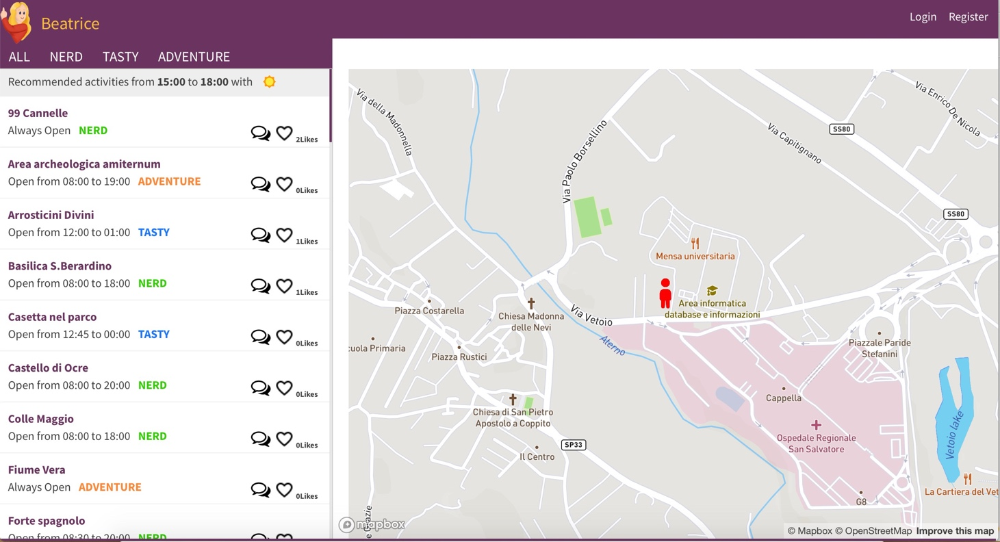</td>
  </tr>
 </table>
 <![endif]><!--[if gte vml 1]></o:wrapblock><![endif]--> 
<o:p></o:p>

<o:p>&nbsp;</o:p>

La seguente
view mostra cosa succede quando si seleziona
un’attività dall’elenco sulla parte sinistra
dell’immagine. Si noti che vengono
indicati i tempi di percorrenza per raggiungere tale attività
a seconda del mezzo mostrato:

<o:p>&nbsp;</o:p>

<o:p>&nbsp;</o:p>

<!--[if gte vml 1]><o:wrapblock><v:shape id="image12.jpeg"
  o:spid="_x0000_s1028" type="#_x0000_t75" style='position:absolute;
  margin-left:56.7pt;margin-top:8.9pt;width:477.4pt;height:258pt;z-index:11;
  visibility:visible;mso-wrap-style:square;mso-width-percent:0;
  mso-height-percent:0;mso-wrap-distance-left:0;mso-wrap-distance-top:0;
  mso-wrap-distance-right:0;mso-wrap-distance-bottom:0;
  mso-position-horizontal:absolute;mso-position-horizontal-relative:page;
  mso-position-vertical:absolute;mso-position-vertical-relative:text;
  mso-width-percent:0;mso-height-percent:0;mso-width-relative:page;
  mso-height-relative:page'>
  <v:imagedata src="README.fld/image021.jpg" o:title=""/>
  <w:wrap type="topAndBottom" anchorx="page"/>
 </v:shape><![endif]--><![if !vml]>
 <table cellpadding=0 cellspacing=0 align=left>
  <tr>
   <td width=47 height=0></td>
  </tr>
  <tr>
   <td></td>
   <td>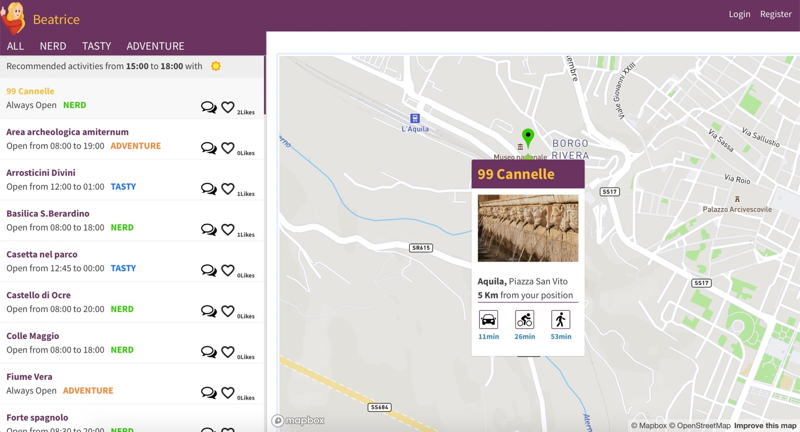</td>
  </tr>
 </table>
 <![endif]><!--[if gte vml 1]></o:wrapblock><![endif]--> 
<o:p></o:p>

 

Cliccando su uno dei tre mezzi di trasporto
proposti viene visualizzato il percorso più conveniente da effettuare con quel mezzo :

<o:p>&nbsp;</o:p>

<!--[if gte vml 1]><o:wrapblock><v:shape
  id="image13.jpeg" o:spid="_x0000_s1027" type="#_x0000_t75" style='position:absolute;
  margin-left:56.7pt;margin-top:10.2pt;width:477.4pt;height:258.75pt;z-index:12;
  visibility:visible;mso-wrap-style:square;mso-width-percent:0;
  mso-height-percent:0;mso-wrap-distance-left:0;mso-wrap-distance-top:0;
  mso-wrap-distance-right:0;mso-wrap-distance-bottom:0;
  mso-position-horizontal:absolute;mso-position-horizontal-relative:page;
  mso-position-vertical:absolute;mso-position-vertical-relative:text;
  mso-width-percent:0;mso-height-percent:0;mso-width-relative:page;
  mso-height-relative:page'>
  <v:imagedata src="README.fld/image022.jpg" o:title=""/>
  <w:wrap type="topAndBottom" anchorx="page"/>
 </v:shape><![endif]--><![if !vml]>
 <table cellpadding=0 cellspacing=0 align=left>
  <tr>
   <td width=47 height=0></td>
  </tr>
  <tr>
   <td></td>
   <td>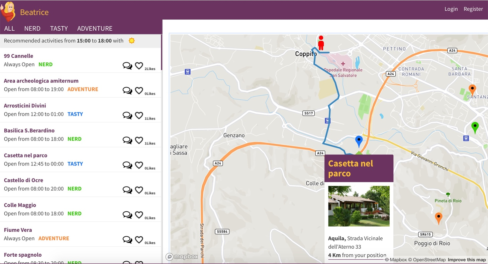</td>
  </tr>
 </table>
 <![endif]><!--[if gte vml 1]></o:wrapblock><![endif]--> 
<o:p></o:p>

<o:p>&nbsp;</o:p>

Effettuato il login è possibile visualizzare i like lasciati con il proprio profilo e la form per inserire un nuovo
commento per una data attività:

<o:p>&nbsp;</o:p>

<!--[if gte vml 1]><o:wrapblock><v:shape
  id="image14.jpeg" o:spid="_x0000_s1026" type="#_x0000_t75" style='position:absolute;
  margin-left:56.7pt;margin-top:10.4pt;width:477pt;height:258.35pt;z-index:13;
  visibility:visible;mso-wrap-style:square;mso-width-percent:0;
  mso-height-percent:0;mso-wrap-distance-left:0;mso-wrap-distance-top:0;
  mso-wrap-distance-right:0;mso-wrap-distance-bottom:0;
  mso-position-horizontal:absolute;mso-position-horizontal-relative:page;
  mso-position-vertical:absolute;mso-position-vertical-relative:text;
  mso-width-percent:0;mso-height-percent:0;mso-width-relative:page;
  mso-height-relative:page'>
  <v:imagedata src="README.fld/image023.jpg" o:title=""/>
  <w:wrap type="topAndBottom" anchorx="page"/>
 </v:shape><![endif]--><![if !vml]>
 <table cellpadding=0 cellspacing=0 align=left>
  <tr>
   <td width=47 height=0></td>
  </tr>
  <tr>
   <td></td>
   <td>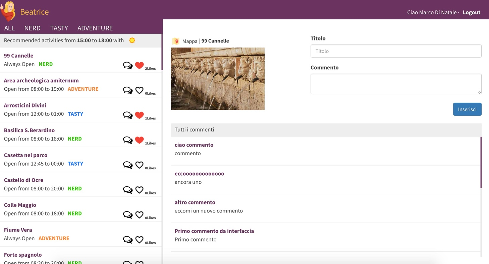</td>
  </tr>
 </table>
 <![endif]><!--[if gte vml 1]></o:wrapblock><![endif]--> 
<o:p></o:p>

</body>

</html>
