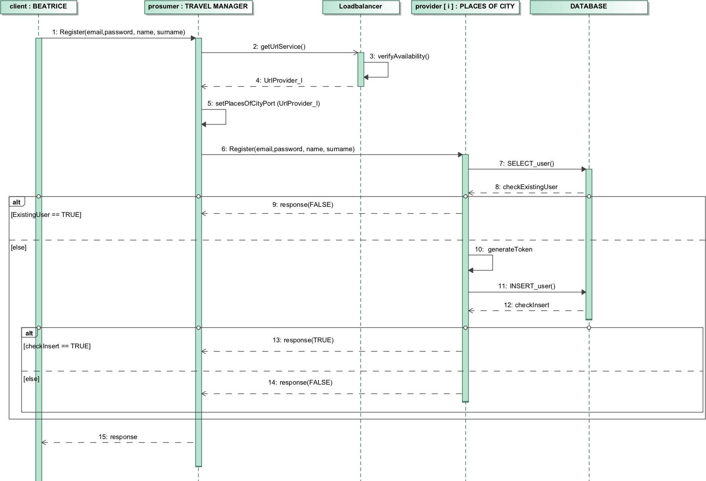

<html xmlns:v="urn:schemas-microsoft-com:vml"
xmlns:o="urn:schemas-microsoft-com:office:office"
xmlns:w="urn:schemas-microsoft-com:office:word"
xmlns:m="http://schemas.microsoft.com/office/2004/12/omml"
xmlns="http://www.w3.org/TR/REC-html40">

<head>
<meta http-equiv=Content-Type content="text/html; charset=unicode">
<meta name=ProgId content=Word.Document>
<meta name=Generator content="Microsoft Word 15">
<meta name=Originator content="Microsoft Word 15">
<link rel=File-List href="README.fld/filelist.xml">
<link rel=Edit-Time-Data href="README.fld/editdata.mso">

<link rel=themeData href="README.fld/themedata.thmx">
<link rel=colorSchemeMapping href="README.fld/colorschememapping.xml">

</head>

<body lang=en-IT style='tab-interval:36.0pt;word-wrap:break-word'>

<o:p>&nbsp;</o:p>

<o:p>&nbsp;</o:p>

<o:p>&nbsp;</o:p>

<o:p>&nbsp;</o:p>

<o:p>&nbsp;</o:p>

<o:p>&nbsp;</o:p>

<o:p>&nbsp;</o:p>

Beatrice

<b style='mso-bidi-font-weight:normal'><o:p>&nbsp;</o:p></b>

 

<h1>INTRODUZIONE</h1>

 

Il progetto è un’applicazione SOA-based che ha lo scopo di fornire agli utenti delle possibili attività da fare in una città (nel nostro caso L’Aquila ). Gli utenti possono consultare la cartina della città (fornita da un provider esterno, Map BOX ) sulla quale verranno mostrate delle attività proposte per quella città dall’applicazione (grazie ad un provider da noi implementato, PlacesOfCity ). Il mondo in cui verranno consigliate all’utente dipende dall’orario corrente e dal tempo atmosferico( fornito da un provider esterno, Weather ). Infatti se il locale è chiuso non verrà proposto o, se piove, non saranno proposte le escursioni in montagna o attività simili che sono sconvenienti da praticare con tempo avverso. Queste proposte ricreative possono essere consigliate all’utente anche secondo un filtro di interesse che si divide in tre profili: Adventure, Tasty e Nerd. Il primo profilo comprende tutte le attività “movimentate” che possono essere escursioni o sport da praticare. Il secondo profilo riguarda tutti locali culinari: dai pub ai locali gourmè, ma anche birrerie, pasticcerie o trattorie. L’ultimo profilo è quello nerd che consiglia tutti i luoghi storici della città, i monumenti ed i musei. Oltre a riportare i luoghi consigliati sulla mappa, è possibile cliccare sull’attività desiderata: in questo modo verranno mostrati 3 possibili modi per raggiungere tale attività ( bicicletta, auto o a piedi ) con i relativi tempi di percorrenza e, se se ne sceglie uno, verrà mostrato il percorso per arrivare al luogo desiderato dalla propria posizione.

L’utente ha la possibilità di registrarsi al sistema e, quando accede all’applicazione tramite login, può manifestare il suo gradimento per un’attività lasciando un like o un commento.

 

<h1 style='margin-top:9.2pt;line-height:12.3pt;mso-line-height-rule:exactly'>OVERVIEW</h1>

L’immagine sottostante mostra in che modo sono connesse le componenti del sistema.

 

<!--[if gte vml 1]><o:wrapblock><v:shapetype
  id="_x0000_t75" coordsize="21600,21600" o:spt="75" o:preferrelative="t"
  path="m@4@5l@4@11@9@11@9@5xe" filled="f" stroked="f">
  <v:stroke joinstyle="miter"/>
  <v:formulas>
   <v:f eqn="if lineDrawn pixelLineWidth 0"/>
   <v:f eqn="sum @0 1 0"/>
   <v:f eqn="sum 0 0 @1"/>
   <v:f eqn="prod @2 1 2"/>
   <v:f eqn="prod @3 21600 pixelWidth"/>
   <v:f eqn="prod @3 21600 pixelHeight"/>
   <v:f eqn="sum @0 0 1"/>
   <v:f eqn="prod @6 1 2"/>
   <v:f eqn="prod @7 21600 pixelWidth"/>
   <v:f eqn="sum @8 21600 0"/>
   <v:f eqn="prod @7 21600 pixelHeight"/>
   <v:f eqn="sum @10 21600 0"/>
  </v:formulas>
  <v:path o:extrusionok="f" gradientshapeok="t" o:connecttype="rect"/>
  <o:lock v:ext="edit" aspectratio="t"/>
 </v:shapetype><v:shape id="image2.jpeg" o:spid="_x0000_s1040" type="#_x0000_t75"
  style='position:absolute;margin-left:56.6pt;margin-top:18.8pt;width:500.25pt;
  height:376.5pt;z-index:251659264;visibility:visible;mso-wrap-style:square;
  mso-width-percent:0;mso-height-percent:0;mso-wrap-distance-left:0;
  mso-wrap-distance-top:0;mso-wrap-distance-right:0;mso-wrap-distance-bottom:0;
  mso-position-horizontal:absolute;mso-position-horizontal-relative:page;
  mso-position-vertical:absolute;mso-position-vertical-relative:text;
  mso-width-percent:0;mso-height-percent:0;mso-width-relative:page;
  mso-height-relative:page'>
  <v:imagedata src="README.fld/image003.jpg" o:title=""/>
  <w:wrap type="topAndBottom" anchorx="page"/>
 </v:shape><![endif]--><![if !vml]>
 <table cellpadding=0 cellspacing=0 align=left>
  <tr>
   <td width=47 height=0></td>
  </tr>
  <tr>
   <td></td>
   <td></td>
  </tr>
 </table>
 <![endif]><!--[if gte vml 1]></o:wrapblock><![endif]--> 
<o:p></o:p>

 

<o:p>&nbsp;</o:p>

<![if !supportLists]>•&nbsp;&nbsp;&nbsp;&nbsp;
<![endif]><b style='mso-bidi-font-weight:normal'>Beatrice: </b>è la componente che rappresenta l’applicazione web con cui si interfaccia l’utente. L’implementazione
è stata realizzata tramite Javascript,
html e css.

<o:p>&nbsp;</o:p>

<![if !supportLists]>•&nbsp;&nbsp;&nbsp;&nbsp;
<![endif]><b style='mso-bidi-font-weight:normal'>PlacesOfCity: </b>è la componente che fornisce informazioni sui luoghi consigliati della città. Al suo interno fornisce i nomi delle attività, le coordinate per raggiungerle, orari di apertura e chiusura del luogo che fornisce l’attività indicata, il clima consigliato per svolgere tale attività ed il suo profilo che può essere uno tra: Nerd (se si desidera visitare musei o monumenti), Adventure ( per attività sportive o ricreative) o Tasty (per pub e ristoranti). Permette poi la registrazione dell’utente al sistema e quindi anche il servizio di login. Inoltre fornisce all’utente registrato di lasciare like e commenti ad ogni attività presente nell’elenco delle proposte del sistema. Questo servizio
è fruibile tramite il protocollo di
comunicazione SOAP.

<o:p>&nbsp;</o:p>

<![if !supportLists]>•&nbsp;&nbsp;&nbsp;&nbsp;
<![endif]><b style='mso-bidi-font-weight:normal'>MapBOX: </b>è la componente che fornisce la comunicazione con le mappe e le funzionalità ad esse connesse ( come geolocalizzazione, informazioni sui tempi di percorrenza, indicazioni stradali, …). Questo servizio è fruibile tramite comunicazione REST.

<o:p>&nbsp;</o:p>

<![if !supportLists]>•&nbsp;&nbsp;&nbsp;&nbsp;
<![endif]><b style='mso-bidi-font-weight:normal'>Weather</b>: è la componente che viene interrogata per la richiesta delle previsioni meteo della città in cui si trova l’utente. Questo servizio è fruibile tramite comunicazione REST.

<o:p>&nbsp;</o:p>

<![if !supportLists]>•&nbsp;&nbsp;&nbsp;&nbsp;
<![endif]><b style='mso-bidi-font-weight:normal'>Travel Manager: </b>è il Prosumer che gestisce le richieste fatte tramite la web Application, servendosi di servizi a lui esterni (Providers). Il servizio
finale fornito dal prosumer, per quanto riguarda la parte di visualizzazione e di filtraggio dei servizi offerti in una città, è un elaborato dei servizi da lui consumati: condizioni meteorologiche, orario ed attività di una città vengono combinate per fornire un elenco delle attività da suggerire all’utente per visitare la città. Travel Manager fornisce inoltre delle REST API che permettono di consultare la mappa della città con le sue relative funzionalità, descritte in dettaglio precedentemente in MapBox. Lo stesso vale per i servizi di login, registrazione, like e commenti forniti e spiegati precedentemente in Places Of City. Per quanto riguarda invece la comunicazione, il prosumer utilizza sia la comunicazione SOAP ( per comunicare con il Loadbalancer e con il Provider Places Of City ) che quella REST

( con i due
Provider Weather e Map Box, e con la Web Application Beatrice ).

<o:p>&nbsp;</o:p>

<![if !supportLists]>•&nbsp;&nbsp;&nbsp;&nbsp;
<![endif]><b style='mso-bidi-font-weight:normal'>Loadbalancer : </b>è una componente che gestisce il carico di lavoro tramite un algoritmo di scheduling di tipo round robin: quando viene fatta una richiesta al prosumer quest’ultimo invoca il Loadbalancer per richiedere l’indirizzo di connessione ad uno dei server di Place Of City. Il Loadbalancer restituisce un indirizzo di connessione al servizio a seconda del numero di connessioni che ha assegnato in un certo intervallo di tempo e a seconda del numero di connessioni che questo supporta. Di conseguenza, nel momento in cui ad un server vengono assegnate un numero di richieste pari a quello massimo che può supportare ( numero scelto nell’algoritmo di balancing ) in un determinato intervallo di tempo, il Loadbalancer verificherà la possibilità di passare la richiesta al server successivo nella lista dei server disponibili, tramite l’algoritmo di Round Robin, fino a trovare il primo server disponibile. L’interrogazione viene fatta dal Prosumer
al Loadbalancer tramite chiamate SOAP.

 

<h1 style='line-height:12.3pt;mso-line-height-rule:exactly'>DIAGRAMMI</h1>

Questa sezione mostra lo studio dinamico del sistema rappresentato tramite sequence diagrams. Forniamo quindi di seguito 8 sequence Diagrams che rappresentano tutte le azioni che è possibile compiere con l’applicazione.

<![if !supportLists]>1.&nbsp;&nbsp;&nbsp;&nbsp; <![endif]>REGISTER

Una volta che l’utente inserisce le credenziali per registrarsi al sistema, il client Beatrice le invia, tramite chiamata REST, a Travel Manager .Il prosumer chiederà quindi al Loadbalancer l’indirizzo del
provider a cui fare richiesta. Fornitogli
l’indirizzo, Travel Manager invierà la richiesta di registrazione, tramite SOAP, ad uno dei server su cui è disponibile il servizio Place of

City .Successivamente il provider controllerà se le credenziali precedentemente fornite dall'utente sono già esistenti: se così fosse lo comunicherebbe al prosumer che, a sua volta, comunicherebbe al client l’impossibilità di effettuare la registrazione con quelle credenziali perché già esistenti. Similmente, quando la registrazione va a buon fine, per prima cosa il provider genera un token ( o userKey ) identificativo relativo all’utente che si è appena registrato e lo salva nel database associandolo a quell’utente, poi comunica tramite SOAP con il prosumer l’avvenuta registrazione. Una volta che il prosumer sa l’esito della registrazione, che sia andata a buon fine o meno, lo comunica al client tramite il REST.

 
 <table cellpadding=0 cellspacing=0 align=left>
  <tr>
   <td width=16 height=0></td>
  </tr>
  <tr>
   <td></td>
   <td></td>
  </tr>
 </table>
 <![endif]><!--[if gte vml 1]></o:wrapblock><![endif]--> 
<o:p></o:p>

 

<![if !supportLists]>2.&nbsp;&nbsp;&nbsp;&nbsp; <![endif]>LOGIN

Illustriamo
qui il servizio di Login. L’utente fornisce le sue credenziali ( email e password ) per effettuare l’accesso tramite il client Beatrice che le invia, sotto forma di richiesta REST, al prosumer. Poi il prosumer chiede al Loadbalancer l’indirizzo del provider a cui fare richiesta. Fornitogli l’indirizzo, Travel
Manager invierà la richiesta di login, tramite SOAP, ad uno dei server
su cui è disponibile il servizio Place of City. Ricevute la richiesta, il provider recupererà le informazioni dell’utente dal Data Base. La risposta della base di dati viene comunicata al prosumer sempre tramite SOAP, ed infine al client tramite REST.

Se le credenziali inserite risulteranno corrette, l’utente riuscirà ad effettuare l’accesso alla web application e gli verrà restituito il suo token ( o userKey ) identificativo con il quale potrà effettuare
tutte le richieste che chiedono
l’autenticazione.

Nel caso in cui le credenziali dovessero risultare scorrette non sarà possibile accedere all’applicazione. Una volta effettuato il login l’utente ha dei permessi diversi dal semplice utente visitatore: può visualizzare i like corrispondenti ai luoghi della città che lui stesso ha gradito e può visualizzare
e scrivere i commenti relativi ad
un’attività.

 

 

<!--[if gte vml 1]><o:wrapblock><v:shape
  id="image4.png" o:spid="_x0000_s1036" type="#_x0000_t75" style='position:absolute;
  margin-left:30.75pt;margin-top:16.4pt;width:537.9pt;height:306.55pt;
  z-index:3;visibility:visible;mso-wrap-style:square;mso-width-percent:0;
  mso-height-percent:0;mso-wrap-distance-left:0;mso-wrap-distance-top:0;
  mso-wrap-distance-right:0;mso-wrap-distance-bottom:0;
  mso-position-horizontal:absolute;mso-position-horizontal-relative:page;
  mso-position-vertical:absolute;mso-position-vertical-relative:text;
  mso-width-percent:0;mso-height-percent:0;mso-width-relative:page;
  mso-height-relative:page'>
  <v:imagedata src="README.fld/image005.png" o:title=""/>
  <w:wrap type="topAndBottom" anchorx="page"/>
 </v:shape><![endif]--><![if !vml]>
 <table cellpadding=0 cellspacing=0 align=left>
  <tr>
   <td width=21 height=0></td>
  </tr>
  <tr>
   <td></td>
   <td></td>
  </tr>
 </table>
 <![endif]><!--[if gte vml 1]></o:wrapblock><![endif]--> 
<o:p></o:p>

 

 

<o:p>&nbsp;</o:p>

<![if !supportLists]>3.&nbsp;&nbsp;&nbsp;&nbsp;
<![endif]>MAPBOX

Il provider MAPBOX fornisce, sempre secondo lo stesso principio, tre tipi servizi all’utente: la visualizzazione della mappa, la visualizzazione del percorso a seconda del mezzo di trasporto scelto ed il tempo impiegato per percorrere quella strada in base al mezzo scelto. Tutti e tre questi servizi sono chiesti dall’utente tramite Beatrice con una richiesta REST al prosumer.

Successivamente TravelManager richiederà il servizio
al provider MAPBOX
tramite REST. Quando
il provider darà la risposta a TravelManager, quest’ultimo filtrerà tale risposta a seconda di ciò che ha chiesto l’utente, riadattando anche i dati per l’applicazione. Terminata questa operazione restituirà il risultato
all’utente tramite il client.

 

<!--[if gte vml 1]><o:wrapblock><v:shape id="image5.jpeg"
  o:spid="_x0000_s1035" type="#_x0000_t75" style='position:absolute;
  margin-left:20.3pt;margin-top:16.35pt;width:551.95pt;height:227.95pt;
  z-index:4;visibility:visible;mso-wrap-style:square;mso-width-percent:0;
  mso-height-percent:0;mso-wrap-distance-left:0;mso-wrap-distance-top:0;
  mso-wrap-distance-right:0;mso-wrap-distance-bottom:0;
  mso-position-horizontal:absolute;mso-position-horizontal-relative:page;
  mso-position-vertical:absolute;mso-position-vertical-relative:text;
  mso-width-percent:0;mso-height-percent:0;mso-width-relative:page;
  mso-height-relative:page'>
  <v:imagedata src="README.fld/image007.jpg" o:title=""/>
  <w:wrap type="topAndBottom" anchorx="page"/>
 </v:shape><![endif]--><![if !vml]>
 <table cellpadding=0 cellspacing=0 align=left>
  <tr>
   <td width=10 height=0></td>
  </tr>
  <tr>
   <td></td>
   <td></td>
  </tr>
 </table>
 <![endif]><!--[if gte vml 1]></o:wrapblock><![endif]--> 
<o:p></o:p>

 

<![if !supportLists]>4.&nbsp;&nbsp;&nbsp;&nbsp; <![endif]>LIKE BY USER

<o:p>&nbsp;</o:p>

Quando l’utente ha effettuato il login può visualizzare i like da lui assegnati in precedenza. Questa operazione avviene automaticamente non appena l’utente effettua il login: per prima cosa il client invia
al prosumer la userKey dell’utente tramite servizio REST. Poi il prosumer
chiede al Loadbalancer l’indirizzo del provider a cui fare richiesta. Fornitogli l’indirizzo, Travel Manager invierà la richiesta di visualizzazione dei like, tramite
SOAP, ad uno dei server
su cui è disponibile il servizio Place of City. Quest’ultimo controllerà nel Data Base se l’userKey fornitagli corrisponde effettivamente ad un utente esistente
nella base di dati.

Se
la risposta è positiva ( quindi l’IDuser è diverso da NULL ), significa che il
Data Base restituirà la lista dei
like al provider che a sua volta la inoltrerà al prosumer tramite SOAP, che
infine la restituirà all’utente grazie al client tramite REST.

Invece,
nel caso in cui l’userKey non ha un IDuser corrispondente nel Data Base (
quindi l’IDuser è NULL ), il provider lo comunicherà al prosumer tramite SOAP e, come sempre, tale risultato sarà inoltrato da TravelManager
al client tramite REST.

 

 

 

<!--[if gte vml 1]><o:wrapblock><v:shape
  id="image6.png" o:spid="_x0000_s1034" type="#_x0000_t75" style='position:absolute;
  margin-left:20.4pt;margin-top:7.85pt;width:542.5pt;height:326.35pt;z-index:5;
  visibility:visible;mso-wrap-style:square;mso-width-percent:0;
  mso-height-percent:0;mso-wrap-distance-left:0;mso-wrap-distance-top:0;
  mso-wrap-distance-right:0;mso-wrap-distance-bottom:0;
  mso-position-horizontal:absolute;mso-position-horizontal-relative:page;
  mso-position-vertical:absolute;mso-position-vertical-relative:text;
  mso-width-percent:0;mso-height-percent:0;mso-width-relative:page;
  mso-height-relative:page'>
  <v:imagedata src="README.fld/image008.png" o:title=""/>
  <w:wrap type="topAndBottom" anchorx="page"/>
 </v:shape><![endif]--><![if !vml]>
 <table cellpadding=0 cellspacing=0 align=left>
  <tr>
   <td width=10 height=0></td>
  </tr>
  <tr>
   <td></td>
   <td></td>
  </tr>
 </table>
 <![endif]><!--[if gte vml 1]></o:wrapblock><![endif]--> 
<o:p></o:p>

 

<![if !supportLists]>5.&nbsp;&nbsp;&nbsp;&nbsp;
<![endif]>ALL COMMENT

Quando l’utente desidera visualizzare i commenti lasciati per un’attività, il client invia questa richiesta tramite REST al prosumer, passando l’id di dell’attività richiesta. Poi il prosumer chiede al Loadbalancer l’indirizzo del provider a cui fare richiesta. Fornitogli l’indirizzo, Travel Manager invierà la richiesta di visualizzazione
dei commenti, tramite SOAP, ad uno dei server su cui è disponibile il servizio Place of City. In questo modo il provider può quindi richiedere le informazioni desiderate al Data Base. Quando la base di dati risponderà, restituirà la lista dei commenti al provider che, a sua volta, la inoltrerà al prosumer con il fine di fornirla all’utente tramite Beatrice.

 

 

<!--[if gte vml 1]><o:wrapblock><v:shape
  id="image7.jpeg" o:spid="_x0000_s1033" type="#_x0000_t75" style='position:absolute;
  margin-left:16.2pt;margin-top:18.8pt;width:551.35pt;height:248.6pt;z-index:6;
  visibility:visible;mso-wrap-style:square;mso-width-percent:0;
  mso-height-percent:0;mso-wrap-distance-left:0;mso-wrap-distance-top:0;
  mso-wrap-distance-right:0;mso-wrap-distance-bottom:0;
  mso-position-horizontal:absolute;mso-position-horizontal-relative:page;
  mso-position-vertical:absolute;mso-position-vertical-relative:text;
  mso-width-percent:0;mso-height-percent:0;mso-width-relative:page;
  mso-height-relative:page'>
  <v:imagedata src="README.fld/image010.jpg" o:title=""/>
  <w:wrap type="topAndBottom" anchorx="page"/>
 </v:shape><![endif]--><![if !vml]>
 <table cellpadding=0 cellspacing=0 align=left>
  <tr>
   <td width=6 height=0></td>
  </tr>
  <tr>
   <td></td>
   <td></td>
  </tr>
 </table>
 <![endif]><!--[if gte vml 1]></o:wrapblock><![endif]--> 
<o:p></o:p>

 

ADD LIKE

Se l’utente desidera mettere un like ad un’attività, il client inoltrerà tale richiesta al prosumer tramite servizio REST,passandogli la userKey e l’IDactivity.

Poi il prosumer chiede al Loadbalancer l’indirizzo del provider a cui fare richiesta. Fornitogli l’indirizzo, Travel Manager invierà la richiesta di aggiungere un like,
tramite SOAP, ad uno dei server su cui è disponibile il servizio Place of City. Il provider comunicherà poi con il Data Base per capire se l’azione richiesta dall’utente è possibile. Infatti per prima cosa PlacesOfCity fornirà l’userKey al Data Base con il fine di vedere se esiste l’IDuser per quell’utente. Se la risposta è positiva ( quindi l’IDuser è diverso da NULL ), significa che viene effettuata l’aggiunta del like.

Successivamente il sistema controllerà l’esito di tale operazione, restituendo la risposta di errore o di corretto funzionamento al prosumer tramite SOAP, che sarà infine inviata dal prosumer al client tramite REST.

Invece,
nel caso in cui l’userKey non ha un’IDuser corrispondente
nel Data Base ( quindi l’IDuser è NULL ), il provider lo comunicherà al prosumer tramite SOAP e, come sempre, tale risultato sarà inoltrato da TravelManager
al client tramite REST.

<!--[if gte vml 1]><o:wrapblock><v:shape id="image8.jpeg"
  o:spid="_x0000_s1032" type="#_x0000_t75" style='position:absolute;
  margin-left:34.25pt;margin-top:15.75pt;width:543.25pt;height:370.45pt;
  z-index:7;visibility:visible;mso-wrap-style:square;mso-width-percent:0;
  mso-height-percent:0;mso-wrap-distance-left:0;mso-wrap-distance-top:0;
  mso-wrap-distance-right:0;mso-wrap-distance-bottom:0;
  mso-position-horizontal:absolute;mso-position-horizontal-relative:page;
  mso-position-vertical:absolute;mso-position-vertical-relative:text;
  mso-width-percent:0;mso-height-percent:0;mso-width-relative:page;
  mso-height-relative:page'>
  <v:imagedata src="README.fld/image011.jpg" o:title=""/>
  <w:wrap type="topAndBottom" anchorx="page"/>
 </v:shape><![endif]--><![if !vml]>
 <table cellpadding=0 cellspacing=0 align=left>
  <tr>
   <td width=24 height=0></td>
  </tr>
  <tr>
   <td></td>
   <td></td>
  </tr>
 </table>
 <![endif]><!--[if gte vml 1]></o:wrapblock><![endif]--> 
<o:p></o:p>

 

ADD COMMENT

<o:p>&nbsp;</o:p>

Il processo per inserire un commento è molto simile a quello per inserire un like: il client inoltrerà il commento appena inserito
dall’user al prosumer, tramite servizio REST, passandogli anche la userKey e l’IDactivity.

Poi il prosumer chiede al Loadbalancer l’indirizzo del provider a cui fare richiesta. Fornitogli l’indirizzo, Travel Manager invierà la richiesta di aggiunta
commento, tramite SOAP, ad uno dei server su cui è disponibile il servizio Place of City. Il provider, successivamente, comunicherà con il Data Base per capire se l’azione richiesta dall’utente è possibile. Infatti per prima cosa PlacesOfCity fornirà l’userKey al Data Base con il fine di vedere se esiste l’IDuser per quell’utente. Se la risposta è positiva ( quindi l’IDuser è diverso da NULL ), significa che viene effettuata l’aggiunta del commento. Successivamente il sistema controllerà l’esito di tale operazione, restituendo la risposta di errore o di corretto funzionamento al prosumer tramite SOAP, che sarà infine inviata dal prosumer al
client tramite REST.

Invece,
nel caso in cui l’userKey non ha un’IDuser corrispondente
nel Data Base ( quindi l’IDuser è NULL ), il provider lo comunicherà al prosumer tramite SOAP e, come sempre, tale risultato sarà inoltrato da TravelManager
al client tramite REST.

 

<!--[if gte vml 1]><o:wrapblock><v:shape
  id="image9.jpeg" o:spid="_x0000_s1031" type="#_x0000_t75" style='position:absolute;
  margin-left:29.35pt;margin-top:14.45pt;width:540.85pt;height:342.15pt;
  z-index:8;visibility:visible;mso-wrap-style:square;mso-width-percent:0;
  mso-height-percent:0;mso-wrap-distance-left:0;mso-wrap-distance-top:0;
  mso-wrap-distance-right:0;mso-wrap-distance-bottom:0;
  mso-position-horizontal:absolute;mso-position-horizontal-relative:page;
  mso-position-vertical:absolute;mso-position-vertical-relative:text;
  mso-width-percent:0;mso-height-percent:0;mso-width-relative:page;
  mso-height-relative:page'>
  <v:imagedata src="README.fld/image012.jpg" o:title=""/>
  <w:wrap type="topAndBottom" anchorx="page"/>
 </v:shape><![endif]--><![if !vml]>
 <table cellpadding=0 cellspacing=0 align=left>
  <tr>
   <td width=19 height=0></td>
  </tr>
  <tr>
   <td></td>
   <td></td>
  </tr>
 </table>
 <![endif]><!--[if gte vml 1]></o:wrapblock><![endif]--> 
<o:p></o:p>

 

ACTIVITY LIST

<o:p>&nbsp;</o:p>

Quando l’utente richiede al prosumer, tramite REST, la lista delle attività proposte da Beatrice per quella città, questo chiede per prima cosa al Loadbalancer l’indirizzo del provider Place of City a cui effettuare la richiesta di questa lista.
Fornitogli tale indirizzo,
TravelManager inoltrerà parallelamente due richieste: la richiesta (tramite REST) del tempo atmosferico per quella città in quel giorno e la richiesta
(tramite SOAP) delle attività per
quella città ( all’indirizzo che il Loadbalancer ha restituito al
prosumer). La prima verrà richiesta al provider PlacesOfCity, che a sua volta interrogherà il Data Base per essere in grado di fornire tale risposta. La seconda
verrà richiesta al provider Weather. Non appena i provider avranno risposto al prosumer, TravelManager gestirà le informazioni appena ricevute componendo la lista delle attività secondo il tempo metereologico della città in quel momento, mostrando solo le attività disponibili in quel momento secondo il meteo e l’orario. Composta questa lista, il risultato sarà mostrato all’utente tramite Beatrice.

 

<!--[if gte vml 1]><o:wrapblock><v:shape
  id="image10.jpeg" o:spid="_x0000_s1030" type="#_x0000_t75" style='position:absolute;
  margin-left:20.25pt;margin-top:18.6pt;width:560.45pt;height:348.6pt;
  z-index:9;visibility:visible;mso-wrap-style:square;mso-width-percent:0;
  mso-height-percent:0;mso-wrap-distance-left:0;mso-wrap-distance-top:0;
  mso-wrap-distance-right:0;mso-wrap-distance-bottom:0;
  mso-position-horizontal:absolute;mso-position-horizontal-relative:page;
  mso-position-vertical:absolute;mso-position-vertical-relative:text;
  mso-width-percent:0;mso-height-percent:0;mso-width-relative:page;
  mso-height-relative:page'>
  <v:imagedata src="README.fld/image013.jpg" o:title=""/>
  <w:wrap type="topAndBottom" anchorx="page"/>
 </v:shape><![endif]--><![if !vml]>
 <table cellpadding=0 cellspacing=0 align=left>
  <tr>
   <td width=10 height=0></td>
  </tr>
  <tr>
   <td></td>
   <td></td>
  </tr>
 </table>
 <![endif]><!--[if gte vml 1]></o:wrapblock><![endif]--> 
<o:p></o:p>

 

<h1 style='line-height:12.3pt;mso-line-height-rule:exactly'>INSTALLAZIONE</h1>

In questa sezione illustriamo le tecnologie e i tools usati ed una breve descrizione di come installare il sistema.

TECHNOLOGIES AND TOOLS

<table class=MsoNormalTable border=1 cellspacing=0 cellpadding=0
 style='margin-left:46.15pt;border-collapse:collapse;mso-table-layout-alt:fixed;
 border:none;mso-border-alt:solid #7F7F7F .5pt;mso-yfti-tbllook:480;mso-padding-alt:
 0cm 0cm 0cm 0cm;mso-border-insideh:.5pt solid #7F7F7F;mso-border-insidev:.5pt solid #7F7F7F'>
 <tr style='mso-yfti-irow:0;mso-yfti-firstrow:yes;height:22.6pt'>
  <td width=321 valign=top style='width:240.8pt;border:none;border-bottom:solid #7F7F7F 1.0pt;
  mso-border-bottom-alt:solid #7F7F7F .5pt;background:#BEC0BF;padding:0cm 0cm 0cm 0cm;
  height:22.6pt'>
  
<b style='mso-bidi-font-weight:
  normal'>Tool</b><b
  style='mso-bidi-font-weight:normal'> </b><b style='mso-bidi-font-weight:normal'>or</b><b
  style='mso-bidi-font-weight:normal'> </b><b style='mso-bidi-font-weight:normal'>Technology</b><b
  style='mso-bidi-font-weight:normal'></b>

  </td>
  <td width=321 valign=top style='width:240.8pt;border:none;border-bottom:solid #7F7F7F 1.0pt;
  mso-border-bottom-alt:solid #7F7F7F .5pt;background:#BEC0BF;padding:0cm 0cm 0cm 0cm;
  height:22.6pt'>
  
<b style='mso-bidi-font-weight:
  normal'>Version</b><b
  style='mso-bidi-font-weight:normal'></b>

  </td>
 </tr>
 <tr style='mso-yfti-irow:1;height:22.35pt'>
  <td width=321 valign=top style='width:240.8pt;border:solid #BFBFBF 1.0pt;
  border-top:none;mso-border-top-alt:solid #7F7F7F .5pt;mso-border-alt:solid #BFBFBF .25pt;
  mso-border-top-alt:solid #7F7F7F .5pt;padding:0cm 0cm 0cm 0cm;height:22.35pt'>
  
JDK

  </td>
  <td width=321 valign=top style='width:240.8pt;border-top:none;border-left:
  none;border-bottom:solid #BFBFBF 1.0pt;border-right:solid #BFBFBF 1.0pt;
  mso-border-top-alt:solid #7F7F7F .5pt;mso-border-left-alt:solid #BFBFBF .25pt;
  mso-border-alt:solid #BFBFBF .25pt;mso-border-top-alt:solid #7F7F7F .5pt;
  padding:0cm 0cm 0cm 0cm;height:22.35pt'>
  
1.8

  </td>
 </tr>
 <tr style='mso-yfti-irow:2;height:22.5pt'>
  <td width=321 valign=top style='width:240.8pt;border:solid #BFBFBF 1.0pt;
  border-top:none;mso-border-top-alt:solid #BFBFBF .25pt;mso-border-alt:solid #BFBFBF .25pt;
  background:#EFEFEF;padding:0cm 0cm 0cm 0cm;height:22.5pt'>
  
Eclipse Photon

  </td>
  <td width=321 valign=top style='width:240.8pt;border-top:none;border-left:
  none;border-bottom:solid #BFBFBF 1.0pt;border-right:solid #BFBFBF 1.0pt;
  mso-border-top-alt:solid #BFBFBF .25pt;mso-border-left-alt:solid #BFBFBF .25pt;
  mso-border-alt:solid #BFBFBF .25pt;background:#EFEFEF;padding:0cm 0cm 0cm 0cm;
  height:22.5pt'>
  
4.8.0

  </td>
 </tr>
 <tr style='mso-yfti-irow:3;height:22.5pt'>
  <td width=321 valign=top style='width:240.8pt;border:solid #BFBFBF 1.0pt;
  border-top:none;mso-border-top-alt:solid #BFBFBF .25pt;mso-border-alt:solid #BFBFBF .25pt;
  padding:0cm 0cm 0cm 0cm;height:22.5pt'>
  
Tomcat

  </td>
  <td width=321 valign=top style='width:240.8pt;border-top:none;border-left:
  none;border-bottom:solid #BFBFBF 1.0pt;border-right:solid #BFBFBF 1.0pt;
  mso-border-top-alt:solid #BFBFBF .25pt;mso-border-left-alt:solid #BFBFBF .25pt;
  mso-border-alt:solid #BFBFBF .25pt;padding:0cm 0cm 0cm 0cm;height:22.5pt'>
  
8.5

  </td>
 </tr>
 <tr style='mso-yfti-irow:4;mso-yfti-lastrow:yes;height:22.5pt'>
  <td width=321 valign=top style='width:240.8pt;border:solid #BFBFBF 1.0pt;
  border-top:none;mso-border-top-alt:solid #BFBFBF .25pt;mso-border-alt:solid #BFBFBF .25pt;
  background:#EFEFEF;padding:0cm 0cm 0cm 0cm;height:22.5pt'>
  
Maven

  </td>
  <td width=321 valign=top style='width:240.8pt;border-top:none;border-left:
  none;border-bottom:solid #BFBFBF 1.0pt;border-right:solid #BFBFBF 1.0pt;
  mso-border-top-alt:solid #BFBFBF .25pt;mso-border-left-alt:solid #BFBFBF .25pt;
  mso-border-alt:solid #BFBFBF .25pt;background:#EFEFEF;padding:0cm 0cm 0cm 0cm;
  height:22.5pt'>
  
3.6.0

  </td>
 </tr>
</table>

<o:p>&nbsp;</o:p>

API REST

Presentiamo la lista delle
API REST messe
a disposizione dal prosumer:

<table class=MsoNormalTable border=1 cellspacing=0 cellpadding=0
 >
 <tr style='mso-yfti-irow:0;mso-yfti-firstrow:yes;height:32.65pt'>
  <td width=642 colspan=2 valign=top style='width:481.6pt;border:solid #FFFEBF 1.0pt;
  border-bottom:solid #7F7F7F 1.0pt;mso-border-alt:solid #FFFEBF .25pt;
  mso-border-bottom-alt:solid #7F7F7F .5pt;background:peachpuff;padding:0cm 0cm 0cm 0cm;
  height:32.65pt'>
  
<b style='mso-bidi-font-weight:normal'>infoPoint2PointByMeans</b>

  
Ottenere i tempi
  di percorrenza tra due punti

  </td>
 </tr>
 <tr style='mso-yfti-irow:1;height:31.65pt'>
  <td width=642 colspan=2 valign=top style='width:481.6pt;border-top:none;
  border-left:solid #FFFEBF 1.0pt;border-bottom:solid #7F7F7F 1.0pt;border-right:
  solid #FFFEBF 1.0pt;mso-border-top-alt:solid #7F7F7F .5pt;mso-border-top-alt:
  #7F7F7F .5pt;mso-border-left-alt:#FFFEBF .25pt;mso-border-bottom-alt:#7F7F7F .5pt;
  mso-border-right-alt:#FFFEBF .25pt;mso-border-style-alt:solid;background:
  #E5EFB0;padding:0cm 0cm 0cm 0cm;height:31.65pt'>
  
http://localhost:8080/travelmanager/api/maps-info-poiny2point/start/{startLon}/{startLat}/end/

  
{endLon}/{endLat}

  </td>
 </tr>
 <tr style='mso-yfti-irow:2;height:22.35pt'>
  <td width=118 valign=top>
  
<b style='mso-bidi-font-weight:normal'>PARAMETRO</b>

  </td>
  <td width=525 valign=top>
  
<b style='mso-bidi-font-weight:
  normal'>DESCRIZIONE</b>

  </td>
 </tr>
 <tr style='mso-yfti-irow:3;height:22.5pt'>
  <td width=118 valign=top>
  
<b style='mso-bidi-font-weight:normal'>{startLon}</b>

  </td>
  <td width=525 valign=top >
  
Longitudine del punto relativo alla posizione dell’utente

  </td>
 </tr>
 <tr style='mso-yfti-irow:4;height:22.5pt'>
  <td width=118 valign=top >
  
<b style='mso-bidi-font-weight:normal'>{startLat}</b>

  </td>
  <td width=525 valign=top >
  
Latitudine del punto relativo
  alla posizione dell’utente

  </td>
 </tr>
 <tr style='mso-yfti-irow:5;height:22.5pt'>
  <td width=118 valign=top>
  
<b style='mso-bidi-font-weight:normal'>{endLon}</b>

  </td>
  <td width=525 valign=top >
  
Longitudine del punto relativo alla destinazione dell’utente

  </td>
 </tr>
 <tr style='mso-yfti-irow:6;mso-yfti-lastrow:yes;height:22.5pt'>
  <td width=118 valign=top style='width:88.2pt;border-top:none;border-left:
  solid #FFFEBF 1.0pt;border-bottom:solid #FFFEBF 1.0pt;border-right:solid #BFBFBF 1.0pt;
  mso-border-top-alt:solid #BFBFBF .25pt;mso-border-top-alt:#BFBFBF;mso-border-left-alt:
  #FFFEBF;mso-border-bottom-alt:#FFFEBF;mso-border-right-alt:#BFBFBF;
  mso-border-style-alt:solid;mso-border-width-alt:.25pt;padding:0cm 0cm 0cm 0cm;
  height:22.5pt'>
  
<b style='mso-bidi-font-weight:normal'>{endLat}</b>

  </td>
  <td width=525 valign=top style='width:393.4pt;border-top:none;border-left:
  none;border-bottom:solid #FFFEBF 1.0pt;border-right:solid #FFFEBF 1.0pt;
  mso-border-top-alt:solid #BFBFBF .25pt;mso-border-left-alt:solid #BFBFBF .25pt;
  mso-border-top-alt:#BFBFBF;mso-border-left-alt:#BFBFBF;mso-border-bottom-alt:
  #FFFEBF;mso-border-right-alt:#FFFEBF;mso-border-style-alt:solid;mso-border-width-alt:
  .25pt;padding:0cm 0cm 0cm 0cm;height:22.5pt'>
  
Latitudine del punto relativo alla destinazione dell’utente

  </td>
 </tr>
</table>

<table class=MsoNormalTable border=1 cellspacing=0 cellpadding=0
 >
 <tr style='mso-yfti-irow:0;mso-yfti-firstrow:yes;height:32.65pt'>
  <td width=642 colspan=2 valign=top style='width:481.6pt;border:solid #FFFEBF 1.0pt;
  border-bottom:solid #7F7F7F 1.0pt;mso-border-alt:solid #FFFEBF .25pt;
  mso-border-bottom-alt:solid #7F7F7F .5pt;background:peachpuff;padding:0cm 0cm 0cm 0cm;
  height:32.65pt'>
  
<b style='mso-bidi-font-weight:normal'>routePoint2Point</b>

  
Ottenere il percorso verso l'attività desiderata attraverso un determinato mezzo di trasposto

  </td>
 </tr>
 <tr style='mso-yfti-irow:1;height:31.65pt'>
  <td width=642 colspan=2 valign=top style='width:481.6pt;border-top:none;
  border-left:solid #FFFEBF 1.0pt;border-bottom:solid #7F7F7F 1.0pt;border-right:
  solid #FFFEBF 1.0pt;mso-border-top-alt:solid #7F7F7F .5pt;mso-border-top-alt:
  #7F7F7F .5pt;mso-border-left-alt:#FFFEBF .25pt;mso-border-bottom-alt:#7F7F7F .5pt;
  mso-border-right-alt:#FFFEBF .25pt;mso-border-style-alt:solid;background:
  #E5EFB0;padding:0cm 0cm 0cm 0cm;height:31.65pt'>
  
http://localhost:8080/travelmanager/api/maps-coordinate/means/{means}/start/{startLon}/

  
{startLat}/end/{endLon}/{endLat}

  </td>
 </tr>
 <tr style='mso-yfti-irow:2;height:22.35pt'>
  <td width=118 valign=top>
  
<b style='mso-bidi-font-weight:normal'>PARAMETRO</b>

  </td>
  <td width=525 valign=top>
  
<b style='mso-bidi-font-weight:
  normal'>DESCRIZIONE</b>

  </td>
 </tr>
 <tr style='mso-yfti-irow:3;height:22.5pt'>
  <td width=118 valign=top>
  
<b style='mso-bidi-font-weight:normal'>{means}</b>

  </td>
  <td width=525 valign=top >
  
Mezzo scelto per il trasporto

  </td>
 </tr>
 <tr style='mso-yfti-irow:4;height:22.45pt'>
  <td width=118 valign=top style='width:88.2pt;border-top:none;border-left:
  solid #FFFEBF 1.0pt;border-bottom:solid #BFBFBF 1.0pt;border-right:solid #BFBFBF 1.0pt;
  mso-border-top-alt:solid #BFBFBF .25pt;mso-border-alt:solid #BFBFBF .25pt;
  mso-border-left-alt:solid #FFFEBF .25pt;padding:0cm 0cm 0cm 0cm;height:22.45pt'>
  
<b style='mso-bidi-font-weight:normal'>{startLon}</b>

  </td>
  <td width=525 valign=top style='width:393.4pt;border-top:none;border-left:
  none;border-bottom:solid #BFBFBF 1.0pt;border-right:solid #FFFEBF 1.0pt;
  mso-border-top-alt:solid #BFBFBF .25pt;mso-border-left-alt:solid #BFBFBF .25pt;
  mso-border-alt:solid #BFBFBF .25pt;mso-border-right-alt:solid #FFFEBF .25pt;
  padding:0cm 0cm 0cm 0cm;height:22.45pt'>
  
Longitudine del punto relativo alla posizione dell’utente

  </td>
 </tr>
 <tr style='mso-yfti-irow:5;height:22.5pt'>
  <td width=118 valign=top>
  
<b style='mso-bidi-font-weight:normal'>{startLat}</b>

  </td>
  <td width=525 valign=top >
  
Latitudine del punto relativo alla posizione dell’utente

  </td>
 </tr>
 <tr style='mso-yfti-irow:6;height:22.5pt'>
  <td width=118 valign=top >
  
<b style='mso-bidi-font-weight:normal'>{endLon}</b>

  </td>
  <td width=525 valign=top >
  
Longitudine del punto relativo
  alla destinazione dell’utente

  </td>
 </tr>
 <tr style='mso-yfti-irow:7;mso-yfti-lastrow:yes;height:22.5pt'>
  <td width=118 valign=top style='width:88.2pt;border-top:none;border-left:
  solid #FFFEBF 1.0pt;border-bottom:solid #FFFEBF 1.0pt;border-right:solid #BFBFBF 1.0pt;
  mso-border-top-alt:solid #BFBFBF .25pt;mso-border-top-alt:#BFBFBF;mso-border-left-alt:
  #FFFEBF;mso-border-bottom-alt:#FFFEBF;mso-border-right-alt:#BFBFBF;
  mso-border-style-alt:solid;mso-border-width-alt:.25pt;background:#EFEFEF;
  padding:0cm 0cm 0cm 0cm;height:22.5pt'>
  
<b style='mso-bidi-font-weight:normal'>{endLat}</b>

  </td>
  <td width=525 valign=top style='width:393.4pt;border-top:none;border-left:
  none;border-bottom:solid #FFFEBF 1.0pt;border-right:solid #FFFEBF 1.0pt;
  mso-border-top-alt:solid #BFBFBF .25pt;mso-border-left-alt:solid #BFBFBF .25pt;
  mso-border-top-alt:#BFBFBF;mso-border-left-alt:#BFBFBF;mso-border-bottom-alt:
  #FFFEBF;mso-border-right-alt:#FFFEBF;mso-border-style-alt:solid;mso-border-width-alt:
  .25pt;background:#EFEFEF;padding:0cm 0cm 0cm 0cm;height:22.5pt'>
  
Latitudine del punto
  relativo alla destinazione dell’utente

  </td>
 </tr>
</table>

 

<table class=MsoNormalTable border=1 cellspacing=0 cellpadding=0
 >
 <tr style='mso-yfti-irow:0;mso-yfti-firstrow:yes;height:32.65pt'>
  <td width=642 colspan=2 valign=top style='width:481.6pt;border:solid #FFFEBF 1.0pt;
  border-bottom:solid #7F7F7F 1.0pt;mso-border-alt:solid #FFFEBF .25pt;
  mso-border-bottom-alt:solid #7F7F7F .5pt;background:peachpuff;padding:0cm 0cm 0cm 0cm;
  height:32.65pt'>
  
<b style='mso-bidi-font-weight:normal'>register</b>

  
Registrazione alla web application

  </td>
 </tr>
 <tr style='mso-yfti-irow:1;height:22.25pt'>
  <td width=642 colspan=2 valign=top >
  
http://localhost:8080/travelmanager/api/register/{name}/{surname}/{email}/{password}

  </td>
 </tr>
 <tr style='mso-yfti-irow:2;height:22.35pt'>
  <td width=118 valign=top>
  
<b style='mso-bidi-font-weight:normal'>PARAMETRO</b>

  </td>
  <td width=525 valign=top>
  
<b style='mso-bidi-font-weight:
  normal'>DESCRIZIONE</b>

  </td>
 </tr>
 <tr style='mso-yfti-irow:3;height:22.5pt'>
  <td width=118 valign=top>
  
<b style='mso-bidi-font-weight:normal'>{name}</b>

  </td>
  <td width=525 valign=top >
  
Nome utente

  </td>
 </tr>
 <tr style='mso-yfti-irow:4;height:22.5pt'>
  <td width=118 valign=top >
  
<b style='mso-bidi-font-weight:normal'>{surname}</b>

  </td>
  <td width=525 valign=top >
  
Cognome utente

  </td>
 </tr>
 <tr style='mso-yfti-irow:5;height:22.5pt'>
  <td width=118 valign=top>
  
<b style='mso-bidi-font-weight:normal'>{email}</b>

  </td>
  <td width=525 valign=top >
  
Email utente

  </td>
 </tr>
 <tr style='mso-yfti-irow:6;mso-yfti-lastrow:yes;height:22.5pt'>
  <td width=118 valign=top >
  
<b style='mso-bidi-font-weight:normal'>{password}</b>

  </td>
  <td width=525 valign=top >
  
Password utente

  </td>
 </tr>
</table>

<o:p>&nbsp;</o:p>

<table class=MsoNormalTable border=1 cellspacing=0 cellpadding=0
 >
 <tr style='mso-yfti-irow:0;mso-yfti-firstrow:yes;height:32.65pt'>
  <td width=642 colspan=2 valign=top style='width:481.6pt;border:solid #FFFEBF 1.0pt;
  border-bottom:solid #7F7F7F 1.0pt;mso-border-alt:solid #FFFEBF .25pt;
  mso-border-bottom-alt:solid #7F7F7F .5pt;background:peachpuff;padding:0cm 0cm 0cm 0cm;
  height:32.65pt'>
  
<b style='mso-bidi-font-weight:normal'>login</b>

  
Login per accedere alla web application

  </td>
 </tr>
 <tr style='mso-yfti-irow:1;height:22.25pt'>
  <td width=642 colspan=2 valign=top >
  
http://localhost:8080/travelmanager/api/login/{email}/{password}

  </td>
 </tr>
 <tr style='mso-yfti-irow:2;height:22.35pt'>
  <td width=118 valign=top>
  
<b style='mso-bidi-font-weight:normal'>PARAMETRO</b>

  </td>
  <td width=525 valign=top>
  
<b style='mso-bidi-font-weight:
  normal'>DESCRIZIONE</b>

  </td>
 </tr>
 <tr style='mso-yfti-irow:3;height:22.5pt'>
  <td width=118 valign=top>
  
<b style='mso-bidi-font-weight:normal'>{email}</b>

  </td>
  <td width=525 valign=top >
  
Email utente

  </td>
 </tr>
 <tr style='mso-yfti-irow:4;mso-yfti-lastrow:yes;height:22.5pt'>
  <td width=118 valign=top >
  
<b style='mso-bidi-font-weight:normal'>{password}</b>

  </td>
  <td width=525 valign=top >
  
Password utente

  </td>
 </tr>
</table>

<table class=MsoNormalTable border=1 cellspacing=0 cellpadding=0
 >
 <tr style='mso-yfti-irow:0;mso-yfti-firstrow:yes;height:32.65pt'>
  <td width=642 colspan=2 valign=top style='width:481.6pt;border:solid #FFFEBF 1.0pt;
  border-bottom:solid #7F7F7F 1.0pt;mso-border-alt:solid #FFFEBF .25pt;
  mso-border-bottom-alt:solid #7F7F7F .5pt;background:peachpuff;padding:0cm 0cm 0cm 0cm;
  height:32.65pt'>
  
<b style='mso-bidi-font-weight:
  normal'>activityList</b>

  
Ottenere la lista delle attività
  in base ad una determinata città

  </td>
 </tr>
 <tr style='mso-yfti-irow:1;height:22.25pt'>
  <td width=642 colspan=2 valign=top >
  
http://localhost:8080/travelmanager/api/city-activities/{city}

  </td>
 </tr>
 <tr style='mso-yfti-irow:2;height:22.35pt'>
  <td width=118 valign=top>
  
<b style='mso-bidi-font-weight:normal'>PARAMETRO</b>

  </td>
  <td width=525 valign=top>
  
<b style='mso-bidi-font-weight:
  normal'>DESCRIZIONE</b>

  </td>
 </tr>
 <tr style='mso-yfti-irow:3;mso-yfti-lastrow:yes;height:22.5pt'>
  <td width=118 valign=top>
  
<b style='mso-bidi-font-weight:normal'>{city}</b>

  </td>
  <td width=525 valign=top >
  
Nome della città da visitare

  </td>
 </tr>
</table>

<table class=MsoNormalTable border=1 cellspacing=0 cellpadding=0
 >
 <tr style='mso-yfti-irow:0;mso-yfti-firstrow:yes;height:32.65pt'>
  <td width=642 colspan=2 valign=top style='width:481.6pt;border:solid #FFFEBF 1.0pt;
  border-bottom:solid #7F7F7F 1.0pt;mso-border-alt:solid #FFFEBF .25pt;
  mso-border-bottom-alt:solid #7F7F7F .5pt;background:peachpuff;padding:0cm 0cm 0cm 0cm;
  height:32.65pt'>
  
<b style='mso-bidi-font-weight:normal'>activityListByProfile</b>

  
Ottenere la lista delle attività in base ad una determinata città e ad un profilo scelto dall’utente

  </td>
 </tr>
 <tr style='mso-yfti-irow:1;height:22.25pt'>
  <td width=642 colspan=2 valign=top >
  
http://localhost:8080/travelmanager/api/city-activity-by-profile/{city}/profile/{profile}

  </td>
 </tr>
 <tr style='mso-yfti-irow:2;height:22.35pt'>
  <td width=118 valign=top>
  
<b style='mso-bidi-font-weight:normal'>PARAMETRO</b>

  </td>
  <td width=525 valign=top>
  
<b style='mso-bidi-font-weight:
  normal'>DESCRIZIONE</b>

  </td>
 </tr>
 <tr style='mso-yfti-irow:3;height:22.5pt'>
  <td width=118 valign=top>
  
<b style='mso-bidi-font-weight:normal'>{city}</b>

  </td>
  <td width=525 valign=top >
  
Nome della città da visitare

  </td>
 </tr>
 <tr style='mso-yfti-irow:4;mso-yfti-lastrow:yes;height:22.5pt'>
  <td width=118 valign=top >
  
<b style='mso-bidi-font-weight:normal'>{profile}</b>

  </td>
  <td width=525 valign=top >
  
Profilo richiesto (tasty, adventure, nerd)

  </td>
 </tr>
</table>

 

<table class=MsoNormalTable border=1 cellspacing=0 cellpadding=0
 >
 <tr style='mso-yfti-irow:0;mso-yfti-firstrow:yes;height:32.65pt'>
  <td width=642 colspan=2 valign=top style='width:481.6pt;border:solid #FFFEBF 1.0pt;
  border-bottom:solid #7F7F7F 1.0pt;mso-border-alt:solid #FFFEBF .25pt;
  mso-border-bottom-alt:solid #7F7F7F .5pt;background:peachpuff;padding:0cm 0cm 0cm 0cm;
  height:32.65pt'>
  
<b style='mso-bidi-font-weight:normal'>addLike</b>

  
Aggiungere un like ad un'attività

  </td>
 </tr>
 <tr style='mso-yfti-irow:1;height:22.25pt'>
  <td width=642 colspan=2 valign=top >
  
http://localhost:8080/travelmanager/api/like/activities/{activityId}/user-key/{userKey}

  </td>
 </tr>
 <tr style='mso-yfti-irow:2;height:22.35pt'>
  <td width=118 valign=top>
  
<b style='mso-bidi-font-weight:normal'>PARAMETRO</b>

  </td>
  <td width=525 valign=top>
  
<b style='mso-bidi-font-weight:
  normal'>DESCRIZIONE</b>

  </td>
 </tr>
 <tr style='mso-yfti-irow:3;height:22.5pt'>
  <td width=118 valign=top>
  
<b style='mso-bidi-font-weight:normal'>{activityId}</b>

  </td>
  <td width=525 valign=top >
  
id dell’attività a cui si desidera lasciare
  un like

  </td>
 </tr>
 <tr style='mso-yfti-irow:4;mso-yfti-lastrow:yes;height:22.5pt'>
  <td width=118 valign=top >
  
<b style='mso-bidi-font-weight:normal'>{userKey}</b>

  </td>
  <td width=525 valign=top >
  
Chiave identificativa dell’utente

  </td>
 </tr>
</table>

<table class=MsoNormalTable border=1 cellspacing=0 cellpadding=0
 >
 <tr style='mso-yfti-irow:0;mso-yfti-firstrow:yes;height:32.65pt'>
  <td width=642 colspan=2 valign=top style='width:481.6pt;border:solid #FFFEBF 1.0pt;
  border-bottom:solid #7F7F7F 1.0pt;mso-border-alt:solid #FFFEBF .25pt;
  mso-border-bottom-alt:solid #7F7F7F .5pt;background:peachpuff;padding:0cm 0cm 0cm 0cm;
  height:32.65pt'>
  
<b style='mso-bidi-font-weight:normal'>LikeByUse</b>

  
Restituire l’elenco delle attività a cui l’utente
  ha assegnato un like

  </td>
 </tr>
 <tr style='mso-yfti-irow:1;height:22.25pt'>
  <td width=642 colspan=2 valign=top >
  
http://localhost:8080/travelmanager/api/user-likes/{userKey}

  </td>
 </tr>
 <tr style='mso-yfti-irow:2;height:22.35pt'>
  <td width=118 valign=top>
  
<b style='mso-bidi-font-weight:normal'>PARAMETRO</b>

  </td>
  <td width=525 valign=top>
  
<b style='mso-bidi-font-weight:
  normal'>DESCRIZIONE</b>

  </td>
 </tr>
 <tr style='mso-yfti-irow:3;mso-yfti-lastrow:yes;height:22.5pt'>
  <td width=118 valign=top>
  
<b style='mso-bidi-font-weight:normal'>{userKey}</b>

  </td>
  <td width=525 valign=top >
  
Chiave identificativa dell’utente

  </td>
 </tr>
</table>

<table class=MsoNormalTable border=1 cellspacing=0 cellpadding=0
 >
 <tr style='mso-yfti-irow:0;mso-yfti-firstrow:yes;height:32.65pt'>
  <td width=642 colspan=2 valign=top style='width:481.6pt;border:solid #FFFEBF 1.0pt;
  border-bottom:solid #7F7F7F 1.0pt;mso-border-alt:solid #FFFEBF .25pt;
  mso-border-bottom-alt:solid #7F7F7F .5pt;background:peachpuff;padding:0cm 0cm 0cm 0cm;
  height:32.65pt'>
  
<b style='mso-bidi-font-weight:normal'>addComment</b>

  
Aggiungere un commento
  ad un'attività

  </td>
 </tr>
 <tr style='mso-yfti-irow:1;height:31.65pt'>
  <td width=642 colspan=2 valign=top style='width:481.6pt;border-top:none;
  border-left:solid #FFFEBF 1.0pt;border-bottom:solid #7F7F7F 1.0pt;border-right:
  solid #FFFEBF 1.0pt;mso-border-top-alt:solid #7F7F7F .5pt;mso-border-top-alt:
  #7F7F7F .5pt;mso-border-left-alt:#FFFEBF .25pt;mso-border-bottom-alt:#7F7F7F .5pt;
  mso-border-right-alt:#FFFEBF .25pt;mso-border-style-alt:solid;background:
  #E5EFB0;padding:0cm 0cm 0cm 0cm;height:31.65pt'>
  
http://localhost:8080/travelmanager/api/add-comment/activities/{activityId}/user-key/{userKey}/ title/{title}/comment/{comment}

  </td>
 </tr>
 <tr style='mso-yfti-irow:2;height:22.35pt'>
  <td width=118 valign=top>
  
<b style='mso-bidi-font-weight:normal'>PARAMETRO</b>

  </td>
  <td width=525 valign=top>
  
<b style='mso-bidi-font-weight:
  normal'>DESCRIZIONE</b>

  </td>
 </tr>
 <tr style='mso-yfti-irow:3;height:22.5pt'>
  <td width=118 valign=top>
  
<b style='mso-bidi-font-weight:normal'>{activityId}</b>

  </td>
  <td width=525 valign=top >
  
ID dell'attività a cui si desidera lasciare un commento

  </td>
 </tr>
 <tr style='mso-yfti-irow:4;height:22.5pt'>
  <td width=118 valign=top >
  
<b style='mso-bidi-font-weight:normal'>{userKey}</b>

  </td>
  <td width=525 valign=top >
  
Chiave identificativa dell’utente

  </td>
 </tr>
 <tr style='mso-yfti-irow:5;height:22.5pt'>
  <td width=118 valign=top>
  
<b style='mso-bidi-font-weight:normal'>{title}</b>

  </td>
  <td width=525 valign=top >
  
Titolo del commento che si desidera lasciare

  </td>
 </tr>
 <tr style='mso-yfti-irow:6;mso-yfti-lastrow:yes;height:22.5pt'>
  <td width=118 valign=top >
  
<b style='mso-bidi-font-weight:normal'>{comment}</b>

  </td>
  <td width=525 valign=top >
  
Corpo del commento che si desidera lasciare

  </td>
 </tr>
</table>

<table class=MsoNormalTable border=1 cellspacing=0 cellpadding=0
 >
 <tr style='mso-yfti-irow:0;mso-yfti-firstrow:yes;height:32.65pt'>
  <td width=642 colspan=2 valign=top style='width:481.6pt;border:solid #FFFEBF 1.0pt;
  border-bottom:solid #7F7F7F 1.0pt;mso-border-alt:solid #FFFEBF .25pt;
  mso-border-bottom-alt:solid #7F7F7F .5pt;background:peachpuff;padding:0cm 0cm 0cm 0cm;
  height:32.65pt'>
  
<b style='mso-bidi-font-weight:
  normal'>allComment</b>

  
Restituisce
  tutti i commenti associati ad una determinata attività

  </td>
 </tr>
 <tr style='mso-yfti-irow:1;height:22.25pt'>
  <td width=642 colspan=2 valign=top >
  
http://localhost:8080/travelmanager/api/comments-by-activity/activities/{activityId}

  </td>
 </tr>
 <tr style='mso-yfti-irow:2;height:22.35pt'>
  <td width=118 valign=top>
  
<b style='mso-bidi-font-weight:normal'>PARAMETRO</b>

  </td>
  <td width=525 valign=top>
  
<b style='mso-bidi-font-weight:
  normal'>DESCRIZIONE</b>

  </td>
 </tr>
 <tr style='mso-yfti-irow:3;mso-yfti-lastrow:yes;height:22.5pt'>
  <td width=118 valign=top>
  
<b style='mso-bidi-font-weight:normal'>{activityId}</b>

  </td>
  <td width=525 valign=top >
  
ID dell'attività a cui si desidera lasciare un commento

  </td>
 </tr>
</table>

 

<h1 style='margin-top:9.5pt'>- Per l'utilizzo del progetto:</h1>

utilizzando eclipse, importare il contenuto della cartella PROJECT: File/Import/Existing Maven Projects

Una volta importati tutti i pacchetti che compongono il progetto, importare in phpmyadmin il dump
del database presente nella cartella:

<o:p>&nbsp;</o:p>

<i style='mso-bidi-font-style:
normal'>PROJECTS/SQL/placesofcity.sql<o:p></o:p></i>

<i style='mso-bidi-font-style:
normal'><o:p>&nbsp;</o:p></i>

Quindi creare un nuovo database denominato placesofcity e importare il file in precendenza descritto.

Il progetto di default si aspetta di accedere al database sulla porta 8889, in caso questa non risulti essere la stessa di quella in esecuzione sul proprio PC, bisognerà cambiarla nella configurazione di accesso nel file situato in:

<o:p>&nbsp;</o:p>

<i style='mso-bidi-font-style:
normal'>placesofcity/src/main/webapp/META-INF/context.xml.<o:p></o:p></i>

<i style='mso-bidi-font-style:
normal'><o:p>&nbsp;</o:p></i>

Modificare: <i
style='mso-bidi-font-style:normal'>url=&quot;jdbc:mysql://localhost:8889/placesofcity?verifyServerCertificate=false&quot;<o:p></o:p></i>

<i style='mso-bidi-font-style:
normal'><o:p>&nbsp;</o:p></i>

cambiando la porta 8889 con quella che si ha a disposizione. Nel caso si voglia cambiare il nome al database su
phpmyadmin sarà necessario modificare la stessa
riga.

Una volta fatti tutti i passaggi in precedenza spiegati bisognerà creare un server di esecuzione per il
progetto. Sempre all'interno di eclipse seguire il path:

<o:p>&nbsp;</o:p>

<i style='mso-bidi-font-style:
normal'>File/New/Other/Server<o:p></o:p></i>

<i style='mso-bidi-font-style:
normal'><o:p>&nbsp;</o:p></i>

una
volta aperta la finestra di configurazione del server scegliere la versione
&quot;Tomcat v8.5 Server&quot; importando
il path della cartella di Tomcat 8.5.

<o:p>&nbsp;</o:p>

Prima
di eseguire l'intero progetto sul server è necessario configurare altri due server. Questo perchè
il loadbalancer si aspetta di trovare in esecuzione un server
in esecuzione sulla porta 8081 ed uno sulla porta 8082. Questi due ospiteranno l'esecuzione del servizio &quot;placesofcity&quot;.

Una
volta creati tutti i server, mandare in esecuzione sui server 8081 e 8082 il
servizio placesofcity e lanciare l'esecuzione di tutti i servizi creati sul server in esecuzione sulla porta 8080 COMPRESO placesofcity.

Se si vogliono creare delle altre istanze per il servizio &quot;placesofcity&quot; è necessario creare altri server, eseguire su questi il servizio e
modificare il loadbalancer così da fargli presente l'esistenza di altri server che fruiscono il
servizio. Per
aggiungere altri server al
loadbalacer andare in:<o:p></o:p>

<o:p>&nbsp;</o:p>

<i
style='mso-bidi-font-style:normal'>loadbalancer/src/main/java/it/univaq/disim/sose/project./loadbalancer/business/impl/ LoadBalancerServiceImpl.java<o:p></o:p></i>

Una volta aperto il file aggiungere alla lista tutte le istanze che si vogliono, tenendo presente la porta
in cui vengono eseguite.

<o:p>&nbsp;</o:p>

<i style='mso-bidi-font-style:normal'>List&lt;ServerObject&gt; servers = new ArrayList&lt;ServerObject&gt;();<o:p></o:p></i>

<i style='mso-bidi-font-style:normal'>servers.add(new ServerObject(&quot;http://localhost:8080/placesofcity/services/placesofcity?wsdl&quot;, 5, 5));<o:p></o:p></i>

ServerObject(&quot;http://localhost:8081/placesofcity/services/placesofcity?wsdl&quot;,1,5));

servers.add(new ServerObject(&quot;http://localhost:8082/placesofcity/services/placesofcity?wsdl&quot;,20, 5));

 

La lista prende un oggetto di tipo ServerObject e si aspetta tre parametri: uno di tipo Stringa e i restanti di tipo Intero.
Il parametro di tipo stringa è l'url del servizio in esecuzione ed è quello che il loadbalancer restituirà quando viene invocato. Il secondo ed il terzo parametro identificano il numero di richieste massime che possono essere eseguito in un intervallo di tempo, dove: il secondo parametro è il numero di richieste ed il terzo parametro è l’intervallo di tempo.

 

Nel primo caso il server identificato con la porta 8080 può eseguire 5 richieste in 5 secondi, il server sulla porta 8081 1 richiesta in un intervallo di 5 secondi ed il terzo 20 richieste in un intervallo di 5 secondi.
Finite queste configurazione è possibile mandare in esecuzione l’intero progetto e accedere mediante browser all'indirizzo:
 
localhost:8080/beatrice

<h1 style='margin-top:9.5pt;margin-right:0cm;margin-bottom:0cm;margin-left:
58.0pt;margin-bottom:.0001pt;text-indent:-12.0pt;mso-list:l1 level1 lfo6;
tab-stops:58.0pt'>To use the realized ARCHETYPE:</h1>

Nella cartella ARCHETYPE ci sono due cartelle:

&quot;generic&quot; permette di istanziare un nuovo progetto con un esempio base preconfigurandolo automaticamente

&quot;specific&quot; crea la struttura utilizzata per creare il prosumer, di conseguenza specifica la struttura di base utilizzata

Per l'utilizzo:

aprire il Terminale e recarsi all'interno della cartella ARCHETYPE. Una volta all'interno della cartella digitare il comando:

<b>mvn</b> clean install

 

Eseguito il comando uscire dalla cartella e posizionarsi nella cartella in cui si vuole generare il progetto. Eseguire quindi il comando:

<b>mvn</b> archetype:generate -DgroupId=it.univaq.sose.application -DartifactId=my_application - Dversion=0.0.1-SNAPSHOT -DarchetypeGroupId=it.univaq.disim.sose.project - DarchetypeArtifactId=prosumer-archetype -DarchetypeVersion=1.0.0-SNAPSHOT - DinteractiveMode=false

>Modificando a proprio piacimento:

 

-DartifactId

-Dversion

-DarchetypeGroupId

e mantenendo invariate:

-DarchetypeArtifactId

-DarchetypeVersion

 

<h1>DESKTOP APPLICATION</h1>

 

La
seguente view mostra cosa si visualizza appena si accede alla web Application (
senza aver effettuato il login):

<!--[if gte vml 1]><o:wrapblock><v:shape
  id="image11.jpeg" o:spid="_x0000_s1029" type="#_x0000_t75" style='position:absolute;
  margin-left:56.7pt;margin-top:13.55pt;width:478.1pt;height:259.1pt;z-index:10;
  visibility:visible;mso-wrap-style:square;mso-width-percent:0;
  mso-height-percent:0;mso-wrap-distance-left:0;mso-wrap-distance-top:0;
  mso-wrap-distance-right:0;mso-wrap-distance-bottom:0;
  mso-position-horizontal:absolute;mso-position-horizontal-relative:page;
  mso-position-vertical:absolute;mso-position-vertical-relative:text;
  mso-width-percent:0;mso-height-percent:0;mso-width-relative:page;
  mso-height-relative:page'>
  <v:imagedata src="README.fld/image020.jpg" o:title=""/>
  <w:wrap type="topAndBottom" anchorx="page"/>
 </v:shape><![endif]--><![if !vml]>
 <table cellpadding=0 cellspacing=0 align=left>
  <tr>
   <td width=47 height=0></td>
  </tr>
  <tr>
   <td></td>
   <td></td>
  </tr>
 </table>
 <![endif]><!--[if gte vml 1]></o:wrapblock><![endif]--> 
<o:p></o:p>

<o:p>&nbsp;</o:p>

La seguente view mostra cosa succede quando si seleziona un’attività dall’elenco sulla parte sinistra dell’immagine. Si noti che vengono indicati i tempi di percorrenza per raggiungere tale attività
a seconda del mezzo mostrato:

 

 

<!--[if gte vml 1]><o:wrapblock><v:shape id="image12.jpeg"
  o:spid="_x0000_s1028" type="#_x0000_t75" style='position:absolute;
  margin-left:56.7pt;margin-top:8.9pt;width:477.4pt;height:258pt;z-index:11;
  visibility:visible;mso-wrap-style:square;mso-width-percent:0;
  mso-height-percent:0;mso-wrap-distance-left:0;mso-wrap-distance-top:0;
  mso-wrap-distance-right:0;mso-wrap-distance-bottom:0;
  mso-position-horizontal:absolute;mso-position-horizontal-relative:page;
  mso-position-vertical:absolute;mso-position-vertical-relative:text;
  mso-width-percent:0;mso-height-percent:0;mso-width-relative:page;
  mso-height-relative:page'>
  <v:imagedata src="README.fld/image021.jpg" o:title=""/>
  <w:wrap type="topAndBottom" anchorx="page"/>
 </v:shape><![endif]--><![if !vml]>
 <table cellpadding=0 cellspacing=0 align=left>
  <tr>
   <td width=47 height=0></td>
  </tr>
  <tr>
   <td></td>
   <td></td>
  </tr>
 </table>
 <![endif]><!--[if gte vml 1]></o:wrapblock><![endif]--> 
<o:p></o:p>

 

Cliccando su uno dei tre mezzi di trasporto proposti viene visualizzato il percorso più conveniente da effettuare con quel mezzo :

 

<!--[if gte vml 1]><o:wrapblock><v:shape
  id="image13.jpeg" o:spid="_x0000_s1027" type="#_x0000_t75" style='position:absolute;
  margin-left:56.7pt;margin-top:10.2pt;width:477.4pt;height:258.75pt;z-index:12;
  visibility:visible;mso-wrap-style:square;mso-width-percent:0;
  mso-height-percent:0;mso-wrap-distance-left:0;mso-wrap-distance-top:0;
  mso-wrap-distance-right:0;mso-wrap-distance-bottom:0;
  mso-position-horizontal:absolute;mso-position-horizontal-relative:page;
  mso-position-vertical:absolute;mso-position-vertical-relative:text;
  mso-width-percent:0;mso-height-percent:0;mso-width-relative:page;
  mso-height-relative:page'>
  <v:imagedata src="README.fld/image022.jpg" o:title=""/>
  <w:wrap type="topAndBottom" anchorx="page"/>
 </v:shape><![endif]--><![if !vml]>
 <table cellpadding=0 cellspacing=0 align=left>
  <tr>
   <td width=47 height=0></td>
  </tr>
  <tr>
   <td></td>
   <td></td>
  </tr>
 </table>
 <![endif]><!--[if gte vml 1]></o:wrapblock><![endif]--> 
<o:p></o:p>

<o:p>&nbsp;</o:p>

Effettuato il login è possibile visualizzare i like lasciati con il proprio profilo e la form per inserire un nuovo
commento per una data attività:

 

<!--[if gte vml 1]><o:wrapblock><v:shape
  id="image14.jpeg" o:spid="_x0000_s1026" type="#_x0000_t75" style='position:absolute;
  margin-left:56.7pt;margin-top:10.4pt;width:477pt;height:258.35pt;z-index:13;
  visibility:visible;mso-wrap-style:square;mso-width-percent:0;
  mso-height-percent:0;mso-wrap-distance-left:0;mso-wrap-distance-top:0;
  mso-wrap-distance-right:0;mso-wrap-distance-bottom:0;
  mso-position-horizontal:absolute;mso-position-horizontal-relative:page;
  mso-position-vertical:absolute;mso-position-vertical-relative:text;
  mso-width-percent:0;mso-height-percent:0;mso-width-relative:page;
  mso-height-relative:page'>
  <v:imagedata src="README.fld/image023.jpg" o:title=""/>
  <w:wrap type="topAndBottom" anchorx="page"/>
 </v:shape><![endif]--><![if !vml]>
 <table cellpadding=0 cellspacing=0 align=left>
  <tr>
   <td width=47 height=0></td>
  </tr>
  <tr>
   <td></td>
   <td></td>
  </tr>
 </table>
 <![endif]><!--[if gte vml 1]></o:wrapblock><![endif]--> 
<o:p></o:p>

</body>

</html>
